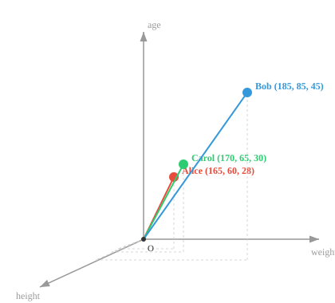
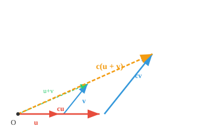

# 向量空间

*向量空间构成了机器学习的数学舞台。本文涵盖向量加法、标量乘法、封闭性公理、子空间，以及为什么AI中几乎所有东西都表示为向量。*

- 将向量空间想象成一种特定类型的舞台，数学对象生活在其中，每个对象被称为一个**向量**。

- 为了机器学习（ML）中的几何直觉，我们始终将向量视为欧几里得空间中的一个点，由其坐标表示。

- 向量 $\mathbf{a}$（数学上用粗体小写字母表示）有 $n$ 个坐标，每个坐标代表沿一个轴的位置。

$$\mathbf{a} = [a_1, a_2, a_3]$$


- 向量空间中的向量遵循一套非常具体、不可打破的规则：

    - **向量加法（组合）**：
    你可以取任意两个向量并将它们组合起来创建新向量。
    把向量想象成移动的指令。
    如果向量 A 表示"向前走 3 步"，向量 B 表示"向右走 2 步"，
    将它们相加（A + B）就创建了一条新的单一指令："向前走 3 步并向右走 2 步。"

    - **标量乘法（缩放）**：
    你可以使用一个普通数字（"标量"）来缩放任意向量。
    你可以拉伸它、缩小它或反转它。
    如果向量 A 是"向前走 3 步"，将其乘以 2 就变成"向前走 6 步。"
    将其乘以 -1 则完全翻转成"向后走 3 步。"

- 向量空间的**维度**是其包含的独立方向的数量。$\mathbb{R}^2$ 是二维的（需要 2 个坐标），而上面的 $\mathbf{a}$ 存在于 $\mathbb{R}^3$ 中。

- 例如，我们可以将任何对象（比如一个人）表示为一个向量，其中 $h_1$ = 身高（厘米），$h_2$ = 体重（公斤），$h_3$ = 年龄。

$$\mathbf{h} = [185, 75, 30]$$

- 我们现在已经创建了一个包含表示人的向量的向量空间。

- 我们可以表示多个人，并观察他们之间的远近！



- 我们可以添加更多特征，创建丰富的人体表示，在 ML 中通常称为特征向量。

- 你拥有的独特且有意义的特征越多，特征向量的描述性就越强，这是需要记住的一个重要因素。

- 超过 3 维后，向量变得非常难以直观检查，这催生了一个名为**线性代数**的数学领域。

- 现在，**线性代数**是研究向量、向量空间以及向量之间映射关系的学科。

- 我们在 AI/ML 中将几乎所有东西都表示为向量，这使得线性代数成为该领域的基石。

- 向量加法可以通过将一个向量放在另一个向量的尾部，然后从原点画到终点的可视化方式执行。


- 对于两个向量 $\mathbf{a} = (a_1, a_2)$ 和 $\mathbf{b} = (b_1, b_2)$：$\mathbf{a} + \mathbf{b} = (a_1 + b_1, a_2 + b_2)$

- 向量也可以相减，所有加法规则同样适用。

- 将向量乘以标量会在相同方向上按该因子缩放向量。


- 对于标量 $c$ 和向量 $\mathbf{v} = (v_1, v_2)$：$c\mathbf{v} = (cv_1, cv_2)$

- **加法封闭性**：如果将向量空间中的任意两个向量相加，结果也属于同一空间：如果 $\mathbf{u} \in V$ 且 $\mathbf{v} \in V$，则 $\mathbf{u} + \mathbf{v} \in V$

- **标量乘法封闭性**：如果将向量空间中的任意向量乘以标量，结果也属于同一空间：如果 $\mathbf{v} \in V$ 且 $c \in F$，则 $c\mathbf{v} \in V$

- **加法结合律**：对于任意三个向量 $\mathbf{u}$、$\mathbf{v}$ 和 $\mathbf{w}$：$(\mathbf{u} + \mathbf{v}) + \mathbf{w} = \mathbf{u} + (\mathbf{v} + \mathbf{w})$

- **加法交换律**：对于任意两个向量 $\mathbf{u}$ 和 $\mathbf{v}$：$\mathbf{u} + \mathbf{v} = \mathbf{v} + \mathbf{u}$


- 通过平行四边形的两条路径都到达同一点。

- **（零向量）**：存在一个向量 $\mathbf{0}$，使得对于任何向量 $\mathbf{v}$：$\mathbf{v} + \mathbf{0} = \mathbf{v}$


- **加法逆元**：对于每个向量 $\mathbf{v}$，存在一个向量 $-\mathbf{v}$，使得：$\mathbf{v} + (-\mathbf{v}) = \mathbf{0}$


- **分配律 1**：对于任意标量 $c$ 和向量 $\mathbf{u}$、$\mathbf{v}$：$c(\mathbf{u} + \mathbf{v}) = c\mathbf{u} + c\mathbf{v}$



- 缩放和（金色）与分别缩放向量再求和的结果相同。

- **分配律 2**：对于任意标量 $c$、$d$ 和向量 $\mathbf{v}$：$(c + d)\mathbf{v} = c\mathbf{v} + d\mathbf{v}$

- **结合律**：对于任意标量 $c$、$d$ 和向量 $\mathbf{v}$：$(cd)\mathbf{v} = c(d\mathbf{v})$

- **单位元**：对于任何向量 $\mathbf{v}$：$1\mathbf{v} = \mathbf{v}$，其中 $1$ 是标量域中的乘法单位元。

- **子空间**就是大空间内部的一个较小舞台。把三维空间想象成一个房间。一张穿过房间中心的平坦纸片就是一个子空间，穿过中心的一根直导线也是子空间。

- 关键要求是子空间必须经过原点。如果你把那片纸移开中心，它就不再是子空间了，因为零向量不再位于其上。


- 向量空间的所有规则（加法、缩放、封闭性）在子空间内部仍然有效。你可以在子空间内添加或缩放向量，永远不会"掉出"到更大的空间。

- 经过原点的直线是一维子空间，经过原点的平面是二维子空间，而整个空间是自身的子空间。

- 在 ML 中，子空间自然出现。高维数据通常具有存在于低维子空间上的结构。PCA 等技术找到那个子空间，这样我们可以更高效地处理数据。

## 编程练习（使用 CoLab 或 notebook）

1. 运行代码验证分配律性质，然后修改并尝试测试其他规则！
```python
import jax.numpy as jnp

u = jnp.array([1, 2])
v = jnp.array([3, 0])
c = 2

lhs = c * (u + v)
rhs = c*u + c*v

print(f"LHS: {lhs}")
print(f"RHS: {rhs}")
```

2. 运行代码可视化不同的向量，然后修改不同坐标的值以理解每个轴如何影响位置。
```python
import jax.numpy as jnp
import matplotlib.pyplot as plt

# 尝试修改这些向量！
a = jnp.array([3, 2, 4])
b = jnp.array([1, 4, 2])
c = jnp.array([4, 1, 3])

fig = plt.figure()
ax = fig.add_subplot(111, projection="3d")

for vec, name, color in [(a, "a", "red"), (b, "b", "blue"), (c, "c", "green")]:
    ax.quiver(0, 0, 0, *vec, color=color, arrow_length_ratio=0.1, linewidth=2, label=name)

lim = int(jnp.abs(jnp.stack([a, b, c])).max()) + 1
ax.set_xlim([0, lim]); ax.set_ylim([0, lim]); ax.set_zlim([0, lim])
ax.set_xlabel("X"); ax.set_ylabel("Y"); ax.set_zlabel("Z")
ax.legend()
plt.show()
```
