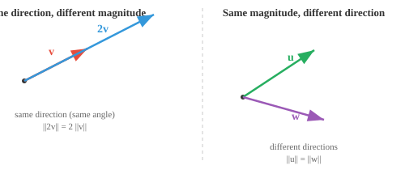

# 向量性质

*向量性质描述了定义向量行为的几何和代数特征。本文涵盖模长、方向、单位向量、相等性、平行性、正交性和线性无关性，它们是每个 ML 特征空间的基石。*

- 向量的**模长**（或长度）告诉你它延伸了*多远*。把它想象成箭头的长度。对于向量 $\mathbf{a} = (a_1, a_2, a_3)$，其模长为：

$$\|\mathbf{a}\| = \sqrt{a_1^2 + a_2^2 + a_3^2}$$

- 这只是勾股定理推广到更高维度，测量从原点到该点的直线距离。

- 向量的**方向**告诉你它指向*哪里*；只需想象从原点到坐标点的一条直线即可。

- 当没有明确指定原点时，我们通常隐含地使用 $(0,0,\ldots,0)$ 即中心点，至少为了可视化目的如此。

- 位置并不重要，它总是关于位移：从原点画出的向量 $(3, 2)$ 和从另一个点画出的同样的 $(3, 2)$ 仍然是相等的。


- 两个向量可以有相同的长度但指向完全不同的方向，或者指向相同方向但长度不同。



- 两个向量**相等**当且仅当它们所有对应的分量都匹配；相同的长度，相同的方向，完全相同的箭头。

$$\mathbf{a} = \mathbf{b} \iff a_i = b_i \text{ 对所有 } i$$

- 两个向量**平行**如果一个是另一个的标量倍数。它们沿着同一条直线，要么同向，要么完全反向。

$$\mathbf{a} \parallel \mathbf{b} \iff \mathbf{a} = k\mathbf{b} \text{ 对于某个标量 } k \neq 0$$


- 如果 $k > 0$，它们指向相同方向。如果 $k < 0$，它们指向相反方向。无论哪种情况，它们都位于经过原点的同一条直线上。

- 直观地说，平行向量不携带任何"新的"方向信息。一个只是另一个的拉伸或翻转版本。

- 两个向量**正交**（垂直）如果它们指向完全独立的方向。沿一个方向移动不会让你在另一个方向上有任何进展。


- 想象向北走然后向东走，这些是正交方向，无论向北走多远都不会使你向东移动。我们经常会遇到正交性。

- 正交性对 ML 至关重要：正交的特征携带完全独立的信息，这对于表示是最理想的。

- 更一般地，任意两个向量之间都有一个**夹角** $\theta$，范围从 $0°$ 到 $180°$。

- 这个角度捕捉了两个方向之间的全部关系：$0°$ 表示平行（相同方向），$180°$ 表示平行（相反方向），$90°$ 表示正交。介于之间的都是混合情况。

- ML 中的大多数向量关系都处在这个范围的某处。稍后，我们将看到精确的工具（点积、余弦相似度）来计算这个角度。

- 一组向量是**线性相关**的，如果其中至少一个可以通过缩放和相加从其他向量构造出来。它没有为该集合带来新的信息。

- 例如，如果 $\mathbf{c} = 2\mathbf{a} + 3\mathbf{b}$，那么 $\mathbf{c}$ 是冗余的，你已经通过 $\mathbf{a}$ 和 $\mathbf{b}$ 拥有了 $\mathbf{c}$ 所提供的全部信息。

- 平行向量总是线性相关的，因为一个只是另一个的缩放副本。任何包含零向量的集合也是线性相关的。

- 向量是**线性无关**的，如果其中没有一个能从其他向量构造出来。每个向量都贡献了一个真正的新方向。正交向量总是线性无关的。

- 在二维中，两个线性无关的向量可以到达平面上的任何点。在三维中，你需要三个。"需要多少个独立的向量"这个想法直接与维度相关。

- 当向量的大多数分量为零时，该向量是**稀疏**的。相反，大多数分量非零称为**稠密**。

$$\mathbf{s} = [0, 0, 3, 0, 0, 0, 1, 0, 0, 0]$$

- 稀疏性很重要，因为它影响存储和计算。稀疏向量可以通过只跟踪非零条目来更高效地存储和处理。

- **单位向量**是模长正好为 1 的向量。它纯粹表示方向，不包含长度信息。你可以通过除以模长将任何向量变成单位向量：

$$\hat{\mathbf{a}} = \frac{\mathbf{a}}{\|\mathbf{a}\|}$$

- 这个过程称为**归一化**。它剥离了"多远"，只保留"往哪走。"

- 标准单位向量指向每个轴：$\hat{\mathbf{i}} = (1, 0, 0)$，$\hat{\mathbf{j}} = (0, 1, 0)$，$\hat{\mathbf{k}} = (0, 0, 1)$。任何向量都可以写成这些向量的组合，例如 $(3, 2, 4) = 3\hat{\mathbf{i}} + 2\hat{\mathbf{j}} + 4\hat{\mathbf{k}}$。

## 编程练习（使用 CoLab 或 notebook）

1. 计算向量的模长并验证它符合勾股定理，然后修改代码计算单位向量。
```python
import jax.numpy as jnp

a = jnp.array([3.0, 4.0])

magnitude = jnp.sqrt(jnp.sum(a ** 2))
print(f"Magnitude of a: {magnitude}") 
```

2. 通过测试一个向量是否是另一个的标量倍数来检查两个向量是否平行。
```python
import jax.numpy as jnp

a = jnp.array([2, 4, 6])
b = jnp.array([1, 2, 3])

ratios = a / b
print(f"Ratios: {ratios}")
print(f"Parallel: {jnp.allclose(ratios, ratios[0])}")
```
