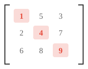
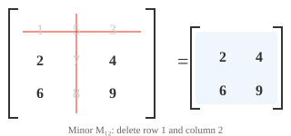

# 矩阵性质

*矩阵是存储数据集、编码变换和定义每个神经网络层的数据结构。本文涵盖矩阵维度、元素、转置、迹、行列式、逆、秩和零空间，这些是贯穿线性代数和 ML 的基础性质。*

- 核心而言，**矩阵**是按行列排列的数字矩形网格。如果向量是数字的单个列表，那么矩阵就是数字的一张表格。

```math
A = \begin{bmatrix} 1 & 2 & 3 \\ 4 & 5 & 6 \end{bmatrix}
```

- 你也可以将矩阵视为向量的堆叠。

- 如果一个人由向量 $[\text{age}, \text{height}, \text{weight}]$ 描述，那么三个人就形成一个矩阵，其中每行是一个人：

```math
\begin{bmatrix} 25 & 170 & 65 \\ 30 & 180 & 80 \\ 22 & 160 & 55 \end{bmatrix}
```

- 这个矩阵有 3 行和 3 列，所以我们称它为 $3 \times 3$ 矩阵。

- 网格中的每个数字称为一个**元素**或**条目**，由其行列标识：$A_{ij}$ 是第 $i$ 行第 $j$ 列的元素。

- 矩阵的**转置**沿其对角线翻转，将行变为列，列变为行。如果 $A$ 是 $m \times n$，那么 $A^T$ 是 $n \times m$。

```math
A = \begin{bmatrix} 1 & 2 & 3 \\ 4 & 5 & 6 \end{bmatrix} \quad \Rightarrow \quad A^T = \begin{bmatrix} 1 & 4 \\ 2 & 5 \\ 3 & 6 \end{bmatrix}
```

- 矩阵乘以其转置总是得到一个方阵：$AA^T$ 是 $m \times m$，$A^TA$ 是 $n \times n$。

- 方阵的**迹**是其对角线元素之和：$\text{tr}(A) = A_{11} + A_{22} + \cdots + A_{nn}$。迹等于特征值之和（我们稍后会看到）。



- 对于上面的矩阵，$\text{tr}(A) = 1 + 4 + 9 = 14$。只有高亮的对角线部分重要。

- 如果两个矩阵在不同基下表示相同的线性变换，它们的迹相同。迹是"与基无关的。"

- 矩阵的**秩**是线性无关的行（或等价地，列）的数量。它告诉你矩阵携带了多少"有用信息。"

- 例如，以下矩阵的秩为 2，因为两行之间互不为倍数：

```math
\begin{bmatrix} 1 & 2 \\ 3 & 4 \end{bmatrix}
```

但以下矩阵的秩为 1，因为第二行只是第一行的两倍，所以它没有增加新信息：

```math
\begin{bmatrix} 1 & 2 \\ 2 & 4 \end{bmatrix}
```

- 一个 $5 \times 3$ 矩阵的秩最多为 3。如果某些行只是其他行的缩放或组合版本，秩就会下降。具有最大可能秩的矩阵称为**满秩**。


- 方阵可逆（有逆矩阵）当且仅当它是满秩的。

- 秩通过**秩-零化度定理**与**零空间**（矩阵映射到零的向量的集合）相连：$\text{rank}(A) + \text{nullity}(A) = \text{列数 of } A$。矩阵保留的（秩）加上它破坏的（零化度）等于总维度。

- 矩阵的**列空间**是当你将矩阵乘以任意向量时所有可能输出的集合。它由矩阵的列张成。如果矩阵有 3 列但只有 2 列独立，列空间是一个二维平面，而不是整个三维空间。


- **行空间**是同样的概念，但从行的角度来看。秩等于列空间和行空间的维度，所以它们总是一致的。

- 一起来看，列空间告诉你"这个矩阵能产生什么输出？"零空间告诉你"什么输入被映射到零？"这两个空间完整描述了矩阵的功能。

- 方阵的**行列式**是一个标量，捕捉矩阵如何缩放空间。想象一个 $2 \times 2$ 矩阵将一个单位正方形变换成一个平行四边形。行列式就是那个平行四边形的面积（带有符号）。

```math
\det\begin{bmatrix} a & b \\ c & d \end{bmatrix} = ad - bc
```


- 例如：

```math
\det\begin{bmatrix} 2 & 1 \\ 0 & 3 \end{bmatrix} = 2 \cdot 3 - 1 \cdot 0 = 6
```

这个变换将单位正方形拉伸成一个面积为 6 的平行四边形。

- 如果行列式为正，变换保持定向（事物不会被"翻转"）。如果为负，它翻转定向（像镜面反射）。如果为零，矩阵将空间压缩到更低维度，将平行四边形坍缩成一条线或一个点。

- 行列式为零的矩阵称为**奇异矩阵**。它没有逆矩阵且已永久丢失信息。

- 对于大于 $2 \times 2$ 的矩阵，行列式使用**余子式**和**代数余子式**计算。**余子式** $M_{ij}$ 是通过删除第 $i$ 行和第 $j$ 列得到的较小矩阵的行列式。



- **代数余子式** $C_{ij} = (-1)^{i+j} M_{ij}$ 为每个余子式附加一个符号（像棋盘一样交替：$+, -, +, \ldots$）。整个矩阵的行列式然后沿着任意行或列求和：$\det(A) = \sum_j A_{1j} \cdot C_{1j}$。这称为**代数余子式展开**。

- 方阵 $A$ 的**逆**，记作 $A^{-1}$，是撤销 $A$ 的矩阵：$AA^{-1} = A^{-1}A = I$（单位矩阵）。只有非奇异矩阵才有逆。

- 对于 $2 \times 2$ 矩阵，逆有一个直接公式：

```math
\begin{bmatrix} a & b \\ c & d \end{bmatrix}^{-1} = \frac{1}{ad - bc}\begin{bmatrix} d & -b \\ -c & a \end{bmatrix}
```

注意分母中的行列式，这就是为什么奇异矩阵（行列式为零）没有逆。

- **条件数**衡量矩阵对其输入微小变化的敏感程度。它定义为 $\kappa(A) = \|A\| \cdot \|A^{-1}\|$。

- 接近 1 的条件数意味着矩阵是**良态的**：微小的输入变化产生微小的输出变化。大的条件数意味着它是**病态的**：微小的误差被极大放大。正交矩阵和单位矩阵的条件数为 1，而奇异矩阵的条件数为无穷大。

- 例如，以下矩阵的条件数为 $10^8$。一个方向被正常缩放，而另一个几乎被压缩为零，所以沿该方向的小扰动会被严重扭曲：

```math
\begin{bmatrix} 1 & 0 \\ 0 & 10^{-8} \end{bmatrix}
```

- 就像向量有范数（长度）一样，矩阵也有衡量其"大小"的**范数**。最常见的是**弗罗贝尼乌斯范数**，它将矩阵视为一个长向量并计算其长度：

```math
\|A\|_F = \sqrt{\sum_{i}\sum_{j} A_{ij}^2}
```

- 例如：

```math
\left\|\begin{bmatrix} 1 & 2 \\ 3 & 4 \end{bmatrix}\right\|_F = \sqrt{1 + 4 + 9 + 16} = \sqrt{30} \approx 5.48
```

- **谱范数** $\|A\|_2$ 是 $A$ 的最大奇异值。它衡量矩阵可以拉伸任何单位向量的最大程度。在 ML 中，矩阵范数用于权重正则化（惩罚大权重）和监控训练稳定性。

- 对称矩阵 $A$ 是**正定的**，如果对每个非零向量 $\mathbf{x}$：$\mathbf{x}^T A \mathbf{x} > 0$。这个二次型总是产生正数。

- 例如，以下矩阵是正定的：

```math
A = \begin{bmatrix} 2 & 1 \\ 1 & 3 \end{bmatrix}
```

取任意向量，比如 $\mathbf{x} = [1, -1]^T$：$\mathbf{x}^T A \mathbf{x} = 2 - 1 - 1 + 3 = 3 > 0$。无论你尝试哪个非零 $\mathbf{x}$，你总是得到正的结果。

- 正定矩阵很重要，因为它们保证优化问题有唯一的最小值。

- 如果条件放宽到 $\mathbf{x}^T A \mathbf{x} \geq 0$（允许为零），矩阵是**半正定**（PSD）。PSD 矩阵经常出现：协方差矩阵、SVM 中的核矩阵以及局部最小值处的 Hessian 矩阵都是 PSD。区别在于 PSD 允许某些方向是"平坦的"（零曲率），而不是严格向上弯曲。

## 编程练习（使用 CoLab 或 notebook）

1. 计算矩阵的迹、秩和行列式。尝试使一行成为另一行的倍数，观察秩和行列式如何变化。
```python
import jax.numpy as jnp

A = jnp.array([[1.0, 2.0],
               [3.0, 4.0]])

print(f"Trace: {jnp.trace(A)}")
print(f"Rank: {jnp.linalg.matrix_rank(A)}")
print(f"Determinant: {jnp.linalg.det(A):.2f}")
```

2. 计算矩阵的逆，将其乘以原矩阵，验证得到单位矩阵。然后尝试奇异矩阵并观察会发生什么。
```python
import jax.numpy as jnp

A = jnp.array([[1.0, 2.0],
               [3.0, 4.0]])

A_inv = jnp.linalg.inv(A)
print(f"A * A_inv:\n{A @ A_inv}")
```
