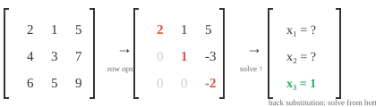
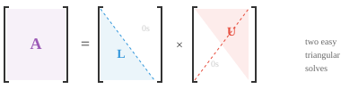

# 矩阵分解

*矩阵分解将复杂矩阵拆分为更简单的因子，用于求解方程组、计算逆矩阵和数据压缩。本文涵盖高斯消元、LU、QR、Cholesky、特征分解和SVD——这些算法是PCA、推荐系统和机器学习数值稳定性的基石。*

- 矩阵分解（或因子分解）将一个矩阵拆分成更容易处理的更简单的部分。可以把它类比为因数分解：$12 = 3 \times 4$ 比单独的12更容易理解。

- 我们分解矩阵是为了更快地求解方程组、稳定地计算逆矩阵、寻找特征值、压缩数据以及理解变换的几何结构。

- 最基本的技术是**高斯消元**（行化简）。思路很简单：给定方程组 $A\mathbf{x} = \mathbf{b}$，使用三种允许的操作简化 $A$，直到答案显而易见。

- 这些操作是：交换两行、将一行乘以非零标量、或将一行的倍数加到另一行上。

- 例如，要消除主元下方的第一列，从下面的行中减去第1行的倍数：

```math
\begin{bmatrix} 2 & 1 & 5 \\ 4 & 3 & 7 \\ 6 & 5 & 9 \end{bmatrix} \xrightarrow{R_2 - 2R_1} \begin{bmatrix} 2 & 1 & 5 \\ 0 & 1 & -3 \\ 6 & 5 & 9 \end{bmatrix} \xrightarrow{R_3 - 3R_1} \begin{bmatrix} 2 & 1 & 5 \\ 0 & 1 & -3 \\ 0 & 2 & -6 \end{bmatrix}
```

- 目标是**行阶梯形（REF）**：每个主元（每行第一个非零条目）下方全为零，且每个主元在其上方主元的右侧。矩阵呈现阶梯形状。



- 进一步得到**简化行阶梯形（RREF）**，使每个主元为1且是该列中唯一的非零条目。每个矩阵有唯一的RREF。

- 一旦转换为三角形形式，我们通过**回代**求解：最下面一行直接给出最后一个变量，然后向上求解。

- 这是所有其他分解方法所建立的基础，分解的目标就是将矩阵简化为三角形形式，从而可以通过回代求解变量。

- **LU分解**将高斯消元形式化，将方阵分解为 $A = LU$（或通过行交换得到 $A = PLU$），其中 $L$ 是下三角矩阵，$U$ 是上三角矩阵。



- 求解 $A\mathbf{x} = \mathbf{b}$：先通过前向代入（从上到下）求解 $L\mathbf{y} = \mathbf{b}$，然后通过回代（从下到上）求解 $U\mathbf{x} = \mathbf{y}$。两次简单的三角求解代替了一次困难的一般求解。

- 相比原始高斯消元的优势在于可复用。一旦得到 $L$ 和 $U$，就可以对许多不同的 $\mathbf{b}$ 向量求解，而无需重新进行分解。

- 如果你需要用1000个不同的右端项求解同一个方程组（这在模拟中很常见），只需分解一次然后重复使用。

- 当矩阵是对称正定矩阵时（如协方差矩阵），我们可以做得更好。

- **Cholesky分解**将其分解为 $A = LL^T$，其中 $L$ 是下三角矩阵。例如：

```math
\begin{bmatrix} 4 & 2 \\ 2 & 5 \end{bmatrix} = \begin{bmatrix} 2 & 0 \\ 1 & 2 \end{bmatrix} \begin{bmatrix} 2 & 1 \\ 0 & 2 \end{bmatrix}
```

- 这大约比LU快两倍，并且保证数值稳定。可以将其视为矩阵的"平方根"。

- 如果分解失败（平方根下出现负值），则该矩阵不是正定的。因此Cholesky分解也可以作为正定性的检验方法。

- 方阵 $A$ 的**特征向量**是特殊方向，该变换在这些方向上只进行拉伸或压缩，而不旋转。**特征值**是缩放因子：

$$A\mathbf{x} = \lambda\mathbf{x}$$


- 大多数向量在乘以矩阵时方向会改变。但特征向量是特殊的：输出方向与输入方向相同，仅被 $\lambda$ 缩放。如果 $\lambda = 2$，特征向量长度加倍。如果 $\lambda = -1$，它翻转方向。如果 $\lambda = 0$，它被压缩为零。

- 例如，对于：

```math
A = \begin{bmatrix} 3 & 1 \\ 0 & 2 \end{bmatrix}
```

  向量 $[1, 0]^T$ 是特征向量，$\lambda = 3$，因为 $A[1, 0]^T = [3, 0]^T = 3[1, 0]^T$。

- 求特征值需要解**特征多项式** $\det(A - \lambda I) = 0$。根即为特征值。然后将每个 $\lambda$ 代回 $(A - \lambda I)\mathbf{x} = \mathbf{0}$ 中，求出对应的特征向量。

- 关键性质：

    - $A$ 的迹等于其特征值之和。
    - $A$ 的行列式等于其特征值之积。
    - 对称矩阵的特征向量互相垂直，特征值为实数。
    - 正定矩阵的所有特征值为正。
    - 协方差矩阵（我们将在统计学中遇到）总是半正定的。

- 通过特征多项式计算特征值对于大型矩阵来说是不切实际的。相反，使用迭代方法：

    - **幂迭代**：反复乘以 $A$ 并归一化。收敛到主特征向量（最大特征值）。简单但只能找到一个特征对。

    - **QR算法**：最常用的方法。使用QR分解反复分解和重组矩阵，直到矩阵收敛到三角形形式，对角线上的元素即为所有特征值。

    - **反迭代**：寻找最接近给定目标值的特征向量。当你大致知道想要哪个特征值时很有用。

    - 对于大型稀疏矩阵，**Arnoldi**和**Lanczos**迭代利用稀疏性提高效率。

- 如果方阵有一组完整的线性无关的特征向量，它可以被**对角化**：$A = PDP^{-1}$，其中 $D$ 是以特征值为对角元的对角矩阵，$P$ 的列是特征向量。

- 这有什么用？对角矩阵非常容易处理。需要计算 $A^{100}$？不用将 $A$ 自乘100次，计算 $PD^{100}P^{-1}$ 即可——而对角矩阵的幂只需独立地对每个对角元求幂。这将一个昂贵的运算变成了廉价运算。

- **特征基**是完全由特征向量构成的基。在这个基下，矩阵变成对角矩阵，变换仅仅是沿每个特征向量方向的独立缩放。这就像是找到了变换的自然坐标系。

- **QR分解**将任意矩阵 $A$ 分解为 $A = QR$，其中 $Q$ 是正交矩阵（其列是标准正交的），$R$ 是上三角矩阵。可以理解为将"方向"信息（$Q$）与"缩放和混合"信息（$R$）分开。

- **Gram-Schmidt过程**逐列构建 $Q$。取 $A$ 的第一列并归一化。取第二列，减去其在第一列上的投影（使其垂直），再归一化。对每一列重复此过程。结果是一组标准正交向量。

- QR分解是QR算法求特征值背后的引擎。它也直接用于求解最小二乘问题：当 $A\mathbf{x} = \mathbf{b}$ 没有精确解（方程多于未知数）时，QR找到最佳近似解。

- **SVD**（奇异值分解）是最通用、也可以说是最重要的分解。每个矩阵（任意形状、任意秩）都有SVD：$A = U\Sigma V^T$

    - $V^T$（$n \times n$，正交）：旋转输入
    - $\Sigma$（$m \times n$，对角）：沿正交坐标轴缩放（奇异值，非负，递减排列）
    - $U$（$m \times m$，正交）：旋转输出


- 几何上，SVD表明每个线性变换，无论多么复杂，都只是一个旋转、一个沿坐标轴的拉伸、再一个旋转的组合。一个圆变成了一个椭圆。

- 奇异值（$\sigma_1 \geq \sigma_2 \geq \ldots$）揭示了每个方向的"重要性"。大的奇异值对应最重要的方向。$A$ 的秩等于非零奇异值的个数。

- **低秩近似**：只保留最大的 $k$ 个奇异值，将其他置零，就得到了 $A$ 的最佳秩-$k$ 近似。这就是图像压缩的原理：一张 $1000 \times 1000$ 的图像可能只需要 $k = 50$ 个奇异值就能看起来几乎一模一样，压缩了20倍。

- SVD也提供了伪逆：$A^+ = V\Sigma^+U^T$，其中 $\Sigma^+$ 是对非零奇异值取倒数。

- 特征分解只对方阵有效，而SVD对任意矩阵都有效。这是它的关键优势。

- **PCA**（主成分分析）使用特征分解（或SVD）进行降维。

- 想象一个数据集，每个样本有100个特征（堆叠成矩阵的100维向量）。其中许多特征是相关的、冗余的。

- PCA找到数据实际变化的那些方向，让你只保留重要的部分。


- 第一主成分（PC1）是方差最大的方向。

- 第二主成分（PC2）捕获剩余部分的最大方差，且与第一主成分垂直。

- 如果大部分方差只集中在少数几个方向上，你可以将数据投影到这些维度上，丢弃其余部分，损失极小。

- 步骤：

    - 标准化数据（减去均值，除以标准差），使所有特征贡献平等
    - 计算协方差矩阵
    - 求其特征值和特征向量
    - 选择 $k$ 个最大特征值对应的特征向量（即主成分）
    - 将数据投影到这些主成分上

- 标准化至关重要：如果不做标准化，用公里测量的特征会主导用厘米测量的特征，而不论其实际重要性如何。

- 在实践中，PCA用于可视化（将高维数据投影到2D或3D）、降噪（丢弃主要是噪声的低方差方向），以及通过减少输入特征数量来加速机器学习模型。

- **核PCA**将PCA扩展到非线性关系。它通过核函数将数据映射到更高维空间，在那里结构变得线性，然后应用标准PCA并投影回来。

- **Schur分解**将方阵分解为 $A = QTQ^\ast$，其中 $Q$ 是酉矩阵，$T$ 是上三角矩阵。每个方阵都有Schur分解，即使它不能被对角化。

- **非负矩阵分解（NMF）** 将一个矩阵分解为两个非负矩阵：$A \approx WH$，其中 $W$ 和 $H$ 的所有条目都 $\geq 0$。与可能产生负条目的SVD不同，NMF只做加法，从不做减法。这使得各部分可解释：在主题建模中，$W$ 给出每个文档的主题权重，$H$ 给出每个主题的词权重，全部非负，这与我们对文档"包含多少某个主题"的思考方式相符。

- **谱定理**指出，对称（或Hermitian）矩阵总可以用正交（或酉）矩阵对角化。它们的特征值总是实数，特征向量总是正交的。这是PCA的理论基础。

## 编程练习（使用CoLab或Jupyter Notebook）

1. 计算对称矩阵的特征值和特征向量。验证特征向量互相垂直，并从特征分解重建矩阵。

```python
import jax.numpy as jnp

A = jnp.array([[4.0, 2.0],
               [2.0, 3.0]])

eigenvalues, eigenvectors = jnp.linalg.eigh(A)
print(f"Eigenvalues: {eigenvalues}")
print(f"Eigenvectors orthogonal: {jnp.dot(eigenvectors[:,0], eigenvectors[:,1]):.6f}")

# Reconstruct: A = P D P^T
D = jnp.diag(eigenvalues)
A_reconstructed = eigenvectors @ D @ eigenvectors.T
print(f"Reconstruction matches: {jnp.allclose(A, A_reconstructed)}")
```

2. 实现幂迭代求最大特征值，以及反迭代求最小特征值。与 `jnp.linalg.eigh` 比较。然后尝试自己实现QR算法。

```python
import jax.numpy as jnp

A = jnp.array([[4.0, 2.0],
               [2.0, 3.0]])

# Power iteration: finds the LARGEST eigenvalue
v = jnp.array([1.0, 0.0])
for _ in range(20):
    v = A @ v
    v = v / jnp.linalg.norm(v)
print(f"Largest eigenvalue:  {v @ A @ v:.4f}")

# Inverse iteration: multiply by A^{-1} instead of A, finds the SMALLEST eigenvalue
v = jnp.array([1.0, 0.0])
for _ in range(20):
    v = jnp.linalg.solve(A, v)
    v = v / jnp.linalg.norm(v)
print(f"Smallest eigenvalue: {1.0 / (v @ jnp.linalg.solve(A, v)):.4f}")

print(f"jnp.linalg.eigh:    {jnp.linalg.eigh(A)[0]}")
```

3. 计算矩阵的SVD，然后仅使用前k个奇异值重建矩阵，观察近似质量随k的变化。

```python
import jax.numpy as jnp

A = jnp.array([[1.0, 2.0, 3.0],
               [4.0, 5.0, 6.0],
               [7.0, 8.0, 9.0]])

U, S, Vt = jnp.linalg.svd(A)

for k in [1, 2, 3]:
    approx = U[:, :k] @ jnp.diag(S[:k]) @ Vt[:k, :]
    error = jnp.linalg.norm(A - approx)
    print(f"k={k}, reconstruction error: {error:.4f}")
```
