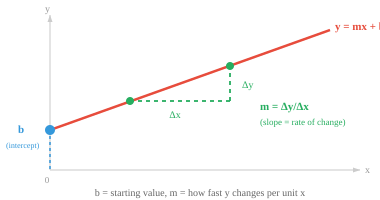
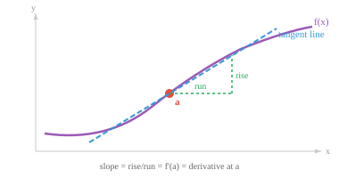

# 微分

*微分学研究瞬时变化率。本节涵盖极限、导数、微分法则、链式法则（反向传播的基础），以及机器学习中常用的导数。*

- 在前面的章节中，我们学会了如何将数据表示为向量，并用矩阵对其进行变换。但现实世界中的许多现象并非静止不变的。汽车在加速，股价在波动，神经网络的损失随着权重的更新而变化。**微积分**是研究变化的数学。

- 微积分回答两个问题：某个量在当前时刻变化得有多快？（微分学）以及它在一段时间内累积了多少？（积分学）。本节讨论的是"多快"的问题。

- 想象一下你正在开车，瞥了一眼车速表。上面显示 60 km/h。这个数字不是你整个行程的平均速度，而是你在这一瞬间的瞬时速度。微分学为我们提供了计算这种瞬时变化率的工具。

- 但首先，让我们回顾一下直线方程：$y = mx + b$。

- 这是两个量之间最简单的关系。

    - $b$ 是 **y 截距**，即直线与 y 轴的交点（当 $x = 0$ 时的起始值）。
    - $m$ 是**斜率**，即变化率：$x$ 每增加 1 个单位，$y$ 就变化 $m$ 个单位。
- 如果 $m = 3$，直线陡峭上升；如果 $m = 0$，直线水平；如果 $m = -2$，直线下降。

- 斜率计算公式为 $m = \frac{\Delta y}{\Delta x} = \frac{y_2 - y_1}{x_2 - x_1}$，即"$y$ 变化了多少"与"$x$ 变化了多少"的比值。



- 一旦知道了 $m$ 和 $b$，就可以计算任意 $x$ 对应的 $y$ 值。

- 例如，若 $m = 2$ 且 $b = 3$，则在 $x = 5$ 处：$y = 2(5) + 3 = 13$。

- 这两个参数完全决定了这条直线，预测任何输出只需代入公式即可。

- 对于直线，斜率处处相同。

- 这一思想可以推广到直线之外。任何函数都是一个将输入映射到输出的规则，一旦知道了它的公式（参数和形状），就可以计算任意输入对应的输出，并将结果绘制成图。

- $y = x^2$ 给出抛物线，$y = \sin(x)$ 给出波形，$y = e^x$ 给出指数增长。每个公式都定义了一条特定的曲线，能够熟练地将函数理解为一种形状，对于后续内容至关重要。

- 对于直线，斜率处处相同。但大多数有趣的函数都是弯曲的，因此斜率在不同点处各不相同。微积分给了我们一种方法来求曲线上任意一点的斜率。

- 我们还需要**极限**的概念。极限描述的是当输入越来越接近某个目标值时，函数趋近于什么值，而不一定非要达到该值。

$$\lim_{x \to a} f(x) = L$$

- 这读作："当 $x$ 趋近于 $a$ 时，$f(x)$ 趋近于 $L$。"函数在 $x = a$ 处不一定等于 $L$，只需无限接近即可。

- 例如，考虑 $f(x) = \frac{x^2 - 1}{x - 1}$。如果直接代入 $x = 1$，会得到 $\frac{0}{0}$，这是未定义的。

- 但尝试接近 1 的值：$f(0.9) = 1.9$，$f(0.99) = 1.99$，$f(1.01) = 2.01$。输出显然朝着 2 靠近。

- 从代数角度看，我们可以理解原因：将分子因式分解为 $(x-1)(x+1)$，约去 $(x-1)$ 项，对于所有 $x \neq 1$ 得到 $f(x) = x + 1$。因此当 $x \to 1$ 时，$f(x) \to 2$。

- 该函数在 $x = 1$ 处有一个空洞，但极限仍然存在。

- 极限是微积分中其他一切内容的基础。

- 函数 $f(x)$ 在点 $x = a$ 处的**导数**衡量的是瞬时变化率。从几何角度看，它是该点处曲线切线的斜率。



- 要计算这个斜率，我们首先在曲线上取两个点，计算通过这两个点的直线（**割线**）的斜率。然后让第二个点逐渐靠近第一个点，观察割线的斜率趋近于什么值。这就是**差商**：

$$f'(a) = \lim_{h \to 0} \frac{f(a + h) - f(a)}{h}$$


- 分子 $f(a+h) - f(a)$ 是输出的变化量。分母 $h$ 是输入的变化量。它们的比值是在一个极小区间上的平均变化率。当 $h \to 0$ 时，这个平均值就变成了瞬时变化率。

- 例如，设 $f(x) = x^2$。在 $x = 3$ 处：

$$f'(3) = \lim_{h \to 0} \frac{(3+h)^2 - 9}{h} = \lim_{h \to 0} \frac{9 + 6h + h^2 - 9}{h} = \lim_{h \to 0} (6 + h) = 6$$

- 因此在 $x = 3$ 处，函数 $x^2$ 以每单位输入变化 6 单位输出的速率增加。

- 如果这个极限存在，则称函数在该点是**可微**的。要做到这一点，函数必须连续（没有跳跃）、光滑（没有尖角），并且在点附近有定义。

- 如果你能笔不离纸地画出曲线，且没有任何折点，那么它在该点很可能是可微的。

- 每次都从极限定义出发计算导数会很繁琐。幸运的是，少数几条法则就能让我们快速微分几乎任何函数。

- **常数法则**：常数的导数为零。若 $f(x) = 5$，则 $f'(x) = 0$。水平线的斜率为零。

- **幂法则**：微分的主力法则。将指数提到前面，然后将指数减一：

$$\frac{d}{dx} x^n = n x^{n-1}$$

- 例如：$\frac{d}{dx} x^3 = 3x^2$。三次函数变成了二次函数。该法则适用于任何实数指数，包括负数和分数：$\frac{d}{dx} x^{-1} = -x^{-2}$ 以及 $\frac{d}{dx} \sqrt{x} = \frac{d}{dx} x^{1/2} = \frac{1}{2}x^{-1/2}$。

- **和/差法则**：逐项求导。

$$\frac{d}{dx}[f(x) \pm g(x)] = f'(x) \pm g'(x)$$

- **乘积法则**：当两个函数相乘时，导数并非简单地将各自的导数相乘。而是：

$$\frac{d}{dx}[f(x) \cdot g(x)] = f'(x)g(x) + f(x)g'(x)$$

- 可以这样理解："第一个的变化率乘以第二个，加上第一个乘以第二个的变化率。"例如，$\frac{d}{dx}[x^2 \sin x] = 2x \sin x + x^2 \cos x$。

- **商法则**：对于函数的比值：

$$\frac{d}{dx}\left[\frac{f(x)}{g(x)}\right] = \frac{f'(x)g(x) - f(x)g'(x)}{[g(x)]^2}$$

- 一个有用的记忆口诀："上导下不导减去上不导下导，除以分母的平方。"

- **链式法则**：对机器学习最重要的法则。当函数复合（一个函数嵌套在另一个函数内部）时，导数等于沿链各导数的乘积：

$$\frac{d}{dx} f(g(x)) = f'(g(x)) \cdot g'(x)$$

- 可以把它想象成剥洋葱。先对外层函数求导（内层函数保持不变），然后乘以内层函数的导数。


- 例如，$\frac{d}{dx} (3x + 1)^5 = 5(3x+1)^4 \cdot 3 = 15(3x+1)^4$。外层函数是 $(\cdot)^5$，内层是 $3x+1$。

- 链式法则是神经网络中**反向传播**的数学基础。一个深层网络就是一个由多个复合函数组成的长链。要计算损失相对于每个权重的变化率，我们从输出层开始逐层向输入层反复应用链式法则，将每一步的局部导数相乘。

- 以下是你会遇到的最常见导数。每一个都可以从极限定义推导出来，但熟记它们可以节省时间：

| 函数 | 导数 | 备注 |
|---|---|---|
| $e^x$ | $e^x$ | 唯一一个导数等于自身的函数 |
| $a^x$ | $a^x \ln a$ | 指数函数的一般形式 |
| $\ln x$ | $\frac{1}{x}$ | 自然对数 |
| $\log_a x$ | $\frac{1}{x \ln a}$ | 一般对数 |
| $\sin x$ | $\cos x$ | |
| $\cos x$ | $-\sin x$ | 注意负号 |
| $\tan x$ | $\sec^2 x$ | |

- 指数函数 $e^x$ 非常特别：它是唯一一个导数等于自身的函数。这就是为什么 $e$ 在机器学习中无处不在，从 softmax 激活函数到概率分布都能见到它的身影。

- **洛必达法则**用于处理形如 $\frac{0}{0}$ 或 $\frac{\infty}{\infty}$ 的不定式极限。当直接代入得到这类形式时，可以分别对分子和分母求导，然后再次尝试求极限：

$$\lim_{x \to a} \frac{f(x)}{g(x)} = \lim_{x \to a} \frac{f'(x)}{g'(x)}$$

- 条件：$f$ 和 $g$ 都必须在 $a$ 附近可微，并且 $g'(x)$ 在 $a$ 附近（可能除去 $a$ 本身）不为零。原极限必须是不定式。

- 例如：$\lim_{x \to 0} \frac{\sin x}{x}$。直接代入得到 $\frac{0}{0}$。应用洛必达法则：$\lim_{x \to 0} \frac{\cos x}{1} = 1$。这个极限是基础的，在信号处理和傅里叶分析中都会出现。

- 如果结果仍然是不定式，可以反复应用该法则。例如，$\lim_{x \to 0} \frac{1 - \cos x}{x^2}$ 得到 $\frac{0}{0}$。第一次应用：$\lim_{x \to 0} \frac{\sin x}{2x}$，仍然是 $\frac{0}{0}$。第二次应用：$\lim_{x \to 0} \frac{\cos x}{2} = \frac{1}{2}$。

- 如果两个函数是可微的，那么它们的和、差、积、复合以及商（分母不为零时）也是可微的。这就是为什么我们可以自信地对由简单部分组成的复杂表达式进行微分。

## 编程练习（使用 CoLab 或 notebook）

1. 可视化常见函数。在同一张图中绘制 $x^2$、$\sin(x)$ 和 $e^x$，建立对不同公式产生不同形状的直观感受。尝试修改参数（例如 $2x^2$、$\sin(2x)$），观察曲线如何变化。
```python
import jax.numpy as jnp
import matplotlib.pyplot as plt

x = jnp.linspace(-3, 3, 300)

fig, axes = plt.subplots(1, 3, figsize=(12, 3))
axes[0].plot(x, x**2, color="#e74c3c")
axes[0].set_title("x²  (抛物线)")
axes[1].plot(x, jnp.sin(x), color="#3498db")
axes[1].set_title("sin(x)  (波形)")
axes[2].plot(x, jnp.exp(x), color="#27ae60")
axes[2].set_title("eˣ  (指数函数)")
for ax in axes:
    ax.axhline(0, color="gray", linewidth=0.5)
    ax.axvline(0, color="gray", linewidth=0.5)
plt.tight_layout()
plt.show()
```

2. 使用 JAX 的自动微分计算 $f(x) = x^3 - 2x + 1$ 在若干点处的导数，并与解析导数 $f'(x) = 3x^2 - 2$ 进行比较。
```python
import jax
import jax.numpy as jnp

f = lambda x: x**3 - 2*x + 1
df = jax.grad(f)

for x in [0.0, 1.0, 2.0, -1.0]:
    print(f"x={x:5.1f}  自动微分: {df(x):.4f}  解析解: {3*x**2 - 2:.4f}")
```

2. 数值验证链式法则。定义 $f(x) = \sin(x^2)$，通过 `jax.grad` 计算其导数，并与解析结果 $2x\cos(x^2)$ 进行比较。
```python
import jax
import jax.numpy as jnp

f = lambda x: jnp.sin(x**2)
df = jax.grad(f)

for x in [0.5, 1.0, 2.0]:
    auto = df(x)
    analytical = 2*x * jnp.cos(x**2)
    print(f"x={x:.1f}  自动微分: {auto:.6f}  解析解: {analytical:.6f}")
```

3. 可视化导数。将 $f(x) = x^3 - 3x$ 与其导数 $f'(x) = 3x^2 - 3$ 绘制在同一张图上。观察 $f'(x) = 0$ 的位置与 $f$ 的峰谷之间的对应关系。
```python
import jax
import jax.numpy as jnp
import matplotlib.pyplot as plt

f = lambda x: x**3 - 3*x
# jax.grad 用于标量；jax.vmap 将其向量化，可同时处理一组输入
df = jax.vmap(jax.grad(f))

x = jnp.linspace(-2.5, 2.5, 200)
plt.plot(x, jax.vmap(f)(x), label="f(x)")
plt.plot(x, df(x), label="f'(x)", linestyle="--")
plt.axhline(0, color="gray", linewidth=0.5)
plt.legend()
plt.title("函数及其导数")
plt.show()
```
