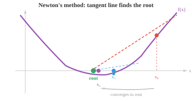

# 优化

*优化是模型训练的数学核心——寻找使损失函数最小的参数。本文涵盖驻点、凸性、梯度下降、牛顿法、带拉格朗日乘数的约束优化，以及驱动现代深度学习的主流优化器（SGD、Adam）。*

- 训练神经网络、拟合回归线、调优超参数：几乎所有机器学习算法的核心都是一个**优化**问题。

- 我们有一个函数（损失函数、代价函数、目标函数），希望找到使其尽可能小（或大）的输入。

- 在优化之前，我们需要理解函数的**零点**（或根）。$f(x)$ 的零点是指满足 $f(x) = 0$ 的 $x$ 值。从图形上看，这些点就是与 x 轴的交点。

- 例如，$f(x) = x^2 - 3x + 2 = (x-1)(x-2)$ 的零点在 $x = 1$ 和 $x = 2$ 处。在两个零点之间，函数为负（$f(1.5) = -0.25$）；在零点之外，函数为正。零点将数轴分割成若干个区域，在每个区域中函数保持相同符号。

- 零点的**重数**是指对应因式出现的次数。

- 在单零点（重数为 1）处，图像穿过 x 轴。在二重零点（重数为 2）处，图像接触 x 轴但反弹回去而不穿过，在该点处看起来是"平坦"的。

- 寻找零点之所以重要，是因为导数 $f'(x)$ 的零点正是 $f(x)$ 的**驻点**——即极大值或极小值的候选点。

- 在极大值或极小值处，切线是水平的（斜率为 0），因此 $f'(x) = 0$。


- 但并非每个驻点都是极大值或极小值。$f'(x) = 0$ 的点也可能是**拐点**（如 $f(x) = x^3$ 在 $x = 0$ 处），函数在该点暂时变平但并未改变方向。

- **二阶导数检验**可以解决这个问题。在驻点 $x = c$（即 $f'(c) = 0$）处：

    - 若 $f''(c) > 0$：曲线向下凸（碗状），因此 $c$ 是**局部极小值**。
    - 若 $f''(c) < 0$：曲线向上凸（山丘状），因此 $c$ 是**局部极大值**。
    - 若 $f''(c) = 0$：检验无效，需要使用更高阶导数或其他方法。

- 例如，$f(x) = x^3 - 3x$。导数为 $f'(x) = 3x^2 - 3 = 3(x-1)(x+1)$，因此驻点在 $x = -1$ 和 $x = 1$ 处。二阶导数为 $f''(x) = 6x$。在 $x = -1$ 处：$f''(-1) = -6 < 0$（局部极大值）。在 $x = 1$ 处：$f''(1) = 6 > 0$（局部极小值）。

- 如果连接函数图像上任意两点的线段位于图像之上（或与之重合），则该函数是**凸的**。可以想象成一个碗形，处处向上弯曲。数学上，若对所有 $x$ 有 $f''(x) \geq 0$，则 $f$ 是凸函数。


- 凸性的强大之处在于凸函数有一个卓越的性质：每个局部极小值同时也是**全局最小值**。不存在会让人陷入的欺骗性局部低谷。如果你把一个球滚入凸碗中，它总是会到达底部。

- 若 $-f$ 是凸的，则函数是**凹的**（向下弯曲）。函数从凹性过渡到凸性的点称为**拐点**，出现在 $f''(x) = 0$ 处。

- **牛顿法**利用切线寻找函数的零点（进而也可用于寻找其导数的驻点）。从初始猜测 $x_0$ 出发，迭代更新：

$$x_{n+1} = x_n - \frac{f(x_n)}{f'(x_n)}$$



- 其思想是：在 $x_n$ 处画出切线，找到它与 x 轴的交点，该交点即为 $x_{n+1}$。对于性质良好且初始点选取恰当的函数，牛顿法收敛非常快（二次收敛，即每步正确位数大致翻倍）。

- 例如，求 $\sqrt{5}$（即 $f(x) = x^2 - 5$ 的零点）：$f'(x) = 2x$，因此 $x_{n+1} = x_n - \frac{x_n^2 - 5}{2x_n}$。从 $x_0 = 2$ 开始：$x_1 = 2.25$，$x_2 = 2.2361\ldots$，已精确到小数点后四位。

- 如果初始猜测离根太远、根附近 $f'(x) = 0$，或函数在附近有拐点，牛顿法可能会失败。此外，它还需要计算导数，这可能代价高昂。

- 对于优化（寻找极小值而非零点），我们将牛顿法应用于 $f'(x) = 0$，得到更新公式：

$$x_{n+1} = x_n - \frac{f'(x_n)}{f''(x_n)}$$

- 在多维情形下，这变为 $\mathbf{x}_{n+1} = \mathbf{x}_n - H^{-1} \nabla f(\mathbf{x}_n)$，其中 $H$ 是 Hessian 矩阵。这正是上一节中二阶泰勒近似的实际应用：将函数近似为二次型，跳到该二次型的极小值点，然后重复。

- **拉格朗日乘数**用于求解**约束优化**：在约束条件 $g(x, y) = c$ 下求 $f(x, y)$ 的最优值。我们不是在 $\mathbb{R}^n$ 中全域搜索，而是限制在约束条件成立的集合（一条曲线或曲面）上。

- 关键见解是几何层面的：在约束最优解处，$f$ 的梯度必须与 $g$ 的梯度平行。如果它们不平行，我们可以沿着约束条件朝某个方向移动，从而继续改进 $f$ 的值，这意味着还没有达到最优。

- 我们引入一个新变量 $\lambda$（拉格朗日乘数），定义**拉格朗日函数**：

$$\mathcal{L}(x, y, \lambda) = f(x, y) - \lambda(g(x, y) - c)$$

- 令所有偏导数为零，得到一个方程组，其解即为约束最优解：

$$\frac{\partial \mathcal{L}}{\partial x} = 0, \quad \frac{\partial \mathcal{L}}{\partial y} = 0, \quad \frac{\partial \mathcal{L}}{\partial \lambda} = 0$$


- 例如，在 $x^2 + y^2 = 1$ 的约束下最大化 $f(x,y) = x^2 y$。拉格朗日函数为 $\mathcal{L} = x^2 y - \lambda(x^2 + y^2 - 1)$。求偏导：

$$2xy - 2\lambda x = 0, \quad x^2 - 2\lambda y = 0, \quad x^2 + y^2 = 1$$

- 由第一个方程（假设 $x \neq 0$）：$\lambda = y$。代入第二个方程：$x^2 = 2y^2$。结合约束条件：$2y^2 + y^2 = 1$，得 $y = \frac{1}{\sqrt{3}}$。最大值为 $f = \frac{2}{3\sqrt{3}}$。

- 对于不等式约束（$g(x,y) \leq c$ 而非 $= c$），**Karush-Kuhn-Tucker（KKT）条件**推广了拉格朗日乘数法。约束要么是激活的（有效约束，按等式处理），要么是非激活的（解在内部，约束无关紧要）。

- 在实践中，我们很少手工进行优化。以下是主要的算法家族：

    - **一阶方法**（仅使用梯度）：梯度下降、随机梯度下降（SGD）、Adam。这些方法每步计算成本低，但收敛可能较慢，尤其是在病态问题上。

    - **二阶方法**（使用梯度和 Hessian 矩阵）：牛顿法收敛快，但计算和求逆 Hessian 矩阵代价高昂（对于 $n$ 个参数为 $O(n^3)$）。**拟牛顿法**（如 BFGS 和 L-BFGS）仅利用梯度信息近似 Hessian 矩阵，比一阶方法收敛更快，又无需承担完全的二阶方法计算成本。

    - **共轭梯度法**：适用于大型稀疏系统，仅需矩阵-向量乘积，无需存储完整的 Hessian 矩阵。

    - **高斯-牛顿法**和**莱文贝格-马夸尔特法**：专门用于最小二乘问题（在回归中常见），通过 Jacobian 矩阵近似 Hessian 矩阵。

    - **自然梯度下降**：利用 Fisher 信息矩阵考虑参数空间的几何结构，对概率模型可能更有效。

- 优化器的选择取决于具体问题。对于深度学习，一阶方法（尤其是 Adam）占主导地位，因为参数量巨大（数百万到数十亿），计算 Hessian 矩阵不切实际。对于目标函数光滑的小规模问题，二阶方法可能快得多。

## 编程练习（在 CoLab 或 notebook 中完成）

1. 实现牛顿法求 $\sqrt{7}$（即 $f(x) = x^2 - 7$ 的零点）。观察其快速收敛。
```python
import jax.numpy as jnp

f = lambda x: x**2 - 7
df = lambda x: 2*x

x = 3.0  # 初始猜测
for i in range(6):
    x = x - f(x) / df(x)
    print(f"step {i+1}: x = {x:.10f}  (error: {abs(x - jnp.sqrt(7.0)):.2e})")
```

2. 使用梯度下降最小化 $f(x, y) = (x - 3)^2 + (y + 1)^2$。最小值在 $(3, -1)$ 处。尝试不同的学习率。
```python
import jax
import jax.numpy as jnp

def f(params):
    x, y = params
    return (x - 3)**2 + (y + 1)**2

grad_f = jax.grad(f)
params = jnp.array([0.0, 0.0])
lr = 0.1

for i in range(20):
    g = grad_f(params)
    params = params - lr * g
    if i % 5 == 0 or i == 19:
        print(f"step {i:2d}: ({params[0]:.4f}, {params[1]:.4f})  loss={f(params):.6f}")
```

3. 数值求解约束优化问题。在 $x + y = 10$ 的约束下最大化 $f(x,y) = xy$，通过参数化 $y = 10 - x$ 并求单变量函数的最优值。
```python
import jax
import jax.numpy as jnp

# 代入约束条件：y = 10 - x，所以 f = x(10 - x) = 10x - x²
f = lambda x: x * (10 - x)
df = jax.grad(f)

# 梯度上升（我们要求最大值，所以加上梯度）
x = 1.0
lr = 0.1
for i in range(20):
    x = x + lr * df(x)
print(f"x={x:.4f}, y={10-x:.4f}, f={f(x):.4f}")  # 应为 x=5, y=5, f=25
```
