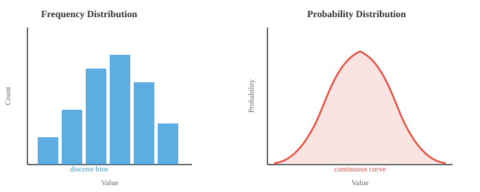
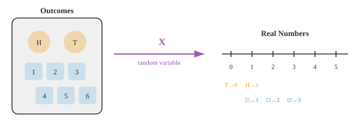

# 统计学基础

*统计学提供了描述数据和量化不确定性的语言。本节涵盖分布、随机变量、PMF、PDF、CDF、期望、方差、矩以及中心极限定理——这些概念支撑着每一个机器学习评估指标和损失函数。*

- 统计学是从数据中学习的科学。你收集观测值，对其进行汇总，并得出结论——通常针对那些无法直接测量的事物。

- 假设你想知道某个国家所有成年人的平均身高。你不可能测量每一个人，因此你测量一个**样本**，并利用统计学对整个**总体**做出有根据的推测。

- 统计学有两个主要分支：
    - **描述性统计**：对已有数据进行汇总（平均值、图表、表格）
    - **推断性统计**：利用样本对更大群体做出推断

- 统计学的基本构件是**分布**——一种描述数值如何分布的方式。其他一切——平均值、检验、预测——都源于对分布的理解。

- **频率分布**统计数据中每个值（或值区间）出现的次数。想象一下把考试成绩分到不同的区间，然后统计每个区间中有多少学生。结果就是直方图。

- **概率分布**用概率代替原始计数。它不说"12 名学生的分数在 70 到 80 之间"，而是说"分数在 70 到 80 之间的概率为 0.24"。当数据连续时，直方图的柱状会变成一条平滑曲线。



- 左侧的直方图基于你实际收集的数据构建。右侧的平滑曲线是一个数学模型，描述了数据背后的模式。一个是经验性的，另一个是理论性的。

- 为了从数学上处理分布，我们需要一种将结果赋予数值的方法。这正是**随机变量**所做的。

- 随机变量是一个将每次试验的结果映射到实数的函数。抛一枚硬币：结果是"正面"或"反面"，但随机变量 $X$ 将其转换为 $X(正面) = 1$ 和 $X(反面) = 0$。现在我们就可以进行算术运算了。



- **离散**随机变量取值为可数集：10 次抛掷中的正面次数、骰子的点数、一小时内收到的电子邮件数量。

- **连续**随机变量可以在一个区间内取任意值：你的精确身高、下一班公交车到达的时间、中午的温度。

- 这种区别很重要，因为它改变了我们计算概率的方式。对于离散变量，我们求和。对于连续变量，我们积分（回顾第 3 章的积分内容）。

- 对于离散随机变量，**概率质量函数（PMF）**给出每个具体值的概率：

$$P(X = x) = p(x), \quad \text{其中 } \sum_{x} p(x) = 1$$

- 对于连续随机变量，**概率密度函数（PDF）**给出落在某个区间内的概率。任何单个精确值的概率为零；只有区间才具有正概率：

$$P(a \le X \le b) = \int_a^b f(x)\, dx, \quad \text{其中 } \int_{-\infty}^{\infty} f(x)\, dx = 1$$

- 既然我们可以将结果赋予数值，最自然的问题就是：平均而言我们期望得到什么值？

- **期望**（或期望值）是所有可能值的加权平均值，权重即为概率。可以将其视为分布的"重心"。

- 如果你多次掷一个公平的骰子，你的平均掷点数会收敛到 3.5。这就是期望值，尽管你实际上永远掷不出 3.5。

- 对于离散随机变量：

$$E[X] = \sum_{x} x \cdot p(x)$$

- 对于连续随机变量（使用第 3 章的积分）：

$$E[X] = \int_{-\infty}^{\infty} x \cdot f(x)\, dx$$

- 示例：一个公平的六面骰子，对于 $x = 1, 2, 3, 4, 5, 6$，有 $p(x) = 1/6$。

$$E[X] = 1 \cdot \tfrac{1}{6} + 2 \cdot \tfrac{1}{6} + 3 \cdot \tfrac{1}{6} + 4 \cdot \tfrac{1}{6} + 5 \cdot \tfrac{1}{6} + 6 \cdot \tfrac{1}{6} = \frac{21}{6} = 3.5$$

- 期望具有线性性质，即 $E[aX + b] = aE[X] + b$。这一性质极其有用，在机器学习损失函数中频繁出现。

- 期望告诉我们中心位置，但完全没有说明数值的分散程度。为了描述分布的完整形状，我们需要**矩**。

- 矩是 $X$ 的某次幂的期望。第 $k$ 阶**原点矩**为：

$$\mu_k' = E[X^k]$$

- 一阶原点矩（$k = 1$）就是均值：$\mu_1' = E[X] = \mu$。

- 原点矩是从零点开始度量的。通常我们更关心相对于均值的偏差。第 $k$ 阶**中心矩**将测量中心化：

$$\mu_k = E[(X - \mu)^k]$$

- 一阶中心矩始终为零（均值上下方的偏差相互抵消）。二阶中心矩就是**方差**。

- 为了比较不同尺度上的分布，我们通过除以标准差 $\sigma$ 的适当幂次来进行**标准化**：

$$\tilde{\mu}_k = \frac{\mu_k}{\sigma^k}$$

- 每个矩捕捉分布形状的不同方面：


- **1 阶矩（均值）**：分布的中心位置。平衡点。
- **2 阶矩（方差）**：数值围绕均值的分散程度。方差越大，分布越宽。
- **3 阶矩（偏度）**：分布向左还是向右倾斜。偏度为零表示对称。
- **4 阶矩（峰度）**：尾部的重量。峰度越高，极端异常值越多。

- 让我们对具体数据集 $X = \{2, 4, 4, 4, 5, 5, 7, 9\}$ 计算全部四个矩。

- **步骤 1：均值**（一阶原点矩）

$$\mu = \frac{2 + 4 + 4 + 4 + 5 + 5 + 7 + 9}{8} = \frac{40}{8} = 5$$

- **步骤 2：方差**（二阶中心矩）。从每个值中减去均值，平方，然后取平均：

$$\sigma^2 = \frac{(2{-}5)^2 + (4{-}5)^2 + (4{-}5)^2 + (4{-}5)^2 + (5{-}5)^2 + (5{-}5)^2 + (7{-}5)^2 + (9{-}5)^2}{8}$$

$$= \frac{9 + 1 + 1 + 1 + 0 + 0 + 4 + 16}{8} = \frac{32}{8} = 4$$

- **标准差**为 $\sigma = \sqrt{4} = 2$。

- **步骤 3：偏度**（标准化三阶中心矩）。偏差取三次方，求平均，再除以 $\sigma^3$：

$$\tilde{\mu}_3 = \frac{1}{8} \cdot \frac{(-3)^3 + (-1)^3 + (-1)^3 + (-1)^3 + 0^3 + 0^3 + 2^3 + 4^3}{2^3}$$

$$= \frac{1}{8} \cdot \frac{-27 -1 -1 -1 + 0 + 0 + 8 + 64}{8} = \frac{42}{64} = 0.656$$

- 正偏度表示右尾更长，这很合理，因为 9 远高于均值。

- **步骤 4：峰度**（标准化四阶中心矩）。偏差取四次方：

$$\tilde{\mu}_4 = \frac{1}{8} \cdot \frac{(-3)^4 + (-1)^4 + (-1)^4 + (-1)^4 + 0^4 + 0^4 + 2^4 + 4^4}{2^4}$$

$$= \frac{1}{8} \cdot \frac{81 + 1 + 1 + 1 + 0 + 0 + 16 + 256}{16} = \frac{356}{128} = 2.781$$

- 正态分布的峰度为 3（称为"常峰态"）。我们的 2.781 很接近，表明尾部大致呈正态。大于 3 的值（"尖峰态"）表示尾部更重；小于 3（"低峰态"）表示尾部更轻。某些公式会报告**超值峰度**（减去 3），因此我们的超值峰度为 $-0.219$。

## 编程练习（使用 CoLab 或 notebook）

1. 计算一个加载骰子的期望值，其中面 6 的概率为 0.3，其余面均分剩余概率。通过模拟 100,000 次投掷进行验证。
```python
import jax
import jax.numpy as jnp

# 加载骰子：面 6 的 p=0.3，其余面均分 0.7
probs = jnp.array([0.14, 0.14, 0.14, 0.14, 0.14, 0.30])
faces = jnp.array([1, 2, 3, 4, 5, 6])

# 解析法计算期望值
ev = jnp.sum(faces * probs)
print(f"期望值（公式法）: {ev:.4f}")

# 模拟
key = jax.random.PRNGKey(42)
rolls = jax.random.choice(key, faces, shape=(100_000,), p=probs)
print(f"期望值（模拟法）: {rolls.mean():.4f}")
```

2. 计算示例数据集的所有四个矩（均值、方差、偏度、峰度），然后修改数据并观察每个矩如何变化。
```python
import jax.numpy as jnp

x = jnp.array([2, 4, 4, 4, 5, 5, 7, 9], dtype=jnp.float32)

mean = jnp.mean(x)
variance = jnp.mean((x - mean) ** 2)
std = jnp.sqrt(variance)
skewness = jnp.mean(((x - mean) / std) ** 3)
kurtosis = jnp.mean(((x - mean) / std) ** 4)

print(f"均值:     {mean:.3f}")
print(f"方差:     {variance:.3f}")
print(f"标准差:   {std:.3f}")
print(f"偏度:     {skewness:.3f}")
print(f"峰度:     {kurtosis:.3f}")
print(f"超值峰度: {kurtosis - 3:.3f}")
```

3. 并排可视化公平骰子的 PMF 和 CDF。尝试修改概率以观察形状如何变化。
```python
import jax.numpy as jnp
import matplotlib.pyplot as plt

faces = jnp.array([1, 2, 3, 4, 5, 6])
pmf = jnp.ones(6) / 6  # 公平骰子；试试修改这些值！
cdf = jnp.cumsum(pmf)

fig, (ax1, ax2) = plt.subplots(1, 2, figsize=(10, 4))

ax1.bar(faces, pmf, color="#3498db", alpha=0.8)
ax1.set_title("PMF")
ax1.set_xlabel("面值")
ax1.set_ylabel("P(X = x)")
ax1.set_ylim(0, 0.5)

ax2.step(faces, cdf, where="mid", color="#e74c3c", linewidth=2)
ax2.set_title("CDF")
ax2.set_xlabel("面值")
ax2.set_ylabel("P(X ≤ x)")
ax2.set_ylim(0, 1.1)

plt.tight_layout()
plt.show()
```
