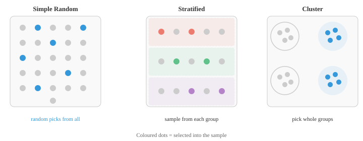
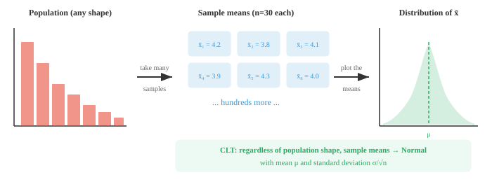

# 抽样

*抽样决定了我们如何收集数据，并直接控制着我们所做每项结论的质量。本文涵盖随机抽样、分层抽样、整群抽样与系统抽样、抽样分布、大数定律以及自助法——这些方法对于机器学习中的训练/测试划分和数据集整理至关重要。*

- 在理想世界中，你会测量所关心群体中的每一个成员。但在实践中，这几乎永远不可能做到。你无法调查每一位选民，无法测试每一只灯泡，也无法扫描每一位患者。所以你只能抽取一个**样本**，并用它来了解整体。

- **总体**是你想研究的个体或项目的完整集合。**样本**是你实际观测到的子集。

- **参数**是描述总体的数值（例如，某个国家所有成年人的真实平均身高）。

- **统计量**是从样本中计算出的数值（例如，你测量的 500 人的平均身高）。统计量用于估计参数。

- 结论的质量完全取决于你如何选择样本。一个有偏的样本会导致有偏的结论，无论你的分析多么复杂。

- **抽样框**是你实际从中抽取样本的所有个体的列表。理想情况下，抽样框与总体完全吻合，但在实践中总会存在差距。

- 例如，如果你通过电话调查人群，就会漏掉所有没有电话的人。抽样框与总体之间的差异称为**覆盖误差**。

- **抽样误差**是样本统计量与总体参数之间的自然差异。

- 即使是完全随机的样本也不会与总体完全一致。更大的样本可以减少抽样误差。

- 抽样有两大类：概率抽样和非概率抽样。

- **概率抽样**意味着总体中的每一个成员都有已知的、非零的概率被选中。这让你能够量化不确定性并推广结果。

- **简单随机抽样**：每个个体被选中的概率相等，且每个大小为 $n$ 的可能样本出现的概率相同。就像把每个名字放进一顶帽子里，然后蒙眼抽取。

- **分层抽样**：根据某个共同特征（如年龄组、地区）将总体划分为互不重叠的组（层），然后从每一层中随机抽样。这保证了每个群体的代表性，并且当层与层之间存在差异时，可以降低方差。

- **整群抽样**：将总体划分为若干组（群），随机选择一些群，然后将所选群中的全部个体都纳入样本。当总体在地理上分散时这种方法很实用，比如在整个学区中抽取整所学校而非单个学生。

- **系统抽样**：随机选择一个起点，然后从列表中每隔 $k$ 个个体选取一个。例如，从第 7 个人开始，然后每隔 10 个人取一个（7, 17, 27, ...）。这种方法易于实施，但如果列表中存在隐藏模式，则可能引入偏差。



- **非概率抽样**并不给每个成员已知的入选机会。其结果无法被严格推广，但这些方法通常更快、更便宜。

- **便利抽样**：选择最容易接触到的人。在购物中心调查人群很方便，但会遗漏那些不去购物中心的人。

- **配额抽样**：与分层抽样类似，但没有随机性。研究者通过从每个群体中选取方便接触的个体来填补配额（例如 50 名男性和 50 名女性）。

- **雪球抽样**：从少数参与者开始，然后请他们招募其他人。适用于难以接触到的人群（例如研究罕见疾病），但会严重偏向于有社交联系的个体。

- 一旦你有了抽样方法，一个自然的问题就出现了：如果抽取一个不同的样本，会得到不同的统计量吗？几乎肯定会。**抽样分布**是一个统计量（如样本均值）在所有相同大小的可能样本上的分布。

- 想象一下抽取 1000 个不同的 30 人样本，并计算每个样本的平均身高。这 1000 个均值形成了一个分布。有些会略高于真实的总体均值，有些会略低于，而大多数会聚集在真实值周围。

- 这个抽样分布的标准差称为**标准误**：

$$SE = \frac{\sigma}{\sqrt{n}}$$

- 注意标准误随着 $n$ 的增大而缩小。更大的样本能给出更精确的估计。样本量扩大到四倍，标准误减半。

- 统计学中最重要的结果是**中心极限定理（CLT）**。它指出：无论原始总体的分布形态如何，随着样本量的增大，样本均值的分布都趋近于正态分布。



- 更精确地说，如果 $X_1, X_2, \ldots, X_n$ 是来自任意分布的独立观测值，该分布具有均值 $\mu$ 和有限方差 $\sigma^2$，那么随着 $n$ 增大：

$$\bar{X} \approx \text{Normal}\!\left(\mu, \frac{\sigma^2}{n}\right)$$

- CLT 是大部分推断统计得以进行的基础。它让我们能够使用正态分布作为近似，即使底层数据不是正态分布，只要样本量足够大即可。

- "足够大"是多大？一个常见的经验法则是 $n \ge 30$，但这取决于总体的非正态程度。对于高度偏态的分布，你可能需要更大的样本量。对于大致对称的总体，即使 $n = 10$ 也可能足够了。

- CLT 有三个关键条件：
    - **独立性**：每个观测值不能影响其他观测值
    - **有限方差**：总体方差必须存在（排除了某些特殊分布）
    - **同分布**：所有观测值来自同一分布

## 编程任务（使用 CoLab 或 notebook）

1. 可视化演示 CLT：从高度偏态的分布中抽取样本，计算样本均值，观察均值直方图如何变成钟形。
```python
import jax
import jax.numpy as jnp
import matplotlib.pyplot as plt

key = jax.random.PRNGKey(0)

# 指数分布（高度偏态）
population = jax.random.exponential(key, shape=(100_000,))

fig, axes = plt.subplots(1, 4, figsize=(14, 3))
sample_sizes = [1, 5, 30, 100]

for ax, n in zip(axes, sample_sizes):
    keys = jax.random.split(key, 2000)
    means = jnp.array([jax.random.choice(k, population, shape=(n,)).mean() for k in keys])
    ax.hist(means, bins=40, color="#3498db", alpha=0.7, density=True)
    ax.set_title(f"n = {n}")
    ax.set_xlim(0, 4)

fig.suptitle("CLT：随着 n 增大，样本均值趋近正态分布", fontsize=13)
plt.tight_layout()
plt.show()
```

2. 比较简单随机抽样与分层抽样。创建一个具有不同分组的总体，展示分层抽样能给出更低的估计方差。
```python
import jax
import jax.numpy as jnp

key = jax.random.PRNGKey(42)

# 总体：两个不同的组
group_a = jax.random.normal(key, shape=(500,)) + 10   # 均值 ~10
key, subkey = jax.random.split(key)
group_b = jax.random.normal(subkey, shape=(500,)) + 20  # 均值 ~20
population = jnp.concatenate([group_a, group_b])

# 简单随机抽样：1000 次试验，样本量 20
srs_means = []
for i in range(1000):
    key, subkey = jax.random.split(key)
    sample = jax.random.choice(subkey, population, shape=(20,), replace=False)
    srs_means.append(sample.mean())
srs_means = jnp.array(srs_means)

# 分层抽样：每组各取 10 个
strat_means = []
for i in range(1000):
    key, k1, k2 = jax.random.split(key, 3)
    s_a = jax.random.choice(k1, group_a, shape=(10,), replace=False)
    s_b = jax.random.choice(k2, group_b, shape=(10,), replace=False)
    strat_means.append(jnp.concatenate([s_a, s_b]).mean())
strat_means = jnp.array(strat_means)

print(f"简单随机 - 均值: {srs_means.mean():.3f}, 标准差: {srs_means.std():.3f}")
print(f"分层抽样 - 均值: {strat_means.mean():.3f}, 标准差: {strat_means.std():.3f}")
print(f"分层抽样降低了方差 {(1 - strat_means.var()/srs_means.var())*100:.1f}%")
```

3. 探索样本量如何影响标准误。绘制标准误随样本量变化的曲线，验证 $1/\sqrt{n}$ 的关系。
```python
import jax
import jax.numpy as jnp
import matplotlib.pyplot as plt

key = jax.random.PRNGKey(7)
population = jax.random.normal(key, shape=(50_000,)) * 10 + 50

sample_sizes = [5, 10, 20, 50, 100, 200, 500, 1000]
std_errors = []

for n in sample_sizes:
    means = []
    for _ in range(500):
        key, subkey = jax.random.split(key)
        sample = jax.random.choice(subkey, population, shape=(n,))
        means.append(sample.mean())
    std_errors.append(jnp.array(means).std())

plt.figure(figsize=(8, 4))
plt.plot(sample_sizes, std_errors, "o-", color="#e74c3c", label="观测到的 SE")
theoretical = population.std() / jnp.sqrt(jnp.array(sample_sizes, dtype=jnp.float32))
plt.plot(sample_sizes, theoretical, "--", color="#3498db", label="σ/√n（理论值）")
plt.xlabel("样本量 (n)")
plt.ylabel("标准误")
plt.legend()
plt.title("标准误随样本量增大而缩小")
plt.show()
```
