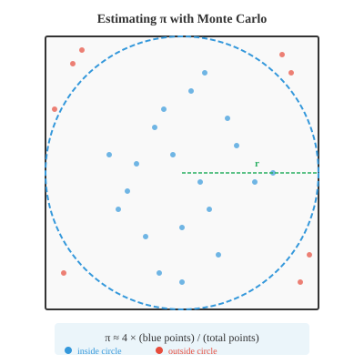

# 统计推断

*统计推断超越了简单的"是/否"决策，以量化的不确定性来估计总体参数。本节涵盖置信区间、点估计与区间估计、极大似然估计、矩法以及回归分析——这是连接原始数据与机器学习预测模型的桥梁。*

- 假设检验给出一个"是/否"的结论：拒绝或不拒绝原假设。但通常你希望得到更有信息量的结果——你正在估计的参数的一个合理取值区间。这正是**置信区间**所提供的。

- **点估计**是从样本中计算出的单一数值，比如样本均值 $\bar{x}$。它是你对总体参数的最佳猜测，但仅凭它本身无法反映估计的精确程度。

- **置信区间**在点估计周围包裹一个反映不确定性的范围。其形式为：

$$\text{CI} = \bar{x} \pm \text{ME}$$

- **误差范围**取决于三个因素：你希望多高的置信度、数据的变异程度有多大、以及样本量有多大：

$$\text{ME} = z^\ast \cdot \frac{\sigma}{\sqrt{n}}$$

- 其中 $z^\ast$ 是从正态分布中查得的临界值，与你期望的置信水平对应。对于 95% 置信度，$z^\ast = 1.96$；对于 99% 置信度，$z^\ast = 2.576$。


- **95% 置信区间**的含义是：如果你重复进行多次实验，每次构建一个区间，那么大约 95% 的区间会包含真实的总体参数。这并不意味着该参数有 95% 的概率落在这个特定的区间内。参数是一个固定值；变化的是区间本身。

- **示例**：你测量了 50 人的身高，得到 $\bar{x} = 170$ cm，$\sigma = 8$ cm。构建一个 95% 置信区间。

$$\text{ME} = 1.96 \cdot \frac{8}{\sqrt{50}} = 1.96 \cdot 1.131 = 2.22 \text{ cm}$$

$$\text{CI} = [170 - 2.22, \; 170 + 2.22] = [167.78, \; 172.22]$$

- 你可以说，有 95% 的把握认为真正的平均身高介于 167.78 cm 和 172.22 cm 之间。

- 当 $\sigma$ 未知时（这是常见情况），改用样本标准差 $s$ 和 t 分布：

$$\text{CI} = \bar{x} \pm t^\ast_{n-1} \cdot \frac{s}{\sqrt{n}}$$

- 越宽的区间置信度越高，但精度越低；越窄的区间精度越高，但置信度越低。在不降低置信度的前提下，增大样本量可以缩小区间。

- **功效分析**帮助你在实验开始前进行规划。要回答的问题是：为了检测到某个给定大小的效应并达到指定的检验功效，我需要多大的样本量？

- 回顾上一节的内容，功效 = $1 - \beta$，即正确拒绝错误原假设 $H_0$ 的概率。常见的功效目标是 80%。

- 对于 z 检验，检测差异 $\delta$ 所需样本量（给定显著性水平 $\alpha$ 和功效 $1-\beta$）为：

$$n = \left(\frac{(z_{\alpha/2} + z_{\beta}) \cdot \sigma}{\delta}\right)^2$$

- 例如，要检测平均身高 2 cm 的差异（$\sigma = 8$），取 $\alpha = 0.05$、功效 80%（$z_{0.025} = 1.96$，$z_{0.20} = 0.84$）：

$$n = \left(\frac{(1.96 + 0.84) \cdot 8}{2}\right)^2 = \left(\frac{22.4}{2}\right)^2 = 11.2^2 \approx 126$$

- 你大约需要每组 126 人。

- 功效分析可以防止两种常见错误：实验规模太小，无法检测到真实的效应（功效不足）；或者浪费资源做远超必要规模的实验（功效过剩）。

- **蒙特卡洛方法**利用随机抽样来求解难以或无法解析求解的问题。其核心思想是：如果你无法精确计算某个量，那就多次模拟并用结果作为近似值。

- 名称来源于蒙特卡洛赌场，寓意随机性的角色。这些方法是机器学习中的重要工具，用于估计积分、评估模型不确定性以及近似复杂分布等任务。

- 蒙特卡洛的一般步骤：
    - 定义可能输入的取值范围
    - 从该范围中随机生成输入
    - 对每个输入评估某个函数
    - 汇总结果（平均值、计数等）

- 一个经典例子是估算 $\pi$。想象一个边长为 2 的正方形，中心在原点，内切一个半径为 1 的圆。正方形的面积为 4，圆的面积为 $\pi$。



- 在正方形内均匀地随机投点。落在圆内的点的比例近似 $\pi/4$：

$$\pi \approx 4 \times \frac{\text{圆内点数}}{\text{总点数}}$$

- 点 $(x, y)$ 在圆内的条件是 $x^2 + y^2 \le 1$。投的点越多，估算值就越接近 $\pi$ 的真实值。

- 在机器学习中，蒙特卡洛方法出现在：
    - **蒙特卡洛 Dropout**：多次执行推理（启用 dropout）来估计预测不确定性
    - **MCMC（马尔可夫链蒙特卡洛）**：在贝叶斯模型中从复杂的后验分布中抽样
    - **策略梯度方法**：通过采样轨迹来估计强化学习中的梯度

- **因子分析**是一种发现隐藏（潜在）变量的技术，这些变量解释了观测变量之间的相关性。如果 10 个个性调查问题可以由 3 个潜在特质（外向性、宜人性、责任心）解释，因子分析就能找出这些特质。

- 该模型假设每个观测变量 $x_i$ 是少数潜在因子 $f_j$ 的线性组合加上噪声：

$$x_i = \lambda_{i1} f_1 + \lambda_{i2} f_2 + \ldots + \lambda_{ik} f_k + \epsilon_i$$

- $\lambda$ 值称为**因子载荷**，表示每个观测变量与各因子的关联强度。这与第 2 章的矩阵分解直接相关；因子分析与特征值分解和 SVD 密切相关。

- **实验设计**是安排实验结构的艺术，使你能够得出有效的结论。糟糕的设计甚至会使大量数据变得毫无价值。

- 良好实验设计的关键要素：
    - **自变量**：你操控的变量（例如药物剂量、模型架构）
    - **因变量**：你测量的变量（例如恢复时间、准确率）
    - **对照组**：不接受处理（或接受安慰剂），提供比较的基线
    - **随机分配**：参与者被随机分配到各组，从而平衡掉未测量的混杂变量

- **常见的实验设计**：
    - **完全随机设计**：受试者被随机分配到处理组。在各组可比的情况下，简单有效。
    - **随机区组设计**：受试者先按区组分组（例如按年龄），然后在每个区组内随机分配到处理组。这降低了区组因素带来的变异，类似于分层抽样的思路。
    - **析因设计**：同时测试多个自变量。一个 $2 \times 3$ 的析因设计包含一个变量的 2 个水平和另一个变量的 3 个水平，共 6 种处理组合。这使你能够检测到**交互作用**——即一个变量的效应取决于另一个变量的水平。
    - **交叉设计**：每个受试者按顺序接受所有处理（其间有洗脱期）。每个受试者作为自身的对照，减少了个体差异的影响。

- 在机器学习实验中，这些原则至关重要。比较模型时，应控制随机种子、数据集划分和硬件环境。交叉验证是一种交叉设计形式。逐次移除一个组件的消融研究则遵循析因设计的逻辑。

## 编程练习（在 CoLab 或 notebook 中完成）

1. 为身高示例构建一个 95% 置信区间，然后尝试不同的置信水平和样本量。
```python
import jax.numpy as jnp

x_bar = 170.0    # 样本均值
sigma = 8.0      # 总体标准差（已知）
n = 50           # 样本量

# 常用置信水平的临界值
z_stars = {0.90: 1.645, 0.95: 1.960, 0.99: 2.576}

for conf, z_star in z_stars.items():
    me = z_star * (sigma / jnp.sqrt(n))
    lower, upper = x_bar - me, x_bar + me
    print(f"{conf*100:.0f}% CI: [{lower:.2f}, {upper:.2f}]  (ME = {me:.2f})")
```

2. 使用蒙特卡洛模拟估算 $\pi$。绘制随着点数增加估算值收敛的曲线。
```python
import jax
import jax.numpy as jnp
import matplotlib.pyplot as plt

key = jax.random.PRNGKey(42)

# 在 [-1, 1] x [-1, 1] 内生成随机点
n_points = 100_000
k1, k2 = jax.random.split(key)
x = jax.random.uniform(k1, shape=(n_points,), minval=-1, maxval=1)
y = jax.random.uniform(k2, shape=(n_points,), minval=-1, maxval=1)

# 检查哪些点在单位圆内
inside = (x**2 + y**2) <= 1.0
cumulative_inside = jnp.cumsum(inside)
counts = jnp.arange(1, n_points + 1)
pi_estimates = 4.0 * cumulative_inside / counts

plt.figure(figsize=(10, 4))
plt.plot(pi_estimates, color="#3498db", alpha=0.7, linewidth=0.5)
plt.axhline(y=jnp.pi, color="#e74c3c", linestyle="--", label=f"π = {jnp.pi:.6f}")
plt.xlabel("点数")
plt.ylabel("π 的估算值")
plt.title("蒙特卡洛估算 π")
plt.legend()
plt.ylim(2.8, 3.5)
plt.show()

print(f"最终估算值: {pi_estimates[-1]:.6f}")
print(f"真实值:     {jnp.pi:.6f}")
print(f"误差:       {abs(pi_estimates[-1] - jnp.pi):.6f}")
```

3. 执行一个简单的功效分析：给定效应大小和标准差，计算所需样本量并通过模拟验证。
```python
import jax
import jax.numpy as jnp

# 参数
delta = 2.0      # 效应大小（均值差）
sigma = 8.0      # 总体标准差
alpha = 0.05
power_target = 0.80

# 解析计算的样本量
z_alpha = 1.96   # 双尾，alpha=0.05
z_beta = 0.84    # power=0.80
n_required = ((z_alpha + z_beta) * sigma / delta) ** 2
print(f"每组所需样本量: {n_required:.0f}")

# 通过模拟验证
key = jax.random.PRNGKey(7)
n = int(jnp.ceil(n_required))
n_sims = 5000
rejections = 0

for _ in range(n_sims):
    key, k1, k2 = jax.random.split(key, 3)
    group_a = jax.random.normal(k1, shape=(n,)) * sigma + 50
    group_b = jax.random.normal(k2, shape=(n,)) * sigma + 50 + delta
    pooled_se = jnp.sqrt(2 * sigma**2 / n)
    z = (group_b.mean() - group_a.mean()) / pooled_se
    p = 2 * (1 - __import__("jax").scipy.stats.norm.cdf(jnp.abs(z)))
    if p <= alpha:
        rejections += 1

print(f"模拟功效: {rejections/n_sims:.3f}")
print(f"目标功效: {power_target:.3f}")
```

4. 可视化置信区间宽度随样本量的变化。这展示了为什么收集更多数据可以得到更精确的估计。
```python
import jax.numpy as jnp
import matplotlib.pyplot as plt

sigma = 8.0
z_star = 1.96  # 95% 置信度

sample_sizes = jnp.array([10, 20, 30, 50, 100, 200, 500, 1000], dtype=jnp.float32)
margins = z_star * sigma / jnp.sqrt(sample_sizes)

plt.figure(figsize=(8, 4))
plt.bar([str(int(n)) for n in sample_sizes], margins, color="#3498db", alpha=0.7)
plt.xlabel("样本量")
plt.ylabel("误差范围 (cm)")
plt.title("95% CI 误差范围随样本量增大而缩小")
plt.show()
```
