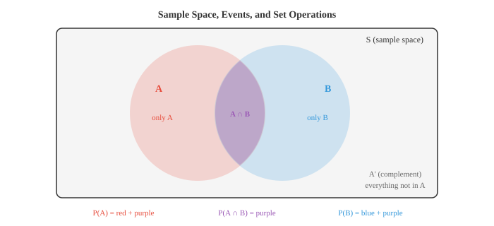

# 概率概念

*概率论形式化了不确定性，并提供了在此框架下进行推理的规则。本文涵盖样本空间、事件、概率公理、条件概率、独立性、贝叶斯定理、频率派与贝叶斯派解释，这是机器学习中每个生成模型和判别模型背后的数学框架。*

- 概率为一个事件赋予一个介于 0 和 1 之间的数字，衡量该事件发生的可能性。

- 概率为 0 表示不可能，1 表示必然，0.5 则像抛硬币一样。

- 有两种主要解释。**频率派**观点认为概率是长期相对频率：抛一枚均匀硬币 10,000 次，正面大约会出现 50% 的次数。

- **贝叶斯派**观点认为概率是信念程度：你可能会说明天降雨的概率是 70%，尽管明天只会发生一次。

- 两种解释使用相同的数学规则。区别在于哲学层面，但在机器学习中这很重要。频率派方法给出点估计。贝叶斯派方法给出参数的完整分布。

- **样本空间** $S$ 是实验所有可能结果的集合。抛一枚硬币：$S = \{H, T\}$。掷一个骰子：$S = \{1, 2, 3, 4, 5, 6\}$。

- **事件**是样本空间的任意子集。"掷出偶数"是事件 $A = \{2, 4, 6\}$，它是 $S$ 的一个子集。

- 当所有结果等可能时，事件的概率就是简单的计数（来自文件 01）：

$$P(A) = \frac{|A|}{|S|} = \frac{\text{有利结果}}{\text{总结果}}$$

- 对于偶数例子：$P(\text{偶数}) = \frac{3}{6} = 0.5$。



- 事件 $A$ 的**补集**，记作 $A'$ 或 $A^c$，是 $S$ 中所有不在 $A$ 中的元素。由于每个结果要么在 $A$ 中，要么不在：

$$P(A') = 1 - P(A)$$

- 补集通常是更简便的途径。与其计算 5 次抛硬币中至少得到一个正面的所有方式，不如计算得到全反面的一种方式然后相减：$P(\text{至少一个正面}) = 1 - P(\text{全反面}) = 1 - (0.5)^5 = 0.969$。

- 如果两个事件不能同时发生，则它们是**互斥**（不相交）的：$A \cap B = \emptyset$。一次掷骰子中掷出 2 和掷出 5 是互斥事件。

- **互斥事件的加法法则**很直接：

$$P(A \cup B) = P(A) + P(B) \quad \text{(若 } A \cap B = \emptyset\text{)}$$

- 当事件可能有重叠时，需要使用**一般加法法则**来避免重复计算交集：

$$P(A \cup B) = P(A) + P(B) - P(A \cap B)$$

- 这与计数中的容斥原理相对应。上方的维恩图说明了原因：紫色区域（交集）在 $P(A)$ 中被计算一次，在 $P(B)$ 中又被计算一次，因此我们减去一次。

- **联合概率** $P(A \cap B)$ 是 $A$ 和 $B$ 同时发生的概率。在一副扑克牌中，$P(\text{红色} \cap \text{国王}) = \frac{2}{52}$，因为有 2 张红色国王。

- **边际概率**是单个事件不考虑其他事件时的概率。$P(\text{红色}) = \frac{26}{52} = 0.5$ 是一个边际概率。如果你有关于两个变量的联合分布，通过对另一个变量求和（或积分）即可得到边际概率。

- **条件概率**回答的是：已知 $B$ 已经发生，$A$ 的概率是多少？我们将样本空间从 $S$ 缩小到 $B$，并问 $B$ 中同时属于 $A$ 的比例是多少：

$$P(A | B) = \frac{P(A \cap B)}{P(B)}, \quad P(B) > 0$$


- 示例：你抽一张牌，有人告诉你它是红色。它是国王的概率是多少？有 26 张红色牌，其中 2 张是国王，所以 $P(\text{国王} | \text{红色}) = \frac{2}{26} = \frac{1}{13}$。使用公式：$P(\text{国王} \cap \text{红色}) / P(\text{红色}) = \frac{2/52}{26/52} = \frac{1}{13}$。

- 如果知道一个事件发生了不会告诉你关于另一个事件的任何信息，则这两个事件是**独立**的。形式化定义：

$$P(A \cap B) = P(A) \cdot P(B)$$

- 等价地，$P(A | B) = P(A)$。分别抛两枚硬币是独立事件。无放回地抽两张牌不是独立的（第一次抽取会改变剩余牌的数量）。

- 独立性是一个巨大的简化工具。对于独立事件，联合概率分解为乘积形式，这使得计算可处理。许多机器学习模型假设特征之间独立（例如朴素贝叶斯），正是基于这种简化。

- 任意两个事件的**乘法法则**由条件概率公式重新排列得到：

$$P(A \cap B) = P(A | B) \cdot P(B) = P(B | A) \cdot P(A)$$

- 对于独立事件，由于条件概率等于边际概率，上式简化为 $P(A \cap B) = P(A) \cdot P(B)$。

- **贝叶斯定理**是概率论中最重要的结论之一，也是贝叶斯机器学习的基础。它让我们可以反转条件概率的方向：

$$P(A | B) = \frac{P(B | A) \cdot P(A)}{P(B)}$$

- 该定理直接源于将 $P(A \cap B)$ 写成两种形式：$P(B|A) \cdot P(A) = P(A|B) \cdot P(B)$，然后解出 $P(A|B)$。


- 每个部分都有名称：
    - **先验** $P(A)$：看到证据之前的初始信念
    - **似然** $P(B|A)$：假设 $A$ 为真的前提下，证据出现的概率
    - **证据** $P(B)$：看到证据的总概率，起归一化作用
    - **后验** $P(A|B)$：看到证据之后更新后的信念

- 让我们通过经典的医学诊断例子来理解。假设某种疾病影响 1% 的人口。针对该疾病的检测准确率为 95%：它能正确识别 95% 的患病者（灵敏度），并能正确识别 90% 的健康人（特异度）。

- 你的检测结果为阳性。你实际患病的概率是多少？

- 设 $D$ = 患病，$+$ = 检测阳性。
    - 先验：$P(D) = 0.01$
    - 似然：$P(+ | D) = 0.95$
    - 假阳性率：$P(+ | D') = 0.10$

- 我们需要 $P(+)$。根据全概率公式：

$$P(+) = P(+ | D) \cdot P(D) + P(+ | D') \cdot P(D')$$
$$= 0.95 \times 0.01 + 0.10 \times 0.99 = 0.0095 + 0.099 = 0.1085$$

- 现在应用贝叶斯定理：

$$P(D | +) = \frac{P(+ | D) \cdot P(D)}{P(+)} = \frac{0.95 \times 0.01}{0.1085} \approx 0.088$$

- 尽管检测"准确率高达 95%"，但阳性结果只能给你约 8.8% 的患病概率。先验至关重要。由于该疾病罕见，大多数阳性结果都是假阳性。这对机器学习中的任何分类问题都是一个关键见解：当类别不平衡时，仅靠准确率是具有误导性的。

- **全概率公式**将样本空间划分为互斥且完备的事件 $B_1, B_2, \ldots, B_n$，并将任意事件 $A$ 表示为：

$$P(A) = \sum_{i=1}^{n} P(A | B_i) \cdot P(B_i)$$

- 这正是我们在医学例子中计算 $P(+)$ 所用的方法：我们将人群分为"患病"和"未患病"两类。

- **概率的链式法则**将乘法法则推广到任意数量的事件：

$$P(A_1 \cap A_2 \cap \cdots \cap A_n) = P(A_1) \cdot P(A_2 | A_1) \cdot P(A_3 | A_1 \cap A_2) \cdots P(A_n | A_1 \cap \cdots \cap A_{n-1})$$

- 每个因子都以前面所有事件为条件。这是自回归语言模型的基石：一个句子的概率等于每个单词在给定前面所有单词条件下的概率的乘积。

- **条件独立**意味着两个事件在给定第三个事件的条件下是独立的。如果满足下式，则 $A$ 和 $B$ 在给定 $C$ 的条件下条件独立：

$$P(A \cap B | C) = P(A | C) \cdot P(B | C)$$

- 事件可以边际上相关但条件独立，反之亦然。例如，两名学生的考试成绩可能相关（都依赖于考试的难度），但给定考试难度后，他们的成绩是独立的。

- 条件独立是贝叶斯网络等图模型背后的关键假设。它允许将复杂的联合分布分解为可管理的部分，使推断在计算上可行。

## 编程练习（使用 CoLab 或 notebook）

1. 模拟医学诊断问题。生成 100,000 人的总体，应用疾病患病率和检测准确率，验证贝叶斯定理给出正确的后验概率。
```python
import jax
import jax.numpy as jnp

key = jax.random.PRNGKey(42)
n = 100_000

# 生成总体
k1, k2 = jax.random.split(key)
has_disease = jax.random.bernoulli(k1, p=0.01, shape=(n,))

# 生成检测结果
k3, k4 = jax.random.split(k2)
# 灵敏度：P(+|D) = 0.95，特异度：P(-|D') = 0.90
test_positive = jnp.where(
    has_disease,
    jax.random.bernoulli(k3, p=0.95, shape=(n,)),
    jax.random.bernoulli(k4, p=0.10, shape=(n,))
)

# 在检测阳性的人群中，实际患病的比例是多少？
positives = test_positive.astype(bool)
true_positives = (has_disease & positives).sum()
total_positives = positives.sum()

print(f"检测阳性总人数: {total_positives}")
print(f"真阳性人数: {true_positives}")
print(f"P(患病 | 阳性) = {true_positives / total_positives:.4f}")
print(f"贝叶斯公式:         {0.95 * 0.01 / 0.1085:.4f}")
```

2. 通过模拟验证加法法则。生成具有已知概率和重叠程度的随机事件 A 和 B，然后验证 $P(A \cup B) = P(A) + P(B) - P(A \cap B)$。
```python
import jax
import jax.numpy as jnp

key = jax.random.PRNGKey(0)
n = 200_000
k1, k2 = jax.random.split(key)

# 事件：A = 值 < 0.4，B = 值 < 0.6（在 < 0.4 处重叠）
vals_a = jax.random.uniform(k1, shape=(n,))
vals_b = jax.random.uniform(k2, shape=(n,))

A = vals_a < 0.4
B = vals_b < 0.6

p_a = A.mean()
p_b = B.mean()
p_a_and_b = (A & B).mean()
p_a_or_b = (A | B).mean()

print(f"P(A) = {p_a:.4f}")
print(f"P(B) = {p_b:.4f}")
print(f"P(A ∩ B) = {p_a_and_b:.4f}")
print(f"P(A ∪ B) 模拟值 = {p_a_or_b:.4f}")
print(f"P(A) + P(B) - P(A∩B) = {p_a + p_b - p_a_and_b:.4f}")
```

3. 演示条件概率随证据变化。模拟掷两个骰子，计算 $P(\text{和} = 7)$，然后计算 $P(\text{和} = 7 | \text{第一个骰子} = 3)$。
```python
import jax
import jax.numpy as jnp

key = jax.random.PRNGKey(1)
n = 500_000
k1, k2 = jax.random.split(key)

d1 = jax.random.randint(k1, shape=(n,), minval=1, maxval=7)
d2 = jax.random.randint(k2, shape=(n,), minval=1, maxval=7)
total = d1 + d2

# 无条件概率
p_sum7 = (total == 7).mean()
print(f"P(和=7) = {p_sum7:.4f} (精确值: {6/36:.4f})")

# 条件于第一个骰子 = 3
mask = d1 == 3
p_sum7_given_d1_3 = (total[mask] == 7).mean()
print(f"P(和=7 | d1=3) = {p_sum7_given_d1_3:.4f} (精确值: {1/6:.4f})")
```

4. 将贝叶斯定理实现为一个函数，并用它迭代更新信念。从硬币偏向的均匀先验开始，在观察到每次抛掷后更新。
```python
import jax.numpy as jnp
import matplotlib.pyplot as plt

def bayes_update(prior, likelihood):
    """将先验乘以似然并归一化。"""
    posterior = prior * likelihood
    return posterior / posterior.sum()

# 离散化可能的偏向值
theta = jnp.linspace(0, 1, 200)
prior = jnp.ones_like(theta)  # 均匀先验
prior = prior / prior.sum()

# 观测到的抛掷结果：1=正面，0=反面
flips = [1, 1, 0, 1, 1, 1, 0, 1, 0, 1]

plt.figure(figsize=(10, 5))
plt.plot(theta, prior, "--", color="#999", label="先验")

for i, flip in enumerate(flips):
    likelihood = theta if flip == 1 else (1 - theta)
    prior = bayes_update(prior, likelihood)
    if i in [0, 2, 4, 9]:
        plt.plot(theta, prior, label=f"经过 {i+1} 次抛掷后", linewidth=2)

plt.xlabel("硬币偏向 θ")
plt.ylabel("信念（归一化）")
plt.title("贝叶斯更新：关于硬币偏向的信念")
plt.legend()
plt.grid(alpha=0.3)
plt.show()
```
