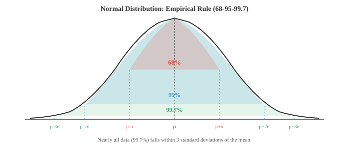

# 概率分布

*概率分布描述了随机结果如何在可能取值上分布。本文档整理了关键的离散和连续分布：伯努利分布、二项分布、泊松分布、高斯分布、指数分布、贝塔分布等，给出了各自的公式、直观理解及其在机器学习中的应用（损失函数、先验、噪声模型）。*

- 在第4章中，我们介绍了随机变量、PMF、PDF和CDF。本章列出你在机器学习和统计学中最常遇到的重要概率分布，给出每个分布的直观理解、公式、均值和方差。

- 三种核心函数的快速回顾（完整定义见第4章）：
    - **PMF** $P(X = x)$：给出每个离散结果的概率。即条形图中每个条形的高度。
    - **PDF** $f(x)$：给出连续变量在每个点上的密度。两点之间曲线下的面积即为概率。
    - **CDF** $F(x) = P(X \le x)$：累积到 $x$ 为止的概率。取值范围始终从0到1且单调不减。

- 分布的**支撑集**是指PMF或PDF取正值的集合。对掷骰子而言，支撑集为 $\{1,2,3,4,5,6\}$。对正态分布而言，支撑集为全体实数 $(-\infty, \infty)$。

- 分布清晰地分为两个家族：离散分布（结果可数，使用PMF）和连续分布（结果不可数，使用PDF）。

- **伯努利分布**：最简单的分布。单次试验有两种结果：成功（1）的概率为 $p$，失败（0）的概率为 $1-p$。

$$P(X = x) = p^x (1 - p)^{1-x}, \quad x \in \{0, 1\}$$

- 均值：$E[X] = p$。方差：$\text{Var}(X) = p(1-p)$。

- 每一次抛硬币、每一个是/否分类、每一个二元结果都是伯努利试验。在机器学习中，sigmoid函数的输出正是伯努利分布的参数 $p$。

- **二项分布**：计算 $n$ 次独立伯努利试验中成功的次数，每次试验的成功概率 $p$ 相同。

$$P(X = k) = \binom{n}{k} p^k (1-p)^{n-k}, \quad k = 0, 1, \ldots, n$$

- 二项式系数 $\binom{n}{k}$（见文件01）计算了 $k$ 次成功在 $n$ 次试验中的排列方式数量。

- 均值：$E[X] = np$。方差：$\text{Var}(X) = np(1-p)$。


- 示例：抛一枚有偏硬币（$p = 0.7$）八次。恰好得到6次正面的概率为 $\binom{8}{6}(0.7)^6(0.3)^2 = 28 \times 0.1176 \times 0.09 \approx 0.296$。

- **泊松分布**：在固定的时间或空间区间内，以已知的平均速率 $\lambda$ 计算事件发生的次数。适用于事件稀少且相互独立的情形。

$$P(X = k) = \frac{\lambda^k e^{-\lambda}}{k!}, \quad k = 0, 1, 2, \ldots$$

- 均值：$E[X] = \lambda$。方差：$\text{Var}(X) = \lambda$。均值等于方差是其标志性特征。

- 示例：每小时收到的邮件数（$\lambda = 5$）、每页的错别字数、每秒的服务器请求数。在机器学习中，泊松回归用于建模计数数据，而线性模型可能会预测出负的计数值。

- 当 $n \to \infty$ 且 $p \to 0$，且 $np = \lambda$ 保持不变时，二项分布 Binomial$(n,p)$ 收敛于泊松分布 Poisson$(\lambda)$。这就是泊松分布适用于大总体中稀有事件的原因。

- **几何分布**：计算直到首次成功所需的试验次数。"我要抛多少次硬币才能第一次得到正面？"

$$P(X = k) = (1-p)^{k-1} p, \quad k = 1, 2, 3, \ldots$$

- 均值：$E[X] = 1/p$。方差：$\text{Var}(X) = (1-p)/p^2$。

- 几何分布具有**无记忆性**：再等待 $k$ 次试验才成功的概率与你已经等待了多少次试验无关。这使得它在离散分布中非常特殊。

- **负二项分布**：推广了几何分布，计算直到第 $r$ 次成功所需的试验次数（几何分布是 $r=1$ 的特殊情形）。

$$P(X = k) = \binom{k-1}{r-1} p^r (1-p)^{k-r}, \quad k = r, r+1, r+2, \ldots$$

- 均值：$E[X] = r/p$。方差：$\text{Var}(X) = r(1-p)/p^2$。

- 负二项分布在实践中也用于建模过度离散的计数数据（方差超过均值的情形），这是泊松分布无法处理的。

- 接下来我们进入连续分布。

- **均匀分布**：区间 $[a, b]$ 内的所有值等可能。其PDF是一个平坦的矩形。

$$f(x) = \frac{1}{b - a}, \quad a \le x \le b$$

- 均值：$E[X] = \frac{a+b}{2}$。方差：$\text{Var}(X) = \frac{(b-a)^2}{12}$。

- 随机数生成器以生成均匀分布 Uniform(0,1) 样本为起点。其他分布通过对这些均匀样本进行变换得到。

- **正态（高斯）分布**：统计学中最重要的分布。它由中心极限定理（见第4章）自然导出：大量独立随机变量的平均值趋于正态分布，无论原始分布是什么。

$$f(x) = \frac{1}{\sigma\sqrt{2\pi}} \exp\!\left(-\frac{(x - \mu)^2}{2\sigma^2}\right)$$

- 均值：$E[X] = \mu$。方差：$\text{Var}(X) = \sigma^2$。

- **标准正态分布**的 $\mu = 0$ 且 $\sigma = 1$。任意正态变量 $X$ 可通过 $Z = (X - \mu)/\sigma$ 标准化为标准正态变量 $Z$。



- **经验法则**（68-95-99.7法则）指出：
    - 约68%的数据落在均值 $\pm 1\sigma$ 范围内
    - 约95%的数据落在 $\pm 2\sigma$ 范围内
    - 约99.7%的数据落在 $\pm 3\sigma$ 范围内

- 在机器学习中，正态分布无处不在：权重初始化、数据增强中的噪声、MSE损失背后的假设（其隐含假设高斯误差）、以及变分自编码器中的重参数化技巧。

- **指数分布**：模拟泊松过程中事件之间的时间间隔。如果事件以速率 $\lambda$ 到达，则它们之间的等待时间服从指数分布 Exponential$(\lambda)$。

$$f(x) = \lambda e^{-\lambda x}, \quad x \ge 0$$

- 均值：$E[X] = 1/\lambda$。方差：$\text{Var}(X) = 1/\lambda^2$。

- 与离散变量中的几何分布类似，指数分布也具有**无记忆性**：$P(X > s + t | X > s) = P(X > t)$。再等待 $t$ 个时间单位的概率与你已经等待了多长时间无关。

- **伽马分布**：推广了指数分布。它模拟泊松过程中第 $\alpha$ 个事件发生的时间（指数分布是 $\alpha = 1$ 的特殊情形）。

$$f(x) = \frac{\beta^\alpha}{\Gamma(\alpha)} x^{\alpha - 1} e^{-\beta x}, \quad x > 0$$

- 这里 $\alpha$（形状参数）控制形状，$\beta$（速率参数）控制尺度。$\Gamma(\alpha)$ 是伽马函数，它将阶乘推广到实数：对正整数 $n$ 有 $\Gamma(n) = (n-1)!$。

- 均值：$E[X] = \alpha/\beta$。方差：$\text{Var}(X) = \alpha/\beta^2$。

- **贝塔分布**：定义在区间 $[0, 1]$ 上，非常适合对概率、比例和比率进行建模。

$$f(x) = \frac{x^{\alpha - 1}(1 - x)^{\beta - 1}}{B(\alpha, \beta)}, \quad 0 \le x \le 1$$

- 分母 $B(\alpha, \beta) = \frac{\Gamma(\alpha)\Gamma(\beta)}{\Gamma(\alpha + \beta)}$ 是贝塔函数，起到归一化常数的作用。

- 均值：$E[X] = \frac{\alpha}{\alpha + \beta}$。方差：$\text{Var}(X) = \frac{\alpha\beta}{(\alpha+\beta)^2(\alpha+\beta+1)}$。

- 贝塔分布是伯努利和二项似然函数的共轭先验。这意味着如果先验是贝塔分布且数据服从伯努利分布，则后验也是贝塔分布，这使得贝叶斯更新在解析上易于处理。我们将在文件04中使用这一性质。


- **卡方分布**（$\chi^2$）：如果你取 $k$ 个独立的标准正态随机变量并求其平方和，结果服从自由度为 $k$ 的 $\chi^2$ 分布。

$$f(x) = \frac{1}{2^{k/2}\Gamma(k/2)} x^{k/2 - 1} e^{-x/2}, \quad x > 0$$

- 均值：$E[X] = k$。方差：$\text{Var}(X) = 2k$。

- $\chi^2$ 分布实际上是伽马分布的特殊情形，其中 $\alpha = k/2$ 且 $\beta = 1/2$。它出现在假设检验（第4章中的卡方检验）、拟合优度检验以及方差置信区间的计算中。

- **学生t分布**：形状类似于正态分布但尾部更重。当你使用小样本且总体方差未知时，对正态分布总体的均值进行估计时就会出现t分布。

$$f(x) = \frac{\Gamma\!\left(\frac{\nu+1}{2}\right)}{\sqrt{\nu\pi}\,\Gamma\!\left(\frac{\nu}{2}\right)} \left(1 + \frac{x^2}{\nu}\right)^{-(\nu+1)/2}$$

- 参数 $\nu$（自由度）。当 $\nu \to \infty$ 时，t分布收敛于标准正态分布。当 $\nu$ 较小时，更重的尾部赋予极端值更高的概率，反映了小样本带来的额外不确定性。

- 均值：$E[X] = 0$（当 $\nu > 1$ 时）。方差：$\text{Var}(X) = \frac{\nu}{\nu - 2}$（当 $\nu > 2$ 时）。

- t分布用于t检验（第4章），并出现在贝叶斯推断中，作为在积分消去未知方差时的边缘分布。

- 关键分布总结：

| 分布 | 类型 | 支撑集 | 均值 | 方差 |
|---|---|---|---|---|
| Bernoulli$(p)$ | 离散 | $\{0,1\}$ | $p$ | $p(1-p)$ |
| Binomial$(n,p)$ | 离散 | $\{0,\ldots,n\}$ | $np$ | $np(1-p)$ |
| Poisson$(\lambda)$ | 离散 | $\{0,1,2,\ldots\}$ | $\lambda$ | $\lambda$ |
| Geometric$(p)$ | 离散 | $\{1,2,3,\ldots\}$ | $1/p$ | $(1-p)/p^2$ |
| Uniform$(a,b)$ | 连续 | $[a,b]$ | $(a+b)/2$ | $(b-a)^2/12$ |
| Normal$(\mu,\sigma^2)$ | 连续 | $(-\infty,\infty)$ | $\mu$ | $\sigma^2$ |
| Exponential$(\lambda)$ | 连续 | $[0,\infty)$ | $1/\lambda$ | $1/\lambda^2$ |
| Gamma$(\alpha,\beta)$ | 连续 | $(0,\infty)$ | $\alpha/\beta$ | $\alpha/\beta^2$ |
| Beta$(\alpha,\beta)$ | 连续 | $[0,1]$ | $\alpha/(\alpha+\beta)$ | 见上文 |
| $\chi^2(k)$ | 连续 | $(0,\infty)$ | $k$ | $2k$ |
| Student's $t(\nu)$ | 连续 | $(-\infty,\infty)$ | $0$ | $\nu/(\nu-2)$ |

## 编程练习（使用CoLab或笔记本）

1. 绘制 $n=20$ 时二项分布PMF在不同 $p$ 取值下的图像。观察形状如何从左偏变为对称再变为右偏。
```python
import jax.numpy as jnp
import matplotlib.pyplot as plt
from math import comb

n = 20
ks = jnp.arange(0, n + 1)

fig, axes = plt.subplots(1, 3, figsize=(12, 4), sharey=True)
for ax, p, color in zip(axes, [0.2, 0.5, 0.8], ["#e74c3c", "#3498db", "#27ae60"]):
    pmf = jnp.array([comb(n, int(k)) * p**k * (1-p)**(n-k) for k in ks])
    ax.bar(ks, pmf, color=color, alpha=0.7)
    ax.set_title(f"Binomial(n={n}, p={p})")
    ax.set_xlabel("k")
axes[0].set_ylabel("P(X = k)")
plt.tight_layout()
plt.show()
```

2. 验证泊松分布对二项分布的近似。设 $n = 1000$，$p = 0.003$，比较二项分布 Binomial$(n, p)$ 和泊松分布 Poisson$(\lambda = np)$。
```python
import jax.numpy as jnp
import matplotlib.pyplot as plt
from math import comb, factorial, exp

n, p = 1000, 0.003
lam = n * p
ks = jnp.arange(0, 15)

binom_pmf = jnp.array([comb(n, int(k)) * p**k * (1-p)**(n-k) for k in ks])
poisson_pmf = jnp.array([lam**k * exp(-lam) / factorial(int(k)) for k in ks])

plt.figure(figsize=(8, 4))
plt.bar(ks - 0.15, binom_pmf, width=0.3, color="#3498db", alpha=0.7, label=f"Binomial({n},{p})")
plt.bar(ks + 0.15, poisson_pmf, width=0.3, color="#e74c3c", alpha=0.7, label=f"Poisson({lam})")
plt.xlabel("k")
plt.ylabel("P(X = k)")
plt.title("泊松分布对二项分布的近似")
plt.legend()
plt.show()
```

3. 从正态分布中采样并验证经验法则。计算落在1、2和3个标准差内的样本比例。
```python
import jax
import jax.numpy as jnp

key = jax.random.PRNGKey(42)
mu, sigma = 5.0, 2.0
samples = mu + sigma * jax.random.normal(key, shape=(100_000,))

for k in [1, 2, 3]:
    within = jnp.abs(samples - mu) <= k * sigma
    print(f"Within {k}σ: {within.mean():.4f} (expected: {[0.6827, 0.9545, 0.9973][k-1]:.4f})")
```

4. 通过改变 $\alpha$ 和 $\beta$ 探索贝塔分布。绘制几种形状，观察分布如何从均匀变为偏斜再变为集中。
```python
import jax
import jax.numpy as jnp
import matplotlib.pyplot as plt

x = jnp.linspace(0.01, 0.99, 200)

def beta_pdf(x, a, b):
    # 未归一化，用于形状比较
    return x**(a-1) * (1-x)**(b-1)

plt.figure(figsize=(10, 5))
params = [(1,1,"均匀"), (2,5,"左偏"), (5,2,"右偏"),
          (5,5,"对称"), (0.5,0.5,"U形")]
colors = ["#999", "#e74c3c", "#3498db", "#27ae60", "#9b59b6"]

for (a, b, label), color in zip(params, colors):
    y = beta_pdf(x, a, b)
    y = y / jnp.trapezoid(y, x)  # 归一化
    plt.plot(x, y, label=f"α={a}, β={b} ({label})", color=color, linewidth=2)

plt.xlabel("x")
plt.ylabel("密度")
plt.title("贝塔分布形状")
plt.legend()
plt.grid(alpha=0.3)
plt.show()
```
