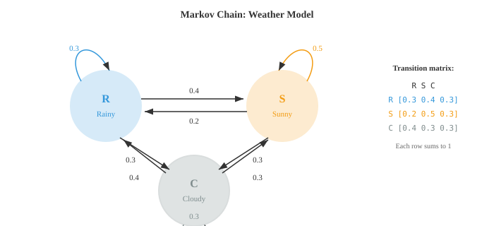
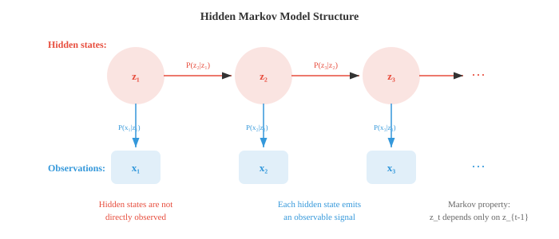

# 贝叶斯方法与序列模型

*贝叶斯方法将先验信念与观测数据相结合，生成模型参数的后验分布。本文涵盖最大似然估计、最大后验估计、共轭先验、贝叶斯推断、隐马尔可夫模型和EM算法——这些技术是垃圾邮件过滤器、语言模型和不确定性感知机器学习的基础。*

- 到目前为止，我们介绍了各种分布以及如何计算概率。现在我们来处理机器学习的核心问题：给定观测数据，如何找到模型的最佳参数？

- **最大似然估计 (MLE)** 直接回答了这个问题：选择使观测数据概率最大的参数值。

- 形式上，给定数据 $D = \{x_1, x_2, \ldots, x_n\}$ 和带有参数 $\theta$ 的模型，**似然函数**为：

$$L(\theta | D) = P(D | \theta) = \prod_{i=1}^{n} P(x_i | \theta)$$

- 乘积假设数据点独立同分布（i.i.d.）。MLE估计量为：

$$\hat{\theta}_{\text{MLE}} = \arg\max_\theta L(\theta | D)$$

- 实践中我们最大化**对数似然**，因为对数将乘积转化为求和，并防止数值下溢：

$$\ell(\theta) = \log L(\theta | D) = \sum_{i=1}^{n} \log P(x_i | \theta)$$

- 由于 $\log$ 是单调递增函数，使得 $\ell(\theta)$ 最大的 $\theta$ 也同样使得 $L(\theta)$ 最大。

- **抛硬币示例**：你抛一枚硬币10次，得到7次正面。硬币偏置 $p$（正面概率）的MLE估计是多少？

- 每次抛掷服从 Bernoulli($p$)，因此10次抛掷中出现7次正面的似然为：

$$L(p) = \binom{10}{7} p^7 (1-p)^3$$

- 取对数并求导：$\frac{d\ell}{dp} = \frac{7}{p} - \frac{3}{1-p} = 0$，解得 $\hat{p}_{\text{MLE}} = 7/10 = 0.7$。

- MLE直观且简单。如果10次抛掷中得到7次正面，最可能的偏置是0.7。但注意一个问题：如果10次抛掷中得到10次正面，MLE会得出 $\hat{p} = 1$，意味着硬币将永远正面朝上。仅凭10次观测就得出这样的结论似乎过于自信。

- **最大后验估计 (MAP)** 通过加入先验信念来修复这个问题。MAP不是仅最大化似然，而是最大化后验：

$$\hat{\theta}_{\text{MAP}} = \arg\max_\theta P(\theta | D) = \arg\max_\theta P(D | \theta) \cdot P(\theta)$$

- 我们省略了分母 $P(D)$，因为它不依赖于 $\theta$，不影响argmax的结果。

- 先验 $P(\theta)$ 编码了我们在看到数据之前对 $\theta$ 的信念。如果我们使用 Beta(2, 2) 先验来表示硬币偏置（表达"硬币大致是公平的"这一温和信念），MAP估计就不再仅仅是正面的比例，而是被拉向0.5。


- 使用 Beta($\alpha$, $\beta$) 先验，观测到 $h$ 次正面和 $t$ 次反面后，后验为 Beta($\alpha + h$, $\beta + t$)，MAP估计为：

$$\hat{p}_{\text{MAP}} = \frac{\alpha + h - 1}{\alpha + \beta + h + t - 2}$$

- 对于我们的示例，Beta(2,2)先验，7次正面，3次反面：$\hat{p}_{\text{MAP}} = \frac{2 + 7 - 1}{2 + 2 + 10 - 2} = \frac{8}{12} = 0.667$。

- 注意MAP估计（0.667）相比MLE（0.7）如何被拉向0.5。先验起到了正则化的作用。在机器学习中，L2正则化（权重衰减）完全等价于在权重上使用高斯先验的MAP估计。

- **完整的贝叶斯推断**比MAP更进一步。它不是寻找单一的最佳 $\theta$，而是维护整个后验分布 $P(\theta | D)$。这不仅给你一个点估计，还给出了不确定性的度量。

- 对于具有Beta(2,2)先验和7次正面、3次反面的偏置硬币，完整的后验是 Beta(9, 5)。该分布的均值为 $9/14 \approx 0.643$，其弥散程度告诉我们置信度的高低。数据越多，后验越窄。

- 三种方法形成了一个谱系：
    - **MLE**：无先验，仅依赖数据。速度快，但数据少时可能过拟合。
    - **MAP**：带先验正则化的点估计。增加鲁棒性。
    - **完整贝叶斯**：完整的后验分布。信息量最大，但通常计算成本高。

- **马尔可夫链**对序列进行建模，其中下一状态仅依赖于当前状态，而不依赖于历史。这种"无记忆性"称为**马尔可夫性**：

$$P(X_{t+1} | X_t, X_{t-1}, \ldots, X_1) = P(X_{t+1} | X_t)$$

- 以天气为例。明天的天气取决于今天的天气，但不取决于上周的天气（这是一个简化，但出奇地有用）。

- 马尔可夫链具有有限个**状态**和一个**转移矩阵** $T$，其中元素 $T_{ij}$ 表示从状态 $i$ 转移到状态 $j$ 的概率。每一行之和为1。



- 对于上图的天气示例，转移矩阵为：

```math
T = \begin{pmatrix} 0.3 & 0.4 & 0.3 \\ 0.2 & 0.5 & 0.3 \\ 0.4 & 0.3 & 0.3 \end{pmatrix}
```

- 如果今天是雨天（状态向量 $\mathbf{s}_0 = [1, 0, 0]$），明天天气的概率分布为 $\mathbf{s}_1 = \mathbf{s}_0 T = [0.3, 0.4, 0.3]$。两天后：$\mathbf{s}_2 = \mathbf{s}_0 T^2$。这使用了第一章中的矩阵乘法。

- 许多马尔可夫链会收敛到一个**平稳分布** $\pi$，满足 $\pi T = \pi$。无论从哪里出发，经过足够多的步数后，链会收敛到 $\pi$。这一性质是MCMC（马尔可夫链蒙特卡罗）的基础，MCMC是贝叶斯机器学习中广泛使用的采样技术。

- **隐马尔可夫模型 (HMM)** 通过增加一层间接性来扩展马尔可夫链。真实状态是隐藏的（不可观测的），每个时间步隐藏状态会发出一个可观测的信号。



- HMM 有三个组成部分：
    - **转移概率** $P(z_t | z_{t-1})$：隐藏状态如何演化（马尔可夫链）
    - **发射概率** $P(x_t | z_t)$：每个隐藏状态产生什么可观测输出
    - **初始分布** $P(z_1)$：起始隐藏状态的概率

- **雨伞示例**：假设你不能直接看到天气，但可以观察到你的朋友是否带伞。隐藏状态为 {雨天, 晴天}，观测为 {带伞, 不带伞}。

- 转移概率：$P(\text{雨天}|\text{雨天}) = 0.7$，$P(\text{晴天}|\text{雨天}) = 0.3$，$P(\text{雨天}|\text{晴天}) = 0.4$，$P(\text{晴天}|\text{晴天}) = 0.6$。

- 发射概率：$P(\text{带伞}|\text{雨天}) = 0.9$，$P(\text{不带伞}|\text{雨天}) = 0.1$，$P(\text{带伞}|\text{晴天}) = 0.2$，$P(\text{不带伞}|\text{晴天}) = 0.8$。

- HMM 的关键问题有：
    - **解码**：给定观测，最可能的隐藏状态序列是什么？由**维特比算法**求解。
    - **评估**：观测序列的概率是多少？由**前向算法**求解。
    - **学习**：给定观测，最佳模型参数是什么？由**Baum-Welch算法**求解（期望最大化算法的一个实例）。

- **维特比演算**：假设你观测到 [带伞, 带伞, 不带伞]，想找到最可能的天气序列。

- 从初始概率开始。假设 $P(R) = 0.5$，$P(S) = 0.5$。

- **第1天**（观测到带伞）：
    - $V_1(R) = P(R) \cdot P(U|R) = 0.5 \times 0.9 = 0.45$
    - $V_1(S) = P(S) \cdot P(U|S) = 0.5 \times 0.2 = 0.10$

- **第2天**（观测到带伞）：
    - $V_2(R) = \max(V_1(R) \cdot P(R|R), V_1(S) \cdot P(R|S)) \cdot P(U|R)$
    - $= \max(0.45 \times 0.7, 0.10 \times 0.4) \times 0.9 = \max(0.315, 0.04) \times 0.9 = 0.2835$
    - $V_2(S) = \max(V_1(R) \cdot P(S|R), V_1(S) \cdot P(S|S)) \cdot P(U|S)$
    - $= \max(0.45 \times 0.3, 0.10 \times 0.6) \times 0.2 = \max(0.135, 0.06) \times 0.2 = 0.027$

- **第3天**（观测到不带伞）：
    - $V_3(R) = \max(0.2835 \times 0.7, 0.027 \times 0.4) \times 0.1 = 0.1985 \times 0.1 = 0.01985$
    - $V_3(S) = \max(0.2835 \times 0.3, 0.027 \times 0.6) \times 0.8 = 0.08505 \times 0.8 = 0.06804$

- 第3天的最大值在晴天。回溯：第3天 = 晴天（来自R），第2天 = 雨天（来自R），第1天 = 雨天。最可能的序列：**雨天, 雨天, 晴天**。

- **前向-后向算法**计算在给定整个观测序列条件下，每个时间步处于每个隐藏状态的概率。前向过程计算 $P(z_t, x_{1:t})$，后向过程计算 $P(x_{t+1:T} | z_t)$。两者相乘得到平滑后的状态概率。

- **Baum-Welch算法**在隐藏状态不可观测时从数据中学习HMM参数。它是一种期望最大化（EM）算法：E步使用前向-后向算法估计哪些隐藏状态生成了观测，M步更新转移概率和发射概率。

- HMM在历史上主导了语音识别（隐藏的音素状态发出声学信号）和生物信息学（隐藏的基因状态发出DNA碱基对）。虽然深度学习在很大程度上已取代了这些领域中的HMM，但隐藏状态、发射和序列推断的思想仍然是序列模型的核心。

- **条件随机场 (CRF)** 通过去除发射独立假设来改进HMM。在HMM中，时间 $t$ 的观测仅依赖于时间 $t$ 的隐藏状态。CRF允许位置 $t$ 的标签依赖于整个输入序列。

- 线性链CRF对给定输入序列 $\mathbf{x}$ 条件下标签序列 $\mathbf{y}$ 的条件概率建模：

$$P(\mathbf{y} | \mathbf{x}) = \frac{1}{Z(\mathbf{x})} \exp\!\left(\sum_t \left[\sum_k \lambda_k f_k(y_t, y_{t-1}, \mathbf{x}, t)\right]\right)$$

- 其中 $f_k$ 是特征函数（可以查看输入的任意部分），$\lambda_k$ 是学习到的权重，$Z(\mathbf{x})$ 是归一化常数。

- CRF是判别式模型（直接建模 $P(\mathbf{y}|\mathbf{x})$），而HMM是生成式模型（建模 $P(\mathbf{x}, \mathbf{y})$）。这一区别与逻辑回归（判别式）和朴素贝叶斯（生成式）之间的区别相同。

- 在现代NLP中，CRF层通常被加在神经网络之上（BiLSTM-CRF、BERT-CRF），用于命名实体识别和词性标注等需要捕捉标签依赖关系的任务。

## 编程练习（使用 CoLab 或 notebook）

1. 实现抛硬币实验的MLE和MAP。观察MAP估计如何随不同的先验和不同的数据量而变化。
```python
import jax.numpy as jnp
import matplotlib.pyplot as plt

# 数据：观测到的硬币抛掷结果
heads, tails = 7, 3

# MLE
p_mle = heads / (heads + tails)
print(f"MLE: {p_mle:.4f}")

# 使用 Beta 先验的 MAP
for alpha, beta in [(1,1), (2,2), (5,5), (10,10)]:
    p_map = (alpha + heads - 1) / (alpha + beta + heads + tails - 2)
    print(f"MAP (Beta({alpha},{beta})): {p_map:.4f}")

# 可视化 Beta(2,2) 先验下的后验
theta = jnp.linspace(0.01, 0.99, 200)
# 后验为 Beta(alpha+heads, beta+tails)
a_post, b_post = 2 + heads, 2 + tails
posterior = theta**(a_post-1) * (1-theta)**(b_post-1)
posterior = posterior / jnp.trapezoid(posterior, theta)

plt.figure(figsize=(8, 4))
plt.plot(theta, posterior, color="#e74c3c", linewidth=2, label=f"后验 Beta({a_post},{b_post})")
plt.axvline(p_mle, color="#3498db", linestyle="--", label=f"MLE = {p_mle:.2f}")
plt.axvline((a_post-1)/(a_post+b_post-2), color="#e74c3c", linestyle="--", label=f"MAP = {(a_post-1)/(a_post+b_post-2):.3f}")
plt.xlabel("θ (硬币偏置)")
plt.ylabel("密度")
plt.title("7次正面、3次反面后 Beta(2,2) 先验下的后验分布")
plt.legend()
plt.grid(alpha=0.3)
plt.show()
```

2. 为天气模型构建一个马尔可夫链并进行模拟。分别通过模拟和求解 $\pi T = \pi$ 计算平稳分布。
```python
import jax
import jax.numpy as jnp

# 转移矩阵：R（雨天）, S（晴天）, C（多云）
T = jnp.array([
    [0.3, 0.4, 0.3],
    [0.2, 0.5, 0.3],
    [0.4, 0.3, 0.3]
])
states = ["雨天", "晴天", "多云"]

# 模拟 100,000 步
key = jax.random.PRNGKey(42)
n_steps = 100_000
state = 0  # 从雨天开始
counts = jnp.zeros(3)

for i in range(n_steps):
    key, subkey = jax.random.split(key)
    state = jax.random.choice(subkey, 3, p=T[state])
    counts = counts.at[state].add(1)

sim_stationary = counts / n_steps
print("模拟得到的平稳分布：")
for s, p in zip(states, sim_stationary):
    print(f"  {s}: {p:.4f}")

# 解析法：找到特征值为1的左特征向量
eigenvalues, eigenvectors = jnp.linalg.eig(T.T)
idx = jnp.argmin(jnp.abs(eigenvalues - 1.0))
pi = jnp.real(eigenvectors[:, idx])
pi = pi / pi.sum()
print("\n解析得到的平稳分布：")
for s, p in zip(states, pi):
    print(f"  {s}: {p:.4f}")
```

3. 为雨伞HMM实现维特比算法，并解码一个观测序列。
```python
import jax.numpy as jnp

# HMM 参数
states = ["雨天", "晴天"]
obs_names = ["带伞", "不带伞"]

trans = jnp.array([[0.7, 0.3],   # R->R, R->S
                    [0.4, 0.6]])  # S->R, S->S

emit = jnp.array([[0.9, 0.1],    # R->带伞, R->不带伞
                   [0.2, 0.8]])   # S->带伞, S->不带伞

init = jnp.array([0.5, 0.5])

# 观测：带伞=0，不带伞=1
observations = [0, 0, 1]  # 带伞, 带伞, 不带伞

def viterbi(obs, init, trans, emit):
    n_states = len(init)
    T = len(obs)
    V = jnp.zeros((T, n_states))
    path = jnp.zeros((T, n_states), dtype=int)

    # 初始化
    V = V.at[0].set(init * emit[:, obs[0]])

    # 递推
    for t in range(1, T):
        for j in range(n_states):
            probs = V[t-1] * trans[:, j]
            V = V.at[t, j].set(jnp.max(probs) * emit[j, obs[t]])
            path = path.at[t, j].set(jnp.argmax(probs))

    # 回溯
    best = [int(jnp.argmax(V[-1]))]
    for t in range(T-1, 0, -1):
        best.insert(0, int(path[t, best[0]]))
    return best, V

decoded, scores = viterbi(observations, init, trans, emit)
print("观测序列：", [obs_names[o] for o in observations])
print("解码结果：", [states[s] for s in decoded])
```

4. 可视化随着观测更多抛硬币结果，后验如何演化。从 Beta(1,1) 先验（均匀分布）开始，每次抛掷后更新后验。
```python
import jax
import jax.numpy as jnp
import matplotlib.pyplot as plt

theta = jnp.linspace(0.01, 0.99, 300)
key = jax.random.PRNGKey(7)

# 真实偏置 = 0.65
flips = jax.random.bernoulli(key, p=0.65, shape=(50,))

plt.figure(figsize=(10, 5))
a, b = 1, 1  # Beta(1,1) = 均匀分布

for n_obs in [0, 1, 5, 10, 25, 50]:
    h = int(flips[:n_obs].sum())
    t = n_obs - h
    a_post = a + h
    b_post = b + t
    y = theta**(a_post-1) * (1-theta)**(b_post-1)
    y = y / jnp.trapezoid(y, theta)
    plt.plot(theta, y, linewidth=2, label=f"n={n_obs} (h={h})")

plt.axvline(0.65, color="black", linestyle=":", alpha=0.5, label="真实 p=0.65")
plt.xlabel("θ")
plt.ylabel("密度")
plt.title("贝叶斯更新：数据越多后验越窄")
plt.legend()
plt.grid(alpha=0.3)
plt.show()
```
