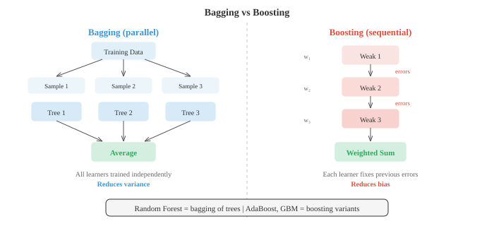

# 经典机器学习

*经典机器学习算法通过数据学习模式而无需显式编程，使用闭式解或启发式搜索而非梯度下降。本文涵盖朴素贝叶斯、k-NN、决策树、随机森林、支持向量机、k-means聚类和主成分分析*

- 机器学习是研究算法通过从数据中学习来提升其在某项任务上表现的学科，而非通过显式规则编程。与其编写"如果收入 > 50k 且年龄 < 30 则批准贷款"，不如将数千条历史贷款决策交给算法，让它自行找出模式。

- 存在三大范式。**监督学习**使用带标签数据，即每个输入都有已知的正确输出。算法学习从输入到输出的映射。**无监督学习**处理未标签数据，试图发现隐藏结构，如聚类或压缩表示。**强化学习**通过试错学习，根据在环境中采取的动作接收奖励或惩罚（在第04篇中介绍）。

- 在监督学习中，**分类**预测离散类别（垃圾邮件或非垃圾邮件，猫或狗），而**回归**预测连续值（房价、明天温度）。边界并不总是清晰：逻辑回归虽然名为"回归"，但实际上执行分类任务。

- 概率模型中的一个关键区分是**生成式 vs 判别式**。生成模型学习联合分布 $P(x, y)$，这意味着它理解数据本身的生成方式。它能产生新样本。判别模型直接学习 $P(y \mid x)$，仅关注类别之间的边界。朴素贝叶斯是生成式的；逻辑回归（第02篇）是判别式的。生成模型更灵活但更难训练好；判别模型在数据充足时通常给出更好的分类准确率。

- **朴素贝叶斯**是最简单且最有效的分类器之一。它直接应用贝叶斯定理（来自第05章）：

$$P(C_k \mid x) = \frac{P(x \mid C_k) \, P(C_k)}{P(x)}$$

- "朴素"之处在于一个强烈的独立性假设：它假设给定类别后每个特征相互独立。如果你正在将电子邮件分类为垃圾邮件，朴素贝叶斯假设一旦你知道邮件是垃圾邮件，单词"免费"的出现告诉你关于单词"赢家"是否出现的信息为零。这在现实中几乎从不成立，但分类器仍然出奇地好用。

- 由于 $P(x)$ 对所有类别都一样，分类简化为选择最大化分子的类别：

$$\hat{y} = \arg\max_{k} \; P(C_k) \prod_{i=1}^{n} P(x_i \mid C_k)$$

- 先验 $P(C_k)$ 就是每个类别中训练样本的比例。似然 $P(x_i \mid C_k)$ 取决于特征的类型，从而产生三种常见变体。

- **多项式朴素贝叶斯**专为计数数据设计，如文档中的词频。每个特征 $x_i$ 表示单词 $i$ 出现的次数，似然遵循多项分布。这是文本分类、情感分析和垃圾邮件过滤的标准选择。

- **高斯朴素贝叶斯**假设每个特征在每个类别内服从正态分布。你从训练数据中估计特征 $i$ 对类别 $k$ 的均值 $\mu_{ik}$ 和方差 $\sigma_{ik}^2$，然后计算：

$$P(x_i \mid C_k) = \frac{1}{\sqrt{2\pi\sigma_{ik}^2}} \exp\!\left(-\frac{(x_i - \mu_{ik})^2}{2\sigma_{ik}^2}\right)$$

- 当特征为连续测量值时，如身高、体重或传感器读数，这是自然的选择。


- **伯努利朴素贝叶斯**对二元特征建模：每个特征要么存在（1）要么不存在（0）。你不再统计单词出现的次数，而是只跟踪它是否出现。这适用于短文本或二元特征向量。

- 一个实际问题是，当某个特征值在训练数据中从未与某个类别一起出现时，似然变为零，由于所有概率相乘，整个后验概率也归零。**拉普拉斯平滑**通过为每个特征-类别组合添加一个小计数（通常为1）来解决这个问题：

$$P(x_i \mid C_k) = \frac{\text{count}(x_i, C_k) + \alpha}{\text{count}(C_k) + \alpha \cdot V}$$

- 这里 $\alpha$ 是平滑参数（通常为1），$V$ 是该特征的可能取值数量。这确保了任何概率永远不会精确为零。

- **决策树**采用了一种完全不同的方法。它不是计算概率，而是通过一系列的"是/否"问题来划分特征空间。想象"二十问"游戏：每一步，你问一个最能缩小可能性范围的问题。

- 树从根节点开始，包含所有训练样本。在每个内部节点，它选择一个特征和一个阈值进行分裂（例如，"年龄 < 30？"）。样本根据答案向左或向右流动。这一过程递归进行直到叶节点，叶节点中存放预测结果：分类任务中的多数类别，或回归任务中的均值。


- 关键问题是：应该选择哪个特征进行分裂？你希望分裂产生最"纯"的子节点，即大多数样本属于同一类别。衡量不纯度的两种常用指标是**基尼不纯度**和**熵**。

- **基尼不纯度**衡量的是如果按照该节点中的分布标记，随机选择的样本被错误分类的概率：

$$\text{Gini}(S) = 1 - \sum_{k=1}^{K} p_k^2$$

- 如果节点完全纯（全部属于一个类别），基尼值为0。如果类别完全平衡（比如两类各占50%），基尼值达到最大值0.5。

- **熵**（来自第05章的信息论部分）衡量平均惊讶程度：

$$H(S) = -\sum_{k=1}^{K} p_k \log_2 p_k$$

- 纯节点的熵为0。完全平衡的二元节点的熵为1比特。实际上，基尼和熵产生的树非常相似；基尼计算稍快，因为它避免了对数运算。

- **信息增益**是由一次分裂带来的不纯度降低。对于将集合 $S$ 划分为子集 $S_L$ 和 $S_R$ 的分裂：

$$\text{IG}(S, \text{split}) = H(S) - \frac{|S_L|}{|S|} H(S_L) - \frac{|S_R|}{|S|} H(S_R)$$

- 算法在每一节点贪心地选择信息增益最高的分裂。这是一种局部最优策略，而非全局最优，但在实践中效果很好。

- **回归树**工作原理相同，但叶子预测连续值（到达该叶子的样本的均值），分裂准则使用方差减少而非基尼或熵。

- 如果不加约束，决策树会一直分裂直到每个叶子都纯，本质上是在记忆训练数据。这是严重的过拟合。**剪枝**用于应对这一问题。预剪枝在树生长之前设置限制：最大深度、每个叶子的最少样本数、或进行分裂的最小信息增益。后剪枝先生长完整树，然后移除那些不能提升验证集性能的分支。

- 单个决策树易于解释，但往往不稳定：数据的微小变化可能导致完全不同的树。**集成方法**组合多个模型，以获得比任何单个模型更好的预测结果。

- 核心思想是"群众智慧"。如果你问100个平庸的分类器然后进行多数投票，只要各个分类器做出一定程度上独立的错误，集成结果可以非常出色。

- **Bagging**（自助汇聚法）在数据的不同随机子集上训练多个模型，采用有放回抽样（bootstrap样本）。每个模型大约看到原始数据的63%。在预测时，你对输出取平均（回归）或进行多数投票（分类）。由于每个模型看到不同的数据，它们犯不同的错误，平均操作抵消了大部分方差。

- **随机森林**是将bagging应用于决策树并增加一个额外技巧：在每个分裂处，树只考虑一个随机的特征子集（通常是从 $d$ 个总特征中选 $\sqrt{d}$ 个）。这进一步去除了树之间的相关性，使集成更强大。随机森林是整个机器学习中最可靠的现成分类器之一。



- **Boosting**采取了相反的哲学。它不是独立地训练模型，而是顺序地训练，每个新模型专注于之前模型分类错误的样本。

- **AdaBoost**（自适应提升）为每个训练样本维护一个权重。最初所有权重相等。训练一个弱学习器（通常是深度很浅的决策树，称为"桩"）后，被错误分类的样本获得更高的权重，因此下一个学习器更加关注它们。最终预测是所有学习器的加权投票，表现更好的学习器拥有更大的发言权：

$$H(x) = \text{sign}\!\left(\sum_{t=1}^{T} \alpha_t \, h_t(x)\right)$$

- 学习器 $t$ 的权重 $\alpha_t$ 取决于其错误率 $\epsilon_t$：

$$\alpha_t = \frac{1}{2} \ln\!\left(\frac{1 - \epsilon_t}{\epsilon_t}\right)$$

- 错误率低的学习器获得大的正权重；表现与随机水平持平（$\epsilon = 0.5$）的学习器获得零权重。

- **梯度提升**推广了这一思想。不同于重新加权样本，每个新模型被训练来预测当前集成整体的残差误差（损失函数的负梯度）。对于平方误差损失，残差就是预测值与目标值之间的差值。基于决策树的梯度提升（GBDT）是结构化数据竞赛中许多获胜方案背后的方法（XGBoost、LightGBM、CatBoost是流行的实现）。

- 关键对比：bagging降低**方差**（通过平均消除噪声），而boosting降低**偏差**（纠正系统性错误）。Bagging在个别模型过拟合时效果最好；boosting在模型欠拟合时效果最好。

- 转向无监督学习，**K-Means聚类**是最简单且使用最广泛的聚类算法。给定 $n$ 个数据点和目标聚类数 $K$，它通过最小化每个点到其聚类中心的距离总和，将每个点分配给 $K$ 个组之一。

- 算法交替进行两个步骤。首先，将每个点**分配**到最近的中心点。其次，将每个中心点**更新**为分配给它的所有点的均值。重复直到分配不再变化。这保证收敛，因为每一步总簇内距离都会减小（或保持不变）。


- 形式上，K-Means最小化簇内平方和，称为**惯性**：

$$J = \sum_{k=1}^{K} \sum_{x \in C_k} \|x - \mu_k\|^2$$

- 其中 $\mu_k$ 是簇 $C_k$ 的中心点。

- K-Means对初始化敏感。糟糕的起始中心点可能导致较差的局部最小值。**K-Means++** 初始化策略首先随机选择一个中心点，然后每个后续中心点的选择概率与其距离最近现有中心点的平方距离成正比。这分散了初始中心点，几乎总是能给出更好的结果。

- 如何选择 $K$？两种常用工具。**肘部法**绘制惯性随 $K$ 变化的曲线，寻找"肘部"——增加更多簇不再显著帮助的点。**轮廓系数**衡量一个点与其自身簇的相似度相对于最近其他簇的相似度，范围从-1（错误簇）到+1（良好聚类）。所有点的平均轮廓系数给出了聚类质量的整体衡量。

- K-Means有局限性：它假设大致相等大小的球形簇，并且它做出"硬"分配（每个点恰好属于一个簇）。**高斯混合模型（GMM）** 放松了这两个限制。

- GMM将数据建模为 $K$ 个高斯分布的混合，每个分布有自己的均值 $\mu_k$、协方差 $\Sigma_k$ 和混合权重 $\pi_k$（所有权重之和为1）：

$$P(x) = \sum_{k=1}^{K} \pi_k \, \mathcal{N}(x \mid \mu_k, \Sigma_k)$$

- 不同于硬分配，每个点得到一个**软分配**：它属于每个簇的概率（称为"责任"）。位于两个高斯边界附近的点可能是60%属于簇A，40%属于簇B。

- GMM使用**期望-最大化（EM）算法**进行拟合，该算法交替两个步骤，与K-Means非常类似。**E步**计算责任：对于每个点，它来自每个高斯的概率是多少？**M步**更新参数：给定责任，最佳的均值、协方差和混合权重是什么？EM保证每次迭代增加数据似然，并收敛到局部最大值。

- K-Means实际上是GMM的EM算法的一个特例：它对应于具有相等协方差的球形高斯和硬（0/1）责任分配。

- **支持向量机（SVM）** 从几何视角处理分类问题。给定两个线性可分的类别，存在无限多个超平面可以将它们分开。SVM找到**最大间隔**的那个——超平面与每个类别最近数据点之间的最大可能间隙。

- 最近的点，即恰好位于间隔边缘的点，称为**支持向量**。它们是定义决策边界唯一重要的点；你可以移除所有其他训练点，仍然得到相同的超平面。


- 对于线性分类器 $f(x) = w \cdot x + b$，找到最大间隔等价于求解：

$$\min_{w, b} \; \frac{1}{2}\|w\|^2 \quad \text{subject to} \quad y_i(w \cdot x_i + b) \geq 1 \; \text{for all } i$$

- 这是一个凸二次规划问题，因此有唯一的全局解（无需担心局部最小值）。

- 真实数据很少完美可分。**软间隔SVM** 通过引入松弛变量 $\xi_i \geq 0$ 允许一些点违反间隔：

$$\min_{w, b, \xi} \; \frac{1}{2}\|w\|^2 + C \sum_{i=1}^{n} \xi_i \quad \text{subject to} \quad y_i(w \cdot x_i + b) \geq 1 - \xi_i$$

- 超参数 $C$ 控制权衡：大的 $C$ 对错误分类施加高惩罚（更紧的拟合，有过拟合风险），小的 $C$ 允许更多违规（更宽的间隔，更强的正则化）。

- SVM最强大的特性是**核技巧**。许多在原始特征空间中不是线性可分的数据集，在映射到高维空间后变得可分。核技巧让你能够在那个高维空间中计算点积，而无需显式计算变换。

- 核函数 $K(x_i, x_j) = \phi(x_i) \cdot \phi(x_j)$ 替换SVM优化中的每个点积。最流行的核是**径向基函数（RBF）核**：

$$K(x_i, x_j) = \exp\!\left(-\gamma \|x_i - x_j\|^2\right)$$

- RBF核隐式地将数据映射到无限维空间。参数 $\gamma$ 控制单个训练点的影响范围：大的 $\gamma$ 意味着每个点只影响其紧邻区域（过拟合风险），小的 $\gamma$ 给出更平滑的边界。

- 其他常见核包括多项式核 $K(x_i, x_j) = (x_i \cdot x_j + c)^d$ 和线性核 $K(x_i, x_j) = x_i \cdot x_j$（即没有任何变换的标准SVM）。

- 实际上，带RBF核的SVM在深度学习出现之前是主导分类器。它们在中小规模数据集上仍然表现良好，特别是当特征数量相对于样本数量较大时。

- SVM与第02章（矩阵）的联系很深。优化通常以其对偶形式求解，其中解仅依赖于训练样本之间的点积——这正是使核技巧成为可能的原因。整个算法以内积和线性代数的语言运作。

- 汇总经典ML工具箱：

| 算法 | 类型 | 关键优势 | 关键劣势 |
|---|---|---|---|
| 朴素贝叶斯 | 监督（生成式） | 快速，少量数据即可工作 | 独立性假设 |
| 决策树 | 监督 | 可解释 | 容易过拟合 |
| 随机森林 | 监督（集成） | 稳健，超参数少 | 可解释性较差 |
| 梯度提升 | 监督（集成） | 表格数据上的最优水平 | 较慢，调参更多 |
| K-Means | 无监督（聚类） | 简单，可扩展 | 假设球形簇 |
| GMM | 无监督（聚类） | 软分配，形状灵活 | 对初始化敏感 |
| SVM | 监督 | 高维有效 | 大数据集上慢 |

## 编程任务（在CoLab或笔记本中完成）

1. 从头实现高斯朴素贝叶斯。在合成二维数据（两个类别）上训练并可视化决策边界。与scikit-learn的实现进行比较。
```python
import jax.numpy as jnp
import matplotlib.pyplot as plt
from sklearn.datasets import make_classification

# 生成合成数据
X, y = make_classification(n_samples=300, n_features=2, n_redundant=0,
                           n_informative=2, n_clusters_per_class=1, random_state=42)
X, y = jnp.array(X), jnp.array(y)

# 从头拟合高斯朴素贝叶斯
classes = jnp.unique(y)
params = {}
for c in classes:
    c = int(c)
    mask = y == c
    X_c = X[mask]
    params[c] = {
        'mean': jnp.mean(X_c, axis=0),
        'var': jnp.var(X_c, axis=0),
        'prior': jnp.sum(mask) / len(y)
    }

def gaussian_log_likelihood(x, mean, var):
    return -0.5 * jnp.sum(jnp.log(2 * jnp.pi * var) + (x - mean)**2 / var)

def predict(X):
    preds = []
    for x in X:
        log_posts = []
        for c in [0, 1]:
            log_post = jnp.log(params[c]['prior']) + gaussian_log_likelihood(
                x, params[c]['mean'], params[c]['var'])
            log_posts.append(log_post)
        preds.append(jnp.argmax(jnp.array(log_posts)))
    return jnp.array(preds)

# 决策边界可视化
xx, yy = jnp.meshgrid(jnp.linspace(X[:,0].min()-1, X[:,0].max()+1, 200),
                       jnp.linspace(X[:,1].min()-1, X[:,1].max()+1, 200))
grid = jnp.column_stack([xx.ravel(), yy.ravel()])
zz = predict(grid).reshape(xx.shape)

plt.figure(figsize=(8, 6))
plt.contourf(xx, yy, zz, alpha=0.3, cmap='coolwarm')
plt.scatter(X[y==0, 0], X[y==0, 1], c='#3498db', label='Class 0', edgecolors='k', s=20)
plt.scatter(X[y==1, 0], X[y==1, 1], c='#e74c3c', label='Class 1', edgecolors='k', s=20)
plt.title("Gaussian Naive Bayes Decision Boundary")
plt.legend()
plt.grid(alpha=0.3)
plt.show()

accuracy = jnp.mean(predict(X) == y)
print(f"Training accuracy: {accuracy:.2%}")
```

2. 构建一个使用基尼不纯度进行分裂的决策树。实现单个节点的分裂逻辑，并展示信息增益如何选择最佳特征和阈值。
```python
import jax.numpy as jnp

def gini_impurity(y):
    """计算标签数组的基尼不纯度。"""
    classes, counts = jnp.unique(y, return_counts=True)
    probs = counts / len(y)
    return 1.0 - jnp.sum(probs ** 2)

def information_gain(y, left_mask):
    """通过布尔掩码将y分裂为左/右后的信息增益。"""
    parent_gini = gini_impurity(y)
    left_y, right_y = y[left_mask], y[~left_mask]
    n = len(y)
    if len(left_y) == 0 or len(right_y) == 0:
        return 0.0
    child_gini = (len(left_y)/n) * gini_impurity(left_y) + \
                 (len(right_y)/n) * gini_impurity(right_y)
    return float(parent_gini - child_gini)

def best_split(X, y):
    """找到最大化信息增益的特征和阈值。"""
    best_ig, best_feat, best_thresh = -1, None, None
    for feat in range(X.shape[1]):
        thresholds = jnp.unique(X[:, feat])
        for thresh in thresholds:
            mask = X[:, feat] <= float(thresh)
            ig = information_gain(y, mask)
            if ig > best_ig:
                best_ig, best_feat, best_thresh = ig, feat, float(thresh)
    return best_feat, best_thresh, best_ig

# 示例：合成数据
from sklearn.datasets import make_classification
X, y = make_classification(n_samples=100, n_features=4, n_redundant=0, random_state=0)
X, y = jnp.array(X), jnp.array(y)

feat, thresh, ig = best_split(X, y)
print(f"Best split: feature {feat}, threshold {thresh:.3f}, info gain {ig:.4f}")
print(f"Parent Gini: {gini_impurity(y):.4f}")
mask = X[:, feat] <= thresh
print(f"Left Gini:   {gini_impurity(y[mask]):.4f} ({int(jnp.sum(mask))} samples)")
print(f"Right Gini:  {gini_impurity(y[~mask]):.4f} ({int(jnp.sum(~mask))} samples)")
```

3. 从头实现带K-Means++初始化的K-Means。对合成数据集进行聚类并可视化每次迭代的簇。
```python
import jax
import jax.numpy as jnp
import matplotlib.pyplot as plt
from sklearn.datasets import make_blobs

# 生成合成簇
X, y_true = make_blobs(n_samples=300, centers=4, cluster_std=0.8, random_state=42)
X = jnp.array(X)

def kmeans_plus_plus_init(X, K, key):
    """K-Means++初始化。"""
    n = X.shape[0]
    idx = jax.random.randint(key, (), 0, n)
    centroids = [X[idx]]
    for _ in range(1, K):
        dists = jnp.min(jnp.stack([jnp.sum((X - c)**2, axis=1) for c in centroids]), axis=0)
        probs = dists / jnp.sum(dists)
        key, subkey = jax.random.split(key)
        idx = jax.random.choice(subkey, n, p=probs)
        centroids.append(X[idx])
    return jnp.stack(centroids)

def kmeans(X, K, max_iters=20, key=jax.random.PRNGKey(0)):
    centroids = kmeans_plus_plus_init(X, K, key)
    history = [centroids]
    for _ in range(max_iters):
        # 分配步骤
        dists = jnp.stack([jnp.sum((X - c)**2, axis=1) for c in centroids])
        labels = jnp.argmin(dists, axis=0)
        # 更新步骤
        new_centroids = jnp.stack([
            jnp.mean(X[labels == k], axis=0) for k in range(K)
        ])
        history.append(new_centroids)
        if jnp.allclose(centroids, new_centroids):
            break
        centroids = new_centroids
    return labels, centroids, history

K = 4
labels, centroids, history = kmeans(X, K)

# 绘制最终结果
colors = ['#3498db', '#e74c3c', '#27ae60', '#9b59b6']
plt.figure(figsize=(8, 6))
for k in range(K):
    mask = labels == k
    plt.scatter(X[mask, 0], X[mask, 1], c=colors[k], s=20, alpha=0.6)
    plt.scatter(centroids[k, 0], centroids[k, 1], c=colors[k], marker='X',
                s=200, edgecolors='k', linewidths=1.5)
plt.title(f"K-Means Clustering (K={K}, {len(history)-1} iterations)")
plt.grid(alpha=0.3)
plt.show()

# 计算惯性
inertia = sum(jnp.sum((X[labels == k] - centroids[k])**2) for k in range(K))
print(f"Final inertia: {inertia:.2f}")
```

4. 演示核技巧。通过比较核矩阵与多项式核的显式特征映射，展示RBF核如何在高维空间中计算点积。
```python
import jax.numpy as jnp

# 简单2D数据
X = jnp.array([[1.0, 2.0], [3.0, 4.0], [5.0, 6.0]])

# 多项式核：K(x,y) = (x·y + 1)^2
def poly_kernel(X, degree=2, c=1.0):
    return (X @ X.T + c) ** degree

# 2D的显式二次特征映射：(1, sqrt(2)*x1, sqrt(2)*x2, x1^2, x2^2, sqrt(2)*x1*x2)
def poly_features(X):
    x1, x2 = X[:, 0], X[:, 1]
    return jnp.column_stack([
        jnp.ones(len(X)),
        jnp.sqrt(2) * x1,
        jnp.sqrt(2) * x2,
        x1 ** 2,
        x2 ** 2,
        jnp.sqrt(2) * x1 * x2
    ])

K_trick = poly_kernel(X)
phi = poly_features(X)
K_explicit = phi @ phi.T

print("Kernel trick (polynomial degree 2):")
print(K_trick)
print("\nExplicit feature map dot products:")
print(K_explicit)
print(f"\nMatrices match: {jnp.allclose(K_trick, K_explicit)}")

# RBF核：不存在有限的显式映射
def rbf_kernel(X, gamma=0.5):
    sq_dists = jnp.sum(X**2, axis=1, keepdims=True) + \
               jnp.sum(X**2, axis=1) - 2 * X @ X.T
    return jnp.exp(-gamma * sq_dists)

K_rbf = rbf_kernel(X)
print("\nRBF kernel matrix:")
print(K_rbf)
print("Diagonal is always 1 (a point is identical to itself)")
print("Off-diagonal entries decay with distance")
```
