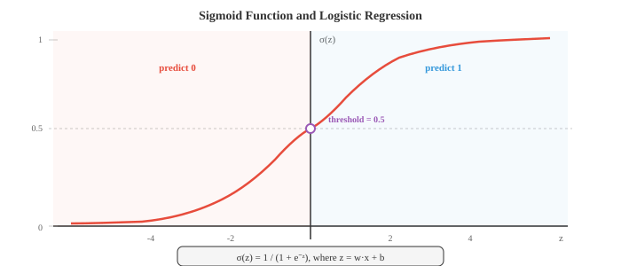

# 梯度机器学习

*基于梯度的学习通过沿着损失曲面的斜率迭代优化模型参数。本文涵盖线性回归、逻辑回归、softmax分类、梯度下降变体、正则化（L1/L2）和偏差-方差权衡*

- 第01篇中的经典方法使用巧妙的启发式或闭式解。本文涵盖通过沿着梯度学习、在损失曲面上小步下坡直到找到好参数的算法。基于梯度的学习是从线性回归到最大神经网络的一切背后的引擎。

- **线性回归**是最简单的基于梯度的模型，它也有闭式解，这使其成为完美的起点。模型是一条直线（或更高维的超平面）：

$$\hat{y} = w \cdot x + b = \sum_{i=1}^{d} w_i x_i + b$$

- 用矩阵符号（来自第02章），如果我们将所有训练输入堆叠为矩阵 $X$ 的行，并通过追加一列1将偏置吸收到 $w$ 中，这就变成了 $\hat{y} = Xw$。

- 目标是最小化**均方误差（MSE）**，即预测值与实际值之间平均平方差：

$$\mathcal{L}(w) = \frac{1}{n} \sum_{i=1}^{n} (y_i - \hat{y}_i)^2 = \frac{1}{n} \|y - Xw\|^2$$

- 为什么采用平方误差？它有概率论上的依据：如果你假设目标值由 $y = Xw + \epsilon$ 生成，其中 $\epsilon \sim \mathcal{N}(0, \sigma^2)$，那么最大化数据的高斯似然（第05章）等价于最小化MSE。平方误差还比小错误更严厉地惩罚大错误，这通常是可取的。


- 由于MSE是 $w$ 的二次函数，它具有唯一的全局最小值，我们可以通过解析方法找到。求导、设为零并求解，得到**正规方程**：

$$w^{*} = (X^T X)^{-1} X^T y$$

- 这直接使用了第02章的矩阵逆运算。表达式 $X^T X$ 是一个 $d \times d$ 矩阵（其中 $d$ 是特征数量），$X^T y$ 是一个 $d$ 维向量。正规方程一次性给出精确的最优权重。

- 正规方程何时失效？当 $X^T X$ 奇异（不可逆）时，这发生在特征线性相关或特征数量多于样本数量（$d > n$）的情况下。在这些情况下，你需要正则化（后续介绍）或梯度下降。

- **逻辑回归**将线性模型适用于二元分类。我们不预测连续值，而是想要一个介于0和1之间的概率。**Sigmoid函数**将所有实数压缩到这个范围内：

$$\sigma(z) = \frac{1}{1 + e^{-z}}$$

- 模型计算 $z = w \cdot x + b$（线性得分，与线性回归相同），然后将其通过sigmoid：$\hat{y} = \sigma(w \cdot x + b)$。输出 $\hat{y}$ 被解释为 $P(y = 1 \mid x)$。



- Sigmoid具有良好的性质：$\sigma(0) = 0.5$，$\sigma(z) \to 1$ 当 $z \to \infty$，$\sigma(z) \to 0$ 当 $z \to -\infty$，且其导数具有优雅的形式 $\sigma'(z) = \sigma(z)(1 - \sigma(z))$。

- 逻辑回归的损失函数是**二元交叉熵（BCE）**，直接来自于伯努利似然（第05章）：

$$\mathcal{L} = -\frac{1}{n} \sum_{i=1}^{n} \left[ y_i \log(\hat{y}_i) + (1 - y_i) \log(1 - \hat{y}_i) \right]$$

- 当真实标签为1时，只有第一项起作用，它惩罚过低的预测。当真实标签为0时，只有第二项起作用，它惩罚过高的预测。对数使得对于自信的错误预测，惩罚极其陡峭：当真实标签为1时预测0.01，代价远高于预测0.4。

- 与线性回归的MSE不同，BCE最小化权重没有闭式解。我们需要一种迭代方法：**梯度下降**。

- 梯度下降的直觉很简单：想象你身处大雾中的丘陵地带（损失曲面）。你看不到全局最小值，但可以感受到脚下的坡度。你向下坡走一步，再次感受坡度，然后重复。最终你到达一个山谷。

$$w \leftarrow w - \eta \frac{\partial \mathcal{L}}{\partial w}$$

- 学习率 $\eta$ 控制你的步长。太大则越过山谷，来回弹跳而不收敛。太小则缓慢前行，可能陷入局部最小值。


- 梯度 $\frac{\partial \mathcal{L}}{\partial w}$ 是一个指向最陡上升方向的向量。我们减去它是因为想向下坡走。这是第03章中的链式法则应用于损失函数。

- **批量梯度下降**每一步使用整个训练集计算梯度。这给出精确梯度，但当 $n$ 很大时计算代价高昂。

- **随机梯度下降（SGD）** 每一步使用单个随机样本。梯度带有噪声（它从一个样本估计真实梯度），但每一步非常快。噪声实际上可以帮助逃离浅的局部极小值。

- **小批量梯度下降**折中：每一步使用 $B$ 个样本的批次（通常为32、64或256）。这平衡了计算效率（对批次的向量化操作）与梯度质量。几乎所有深度学习都使用小批量SGD。

- **反向传播**是我们实际计算具有许多参数的模型（如神经网络）中梯度的方法。它是第03章的链式法则通过计算图系统化地应用。

- 任何模型都可以表示为操作的有向无环图：输入流入，乘以权重，加在一起，通过非线性函数传递，最终产生损失值。**前向传播**通过让数据从输入到输出流经此图来计算输出（和损失）。

- **反向传播**反向流动梯度。从损失开始，你使用每个节点的链式法则计算损失相对于每个中间值的变化。如果 $L$ 依赖于 $z$，而 $z$ 依赖于 $w$，则：

$$\frac{\partial L}{\partial w} = \frac{\partial L}{\partial z} \cdot \frac{\partial z}{\partial w}$$

- 每个节点只需要知道自己的局部导数和从上方流入的梯度。这使得反向传播模块化且高效：代价大约是前向传播的两倍（一次前向，一次反向）。

- 原始SGD有一个问题：它在陡峭曲率方向上振荡，而在平坦方向上进展缓慢。**优化器**通过根据梯度历史调整步长来改进这一点。

- **带动量的SGD**维护过去梯度的运行平均值（指数移动平均，来自第04章）。这平滑了振荡并加速了沿一致方向的进展：

$$v_t = \beta v_{t-1} + (1 - \beta) \nabla \mathcal{L}$$
$$w \leftarrow w - \eta \, v_t$$

- 想象一个滚下山的球：动量让它沿一致方向积累速度并抑制侧向抖动。典型值为 $\beta = 0.9$。

- **内斯特罗夫加速梯度（NAG）** 是一个小巧但巧妙的调整：不在当前位置计算梯度，而是在"前瞻"位置 $w - \eta \beta v_{t-1}$ 计算梯度。这一修正步骤减少了过冲：

$$v_t = \beta \, v_{t-1} + \nabla \mathcal{L}(w - \eta \beta \, v_{t-1})$$
$$w \leftarrow w - \eta \, v_t$$

- **Adagrad** 为每个参数调整学习率。接收大梯度的参数获得较小的学习率，反之亦然。它累积平方梯度：

$$G_t = G_{t-1} + g_t^2, \quad w \leftarrow w - \frac{\eta}{\sqrt{G_t + \epsilon}} g_t$$

- 问题在于：$G_t$ 只增不减，因此有效学习率单调递减，最终变得太小而无法学习任何东西。

- **RMSprop** 通过使用平方梯度的指数移动平均而非求和来修复此问题，使得近期梯度比早期梯度更重要：

$$s_t = \beta \, s_{t-1} + (1 - \beta) g_t^2, \quad w \leftarrow w - \frac{\eta}{\sqrt{s_t + \epsilon}} g_t$$

- **Adam**（自适应矩估计）结合了动量和RMSprop。它同时维护一阶矩估计（梯度的均值，像动量）和二阶矩估计（平方梯度的均值，像RMSprop）：

$$m_t = \beta_1 m_{t-1} + (1 - \beta_1) g_t$$
$$v_t = \beta_2 v_{t-1} + (1 - \beta_2) g_t^2$$

- 由于 $m_t$ 和 $v_t$ 初始化为零，它们在早期步骤中有偏近于零。偏差修正解决了这个问题：

$$\hat{m}_t = \frac{m_t}{1 - \beta_1^t}, \quad \hat{v}_t = \frac{v_t}{1 - \beta_2^t}$$
$$w \leftarrow w - \frac{\eta}{\sqrt{\hat{v}_t} + \epsilon} \hat{m}_t$$


- 默认超参数（$\beta_1 = 0.9$, $\beta_2 = 0.999$, $\epsilon = 10^{-8}$）在广泛的问题上表现良好，这就是为什么Adam是大多数深度学习工作中的默认优化器。

- **AdamW** 将权重衰减与梯度更新解耦。标准L2正则化和权重衰减对于SGD是等价的，但对于Adam则不然。AdamW直接将权重衰减应用于参数，而不是将 $\lambda w$ 加到梯度上。这带来了更好的泛化性能，现在是Transformer训练的标准：

$$w \leftarrow w - \eta \left( \frac{\hat{m}_t}{\sqrt{\hat{v}_t} + \epsilon} + \lambda \, w \right)$$

- **LION**（演化符号动量）是通过程序搜索发现的新优化器。它只使用动量更新的符号（而不是幅度），使得每次更新的尺度均匀。LION比Adam使用更少的内存（没有二阶矩缓冲区），并且在许多任务上可以匹配或超越Adam：

$$w \leftarrow w - \eta \cdot \text{sign}(\beta_1 \, m_{t-1} + (1 - \beta_1) \, g_t)$$
$$m_t = \beta_2 \, m_{t-1} + (1 - \beta_2) \, g_t$$

- **Muon**（动量 + 正交化）应用内斯特罗夫动量，然后使用Newton-Schulz迭代对更新矩阵进行正交化，该迭代近似极分解。得到的更新方向位于Stiefel流形上，每次更新在所有奇异方向上具有大致相等的幅度，防止任何单一方向主导。这消除了对自适应二阶矩估计（如Adam的 $v_t$ 缓冲区）的需求，减少了内存使用。Muon在Transformer训练中表现出色，通常以更快的收敛速度达到与AdamW相当的质量，尤其适用于注意力矩阵和MLP权重矩阵。嵌入层和输出层通常仍由AdamW处理。

$$G_t = \text{NesterovMomentum}(\nabla \mathcal{L})$$
$$U_t = \text{NewtonSchulz}(G_t) \approx G_t (G_t^T G_t)^{-1/2}$$
$$W \leftarrow W - \eta \, U_t$$

- Newton-Schulz迭代通过重复 $X_{k+1} = \frac{1}{2} X_k (3I - X_k^T X_k)$ 几个步骤（通常5-10步）来计算正交因子。这避免了完整SVD的计算代价，同时提供了良好的近似。


- 除了MSE和BCE之外，还有几种常用的**损失函数**。

- **平均绝对误差（MAE）**，或L1损失，取绝对差的平均值：$\frac{1}{n}\sum|y_i - \hat{y}_i|$。它对异常值比MSE更鲁棒，因为它不对大误差进行平方。

- **Huber损失**结合了两者的优点：对于小误差表现像MSE（平滑，易于优化），对于大误差表现像MAE（对异常值鲁棒）。它有一个控制过渡的阈值 $\delta$。

- **分类交叉熵（CCE）** 将BCE推广到多个类别。如果 $\hat{y}_k$ 是类别 $k$ 的预测概率，真实类别为 $c$：

$$\mathcal{L} = -\log(\hat{y}_c)$$

- 这只是正确类别的负对数概率。最小化交叉熵等价于最大化似然，这联系到第05章的信息论：交叉熵衡量当你使用预测分布代替真实分布时需要多少额外比特。

- **Hinge损失** 被SVM使用：$\mathcal{L} = \max(0, 1 - y \cdot f(x))$。它只惩罚在间隔错误一侧或间隔内的预测。一旦一个点被足够置信地正确分类，损失为零。

- **正则化**通过添加对复杂模型的惩罚来防止过拟合。正则化后的损失为：

$$\mathcal{L}_{\text{reg}} = \mathcal{L}_{\text{data}} + \lambda \, R(w)$$

- **L2正则化**（Ridge，权重衰减）惩罚平方权重之和：$R(w) = \|w\|^2 = \sum w_i^2$。它阻止任何单个权重变得过大，有效地将所有权重向零收缩，但很少使它们精确为零。

- **L1正则化**（Lasso）惩罚绝对权重之和：$R(w) = \|w\|_1 = \sum |w_i|$。它鼓励稀疏性，将许多权重驱动到精确为零，实现自动特征选择。

- **弹性网络** 结合了两者：$R(w) = \alpha \|w\|_1 + (1 - \alpha) \|w\|^2$，融合了稀疏性和收缩。

- 有一个优美的贝叶斯解释（来自第05章）。L2正则化等价于在权重上放置高斯先验并寻找MAP估计。L1正则化对应于拉普拉斯先验。正则化强度 $\lambda$ 控制你相对于数据信任先验的程度。

- **评估指标**告诉你模型是否真正有效。对于回归，MSE和MAE是标准指标。对于分类，情况更为微妙。

- **混淆矩阵**是一个二元分类的四格表：
  - 真正例（TP）：预测为正，实际为正
  - 假正例（FP）：预测为正，实际为负
  - 真负例（TN）：预测为负，实际为负
  - 假负例（FN）：预测为负，实际为正

- **准确率** = $\frac{TP + TN}{TP + TN + FP + FN}$ 在类别不平衡时可能具有误导性。如果99%的电子邮件不是垃圾邮件，一个总是预测"非垃圾邮件"的模型有99%的准确率，但没有用处。

- **精确率** = $\frac{TP}{TP + FP}$ 回答：在所有预测为正的样本中，有多少实际为正？高精确率意味着误报少。

- **召回率**（敏感度）= $\frac{TP}{TP + FN}$ 回答：在所有实际为正的样本中，你捕获了多少？高召回率意味着漏检少。

- **F1分数** = $\frac{2 \cdot \text{precision} \cdot \text{recall}}{\text{precision} + \text{recall}}$ 是精确率和召回率的调和平均数，平衡了两者。

- **ROC曲线**绘制了真正率（召回率）对假正率（$\frac{FP}{FP + TN}$）随分类阈值从0到1变化的曲线。完美分类器紧贴左上角。**AUC**（ROC曲线下面积）用一个数字概括性能：1.0为完美，0.5为随机猜测。

- **交叉验证**提供了更可靠的泛化性能估计。在 $k$ 折交叉验证中，你将数据分成 $k$ 份，在 $k-1$ 份上训练，在剩余一份上测试，然后轮换。所有 $k$ 折的平均测试性能就是你的估计。这使用了所有数据进行训练和测试（只是不在同一时间），在数据稀缺时尤为宝贵。

- **偏差-方差权衡**（来自第04章）是ML中的基本张力。模型期望误差分解为：

$$\text{Error} = \text{Bias}^2 + \text{Variance} + \text{Irreducible Noise}$$

- **偏差**是错误假设带来的系统性误差（例如，用直线拟合曲线数据）。**方差**是对训练数据波动的敏感度（例如，20次多项式拟合噪声）。简单模型具有高偏差和低方差；复杂模型具有低偏差和高方差。最优在两者之间。

- **学习率调度**在训练期间调整 $\eta$。常见策略：
  - 步长衰减：每 $N$ 个epoch将 $\eta$ 乘以一个因子（如0.1）
  - 余弦退火：按照余弦曲线从初始值平滑降低 $\eta$ 到接近零
  - 预热：从一个非常小的 $\eta$ 开始，在前几千步线性增加，然后衰减。这防止了大的初始梯度破坏训练稳定性
  - 1cycle：一个先升后降的余弦周期，可以带来更快的收敛

- **超参数调优**是找到学习率、批量大小、正则化强度和其他不由梯度下降学习的设置的良好值的过程。常用方法：
  - 网格搜索：在预定义的网格上尝试每一种组合（穷举但代价高）
  - 随机搜索：随机采样组合，通常更高效，因为并非所有超参数同等重要
  - 贝叶斯优化：构建目标函数的模型并智能选择下一个要尝试的超参数
  - **ASHA**（异步连续减半算法）：使用小预算并行运行许多试验，然后将最有希望的提升到更大预算，同时及早终止其余试验。它结合了早停的高效性和大规模并行性——不是运行100次完整的训练，而是廉价地启动所有100次，在每级保留前四分之一，只有少数运行到完成。这是现代大规模调优框架（如Ray Tune）的骨干。

- **无调度学习**完全消除了对学习率调度的需求。它不是在固定曲线上衰减 $\eta$，而是维护两个序列：一个缓慢移动的迭代平均值 $z_t$（收敛到最优值）和一个快速探索的迭代 $y_t$（在其上评估梯度）。最终输出是平均序列，被证明在事后能匹配最佳调度的收敛速度。这完全消除了调度作为一个超参数——你只需设置基础学习率，优化器处理其余部分。SGD和Adam的无调度变体已被证明能达到或超越其经过调度的对应版本。

## 编程任务（在CoLab或笔记本中完成）

1. 使用正规方程和梯度下降两种方法实现线性回归。比较求解结果，并绘制GD损失随迭代的收敛曲线。
```python
import jax
import jax.numpy as jnp
import matplotlib.pyplot as plt

# 生成合成数据：y = 3x + 2 + noise
key = jax.random.PRNGKey(42)
n = 100
X = jax.random.uniform(key, (n, 1), minval=0, maxval=10)
y = 3 * X[:, 0] + 2 + jax.random.normal(key, (n,)) * 1.5

# 添加偏置列
X_b = jnp.column_stack([X, jnp.ones(n)])

# 正规方程
w_exact = jnp.linalg.solve(X_b.T @ X_b, X_b.T @ y)
print(f"Normal equation: w={w_exact[0]:.4f}, b={w_exact[1]:.4f}")

# 梯度下降
w_gd = jnp.zeros(2)
lr = 0.005
losses = []
for step in range(500):
    pred = X_b @ w_gd
    error = pred - y
    loss = jnp.mean(error ** 2)
    losses.append(float(loss))
    grad = (2 / n) * X_b.T @ error
    w_gd = w_gd - lr * grad

print(f"Gradient descent: w={w_gd[0]:.4f}, b={w_gd[1]:.4f}")

fig, axes = plt.subplots(1, 2, figsize=(12, 4))
axes[0].scatter(X[:, 0], y, s=15, alpha=0.5, color='#3498db')
axes[0].plot([0, 10], [w_exact[1], w_exact[0]*10 + w_exact[1]], color='#e74c3c', linewidth=2)
axes[0].set_title("Linear Regression Fit")
axes[0].set_xlabel("x"); axes[0].set_ylabel("y")

axes[1].plot(losses, color='#27ae60', linewidth=1.5)
axes[1].set_title("GD Loss Convergence")
axes[1].set_xlabel("Step"); axes[1].set_ylabel("MSE")
axes[1].set_yscale('log')
plt.tight_layout()
plt.show()
```

2. 从头实现带梯度下降的逻辑回归。在二维数据集上训练并可视化学习到的决策边界。
```python
import jax
import jax.numpy as jnp
import matplotlib.pyplot as plt
from sklearn.datasets import make_moons

# 生成数据
X, y = make_moons(n_samples=300, noise=0.2, random_state=42)
X, y = jnp.array(X), jnp.array(y, dtype=jnp.float32)

def sigmoid(z):
    return 1 / (1 + jnp.exp(-z))

# 添加偏置列
X_b = jnp.column_stack([X, jnp.ones(len(X))])
w = jnp.zeros(3)
lr = 0.5
losses = []

for step in range(2000):
    z = X_b @ w
    pred = sigmoid(z)
    # BCE损失
    loss = -jnp.mean(y * jnp.log(pred + 1e-8) + (1 - y) * jnp.log(1 - pred + 1e-8))
    losses.append(float(loss))
    # 梯度
    grad = X_b.T @ (pred - y) / len(y)
    w = w - lr * grad

# 决策边界
xx, yy = jnp.meshgrid(jnp.linspace(-2, 3, 200), jnp.linspace(-1.5, 2, 200))
grid = jnp.column_stack([xx.ravel(), yy.ravel(), jnp.ones(xx.size)])
zz = sigmoid(grid @ w).reshape(xx.shape)

plt.figure(figsize=(8, 6))
plt.contourf(xx, yy, zz, levels=[0, 0.5, 1], alpha=0.3, colors=['#e74c3c', '#3498db'])
plt.contour(xx, yy, zz, levels=[0.5], colors='#9b59b6', linewidths=2)
plt.scatter(X[y==0, 0], X[y==0, 1], c='#e74c3c', s=15, label='Class 0')
plt.scatter(X[y==1, 0], X[y==1, 1], c='#3498db', s=15, label='Class 1')
plt.title("Logistic Regression Decision Boundary")
plt.legend()
plt.grid(alpha=0.3)
plt.show()
```

3. 在二维二次曲面上比较优化器的轨迹。从相同的起点运行SGD、SGD+Momentum和Adam，绘制它们的路径。
```python
import jax
import jax.numpy as jnp
import matplotlib.pyplot as plt

# 拉长的二次曲面：L(w1, w2) = 0.5*w1^2 + 10*w2^2
def loss_fn(w):
    return 0.5 * w[0]**2 + 10 * w[1]**2

grad_fn = jax.grad(loss_fn)

def run_sgd(w0, lr=0.05, steps=80):
    w = w0.copy()
    path = [w.copy()]
    for _ in range(steps):
        g = grad_fn(w)
        w = w - lr * g
        path.append(w.copy())
    return jnp.stack(path)

def run_momentum(w0, lr=0.05, beta=0.9, steps=80):
    w, v = w0.copy(), jnp.zeros(2)
    path = [w.copy()]
    for _ in range(steps):
        g = grad_fn(w)
        v = beta * v + (1 - beta) * g
        w = w - lr * v
        path.append(w.copy())
    return jnp.stack(path)

def run_adam(w0, lr=0.05, b1=0.9, b2=0.999, eps=1e-8, steps=80):
    w, m, v = w0.copy(), jnp.zeros(2), jnp.zeros(2)
    path = [w.copy()]
    for t in range(1, steps + 1):
        g = grad_fn(w)
        m = b1 * m + (1 - b1) * g
        v = b2 * v + (1 - b2) * g**2
        m_hat = m / (1 - b1**t)
        v_hat = v / (1 - b2**t)
        w = w - lr * m_hat / (jnp.sqrt(v_hat) + eps)
        path.append(w.copy())
    return jnp.stack(path)

w0 = jnp.array([8.0, 3.0])
sgd_path = run_sgd(w0)
mom_path = run_momentum(w0)
adam_path = run_adam(w0)

# 绘图
fig, ax = plt.subplots(figsize=(8, 6))
w1 = jnp.linspace(-10, 10, 100)
w2 = jnp.linspace(-4, 4, 100)
W1, W2 = jnp.meshgrid(w1, w2)
L = 0.5 * W1**2 + 10 * W2**2
ax.contour(W1, W2, L, levels=20, cmap='Greys', alpha=0.4)
ax.plot(sgd_path[:,0], sgd_path[:,1], 'o-', color='#3498db', markersize=2, linewidth=1, label='SGD')
ax.plot(mom_path[:,0], mom_path[:,1], 'o-', color='#27ae60', markersize=2, linewidth=1, label='Momentum')
ax.plot(adam_path[:,0], adam_path[:,1], 'o-', color='#e74c3c', markersize=2, linewidth=1, label='Adam')
ax.plot(0, 0, 'k*', markersize=15, label='Minimum')
ax.set_xlabel('w₁'); ax.set_ylabel('w₂')
ax.set_title("Optimizer Trajectories on Elongated Quadratic")
ax.legend()
plt.grid(alpha=0.3)
plt.show()
```

4. 展示L1与L2正则化对权重稀疏性的影响。使用两种惩罚训练线性回归，并比较得到的权重向量。
```python
import jax
import jax.numpy as jnp
import matplotlib.pyplot as plt

# 合成数据：20个特征中只有前3个是相关的
key = jax.random.PRNGKey(0)
n, d = 200, 20
w_true = jnp.zeros(d).at[:3].set(jnp.array([3.0, -2.0, 1.5]))
X = jax.random.normal(key, (n, d))
y = X @ w_true + 0.5 * jax.random.normal(key, (n,))

def train_ridge(X, y, lam=1.0, lr=0.01, steps=2000):
    """通过GD进行L2正则化线性回归。"""
    w = jnp.zeros(X.shape[1])
    for _ in range(steps):
        pred = X @ w
        grad = (2/len(y)) * X.T @ (pred - y) + 2 * lam * w
        w = w - lr * grad
    return w

def train_lasso(X, y, lam=1.0, lr=0.01, steps=2000):
    """通过近端GD进行L1正则化线性回归。"""
    w = jnp.zeros(X.shape[1])
    for _ in range(steps):
        pred = X @ w
        grad = (2/len(y)) * X.T @ (pred - y)
        w = w - lr * grad
        # 软阈值（L1的近端算子）
        w = jnp.sign(w) * jnp.maximum(jnp.abs(w) - lr * lam, 0)
    return w

w_l2 = train_ridge(X, y, lam=0.1)
w_l1 = train_lasso(X, y, lam=0.1)

fig, axes = plt.subplots(1, 3, figsize=(14, 4))
axes[0].bar(range(d), w_true, color='#333', alpha=0.7)
axes[0].set_title("True Weights"); axes[0].set_xlabel("Feature")
axes[1].bar(range(d), w_l2, color='#3498db', alpha=0.7)
axes[1].set_title("L2 (Ridge): shrinks all"); axes[1].set_xlabel("Feature")
axes[2].bar(range(d), w_l1, color='#e74c3c', alpha=0.7)
axes[2].set_title("L1 (Lasso): zeros out irrelevant"); axes[2].set_xlabel("Feature")
plt.tight_layout()
plt.show()

print(f"L2 non-zero weights: {int(jnp.sum(jnp.abs(w_l2) > 0.01))}/{d}")
print(f"L1 non-zero weights: {int(jnp.sum(jnp.abs(w_l1) > 0.01))}/{d}")
```
