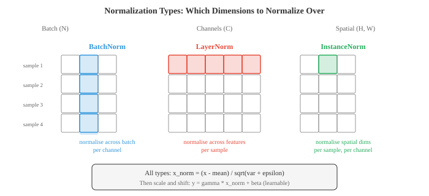
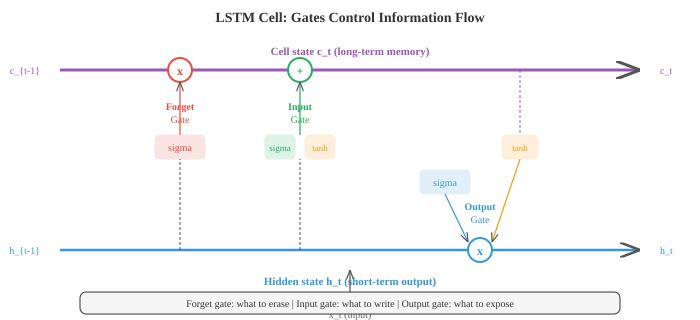

# 深度学习

*深度学习堆叠非线性层来构建层次化表示，自动将原始输入转换为有用的特征。本文涵盖MLP、激活函数、反向传播、CNN、RNN、LSTM、注意力机制、Transformer、GAN、VAE、扩散模型和归一化技术*

- 什么使网络"深"？浅网络只有一个隐藏层；深网络有许多层。深度让网络构建层次化表示，早期层学习简单特征（边缘、音调），后期层将它们组合成复杂概念（人脸、句子）。这种组合性正是深度学习力量的来源。

- 最简单的深度网络是**多层感知器（MLP）**，也称为全连接或密集网络。每层计算：

$$h = \sigma(Wx + b)$$

- 这里 $W$ 是权重矩阵（第02章），$b$ 是偏置向量，$\sigma$ 是非线性激活函数。一层的输出成为下一层的输入。没有非线性，堆叠层将毫无意义：$W_2(W_1 x) = (W_2 W_1)x$，这只是另一个线性变换。这正是第02章中的矩阵乘法塌缩。

- **激活函数**引入使深度有意义的非线性。

- **ReLU**（修正线性单元）：$\text{ReLU}(x) = \max(0, x)$。它是使用最广泛的激活函数。计算速度快，正输入不饱和，并产生稀疏激活（许多神经元输出精确为零）。缺点：负输入的神经元总是输出零，如果它们永久卡在那里，就会"死亡"并停止学习。

- **Sigmoid**：$\sigma(x) = \frac{1}{1+e^{-x}}$，将输入压缩到 $(0, 1)$。适用于二元分类的输出层，但在隐藏层中有问题，因为当输入远离零时梯度消失（曲线几乎平坦）。

- **Tanh**：$\tanh(x) = \frac{e^x - e^{-x}}{e^x + e^{-x}}$，压缩到 $(-1, 1)$。零中心（不同于sigmoid），有助于梯度流动，但在极端值处仍存在梯度消失问题。

- **GELU**（高斯误差线性单元）：$\text{GELU}(x) = x \cdot \Phi(x)$，其中 $\Phi$ 是标准正态CDF。它是ReLU的平滑近似，允许微小的负值通过。GELU是GPT和BERT中的默认选择。

- **Swish**：$\text{Swish}(x) = x \cdot \sigma(x)$，另一种平滑门控。实际使用中与GELU类似。


- 一个具有 $d_{\text{in}}$ 个输入和 $d_{\text{out}}$ 个输出的密集层有 $d_{\text{in}} \times d_{\text{out}} + d_{\text{out}}$ 个参数（权重加偏置）。矩阵乘法 $Wx$ 就是第02章中的矩阵-向量乘法。在批处理设置中，输入是形状为 $(B, d_{\text{in}})$ 的矩阵 $X$，输出是形状为 $(B, d_{\text{out}})$ 的 $XW^T + b$。

- **万能近似定理**指出，一个具有足够神经元的隐藏层可以在紧致域上以任意精度逼近任何连续函数。这听起来似乎深度无关紧要，但关键在于"足够的神经元"。实际上，深层网络可以用指数级少于浅层网络的参数来表示相同的函数。深度带来的是效率，而不仅仅是表达能力。

- 随着网络变深，出现两种梯度病理。**梯度消失**：当梯度通过许多层时（通过链式法则，第03章），它们被乘以许多因子。如果这些因子都小于1（如sigmoid和tanh饱和时发生的情况），梯度呈指数级缩小趋近于零。早期层几乎无法学习。**梯度爆炸**：如果因子都大于1，梯度呈指数级增长，导致数值溢出和训练不稳定。

- 梯度消失/爆炸的解决方案：
  - 使用ReLU或GELU激活函数（正输入时梯度为1，无饱和）
  - 仔细的权重初始化
  - 归一化层
  - 残差连接（跳跃连接）
  - 梯度裁剪（针对梯度爆炸）：将梯度范数限制在最大值

- **权重初始化**很重要，因为它决定了训练开始时激活值和梯度的尺度。如果权重太大，激活值爆炸；太小，它们消失。

- **Xavier (Glorot) 初始化**从方差为 $\frac{2}{d_{\text{in}} + d_{\text{out}}}$ 的分布中设置权重。这假设使用线性或tanh激活函数时，能使激活值的方差在各层大致保持恒定。

- **He (Kaiming) 初始化**使用方差 $\frac{2}{d_{\text{in}}}$，针对ReLU激活函数校准（由于ReLU将半数激活值置零，需要双倍方差来补偿）。

- **归一化层**通过确保每层的输入具有一致的统计特性（大致零均值、单位方差）来稳定训练。

- **批归一化（BatchNorm）** 在批次维度上进行归一化：对于每个通道/特征，计算小批次中所有样本的均值和方差，然后归一化。它添加了可学习的尺度（$\gamma$）和偏移（$\beta$）参数，以便网络在需要时撤销归一化：

$$\hat{x} = \frac{x - \mu_B}{\sqrt{\sigma_B^2 + \epsilon}}, \quad y = \gamma \hat{x} + \beta$$

- BatchNorm有一个问题：它依赖于批量大小。当批次非常小时，统计数据有噪声。在推理时，使用运行平均值而非批次统计，这造成了训练/测试不一致。

- **层归一化（LayerNorm）** 对每个单独样本在特征维度上进行归一化。它不依赖于批次中的其他样本，使其成为Transformer和循环网络的标准选择。

- **实例归一化** 对每个样本和每个通道独立地在空间维度上进行归一化。在风格迁移中很流行。

- **组归一化** 将通道分成组并在每个组内进行归一化。它是LayerNorm和InstanceNorm之间的折中。



- **Dropout** 是一种正则化技术，在训练期间随机将一部分 $p$ 的神经元置零。这迫使网络不依赖任何单个神经元，鼓励冗余表示。测试时，所有神经元都被激活。**逆置Dropout** 在训练期间将激活值缩放 $\frac{1}{1-p}$，以便测试时无需缩放。这是标准实现。

- **卷积神经网络（CNN）** 利用了空间结构。卷积层不是将每个输入连接到每个输出（如密集层），而是在输入上滑动一个小滤波器（核），在每个位置计算点积。相同的滤波器权重在所有位置共享，这大大减少了参数并内建了平移不变性。

- 二维输入与大小为 $k \times k$ 的滤波器 $K$ 的**卷积操作**：

$$(\text{input} * K)[i,j] = \sum_{m=0}^{k-1} \sum_{n=0}^{k-1} \text{input}[i+m, j+n] \cdot K[m, n]$$


- 输出大小取决于三个超参数。**步幅**控制滤波器在位置之间移动多少像素（步幅2使空间维度减半）。**填充**在输入边界周围添加零（"same"填充保持空间大小，"valid"填充不填充）。输出大小公式：$\text{out} = \lfloor (\text{in} - k + 2p) / s \rfloor + 1$。

- **池化**层对特征图进行下采样。最大池化取每个窗口中的最大值；平均池化取均值。池化在保留最重要信息的同时减少空间维度。

- **扩张卷积** 在滤波器元素之间插入间隙，增加感受野而不增加参数。扩张率为2意味着3x3滤波器覆盖5x5区域。

- **1x1卷积** 是使用1x1滤波器的卷积。它们不查看空间邻居；而是跨通道混合信息。可以将其视为在每个空间位置应用密集层。用于廉价地改变通道数。

- **跳跃连接**（残差连接）让输入绕过一层或多层：$\text{output} = F(x) + x$。该层只需学习残差 $F(x) = \text{output} - x$，当最优变换接近恒等映射时这更容易。ResNet（残差网络）使用这一技巧堆叠超过100层，解决了更深的网络表现比浅层网络更差的退化问题。

- CNN构建了一个**特征层次结构**。早期层检测边缘和纹理。中间层将这些组合成部件（眼睛、轮子）。后期层识别整个物体。每层的感受野（它"看到"的输入区域）随深度增加。

- **嵌入**将离散的标记（单词、字符、物品ID）映射到密集向量。嵌入层只是一个查找表：一个形状为（词汇表大小，嵌入维度）的矩阵 $E$。查找标记 $i$ 意味着选择 $E$ 的第 $i$ 行。这等价于乘以one-hot向量，这只是矩阵-向量乘法的一个特例（第02章）。嵌入在训练期间学习，因此相似的标记最终具有相似的向量。

- **分词**是将原始文本转换为标记序列的过程。词级分词按空格分割，但无法处理未见过的词。**子词分词**（BPE、WordPiece、SentencePiece）将文本分解为频繁的子词单元，平衡词汇表大小和覆盖率。单词"unhappiness"可能变成["un", "happiness"]或["un", "happ", "iness"]。

- **循环神经网络（RNN）** 一次处理一个序列元素，维护一个向前传递信息的隐藏状态：

$$h_t = \tanh(W_h h_{t-1} + W_x x_t + b)$$

- 隐藏状态 $h_t$ 是网络到时间 $t$ 为止所看到内容的压缩摘要。相同的权重 $W_h$ 和 $W_x$ 在所有时间步共享（权重共享，如同CNN共享空间权重）。

- 原始RNN在长序列上存在梯度消失问题：从步骤 $t$ 到步骤 $t - k$ 的梯度信号经过 $k$ 次与 $W_h$ 的乘法，呈指数级缩小（或爆炸）。

- **LSTM**（长短时记忆网络）通过引入一个独立的细胞状态 $c_t$ 来解决这一问题，该状态以最小干扰流过时间。三个门控制哪些信息进入、离开和持续存在：

- **遗忘门**决定从细胞状态中擦除什么：$f_t = \sigma(W_f [h_{t-1}, x_t] + b_f)$
- **输入门**决定写入什么新信息：$i_t = \sigma(W_i [h_{t-1}, x_t] + b_i)$，候选值 $\tilde{c}_t = \tanh(W_c [h_{t-1}, x_t] + b_c)$
- 细胞状态更新：$c_t = f_t \odot c_{t-1} + i_t \odot \tilde{c}_t$
- **输出门**决定暴露什么：$o_t = \sigma(W_o [h_{t-1}, x_t] + b_o)$，$h_t = o_t \odot \tanh(c_t)$



- 细胞状态像传送带一样工作：信息可以不变地流过许多时间步（遗忘门保持接近1），这解决了长距离依赖的梯度消失问题。

- **GRU**（门控循环单元）通过将细胞状态和隐藏状态合并为一个，并使用两个门（更新门和重置门）代替三个门来简化LSTM。GRU参数更少，通常表现与LSTM相当。

- RNN（包括LSTM）的根本限制是顺序处理：必须按顺序处理标记1、标记2、标记3。这阻止了并行化并造成信息瓶颈，因为所有上下文必须通过固定大小的隐藏状态。

- **注意力机制**解决了这两个问题。注意力机制不是将整个输入压缩为固定向量，而是让模型回顾所有输入位置并决定哪些位置与当前输出相关。

- 现代公式使用**查询、键和值（Q, K, V）**。将其想象为图书馆搜索：你有一个查询（你在找什么）、键（每本书的标签）和值（实际书籍内容）。你将查询与所有键比较，以确定检索哪些值。

- **缩放点积注意力**：

$$\text{Attention}(Q, K, V) = \text{softmax}\!\left(\frac{QK^T}{\sqrt{d_k}}\right) V$$

- $QK^T$ 计算每个查询和每个键之间的相似度。这是矩阵乘法（第02章），其中的条目是点积，衡量余弦相似度（第01章）。除以 $\sqrt{d_k}$ 防止点积变得太大（这会使softmax饱和并产生接近one-hot分布，导致梯度消失）。Softmax将相似度转换为概率分布。乘以 $V$ 产生值的加权组合。

- **多头注意力**运行 $h$ 个并行的注意力操作，每个使用不同的Q、K、V学习投影。这让模型同时从不同的表示子空间关注信息。一个头可能关注句法关系，而另一个关注语义关系。输出被拼接并投影：

$$\text{MultiHead}(Q, K, V) = \text{Concat}(\text{head}_1, \ldots, \text{head}_h) W^O$$

- **Transformer**架构（Vaswani等人，2017）完全由注意力和前馈层构建，没有循环。编码器块重复：多头自注意力、加法和层归一化、前馈网络、加法和层归一化。解码器块添加了掩码自注意力（防止模型看到未来的标记）和关注编码器输出的交叉注意力层。


- **位置编码**是必需的，因为注意力是排列等变的，意味着它将输入视为集合而非序列。没有位置信息，"猫坐在垫子上"和"垫子坐在猫上"将是相同的。原始Transformer使用正弦位置编码：

$$PE_{(pos, 2i)} = \sin\!\left(\frac{pos}{10000^{2i/d}}\right), \quad PE_{(pos, 2i+1)} = \cos\!\left(\frac{pos}{10000^{2i/d}}\right)$$

- 每个位置获得一个唯一的向量，模型可以用来区分位置。现代模型通常使用学习的位置嵌入或相对位置编码（RoPE、ALiBi）代替。

- Transformer并行处理所有标记（自注意力矩阵 $QK^T$ 在一次矩阵乘法中计算），这使得它们在现代硬件上比RNN训练更快。权衡是自注意力在序列长度上是 $O(n^2)$（每个标记关注每个其他标记），而RNN是 $O(n)$。这就是为什么长上下文模型需要特殊的注意力变体（稀疏注意力、线性注意力、Flash Attention）。

- **视觉Transformer（ViT）** 通过将图像分割为固定大小的块（如16x16），将每个块展平为向量，并将这些块视为标记序列，将Transformer应用于图像。一个可学习的[CLS]标记被前置，其最终表示用于分类。尽管没有卷积的归纳偏置，ViT在足够数据上训练时可以匹配或超越CNN。

- **MLP-Mixer** 是一种更简单的架构，用MLP替代了注意力和卷积。它在"标记混合"MLP（跨空间位置应用）和"通道混合"MLP（跨特征应用）之间交替。它的表现具有竞争力，表明现代架构的关键洞察不是注意力本身，而是跨标记和特征的高效信息混合。

- **自编码器**通过训练网络重构自身输入来学习压缩表示。编码器将输入映射到低维瓶颈（潜码），解码器将其映射回来：

$$z = f_{\text{enc}}(x), \quad \hat{x} = f_{\text{dec}}(z), \quad \mathcal{L} = \|x - \hat{x}\|^2$$

- 瓶颈迫使网络学习最重要的特征。自编码器用于降维、去噪（在噪声输入上训练，重构干净输出）和异常检测（高重构误差表明输入异常）。

- **变分自编码器（VAE）** 增加了概率的变体。编码器不是编码到单个点 $z$，而是输出分布的参数（高斯的均值 $\mu$ 和方差 $\sigma^2$）。潜码从此分布中采样：$z = \mu + \sigma \odot \epsilon$，其中 $\epsilon \sim \mathcal{N}(0, I)$。这个**重参数化技巧**使采样可微，梯度可以流过。

- VAE损失有两个项：

$$\mathcal{L} = \underbrace{\|x - \hat{x}\|^2}_{\text{reconstruction}} + \underbrace{D_{\text{KL}}(q(z|x) \| p(z))}_{\text{regularisation}}$$

- KL散度项（来自第05章）将学习到的后验 $q(z|x)$ 推向先验 $p(z) = \mathcal{N}(0, I)$，确保潜空间平滑且结构良好。然后你可以从先验中采样并解码以生成新数据。这就是使VAE成为生成模型的原因。

## 编程任务（在CoLab或笔记本中完成）

1. 在JAX中从头构建一个简单的MLP。在二维分类问题（如同心圆）上训练并可视化决策边界。
```python
import jax
import jax.numpy as jnp
import matplotlib.pyplot as plt
from sklearn.datasets import make_circles

# 数据
X, y = make_circles(n_samples=500, noise=0.1, factor=0.5, random_state=42)
X, y = jnp.array(X), jnp.array(y, dtype=jnp.float32)

# 初始化一个2层MLP：2 -> 16 -> 16 -> 1
def init_params(key):
    k1, k2, k3 = jax.random.split(key, 3)
    return {
        'W1': jax.random.normal(k1, (2, 16)) * 0.5,
        'b1': jnp.zeros(16),
        'W2': jax.random.normal(k2, (16, 16)) * 0.5,
        'b2': jnp.zeros(16),
        'W3': jax.random.normal(k3, (16, 1)) * 0.5,
        'b3': jnp.zeros(1),
    }

def forward(params, x):
    h = jnp.maximum(0, x @ params['W1'] + params['b1'])  # ReLU
    h = jnp.maximum(0, h @ params['W2'] + params['b2'])   # ReLU
    logit = (h @ params['W3'] + params['b3']).squeeze()
    return jax.nn.sigmoid(logit)

def loss_fn(params, X, y):
    pred = forward(params, X)
    return -jnp.mean(y * jnp.log(pred + 1e-7) + (1 - y) * jnp.log(1 - pred + 1e-7))

grad_fn = jax.jit(jax.grad(loss_fn))
params = init_params(jax.random.PRNGKey(0))
lr = 0.1

for step in range(2000):
    grads = grad_fn(params, X, y)
    params = {k: params[k] - lr * grads[k] for k in params}

# 绘制决策边界
xx, yy = jnp.meshgrid(jnp.linspace(-2, 2, 200), jnp.linspace(-2, 2, 200))
grid = jnp.column_stack([xx.ravel(), yy.ravel()])
zz = forward(params, grid).reshape(xx.shape)

plt.figure(figsize=(7, 6))
plt.contourf(xx, yy, zz, levels=[0, 0.5, 1], alpha=0.3, colors=['#e74c3c', '#3498db'])
plt.scatter(X[y==0,0], X[y==0,1], c='#e74c3c', s=10, label='Class 0')
plt.scatter(X[y==1,0], X[y==1,1], c='#3498db', s=10, label='Class 1')
plt.title("MLP Decision Boundary on Concentric Circles")
plt.legend(); plt.grid(alpha=0.3); plt.show()

acc = jnp.mean((forward(params, X) > 0.5) == y)
print(f"Accuracy: {acc:.2%}")
```

2. 从头实现一维卷积。将简单的边缘检测滤波器应用于信号，并与内置的 `jnp.convolve` 进行比较。
```python
import jax.numpy as jnp
import matplotlib.pyplot as plt

def conv1d(signal, kernel):
    """从头实现一维卷积（valid模式）。"""
    n, k = len(signal), len(kernel)
    output = jnp.zeros(n - k + 1)
    for i in range(n - k + 1):
        output = output.at[i].set(jnp.sum(signal[i:i+k] * kernel))
    return output

# 创建一个带有阶跃函数的信号
t = jnp.linspace(0, 4, 200)
signal = jnp.where(t < 1, 0.0, jnp.where(t < 2, 1.0, jnp.where(t < 3, 0.5, 1.5)))

# 边缘检测核
edge_kernel = jnp.array([-1.0, 0.0, 1.0])

# 我们的实现 vs 内置函数
our_output = conv1d(signal, edge_kernel)
jnp_output = jnp.convolve(signal, edge_kernel, mode='valid')

fig, axes = plt.subplots(3, 1, figsize=(10, 6), sharex=True)
axes[0].plot(t, signal, color='#3498db', linewidth=1.5)
axes[0].set_title("Original Signal"); axes[0].set_ylabel("Value")

axes[1].plot(t[:len(our_output)], our_output, color='#e74c3c', linewidth=1.5)
axes[1].set_title("After Edge Detection (our conv1d)"); axes[1].set_ylabel("Value")

axes[2].plot(t[:len(jnp_output)], jnp_output, color='#27ae60', linewidth=1.5, linestyle='--')
axes[2].set_title("After Edge Detection (jnp.convolve)"); axes[2].set_ylabel("Value")
axes[2].set_xlabel("t")

plt.tight_layout(); plt.show()
print(f"Outputs match: {jnp.allclose(our_output, jnp_output)}")
```

3. 从头实现缩放点积注意力。为一个小例子计算注意力权重，并将注意力矩阵可视化为热力图。
```python
import jax
import jax.numpy as jnp
import matplotlib.pyplot as plt

def scaled_dot_product_attention(Q, K, V):
    """缩放点积注意力。"""
    d_k = Q.shape[-1]
    scores = Q @ K.T / jnp.sqrt(d_k)
    weights = jax.nn.softmax(scores, axis=-1)
    output = weights @ V
    return output, weights

# 示例：4个标记，嵌入维度8
key = jax.random.PRNGKey(42)
k1, k2, k3 = jax.random.split(key, 3)
seq_len, d_model = 4, 8

Q = jax.random.normal(k1, (seq_len, d_model))
K = jax.random.normal(k2, (seq_len, d_model))
V = jax.random.normal(k3, (seq_len, d_model))

output, weights = scaled_dot_product_attention(Q, K, V)

print(f"Q shape: {Q.shape}")
print(f"Attention weights shape: {weights.shape}")
print(f"Output shape: {output.shape}")
print(f"\nAttention weights (rows sum to 1):")
print(weights)
print(f"Row sums: {weights.sum(axis=-1)}")

# 可视化注意力
fig, ax = plt.subplots(figsize=(5, 4))
im = ax.imshow(weights, cmap='Blues', vmin=0, vmax=1)
ax.set_xlabel("Key position"); ax.set_ylabel("Query position")
ax.set_title("Attention Weights")
tokens = ['tok 0', 'tok 1', 'tok 2', 'tok 3']
ax.set_xticks(range(4)); ax.set_xticklabels(tokens)
ax.set_yticks(range(4)); ax.set_yticklabels(tokens)
for i in range(4):
    for j in range(4):
        ax.text(j, i, f"{weights[i,j]:.2f}", ha='center', va='center', fontsize=10)
plt.colorbar(im); plt.tight_layout(); plt.show()
```

4. 构建一个简单的自编码器，通过一维瓶颈压缩二维数据并重建。可视化潜空间和重建结果。
```python
import jax
import jax.numpy as jnp
import matplotlib.pyplot as plt
from sklearn.datasets import make_moons

# 数据
X, _ = make_moons(n_samples=500, noise=0.05, random_state=42)
X = jnp.array(X)

# 自编码器：2 -> 8 -> 1 -> 8 -> 2
def init_ae(key):
    k1, k2, k3, k4 = jax.random.split(key, 4)
    return {
        'enc_W1': jax.random.normal(k1, (2, 8)) * 0.5, 'enc_b1': jnp.zeros(8),
        'enc_W2': jax.random.normal(k2, (8, 1)) * 0.5, 'enc_b2': jnp.zeros(1),
        'dec_W1': jax.random.normal(k3, (1, 8)) * 0.5, 'dec_b1': jnp.zeros(8),
        'dec_W2': jax.random.normal(k4, (8, 2)) * 0.5, 'dec_b2': jnp.zeros(2),
    }

def encode(p, x):
    h = jnp.tanh(x @ p['enc_W1'] + p['enc_b1'])
    return h @ p['enc_W2'] + p['enc_b2']

def decode(p, z):
    h = jnp.tanh(z @ p['dec_W1'] + p['dec_b1'])
    return h @ p['dec_W2'] + p['dec_b2']

def ae_loss(p, X):
    z = encode(p, X)
    X_hat = decode(p, z)
    return jnp.mean((X - X_hat) ** 2)

grad_fn = jax.jit(jax.grad(ae_loss))
params = init_ae(jax.random.PRNGKey(0))
lr = 0.01

for step in range(3000):
    grads = grad_fn(params, X)
    params = {k: params[k] - lr * grads[k] for k in params}

z = encode(params, X)
X_hat = decode(params, z)

fig, axes = plt.subplots(1, 2, figsize=(12, 5))
axes[0].scatter(X[:,0], X[:,1], c=z.squeeze(), cmap='viridis', s=10)
axes[0].set_title("Original Data (coloured by latent code)")
axes[1].scatter(X_hat[:,0], X_hat[:,1], c=z.squeeze(), cmap='viridis', s=10)
axes[1].set_title("Reconstruction from 1D bottleneck")
for ax in axes:
    ax.set_aspect('equal'); ax.grid(alpha=0.3)
plt.tight_layout(); plt.show()

print(f"Reconstruction MSE: {ae_loss(params, X):.4f}")
```
