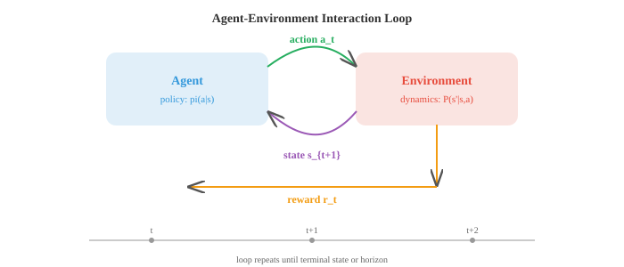

# 强化学习

*强化学习通过试错法最大化累积奖励来训练智能体做出序列决策。本文件涵盖MDP、价值函数、贝尔曼方程、Q学习、策略梯度、演员-评论家方法、PPO和RLHF——这些是游戏智能体和语言模型对齐背后的框架。*

- 监督学习需要标注数据。无监督学习在无标注数据中发现模式。**强化学习（RL）** 与两者都不同：智能体通过与环境的交互、采取行动和接收奖励来学习。没有正确的标签；智能体必须通过试错来发现好的行为。

- 想象教狗一个新把戏。你不会给它展示一个正确行为的数据集。相反，它尝试各种动作，你对好的行为给予奖励，随着时间的推移它明白了你想要什么。RL将这个形式化。

- RL设置包含五个核心组件。**智能体（agent）** 是学习者和决策者。**环境（environment）** 是智能体之外与之交互的一切。在每个时间步，智能体观察一个**状态（state）** $s_t$，选择一个**动作（action）** $a_t$，接收一个**奖励（reward）** $r_t$，并转移到新状态 $s_{t+1}$。智能体的目标是最大化其随时间收集的总奖励。



- **策略（policy）** $\pi$ 是智能体的策略：从状态到动作的映射。确定性策略对每个状态给出一个动作：$a = \pi(s)$。随机策略给出动作上的概率分布：$\pi(a \mid s)$。RL的目标是找到最优策略，即最大化期望累积奖励的策略。

- RL的数学框架是**马尔可夫决策过程（MDP）**，由元组 $(S, A, P, R, \gamma)$ 定义：一组状态 $S$，一组动作 $A$，转移概率 $P(s' \mid s, a)$，奖励函数 $R(s, a)$，以及折扣因子 $\gamma$。

- **马尔可夫性质**（来自第05章）指出未来仅取决于当前状态，而不是如何到达那里的历史：$P(s_{t+1} \mid s_t, a_t, s_{t-1}, \ldots) = P(s_{t+1} \mid s_t, a_t)$。这意味着状态包含了做出决策所需的全部信息。

- **折扣因子** $\gamma \in [0, 1)$ 决定了智能体对未来奖励相对于即时奖励的重视程度。从时间 $t$ 开始的折扣回报为：

$$G_t = r_t + \gamma r_{t+1} + \gamma^2 r_{t+2} + \cdots = \sum_{k=0}^{\infty} \gamma^k r_{t+k}$$

- 当 $\gamma = 0$ 时，智能体完全短视，只关心下一个奖励。当 $\gamma$ 接近1时，智能体具有长远眼光。折扣因子还确保了求和收敛（如果奖励有界），这对数学上的良定义性很重要。

- **价值函数**估计处于某个状态（或在某个状态下采取某个动作）有多好。**状态价值函数** $V^\pi(s)$ 是从状态 $s$ 开始并按照策略 $\pi$ 行动所获得的期望回报：

$$V^\pi(s) = \mathbb{E}_\pi \left[ G_t \mid s_t = s \right]$$

- **动作价值函数** $Q^\pi(s, a)$ 是从状态 $s$ 开始，采取动作 $a$，然后按照 $\pi$ 行动所获得的期望回报：

$$Q^\pi(s, a) = \mathbb{E}_\pi \left[ G_t \mid s_t = s, a_t = a \right]$$

- 两者关系：$V^\pi(s) = \sum_a \pi(a \mid s) \, Q^\pi(s, a)$。状态价值是动作价值按策略加权的平均值。

- **贝尔曼方程**表达了递归关系：一个状态的价值等于即时奖励加上下一个状态的折扣价值。对于状态价值函数：

$$V^\pi(s) = \sum_a \pi(a \mid s) \sum_{s'} P(s' \mid s, a) \left[ R(s, a) + \gamma \, V^\pi(s') \right]$$

- 对于最优价值函数 $V^{*}(s)$，智能体总是选择最佳动作：

$$V^{*}(s) = \max_a \sum_{s'} P(s' \mid s, a) \left[ R(s, a) + \gamma \, V^{*}(s') \right]$$

- 类似地，$Q^{*}$ 的**贝尔曼最优方程**为：

$$Q^{*}(s, a) = \sum_{s'} P(s' \mid s, a) \left[ R(s, a) + \gamma \max_{a'} Q^{*}(s', a') \right]$$

- 一旦你有了 $Q^{*}$，最优策略就很简单了：总是选择Q值最高的动作：$\pi^{*}(s) = \arg\max_a Q^{*}(s, a)$。

- **动态规划**方法在已知转移概率和奖励（完整模型）时求解MDP。**策略评估**通过迭代应用贝尔曼方程直到收敛来计算给定策略的 $V^\pi$。**策略改进**利用价值函数并通过对最优动作贪心来构建更好的策略：$\pi'(s) = \arg\max_a \sum_{s'} P(s' \mid s, a)[R(s,a) + \gamma V^\pi(s')]$。

- **策略迭代**在评估和改进之间交替，直到策略停止变化。它保证收敛到最优策略。

- **价值迭代**将两个步骤合并为一个：重复应用贝尔曼最优方程直到 $V^{*}$ 收敛，然后提取策略。

$$V(s) \leftarrow \max_a \sum_{s'} P(s' \mid s, a) \left[ R(s, a) + \gamma \, V(s') \right]$$

- 动态规划需要知道 $P(s' \mid s, a)$，这通常不可行。在大多数真实问题中，智能体不知道环境的动态；它只能与环境交互。这就是**无模型**方法发挥作用的地方。

- **时序差分（TD）学习**在不了解模型的情况下从经验中学习。关键思想是**引导（bootstrapping）**：不等情节结束才计算实际回报 $G_t$，而是使用当前的价值函数对其进行估计：

$$V(s_t) \leftarrow V(s_t) + \alpha \left[ r_t + \gamma \, V(s_{t+1}) - V(s_t) \right]$$

- 括号中的项是**TD误差**：**TD目标**（$r_t + \gamma V(s_{t+1})$）与当前估计 $V(s_t)$ 之间的差异。如果TD误差为正，说明该状态比预期好，我们增加其价值。如果为负，则减少其价值。


- TD学习在每一步之后（而不是完成整个情节后）进行更新，这使其比蒙特卡洛方法高效得多。它也适用于持续（非情节式）环境。

- **SARSA**（状态-动作-奖励-状态-动作）是将TD学习应用于Q值。智能体在状态 $s$ 下采取动作 $a$，观察奖励 $r$ 和下一状态 $s'$，然后根据其策略选择下一个动作 $a'$：

$$Q(s, a) \leftarrow Q(s, a) + \alpha \left[ r + \gamma \, Q(s', a') - Q(s, a) \right]$$

- SARSA是**在策略（on-policy）**：它使用智能体实际采取的动作进行更新，这包括了探索。这使得SARSA更为保守；它学习一个考虑自身探索噪声的策略。

- **Q学习**是最著名的RL算法。它类似于SARSA，但不同的是它使用最佳可能动作而非智能体实际采取的动作：

$$Q(s, a) \leftarrow Q(s, a) + \alpha \left[ r + \gamma \max_{a'} Q(s', a') - Q(s, a) \right]$$

- Q学习是**离策略（off-policy）**：它学习最优Q值，与正在执行的策略无关。智能体可以随机探索，同时仍然学习最优动作价值。这使得Q学习更具攻击性，通常收敛更快，但可能高估值。

- **探索 vs 利用**是基本困境：智能体应该利用已知信息（选择估计价值最高的动作）还是探索未知动作（可能发现更好的）？

- 最简单的策略是**ε-贪心**：以概率 $\epsilon$ 采取随机动作（探索）；以概率 $1 - \epsilon$ 采取贪心动作（利用）。一种常见的时间表是从高 $\epsilon$（大量探索）开始，随时间衰减。

- 表格方法（在表中存储每个状态-动作对的价值）适用于小的离散状态空间。对于大或连续的状态空间，需要函数近似。**深度Q网络（DQN）** 使用神经网络来近似 $Q(s, a; \theta)$，其中 $\theta$ 是网络权重。

- DQN引入了两个关键的稳定技术。**经验回放**：不是从连续的转移中学习（高度相关），而是将转移存储在回放缓冲区中，并采样随机小批次进行训练。这打破了相关性并高效地重用数据。

- **目标网络**：使用一个单独的、缓慢更新的网络副本来计算TD目标。没有这个，每次更新网络时目标都会移动，造成"追自己尾巴"的不稳定性。目标网络定期更新（每 $N$ 步硬更新）或连续更新（软更新：$\theta^{-} \leftarrow \tau\theta + (1-\tau)\theta^{-}$）。

- DQN损失只是预测Q值与TD目标之间的均方误差：

$$\mathcal{L}(\theta) = \mathbb{E} \left[ \left( r + \gamma \max_{a'} Q(s', a'; \theta^{-}) - Q(s, a; \theta) \right)^2 \right]$$

- 到目前为止的所有方法都学习价值函数并从中推导策略。**策略梯度**方法采用不同方法：它们直接参数化策略 $\pi(a \mid s; \theta)$ 并通过梯度上升优化期望回报。

- **策略梯度定理**给出了期望回报相对于策略参数的梯度：

$$\nabla_\theta J(\theta) = \mathbb{E}_\pi \left[ \nabla_\theta \log \pi(a \mid s; \theta) \cdot G_t \right]$$

- 这说明：增加导致高回报的动作的概率，减少导致低回报的动作的概率。对数概率梯度给出了改变策略的方向，$G_t$ 则缩放改变的程度。

- **REINFORCE**是最简单的策略梯度算法。运行一个情节，为每一步计算回报 $G_t$，然后更新：

$$\theta \leftarrow \theta + \alpha \, \nabla_\theta \log \pi(a_t \mid s_t; \theta) \cdot G_t$$

- REINFORCE方差很高，因为 $G_t$ 是期望回报的噪声单样本估计。一个常见修复是减去一个**基线（baseline）**（通常是平均回报或学习到的价值函数）来降低方差而不引入偏差：

$$\theta \leftarrow \theta + \alpha \, \nabla_\theta \log \pi(a_t \mid s_t; \theta) \cdot (G_t - b)$$

- **演员-评论家（Actor-Critic）** 方法使用两个网络。**演员（actor）** 是策略 $\pi(a \mid s; \theta)$。**评论家（critic）** 是价值函数 $V(s; \phi)$，作为基线。优势 $A_t = r_t + \gamma V(s_{t+1}) - V(s_t)$ 替代了 $G_t - b$：

$$\theta \leftarrow \theta + \alpha \, \nabla_\theta \log \pi(a_t \mid s_t; \theta) \cdot A_t$$

- 评论家通过最小化TD误差来更新，与基于价值的方法相同。演员使用策略梯度更新，评论家的优势估计降低了方差。这是两全其美。


- **PPO**（近端策略优化）是实践中使用最广泛的策略梯度算法。它解决了一个关键问题：如果策略更新过大，性能可能灾难性地崩溃。

- PPO使用一个**裁剪的替代目标**。令 $r_t(\theta) = \frac{\pi(a_t | s_t; \theta)}{\pi(a_t | s_t; \theta_{\text{old}})}$ 为新旧策略之间的概率比。损失为：

$$\mathcal{L}^{\text{CLIP}}(\theta) = \mathbb{E} \left[ \min\!\left( r_t(\theta) A_t, \; \text{clip}(r_t(\theta), 1-\epsilon, 1+\epsilon) A_t \right) \right]$$

- 裁剪（通常 $\epsilon = 0.2$）防止比率远离1，使更新保持小而稳定。如果优势为正（动作好），比率上限为 $1 + \epsilon$。如果为负（动作差），比率下限为 $1 - \epsilon$。这比早期的信任区域方法（TRPO）更简单、更稳定。

- PPO被用于通过**RLHF**（基于人类反馈的强化学习）训练ChatGPT风格的模型。在RLHF中，一个奖励模型在人类偏好数据（人类更喜欢两个输出中的哪一个？）上训练，然后PPO优化语言模型策略以最大化这个学习到的奖励。

- **DPO**（直接偏好优化）通过完全消除奖励模型来简化RLHF。DPO不训练奖励模型然后运行RL，而是推导出一个闭式损失，直接从偏好数据优化策略：

$$\mathcal{L}_{\text{DPO}}(\theta) = -\mathbb{E} \left[ \log \sigma\!\left( \beta \log \frac{\pi_\theta(y_w \mid x)}{\pi_{\text{ref}}(y_w \mid x)} - \beta \log \frac{\pi_\theta(y_l \mid x)}{\pi_{\text{ref}}(y_l \mid x)} \right) \right]$$

- 这里 $y_w$ 是偏好的（胜出）回答，$y_l$ 是不被偏好的（失败）回答。DPO增加偏好输出的相对概率，并且比基于PPO的RLHF实现起来简单得多。

- RL算法中有两个重要区分。**在策略 vs 离策略**：在策略方法（SARSA, PPO）从当前策略生成的数据中学习；离策略方法（Q学习, DQN）可以从任何策略生成的数据中学习。离策略方法样本效率更高（它们重用旧数据），但可能不那么稳定。

- **基于模型 vs 无模型**：无模型方法（到目前为止讨论的所有方法）直接从经验中学习价值或策略。基于模型的方法学习环境的模型（$P(s' \mid s, a)$ 和 $R(s, a)$）并用其进行规划（想象未来的轨迹而不实际采取动作）。基于模型的方法样本效率更高，但增加了学习精确模型的复杂性。

- 总结RL领域：

| 方法 | 类型 | 核心思想 | 优势 |
|---|---|---|---|
| 价值迭代 | DP, 基于模型 | 贝尔曼最优性 | 精确解（小MDP） |
| SARSA | TD, 在策略 | 在策略学习Q | 保守、安全 |
| Q学习 | TD, 离策略 | 学习Q*, 贪心目标 | 简单、有效 |
| DQN | 深度, 离策略 | 神经Q + 回放 + 目标网络 | 扩展到高维状态 |
| REINFORCE | 策略梯度 | log-概率 * 回报的梯度 | 简单的策略优化 |
| 演员-评论家 | PG + 价值 | 演员 + 评论家降低方差 | 实用且灵活 |
| PPO | PG, 裁剪 | 信任区域般的稳定性 | 行业标准 |
| DPO | 直接偏好 | 跳过奖励模型 | 更简单的RLHF |

## 编程任务（使用CoLab或笔记本）

1. 为简单的网格世界实现价值迭代。计算最优价值函数并提取最优策略。将两者可视化为热力图和箭头图。
```python
import jax.numpy as jnp
import matplotlib.pyplot as plt

# 4x4网格世界：目标在(3,3)，每步奖励-1，目标处为0
grid_size = 4
gamma = 0.99
goal = (3, 3)

# 动作：上、下、左、右
actions = [(-1, 0), (1, 0), (0, -1), (0, 1)]
action_names = ['up', 'down', 'left', 'right']
action_arrows = ['\u2191', '\u2193', '\u2190', '\u2192']

def step(s, a):
    """确定性转移。"""
    ns = (max(0, min(grid_size-1, s[0]+a[0])),
          max(0, min(grid_size-1, s[1]+a[1])))
    return ns

# 价值迭代
V = jnp.zeros((grid_size, grid_size))
for iteration in range(100):
    V_new = jnp.array(V)
    for i in range(grid_size):
        for j in range(grid_size):
            if (i, j) == goal:
                continue
            values = []
            for a in actions:
                ns = step((i, j), a)
                values.append(-1 + gamma * float(V[ns[0], ns[1]]))
            V_new = V_new.at[i, j].set(max(values))
    if jnp.max(jnp.abs(V_new - V)) < 1e-6:
        print(f"在{iteration+1}次迭代后收敛")
        break
    V = V_new

# 提取策略
policy = [['' for _ in range(grid_size)] for _ in range(grid_size)]
for i in range(grid_size):
    for j in range(grid_size):
        if (i, j) == goal:
            policy[i][j] = 'G'
            continue
        best_a = max(range(4), key=lambda a: -1 + gamma * float(V[step((i,j), actions[a])[0], step((i,j), actions[a])[1]]))
        policy[i][j] = action_arrows[best_a]

fig, axes = plt.subplots(1, 2, figsize=(10, 4))
im = axes[0].imshow(V, cmap='YlOrRd_r')
axes[0].set_title("最优价值函数")
for i in range(grid_size):
    for j in range(grid_size):
        axes[0].text(j, i, f"{V[i,j]:.1f}", ha='center', va='center', fontsize=10)
plt.colorbar(im, ax=axes[0])

axes[1].imshow(jnp.ones((grid_size, grid_size)), cmap='Greys', vmin=0, vmax=2)
axes[1].set_title("最优策略")
for i in range(grid_size):
    for j in range(grid_size):
        axes[1].text(j, i, policy[i][j], ha='center', va='center', fontsize=18)
plt.tight_layout(); plt.show()
```

2. 在简单的网格世界上实现表格Q学习。训练智能体，绘制学习曲线，显示学习到的Q值。
```python
import jax
import jax.numpy as jnp
import matplotlib.pyplot as plt

grid_size = 5
goal = (4, 4)
actions = [(-1,0), (1,0), (0,-1), (0,1)]

# Q表
Q = {}
for i in range(grid_size):
    for j in range(grid_size):
        Q[(i,j)] = [0.0] * 4

alpha = 0.1
gamma = 0.95
epsilon = 1.0
epsilon_decay = 0.995
min_epsilon = 0.01

def step(s, a_idx):
    a = actions[a_idx]
    ns = (max(0, min(grid_size-1, s[0]+a[0])),
          max(0, min(grid_size-1, s[1]+a[1])))
    r = 0.0 if ns == goal else -1.0
    done = ns == goal
    return ns, r, done

key = jax.random.PRNGKey(42)
rewards_per_episode = []

for ep in range(500):
    s = (0, 0)
    total_reward = 0
    for _ in range(100):
        key, subkey = jax.random.split(key)
        if float(jax.random.uniform(subkey)) < epsilon:
            key, subkey = jax.random.split(key)
            a = int(jax.random.randint(subkey, (), 0, 4))
        else:
            a = max(range(4), key=lambda i: Q[s][i])

        ns, r, done = step(s, a)
        total_reward += r
        # Q学习更新
        Q[s][a] += alpha * (r + gamma * max(Q[ns]) - Q[s][a])
        s = ns
        if done:
            break
    rewards_per_episode.append(total_reward)
    epsilon = max(min_epsilon, epsilon * epsilon_decay)

plt.figure(figsize=(8, 4))
# 平滑曲线
window = 20
smoothed = [sum(rewards_per_episode[max(0,i-window):i+1])/min(i+1, window)
            for i in range(len(rewards_per_episode))]
plt.plot(smoothed, color='#3498db', linewidth=1.5)
plt.xlabel("Episode"); plt.ylabel("Total Reward (smoothed)")
plt.title("Q-Learning on Gridworld")
plt.grid(alpha=0.3); plt.show()

# 显示学到的策略
arrow = ['\u2191', '\u2193', '\u2190', '\u2192']
print("学到的策略:")
for i in range(grid_size):
    row = ""
    for j in range(grid_size):
        if (i,j) == goal:
            row += " G "
        else:
            row += f" {arrow[max(range(4), key=lambda a: Q[(i,j)][a])]} "
    print(row)
```

3. 在多臂老虎机问题上实现REINFORCE。展示策略如何随训练演变以偏向最佳臂。
```python
import jax
import jax.numpy as jnp
import matplotlib.pyplot as plt

# 5臂老虎机，不同期望奖励
true_rewards = jnp.array([0.2, 0.5, 0.8, 0.3, 0.1])
n_arms = len(true_rewards)

# 策略：在logits上的softmax
logits = jnp.zeros(n_arms)
lr = 0.1
key = jax.random.PRNGKey(42)

policy_history = []
reward_history = []

for step in range(2000):
    probs = jax.nn.softmax(logits)
    policy_history.append(probs)

    # 采样动作
    key, subkey = jax.random.split(key)
    action = jax.random.choice(subkey, n_arms, p=probs)

    # 获取奖励（伯努利分布）
    key, subkey = jax.random.split(key)
    reward = float(jax.random.uniform(subkey) < true_rewards[action])
    reward_history.append(reward)

    # REINFORCE更新
    # grad log pi(a) = e_a - probs（对于softmax参数化）
    grad_log_pi = -probs.at[action].add(1.0)  # one-hot(a) - probs
    logits = logits + lr * reward * grad_log_pi

policy_history = jnp.stack(policy_history)

fig, axes = plt.subplots(1, 2, figsize=(12, 4))
colors = ['#3498db', '#e74c3c', '#27ae60', '#9b59b6', '#f39c12']
for i in range(n_arms):
    axes[0].plot(policy_history[:, i], color=colors[i],
                 label=f'臂{i} (真实={true_rewards[i]:.1f})', linewidth=1.5)
axes[0].set_xlabel("步骤"); axes[0].set_ylabel("P(臂)")
axes[0].set_title("策略演变 (REINFORCE)")
axes[0].legend(fontsize=8); axes[0].grid(alpha=0.3)

# 平滑奖励
window = 50
smoothed = [sum(reward_history[max(0,i-window):i+1])/min(i+1,window)
            for i in range(len(reward_history))]
axes[1].plot(smoothed, color='#27ae60', linewidth=1.5)
axes[1].axhline(y=0.8, color='#e74c3c', linestyle='--', alpha=0.5, label='最佳臂')
axes[1].set_xlabel("步骤"); axes[1].set_ylabel("平均奖励")
axes[1].set_title("奖励随时间变化"); axes[1].legend()
axes[1].grid(alpha=0.3)
plt.tight_layout(); plt.show()
```
