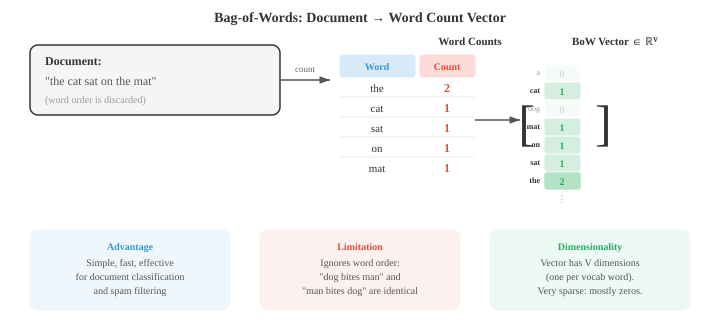

# 文本处理与经典NLP

*文本处理将原始字符转换为模型可消费的结构化表示。本文涵盖分词（词级、子词、BPE、WordPiece）、文本规范化、编辑距离、TF-IDF、n元组语言模型、词性标注、命名实体识别和情感分析——这些经典NLP流水线至今仍是现代系统的基础。*

- 原始文本是混乱的。在任何NLP模型处理语言之前，文本必须经过清洗、规范化并转换为结构化表示。本文涵盖了从原始字符到模型可消费特征的完整流水线，以及深度学习兴起之前主导领域的经典NLP算法。

- **文本规范化**将原始文本转换为规范形式。其目标是减少不相关的变异，使"Hello"、"hello"、"HELLO"和"héllo"得到恰当的处理。

- **大小写折叠**将文本转换为小写。这将"The"和"the"合并为一个词元。这对大多数任务有帮助，但在某些情况下会破坏有用信息："US"（国家）vs "us"（代词），或"Apple"（公司）vs "apple"（水果）。

- **Unicode规范化**处理同一字符有多种编码方式的问题。字符"é"可以是单个码点（U+00E9），也可以是基础"e"加上组合变音符号（U+0065 + U+0301）。NFC规范化将它们组合成一个码点；NFD则进行分解。如果没有规范化，两个看起来相同的字符串可能无法匹配。

- **编辑距离**衡量两个字符串之间的差异程度。**莱文斯坦距离**计算将一个字符串转换为另一个所需的最少单字符插入、删除和替换次数。"kitten" → "sitting"的编辑距离为3（k→s，e→i，插入g）。

- 编辑距离使用动态规划计算（我们在算法章节中回顾）。定义 $D[i][j]$ 为字符串 $s$ 的前 $i$ 个字符与字符串 $t$ 的前 $j$ 个字符之间的距离：

```math
D[i][j] = \begin{cases} j & \text{if } i = 0 \\ i & \text{if } j = 0 \\ D[i{-}1][j{-}1] & \text{if } s[i] = t[j] \\ 1 + \min(D[i{-}1][j], \; D[i][j{-}1], \; D[i{-}1][j{-}1]) & \text{otherwise} \end{cases}
```

- 编辑距离支撑着拼写纠正、模糊匹配和DNA序列比对。在NLP中，它用于处理拼写错误和查找相似单词。

- **分词**将文本分割成模型可以处理的离散单元（词元）。这是第一个也是最重要的预处理步骤。分词策略的选择深刻影响着模型行为。

- **空白分词**以空格分割。简单但幼稚："New York"变成两个词元，"don't"是一个词元（或根据分割器不同，拆分为"don"和"'t"），而中文和日文等语言在词之间根本没有空格。

- **基于规则的分词**使用手工设计的模式（正则表达式）来处理缩写、标点符号和特殊情况。"I'm" → "I" + "'m"，"U.S.A."保持为一个词元。每种语言都需要自己的规则，这非常耗费人力。

- **子词分词**是现代解决方案。它不是在词边界处分割，而是从数据中学习一个高频子词单元的词汇表。这优雅地处理了未知词：如果"unhappiness"不在词汇表中，它可能被拆分为"un" + "happi" + "ness"，保留了形态结构。


- **字节对编码（BPE）**从单个字符作为词汇表开始。它反复查找最频繁的相邻对并将其合并为一个新词元。经过足够次数的合并后，常见词成为单个词元，罕见词则被拆分为高频子词片段。

- BPE算法：
    1. 用训练语料中的所有单个字符初始化词汇表
    2. 统计每个相邻词元对的频率
    3. 将最频繁的对合并为一个新词元
    4. 重复步骤2-3，直到达到所需的合并次数（词汇表大小）

- 例如，从"l o w"（5次）、"l o w e r"（2次）、"n e w e s t"（6次）开始：最频繁的对可能是"e s" → 合并为"es"。然后"es t" → "est"。然后"n e w" → "new"。最终的词汇表同时包含完整单词和子词片段。

- **WordPiece**（BERT使用）与BPE类似，但基于似然而非频率来选择合并。它合并能使训练数据的语言模型似然最大化的对。非词首的子词词元以"##"作为前缀（例如，"playing" → "play" + "##ing"）。

- **Unigram**（SentencePiece使用）采用相反的方法：从一个大型词汇表开始，迭代地移除那些移除后对训练数据似然损失最小的词元。最终的词汇表是最能解释语料库的子词单元集合。

- **SentencePiece**是一个语言无关的分词库，它将输入视为原始字节流（不在空格上进行预分词）。这使得它适用于任何语言，包括没有空格的语言。它同时实现了BPE和Unigram算法。

- 词汇表大小是一个关键超参数。典型的选择范围从30,000到100,000个词元。更大的词汇表意味着每个序列的词元更少（更高效），但需要更大的嵌入表。更小的词汇表意味着更多的子词分割和更长的序列。

- 两种技术都将词汇简化为基本形式，但方法不同。

- **词干提取**使用粗略规则切除后缀。波特词干提取器将"running"简化为"run"，"happiness"简化为"happi"，"studies"简化为"studi"。它速度快但不精确："university"和"universe"都被词干化为"univers"，尽管它们毫不相关。

- **词形还原**使用词汇表和形态学分析来找到真正的词典形式（词元）。"Running" → "run"，"better" → "good"，"mice" → "mouse"。它需要知道词性："saw"作为动词时词形还原为"see"，但作为名词时保持为"saw"。

- 现代子词分词在很大程度上已取代了神经NLP中的词干提取和词形还原，但它们在信息检索以及处理较小模型或有限数据时仍然有用。

- **词性标注**为每个词分配一个语法类别：名词、动词、形容词、限定词等。这是最古老的NLP任务之一，也是句法分析的基础。

- 宾州树库标签集是英语中最常用的，包含36个标签（NN表示单数名词，NNS表示复数名词，VB表示动词原形，VBD表示过去式，JJ表示形容词等）。

- 词性标注很棘手，因为许多词是有歧义的。"Book"可以是名词（"the book"）或动词（"book a flight"）。"Run"在不同词性下有数十种含义。上下文至关重要。

- 早期的标注器使用第05章中的**隐马尔可夫模型（HMM）**。隐藏状态是词性标签，观测值是单词。转移概率捕捉标签序列（限定词后面很可能跟名词或形容词），发射概率捕捉哪些词与哪些标签一起出现。维特比算法找出最可能的标签序列。

- 用于词性标注的HMM模型：

$$\\hat{t}_{1:n} = \\arg\\max_{t_{1:n}} \\prod_{i=1}^{n} P(w_i \\mid t_i) \\cdot P(t_i \\mid t_{i-1})$$

- 现代词性标注器使用神经网络（双向LSTM或Transformer），在英语上达到超过97%的准确率，接近人类水平。

- **命名实体识别（NER）**识别并分类文本中的专有名词和其他特定实体：人物、组织、地点、日期、货币金额等。

- 在"Apple CEO Tim Cook announced the event in Cupertino on Monday"中，NER系统应识别出：Apple（ORG组织）、Tim Cook（PER人物）、Cupertino（LOC地点）、Monday（DATE日期）。

- NER通常被框架化为**序列标注**，使用**BIO标注**（也称为IOB标注）。每个词元获得一个标签：
    - **B-TYPE**：TYPE类型实体的开始
    - **I-TYPE**：TYPE类型实体的内部（延续）
    - **O**：实体外部

- "Tim Cook visited New York"变为：Tim/B-PER Cook/I-PER visited/O New/B-LOC York/I-LOC。B标签标记新实体的起始位置，这对于两个同类型实体相邻的情况很重要。


- 经典NER使用第05章中的**条件随机场（CRF）**，它对给定输入下整个标签序列的条件概率建模。与生成式模型（$P(x, y)$）的HMM不同，CRF是判别式模型，直接建模 $P(y \\mid x)$。线性链CRF定义为：

$$P(y_{1:n} \\mid x_{1:n}) = \\frac{1}{Z(x)} \\exp\\!\\left(\\sum_{i=1}^{n} \\left[\\sum_k \\lambda_k f_k(y_i, x, i) + \\sum_j \\mu_j g_j(y_i, y_{i-1}, x, i)\\right]\\right)$$

- 这里 $f_k$ 是**发射特征**（给定位置 $i$ 的输入，标签 $y_i$ 的可能性），$g_j$ 是**转移特征**（给定前一个标签 $y_{i-1}$，当前标签 $y_i$ 的可能性）。

- 配分函数 $Z(x) = \\sum_{y'} \\exp(\\ldots)$ 对所有可能的标签序列求和，以归一化分布。训练最大化条件对数似然，这需要使用前向算法（第05章）高效计算 $Z(x)$。

- 与独立分类每个词元相比的关键优势：CRF的转移特征强制结构约束（例如，I-PER应该只跟在B-PER或I-PER之后，绝不应出现在O之后）。

- 现代NER将CRF堆叠在神经编码器之上（BiLSTM-CRF或BERT-CRF），其中神经网络产生发射分数，CRF层学习转移结构。

- **句法分析**将句子转换为其句法结构，可以是成分树或依存树（两者均见文件01）。

- **CYK算法**（Cocke-Younger-Kasami）使用动态规划结合上下文无关文法解析句子。

- 它要求文法为**乔姆斯基范式**（每条规则的右侧要么有两个非终结符，要么有一个终结符）。它自底向上填充一个三角表格：单元格表示句子的跨度，每个单元格存储可以生成该跨度的非终结符。

- CYK的时间复杂度为 $O(n^3 \\cdot |G|)$，其中 $n$ 是句子长度，$|G|$ 是文法规模。这是精确算法，但对于大型文法来说速度较慢。

- **移进-归约解析**从左到右处理句子，维护一个栈。在每一步，它要么**移进**（将下一个词压入栈），要么**归约**（从栈中弹出元素并用短语替换）。一个训练好的分类器在每一步决定操作。时间复杂度为 $O(n)$，比CYK快得多。

- **依存解析**在实践中比成分解析更为常见。基于转换的依存解析器（如移进-归约）和基于图的解析器（对所有可能的边评分并找到最大生成树）是两种主要方法。使用BiLSTM或Transformer的神经依存解析器取得了最先进的成果。

- 在嵌入出现之前，NLP使用简单的计数方法将文档表示为向量。

- **词袋模型（BoW）**将文档表示为词频向量，完全忽略词序。如果词汇表有 $V$ 个词，每个文档就是 $\\mathbb{R}^V$ 空间中的一个向量（与第01章的向量空间相联系）。词 $w$ 对应的条目是 $w$ 在文档中出现的次数。



- BoW简单但出奇有效，适用于文档分类和垃圾邮件过滤等任务。其主要缺点是每个词都被同等对待："the"和"revolutionary"获得相同的权重。

- **TF-IDF**（词频-逆文档频率）通过根据词的信息量大小来加权，解决了这个问题。在单个文档中频繁出现但在整个语料库中罕见的词，很可能对该文档很重要。

$$\\text{TF-IDF}(t, d) = \\text{TF}(t, d) \\times \\text{IDF}(t)$$

- **词频** $\\text{TF}(t, d)$ 通常是词 $t$ 在文档 $d$ 中的原始计数（或其对数形式：$1 + \\log(\\text{count})$）。

- **逆文档频率** $\\text{IDF}(t) = \\log\\frac{N}{|\\{d : t \\in d\\}|}$，其中 $N$ 是文档总数。出现在每个文档中的词（如"the"）的IDF接近0。罕见词获得高IDF。

- TF-IDF向量可以使用余弦相似度（来自第01章）进行比较，以衡量文档相似性。这是经典信息检索和搜索引擎的基础。

- **语言模型**为词序列分配概率。它回答的是：这个句子的可能性有多大？语言模型是机器翻译、语音识别、拼写纠正和文本生成的核心。

- 句子 $w_1, w_2, \\ldots, w_n$ 的概率，根据概率的链式法则（第05章）为：

$$P(w_1, w_2, \\ldots, w_n) = \\prod_{i=1}^{n} P(w_i \\mid w_1, \\ldots, w_{i-1})$$

- 这是精确的但不实用：你需要为每个可能的历史存储概率。**马尔可夫假设**（第05章）将历史截断到最近 $k-1$ 个词，得到 **n元语法模型**（其中 $n = k$）。

- **二元模型**（$n = 2$）仅依赖前一个词：

$$P(w_i \\mid w_1, \\ldots, w_{i-1}) \\approx P(w_i \\mid w_{i-1})$$

- **三元模型**（$n = 3$）依赖前两个词。n元语法概率通过在语料库中计数来估计：

$$P(w_i \\mid w_{i-1}) = \\frac{\\text{count}(w_{i-1}, w_i)}{\\text{count}(w_{i-1})}$$

- **困惑度**衡量语言模型对测试集的预测能力。它是测试集概率的倒数，按词数归一化：

$$\\text{PPL} = P(w_1, \\ldots, w_N)^{-1/N} = \\exp\\!\\left(-\\frac{1}{N} \\sum_{i=1}^{N} \\log P(w_i \\mid w_{<i})\\right)$$

- 困惑度越低，说明模型对测试数据越"不惊讶"，因此性能越好。在10,000词词汇表上分配均匀概率的模型，困惑度为10,000。一个好的二元模型可能达到约200的困惑度。现代神经语言模型的困惑度低于20。

- 注意，困惑度是指数化的交叉熵（来自第05章的信息论部分）。训练期间最小化交叉熵损失直接最小化困惑度。

- **平滑**处理零概率问题：如果某个n元组从未在训练中出现过，模型会赋予它概率0，这会使整个句子的概率为0。**拉普拉斯平滑**（加1）为每个n元组添加一个小计数：

$$P_{\\text{Laplace}}(w_i \\mid w_{i-1}) = \\frac{\\text{count}(w_{i-1}, w_i) + 1}{\\text{count}(w_{i-1}) + V}$$

- 对于大词汇表来说这过于激进（从已观察到的n元组中挪走了太多概率）。**Kneser-Ney平滑**是n元语法模型的金标准。它结合了两个思想：绝对折扣和用于回退的延续概率。

- 首先，**绝对折扣**从每个观察到的计数中减去一个固定折扣 $d$（通常 $d \\approx 0.75$），而不是添加伪计数。释放出的概率质量重新分配给未见过的n元组。插值形式为：

$$P_{\\text{KN}}(w_i \\mid w_{i-1}) = \\frac{\\max(\\text{count}(w_{i-1}, w_i) - d, \\; 0)}{\\text{count}(w_{i-1})} + \\lambda(w_{i-1}) \\cdot P_{\\text{cont}}(w_i)$$

- 其中 $\\lambda(w_{i-1})$ 是一个归一化常数，用于分配折扣后的质量。关键的创新是**延续概率** $P_{\\text{cont}}(w_i)$，它衡量 $w_i$ 出现在多少个不同的上下文中，而不是它总体上出现的频率：

$$P_{\\text{cont}}(w_i) = \\frac{|\\{w' : \\text{count}(w', w_i) > 0\\}|}{|\\{(w', w'') : \\text{count}(w', w'') > 0\\}|}$$

- 分子统计在语料库中出现在 $w_i$ 之前的不同词的数量。像"Francisco"这样的词出现在很少的上下文中（几乎总是在"San"之后），所以即使"San Francisco"非常频繁，"Francisco"的延续概率也很低，不会在其他上下文中被错误预测。

- 相反，像"the"这样的常见词出现在许多不同词之后，获得高延续概率。这体现了这样一种直觉：对于回退估计而言，词的多功能性比其原始频率更重要。

- n元语法模型几十年来一直是主流技术。它们速度快、可解释性强，且无需训练（只需计数）。但它们难以处理长距离依赖（"The keys that I left on the table **are** missing"需要知道主语"keys"是复数，而它与动词相距甚远）。神经语言模型——从RNN开始到Transformer达到顶峰——解决了这一局限性。

## 编程练习（使用CoLab或notebook）

1. 使用动态规划实现莱文斯坦编辑距离。在词对上测试，并用于简单的拼写纠正。
```python
import jax.numpy as jnp

def edit_distance(s, t):
    """Compute Levenshtein edit distance using DP."""
    m, n = len(s), len(t)
    D = [[0] * (n + 1) for _ in range(m + 1)]

    for i in range(m + 1):
        D[i][0] = i
    for j in range(n + 1):
        D[0][j] = j

    for i in range(1, m + 1):
        for j in range(1, n + 1):
            if s[i-1] == t[j-1]:
                D[i][j] = D[i-1][j-1]
            else:
                D[i][j] = 1 + min(D[i-1][j], D[i][j-1], D[i-1][j-1])

    return D[m][n]

# Test
pairs = [("kitten", "sitting"), ("sunday", "saturday"), ("hello", "hallo")]
for s, t in pairs:
    print(f"d('{s}', '{t}') = {edit_distance(s, t)}")

# Simple spelling correction
dictionary = ["the", "their", "there", "then", "than", "this", "that", "these", "those"]
misspelled = "thier"
corrections = sorted(dictionary, key=lambda w: edit_distance(misspelled, w))
print(f"\nClosest to '{misspelled}': {corrections[:3]}")
```

2. 从头实现BPE分词。从字符级词元开始，迭代地合并最频繁的对。
```python
from collections import Counter

def get_pairs(corpus):
    """Count adjacent token pairs across all words."""
    pairs = Counter()
    for word, freq in corpus.items():
        symbols = word.split()
        for i in range(len(symbols) - 1):
            pairs[(symbols[i], symbols[i+1])] += freq
    return pairs

def merge_pair(pair, corpus):
    """Merge all occurrences of a pair in the corpus."""
    new_corpus = {}
    bigram = ' '.join(pair)
    replacement = ''.join(pair)
    for word, freq in corpus.items():
        new_word = word.replace(bigram, replacement)
        new_corpus[new_word] = freq
    return new_corpus

# Training corpus with word frequencies
text = "low low low low low lower lower newest newest newest newest newest newest"
word_freqs = Counter(text.split())
# Initialise: split each word into characters with end-of-word marker
corpus = {' '.join(word) + ' _': freq for word, freq in word_freqs.items()}

print("Initial corpus:")
for word, freq in corpus.items():
    print(f"  {word}: {freq}")

# Run BPE for 10 merges
for i in range(10):
    pairs = get_pairs(corpus)
    if not pairs:
        break
    best_pair = max(pairs, key=pairs.get)
    corpus = merge_pair(best_pair, corpus)
    print(f"\nMerge {i+1}: {best_pair} (freq={pairs[best_pair]})")
    for word, freq in corpus.items():
        print(f"  {word}: {freq}")
```

3. 构建一个二元语言模型，并计算测试句子的困惑度。尝试拉普拉斯平滑。
```python
from collections import Counter, defaultdict
import math

# Training corpus
train = """the cat sat on the mat . the dog chased the cat .
the cat ran from the dog . a dog sat on a mat .""".split()

# Count bigrams and unigrams
bigrams = Counter(zip(train[:-1], train[1:]))
unigrams = Counter(train)
vocab_size = len(set(train))

def bigram_prob(w2, w1, alpha=0):
    """P(w2 | w1) with optional Laplace smoothing."""
    return (bigrams[(w1, w2)] + alpha) / (unigrams[w1] + alpha * vocab_size)

# Compute perplexity
test = "the cat sat on a mat .".split()

for alpha in [0, 1, 0.1]:
    log_prob = 0
    for w1, w2 in zip(test[:-1], test[1:]):
        p = bigram_prob(w2, w1, alpha=alpha)
        if p > 0:
            log_prob += math.log(p)
        else:
            log_prob += float('-inf')

    ppl = math.exp(-log_prob / (len(test) - 1)) if log_prob > float('-inf') else float('inf')
    print(f"Smoothing α={alpha}: perplexity = {ppl:.2f}")
```

4. 从头实现TF-IDF，并使用余弦相似度找到与查询最相似的文档。
```python
import jax.numpy as jnp
import math
from collections import Counter

documents = [
    "the cat sat on the mat",
    "the dog chased the cat around the park",
    "a mat was placed on the floor by the door",
    "the quick brown fox jumped over the lazy dog",
]

# Build vocabulary
vocab = sorted(set(word for doc in documents for word in doc.split()))
word_to_idx = {w: i for i, w in enumerate(vocab)}
V = len(vocab)
N = len(documents)

# Compute TF-IDF matrix
doc_freq = Counter()
for doc in documents:
    for word in set(doc.split()):
        doc_freq[word] += 1

tfidf_matrix = jnp.zeros((N, V))
for i, doc in enumerate(documents):
    word_counts = Counter(doc.split())
    for word, count in word_counts.items():
        tf = 1 + math.log(count)
        idf = math.log(N / doc_freq[word])
        j = word_to_idx[word]
        tfidf_matrix = tfidf_matrix.at[i, j].set(tf * idf)

# Query
query = "cat on the mat"
query_vec = jnp.zeros(V)
query_counts = Counter(query.split())
for word, count in query_counts.items():
    if word in word_to_idx:
        tf = 1 + math.log(count)
        idf = math.log(N / doc_freq.get(word, 1))
        query_vec = query_vec.at[word_to_idx[word]].set(tf * idf)

# Cosine similarity (from chapter 01)
def cosine_sim(a, b):
    return jnp.dot(a, b) / (jnp.linalg.norm(a) * jnp.linalg.norm(b) + 1e-8)

print(f"Query: '{query}'\n")
for i, doc in enumerate(documents):
    sim = cosine_sim(query_vec, tfidf_matrix[i])
    print(f"  Doc {i} (sim={sim:.3f}): '{doc}'")
```
