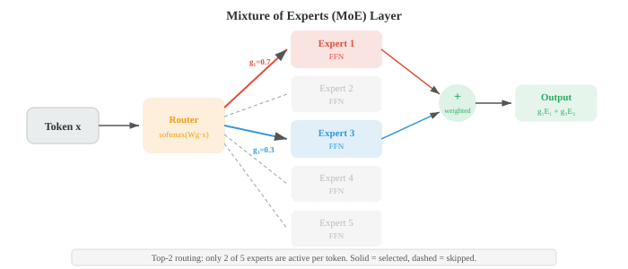

# Transformer与语言模型

*Transformer用自注意力取代了循环结构，成为语言理解和生成的主导架构。本文件涵盖BERT、GPT、T5、位置编码（正弦编码、RoPE）、预训练目标（MLM、CLM）、微调、提示工程和缩放定律——这些是现代大语言模型背后的蓝图。*

- 在第06章中，我们介绍了Transformer架构：自注意力、多头注意力、位置编码以及编码器-解码器结构。这里我们聚焦于Transformer如何适配特定的NLP范式、定义现代NLP的模型（BERT、GPT、T5），以及让它们在大规模下切实可行的技术。

- 回顾核心操作：**缩放点积注意力**计算 $\text{softmax}(QK^T / \sqrt{d_k}) V$，其中查询、键和值都是输入的线性投影。**多头注意力**并行运行 $h$ 个注意力头，每个头使用不同的学习投影，然后将结果拼接起来。Transformer块通过残差连接、层归一化和逐位置前馈网络（第06章）将这一切包裹起来。

- 一个微妙但重要的架构选择是**层归一化**的放置位置。原始Transformer使用**后归一化**：残差和归一化在子层之后执行，即 $\text{LayerNorm}(x + \text{Sublayer}(x))$。

- 大多数现代模型使用**前归一化**：在子层之前进行归一化，即 $x + \text{Sublayer}(\text{LayerNorm}(x))$。前归一化在训练过程中更加稳定，因为残差连接直接将梯度通过恒等路径传递，不受归一化的影响。这使得训练非常深的模型变得更容易，无需仔细的学习率预热。

- 每个Transformer块中的**前馈子层**是一个两层MLP，独立应用于每个标记位置：

$$\text{FFN}(x) = W_2 \cdot \text{GELU}(W_1 x + b_1) + b_2$$

- 内部维度通常是模型维度的4倍（例如，$d_{\text{model}} = 768$，$d_{\text{ff}} = 3072$）。这个FFN约占每个块中参数的三分之二，被认为起到键-值记忆的作用，存储训练过程中学到的事实知识。

- **位置编码**为模型提供标记顺序的信息，因为注意力本身是置换等变的。原始的**正弦编码**（第06章）使用不同频率的固定正弦和余弦函数。**可学习位置嵌入**则简单地为每个位置添加一个可训练向量（用于BERT和GPT-2）。两者都是绝对编码：无论上下文如何，位置5总是得到相同的向量。

- **旋转位置编码（RoPE）**通过在二维子空间中旋转查询和键向量来编码位置。对于一对维度 $(q_{2i}, q_{2i+1})$，按角度 $m\theta_i$ 的旋转（其中 $m$ 是位置，$\theta_i = 10000^{-2i/d}$）应用如下：

```math
\begin{bmatrix} q'_{2i} \\ q'_{2i+1} \end{bmatrix} = \begin{bmatrix} \cos m\theta_i & -\sin m\theta_i \\ \sin m\theta_i & \cos m\theta_i \end{bmatrix} \begin{bmatrix} q_{2i} \\ q_{2i+1} \end{bmatrix}
```


- RoPE的精妙之处在于，旋转后的查询和键之间的点积 $q'^T k'$ 仅依赖于相对位置 $m - n$，而非绝对位置。

- 为了理解原因，将旋转写为 $q' = R_m q$ 和 $k' = R_n k$，其中 $R_m$ 是一个块对角旋转矩阵。注意力分数变为：

$$q'^T k' = (R_m q)^T (R_n k) = q^T R_m^T R_n \, k = q^T R_{n-m} \, k$$

- 最后一步利用了旋转群性质：$R_m^T R_n = R_{n-m}$（先向后旋转 $m$ 再向前旋转 $n$，等价于旋转 $n - m$）。

- 这意味着注意力分数仅依赖于相对距离 $n - m$，而非绝对位置 $m$ 和 $n$ 本身。

- 模型无需任何学习的位置参数就能获得自然的距离概念，并且可以泛化到训练时未见过的序列长度。

- **ALiBi**（带线性偏置的注意力）采用了一种更简单的方法：它根据距离向注意力分数添加一个固定的线性惩罚，即 $\text{score}_{ij} = q_i^T k_j - m \cdot |i - j|$，其中 $m$ 是每个头特定的斜率。不同的头使用不同的斜率，使一些头可以关注局部信息，另一些头关注全局信息。ALiBi不需要任何可学习的位置参数，并且能够很好地泛化到比训练时更长的序列。

- 基于Transformer的语言模型的三种主导范式是**仅编码器**、**仅解码器**和**编码器-解码器**。它们在模型能看到的范围（注意力掩码）以及训练方式上有所不同。


- **BERT**（来自Transformer的双向编码器表示，Devlin等人，2019）是典型的仅编码器模型。它使用完全的双向注意力处理文本：每个标记可以关注所有其他标记，包括左右两侧。这赋予了BERT丰富的上下文表示，但意味着它不能自回归地生成文本。

- BERT通过两个目标进行预训练。**掩码语言建模（MLM）**随机遮蔽15%的输入标记，并训练模型去预测它们。在被选中的标记中，80%被替换为[MASK]标记，10%被替换为随机词，10%保持不变（以防止模型只学会在看到[MASK]时才进行预测）。训练目标如下：

$$\mathcal{L}_{\text{MLM}} = -\sum_{i \in \mathcal{M}} \log P(w_i \mid w_{\backslash \mathcal{M}})$$

- 其中 $\mathcal{M}$ 是被遮蔽的位置集合，$w_{\backslash \mathcal{M}}$ 是这些位置被遮蔽后的句子。这是一个**去噪**目标：模型学习重建被破坏的输入。


- **下一句预测（NSP）**训练BERT预测两个句子在原始文本中是否连续。输入开头的特殊[CLS]标记用于此二分类。NSP的加入是为了帮助理解句子关系的任务（如问答），不过后来的工作（RoBERTa）表明其贡献很小，可以去掉。

- BERT的预训练表示通过在其顶部添加特定任务的头部（一个简单的线性层）并微调整个模型来适应下游任务。对于分类任务，使用[CLS]标记的表示。对于标记级任务（命名实体识别、词性标注），使用每个标记的表示。这种**微调**方法将预训练期间学到的语言知识迁移到新任务上，只需相对较少的标注数据。

- **GPT**（生成式预训练Transformer，Radford等人，2018）是典型的仅解码器模型。它使用**因果（自回归）注意力**：每个标记只能关注更早位置的标记（以及自身）。这是通过在注意力矩阵中遮蔽未来位置（将其分数设置为 $-\infty$，然后再进行softmax）来实现的。训练目标是简单的**因果语言建模**：根据所有之前的标记预测下一个标记。

$$\mathcal{L}_{\text{CLM}} = -\sum_{i=1}^{n} \log P(w_i \mid w_1, \ldots, w_{i-1})$$

- 这与文件02中的n-gram语言模型目标相同，但采用了Transformer参数化方式，可以基于整个前文进行条件建模，而不仅仅是最后 $k-1$ 个标记。

- **GPT-2**将其规模扩大到15亿参数，并展现了强大的零样本能力：无需任何微调，它就能通过自然语言提示（"将英语翻译成法语：……"）来执行任务。

- **GPT-3**（1750亿参数）表明，仅凭规模就能实现**上下文学习**：通过在提示中提供几个输入-输出示例，模型无需任何梯度更新就能执行新任务。

- **编码器-解码器模型**如**T5**（文本到文本迁移Transformer，Raffel等人，2020）将每个NLP任务都视为文本到文本：输入是一个文本字符串（可能带有任务前缀，如"将英语翻译成德语："），输出也是一个文本字符串。编码器使用双向注意力处理输入，解码器则通过交叉注意力自回归地生成输出。

- T5通过**跨度破坏**进行预训练：随机连续标记跨度被替换为哨兵标记，模型需要生成原始标记。例如，"The cat sat on the mat"可能变成输入"The [X] on [Y]"，目标输出是"[X] cat sat [Y] the mat"。这是BERT的MLM从单个标记向跨度的泛化。

- **BART**（Lewis等人，2020）是另一种编码器-解码器模型，通过去噪目标进行预训练，但它应用了更广泛的破坏策略：标记遮蔽、标记删除、跨度遮蔽、句子置换和文档旋转。多样化的破坏方式迫使模型学习更鲁棒的表示。

- 随着语言模型变得越来越大，**全量微调**（更新所有参数）变得不切实际：一个175B参数的模型仅存储优化器状态就需要数百GB。**参数高效微调（PEFT）**方法只调整一小部分参数。

- **适配器**在现有Transformer层之间插入小型瓶颈层（通常是两个线性层加一个非线性激活：下投影到小维度，再上投影回来）。只有适配器的权重被训练；原始模型权重被冻结。这增加了不到5%的新参数，同时在大多数任务上匹配全量微调的性能。

- **LoRA**（低秩适配）直接修改权重矩阵，而不添加新层。LoRA不更新完整的权重矩阵 $W$，而是学习一个低秩分解的更新：$W' = W + BA$，其中 $B$ 是 $d \times r$ 矩阵，$A$ 是 $r \times d$ 矩阵，且 $r \ll d$（通常 $r = 4$ 到 $r = 64$）。原始 $W$ 被冻结；只训练 $A$ 和 $B$。在推理时，更新可以合并到原始权重中，不会增加额外延迟：

$$W' = W + BA$$


- **前缀微调**在每个注意力层的键和值矩阵前添加一串可学习的"虚拟标记"。模型像对待真实标记一样关注这些前缀向量，并且只训练前缀参数。这与提示微调类似，但在激活空间而非嵌入空间中操作。

- **提示工程**是设计输入文本的艺术，旨在从预训练模型中引出所需行为，而无需任何参数更新。

    - **零样本提示**用自然语言描述任务（"对以下评论的情感进行分类："）。

    - **少样本提示**在实际查询之前提供输入-输出示例。

    - **链式思维（CoT）提示**添加"让我们一步一步地思考"或在示例中包含推理过程，这通过引导模型分解问题，显著提高了算术和逻辑推理任务的性能。

- **上下文学习（ICL）**是大语言模型能够从提示中提供的示例学习执行任务的现象，而无需任何梯度更新。模型的权重没有改变；它将示例作为一种隐式规范来使用。

- ICL在机制上是如何工作的仍然是一个活跃的研究问题；一种假说是注意力层在前向传播中实现了一种梯度下降形式，实际上是在上下文示例上进行"训练"。

- **缩放定律**描述了模型大小、数据大小、计算预算与性能（以损失衡量）之间的可预测关系。Kaplan等人（2020）发现损失在每个变量上都遵循幂律：

$$L(N) \propto N^{-\alpha_N}, \quad L(D) \propto D^{-\alpha_D}, \quad L(C) \propto C^{-\alpha_C}$$

- 其中 $N$ 是参数量，$D$ 是数据集大小，$C$ 是计算预算。这些幂律在多个数量级上成立，表明单纯地扩大规模就能带来可预测的改进。


- **Chinchilla缩放定律**（Hoffmann等人，2022）修正了这一点，指出大多数大型模型都训练不足。对于固定的计算预算 $C$，最优分配是同等规模地扩大模型大小和训练数据：

$$N_{\text{opt}} \propto C^{0.5}, \quad D_{\text{opt}} \propto C^{0.5}$$

- 这意味着如果计算预算翻倍，应该同时将模型大小和数据集大小增加 $\sqrt{2}$ 倍，而不仅仅是让模型变得更大。

- Kaplan等人曾建议 $N$ 的缩放速度应快于 $D$，这导致了非常大但训练不足的模型。Chinchilla（70B参数，1.4T标记）在相同的计算预算下匹配了Gopher（280B参数，300B标记）的性能，表明早期模型严重缺乏数据。

- 实用的经验法则：大约每个参数训练20个标记。

- **混合专家（MoE）**是一种在不成比例增加计算量的情况下扩大模型容量的架构。MoE不采用单一的大型前馈层，而是使用多个**专家**FFN层和一个**门控网络**（路由网络）来选择每个标记应该激活哪些专家。

- 门控函数计算每个专家的路由分数，并选择前 $k$ 个（通常 $k = 1$ 或 $k = 2$）：

$$G(x) = \text{TopK}(\text{softmax}(W_g x))$$

- 只有被选中的专家处理该标记，因此计算成本随 $k$（活跃专家数）而非总专家数 $E$ 增长。一个有8个专家且采用top-2路由的模型，参数量是稠密模型的4倍，但计算量仅为2倍。



- MoE中一个关键的挑战是**负载均衡**：如果路由网络将大多数标记发送给少数热门专家，其他专家就被浪费了。训练时会添加一个辅助的**负载均衡损失**，鼓励均匀的专家利用率：

$$\mathcal{L}_{\text{balance}} = E \cdot \sum_{i=1}^{E} f_i \cdot p_i$$

- 其中 $f_i$ 是分配给专家 $i$ 的标记比例，$p_i$ 是专家 $i$ 的平均路由概率。当标记比例和概率都均匀（各等于 $1/E$）时，该乘积最小。

- **专家并行**将不同的专家分布到不同的加速器上。在前向传播过程中，通过一个全到全的通信步骤将标记路由到其指定专家所在的设备，然后将结果路由回来。这种通信成本是MoE在大规模部署中的主要工程挑战。Switch Transformer、Mixtral和GShard等模型使用MoE来获得强大的性能，同时保持合理的推理成本。

- 构建模型只是工作的一半；衡量它们是否有效是另一半。NLP评估特别困难，因为语言是模糊的、主观的和开放式的。

- 一个翻译可以有多种正确的表达方式。一个摘要即使与参考摘要没有任何完全相同的词汇，也可能是好的。

- 一个聊天机器人的回复可能既有用、又无害、又诚实，但理性的人仍会对此有不同看法。

- **精确匹配（EM）**是最简单的指标：模型的输出是否与标准答案完全一致？它用于答案简短且无歧义的任务，如抽取式问答（SQuAD）或封闭式数学问题。

- EM是严苛的；"New York City"和"new york city"在不做归一化的情况下无法匹配——但它的简单性使其没有歧义。

- **标记级指标**将NLP视为标记级别的分类问题，使用第06章中的精确率、召回率和F1值。

- **精确率（Precision）**衡量模型预测的标记中正确部分的比例：$P = \text{TP} / (\text{TP} + \text{FP})$。一个预测很少但全部正确的模型具有高精确率。

- **召回率（Recall）**衡量模型找到了多少标准标记：$R = \text{TP} / (\text{TP} + \text{FN})$。一个将所有标记都预测为实体的模型具有完美的召回率但精确率极低。

- **F1**是精确率和召回率的调和平均值：

$$F_1 = \frac{2PR}{P + R}$$

- 调和平均值（而非算术平均值）惩罚不均衡：如果 $P$ 或 $R$ 中任何一个较低，F1就会很低。对于命名实体识别（文件02），F1按每个实体类型分别计算，然后跨类型取宏平均。对于词性标注，标记级准确率更常见，因为每个标记都有一个标签。

- **跨度级F1**（用于SQuAD）比较预测跨度中的标记集与标准跨度中的标记集。这比精确匹配更宽容：如果标准答案是"the Eiffel Tower"而模型预测的是"Eiffel Tower"，跨度F1很高（5个重叠标记中的4个），即使EM为零。

- **BLEU**（双语评估替补，Papineni等人，2002）是机器翻译的经典指标。它衡量候选翻译与一个或多个参考翻译之间的n-gram重叠。该评分结合了多个n-gram级别（unigram到4-gram）的精确率和一个简短惩罚：

$$\text{BLEU} = \text{BP} \cdot \exp\!\left(\sum_{n=1}^{N} w_n \log p_n\right)$$

- 其中 $p_n$ 是**修正的n-gram精确率**：候选翻译中每个n-gram的计数被裁剪为其在任何参考翻译中的最大计数，防止像"the the the the"这样的退化候选获得高分。权重 $w_n$ 通常是均匀的（$w_n = 1/N$，其中 $N = 4$）。

- **简短惩罚** $\text{BP} = \min(1, \exp(1 - r/c))$ 惩罚比参考翻译短的候选（$c$ 是候选长度，$r$ 是参考长度）。没有这个惩罚，模型可以通过输出很少但非常安全的词来获得高精确率。

- BLEU在语料级别（对多个句子取平均）与人类判断有合理的相关性，但在句子级别相关性较差。

- 它奖励精确的n-gram匹配，但会遗漏有效的释义："the cat is on the mat"和"a feline sits atop the rug"尽管意思相同，但二元组重叠为零。

- BLEU也完全忽略了召回率——只输出最常见词汇的候选在精确率上得分很高。

- **ROUGE**（面向召回率的摘要评估替补，Lin，2004）是摘要的标准指标。与强调精确率的BLEU不同，ROUGE强调召回率：参考n-gram中有多少比例出现在候选摘要中？

- **ROUGE-N**计算n-gram的召回率：$\text{ROUGE-N} = \frac{|\text{n-grams}_{\text{ref}} \cap \text{n-grams}_{\text{cand}}|}{|\text{n-grams}_{\text{ref}}|}$。ROUGE-1（unigram）和ROUGE-2（bigram）最为常用。

- ROUGE-L使用候选和参考之间的**最长公共子序列（LCS）**，这可以捕捉句子级别的词序信息，而不要求连续匹配。

- LCS长度除以参考长度得到召回率，除以候选长度得到精确率，F度量则组合两者。

- LCS通过动态规划在 $O(mn)$ 时间内计算（类似于文件02中的编辑距离）：

$$R_{\text{LCS}} = \frac{\text{LCS}(X, Y)}{m}, \quad P_{\text{LCS}} = \frac{\text{LCS}(X, Y)}{n}, \quad F_{\text{LCS}} = \frac{(1 + \beta^2) R_{\text{LCS}} P_{\text{LCS}}}{R_{\text{LCS}} + \beta^2 P_{\text{LCS}}}$$

- 其中 $m$ 和 $n$ 分别是参考和候选的长度，$\beta$ 通常设置为偏向召回率（$\beta \to \infty$ 给出纯召回率）。

- **METEOR**（带显式排序的翻译评估度量，Banerjee和Lavie，2005）通过引入同义词、词干提取和词序来解决BLEU的弱点。

- 它首先使用精确匹配、词干匹配（通过文件02中的Porter词干提取算法）和同义词匹配（通过文件01中的WordNet）在候选和参考之间对齐词汇。

- 然后计算unigram精确率和召回率的调和平均值（偏向召回率），并应用一个碎片化惩罚，惩罚那些匹配词顺序与参考不同的候选。

- **ChrF**（字符n-gram F值）计算字符n-gram而非词汇n-gram的F值。这使其对形态变化具有鲁棒性（对文件01中的黏着语至关重要），并部分处理了分词差异。ChrF++在字符n-gram的基础上增加了词汇二元组。

- 它已成为机器翻译中与BLEU一起推荐的度量标准，特别是对于形态丰富的语言。

- **困惑度**（文件02）衡量语言模型在保留测试集上的预测效果。这是语言模型的标准内在指标：$\text{PPL} = \exp(-\frac{1}{N} \sum_{i} \log P(w_i \mid w_{<i}))$。越低越好。

- 困惑度只能在使用了相同分词方法的模型之间进行比较，因为不同的分词器对同一文本会产生不同的序列长度 $N$。

- 词汇量更大的模型每个标记的困惑度往往更低，但每个句子处理的标记数也更少。

- **每字节比特数（BPB）**按照文本中UTF-8字节数而非标记数进行归一化，使其与分词方式无关：

```math
\text{BPB} = \frac{-\sum_{i} \log_2 P(w_i \mid w_{<i})}{\text{UTF-8字节数}}
```

- **BERTScore**（Zhang等人，2020）超越了表面的n-gram匹配，在嵌入空间中计算相似度。候选中的每个标记与其在参考中最相似的标记进行匹配，使用上下文嵌入（通常来自预训练的BERT模型）的余弦相似度。分数汇总为精确率、召回率和F1：

$$R_{\text{BERT}} = \frac{1}{|r|} \sum_{r_i \in r} \max_{c_j \in c} \cos(r_i, c_j), \quad P_{\text{BERT}} = \frac{1}{|c|} \sum_{c_j \in c} \max_{r_i \in r} \cos(c_j, r_i)$$

- 其中 $r_i$ 和 $c_j$ 是参考和候选标记的上下文嵌入。这捕捉了n-gram指标无法捕捉的语义相似性："automobile"和"car"得分很高，因为它们的BERT嵌入相似，尽管它们没有共享任何字符。

- **BLEURT**（Sellam等人，2020）在此基础上更进一步，直接在人工质量判断上微调BERT模型。给定一个参考和候选对，它输出一个标量质量分数。BLEURT在合成数据（由BLEU和METEOR等指标评分的参考翻译的随机扰动）上训练，然后在人工评分上微调。它与人类判断的相关性优于任何表面级指标。

- **COMET**（翻译评估跨语言优化指标，Rei等人，2020）是一个用于机器翻译的学习度量，它同时以源句、参考和候选作为条件——而不仅仅是参考和候选。它使用多语言编码器（XLM-R）嵌入三者，并预测质量分数。通过看到源句，COMET可以检测仅基于参考的指标所遗漏的意义错误（例如，流畅但事实错误的翻译）。

- **大语言模型作为裁判（LLM-as-judge）**是大规模评估的现代方法。不再计算与参考的指标，而是让一个强大的语言模型（GPT-4、Claude）被提示评估模型输出的质量。裁判接收输入、模型的回复以及可选的参考答案，并给出评分（例如1-5分）或成对偏好（回复A优于回复B）。

- **成对比较**（用于Chatbot Arena）是最可靠的LLM-as-judge格式。裁判看到两个回复并选择更好的那个，而不是给出绝对分数。这避免了校准问题（不同的裁判可能对"3/5"有不同的基准）。结果汇总为**Elo评分**（源自国际象棋），每个模型从一个基准评分开始，根据与其他模型的对战胜负增减分数。模型 $A$ 对模型 $B$ 的预期获胜概率为：

$$P(A \succ B) = \frac{1}{1 + 10^{(R_B - R_A) / 400}}$$

- 其中 $R_A, R_B$ 是Elo评分。每次比较后，评分更新：$R_A' = R_A + K(S - P(A \succ B))$，其中 $S \in \{0, 1\}$ 是实际结果，$K$ 控制更新幅度。持续击败强对手的模型快速上升；输给弱对手的模型下降。

- **位置偏置**是LLM裁判的一个已知问题：它们倾向于偏好先展示的回复（或者在某些模型中，后展示的回复）。**交换**（以两种顺序对每对进行评估）并平均结果可以缓解这一问题。

- **冗长偏置**是另一个问题：裁判倾向于偏好更长、更详细的回复，即使简洁的回答更好。

- **自一致性**检查裁判在多次评估同一输入时是否给出相同的评分。高方差表明评估信号存在噪音。

- **标注者间一致性**（Cohen's kappa或Krippendorff's alpha）衡量多个裁判是否一致，为评估可靠性提供了一个上限。

- **数据污染**是一个关键问题：如果评估数据出现在模型的训练集中，基准分数就会被夸大且毫无意义。

- 这对于在网页抓取数据上训练的大语言模型尤其有问题，因为流行的基准很可能出现在其中。缓解策略包括：使用未公开发布的保留测试集、创建定期重新生成问题的动态基准、**金丝雀字符串**（嵌入在基准数据中用于检测泄露的唯一标识符），以及比较在污染与清洁子集上的性能。

- **标准NLU基准**评估跨多种任务的语言理解能力。

- **GLUE**（通用语言理解评估）和**SuperGLUE**是多任务基准，涵盖情感分析（SST-2）、文本相似度（STS-B）、自然语言推理（MNLI、RTE）、共指消解（WSC）和问答（BoolQ）。

- 模型在每个任务上分别评估，并按聚合指标打分。GLUE现在被认为已经饱和（模型在大多数任务上已超过人类表现）；SuperGLUE仍然更具挑战性。

- **MMLU**（大规模多任务语言理解）通过多项选择题评估57个学术科目（数学、历史、法律、医学、计算机科学等）中的知识和推理能力。

- 它测试模型在预训练期间是否吸收了广泛的知识。分数按科目报告并作为宏平均给出。

- **MMLU-Pro**增加了更困难的多步推理问题，有10个选项而非4个。

- **HellaSwag**通过要求模型选择一个场景最合理的续写来测试常识推理。错误的答案是通过模型对抗性生成的，表面看似合理但语义错误。

- **WinoGrande**通过仅一词之差的极小对测试常识共指消解。

- **ARC**（AI2推理挑战）使用小学科学问题，分为简单和挑战集，测试事实和推理能力。

- **推理和数学基准**评估区分强大LLM与弱小LLM的问题解决能力。

- **GSM8K**（小学数学8K）包含8,500道小学算术应用题，需要多步算术推理。它是基础数学推理和评估链式思维提示（文件04）的标准基准。

- **MATH**是一个更难的数据集，包含代数、数论、几何、计数和概率方面的竞赛级数学问题。问题需要多步符号推理，MATH-500是常用的500题子集。

- **AIME**（美国数学邀请赛）问题是竞赛级的：正确解答需要跨越多个步骤的深度数学推理。DeepSeek-R1在AIME 2024上得分为79.8%，展示了经过RL训练的推理模型（文件05）可以接近人类高手。

- **HumanEval**和**MBPP**（基础编程问题）通过检查模型生成的代码是否通过单元测试来评估代码生成能力。HumanEval包含164个Python问题，包括函数签名和文档字符串；模型需要生成函数体。

- 指标是**pass@k**：在 $k$ 个生成的解决方案中至少有一个通过所有测试的概率。对于单个样本：

$$\text{pass@}k = 1 - \frac{\binom{n-c}{k}}{\binom{n}{k}}$$

- 其中 $n$ 是生成的样本总数，$c$ 是通过的数量。这个公式修正了简单取 $k$ 个样本中最好结果的偏差。

- **SWE-bench**更进一步，评估模型能否通过修改现有代码库来解决真实的GitHub问题——这是对实际软件工程能力的更困难测试。

- **GPQA**（研究生级Google-proof问答）包含生物学、物理学和化学领域的专家级问题，即使是领域专家也很难解答。它测试模型是否具有真正的理解能力而非模式匹配。"Diamond"子集是最难的部分。

- **安全和对齐基准**评估模型是否有用、无害和诚实。

- **TruthfulQA**测试模型是否复现了常见的误解。问题设计为最常见的互联网答案是错误的（例如，"如果吞下口香糖会怎样？"，常见的谣言是它会在胃里停留7年，但事实是它会正常通过）。那些记忆了流行但不正确说法的模型得分很低。

- **BBQ**（问答偏置基准）测试在年龄、性别、种族和宗教等类别上的社会偏置。问题的结构使得有偏置的模型会系统地选择刻板印象的答案。**Toxigen**评估模型针对特定人口群体生成有害内容的倾向。

- **MT-Bench**使用80个精心设计的问题评估多轮对话能力，涵盖写作、角色扮演、推理、数学、编程、信息抽取、STEM和人文学科。LLM裁判（GPT-4）按1-10分对回复评分。多轮格式测试模型是否能进行后续提问、保持上下文和处理澄清请求。

- **Chatbot Arena**（LMSYS）使用真实用户对匿名模型进行盲法成对比较。用户提交提示并对更好的回复投票，而不知道是哪个模型生成的。由此产生的Elo排行榜被认为是对通用LLM质量最生态有效的评估，因为它反映了真实用户在多样化、未经策划的提示上的偏好。

- **AlpacaEval**通过在一组固定的指令上将模型输出与参考模型（GPT-4）进行比较来自动化成对评估。由裁判模型决定胜率。

- **AlpacaEval 2.0**使用长度控制的胜率来纠正冗长偏置。

- **任务特定评估**需要针对专业领域量身定制的指标。

- **词错误率（WER）**用于语音识别：$\text{WER} = (S + D + I) / N$，其中 $S$、$D$、$I$ 分别是替换、删除和插入错误，$N$ 是参考词的数量。这是按参考长度归一化的编辑距离（文件02），应用于词汇级别。

- **槽位F1**用于任务导向的对话系统，衡量模型是否正确地从用户话语中提取结构化信息（例如，从"帮我订一张明天去巴黎的机票"中提取"目的地：巴黎"和"日期：明天"）。

- **引用准确率**用于RAG系统（文件05），检查模型生成的引用是否确实支持所提出的主张。将主张与检索到的段落进行验证，指标统计完全支持、部分支持和不支持的主张比例。

- **评估陷阱**很常见，可能使整个基准比较无效。

- **对测试投其所好**：优化基准性能而非真正能力。在MMLU风格的多项选择上微调的模型在MMLU上得分很高，但在以开放式形式提出的相同问题上可能失败。

- **指标游戏化**：模型可以被优化以产生在自动指标上得分很高的输出（高BLEU、低困惑度），但并非真正优秀。BLEU最优的翻译往往是安全、通用的释义，而非自然流畅的翻译。

- **基准饱和**：当模型在基准上接近或超过人类表现时，该基准就不再提供信息。GLUE、SQuAD 1.1和其他几个基准现在已经饱和。

- 该领域不断创建更难的新基准，但这种创建、饱和和替换的循环使得纵向比较变得困难。

- **人工评估**仍然是黄金标准，但成本高、速度慢且难以复现。不同的标注者群体（众包工作者与领域专家、不同文化、不同语言）会产生不同的判断。报告标注者间一致性和标注者人口统计信息对可复现性至关重要。

## 编程任务（使用CoLab或笔记本）

1. 从头实现一个完整的Transformer编码器块（多头注意力、前馈网络、残差连接、层归一化）。将其应用于一个简单的序列分类任务。
```python
import jax
import jax.numpy as jnp
import matplotlib.pyplot as plt

def layer_norm(x, gamma, beta, eps=1e-5):
    mean = x.mean(axis=-1, keepdims=True)
    var = x.var(axis=-1, keepdims=True)
    return gamma * (x - mean) / jnp.sqrt(var + eps) + beta

def multi_head_attention(Q, K, V, W_q, W_k, W_v, W_o, n_heads):
    B, T, D = Q.shape
    head_dim = D // n_heads

    q = Q @ W_q  # (B, T, D)
    k = K @ W_k
    v = V @ W_v

    # Reshape to (B, n_heads, T, head_dim)
    q = q.reshape(B, T, n_heads, head_dim).transpose(0, 2, 1, 3)
    k = k.reshape(B, T, n_heads, head_dim).transpose(0, 2, 1, 3)
    v = v.reshape(B, T, n_heads, head_dim).transpose(0, 2, 1, 3)

    scores = q @ k.transpose(0, 1, 3, 2) / jnp.sqrt(head_dim)
    weights = jax.nn.softmax(scores, axis=-1)
    out = (weights @ v).transpose(0, 2, 1, 3).reshape(B, T, D)
    return out @ W_o, weights

def transformer_block(x, params):
    # Pre-norm multi-head self-attention
    normed = layer_norm(x, params['ln1_g'], params['ln1_b'])
    attn_out, weights = multi_head_attention(
        normed, normed, normed,
        params['W_q'], params['W_k'], params['W_v'], params['W_o'],
        n_heads=4
    )
    x = x + attn_out

    # Pre-norm feed-forward
    normed = layer_norm(x, params['ln2_g'], params['ln2_b'])
    ff = jax.nn.gelu(normed @ params['W1'] + params['b1'])
    ff = ff @ params['W2'] + params['b2']
    x = x + ff
    return x, weights

# Initialise parameters
d_model, d_ff, n_heads = 32, 128, 4
key = jax.random.PRNGKey(42)
keys = jax.random.split(key, 10)

params = {
    'W_q': jax.random.normal(keys[0], (d_model, d_model)) * 0.05,
    'W_k': jax.random.normal(keys[1], (d_model, d_model)) * 0.05,
    'W_v': jax.random.normal(keys[2], (d_model, d_model)) * 0.05,
    'W_o': jax.random.normal(keys[3], (d_model, d_model)) * 0.05,
    'ln1_g': jnp.ones(d_model), 'ln1_b': jnp.zeros(d_model),
    'ln2_g': jnp.ones(d_model), 'ln2_b': jnp.zeros(d_model),
    'W1': jax.random.normal(keys[4], (d_model, d_ff)) * 0.05,
    'b1': jnp.zeros(d_ff),
    'W2': jax.random.normal(keys[5], (d_ff, d_model)) * 0.05,
    'b2': jnp.zeros(d_model),
}

# Test with random input
x = jax.random.normal(keys[6], (2, 8, d_model))  # batch=2, seq_len=8
out, attn_weights = transformer_block(x, params)
print(f"Input shape:  {x.shape}")
print(f"Output shape: {out.shape}")
print(f"Attention weights shape: {attn_weights.shape}")  # (B, n_heads, T, T)

# Visualise attention patterns for each head
fig, axes = plt.subplots(1, 4, figsize=(16, 3.5))
for h in range(4):
    im = axes[h].imshow(attn_weights[0, h], cmap='Blues', vmin=0)
    axes[h].set_title(f"Head {h}")
    axes[h].set_xlabel("Key pos"); axes[h].set_ylabel("Query pos")
plt.suptitle("Multi-Head Attention Patterns")
plt.tight_layout(); plt.show()
```

2. 实现因果（自回归）注意力掩码，并与双向注意力进行比较。展示掩码如何防止信息从未来流向过去的标记。
```python
import jax
import jax.numpy as jnp
import matplotlib.pyplot as plt

def attention(Q, K, V, mask=None):
    d_k = Q.shape[-1]
    scores = Q @ K.T / jnp.sqrt(d_k)
    if mask is not None:
        scores = jnp.where(mask, scores, -1e9)
    weights = jax.nn.softmax(scores, axis=-1)
    return weights @ V, weights

seq_len, d_model = 6, 8
key = jax.random.PRNGKey(0)
k1, k2, k3 = jax.random.split(key, 3)
Q = jax.random.normal(k1, (seq_len, d_model))
K = jax.random.normal(k2, (seq_len, d_model))
V = jax.random.normal(k3, (seq_len, d_model))

# Bidirectional (encoder-style): all positions visible
bidir_mask = jnp.ones((seq_len, seq_len), dtype=bool)
bidir_out, bidir_weights = attention(Q, K, V, bidir_mask)

# Causal (decoder-style): only past and current positions visible
causal_mask = jnp.tril(jnp.ones((seq_len, seq_len), dtype=bool))
causal_out, causal_weights = attention(Q, K, V, causal_mask)

fig, axes = plt.subplots(1, 3, figsize=(14, 4))
tokens = [f"t{i}" for i in range(seq_len)]

axes[0].imshow(bidir_weights, cmap='Blues', vmin=0, vmax=0.5)
axes[0].set_title("Bidirectional Attention\n(BERT-style)")
axes[0].set_xticks(range(seq_len)); axes[0].set_xticklabels(tokens)
axes[0].set_yticks(range(seq_len)); axes[0].set_yticklabels(tokens)

axes[1].imshow(causal_mask.astype(float), cmap='Greys', vmin=0, vmax=1)
axes[1].set_title("Causal Mask\n(1 = allowed, 0 = blocked)")
axes[1].set_xticks(range(seq_len)); axes[1].set_xticklabels(tokens)
axes[1].set_yticks(range(seq_len)); axes[1].set_yticklabels(tokens)

axes[2].imshow(causal_weights, cmap='Blues', vmin=0, vmax=0.5)
axes[2].set_title("Causal Attention\n(GPT-style)")
axes[2].set_xticks(range(seq_len)); axes[2].set_xticklabels(tokens)
axes[2].set_yticks(range(seq_len)); axes[2].set_yticklabels(tokens)

for ax in axes:
    ax.set_xlabel("Key"); ax.set_ylabel("Query")
plt.tight_layout(); plt.show()

# Verify: in causal attention, output at position i depends only on positions <= i
print("Causal attention weight at position 2 (should only attend to 0, 1, 2):")
print(f"  Weights: {causal_weights[2]}")
print(f"  Sum of future weights (should be ~0): {causal_weights[2, 3:].sum():.6f}")
```

3. 实现LoRA（低秩适配），并展示它如何以远少于全量微调的可训练参数来修改权重矩阵。
```python
import jax
import jax.numpy as jnp

d_model = 256
rank = 4  # LoRA rank (much smaller than d_model)

key = jax.random.PRNGKey(42)
k1, k2, k3 = jax.random.split(key, 3)

# Original frozen weight matrix
W_frozen = jax.random.normal(k1, (d_model, d_model)) * 0.02

# LoRA matrices (only these are trainable)
B = jnp.zeros((d_model, rank))       # initialised to zero
A = jax.random.normal(k2, (rank, d_model)) * 0.01  # random init

# Forward pass: W_effective = W_frozen + B @ A
x = jax.random.normal(k3, (8, d_model))

# Without LoRA
y_original = x @ W_frozen.T

# With LoRA
W_effective = W_frozen + B @ A
y_lora = x @ W_effective.T

# Parameter counts
full_params = d_model * d_model
lora_params = d_model * rank + rank * d_model  # B + A

print(f"Model dimension: {d_model}")
print(f"LoRA rank: {rank}")
print(f"Full fine-tuning parameters: {full_params:,}")
print(f"LoRA parameters: {lora_params:,}")
print(f"Parameter reduction: {full_params / lora_params:.1f}x")
print(f"\nSince B is initialised to zeros, initial LoRA output matches original:")
print(f"  Max difference: {jnp.abs(y_original - y_lora).max():.2e}")

# Simulate training: only update A and B
def lora_forward(A, B, W_frozen, x):
    return x @ (W_frozen + B @ A).T

def dummy_loss(A, B, W_frozen, x, target):
    pred = lora_forward(A, B, W_frozen, x)
    return jnp.mean((pred - target) ** 2)

# Target: some transformation of x
target = x @ jax.random.normal(jax.random.PRNGKey(99), (d_model, d_model)).T * 0.02

grad_fn = jax.jit(jax.grad(dummy_loss, argnums=(0, 1)))
lr = 0.01

for step in range(200):
    gA, gB = grad_fn(A, B, W_frozen, x, target)
    A = A - lr * gA
    B = B - lr * gB

loss_before = dummy_loss(jnp.zeros_like(A), jnp.zeros_like(B), W_frozen, x, target)
loss_after = dummy_loss(A, B, W_frozen, x, target)
print(f"\nLoss before LoRA: {loss_before:.6f}")
print(f"Loss after LoRA:  {loss_after:.6f}")
print(f"Effective weight change rank: {jnp.linalg.matrix_rank(B @ A)}")
```
