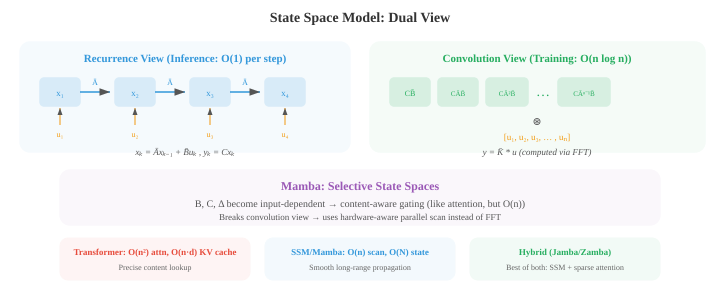
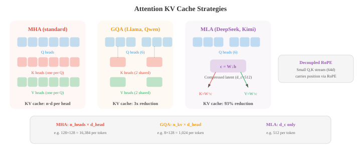

# 高级文本生成

*高级文本生成超越了普通的自回归解码，旨在提升质量、可控性和速度。本文涵盖文本扩散模型（D3PM、MDLM）、OCR、用于对齐的RLHF与DPO、长上下文方法（RoPE缩放、环形注意力）、检索增强生成，以及用于加速推理的推测性解码。*

- 标准的自回归生成（文件04）从左到右逐个生成token。这种方式简单有效，但本质上是串行的，无法进行全局规划，对输出的控制也有限。本文涵盖了超越普通自回归解码的方法：文本扩散模型、光学字符识别、通过人类反馈实现的可控生成、长上下文处理、检索增强生成，以及用于加速推理的推测性解码。

- **文本扩散模型**将扩散框架（在第08章中为图像引入）应用于离散文本。核心挑战在于文本是离散的：你不能像对像素添加噪声那样，向token添加连续的高斯噪声。有几种方法可以解决这个问题。

- **D3PM**（离散去噪扩散概率模型，Austin等人，2021）定义了一个直接在离散token上的前向加噪过程，使用转移矩阵。在每个前向步骤中，一个token有一定概率被另一个token替换（均匀噪声）、被掩码（吸收态）或保持不变。逆向过程学习去噪，从加噪的token预测出干净的token。在步骤$t$处的转移矩阵$Q_t$控制加噪过程：

$$q(x_t \mid x_{t-1}) = \text{Cat}(x_t ; \, x_{t-1} Q_t)$$

- 其中$\text{Cat}$表示类别分布，$x$是一个one-hot向量。多步前向过程$q(x_t \mid x_0)$有一个闭式形式：$q(x_t \mid x_0) = \text{Cat}(x_t ; \, x_0 \bar{Q}_t)$，其中$\bar{Q}_t = Q_1 Q_2 \cdots Q_t$是到步骤$t$为止所有转移矩阵的乘积。训练最小化一个变分下界（ELBO），该下界在不同时间步上分解，与连续情况（第08章）类似：

$$\mathcal{L}_{\text{D3PM}} = D_{\text{KL}}(q(x_T \mid x_0) \| p(x_T)) + \sum_{t=2}^{T} D_{\text{KL}}(q(x_{t-1} \mid x_t, x_0) \| p_\theta(x_{t-1} \mid x_t)) - \log p_\theta(x_0 \mid x_1)$$

- 第一项确保完全加噪后的分布与先验分布（均匀分布或全掩码）匹配。KL项的和训练模型去逆转每个加噪步骤：真实的逆向后验$q(x_{t-1} \mid x_t, x_0)$可以使用贝叶斯规则和已知的转移矩阵以闭式形式计算，模型$p_\theta(x_{t-1} \mid x_t)$被训练去匹配它。

- 由于这两个分布都是类别分布，KL散度就是词汇表条目上的简单求和。最后一项衡量来自最干净加噪状态的重建质量。

- **MDLM**（掩码扩散语言模型，Sahoo等人，2024）通过仅使用掩码作为唯一的加噪操作来简化D3PM：前向过程逐步用[MASK]token替换原始token，逆向过程预测原始token。这使文本扩散与掩码语言建模（BERT，文件04）联系起来，扩散时间步控制被掩码的token比例。在$t = 0$时刻文本完全干净；在$t = T$时刻文本被完全掩码。

- **连续文本扩散**通过在连续的嵌入空间中工作来规避离散问题。Token首先被映射到它们的嵌入向量（第06章），噪声在这个连续空间中被添加，一个去噪模型（通常是Transformer）学习逆转这个过程。在生成时，模型产生连续向量，通过找到最近的嵌入将其映射回离散token。挑战在于连续空间中的小误差可能映射到完全错误的token，因此需要仔细的舍入和裁剪。


- 文本扩散的吸引力在于它通过迭代精炼同时生成所有token，而不是从左到右。这允许全局连贯性和轻松填充（在段落中间生成缺失的文本），但当前文本扩散模型在长文本的生成质量上仍然落后于自回归模型。

- **文本OCR**（光学字符识别）是从图像中提取文本的任务。虽然传统上不归入语言生成，但现代OCR系统与NLP深度集成，并且越来越多地使用语言模型组件。

- **场景文本检测**在自然图像（路牌、产品标签、车牌）中定位文本区域。这很有挑战性，因为野外的文本出现在任意角度、尺寸、字体和杂乱的背景中。检测方法通常使用CNN或Transformer主干网络，围绕文本区域生成边界框或分割掩码。

- **CRNN**（卷积循环神经网络，Shi等人，2017）是一种经典的文本识别架构。CNN从文本图像中提取视觉特征，特征图被切片成列序列（每个水平位置一列），双向LSTM读取这个序列以建模上下文。输出使用**CTC**（连接时序分类）进行解码，该算法处理输入列和输出字符之间的对齐，无需显式分割。

- CTC解决的根本问题是：模型产生$T$个输出分布（每个输入列一个），但目标文本有$L \leq T$个字符。

- 我们不知道哪些列对应哪些字符。CTC引入了一个**空白token** $\epsilon$，并定义了一个多对一的映射$\mathcal{B}$，该映射折叠重复字符并移除空白：$\mathcal{B}(\text{\"HH-ee-ll-ll-oo\"}) = \text{\"Hello\"}$（其中\"-\"是空白）。

- 目标序列$y$的概率是所有折叠后得到$y$的输入对齐路径的概率之和：

$$P(y \mid x) = \sum_{\pi \in \mathcal{B}^{-1}(y)} \prod_{t=1}^{T} P(\pi_t \mid x)$$

- 其中$\pi$是一条长度为$T$的对齐路径（每列一个标签，包括空白）。朴素地求和所有路径是指数级的，但**前向算法**（第05章HMM）使用动态规划在$O(T \cdot L)$时间内高效地计算这个和。

- 空白token是必不可少的：没有它，像\"Hello\"中重复的\"ll\"就无法与单个\"l\"区分开来。训练最大化$\log P(y \mid x)$，在推理时，通过在CTC输出上进行束搜索或贪心解码来找到最佳路径。

- **文档OCR**处理结构化文档（发票、表格、科学论文），除了识别字符外，还必须理解布局。像LayoutLM这样的现代系统将文本识别与空间位置特征相结合：每个token既有其文本嵌入，也有编码其在页面上$(x, y)$坐标的位置嵌入。这使得模型能够理解出现在\"总计：\"下面的数字就是总金额。


- **视觉-语言OCR**模型如TrOCR将文本识别视为图像到文本的生成：视觉Transformer编码器处理图像，语言模型解码器逐字符生成文本。这利用了预训练视觉和语言模型的能力，无需手工特征工程即可处理多种文字、字体和布局。

- **可控生成**是引导语言模型产生具有所需属性（特定的风格、主题、情感、安全级别或事实准确性）的输出的挑战。模型应当遵循指令，同时保持流畅和连贯。

- **针对文本的分类器无关引导（CFG）** 改编自图像生成中的技术。在训练期间，条件信号（如提示词）以一定比例被随机丢弃，从而在同一个模型中同时训练条件模型和无条件模型。在推理时，输出logits被插值：

$$\text{logits}_{\text{guided}} = (1 + w) \cdot \text{logits}_{\text{conditional}} - w \cdot \text{logits}_{\text{unconditional}}$$

- 其中$w > 0$放大了条件的影响。越大的$w$使输出更强烈地遵循提示词，但降低了多样性。

- **RLHF**（基于人类反馈的强化学习，Ouyang等人，2022）是对齐语言模型与人类偏好的主流方法。该过程分为三个阶段：

- 首先，**监督微调（SFT）**：在高质量人工编写的提示-回复数据集上对基础语言模型进行微调。

- 其次，**奖励模型训练**：收集人类比较数据（给定提示$x$和两个回复$y_1, y_2$，哪个更好？）并训练一个奖励模型$r_\phi(x, y)$来预测人类偏好。奖励模型使用成对排序损失进行训练：

$$\mathcal{L}_{\text{RM}} = -\log \sigma(r_\phi(x, y_w) - r_\phi(x, y_l))$$

- 其中$y_w$是更受偏好的回复，$y_l$是不受偏好的回复。

- 第三，**RL微调**：优化语言模型以最大化奖励，同时保持接近SFT模型（以防止模式崩塌）。这使用带有KL惩罚的PPO（近端策略优化，来自第06章）：

$$\mathcal{L}_{\text{RL}} = -\mathbb{E}\left[r_\phi(x, y) - \beta \, D_{\text{KL}}(\pi_\theta \| \pi_{\text{SFT}})\right]$$

- KL项防止模型偏离基础模型太远，并防止模型利用奖励模型的缺陷（\"奖励破解\"）。


- **DPO**（直接偏好优化，Rafailov等人，2023）通过完全消除奖励模型来简化RLHF。关键的数学洞见是，上述KL约束的RL目标有一个闭式最优策略：

$$\pi^\ast(y \mid x) = \frac{1}{Z(x)} \pi_{\text{ref}}(y \mid x) \exp\!\left(\frac{r(x, y)}{\beta}\right)$$

- 其中$Z(x)$是一个归一化配分函数。整理上式求解奖励得$r(x, y) = \beta \log \frac{\pi^\ast(y \mid x)}{\pi_{\text{ref}}(y \mid x)} + \beta \log Z(x)$。将这个隐式奖励代入Bradley-Terry偏好模型$P(y_w \succ y_l) = \sigma(r(x, y_w) - r(x, y_l))$会导致难以处理的$Z(x)$项相互抵消，直接得到DPO损失：

$$\mathcal{L}_{\text{DPO}} = -\log \sigma\!\left(\beta \log \frac{\pi_\theta(y_w \mid x)}{\pi_{\text{ref}}(y_w \mid x)} - \beta \log \frac{\pi_\theta(y_l \mid x)}{\pi_{\text{ref}}(y_l \mid x)}\right)$$

- 这在数学上等价于RLHF，但将奖励模型和RL训练合并为一个单一的监督步骤。

- sigmoid内部的表达式可以理解为："增加偏好回复的相对概率，降低不偏好回复的相对概率，这是相对于参考模型而言的。"

- 参数$\beta$控制策略可以偏离参考模型的程度。在实践中，DPO实现更简单（只需计算当前模型和参考模型对两个完成序列的对数概率），并且避免了PPO训练的不稳定性。

- **Constitutional AI**（Bai等人，2022）自动化了对齐过程的某些部分。它不再收集人类比较数据，而是让语言模型本身根据一组原则（"宪法"）来批评和修订自己的输出，例如"选择危害较小的回复"。然后，AI生成的比较数据被用于偏好训练（RLAIF：基于AI反馈的强化学习）。

- **长上下文方法**解决了标准自注意力的$O(n^2)$内存和计算成本问题，这限制了序列长度。当$n$增长到数万或数十万个token时，标准注意力变得不可行。

- **稀疏注意力**将稠密的$n \times n$注意力矩阵替换为一种稀疏模式，其中每个token只关注其他token的一个子集。常见的模式包括**局部注意力**（每个token关注一个固定大小的相邻窗口）、**步长注意力**（关注每隔$k$个token）和**随机注意力**（关注一个随机子集）。这些模式的组合（用于BigBird、Longformer）实现了$O(n)$或$O(n \sqrt{n})$的复杂度，同时保持了捕获局部和全局依赖关系的能力。


- **滑动窗口注意力**将每个token限制为只关注其之前的$w$个token（其局部窗口）。这是$O(nw)$而不是$O(n^2)$，但长距离信息必须通过跨层的重叠窗口传播。对于$L$层和窗口大小$w$，有效感受野为$L \times w$个token。

- **环形注意力**通过将设备排列成环形拓扑结构，将长序列分布到多个设备上。每个设备持有序列的一个块，并为其块计算注意力，同时将键值块发送给环中的下一个设备。这种方式将计算与通信重叠，允许任意长度的序列，仅受所有设备总内存的限制，而不受任何单个设备内存的限制。

- **记忆增强模型**通过为Transformer配备一个外部记忆库来扩展上下文。在每个层中，模型可以使用注意力从这个记忆库中读取和写入。Memorizing Transformers缓存来自先前块的键值对，并在后续块中关注它们，从而有效地将上下文扩展到训练窗口之外。检索是近似的（使用缓存键的$k$近邻搜索）以保持高效。

- 上述方法是处理长上下文的**架构**解决方案。同样重要的是模型如何被**训练**以有效使用长上下文。

- **渐进式上下文扩展**是标准方法。从一开始就在非常长的序列上训练代价高昂（$O(n^2)$的注意力成本），因此模型在较短的上下文长度上预训练（通常为4K-8K token），然后通过**继续预训练**分阶段扩展到目标长度。

- Llama 3.1从8K扩展到128K，使用了800B token，并逐步增加序列长度。DeepSeek-V3在4K处训练，然后扩展到32K，再到128K。

- 每个阶段使用适中的token数量（相对于完整的预训练预算），因为模型只需要学习如何使用更长的位置，而不是重新学习语言本身。

- 在扩展过程中，位置编码必须进行调整。**RoPE插值**缩小位置索引，使得模型看到与训练时相同的旋转角度，只是分布在更长的序列上。如果模型在长度$L$上训练，你想要扩展到$L' = 4L$，你可以将所有位置索引除以4。

- 这意味着模型永远不会遇到未见过的旋转角度，但相邻位置之间的有效分辨率会下降。

- **RoPE外推**保持原始位置索引不变，直接将RoPE应用于超出$L$的位置，依赖模型对未见角度的泛化能力。

- 插值要稳定得多；在不调整基频（ABF）的情况下，外推会迅速退化。

- **YaRN**（Yet another RoPE extensioN，又一种RoPE扩展）改进了朴素插值，因为它认识到并非所有RoPE维度都应被同等对待。

- 高频维度（在$\theta_i = \theta_{\text{base}}^{-2i/d}$中较小的$i$）在训练长度内旋转多次，可以很好地外推。

- 低频维度（较大的$i$）旋转缓慢，对长度扩展更敏感。

- YaRN只插值低频维度，外推高频维度，并对注意力logits应用温度缩放$t$以补偿分布偏移：

$$\text{score}'_{ij} = \frac{q_i^T k_j}{t \sqrt{d_k}}$$

- 其中$t > 1$展平了注意力分布，防止模型在位置信号被压缩时过于尖锐地关注附近的token。

- **长上下文数据策展**是一个关键且常被低估的挑战。大多数预训练语料库由短文档组成（新闻文章、网页、社交媒体帖子）。

- 长上下文训练需要实际利用完整上下文窗口的数据组合：书籍、代码仓库、长篇科学文章、多轮对话日志，以及主题相关的拼接文档。

- 如果模型仅在填充或打包以填满上下文窗口的短文档上训练，它会学会忽略远处的token，因为它们从来都不相关。

- **序列打包**是一种训练效率技术：多个文档拼接成一个训练序列以避免填充浪费，使用注意力掩码防止跨文档的注意力。

- 对于长上下文训练，打包策略很重要：打包许多不相关的短文档会教模型将远处的token视为噪声，而打包更少的、真正长的文档则教它使用完整的上下文。

- 一个已知的失败模式是**"中间迷失"**现象（Liu等人，2023）：语言模型能够有效利用上下文窗口开头和结尾的信息，但在处理位于中间的信息时表现困难。

- 这类似于人类记忆中的序列位置效应（首因效应和近因效应）。

- 它部分源于训练数据的分布（重要信息通常在文档的开头或结尾），部分源于注意力模式集中于邻近token和初始token。

- 通过在不同位置放置关键信息进行长上下文训练可以缓解但无法完全解决这个问题。

- **大海捞针**评估测试模型是否能够从长长的干扰上下文（"大海"）中检索出位于不同位置的特定事实（"针"）。

- 具有真正长上下文能力的模型应该无论针放在哪里都能实现近乎完美的检索。

- 这个测试清晰地揭示了"中间迷失"效应，并被用作上下文扩展方法的基准。

- **预训练后的长上下文微调**使用有针对性的SFT数据：长多轮对话、证据分散在数千个token中的文档问答、长篇摘要，以及仓库级别的代码理解。

- Qwen3在此阶段使用**双块注意力（DCA）**，它将长序列作为成对的块进行处理，其中块内注意力是完整的，块间注意力是高效的，在微调期间实现了4倍的有效序列容量。

- **状态空间模型（SSM）**提供了一种根本不同的长序列建模方法。它们不是修改注意力，而是用受连续时间控制理论启发的线性动力系统完全取代注意力。

- 一个SSM将输入序列$u(t)$通过一个潜在状态$x(t) \in \mathbb{R}^N$映射到输出$y(t)$，其控制方程为：

$$x'(t) = Ax(t) + Bu(t), \quad y(t) = Cx(t) + Du(t)$$

- 其中$A \in \mathbb{R}^{N \times N}$是状态转移矩阵，$B \in \mathbb{R}^{N \times 1}$是输入投影，$C \in \mathbb{R}^{1 \times N}$是输出投影，$D$是一个跳跃连接。

- 为了将其应用于离散序列（token），使用步长$\Delta$对连续系统进行**离散化**。零阶保持离散化给出：

$$\bar{A} = \exp(\Delta A), \quad \bar{B} = (\Delta A)^{-1}(\exp(\Delta A) - I) \cdot \Delta B$$

- 离散递归变为$x_k = \bar{A} x_{k-1} + \bar{B} u_k$，$y_k = C x_k + D u_k$，这看起来像一个RNN：每次用一个隐藏状态处理一个token。

- 与RNN不同，这个递归也可以展开为一个**全局卷积**：因为系统是线性的，输出为$y = \bar{K} \ast u$，其中核$\bar{K} = (C\bar{B}, \, C\bar{A}\bar{B}, \, C\bar{A}^2\bar{B}, \ldots)$仅取决于固定参数。

- 这种**双重视角**——用于高效自回归推理的递归（每步$O(1)$）和用于高效并行训练的卷积（通过FFT实现$O(n \log n)$）——是SSM的核心洞见。



- **S4**（序列建模的结构化状态空间，Gu等人，2022）通过解决关键的数值挑战使SSM变得实用：状态矩阵$A$必须捕获长距离依赖关系，但朴素地参数化会导致梯度消失或爆炸（与普通RNN相同的问题）。

- S4使用**HiPPO**（高阶多项式投影算子）矩阵初始化$A$，该矩阵来源于连续信号最优多项式逼近的理论。HiPPO矩阵具有特定的结构，被证明能使状态以优雅衰减的方式维持整个输入历史的压缩表示：

```math
A_{nk} = -\begin{cases} (2n+1)^{1/2}(2k+1)^{1/2} & \text{if } n > k \\ n+1 & \text{if } n = k \\ 0 & \text{if } n < k \end{cases}
```

- 这种下三角结构确保状态使用勒让德多项式作为信号的在线逼近器。计算长核的$\bar{A}^k$代价高昂，因此S4利用HiPPO矩阵可以分解为低秩项和对角项之和的事实，实现了$O(n \log n)$的核计算。

- **Mamba**（Gu和Dao，2023）引入了**选择性状态空间**这一关键创新：使SSM参数依赖于输入。在S4中，矩阵$A$、$B$、$C$和步长$\Delta$是固定的——无论内容如何，相同的动力学应用于每个token。Mamba使$B$、$C$和$\Delta$成为输入的函数：

$$B_k = \text{Linear}(u_k), \quad C_k = \text{Linear}(u_k), \quad \Delta_k = \text{softplus}(\text{Linear}(u_k))$$

- 这种选择性允许模型在每个位置决定哪些信息存入状态、哪些信息忽略——类似于注意力如何选择相关token，但没有二次成本。步长$\Delta_k$控制着"门"：大的$\Delta$导致状态强烈地整合当前输入（连续动力学前进一大步，有效重置状态），而小的$\Delta$则保留现有状态并忽略当前输入。

- 权衡之处在于，依赖于输入的参数打破了卷积视角（核不再固定），因此Mamba无法使用基于FFT的训练。相反，它使用一种**硬件感知的并行扫描**算法，利用递归的结合律：状态更新$(x_k, u_k) \mapsto x_{k+1}$可以表示为一串结合性操作，并使用前缀和（扫描）进行并行化，类似于硬件设计中的并行前缀加法。这在GPU上以$O(n)$时间和$O(\log n)$深度运行，几乎与卷积的效率相当。

- Mamba实现了真正每token $O(1)$的推理（只需更新固定大小的状态，没有随上下文增长的KV缓存），使其在长序列长度上从根本上比Transformer更节省内存。状态大小$N$（通常为16）远小于Transformer的KV缓存（存储$O(n \cdot d)$个值）。在实践中，在相同的参数量下，Mamba在语言建模基准上的质量达到或超过Transformer，并且在长序列上推理速度显著更快。

- **混合架构**将SSM层与注意力层相结合，使用SSM处理大部分层（高效的长距离传播），并穿插少量注意力层（精确的基于内容的检索）。像Jamba和Zamba这样的模型交错了Mamba和Transformer块，在保持大部分推理效率优势的同时，实现了比纯SSM更好的质量。这表明注意力和SSM捕获了互补的能力：SSM擅长平滑的长距离状态传播，而注意力擅长精确的、依赖于内容的查找。

- **检索增强生成（RAG）**通过在推理时让语言模型访问外部知识库，来解决语言模型的知识局限性。RAG不是仅依赖于训练期间编码在模型参数中的知识，而是检索相关文档并基于它们进行条件生成。

- 经典的**检索器-阅读器架构**有两个组件。**检索器**接收查询并从语料库中获取最相关的top-$k$个段落。**阅读器**（一个语言模型）基于查询和检索到的段落生成答案。检索器可以使用稀疏方法（BM25，它扩展了文件02中的TF-IDF）或稠密方法。

- **稠密段落检索（DPR）**使用双编码器架构：一个编码器将问题映射为向量，另一个将段落映射为向量。两者通常都是基于BERT的。在索引时，所有段落被编码并存储。在查询时，问题被编码，使用近似最近邻搜索（如FAISS）找到最近的段落。相似度度量是问题向量和段落向量之间的点积。

- **分块策略**显著影响检索质量。文档必须被分割成足够小以使检索器能够处理的段落，但又要足够大以包含完整的思想。固定大小的分块（例如，256个token，50个token重叠）很简单，但可能笨拙地分割句子。语义分块在段落或章节边界处分割。层次化分块在不同粒度上创建一个摘要树。


- RAG有几个优势：知识库可以更新而无需重新训练模型，模型可以引用来源，并且因为模型可以基于检索到的文本进行回答，幻觉减少了。主要挑战是检索质量（如果检索到错误的段落，模型可能会自信地给出错误答案）和延迟（检索为推理增加了一个步骤）。

- **推测性解码**通过使用一个小的、快速的**草稿模型**并行提出多个token，然后由大的**目标模型**在单个前向传播中进行验证，从而加速自回归生成。

- 该算法的工作方式如下：草稿模型自回归地生成$k$个候选token（因为草稿模型很小，所以这很快）。

- 然后，目标模型在单个前向传播中同时对全部$k$个token进行评分（因为工作被批处理，所以这很高效）。

- 对于从草稿分布$p_d(t)$中采样的每个候选token $t$，它以概率$\min(1, \, p_{\text{target}}(t) / p_d(t))$被接受。如果被拒绝，则从**调整后分布**$p_{\text{adj}}(t) = \max(0, \, p_{\text{target}}(t) - p_d(t))$（经归一化）中重新采样一个修正后的token。

- 这种接受-拒绝方案保证了输出分布与单独使用目标模型完全相同。

- 为了理解原因，考虑生成token $t$的有效概率。它可以直接被接受（概率$p_d(t) \cdot \min(1, p_{\text{target}}(t)/p_d(t))$），或者通过重新采样产生。

- 对于$p_{\text{target}}(t) \leq p_d(t)$的token，直接接受贡献$p_{\text{target}}(t)$。对于$p_{\text{target}}(t) > p_d(t)$的token，直接接受贡献$p_d(t)$，重新采样贡献剩余部分$p_{\text{target}}(t) - p_d(t)$（在考虑拒绝概率之后）。

- 在这两种情况下，生成$t$的总概率等于$p_{\text{target}}(t)$。草稿模型只影响速度，不影响质量。


- 加速取决于接受率：如果草稿模型与目标模型对齐良好，大多数token被接受，墙上时钟时间大致等于草稿模型的时间。典型加速为2-3倍，且质量无下降。

- **Medusa**（Cai等人，2024）采用不同的方法：不是使用单独的草稿模型，而是在目标模型本身中添加多个轻量级的预测头。每个头同时预测不同的未来token位置（提前$k = 1, 2, 3, \ldots$步）。在每一步，Medusa使用树状结构提出若干候选延续，通过目标模型注意力层的单个前向传播验证哪些候选是一致的。这完全避免了对单独草稿模型的需求。

- **并行生成**方法更广泛地旨在打破自回归解码的串行瓶颈。雅可比解码使用猜测初始化所有位置，并并行地迭代精炼直到收敛，将生成视为一个不动点迭代。非自回归模型（NAT）在单个前向传播中同时生成所有token，但通常遭受质量下降的问题，需要像迭代精炼、CTC损失或来自自回归教师的知识蒸馏这样的技术来缩小差距。

- 上述技术——对齐、长上下文、检索、高效解码、状态空间模型——在现代生产级LLM中结合在一起。

- 本文的其余部分审视了前沿模型的架构创新，展示了文件01-04中的理论思想以及上述方法是如何在实践中结合起来的。

- **分组查询注意力（GQA）** 是采用最广泛的注意力效率技术。标准多头注意力（MHA）为每个头维护独立的键和值投影，每个token需要缓存$n_{\text{heads}} \times d_{\text{head}}$个值。GQA将多个查询头分组以共享一个键-值头。

- 使用64个查询头和8个KV头（Llama 3、Qwen、Gemma中的常见配置），每个KV头被8个查询头共享，与MHA相比KV缓存减少了8倍。

- 输出质量几乎与MHA相同，因为查询仍然可以关注不同的模式，它们只是共享相同的键-值子空间。多查询注意力（MQA）是所有查询使用单个KV头的极端情况，但GQA提供了更好的质量-效率权衡。

- **多头潜在注意力（MLA）**，由DeepSeek-V2引入，实现了更激进的KV缓存压缩。MLA不是缓存完整的键-值投影（即使使用GQA），而是将隐藏状态下投影为一个低秩的**潜在向量**$c_t \in \mathbb{R}^{d_c}$，其中$d_c \ll n_{\text{heads}} \times d_{\text{head}}$：

$$c_t = W_{\text{down}} \, h_t$$

- 仅缓存这个压缩向量。在注意力计算时，通过上投影重建完整的键和值表示：$k_t = W_{\text{up}}^K c_t$，$v_t = W_{\text{up}}^V c_t$。在DeepSeek-V3中（671B总参数，37B激活参数），压缩维度为$d_c = 512$，而完整MHA需要$128 \times 128 = 16{,}384$，KV缓存减少了93%。

- 一个微妙的点：标准RoPE依赖于位置，与共享压缩不兼容，因此MLA使用**解耦的RoPE**：查询和键的一个小的独立流（每头64维）通过RoPE携带位置信息，而表示的主要部分通过压缩的潜在路径流动。



- **大规模位置编码**已经从原始的正弦方案显著分化。所有前沿模型都使用**RoPE**（文件04），但针对长上下文有关键修改。原始RoPE公式$\theta_i = \theta_{\text{base}}^{-2i/d}$中的基频$\theta_{\text{base}}$通常为10,000，这限制了超出训练长度的外推能力。

- **调整基频（ABF）**只是将$\theta_{\text{base}}$增加到500,000（Llama 3）或1,000,000（Qwen3、Gemma 3），拉伸旋转周期，使得模型在训练期间遇到更少的完整旋转，从而能够外推得更远。

- **YaRN**（Yet another RoPE extensioN，又一种RoPE扩展）应用依赖于频率的插值：低频维度被插值（缩小比例），高频维度被外推，同时温度因子调整注意力分布。DeepSeek-V3、Qwen和Kimi K2都使用基于YaRN的扩展，从预训练时的4K-8K上下文达到128K上下文。

- **iRoPE**（交错RoPE），由Llama 4引入，采取了更激进的方法：每4个注意力层中有一个**完全不使用位置编码**（NoPE），而其他层使用标准RoPE配合分块注意力。

- NoPE层可以在没有任何位置偏差的情况下关注所有位置，而RoPE层提供局部排序。结合推理时的温度缩放，这使得Llama 4 Scout的1000万token上下文窗口成为可能——比任何纯RoPE方法都高出几个数量级。

- **大规模混合专家**已成为前沿模型的主导架构（文件04介绍了MoE基础）。关键的设计选择是专家数量、路由稀疏性和负载均衡。

- **路由稀疏性**差异显著：DeepSeek-V3使用256个专家，top-8路由（32倍稀疏）；Qwen3使用128个专家，top-8路由（16倍稀疏）；Mixtral使用8个专家，top-2路由（4倍稀疏）；Llama 4 Maverick使用128个专家，top-1加一个共享专家（128倍稀疏）。

- 更高的稀疏性意味着在相同激活计算量下拥有更多总参数，但需要更仔细的负载均衡和通信基础设施。

- **无辅助损失的负载均衡**（DeepSeek-V3）取代了传统的负载均衡损失（文件04），后者被发现会降低模型质量。每个专家维护一个动态偏置项，在每个训练步骤进行调整：过载的专家其偏置降低（接收更少的token），欠载的专家其偏置增加。这实现了均衡的路由，没有任何辅助损失污染主要训练信号。

- **共享专家**出现在大多数MoE设计中：一个或多个专家FFN处理每个token，无论路由结果如何。这些处理所有token都需要的常见模式（基本语法、功能词），使得路由专家可以专注于 specialization。Llama 4使用1个共享专家加每个token 1个路由专家（非常稀疏）；DeepSeek-V3使用1个共享加8个路由。

- **交替稠密层和MoE层**提供了另一个设计维度。Gemma 2和3交替使用局部/全局注意力层（Gemma 3中比例为5:1，其中局部层使用1024 token的滑动窗口，只有全局层缓存完整的128K上下文）。

- Llama 4 Maverick交错使用稠密FFN层和MoE层。Kimi K2使用混合稀疏层（一个稠密层穿插在专家层之间）。这种异构设计允许不同层服务于不同的功能。

- **多token预测（MTP）**，用于DeepSeek-V3，训练模型不仅预测下一个token，还预测后面的token。在每个位置，一个次级预测模块（共享主模型的嵌入）预测一个额外的未来token。MTP损失的权重是主下一个token损失的0.1-0.3倍。除了在训练期间改善表示质量外，MTP头还可以在推理时作为推测性解码的草稿头，提供免费的加速。

- **知识蒸馏**是一种训练策略，其中大型"教师"模型的输出指导较小"学生"模型的训练。Gemma 2和3广泛使用蒸馏：较小的模型（2B、4B）在计算最优数据量的50倍上训练，使用教师的概率分布作为软目标。这就是为什么Gemma 3-4B在质量上匹配Gemma 2-27B。

- 蒸馏损失替代或补充了标准交叉熵：学生最小化其输出分布与教师分布之间的KL散度：

$$\mathcal{L}_{\text{distill}} = D_{\text{KL}}(p_{\text{teacher}}(\cdot \mid x) \| p_{\text{student}}(\cdot \mid x))$$

- DeepSeek-R1将其671B推理模型蒸馏到小至1.5B的稠密模型中，使用了80万条精选的思维链样本，产生了推理能力异常强的小模型。

- **基于强化学习的推理**代表了LLM能力中最显著的最新进展。DeepSeek-R1证明，在基础模型上进行纯强化学习（无需监督微调）可以引出思维链推理、自我验证和纠错行为——当模型因给出正确的最终答案而获得奖励时，这些行为会自发涌现。

- DeepSeek-R1使用**GRPO**（组相对策略优化），它消除了PPO所需的价值网络。对于每个提示，GRPO采样一组$G$个输出，计算它们的奖励，并在组内归一化优势值：

$$A_i = \frac{r_i - \text{mean}(r_1, \ldots, r_G)}{\text{std}(r_1, \ldots, r_G)}$$

- 然后策略梯度使用这些组相对优势值，配合一个裁剪目标（类似于PPO的裁剪）。

- 消除评论家网络将RL训练的内存和计算需求减半，使得在671B参数模型上进行RL训练变得可行。

- 一个关键的设计选择：DeepSeek-R1使用**基于规则的奖励**（对照标准答案检查数学答案、运行代码测试用例）而不是神经奖励模型，因为神经奖励模型在此规模下被发现容易受到奖励破解的影响。

- **Qwen3的混合思考模式**将推理（使用`<think>`标签进行逐步思维链）和快速直接回复整合到一个模型中，允许用户控制一个"思考预算"，在延迟和推理深度之间进行权衡。

- 这是通过在思考和思考数据上训练实现的，而不是通过单独的模型检查点。

- **大规模训练稳定化**需要超越标准实践的新技术。**Logits软裁剪**（Gemma 2）将注意力分数通过$s \cdot \tanh(\text{logits} / s)$处理，软裁剪值$s$（通常为30-50），以防止无界增长。

- **QK归一化**（Qwen3）在计算注意力分数之前对查询和键向量应用RMSNorm，取代了对QKV偏置的需求。**QK裁剪**（Kimi K2的MuonClip优化器）在训练期间监控最大注意力logits，当查询-键权重矩阵超过阈值时对其进行重新缩放，使得1T参数模型的预训练能够稳定进行，且没有不稳定事件。

- **FP8混合精度训练**（DeepSeek-V3）在前向和反向传播中使用8位浮点数进行计算密集的矩阵乘法，同时将主权重保持在更高精度。

- 与BF16/FP16训练相比，这大致将吞吐量提升了一倍，且质量损失可忽略不计。DeepSeek-V3使用仅280万H800 GPU小时训练了其671B参数模型——只是同类模型的一小部分——这主要归功于这一优化和其他工程优化。

- **FP8混合精度训练**（DeepSeek-V3）在前向和反向传播中使用8位浮点数进行计算密集的矩阵乘法，同时将主权重保持在更高精度。

- 与BF16/FP16训练相比，这大致将吞吐量提升了一倍，且质量损失可忽略不计。DeepSeek-V3使用仅280万H800 GPU小时训练了其671B参数模型——只是同类模型的一小部分——这主要归功于这一优化和其他工程优化。

## 编程练习（使用 CoLab 或 notebook）

1. 从头实现一个简单的检索增强生成管线。使用TF-IDF（文件02）索引一组文档，为查询检索最相关的段落，并将其前置到提示中。
```python
import jax.numpy as jnp
import math
from collections import Counter

# 知识库：一组简短段落
knowledge_base = [
    "The Eiffel Tower is a wrought-iron lattice tower in Paris, France. It was constructed from 1887 to 1889 as the centerpiece of the 1889 World's Fair.",
    "The Great Wall of China is a series of fortifications built along the northern borders of China. Construction began in the 7th century BC.",
    "Photosynthesis is the process by which plants convert sunlight, water, and carbon dioxide into glucose and oxygen using chlorophyll.",
    "The theory of general relativity, published by Albert Einstein in 1915, describes gravity as the curvature of spacetime caused by mass and energy.",
    "Python is a high-level programming language known for its simple syntax and readability. It was created by Guido van Rossum and released in 1991.",
    "The mitochondria are organelles found in eukaryotic cells. They generate most of the cell's supply of ATP, used as a source of chemical energy.",
]

# 构建 TF-IDF 索引（重用了文件02中的概念）
def tokenise(text):
    return text.lower().split()

vocab = sorted(set(w for doc in knowledge_base for w in tokenise(doc)))
word2idx = {w: i for i, w in enumerate(vocab)}
V = len(vocab)
N = len(knowledge_base)

# 文档频率
doc_freq = Counter()
for doc in knowledge_base:
    for w in set(tokenise(doc)):
        doc_freq[w] += 1

def tfidf_vector(text):
    words = tokenise(text)
    counts = Counter(words)
    vec = jnp.zeros(V)
    for w, c in counts.items():
        if w in word2idx:
            tf = 1 + math.log(c)
            idf = math.log(N / (doc_freq.get(w, 0) + 1))
            vec = vec.at[word2idx[w]].set(tf * idf)
    return vec

# 索引所有文档
doc_vectors = jnp.stack([tfidf_vector(doc) for doc in knowledge_base])

def cosine_sim(a, b):
    return jnp.dot(a, b) / (jnp.linalg.norm(a) * jnp.linalg.norm(b) + 1e-8)

def retrieve(query, top_k=2):
    """为查询检索top-k个最相关的段落。"""
    q_vec = tfidf_vector(query)
    sims = jnp.array([cosine_sim(q_vec, doc_vectors[i]) for i in range(N)])
    top_indices = jnp.argsort(-sims)[:top_k]
    return [(int(i), float(sims[i]), knowledge_base[int(i)]) for i in top_indices]

# 测试检索
queries = [
    "Who built the Eiffel Tower?",
    "How do plants make food?",
    "What did Einstein discover?",
]

for query in queries:
    results = retrieve(query, top_k=1)
    print(f"\nQuery: '{query}'")
    for idx, sim, passage in results:
        print(f"  Retrieved (sim={sim:.3f}): '{passage[:80]}...'")

    # RAG风格的提示构建
    context = results[0][2]
    rag_prompt = f"Context: {context}\n\nQuestion: {query}\nAnswer:"
    print(f"  RAG prompt:\n    {rag_prompt[:120]}...")
```

2. 使用玩具草稿模型和目标模型实现推测性解码。展示接受的输出与目标模型的分布一致。
```python
import jax
import jax.numpy as jnp

# 模拟草稿模型（快速，不太准确）和目标模型（慢速，准确）
vocab_size = 8
seq_len = 5

key = jax.random.PRNGKey(42)

# 目标模型：给定序列返回logits
def target_model(seq, key):
    """模拟的目标模型：产生token logits（昂贵的）。"""
    # 实践中这将是一个大型Transformer前向传播
    k1, k2 = jax.random.split(key)
    logits = jax.random.normal(k1, (len(seq), vocab_size)) * 2
    # 使其有些可预测性：偏向于 token (seq[-1] + 1) % vocab_size
    for i in range(len(seq)):
        logits = logits.at[i, (seq[i] + 1) % vocab_size].add(3.0)
    return logits

def draft_model(seq, key):
    """模拟的草稿模型：类似但噪声更大（便宜的）。"""
    k1, k2 = jax.random.split(key)
    logits = jax.random.normal(k1, (len(seq), vocab_size))
    for i in range(len(seq)):
        logits = logits.at[i, (seq[i] + 1) % vocab_size].add(2.0)
    return logits

def sample_token(logits, key):
    return jax.random.categorical(key, logits)

def speculative_decode(prefix, draft_steps=3, key=jax.random.PRNGKey(0)):
    """推测性解码：草稿提出，目标验证。"""
    seq = list(prefix)
    total_accepted = 0
    total_proposed = 0

    for _ in range(4):  # 生成4轮
        key, *subkeys = jax.random.split(key, draft_steps + 3)

        # 草稿模型提出draft_steps个token
        draft_tokens = []
        draft_probs = []
        draft_seq = list(seq)
        for i in range(draft_steps):
            d_logits = draft_model(jnp.array(draft_seq), subkeys[i])
            d_probs = jax.nn.softmax(d_logits[-1])
            tok = sample_token(d_logits[-1], subkeys[i])
            draft_tokens.append(int(tok))
            draft_probs.append(d_probs)
            draft_seq.append(int(tok))

        # 目标模型在一次前向中评估所有草稿token
        target_logits = target_model(jnp.array(draft_seq), subkeys[draft_steps])
        target_start = len(seq) - 1  # 最后一个前缀token的位置

        # 接受/拒绝每个草稿token
        accepted = 0
        for i in range(draft_steps):
            t_probs = jax.nn.softmax(target_logits[target_start + i])
            d_prob = draft_probs[i][draft_tokens[i]]
            t_prob = t_probs[draft_tokens[i]]

            # 以概率 min(1, target_prob / draft_prob) 接受
            accept_prob = jnp.minimum(1.0, t_prob / (d_prob + 1e-10))
            key, accept_key = jax.random.split(key)
            if jax.random.uniform(accept_key) < accept_prob:
                seq.append(draft_tokens[i])
                accepted += 1
            else:
                # 拒绝：从调整后的分布中采样
                key, resample_key = jax.random.split(key)
                adjusted = jnp.maximum(0, t_probs - draft_probs[i])
                adjusted = adjusted / (adjusted.sum() + 1e-10)
                new_tok = jax.random.categorical(resample_key, jnp.log(adjusted + 1e-10))
                seq.append(int(new_tok))
                break

        total_accepted += accepted
        total_proposed += draft_steps

    return seq, total_accepted, total_proposed

# 运行推测性解码
prefix = [0, 1]
result_seq, accepted, proposed = speculative_decode(prefix)
acceptance_rate = accepted / proposed if proposed > 0 else 0

print(f"Prefix: {prefix}")
print(f"Generated sequence: {result_seq}")
print(f"Draft proposals: {proposed}")
print(f"Accepted: {accepted}")
print(f"Acceptance rate: {acceptance_rate:.1%}")
print(f"Speedup potential: {(accepted + proposed) / proposed:.2f}x")
```

3. 构建一个简单的DPO训练循环。给定偏好和不偏好的完成序列对，使用DPO损失更新一个小模型。
```python
import jax
import jax.numpy as jnp

# 微型语言模型：从one-hot到logits的线性投影
vocab_size = 10
seq_len = 4

key = jax.random.PRNGKey(42)
k1, k2 = jax.random.split(key)

# 当前策略参数（可训练的）
theta = jax.random.normal(k1, (vocab_size, vocab_size)) * 0.1
# 参考策略参数（theta的冻结副本）
theta_ref = theta.copy()

def log_prob_sequence(params, sequence):
    """计算简单自回归模型下的 log P(sequence)。"""
    total = 0.0
    for t in range(1, len(sequence)):
        # 简单：位置t处的logits取决于位置t-1处的token
        logits = params[sequence[t-1]]
        log_probs = jax.nn.log_softmax(logits)
        total += log_probs[sequence[t]]
    return total

def dpo_loss(theta, theta_ref, preferred, dispreferred, beta=0.1):
    """一对数据的直接偏好优化损失。"""
    log_pi_w = log_prob_sequence(theta, preferred)
    log_pi_l = log_prob_sequence(theta, dispreferred)
    log_ref_w = log_prob_sequence(theta_ref, preferred)
    log_ref_l = log_prob_sequence(theta_ref, dispreferred)

    # DPO目标
    return -jax.nn.log_sigmoid(
        beta * ((log_pi_w - log_ref_w) - (log_pi_l - log_ref_l))
    )

# 偏好数据集：(提示前缀, 偏好完成序列, 不偏好完成序列)
preferences = [
    (jnp.array([1, 3, 5, 7]), jnp.array([1, 3, 5, 2])),  # 结尾偏好7而不是2
    (jnp.array([0, 2, 4, 6]), jnp.array([0, 2, 4, 9])),  # 偏好6而不是9
    (jnp.array([3, 3, 3, 3]), jnp.array([3, 3, 3, 0])),  # 偏好重复而不是0
    (jnp.array([5, 6, 7, 8]), jnp.array([5, 6, 7, 1])),  # 偏好8而不是1
]

grad_fn = jax.jit(jax.grad(dpo_loss))
lr = 0.05

print("训练 DPO...")
for epoch in range(100):
    total_loss = 0.0
    for preferred, dispreferred in preferences:
        loss = dpo_loss(theta, theta_ref, preferred, dispreferred)
        grads = grad_fn(theta, theta_ref, preferred, dispreferred)
        theta = theta - lr * grads
        total_loss += loss
    if (epoch + 1) % 20 == 0:
        avg_loss = total_loss / len(preferences)
        print(f"  Epoch {epoch+1}: avg DPO loss = {avg_loss:.4f}")

# 检查：模型现在应该偏好偏好的完成序列
print("\nDPO训练后的偏好检查:")
for preferred, dispreferred in preferences:
    lp_w = log_prob_sequence(theta, preferred)
    lp_l = log_prob_sequence(theta, dispreferred)
    print(f"  Preferred {list(preferred.astype(int))}: logP={lp_w:.3f}  "
          f"Dispreferred {list(dispreferred.astype(int))}: logP={lp_l:.3f}  "
          f"{'correct' if lp_w > lp_l else 'WRONG'}")
```
