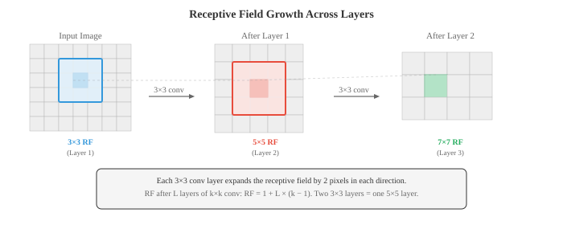
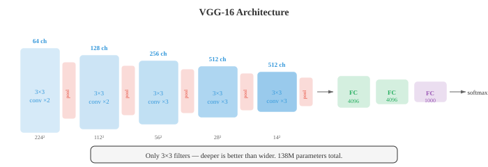
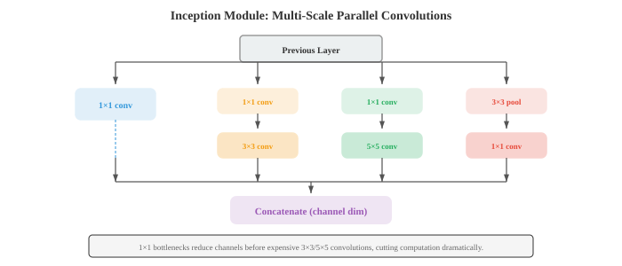
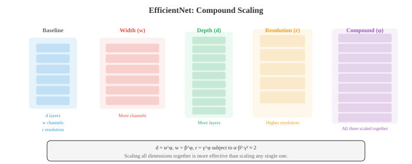

# 卷积网络

*卷积神经网络直接从像素数据中学习空间特征层级，用梯度优化的滤波器取代人工设计的滤波器。本文涵盖卷积机制、池化、步长、空洞卷积、感受野，以及定义了图像分类的标志性架构（LeNet、AlexNet、VGG、ResNet、Inception、EfficientNet）。*

- 在文件 01 中，我们手工设计了用于边缘检测、模糊和角点检测的滤波器。一个自然而然的问题是：我们能否从数据中学习最优的滤波器？这正是卷积神经网络（CNN）所做的。

- CNN 不是手动选择滤波器权重，而是通过梯度下降（第 06 章）学习它们，发现对当前任务直接有用的特征。

- 在第 06 章中，我们介绍了卷积操作、CNN 基础以及滤波器学习的思想。在这里，我们深入探讨使 CNN 在十多年来成为计算机视觉主导范式的架构创新。

- 回顾核心的**卷积操作**：一个大小为 $k \times k$ 的滤波器 $K$ 在输入特征图上滑动，在每个位置计算点积（第 06 章）。输出大小由三个超参数控制：

    - **步长**：滤波器在位置之间移动的像素数。步长 1 意味着滤波器每次移动一个像素。步长 2 意味着每次移动两个像素，空间维度减半。步长卷积是下采样时池化的一种替代方案。
    - **填充**：在输入边界周围添加零。"Same"填充（$p = \lfloor k/2 \rfloor$）保持空间维度不变。"Valid"填充（$p = 0$）会减小空间维度。
    - **空洞卷积**：在滤波器元素之间插入间隙。一个 3x3 的滤波器以空洞率 2 工作，仅用 9 个参数就覆盖了 5x5 的感受野。空洞卷积扩大了感受野而不增加计算量。

- 卷积后的输出空间大小：

$$\text{out} = \left\lfloor \frac{\text{in} - k + 2p}{s} \right\rfloor + 1$$

- 其中 $\text{in}$ 是输入大小，$k$ 是卷积核大小，$p$ 是填充，$s$ 是步长。该公式独立地适用于高度和宽度。

- **感受野**是指能够影响某个神经元值的原始输入区域。
    - 早期层的感受野较小（它们看到的是边缘等局部模式）。
    - 更深层的感受野较大（它们看到的是物体部件等更大的结构）。
    
- 感受野随着每一层增长：大致每层卷积增加 $k - 1$ 个像素（加入步长或空洞卷积时增长更多）。



- **池化**层在保留最重要信息的同时降低空间维度。
    - **最大池化**取每个窗口中的最大值，保留最强的激活（最突出的特征）。
    - **平均池化**取均值，平滑特征图。一个 2x2 的池化窗口配合步长 2 会使两个空间维度都减半。

- **全局平均池化（GAP）** 将每个通道的整个空间范围平均为单个数值，生成一个长度等于通道数的向量。GAP 取代了许多现代架构末尾的全连接层，大幅减少了参数量，并起到了结构正则化的作用。

- **批归一化（BatchNorm）** 将每个小批量内的激活值归一化为零均值和单位方差，然后应用可学习的缩放和平移（第 06 章）。在 CNN 中，批归一化按通道应用：统计量在跨批次和空间维度上为每个通道独立计算。它稳定了训练，允许使用更高的学习率，并起到轻度正则化的作用。

- **丢弃法**（第 06 章）在训练期间随机将神经元置零。

- 在 CNN 中，**空间丢弃法（Dropout2D）** 丢弃整个特征图通道而非单个像素，这更为有效，因为特征图中相邻像素高度相关。

- **数据增广**通过在训练期间对每张图像应用随机变换来人为地扩展训练集：水平翻转、随机裁剪、旋转、颜色抖动（调整亮度、对比度、饱和度、色调）以及 cutout（遮挡随机矩形区域）。网络以多种不同形式看到每张图像，迫使其学习变换不变的特征，而非记忆特定的像素模式。

- 高级增广策略包括 **Mixup**（混合两张图像及其标签：$\tilde{x} = \lambda x_i + (1-\lambda) x_j$，$\tilde{y} = \lambda y_i + (1-\lambda) y_j$）、**CutMix**（将一张图像的矩形区域粘贴到另一张图像上，并按面积比例混合标签）以及 **RandAugment**（从一个固定集合中随机采样一系列增广操作，使用单一的强度参数）。

- CNN 架构的历史是一个逐步走向更深、更高效设计的故事，每一步都解决了限制前代架构的问题。

- **LeNet-5**（LeCun 等人，1998 年）是最早的 CNN，专为手写数字识别设计。两个卷积层后接三个全连接层，使用平均池化和 tanh 激活函数。它证明了学习到的滤波器优于手工设计的特征，但按现代标准来看很小（6 万个参数）。

- **AlexNet**（Krizhevsky 等人，2012 年）以巨大优势赢得了 ImageNet 竞赛，引发了深度学习革命。关键创新：ReLU 激活函数（取代了存在梯度消失问题的 tanh）、用于正则化的丢弃法、数据增广以及在 GPU 上训练。五个卷积层，三个全连接层，6000 万个参数。

- **VGG**（Simonyan 和 Zisserman，2014 年）证明，仅使用 3x3 滤波器并深层堆叠效果优于更大的滤波器。两个堆叠的 3x3 滤波器具有与一个 5x5 滤波器相同的感受野，但参数更少（$2 \times 3^2 = 18$ 对比 $5^2 = 25$）且多了一个非线性层。VGG-16（16 层）和 VGG-19（19 层）至今仍被广泛用作特征提取器。架构非常简单：卷积块通道数递增（64、128、256、512），每个块后接最大池化。



- **GoogLeNet/Inception**（Szegedy 等人，2014 年）引入了 **Inception 模块**：不是选择单一的滤波器大小，而是并行使用 1x1、3x3 和 5x5 卷积，将它们的输出拼接起来，让网络决定哪个尺度最有用。1x1 卷积在较大滤波器之前用作瓶颈以减少计算量。GoogLeNet 以比 VGG 少 12 倍的参数（680 万对比 1.38 亿）实现了更高的准确率。



- Inception 模块同时捕获多个尺度的特征。1x1 滤波器捕获逐点模式，3x3 捕获局部纹理，5x5 捕获更大的结构。拼接将所有视角组合成丰富的表示。

- **ResNet**（He 等人，2016 年）解决了**退化问题**：更深的网络表现反而不如较浅的网络，这不是因为过拟合，而是因为更深的网络更难优化。解决方案是**跳跃连接**（残差连接）：

$$\text{output} = F(x) + x$$

- 该层学习残差 $F(x) = \text{output} - x$。如果最优变换接近恒等映射（这在深层网络中很常见），学习一个接近零的残差比学习完整的映射要容易得多。跳跃连接还提供了直接的梯度通道，减少了梯度消失问题。ResNet 训练了 152 层的网络，远超此前任何架构。


- 当输入和输出维度不同时（由于步长或通道数变化），**投影捷径**会应用一个 1x1 卷积来匹配 $x$ 的维度：$\text{output} = F(x) + W_s x$。

- **瓶颈块**（用于 ResNet-50 及更深版本）使用三个卷积：1x1 降通道，3x3 进行空间处理，1x1 再将通道数恢复。这比两个 3x3 卷积计算量更小，允许构建更深的网络。

- **DenseNet**（Huang 等人，2017 年）将跳跃连接的思想进一步推进：在一个密集块内，每一层都与所有后续层相连。第 $l$ 层接收前面所有层的特征图作为输入：$x_l = H_l([x_0, x_1, \ldots, x_{l-1}])$，其中 $[\cdot]$ 表示沿通道维度的拼接。这促进了特征复用，增强了梯度流动，并减少了总参数量。


- **高效架构**面向移动设备和边缘硬件上的部署，这些场景下计算、内存和能耗都受到限制。

- **MobileNet**（Howard 等人，2017 年）用**深度可分离卷积**取代了标准卷积，将操作分解为两个步骤：
    1. **深度卷积**：每个输入通道应用一个独立的 $k \times k$ 滤波器（不跨通道交互）
    2. **逐点卷积**：应用 1x1 卷积来组合跨通道的信息

- 一个标准 $k \times k$ 卷积，输入通道数为 $C_{\text{in}}$，输出通道数为 $C_{\text{out}}$，每个空间位置需要 $k^2 \cdot C_{\text{in}} \cdot C_{\text{out}}$ 次乘法。深度可分离卷积需要 $k^2 \cdot C_{\text{in}} + C_{\text{in}} \cdot C_{\text{out}}$ 次，减少了大约 $k^2$ 倍。对于 3x3 滤波器，这大约便宜 9 倍。


- **MobileNet-V2** 引入了**逆残差块**：先用 1x1 卷积扩展通道，在扩展空间中应用深度卷积，再用 1x1 卷积投影回低维。跳跃连接放置在窄（瓶颈）层上，与 ResNet 的模式相反。扩展率通常为 6。

- **EfficientNet**（Tan 和 Le，2019 年）引入了**复合缩放**：不是独立地仅缩放深度、或仅缩放宽度、或仅缩放分辨率，而是使用固定比例同时缩放所有三个维度。给定缩放系数 $\phi$：

$$\text{depth}: d = \alpha^\phi, \quad \text{width}: w = \beta^\phi, \quad \text{resolution}: r = \gamma^\phi$$

- 约束条件为 $\alpha \cdot \beta^2 \cdot \gamma^2 \approx 2$（这样 $\phi$ 每增加一个单位，总计算量大约翻倍）。通过网格搜索得到基线比例 $\alpha = 1.2$，$\beta = 1.1$，$\gamma = 1.15$。EfficientNet-B0 到 B7 逐步放大，以远少于之前模型的参数和 FLOPs 达到了最先进的准确率。



- **ShuffleNet** 通过使用**分组卷积**后接**通道混洗**来降低 1x1 卷积（在 MobileNet 风格的架构中占主导）的成本。分组卷积将通道分成多个组，在每个组内独立进行卷积，但这阻止了跨组的信息流动。混洗操作在组之间重新排列通道，以可忽略不计的成本恢复了信息混合。

- **迁移学习**是将在一个任务上训练好的模型适配到不同任务的实践。在计算机视觉中，这几乎总是意味着从一个在 ImageNet（140 万张图像，1000 个类别）上预训练的模型开始，适配到特定领域的数据集（医学图像、卫星图像、制造缺陷检测）。

- **特征提取**：冻结所有卷积层，移除最终的分类头，仅在上面训练一个新的分类头。冻结的层充当通用特征提取器。当目标域与 ImageNet 相似且目标数据集较小时，这种方法效果很好。

- **微调**：解冻部分或全部卷积层，以较小的学习率进行训练。预训练的权重作为起点而非固定特征。微调通常先解冻后面的层（这些层捕获高级的、任务特定的特征），再根据需要解冻更早的层。

- 迁移学习之所以有效，是因为 CNN 的早期层学习通用特征（边缘、纹理、颜色），这些特征对各种任务都有用，而后面层学习任务特定的特征。一个用于分类动物的网络，其边缘检测器对分类建筑物仍然有用。

- **可视化 CNN** 可以揭示网络学到了什么，并帮助调试意外行为。

- **激活图**（特征图）展示了给定输入图像下每个滤波器的输出。早期层的激活图看起来像边缘图；更深层的激活图则越来越抽象，空间上越来越粗糙。

- **Grad-CAM**（梯度加权类别激活映射，Selvaraju 等人，2017 年）高亮了输入图像中对模型预测最重要的区域。其工作原理是：
    1. 计算目标类别分数相对于最后一个卷积层特征图的梯度（使用第 03 章的链式法则）
    2. 对这些梯度进行全局平均池化，得到每个通道的重要性权重
    3. 计算特征图的加权组合并应用 ReLU

$$L_{\text{Grad-CAM}} = \text{ReLU}\!\left(\sum_k \alpha_k A^k\right), \quad \alpha_k = \frac{1}{Z} \sum_i \sum_j \frac{\partial y^c}{\partial A^k_{ij}}$$

- 其中 $A^k$ 是第 $k$ 个特征图，$\alpha_k$ 是通道 $k$ 的重要性权重，$y^c$ 是类别 $c$ 的分数。结果是一个粗糙的热力图，显示哪些区域驱动了分类。应用 ReLU 是因为我们只对具有正影响分类的特征感兴趣。


- **特征反演**通过优化一张随机图像使其匹配目标特征（对像素值进行梯度下降），从特征表示中重建输入图像。这揭示了网络在各层保留了哪些信息。浅层几乎能完美重建图像；深层产生的图像可识别但有所扭曲，这表明精细的空间细节丢失了，而语义内容得以保留。

- **Deep Dream** 和**神经风格迁移**是特征可视化的创意应用。Deep Dream 最大化选定层中神经元的激活，产生超现实的、放大模式的图像。神经风格迁移优化目标图像，使其同时匹配一张图像的内容特征（来自深层）和另一张图像的风格特征（滤波器激活的 Gram 矩阵，捕获纹理统计信息）。

## 编程任务（使用 CoLab 或 notebook）

1. 用 JAX 从头实现一个简单的 CNN，包含两个卷积层、最大池化和一个分类头。在一个合成的二维模式分类任务上训练它。
```python
import jax
import jax.numpy as jnp
import jax.lax as lax
import matplotlib.pyplot as plt

def conv2d(x, kernel, stride=1):
    """简单 2D 卷积，单输入，单滤波器。"""
    return lax.conv(x[None, None], kernel[None, None], (stride, stride), 'SAME')[0, 0]

def max_pool(x, size=2):
    """2x2 最大池化。"""
    H, W = x.shape
    x = x[:H//size*size, :W//size*size]
    return x.reshape(H//size, size, W//size, size).max(axis=(1, 3))

def init_cnn(key):
    k1, k2, k3 = jax.random.split(key, 3)
    return {
        'conv1': jax.random.normal(k1, (5, 5)) * 0.3,
        'conv2': jax.random.normal(k2, (3, 3)) * 0.3,
        'fc_w': jax.random.normal(k3, (64, 1)) * 0.1,
        'fc_b': jnp.zeros(1),
    }

def forward_cnn(params, img):
    # Conv1 -> ReLU -> Pool
    h = jnp.maximum(0, conv2d(img, params['conv1']))
    h = max_pool(h)
    # Conv2 -> ReLU -> Pool
    h = jnp.maximum(0, conv2d(h, params['conv2']))
    h = max_pool(h)
    # Flatten and classify
    flat = h.ravel()
    # Pad or truncate to fixed size
    flat = jnp.pad(flat, (0, max(0, 64 - len(flat))))[:64]
    logit = (flat @ params['fc_w'] + params['fc_b']).squeeze()
    return jax.nn.sigmoid(logit)

# Generate synthetic data: class 0 = low-freq pattern, class 1 = high-freq
def make_data(key, n=200):
    images, labels = [], []
    for i in range(n):
        k1, key = jax.random.split(key)
        x, y = jnp.meshgrid(jnp.linspace(0, 4*jnp.pi, 32), jnp.linspace(0, 4*jnp.pi, 32))
        if i < n // 2:
            img = jnp.sin(x) + jax.random.normal(k1, (32, 32)) * 0.1
            labels.append(0)
        else:
            img = jnp.sin(4 * x) * jnp.sin(4 * y) + jax.random.normal(k1, (32, 32)) * 0.1
            labels.append(1)
        images.append(img)
    return images, jnp.array(labels, dtype=jnp.float32)

key = jax.random.PRNGKey(42)
images, labels = make_data(key)
params = init_cnn(jax.random.PRNGKey(0))

def loss_fn(params, img, label):
    pred = forward_cnn(params, img)
    return -(label * jnp.log(pred + 1e-7) + (1 - label) * jnp.log(1 - pred + 1e-7))

grad_fn = jax.grad(loss_fn)
lr = 0.01

for epoch in range(5):
    total_loss = 0.0
    for img, label in zip(images, labels):
        grads = grad_fn(params, img, label)
        params = {k: params[k] - lr * grads[k] for k in params}
        total_loss += loss_fn(params, img, label)
    print(f"Epoch {epoch}: loss = {total_loss / len(images):.4f}")

# Test accuracy
preds = jnp.array([forward_cnn(params, img) > 0.5 for img in images])
acc = jnp.mean(preds == labels)
print(f"Accuracy: {acc:.2%}")
```

2. 可视化不同滤波器大小如何影响感受野。展示两个堆叠的 3x3 滤波器与一个 5x5 滤波器覆盖相同的感受野，但参数更少。
```python
import jax.numpy as jnp
import matplotlib.pyplot as plt

def compute_receptive_field(layers):
    """从一组 (kernel_size, stride) 元组计算感受野大小。"""
    rf = 1  # 从 1 个像素开始
    stride_product = 1
    for k, s in layers:
        rf += (k - 1) * stride_product
        stride_product *= s
    return rf

# Compare architectures
configs = {
    'Single 5x5': [(5, 1)],
    'Two 3x3':    [(3, 1), (3, 1)],
    'Three 3x3':  [(3, 1), (3, 1), (3, 1)],
    'Single 7x7': [(7, 1)],
    '3x3 stride 2 + 3x3': [(3, 2), (3, 1)],
}

print(f"{'Config':<25} {'RF':>4} {'Params (per channel)':>20}")
print('-' * 55)
for name, layers in configs.items():
    rf = compute_receptive_field(layers)
    # Parameters: sum of k^2 for each layer (per input-output channel pair)
    params = sum(k * k for k, s in layers)
    print(f"{name:<25} {rf:>4} {params:>20}")

# Visualise receptive fields
fig, axes = plt.subplots(1, 3, figsize=(14, 4))
for ax, (name, rf_size) in zip(axes, [('5x5 filter', 5), ('Two 3x3 filters', 5), ('Three 3x3 filters', 7)]):
    grid = jnp.zeros((9, 9))
    c = 4  # centre
    half = rf_size // 2
    grid = grid.at[c-half:c+half+1, c-half:c+half+1].set(1.0)
    ax.imshow(grid, cmap='Blues', vmin=0, vmax=1)
    ax.set_title(f'{name}\nRF = {rf_size}x{rf_size}')
    ax.set_xticks(range(9)); ax.set_yticks(range(9))
    ax.grid(True, alpha=0.3)
plt.suptitle('Receptive Field Comparison')
plt.tight_layout(); plt.show()
```

3. 从头实现 Grad-CAM。给定一个预构建的简单 CNN，计算针对特定类别的梯度加权激活图，并将其可视化为热力图。
```python
import jax
import jax.numpy as jnp
import matplotlib.pyplot as plt

def simple_cnn(params, img):
    """返回预测和最后一个卷积层激活的简单 CNN。"""
    # Conv layer (our "last conv layer" for Grad-CAM)
    H, W = img.shape
    k = params['conv'].shape[0]
    pad = k // 2
    img_pad = jnp.pad(img, pad, mode='edge')
    activation_map = jnp.zeros((H, W))
    for i in range(H):
        for j in range(W):
            activation_map = activation_map.at[i, j].set(
                jnp.sum(img_pad[i:i+k, j:j+k] * params['conv'])
            )
    activation_map = jnp.maximum(0, activation_map)  # ReLU

    # Global average pool -> dense -> output
    pooled = activation_map.mean()
    logit = pooled * params['w'] + params['b']
    return jax.nn.sigmoid(logit), activation_map

# Create test image: bright region on the left (class indicator)
img = jnp.zeros((32, 32))
img = img.at[8:24, 4:16].set(1.0)
img = img.at[5:10, 20:28].set(0.3)

key = jax.random.PRNGKey(42)
params = {
    'conv': jax.random.normal(key, (5, 5)) * 0.3,
    'w': jnp.array(2.0),
    'b': jnp.array(-0.5),
}

# Compute Grad-CAM
def class_score(params, img):
    pred, _ = simple_cnn(params, img)
    return pred

# Get activation map and gradients
pred, act_map = simple_cnn(params, img)
grad_fn = jax.grad(lambda img: simple_cnn(params, img)[0])
img_grad = grad_fn(img)

# Weight = global average of gradients (simplified 1-channel Grad-CAM)
alpha = img_grad.mean()
grad_cam = jnp.maximum(0, alpha * act_map)  # ReLU
grad_cam = (grad_cam - grad_cam.min()) / (grad_cam.max() - grad_cam.min() + 1e-8)

fig, axes = plt.subplots(1, 3, figsize=(14, 4))
axes[0].imshow(img, cmap='gray'); axes[0].set_title('Input Image'); axes[0].axis('off')
axes[1].imshow(act_map, cmap='viridis'); axes[1].set_title('Activation Map'); axes[1].axis('off')
axes[2].imshow(img, cmap='gray', alpha=0.6)
axes[2].imshow(grad_cam, cmap='jet', alpha=0.4)
axes[2].set_title(f'Grad-CAM (pred={pred:.2f})'); axes[2].axis('off')
plt.tight_layout(); plt.show()
```

4. 比较深度可分离卷积与标准卷积。统计两者的参数和 FLOPs，并展示它们在计算量少得多的情况下产生相似的输出。
```python
import jax
import jax.numpy as jnp

def standard_conv(x, kernel):
    """标准卷积：(H, W, C_in) * (k, k, C_in, C_out) -> (H, W, C_out)。"""
    H, W, C_in = x.shape
    k, _, _, C_out = kernel.shape
    pad = k // 2
    x_pad = jnp.pad(x, ((pad, pad), (pad, pad), (0, 0)), mode='constant')
    out = jnp.zeros((H, W, C_out))
    for i in range(H):
        for j in range(W):
            patch = x_pad[i:i+k, j:j+k, :]  # (k, k, C_in)
            for c in range(C_out):
                out = out.at[i, j, c].set(jnp.sum(patch * kernel[:, :, :, c]))
    return out

def depthwise_separable_conv(x, dw_kernel, pw_kernel):
    """深度可分离：深度卷积 (k,k,C_in) 然后逐点卷积 (C_in, C_out)。"""
    H, W, C_in = x.shape
    k = dw_kernel.shape[0]
    pad = k // 2
    x_pad = jnp.pad(x, ((pad, pad), (pad, pad), (0, 0)), mode='constant')

    # Depthwise: one filter per channel
    dw_out = jnp.zeros((H, W, C_in))
    for i in range(H):
        for j in range(W):
            for c in range(C_in):
                patch = x_pad[i:i+k, j:j+k, c]
                dw_out = dw_out.at[i, j, c].set(jnp.sum(patch * dw_kernel[:, :, c]))

    # Pointwise: 1x1 conv across channels
    out = dw_out @ pw_kernel
    return out

# Setup
H, W, C_in, C_out, k = 8, 8, 16, 32, 3
key = jax.random.PRNGKey(42)
k1, k2, k3, k4 = jax.random.split(key, 4)

x = jax.random.normal(k1, (H, W, C_in))
std_kernel = jax.random.normal(k2, (k, k, C_in, C_out)) * 0.1
dw_kernel = jax.random.normal(k3, (k, k, C_in)) * 0.1
pw_kernel = jax.random.normal(k4, (C_in, C_out)) * 0.1

# Compare
std_params = k * k * C_in * C_out
dw_params = k * k * C_in + C_in * C_out

std_flops = H * W * k * k * C_in * C_out
dw_flops = H * W * (k * k * C_in + C_in * C_out)

print(f"Standard conv:            {std_params:>8,} params,  {std_flops:>10,} FLOPs")
print(f"Depthwise separable conv: {dw_params:>8,} params,  {dw_flops:>10,} FLOPs")
print(f"Parameter reduction:      {std_params / dw_params:.1f}x")
print(f"FLOP reduction:           {std_flops / dw_flops:.1f}x")

std_out = standard_conv(x, std_kernel)
ds_out = depthwise_separable_conv(x, dw_kernel, pw_kernel)
print(f"\nStandard output shape:    {std_out.shape}")
print(f"Depthwise sep output shape: {ds_out.shape}")
```
