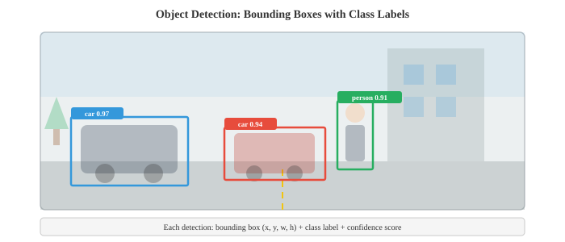
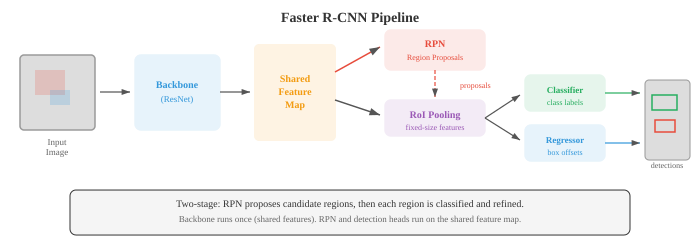

# 目标检测与分割

*目标检测定位并分类图像中的每个物体；分割为每个像素分配一个标签。本文件涵盖交并比（IoU）、平均精度均值（mAP）、锚框、R-CNN系列、YOLO、SSD、特征金字塔网络（FPN）、语义/实例/全景分割（U-Net、Mask R-CNN、SAM）以及用于基准测试的评估指标。*

- 图像分类（文件02）回答了"这张图像里有什么？"目标检测提出了一个更难的问题："这张图像里有哪些物体，它们在哪里？"

- 分割则更进一步："哪些像素属于哪个物体或类别？"这些任务形成了一个空间理解精度逐步提高的层次结构。

- **目标检测**模型输出一组**边界框**，每个边界框由四个坐标（左上角 $x, y$、宽度、高度）以及一个带有置信度分数的类别标签定义。一张图像可能包含零个、一个或数百个来自多个类别的物体。



- **交并比（IoU）**衡量预测边界框与真实标注的匹配程度。它是重叠面积除以并集面积：

$$\text{IoU} = \frac{\text{交集面积}}{\text{并集面积}}$$

- IoU为1表示完全重叠，IoU为0表示完全不重叠。"正确"检测的标准阈值为IoU $\geq 0.5$，但也使用更严格的阈值（0.75、0.9）。

- 如果预测框与真实框的IoU超过阈值且类别正确，则检测结果为**真正例（TP）**。

- **假正例（FP）**是未匹配到任何真实标注的预测框。

- **假负例（FN）**是没有任何预测框匹配到的真实物体。这些与第06章中的精确率和召回率概念相同。

- **平均精度（AP）**总结单个类别的检测质量。对于每个类别，按置信度分数对所有检测结果排序，计算每个排序位置的精确率和召回率，然后计算精确率-召回率曲线下的面积：

$$\text{AP} = \int_0^1 p(r) \, dr$$

- 在实践中，曲线是插值处理的：在每个召回率水平上，精确率被设置为所有召回率 $\geq r$ 处的最大精确率。这使曲线平滑并使其单调递减。

- **平均精度均值（mAP）**对所有类别的AP进行平均。"mAP@0.5"使用IoU阈值0.5。"mAP@[.5:.95]"（COCO标准）在从0.5到0.95的十个IoU阈值上（步长0.05）对mAP进行平均，同时奖励检测能力和精确的定位能力。

- **非极大值抑制（NMS）**移除重复的检测结果。当模型为同一个物体预测出多个重叠的边界框时，NMS保留置信度最高的框，并移除所有与其重叠超过IoU阈值的其他框。这是在模型生成原始预测之后，按每个类别分别进行的。

- **两阶段检测器**首先提出候选区域，然后对每个提案进行分类和精细化调整。

- **R-CNN**（Girshick 等人，2014年）是第一个成功的深度学习检测器。它使用选择性搜索（一种经典算法）提出约2,000个候选区域，将每个区域变形为固定尺寸，独立通过CNN运行，并使用SVM（第06章）进行分类。R-CNN准确但极其缓慢：每张图像需要运行CNN 2,000次。

- **Fast R-CNN**（Girshick，2015年）解决了冗余问题：它在整张图像上运行一次CNN以生成共享特征图，然后使用**RoI池化**（感兴趣区域池化）从该共享特征图中为每个提案提取特征。

- RoI池化从特征图中取出一个可变大小的区域，通过将该区域划分为一个网格并在每个单元格内进行最大池化，生成固定大小的输出。这种方法快得多，因为昂贵的CNN计算只进行一次。

- **Faster R-CNN**（Ren 等人，2015年）引入了**区域提议网络（RPN）**，从而消除了外部区域提议算法。RPN是一个小型CNN，运行在共享特征图之上，直接预测提案。RPN在特征图上滑动一个小窗口，在每个位置上预测 $k$ 个提案（每个**锚框**对应一个提案）。



- **锚框**是特征图上每个空间位置处预定义的边界框，覆盖不同的尺度和长宽比（例如，三个尺度 $\times$ 三个比例 = 每个位置9个锚框）。RPN为每个锚框预测两样东西：物体性分数（物体vs背景）以及用于将锚框精炼为更紧凑提案的坐标偏移量。这种参数化使回归问题更容易：网络不需要预测绝对坐标，只需预测对合理初始框的小幅调整。

- 锚框偏移量的参数化公式为：

$$t_x = \frac{x - x_a}{w_a}, \quad t_y = \frac{y - y_a}{h_a}, \quad t_w = \log\frac{w}{w_a}, \quad t_h = \log\frac{h}{h_a}$$

- 其中 $(x, y, w, h)$ 是预测框的中心和尺寸，$(x_a, y_a, w_a, h_a)$ 是锚框。宽度和高度的对数变换确保预测框始终为正数，并使回归具有尺度不变性。

- Faster R-CNN使用多任务损失进行训练：类别标签的分类损失（第05章的交叉熵），以及用于边界框回归的**平滑L1损失**。平滑L1对异常值不如L2敏感：

```math
\text{smooth}_{L1}(x) = \begin{cases} 0.5x^2 & \text{if } |x| < 1 \\ |x| - 0.5 & \text{otherwise} \end{cases}
```

- **特征金字塔网络（FPN）**（Lin 等人，2017年）通过构建一个带有侧边连接的自顶向下路径来解决多尺度问题，该路径将高层语义信息与低层空间细节融合。骨干网络生成多个尺度的特征图（每个池化层将分辨率减半）。FPN添加了一个自顶向下的路径，其中每个层级接收来自上一层级的上采样特征，并通过侧边1x1卷积与对应的自底向上层级合并。结果是一个特征图金字塔，每个层级的特征图既具有强语义信息又具有良好的空间分辨率。

- 小物体从金字塔的高分辨率层级检测；大物体从低分辨率层级检测。FPN现在已成为大多数现代检测架构的标准组件。

- **单阶段检测器**完全跳过了提案步骤，在一次前向传播中直接预测类别标签和边界框。这种方法更快，但在历史上准确率低于两阶段检测器，直到焦点损失（focal loss）缩小了这一差距。

- **YOLO**（You Only Look Once，Redmon 等人，2016年）将图像划分为一个 $S \times S$ 的网格。每个网格单元预测 $B$ 个边界框和 $C$ 个类别概率。如果一个物体的中心落在一个网格单元内，该单元负责检测该物体。YOLO极其快速，因为整个检测过程只有一次前向传播，没有提案阶段。

- **YOLOv2**添加了锚框、批归一化和多尺度训练。**YOLOv3**使用了特征金字塔网络并在三个尺度上进行预测。**YOLOv4-v8**继续改进，采用了更好的骨干网络、路径聚合网络和马赛克数据增强（在训练中将四张图像拼接在一起以增加上下文多样性）。

- **SSD**（Single Shot MultiBox Detector，Liu 等人，2016年）在骨干网络内的多个特征图尺度上进行预测，在每个尺度上使用锚框。早期（高分辨率）特征图检测小物体；后期（低分辨率）特征图检测大物体。SSD比Faster R-CNN更快，且具有竞争力的准确率。

- **RetinaNet**（Lin 等人，2017年）指出了单阶段检测器的核心问题：类别不平衡。绝大多数锚框对应的是背景，这产生了大量容易的负样本，它们主导了损失函数并压倒了来自稀有正样本的梯度。

- **焦点损失（Focal Loss）**通过降低容易样本的权重来解决这个问题：

$$\text{FL}(p_t) = -\alpha_t (1 - p_t)^\gamma \log(p_t)$$

- 其中 $p_t$ 是正确类别的预测概率。当模型自信且正确时（$p_t$ 很高），$(1 - p_t)^\gamma$ 很小，从而减少了容易负样本对损失的贡献。超参数 $\gamma$ （通常为2）控制降权的强度。当 $\gamma = 0$ 时，焦点损失退化为标准交叉熵。凭借焦点损失，RetinaNet以单阶段的速度实现了与两阶段检测器相当的准确率。

- **无锚框检测**完全消除了锚框，减少了超参数调优并简化了流程。

- **FCOS**（全卷积单阶段检测器，Tian 等人，2019年）在特征图的每个空间位置预测从该位置到最近边界框四条边（左、上、右、下）的距离以及一个类别标签。**中心性（centerness）**分数降低了远离物体中心的预测的权重，从而提高了质量。FCOS使用FPN来处理多尺度问题。

- **CenterNet**（Zhou 等人，2019年）将物体检测为点：它预测一个热力图，其中的峰值对应物体中心，然后在每个峰值处回归宽度和高度。检测变成了关键点估计。这种方法优雅且无需锚框，但需要仔细的热力图后处理。

- **CornerNet**将物体检测为一对角点（左上角和右下角）。它预测两个热力图（每个角类型一个），并使用**关联嵌入（associative embedding）**将对应的角点匹配成边界框。这避免了对锚框的需求，并处理了任意形状的物体。

- **语义分割**为图像中的每个像素分配一个类别标签。与检测（输出边界框）不同，分割生成密集的像素级映射。一条街景可能会将每个像素标记为道路、人行道、汽车、行人、建筑、天空等。


- **全卷积网络（FCN）**（Long 等人，2015年）通过将全连接层替换为卷积层，使分类CNN适用于分割任务，从而使网络能够输出空间映射而非单个类别。上采样（通过转置卷积或双线性插值）将输出恢复到输入分辨率。来自早期层的跳跃连接添加了在下采样过程中丢失的空间细节。

- **转置卷积**（有时称为"反卷积"）是卷积的上采样对应操作。步幅卷积减少空间维度，而转置卷积增加空间维度。它在输入元素之间插入零，然后应用标准卷积，从而有效地学习如何上采样。

- **U-Net**（Ronneberger 等人，2015年）引入了一种对称的编码器-解码器架构，在每一层都有跳跃连接。编码器（收缩路径）在增加通道数的同时降低空间分辨率，与分类CNN完全相同。解码器（扩展路径）将结果上采样回全分辨率。跳跃连接在每一层将编码器特征图与解码器特征图拼接起来，为解码器提供精细的空间细节。这种高层语义与低层细节的结合产生了清晰、准确的分割边界。


- U-Net最初是为生物医学图像分割设计的（其中训练数据稀缺），其架构已成为许多后续模型的基础，包括潜在扩散模型中的U-Net（文件04）。

- **DeepLab**（Chen 等人，2014-2018年）为分割引入了两个关键创新：

    - **空洞（扩张）卷积**：在滤波器元素之间插入间隙的标准卷积，由扩张率 $r$ 控制。一个扩张率为 $r$ 的3x3滤波器的感受野为 $(2r + 1) \times (2r + 1)$，而仅使用9个参数。这在不进行下采样的情况下捕获多尺度上下文，同时保持空间分辨率。

    - **空洞空间金字塔池化（ASPP）**：并行应用多个具有不同扩张率的空洞卷积（例如，扩张率1、6、12、18），拼接结果，并通过1x1卷积融合。ASPP同时捕获多个尺度的上下文，其精神类似于Inception模块（文件02），但使用扩张而非不同大小的卷积核。

- DeepLab还使用**条件随机场（CRF）**（第05章）作为后处理步骤，通过鼓励空间上相邻且颜色相似的像素共享相同的标签来优化分割边界。

- **实例分割**结合了检测和分割：它识别每个单独的物体实例，并为每个实例生成像素级掩码。场景中的两辆车会得到两个独立的掩码，而不仅仅是"车"。

- **Mask R-CNN**（He 等人，2017年）通过添加一个小型分割头来扩展Faster R-CNN，该分割头为每个检测到的物体预测一个二值掩码。其架构为Faster R-CNN加上一个掩码分支：掩码分支接收RoI池化后的特征，并为每个类别输出一个 $m \times m$ 的二值掩码。它使用**RoIAlign**代替RoI池化：在精确定位的采样点处进行双线性插值，而非在量化的网格单元格内进行，这避免了量化引起的空间错位。这一小改动显著提高了掩码质量。

- Mask R-CNN使用多任务损失进行训练：分类损失 + 边界框回归损失 + 掩码损失（逐像素二值交叉熵）。掩码分支独立地为每个类别预测一个掩码；仅使用与预测类别对应的掩码，这使掩码预测与分类解耦，并同时改进了两者。

- **全景分割**将语义分割和实例分割统一为单个任务。每个像素同时获得一个类别标签（语义）和一个实例ID（用于"物体"类别，如汽车和人）。"背景"类别（天空、道路、草地）只获得语义标签，因为它们是无形区域，没有可计数的实例。

- 全景质量（PQ）指标通过分解为分割质量（匹配片段的平均IoU）和识别质量（匹配片段的F1分数）来评估：

$$\text{PQ} = \underbrace{\frac{\sum_{(p,g) \in \text{TP}} \text{IoU}(p,g)}{|\text{TP}|}}_{\text{SQ}} \times \underbrace{\frac{|\text{TP}|}{|\text{TP}| + \frac{1}{2}|\text{FP}| + \frac{1}{2}|\text{FN}|}}_{\text{RQ}}$$

- **实时分割**对于自动驾驶和增强现实等应用至关重要，这些应用对延迟预算要求严格（通常每帧不超过30毫秒）。

- **BiSeNet**（双边分割网络，Yu 等人，2018年）使用两条并行路径：一条**空间路径**，具有宽而浅的层以保留空间细节；一条**上下文路径**，具有深而窄的层以捕获语义信息。输出被融合，兼顾速度和准确率。

- **DDRNet**（深度双分辨率网络，Hong 等人，2021年）在整个网络中以不同分辨率维持两个分支，并在它们之间反复交换信息。高分辨率分支保留空间细节，而低分辨率分支捕获全局上下文。多个双边融合模块在两个方向上合并信息。

- 实时分割的总体趋势是避免沉重的编码器-解码器模式，而是通过网络全程维持足够的空间分辨率，以一定的准确率为代价换取显著更低的延迟。

## 编程练习（使用CoLab或notebook）

1. 从头实现IoU计算和非极大值抑制。对一组重叠的边界框应用NMS并可视化结果。
```python
import jax.numpy as jnp
import matplotlib.pyplot as plt
import matplotlib.patches as patches

def compute_iou(box1, box2):
    """计算两个框[x1, y1, x2, y2]之间的IoU。"""
    x1 = jnp.maximum(box1[0], box2[0])
    y1 = jnp.maximum(box1[1], box2[1])
    x2 = jnp.minimum(box1[2], box2[2])
    y2 = jnp.minimum(box1[3], box2[3])

    intersection = jnp.maximum(0, x2 - x1) * jnp.maximum(0, y2 - y1)
    area1 = (box1[2] - box1[0]) * (box1[3] - box1[1])
    area2 = (box2[2] - box2[0]) * (box2[3] - box2[1])
    union = area1 + area2 - intersection

    return intersection / (union + 1e-6)

def nms(boxes, scores, iou_threshold=0.5):
    """非极大值抑制。"""
    order = jnp.argsort(-scores)  # 按置信度降序排列
    keep = []

    remaining = list(range(len(scores)))
    order_list = order.tolist()

    while order_list:
        idx = order_list[0]
        keep.append(idx)
        order_list = order_list[1:]

        new_order = []
        for j in order_list:
            iou = compute_iou(boxes[idx], boxes[j])
            if iou < iou_threshold:
                new_order.append(j)
        order_list = new_order

    return keep

# 示例：同一物体的重叠检测
boxes = jnp.array([
    [50, 60, 150, 160],   # 高置信度
    [55, 65, 155, 165],   # 重叠的重复框
    [52, 58, 148, 158],   # 重叠的重复框
    [200, 100, 300, 200], # 不同物体
    [205, 105, 305, 205], # 重叠的重复框
])
scores = jnp.array([0.95, 0.80, 0.70, 0.90, 0.60])

keep = nms(boxes, scores, iou_threshold=0.5)

fig, axes = plt.subplots(1, 2, figsize=(14, 5))
colors = ['#3498db', '#e74c3c', '#27ae60', '#9b59b6', '#f39c12']

for ax, title, indices in zip(axes, ['NMS之前', 'NMS之后'],
                               [range(len(boxes)), keep]):
    ax.set_xlim(0, 400); ax.set_ylim(0, 300)
    ax.set_aspect('equal'); ax.invert_yaxis()
    ax.set_title(title)
    for i in indices:
        b = boxes[i]
        rect = patches.Rectangle((b[0], b[1]), b[2]-b[0], b[3]-b[1],
                                  linewidth=2, edgecolor=colors[i],
                                  facecolor='none')
        ax.add_patch(rect)
        ax.text(b[0], b[1]-5, f'{scores[i]:.2f}', color=colors[i], fontsize=10)

plt.tight_layout(); plt.show()
print(f"NMS后保留了{len(keep)}个框，共{len(boxes)}个")
```

2. 实现一个简化的区域提议网络（RPN）。给定一个特征图，生成具有多种尺度和长宽比的锚框，并预测物体性分数和边界框偏移量。
```python
import jax
import jax.numpy as jnp
import matplotlib.pyplot as plt
import matplotlib.patches as patches

def generate_anchors(feature_h, feature_w, stride, scales, ratios):
    """为特征图上的每个位置生成锚框。"""
    anchors = []
    for y in range(feature_h):
        for x in range(feature_w):
            cx = (x + 0.5) * stride
            cy = (y + 0.5) * stride
            for s in scales:
                for r in ratios:
                    w = s * jnp.sqrt(r)
                    h = s / jnp.sqrt(r)
                    anchors.append([cx - w/2, cy - h/2, cx + w/2, cy + h/2])
    return jnp.array(anchors)

def rpn_forward(feature_map, params):
    """简化版RPN：预测每个锚框的物体性和框偏移量。"""
    H, W, C = feature_map.shape
    n_anchors = params['cls_w'].shape[1]

    # 在特征图上滑动1x1卷积（简化版）
    cls_scores = feature_map.reshape(-1, C) @ params['cls_w']  # (H*W, n_anchors)
    box_offsets = feature_map.reshape(-1, C) @ params['reg_w']  # (H*W, n_anchors*4)

    cls_scores = jax.nn.sigmoid(cls_scores)
    return cls_scores.ravel(), box_offsets.reshape(-1, 4)

# 设置
feature_h, feature_w, channels = 4, 4, 16
stride = 16  # 每个特征图单元格覆盖16x16像素
scales = [32, 64, 128]
ratios = [0.5, 1.0, 2.0]
n_anchors_per_pos = len(scales) * len(ratios)

key = jax.random.PRNGKey(42)
k1, k2, k3 = jax.random.split(key, 3)

feature_map = jax.random.normal(k1, (feature_h, feature_w, channels))
params = {
    'cls_w': jax.random.normal(k2, (channels, n_anchors_per_pos)) * 0.01,
    'reg_w': jax.random.normal(k3, (channels, n_anchors_per_pos * 4)) * 0.01,
}

anchors = generate_anchors(feature_h, feature_w, stride, scales, ratios)
scores, offsets = rpn_forward(feature_map, params)

print(f"特征图：{feature_h}x{feature_w}，步幅={stride}")
print(f"每个位置的锚框数：{n_anchors_per_pos}")
print(f"锚框总数：{len(anchors)}")
print(f"物体性分数形状：{scores.shape}")
print(f"边界框偏移量形状：{offsets.shape}")

# 可视化一个位置的锚框
fig, ax = plt.subplots(figsize=(6, 6))
img_size = feature_h * stride
ax.set_xlim(0, img_size); ax.set_ylim(0, img_size)
ax.invert_yaxis(); ax.set_aspect('equal')

pos_idx = feature_h // 2 * feature_w + feature_w // 2  # 中心位置
colors = ['#3498db', '#e74c3c', '#27ae60']
for i, s in enumerate(scales):
    for j, r in enumerate(ratios):
        idx = pos_idx * n_anchors_per_pos + i * len(ratios) + j
        a = anchors[idx]
        rect = patches.Rectangle((a[0], a[1]), a[2]-a[0], a[3]-a[1],
                                  linewidth=1.5, edgecolor=colors[i],
                                  facecolor='none', linestyle=['--', '-', ':'][j])
        ax.add_patch(rect)

ax.scatter([img_size/2], [img_size/2], c='red', s=50, zorder=5)
ax.set_title(f'中心位置的锚框\n3个尺度 × 3个比例 = {n_anchors_per_pos}')
ax.grid(True, alpha=0.3)
plt.tight_layout(); plt.show()
```

3. 实现一个简化版的一维U-Net编码器-解码器，带有跳跃连接，用于一维分割（一维信号的二值标注）。
```python
import jax
import jax.numpy as jnp
import matplotlib.pyplot as plt

def conv1d_same(x, kernel):
    """具有相同填充的一维卷积。"""
    k = len(kernel)
    pad = k // 2
    x_pad = jnp.pad(x, pad, mode='edge')
    n = len(x)
    out = jnp.zeros(n)
    for i in range(n):
        out = out.at[i].set(jnp.sum(x_pad[i:i+k] * kernel))
    return out

def downsample(x):
    return x[::2]

def upsample(x, target_len):
    return jnp.interp(jnp.linspace(0, 1, target_len), jnp.linspace(0, 1, len(x)), x)

def unet_1d(x, params):
    """简化版一维U-Net，包含2个编码器/解码器层级。"""
    # 编码器
    e1 = jnp.maximum(0, conv1d_same(x, params['enc1']))
    e1_down = downsample(e1)

    e2 = jnp.maximum(0, conv1d_same(e1_down, params['enc2']))
    e2_down = downsample(e2)

    # 瓶颈层
    bottleneck = jnp.maximum(0, conv1d_same(e2_down, params['bottleneck']))

    # 带跳跃连接的解码器
    d2_up = upsample(bottleneck, len(e2))
    d2 = jnp.maximum(0, conv1d_same(d2_up + e2, params['dec2']))  # 跳跃连接

    d1_up = upsample(d2, len(e1))
    d1 = conv1d_same(d1_up + e1, params['dec1'])  # 跳跃连接

    return jax.nn.sigmoid(d1)

# 创建带有标注区域的信号
n = 128
t = jnp.linspace(0, 4 * jnp.pi, n)
signal = jnp.sin(t) + 0.5 * jnp.sin(3 * t)
labels = (signal > 0.5).astype(jnp.float32)  # 二值分割目标

key = jax.random.PRNGKey(42)
keys = jax.random.split(key, 5)
params = {
    'enc1': jax.random.normal(keys[0], (5,)) * 0.3,
    'enc2': jax.random.normal(keys[1], (5,)) * 0.3,
    'bottleneck': jax.random.normal(keys[2], (3,)) * 0.3,
    'dec2': jax.random.normal(keys[3], (5,)) * 0.3,
    'dec1': jax.random.normal(keys[4], (5,)) * 0.3,
}

def loss_fn(params, signal, labels):
    pred = unet_1d(signal, params)
    return -jnp.mean(labels * jnp.log(pred + 1e-7) + (1 - labels) * jnp.log(1 - pred + 1e-7))

grad_fn = jax.jit(jax.grad(loss_fn))
lr = 0.05

for step in range(500):
    grads = grad_fn(params, signal, labels)
    params = {k: params[k] - lr * grads[k] for k in params}

pred = unet_1d(signal, params)

fig, axes = plt.subplots(3, 1, figsize=(12, 7), sharex=True)
axes[0].plot(t, signal, color='#3498db', linewidth=1.5)
axes[0].set_title('输入信号'); axes[0].set_ylabel('值')

axes[1].fill_between(t, 0, labels, alpha=0.3, color='#27ae60')
axes[1].set_title('真实标注'); axes[1].set_ylabel('标签')

axes[2].plot(t, pred, color='#e74c3c', linewidth=1.5)
axes[2].fill_between(t, 0, (pred > 0.5).astype(float), alpha=0.2, color='#e74c3c')
axes[2].set_title('U-Net预测'); axes[2].set_ylabel('概率')
axes[2].set_xlabel('t')

plt.tight_layout(); plt.show()
print(f"最终损失：{loss_fn(params, signal, labels):.4f}")
print(f"像素准确率：{jnp.mean((pred > 0.5) == labels):.2%}")
```
