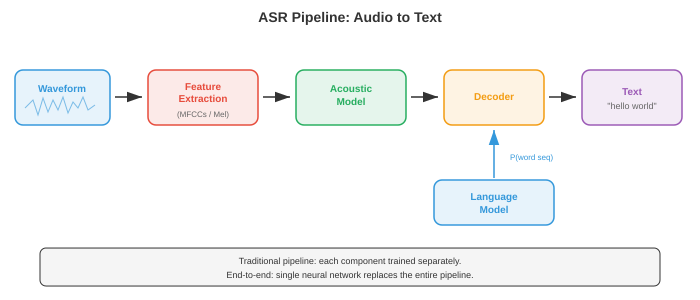

# 自动语音识别

*自动语音识别将口语音频转换为书面文本，弥合人类语音与机器可读语言之间的鸿沟。本文涵盖 GMM-HMM、CTC 损失、RNN-转导器、基于注意力的编码器-解码器模型（LAS）、Whisper 以及端到端 ASR，从经典流水线到现代神经架构。*

- **自动语音识别**（ASR）是将口语音频转换为书面文本的任务。它是 AI 领域最古老的问题之一（20 世纪 50 年代的第一批系统就能识别单个数字），也是商业部署最广泛的任务之一（语音助手、转录服务、字幕生成）。

- 难点在于语音的巨大变异性：不同的说话人、口音、语速、背景噪声、麦克风特性，以及将连续声学信号映射到离散单词这一根本性歧义问题。

- 可以把 ASR 想象成法庭速记员。速记员听到连续的声音流，在心理上将其分割成单词，利用上下文解决歧义（如"they're" vs "their" vs "there"），然后打出结果。ASR 系统做同样的事情，但分阶段进行，每个阶段可以独立或联合优化。

- **经典 ASR 流水线**通过一系列不同阶段处理音频：原始音频被转换为特征（MFCC 或对数梅尔频谱图，见文件 01），**声学模型**评估每个特征帧与每个语音单元的匹配程度，**发音模型**（词典）将语音单元映射为单词，**语言模型**评估词序列的合理程度，**解码器**搜索使联合得分最大化的词序列。每个组件分别训练和调优。



- **音素**是语言中区分单词的最小声音单位。英语大约有 39-44 个音素（具体数量取决于方言和所用音素库）。例如，"bat"和"pat"相差一个音素（/b/ vs /p/）。大多数 ASR 系统建模的是**上下文相关音素**，称为**三音素**：由其左邻和右邻共同定义的音素（例如，"b_t"上下文中的"a"与"c_t"上下文中的"a"是不同的单元），因为音素的声学实现受其邻接音素的强烈影响（这称为**协同发音**）。

- 可能的三音素数量巨大（40 个音素的三次方 = 64,000），因此**决策树聚类**将声学上相似的三音素分组为**声学状态**（通常为 2000-10,000 个类别）。每个声学状态拥有自己的声学模型。这种聚类是第 06 章中决策树算法的一种应用形式。

- **GMM-HMM**（高斯混合模型-隐马尔可夫模型）是从 20 世纪 80 年代到 21 世纪初主导的声学建模方法。HMM（见第 05 章）对语音的时间结构进行建模：每个音素是一个从左到右的 HMM，有 3-5 个状态，每个状态代表一个子音素段（起始、中间、结束）。状态间的转移隐式地建模时长。

- 在每个 HMM 状态，发射概率（给定状态下特定特征向量的可能性）由**高斯混合模型**（GMM）建模：多元高斯分布的加权和（见第 05 章）：

```math
p(\mathbf{x} | s) = \sum_{m=1}^{M} w_m \cdot \mathcal{N}(\mathbf{x} ; \boldsymbol{\mu}_m, \boldsymbol{\Sigma}_m)
```

- 其中 $\mathbf{x}$ 是特征向量（例如 39 维 MFCC），$s$ 是 HMM 状态，$M$ 是混合分量数（通常为 8-64），$w_m$ 是混合权重，$\boldsymbol{\mu}_m$ 和 $\boldsymbol{\Sigma}_m$ 是每个高斯分量的均值和协方差。协方差矩阵通常使用对角形式以提高计算效率（假设特征维度独立，对于 MFCC 而言由于 DCT 去相关性，这一假设近似成立）。

- 训练使用 **Baum-Welch 算法**（EM 算法的特例，见第 05 章）从有标注的语音数据中迭代估计 GMM 参数和 HMM 转移概率。解码（寻找最可能的状态序列）使用 **Viterbi 算法**（动态规划，见第 05 章）：

```math
\delta_t(j) = \max_{i} \left[ \delta_{t-1}(i) \cdot a_{ij} \right] \cdot b_j(\mathbf{x}_t)
```

- 其中 $\delta_t(j)$ 是在时间 $t$ 以状态 $j$ 结束的最佳路径的概率，$a_{ij}$ 是从状态 $i$ 到状态 $j$ 的转移概率，$b_j(\mathbf{x}_t)$ 是在状态 $j$ 下特征 $\mathbf{x}_t$ 的发射概率。

- **DNN-HMM**（Hinton 等人，2012）用深度神经网络（DNN，见第 06 章）取代了 GMM 发射模型，从特征帧窗口中预测声学状态后验概率 $p(s | \mathbf{x})$。HMM 仍然处理时间结构和序列化，但神经网络提供了更具判别力的发射分数。这种混合方法相对于 GMM 将词错误率降低了 20-30%，并在 2012-2016 年间占据主导地位。

- **WFST 解码**（加权有限状态换导器）是传统 ASR 的标准解码框架。每个组件（HMM 拓扑 H、上下文依赖 C、词典 L、语法/语言模型 G）都表示为加权有限状态换导器，它们被组合成单个搜索图 $H \circ C \circ L \circ G$。然后 Viterbi 搜索在此组合图中寻找最低成本路径。WFST 允许知识源的模块化组合和高效的动态规划搜索。其数学框架来自有限自动机理论（与第 05 章中的状态机相关）。

- **端到端 ASR** 消除了独立的组件（发音模型、音素库、WFST 解码器），训练一个直接将音频特征映射到字符或子词的单一神经网络。关键挑战是**对齐问题**：输入（每秒数百个特征帧）和输出（每秒几个字符）的长度相差很大，且训练时它们之间的对齐关系是未知的。

- **连接主义时序分类**（CTC）（Graves 等人，2006）通过引入一个特殊的**空白**标记解决了对齐问题，允许网络输出任意长度的字符和空白序列，只要通过合并连续重复和移除空白后能得到正确的转录文本。例如，转录文本"cat"可以由输出序列"--cc-aa-t--"产生（其中"-"是空白）。

- 形式上，CTC 定义了一个多对一映射 $\mathcal{B}$，从所有长度为 $T$ 的输出序列（使用字母表加上空白）到标签序列。标签序列 $\mathbf{y}$ 的概率是所有能约简到它的对齐路径的概率之和：

$$P(\mathbf{y} | \mathbf{x}) = \sum_{\boldsymbol{\pi} \in \mathcal{B}^{-1}(\mathbf{y})} \prod_{t=1}^{T} p(\pi_t | \mathbf{x})$$


- 直接计算此和需要枚举指数数量的对齐路径，但 **CTC 前向-后向算法**使用动态规划在 $O(T \cdot |\mathbf{y}|)$ 时间内高效计算，类似于第 05 章中的 HMM 前向-后向算法。

- CTC 做了一个**条件独立性假设**：给定输入，每个时间步的输出独立于所有其他输出。这意味着 CTC 无法建模输出之间的依赖关系（例如，它无法学习到"q"几乎总是后跟"u"）。必须使用外部语言模型来处理此类依赖关系。

- **CTC 解码**选项：
    - **贪婪解码**：在每个时间步取最可能的标记，然后合并。速度快但效果次优。
    - **束搜索**：在每个步骤维护得分最高的 $k$ 个部分假设，合并能约简为相同前缀的假设。可以结合语言模型得分。
    - **前缀束搜索**：一种改进的束搜索，正确处理 CTC 空白合并，确保假设在合并后进行对比。

- **RNN-转导器**（RNN-T）（Graves，2012）通过添加一个显式的**预测网络**（类语言模型的 RNN）扩展了 CTC，使每个输出以之前的输出为条件，从而消除了条件独立性假设。RNN-T 有三个组件：
    - **编码器**：处理音频特征，生成隐藏表示 $\mathbf{h}_t^\text{enc}$（通常是 LSTM 或 Conformer 层的堆叠）。
    - **预测网络**：自回归 RNN，根据之前发射的标签生成隐藏表示 $\mathbf{h}_u^\text{pred}$。
    - **联合网络**：在每个（时间，标签）位置组合编码器和预测网络的输出，产生下一个标记（包括空白）的分布：

$$p(y | t, u) = \text{softmax}(W \cdot \text{tanh}(W_\text{enc} \mathbf{h}_t^\text{enc} + W_\text{pred} \mathbf{h}_u^\text{pred} + b))$$

- RNN-T 可以在每个时间步发射零个或多个标签（通过先发射非空白标记再前进到下一个时间步，或发射空白前进但不输出）。训练使用二维（时间，标签）网格上的前向-后向算法，复杂度为 $O(T \cdot U)$，其中 $U$ 是输出长度。RNN-T 是设备端流式 ASR 的主导架构（用于 Google Pixel 手机和类似产品），因为它天然支持流式处理：编码器从左到右处理音频，预测网络增量生成输出。

- **Listen, Attend and Spell**（LAS）（Chan 等人，2016）是一种基于注意力的编码器-解码器模型（序列到序列架构，见第 06 章）。它有三个组件：
    - **Listener**（编码器）：金字塔形双向 LSTM，处理完整的输入序列并下采样 8 倍（通过在每层拼接连续隐藏状态对），生成较短的编码器隐藏状态序列。
    - **Attention**（注意力）：在每个解码步骤中，计算所有编码器状态上的注意力权重，形成上下文向量（与第 07 章中相同的注意力机制）。
    - **Speller**（解码器）：自回归 LSTM，在上下文向量和之前生成的字符的条件下逐字符生成输出转录文本。

- LAS 取得了很强的结果，但需要完整的语音片段才能开始解码（因为注意力需要关注所有编码器状态），因此不适合流式应用。此外，它在处理超长语音片段时表现不佳，因为长序列上的注意力会变得弥散。

- **Conformer**（Gulati 等人，2020）将卷积的局部模式捕捉能力与自注意力的全局依赖建模能力相结合。每个 Conformer 块以三明治结构包含四个模块：
    1. **前馈模块**（半步）：带残差连接的前馈网络，使用一半的残差权重。
    2. **多头自注意力模块**：标准 Transformer 自注意力（来自第 07 章），使用相对位置编码。
    3. **卷积模块**：逐点卷积、门控线性单元（GLU）、一维深度可分离卷积、批归一化、Swish 激活函数和另一个逐点卷积。深度可分离卷积捕捉局部上下文（类似于特征序列上的 n-gram）。
    4. **前馈模块**（半步）：与模块 1 相同。

- 输出为：$\mathbf{y} = \text{LayerNorm}(\mathbf{x} + \frac{1}{2}\text{FFN}_1 + \text{MHSA} + \text{Conv} + \frac{1}{2}\text{FFN}_2)$。实验证明这种马卡龙式结构（FFN-注意力-卷积-FFN）配合半步残差优于其他排序方式。Conformer 已成为 CTC 和 RNN-T 系统的默认编码器，性能优于纯 Transformer 和纯 LSTM 编码器。


- **Whisper**（Radford 等人，2023）是 OpenAI 的大规模基于注意力的 ASR 模型。它使用标准的编码器-解码器 Transformer 架构（来自第 07 章），在从互联网抓取的 68 万小时弱监督数据（音频与近似转录文本配对）上进行训练。关键设计选择：
    - 输入：80 通道对数梅尔频谱图（来自文件 01），使用 25 ms 窗口和 10 ms 步长，归一化为零均值和单位方差。
    - 编码器：标准 Transformer 编码器，使用正弦位置嵌入和预激活层归一化。
    - 解码器：Transformer 解码器，使用字节级 BPE 分词器（来自第 07 章）自回归生成标记。
    - 多任务：单个模型处理转录、翻译、语言识别和时间戳预测，通过解码器提示中的特殊任务标记进行条件控制。
    - 训练数据的规模（而非架构创新）是 Whisper 在跨领域、跨口音和跨语言上强泛化能力的主要驱动力。

- **wav2vec 2.0**（Baevski 等人，2020）是一种用于语音表示的**自监督**预训练框架。核心思想是从大量未标注的音频中学习语音表示，然后用少量标注数据进行微调。这遵循了与 BERT（来自第 07 章）相同的自监督范式，但针对连续音频信号进行了适配。

- wav2vec 2.0 架构包含三个部分：
    - **特征编码器**：多层一维 CNN，处理原始波形样本，以 20 ms 的帧率（在 16 kHz 下每 320 个样本一个向量）生成潜在表示 $\mathbf{z}_t$。
    - **量化模块**：使用**乘积量化**（将向量分成组，每组独立量化，从 $G$ 个码本中各选 $V$ 个条目）将潜在表示离散化为有限码本。这为对比学习目标产生目标 $\mathbf{q}_t$。
    - **上下文网络**：Transformer 编码器，接收（部分掩码的）潜在表示并生成上下文化的表示 $\mathbf{c}_t$。


- 在预训练期间，随机跨度内的潜在表示被**掩码**（替换为可学习的掩码嵌入），模型必须从一组干扰项（从同一语音片段的其他位置采样的负样本）中识别出掩码位置的真实量化表示。对比损失为：

$$\mathcal{L} = -\log \frac{\exp(\text{sim}(\mathbf{c}_t, \mathbf{q}_t) / \kappa)}{\sum_{\tilde{\mathbf{q}} \in Q_t} \exp(\text{sim}(\mathbf{c}_t, \tilde{\mathbf{q}}) / \kappa)}$$

- 其中 $\text{sim}$ 是余弦相似度，$\kappa$ 是温度参数，$Q_t$ 包括真实量化目标和干扰项。额外的**多样性损失**鼓励均衡使用所有码本条目。该损失本质上是 InfoNCE 对比损失，与视觉自监督学习中使用的对比目标函数属于同一族。

- 预训练后，在其上添加线性投影和 CTC 头部，然后在标注数据上进行微调。wav2vec 2.0 仅使用 10 分钟标注数据（使用 53,000 小时未标注音频进行预训练）即达到了接近最优的结果，展示了自监督学习在低资源语音识别中的强大能力。

- **HuBERT**（Hsu 等人，2021）是另一种自监督方法，用**掩码预测**目标（预测掩码帧的离散聚类分配）替代对比目标。目标由离线聚类步骤产生（第一次迭代使用 MFCC 的 k-means，后续迭代使用 HuBERT 特征的 k-means）。与 wav2vec 2.0 相比，HuBERT 简化了训练流程（无需量化模块或对比采样），且达到相当或更好的结果。

- **Fast Conformer**（Rekesh 等人，2023，NVIDIA NeMo）用**下采样注意力**机制替代标准 Conformer 中的二次自注意力：输入序列在计算注意力之前被压缩（通常通过步进卷积实现 8 倍压缩），然后再扩展回来。这将注意力成本从 $O(T^2)$ 降低到 $O(T^2/64)$，同时保留全局上下文，使训练超长语音片段（长达几分钟）不会出现内存问题。Fast Conformer 是 NVIDIA NeMo 工具包中的默认编码器，构成了其生产级模型的基础架构。

- **Parakeet**（NVIDIA，2024）是一系列基于 Fast Conformer 编码器的高精度英文 ASR 模型，配备 CTC 和 RNN-T 解码器，在 64,000 小时英语语音上训练。Parakeet 模型（0.6B 和 1.1B 参数）在发布时于标准基准上取得了最低的词错误率，在大多数英语测试集上超越了 Whisper large-v3。关键要素是高效的 Fast Conformer 架构、激进的数据增强（SpecAugment、速度扰动、噪声混合）和大规模监督训练数据——这表明对已知组件的精心工程化仍能推动技术前沿。

- **Canary**（NVIDIA，2024）将 NeMo 框架扩展到多语言和多任务 ASR。它使用 Fast Conformer 编码器配合基于注意力的解码器（而非 CTC 或 RNN-T），在单个模型中处理多种语言的转录和翻译（类似于 Whisper 的多任务设计，但使用更高效的 Fast Conformer 骨干网络）。Canary 模型支持英语、德语、西班牙语和法语，具有竞争性的准确率。

- **Moonshine**（Useful Sensors，2024）是一系列针对**设备端和边缘部署**专门优化的 ASR 模型。编码器使用混合架构，将初始的 Transformer/Conformer 层替换为小型 CNN 后接少量 Transformer 层，大幅缩小了模型体积（基础模型不到 3000 万参数）。Moonshine 面向 CPU 和低功耗设备上的实时流式处理，在这些场景下 Whisper 过大过慢，Moonshine 以少量精度换取 5-10 倍的更低延迟和内存占用。

- **Distil-Whisper**（Gandhi 等人，2023）应用**知识蒸馏**（第 06 章）将 Whisper 压缩为更小更快的模型。学生模型仅使用 2 个解码器层（相比之下 Whisper 有 32 层），同时保留完整的编码器，并训练以匹配 Whisper 的输出分布。Distil-Whisper 在 WER 上与教师模型差距在 1% 以内，同时速度快了 6 倍，使其在全尺寸 Whisper 模型过慢的实时应用中变得实用。

- **通用语音模型（USM）**（Zhang 等人，2023，Google）将自监督预训练扩展到 1200 万小时跨 300 多种语言的未标注音频，随后进行监督微调。USM 证明了 wav2vec 2.0 / 自监督范式可以扩展到真正大规模的数据范围，在标注数据非常有限的低资源语言上取得了强性能。

- **大规模多语言语音（MMS）**（Pratap 等人，2023，Meta）将 wav2vec 2.0 预训练扩展到超过 1,100 种语言，利用宗教录音和其他来源的多语言音频。MMS 覆盖的语言数量远超之前的任何 ASR 系统，首次为许多资源匮乏的语言提供了语音识别能力。

- 现代 ASR 的格局正趋于几个主导范式：（1）Conformer 族编码器配合 CTC 或 RNN-T 用于流式处理，（2）编码器-解码器 Transformer 用于离线/多任务，（3）自监督预训练用于低资源场景，（4）规模化——更多的数据和更大的模型持续提升准确率。这些选择取决于部署约束：延迟预算、可用算力、语言数量，以及应用是流式还是批处理。

- **语言模型集成**通过引入声学模型无法捕捉的语言知识来改进 ASR。基本思想是在解码时将声学模型得分 $p(\mathbf{x} | \mathbf{y})$（音频与转录文本的匹配程度）与语言模型得分 $p(\mathbf{y})$（转录文本作为句子的合理性）相结合。

- **浅融合**在束搜索时结合得分：

$$\hat{\mathbf{y}} = \arg\max_\mathbf{y} \left[ \log p_\text{AM}(\mathbf{y} | \mathbf{x}) + \lambda \log p_\text{LM}(\mathbf{y}) \right]$$

- 其中 $\lambda$ 是可调权重，$p_\text{LM}$ 是外部语言模型（通常是 n-gram 或神经语言模型，来自第 07 章）。这种方法简单有效，但要求 LM 使用与 ASR 模型相同的标记词汇表。

- **深度融合**（Gulcehre 等人，2015）将语言模型集成到解码器网络内部：LM 隐藏状态与解码器隐藏状态拼接，通过门控机制后进入输出投影层。整个系统（包括预训练的 LM）被联合微调。这种方法集成更深入，但训练更复杂。

- **冷融合**（Sriram 等人，2018）与深度融合类似，但 ASR 解码器从头开始与集成语言模型一起训练，而非微调预训练的解码器。这迫使声学模型学习互补信息，而非重复 LM 已经知道的内容。

- **重打分**（N-best 重打分）是一种两遍方法：首先使用束搜索生成 $N$ 个候选转录文本，然后使用更强大的语言模型（例如，大型 Transformer LM）对它们重新排序。这种方法实现简单，且允许使用对第一遍解码来说太慢的非常大的 LM。

- **内部语言模型估计**（ILME）解决了一个微妙的问题：端到端模型从训练转录文本中隐式学习了一个内部 LM，这在浅融合时可能与外部 LM 冲突（本质上是对语言先验进行了双重计数）。ILME 估计内部 LM 并在融合时减去其得分：

$$\hat{\mathbf{y}} = \arg\max_\mathbf{y} \left[ \log p_\text{E2E}(\mathbf{y} | \mathbf{x}) - \beta \log p_\text{ILM}(\mathbf{y}) + \lambda \log p_\text{LM}(\mathbf{y}) \right]$$

- **流式 vs. 离线 ASR** 是一个基本的架构选择。离线（或批处理）ASR 在处理完整个语音片段后才产生输出。流式 ASR 在音频到达时增量产生输出，具有有界延迟。

- 流式处理对实时应用至关重要：实时字幕、语音助手（用户在说完之前就期望得到响应）、电话通话转录。挑战在于某些未来上下文有助于识别（知道下一个词是"York"有助于消歧"New"），但流式系统不能无限等待未来的上下文。

- **单向编码器**（从左到右 LSTM、因果卷积、因果 Transformer）天然支持流式处理，因为每个输出仅依赖于过去和当前的输入。双向编码器（查看未来上下文）不能直接支持流式处理。

- **分块注意力**（也称为逐块或分段注意力）将输入划分为固定长度的块，仅在每个块内（以及可选的前面几个块）应用自注意力。这将延迟限制在块大小加上处理时间，同时在每个块内仍允许一定的局部双向上下文。其权衡是：块越小，准确率下降越多。

- **前瞻**允许流式编码器在当前帧产生输出之前，窥视少量的未来帧（例如 300-900 ms）。这是通过在单向计算中添加少量右上下文来实现的。前瞻窗口增加了延迟，但显著提升了准确率。

- **流式 ASR 中的延迟**包含几个组成部分：
    - **算法延迟**：从音频到达到模型能够处理它的延迟（由块大小、前瞻和特征提取决定）。
    - **计算延迟**：运行模型前向传播所需的时间。
    - **端点检测延迟**：检测用户说话完毕的延迟。
    - **首词延迟**：第一个词出现的速度。**最终确认延迟**：最终输出被确认的速度（流式系统通常产生暂定输出，随着更多音频到达而被修正）。

- **ASR 的评估指标**：

- **词错误率**（WER）是主要指标。通过将系统输出（假设）与参考文本（真实转录文本）进行对齐计算，使用编辑距离（将一个转换为另一个所需的最少替换、插入和删除次数），然后：

$$\text{WER} = \frac{S + D + I}{N}$$

- 其中 $S$ 是替换数，$D$ 是删除数，$I$ 是插入数，$N$ 是参考文本中的总词数。如果插入过多，WER 可能超过 100%。5% 的 WER 被认为大致相当于人类在清晰朗读语音上的水平；对话或噪声环境下的语音则困难得多（10-20%+）。

- **字符错误率**（CER）是相同的公式应用于字符级别而非词级别。CER 对于没有明确词边界的语言（如中文、日语）以及评估近似正确情况的接近程度（"cat" vs "bat" 是 100% WER 但 33% CER）更有参考价值。

- **词信息损失**（WIL）和**词信息保留**（WIP）是信息论替代指标，比 WER 更精确地考虑了参考文本与假设之间的相关性，但使用较少。

- **实时因子**（RTF）衡量计算效率：处理时间与音频时长的比值。RTF < 1 表示系统运行速度快于实时；RTF > 1 表示系统无法跟上实时音频。流式系统必须保持 RTF < 1。

- **数据增强**对鲁棒 ASR 至关重要。常见技术：
    - **速度扰动**：以 0.9 倍和 1.1 倍速度对音频进行重采样（改变音高和时长）。
    - **SpecAugment**（Park 等人，2019）：掩码频谱图中的随机频率带和时间步。这是音频领域的 dropout 类比，也是 ASR 中最有效的正则化技术之一。无需额外数据。
    - **噪声增强**：将干净语音与录制的噪声以各种信噪比混合。
    - **房间脉冲响应模拟**：将干净语音与模拟的房间声学进行卷积，以模拟混响环境。

- **ASR 的分词**决定了模型的输出词汇表。选项包括：
    - **字符**：简单，词汇量小（英语约 30 个），但输出序列长且无隐式语言建模。
    - **子词 / BPE**（来自第 07 章）：在词汇表大小和序列长度之间取得平衡的子词单元。现代系统的标准（Whisper 使用字节级 BPE，约 50,000 个标记）。
    - **词**：词汇量大（50,000+），输出序列短，但无法处理词表外的词。
    - **音素**：语言上合理，紧凑，但需要发音词典。

- ASR 的演进可以概括为：从高度工程化的模块化系统（GMM-HMM + WFST 解码，1990 年代-2010 年代）到混合系统（DNN-HMM，2012-2016），再到将流水线越来越多地吸收到单一神经网络中的端到端系统（CTC、RNN-T、LAS，2016-2020），最后到利用海量未标注或弱标注数据的大型预训练模型（wav2vec 2.0、Whisper，2020 至今）。每一次转变都在提升准确率的同时简化了工程复杂度，遵循了机器学习中从手工设计特征到从数据中学习表示的更广泛趋势（第 06 章中 CNN 替代图像特征、第 07 章中 Transformer 替代 NLP 特征也是如此）。

## 编程任务（使用 CoLab 或 notebook）

1. 在 JAX 中从头实现 CTC 损失。创建一个包含短序列 logits 和目标标签的玩具示例，计算 CTC 前向算法得到总概率，并计算负对数似然损失。
```python
import jax
import jax.numpy as jnp
import matplotlib.pyplot as plt

def ctc_forward(log_probs, targets):
    """
    CTC 前向算法（对数域，数值稳定性）。
    log_probs: (T, V) 词汇表上的对数概率（索引 0 = 空白）
    targets: (U,) 目标标签索引（不含空白）
    返回：目标序列在 CTC 下的对数概率。
    """
    T, V = log_probs.shape
    U = len(targets)

    # 构建带有空白的扩展标签序列：[blank, y1, blank, y2, ..., yU, blank]
    S = 2 * U + 1
    labels = jnp.zeros(S, dtype=jnp.int32)  # 全部为空白
    for i in range(U):
        labels = labels.at[2 * i + 1].set(targets[i])

    # 初始化 alpha（对数域）
    NEG_INF = -1e30
    alpha = jnp.full((T, S), NEG_INF)
    alpha = alpha.at[0, 0].set(log_probs[0, labels[0]])        # 以空白开始
    alpha = alpha.at[0, 1].set(log_probs[0, labels[1]])        # 或第一个标签

    # 前向填充
    for t in range(1, T):
        for s in range(S):
            # 同一状态
            a = alpha[t - 1, s]
            # 从前一状态来
            if s > 0:
                a = jnp.logaddexp(a, alpha[t - 1, s - 1])
            # 跳过空白（如果当前标签与两步前的标签不同）
            if s > 1 and labels[s] != 0 and labels[s] != labels[s - 2]:
                a = jnp.logaddexp(a, alpha[t - 1, s - 2])
            alpha = alpha.at[t, s].set(a + log_probs[t, labels[s]])

    # 总对数概率：最后时间步的最后两个状态之和
    log_prob = jnp.logaddexp(alpha[T - 1, S - 1], alpha[T - 1, S - 2])
    return log_prob, alpha

# --- 玩具示例 ---
T = 12   # 输入长度（时间步）
V = 5    # 词汇表大小（0=空白，1='c'，2='a'，3='t'，4='x'）
targets = jnp.array([1, 2, 3])  # "c", "a", "t"

# 创建随机 logits 并转换为对数概率
key = jax.random.PRNGKey(42)
logits = jax.random.normal(key, (T, V))
log_probs = jax.nn.log_softmax(logits, axis=-1)

log_prob, alpha = ctc_forward(log_probs, targets)
ctc_loss = -log_prob

print(f"目标序列: {targets.tolist()} ('c', 'a', 't')")
print(f"输入长度 T={T}, 词汇表大小 V={V}")
print(f"CTC 对数概率: {log_prob:.4f}")
print(f"CTC 损失（负对数概率）: {ctc_loss:.4f}")

# 可视化前向变量（alpha）网格
fig, ax = plt.subplots(figsize=(12, 5))
# 将对数转换为线性以便可视化
alpha_linear = jnp.exp(alpha - jnp.max(alpha))  # 归一化以便观察
im = ax.imshow(alpha_linear.T, aspect='auto', origin='lower', cmap='viridis')
ax.set_xlabel('时间步 (t)')
ax.set_ylabel('扩展标签索引 (s)')

label_names = ['_', 'c', '_', 'a', '_', 't', '_']  # _ = 空白
ax.set_yticks(range(len(label_names)))
ax.set_yticklabels(label_names)
ax.set_title(f'CTC 前向变量（alpha 网格）| 损失 = {ctc_loss:.2f}')
plt.colorbar(im, ax=ax, label='归一化概率')
plt.tight_layout(); plt.show()
```

2. 在 JAX 中构建一个简单的编码器-解码器基于注意力的 ASR 模型（最小化的 LAS 类架构）。使用一维卷积编码器和带有点积注意力的单层解码器。在合成数据上运行并可视化注意力权重。
```python
import jax
import jax.numpy as jnp
import matplotlib.pyplot as plt

# --- 最小化的基于注意力的编码器-解码器 ASR 模型 ---

def init_params(key, input_dim, hidden_dim, vocab_size):
    """初始化小型 LAS 类模型的参数。"""
    keys = jax.random.split(key, 8)
    scale = 0.1
    params = {
        # 编码器：简单的线性投影（模拟卷积输出）
        'enc_w': jax.random.normal(keys[0], (input_dim, hidden_dim)) * scale,
        'enc_b': jnp.zeros(hidden_dim),
        # 注意力：查询、键、值投影
        'attn_q': jax.random.normal(keys[1], (hidden_dim, hidden_dim)) * scale,
        'attn_k': jax.random.normal(keys[2], (hidden_dim, hidden_dim)) * scale,
        'attn_v': jax.random.normal(keys[3], (hidden_dim, hidden_dim)) * scale,
        # 解码器 RNN（为演示使用简单 Elman RNN）
        'dec_wh': jax.random.normal(keys[4], (hidden_dim, hidden_dim)) * scale,
        'dec_wx': jax.random.normal(keys[5], (vocab_size, hidden_dim)) * scale,
        'dec_wc': jax.random.normal(keys[6], (hidden_dim, hidden_dim)) * scale,
        'dec_b': jnp.zeros(hidden_dim),
        # 输出投影
        'out_w': jax.random.normal(keys[7], (hidden_dim, vocab_size)) * scale,
        'out_b': jnp.zeros(vocab_size),
    }
    return params

def encode(params, x):
    """编码器：线性投影（占位符，代表卷积/LSTM 堆叠）。"""
    return jnp.tanh(x @ params['enc_w'] + params['enc_b'])

def attend(params, query, enc_out):
    """在编码器输出上的点积注意力。"""
    q = query @ params['attn_q']                   # (hidden,)
    k = enc_out @ params['attn_k']                 # (T_enc, hidden)
    v = enc_out @ params['attn_v']                 # (T_enc, hidden)
    d_k = q.shape[-1]
    scores = (k @ q) / jnp.sqrt(d_k)              # (T_enc,)
    weights = jax.nn.softmax(scores)               # (T_enc,)
    context = weights @ v                          # (hidden,)
    return context, weights

def decode_step(params, h_prev, y_prev_onehot, enc_out):
    """单步解码：RNN + 注意力。"""
    # 嵌入前一个标记
    y_emb = y_prev_onehot @ params['dec_wx']       # (hidden,)
    # 注意力到编码器
    context, attn_w = attend(params, h_prev, enc_out)
    # RNN 更新
    h = jnp.tanh(h_prev @ params['dec_wh'] + y_emb + context @ params['dec_wc']
                  + params['dec_b'])
    # 输出 logits
    logits = h @ params['out_w'] + params['out_b']
    return h, logits, attn_w

# --- 设置 ---
key = jax.random.PRNGKey(0)
input_dim = 40       # 例如 40 个梅尔频带
hidden_dim = 64
vocab_size = 10      # 用于演示的小词汇表
T_enc = 30           # 编码器时间步
T_dec = 8            # 解码器步数

params = init_params(key, input_dim, hidden_dim, vocab_size)

# 合成输入：随机梅尔类特征
key, subkey = jax.random.split(key)
x = jax.random.normal(subkey, (T_enc, input_dim))

# 编码
enc_out = encode(params, x)

# 解码（使用随机目标的教师强制）
key, subkey = jax.random.split(key)
targets = jax.random.randint(subkey, (T_dec,), 0, vocab_size)

h = jnp.zeros(hidden_dim)
all_logits = []
all_attn = []

for t in range(T_dec):
    y_prev = jax.nn.one_hot(targets[t] if t > 0 else 0, vocab_size)
    h, logits, attn_w = decode_step(params, h, y_prev, enc_out)
    all_logits.append(logits)
    all_attn.append(attn_w)

all_attn = jnp.stack(all_attn)  # (T_dec, T_enc)
all_logits = jnp.stack(all_logits)  # (T_dec, vocab_size)

# --- 可视化注意力权重 ---
fig, axes = plt.subplots(1, 2, figsize=(14, 5))

im = axes[0].imshow(all_attn, aspect='auto', cmap='Blues', origin='lower')
axes[0].set_xlabel('编码器时间步')
axes[0].set_ylabel('解码器步')
axes[0].set_title('注意力权重（解码器 -> 编码器）')
plt.colorbar(im, ax=axes[0])

# 显示每个解码步的预测标记分布
im2 = axes[1].imshow(jax.nn.softmax(all_logits, axis=-1), aspect='auto',
                      cmap='Oranges', origin='lower')
axes[1].set_xlabel('词汇表索引')
axes[1].set_ylabel('解码器步')
axes[1].set_title('输出标记概率')
plt.colorbar(im2, ax=axes[1])

plt.suptitle('最小化的基于注意力的 ASR 模型（未训练）')
plt.tight_layout(); plt.show()
```

3. 使用动态规划（编辑距离）从头计算词错误率（WER），并针对一个参考文本评估多个假设。可视化编辑距离矩阵。
```python
import jax.numpy as jnp
import matplotlib.pyplot as plt
import numpy as np

def compute_wer(reference, hypothesis):
    """
    使用动态规划（词级别的 Levenshtein 距离）计算 WER。
    返回 WER、替换数、删除数、插入数和 DP 矩阵。
    """
    ref_words = reference.split()
    hyp_words = hypothesis.split()
    N = len(ref_words)
    M = len(hyp_words)

    # DP 矩阵：d[i][j] = ref[:i] 和 hyp[:j] 之间的编辑距离
    d = np.zeros((N + 1, M + 1), dtype=np.int32)
    # 回溯矩阵用于统计 S, D, I
    ops = np.zeros((N + 1, M + 1, 3), dtype=np.int32)  # [sub, del, ins]

    for i in range(N + 1):
        d[i][0] = i  # 全部删除
    for j in range(M + 1):
        d[0][j] = j  # 全部插入

    for i in range(1, N + 1):
        for j in range(1, M + 1):
            if ref_words[i - 1] == hyp_words[j - 1]:
                sub_cost = d[i - 1][j - 1]  # 匹配，无需编辑
            else:
                sub_cost = d[i - 1][j - 1] + 1  # 替换
            del_cost = d[i - 1][j] + 1      # 删除
            ins_cost = d[i][j - 1] + 1      # 插入

            d[i][j] = min(sub_cost, del_cost, ins_cost)

    # 回溯统计操作次数
    i, j = N, M
    S, D, I = 0, 0, 0
    while i > 0 or j > 0:
        if i > 0 and j > 0 and d[i][j] == d[i-1][j-1] and ref_words[i-1] == hyp_words[j-1]:
            i -= 1; j -= 1  # 正确
        elif i > 0 and j > 0 and d[i][j] == d[i-1][j-1] + 1:
            S += 1; i -= 1; j -= 1  # 替换
        elif i > 0 and d[i][j] == d[i-1][j] + 1:
            D += 1; i -= 1  # 删除
        elif j > 0 and d[i][j] == d[i][j-1] + 1:
            I += 1; j -= 1  # 插入
        else:
            break

    wer = (S + D + I) / N if N > 0 else 0.0
    return wer, S, D, I, d

# --- 测试用例 ---
reference = "the cat sat on the mat"
hypotheses = [
    "the cat sat on the mat",          # 完美
    "the cat sit on the mat",          # 1 次替换
    "the cat on the mat",              # 1 次删除
    "the big cat sat on the mat",      # 1 次插入
    "a dog sat in a rug",              # 多处错误
]

print(f"参考文本: '{reference}'\n")
print(f"{'假设':<40s} {'WER':>6s} {'S':>3s} {'D':>3s} {'I':>3s}")
print("-" * 60)
results = []
for hyp in hypotheses:
    wer, S, D, I, dp = compute_wer(reference, hyp)
    results.append((hyp, wer, S, D, I, dp))
    print(f"'{hyp}':<40s} {wer:>6.1%} {S:>3d} {D:>3d} {I:>3d}")

# 可视化最差情况的 DP 矩阵
worst = results[-1]
hyp_words = worst[0].split()
ref_words = reference.split()
dp_matrix = worst[5]

fig, axes = plt.subplots(1, 2, figsize=(14, 5))

# DP 矩阵
im = axes[0].imshow(dp_matrix, cmap='YlOrRd', origin='upper')
axes[0].set_xticks(range(len(hyp_words) + 1))
axes[0].set_xticklabels([''] + hyp_words, rotation=45, ha='right', fontsize=9)
axes[0].set_yticks(range(len(ref_words) + 1))
axes[0].set_yticklabels([''] + ref_words, fontsize=9)
axes[0].set_xlabel('假设词')
axes[0].set_ylabel('参考词')
axes[0].set_title(f'编辑距离矩阵\nWER = {worst[1]:.1%}')
for i in range(dp_matrix.shape[0]):
    for j in range(dp_matrix.shape[1]):
        axes[0].text(j, i, str(dp_matrix[i, j]), ha='center', va='center', fontsize=8)
plt.colorbar(im, ax=axes[0])

# WER 比较柱状图
names = [f'Hyp {i+1}' for i in range(len(results))]
wers = [r[1] * 100 for r in results]
colors = ['#27ae60' if w == 0 else '#f39c12' if w < 30 else '#e74c3c' for w in wers]
axes[1].barh(names, wers, color=colors)
axes[1].set_xlabel('WER (%)')
axes[1].set_title('词错误率比较')
for i, (w, r) in enumerate(zip(wers, results)):
    axes[1].text(w + 1, i, f'{w:.0f}% (S={r[2]}, D={r[3]}, I={r[4]})',
                 va='center', fontsize=9)
axes[1].set_xlim(0, max(wers) * 1.4)

plt.tight_layout(); plt.show()
```

4. 在对数梅尔频谱图上实现 SpecAugment（频率掩码和时间掩码），并可视化原始版本与增强版本。从合成信号生成频谱图。
```python
import jax
import jax.numpy as jnp
import matplotlib.pyplot as plt

# --- 生成合成对数梅尔频谱图 ---
key = jax.random.PRNGKey(42)
fs = 16000
duration = 2.0
t = jnp.arange(0, duration, 1.0 / fs)

# 模拟语音：带谐波的啁啾信号
f0 = 120.0
x = sum(jnp.sin(2 * jnp.pi * f0 * k * t * (1 + 0.1 * t)) / k for k in range(1, 10))
key, subkey = jax.random.split(key)
x = x + 0.05 * jax.random.normal(subkey, t.shape)

# 计算对数梅尔频谱图（简化版）
frame_len = 400  # 25 ms
hop_len = 160    # 10 ms
n_fft = 512
n_mels = 80

n_frames = (len(x) - frame_len) // hop_len + 1
hamming = 0.54 - 0.46 * jnp.cos(2 * jnp.pi * jnp.arange(frame_len) / (frame_len - 1))

frames = jnp.stack([x[i * hop_len : i * hop_len + frame_len] for i in range(n_frames)])
windowed = frames * hamming
spectra = jnp.abs(jnp.fft.rfft(windowed, n=n_fft)) ** 2

# 简单的梅尔滤波器组
def hz_to_mel(f): return 2595 * jnp.log10(1 + f / 700)
def mel_to_hz(m): return 700 * (10 ** (m / 2595) - 1)

mel_points = jnp.linspace(hz_to_mel(0), hz_to_mel(fs / 2), n_mels + 2)
hz_pts = mel_to_hz(mel_points)
bins = jnp.floor((n_fft + 1) * hz_pts / fs).astype(jnp.int32)

n_freqs = n_fft // 2 + 1
fb = jnp.zeros((n_mels, n_freqs))
for m in range(n_mels):
    lo, mid, hi = int(bins[m]), int(bins[m+1]), int(bins[m+2])
    for k in range(lo, mid):
        if mid != lo:
            fb = fb.at[m, k].set((k - lo) / (mid - lo))
    for k in range(mid, hi):
        if hi != mid:
            fb = fb.at[m, k].set((hi - k) / (hi - mid))

log_mel = jnp.log(spectra @ fb.T + 1e-10)

# --- SpecAugment ---
def spec_augment(spec, key, n_freq_masks=2, freq_mask_width=15,
                 n_time_masks=2, time_mask_width=25):
    """应用 SpecAugment：频率掩码和时间掩码。"""
    augmented = spec.copy()
    T, F = spec.shape

    # 频率掩码
    for _ in range(n_freq_masks):
        key, k1, k2 = jax.random.split(key, 3)
        f_width = jax.random.randint(k1, (), 1, freq_mask_width + 1)
        f_start = jax.random.randint(k2, (), 0, max(1, F - freq_mask_width))
        mask = (jnp.arange(F) >= f_start) & (jnp.arange(F) < f_start + f_width)
        augmented = jnp.where(mask[None, :], 0.0, augmented)

    # 时间掩码
    for _ in range(n_time_masks):
        key, k1, k2 = jax.random.split(key, 3)
        t_width = jax.random.randint(k1, (), 1, time_mask_width + 1)
        t_start = jax.random.randint(k2, (), 0, max(1, T - time_mask_width))
        mask = (jnp.arange(T) >= t_start) & (jnp.arange(T) < t_start + t_width)
        augmented = jnp.where(mask[:, None], 0.0, augmented)

    return augmented

key, subkey = jax.random.split(key)
log_mel_aug = spec_augment(log_mel, subkey)

# --- 可视化 ---
fig, axes = plt.subplots(2, 1, figsize=(14, 8))

im0 = axes[0].imshow(log_mel.T, aspect='auto', origin='lower', cmap='inferno',
                       extent=[0, duration, 0, n_mels])
axes[0].set_title('原始对数梅尔频谱图')
axes[0].set_xlabel('时间 (s)'); axes[0].set_ylabel('梅尔频带')
plt.colorbar(im0, ax=axes[0], label='对数能量')

im1 = axes[1].imshow(log_mel_aug.T, aspect='auto', origin='lower', cmap='inferno',
                       extent=[0, duration, 0, n_mels])
axes[1].set_title('SpecAugment 后（频率 + 时间掩码）')
axes[1].set_xlabel('时间 (s)'); axes[1].set_ylabel('梅尔频带')
plt.colorbar(im1, ax=axes[1], label='对数能量')

plt.tight_layout(); plt.show()
```
