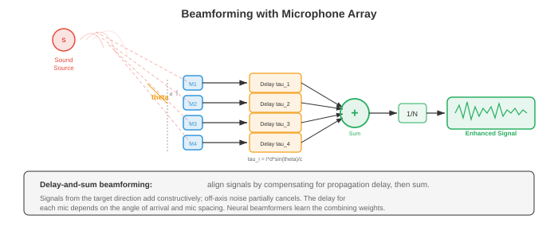
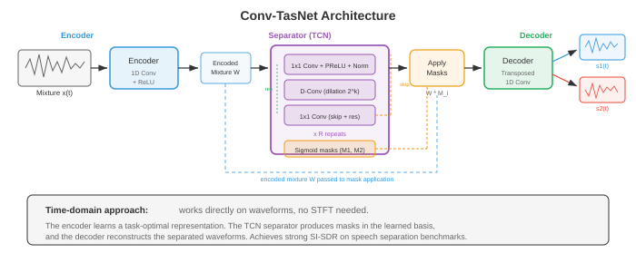

# 源分离与降噪

*源分离与降噪从混合音频中恢复单个信号；即计算层面的"鸡尾酒会问题"。本文涵盖ICA、NMF、时频掩蔽、波束成形、深度学习分离网络（Conv-TasNet、SepFormer）、语音增强以及自适应降噪。*

- 想象一下你站在一个拥挤的鸡尾酒会上。数十人同时在交谈，音乐在播放，酒杯在碰撞，但你却能专注于一段对话并清晰地跟上它。这种非凡的能力被称为**鸡尾酒会问题**（Cherry, 1953），人类听觉系统可以毫不费力地做到，但机器却觉得异常困难。本文涵盖了尝试解决这一问题的算法：分离混合音频源、消除不必要的噪声以及在不利条件下增强语音。

- 文件01中的信号处理基础（STFT、语谱图、滤波器组）支撑了这里的每一种方法。第02章中的矩阵分解技术（NMF、ICA、SVD）提供了经典工具集。第06章中的深度学习架构（CNN、RNN、注意力机制）以及第04/05章中的概率论则为现代方法提供了理论基础。


- **问题形式化**：在一个或多个麦克风处观测到混合信号 $x(t)$。在最简单的情况下，混合信号是 $C$ 个源信号的和：

$$x(t) = \sum_{c=1}^{C} s_c(t) + n(t)$$

- 其中 $s_c(t)$ 是第 $c$ 个源信号，$n(t)$ 是背景噪声。目标是从 $x(t)$ 中恢复出各个 $s_c(t)$。在单麦克风情况下，这是一个严重欠定的问题：一个方程，$C$ 个未知数。需要额外的假设（统计独立性、频谱结构、学习先验）才能使问题变得可解。

- 在频域中（通过文件01中的STFT），混合信号变为：

$$X(t, f) = \sum_{c=1}^{C} S_c(t, f) + N(t, f)$$

- 许多分离方法在时频域中通过为每个源估计一个**掩蔽** $M_c(t, f) \in [0, 1]$ 来工作，然后通过 $\hat{S}_c(t, f) = M_c(t, f) \cdot X(t, f)$ 恢复源信号。**理想二值掩蔽（IBM）** 设置 $M_c(t, f) = 1$ 如果源 $c$ 在该时频单元中占主导，否则为0。**理想比率掩蔽（IRM）** 是其软版本：

$$\text{IRM}_c(t, f) = \frac{|S_c(t, f)|^2}{\sum_{j=1}^{C} |S_j(t, f)|^2}$$

- **独立成分分析（ICA）** 是麦克风数量等于或超过源数量时的经典方法。ICA（第02章）寻找一个线性解混矩阵 $W$，使得 $\hat{s} = Wx$，其中恢复的源 $\hat{s}$ 在统计上最大限度地独立。关键假设是源信号是非高斯且独立的，这对于语音和音乐通常是成立的。

- 对于多麦克风瞬时混叠模型 $x = As$（其中 $A$ 是混叠矩阵），ICA 通过最大化输出的非高斯性（FastICA 使用负熵）或最小化互信息来恢复 $W \approx A^{-1}$。ICA 在受控环境中表现良好，但当混叠涉及卷积（房间混响）、源数量超过麦克风数量或独立性假设被违反时则会失败。

- **非负矩阵分解（NMF）** 将幅度语谱图 $V \in \mathbb{R}_+^{F \times T}$ 分解为两个非负矩阵的乘积（第02章）：

$$V \approx WH$$

- 其中 $W \in \mathbb{R}_+^{F \times K}$ 是包含 $K$ 个频谱基向量的字典，$H \in \mathbb{R}_+^{K \times T}$ 包含随时间变化的激活系数。非负约束具有物理动机：幅度是非负的，且声音是加性组合的。

- 对于源分离，NMF 为每个源学习独立的字典：$W_{\text{语音}}$ 捕捉语音的频谱模式（共振峰结构），而 $W_{\text{噪声}}$ 捕捉噪声模式。混合信号被分解为 $V \approx W_{\text{语音}} H_{\text{语音}} + W_{\text{噪声}} H_{\text{噪声}}$，每个源通过掩蔽来恢复。NMF 使用乘法更新规则进行最小化，代价函数可以是 Frobenius 范数或 KL 散度：

```math
\begin{aligned}
\text{Frobenius:} \quad D_F(V \| WH) &= \|V - WH\|_F^2 \\
\text{KL:} \quad D_{KL}(V \| WH) &= \sum_{f,t} \left[ V_{ft} \log \frac{V_{ft}}{(WH)_{ft}} - V_{ft} + (WH)_{ft} \right]
\end{aligned}
```

- **波束成形**利用麦克风阵列的空间信息。当一个源信号以不同的延迟到达不同的麦克风（由于空间排列）时，这些延迟可以用来增强来自某个方向的信号，同时抑制其他方向的信号。



- **延迟求和波束成形**是最简单的方法。如果目标源相对于阵列的角度为 $\theta$，则在麦克风 $m$ 处的时间延迟为 $\tau_m(\theta) = d_m \sin \theta / c$，其中 $d_m$ 是麦克风位置，$c$ 是声速。波束成形器输出将麦克风信号对齐并求和：

$$y(t) = \frac{1}{M} \sum_{m=1}^{M} x_m(t - \tau_m(\theta))$$

- 来自目标方向的信号相干相加，而来自其他方向的信号非相干相加，从而实现空间滤波。阵列的几何形状决定了空间分辨率：更大的阵列产生更窄的波束。

- **最小方差无失真响应（MVDR）** 波束成形优化权重，以最小化总输出功率，同时保证目标方向无失真地通过：

```math
\begin{aligned}
\min_{\mathbf{w}} \quad & \mathbf{w}^H \Phi_{nn} \mathbf{w} \\
\text{subject to} \quad & \mathbf{w}^H \mathbf{d}(\theta) = 1
\end{aligned}
```

- 其中 $\Phi_{nn}$ 是噪声空间协方差矩阵，$\mathbf{d}(\theta)$ 是方向 $\theta$ 的导向向量。闭式解为：

$$\mathbf{w}_{\text{MVDR}} = \frac{\Phi_{nn}^{-1} \mathbf{d}(\theta)}{\mathbf{d}(\theta)^H \Phi_{nn}^{-1} \mathbf{d}(\theta)}$$

- MVDR 通过使用估计的噪声协方差自适应地适应噪声环境，比延迟求和提供更好的干扰抑制能力。它广泛用于助听器、智能音箱和远程会议系统。

- **深度学习用于源分离**显著提升了性能，特别是在经典方法难以处理的单麦克风情况下。一般范式是：编码混合信号，通过神经网络估计掩蔽或源表示，然后解码以恢复各个源。

- **深度聚类**（Hershey 等，2016）将每个时频单元嵌入到一个高维空间中，使得属于同一源的单元彼此靠近，而来自不同源的单元则远离。一个双向 LSTM（第06章）将每个时频单元 $(t, f)$ 映射为一个嵌入向量 $v_{t,f} \in \mathbb{R}^D$。训练目标为：

$$\mathcal{L} = \|VV^T - YY^T\|_F^2$$

- 其中 $V$ 是嵌入矩阵，$Y$ 是源分配的单热矩阵。乘积 $VV^T$ 是一个亲和矩阵（两个单元的嵌入有多相似），而 $YY^T$ 是理想的亲和度（若属于同一源则为1，否则为0）。推理时，对嵌入进行 K-means 聚类产生二值掩蔽。

- **Conv-TasNet**（Luo 和 Mesgarani，2019）完全在时域中操作，绕过了 STFT。它包含三个组件：



- **编码器**：一个一维卷积将混合波形的短片段映射为潜在表示。对于混合信号 $x \in \mathbb{R}^T$，编码器输出为 $w = \text{ReLU}(U \ast x) \in \mathbb{R}^{N \times L}$，其中 $U$ 是一个可学习的基（类似于 STFT 基但从数据中学习），$N$ 是基函数的数量，$L$ 是片段数。编码器核大小和步长（通常为2ms和1ms）决定了时间分辨率。

- **分离器**：一个**时域卷积网络（TCN）**处理编码后的混合信号并输出 $C$ 个掩蔽。TCN 堆叠了扩张一维深度可分离卷积（来自第08章的高效卷积），这些卷积以指数增长的扩张因子 $1, 2, 4, \ldots, 2^{B-1}$ 排列成块，重复 $R$ 次。这提供了非常大的感受野，同时保持计算高效。

- **解码器**：一个转置一维卷积（使用可学习基 $V$）将每个掩蔽后的表示转换回时域：$\hat{s}_c = V^T (M_c \odot w)$。

- Conv-TasNet 显著优于基于语谱图的方法，因为学习到的编码器-解码器基可以捕捉 STFT 幅度所丢弃的信息（特别是相位）。

- **双路径 RNN（DPRNN）**（Luo 等，2020）解决了分离中的长序列建模问题。DPRNN 不是用单个 RNN 或 TCN 处理整个编码序列，而是将序列分割成重叠的块，并沿着两条路径应用 RNN：**块内**路径（对每个块内的局部模式建模）和**块间**路径（对跨块的全局模式建模）。这使 RNN 序列长度从 $L$ 降低到每个维度上的 $\sqrt{L}$：

```math
\begin{aligned}
\text{块内:} \quad & h_{k,n}^{\text{块内}} = \text{BiLSTM}_{\text{块内}}(z_{k,n}) \\
\text{块间:} \quad & h_{k,n}^{\text{块间}} = \text{BiLSTM}_{\text{块间}}(h_{k,n}^{\text{块内}})
\end{aligned}
```

- 其中 $k$ 索引块，$n$ 索引块内的位置。块内 LSTM 对固定 $k$ 的各 $n$ 处理；块间 LSTM 对固定 $n$ 的各 $k$ 处理。

- **SepFormer**（Subakan 等，2021）用 Transformer（第07章）替换了双路径框架中的 RNN。块内 Transformer 通过自注意力捕捉局部依赖关系，块间 Transformer 捕捉全局依赖关系。多头注意力能够建模长程依赖关系而不会出现梯度消失问题（第06章），这使得 SepFormer 对于长录音特别有效。SepFormer 在 WSJ0-2mix 基准上达到了最先进的结果。

- **置换不变训练（PIT）** 解决了监督式源分离中的一个基本问题：标签分配歧义。如果网络有两个输出（对应两个说话人），哪个输出应该对应哪个说话人？没有自然的排序。PIT 计算所有可能分配的损失并取最小值：

$$\mathcal{L}_{\text{PIT}} = \min_{\pi \in \mathcal{P}} \sum_{c=1}^{C} \ell(\hat{s}_{\pi(c)}, s_c)$$

- 其中 $\mathcal{P}$ 是 $\{1, \ldots, C\}$ 的所有排列集合，$\ell$ 是每个源的损失（通常是尺度不变信号失真比 SI-SDR）。对于 $C = 2$ 个源只有2种排列；对于 $C = 3$ 有6种。对于更大的 $C$，可以使用匈牙利算法高效计算。

- **尺度不变信号失真比（SI-SDR）** 是源分离的标准评估指标：

```math
\begin{aligned}
s_{\text{target}} &= \frac{\langle \hat{s}, s \rangle}{\|s\|^2} s \\
e_{\text{noise}} &= \hat{s} - s_{\text{target}} \\
\text{SI-SDR} &= 10 \log_{10} \frac{\|s_{\text{target}}\|^2}{\|e_{\text{noise}}\|^2}
\end{aligned}
```

- 其中 $\hat{s}$ 是估计的源，$s$ 是真实值。SI-SDR 对估计的总体尺度不变，这是期望的特性，因为绝对音量不如分离质量重要。较高的 SI-SDR（以 dB 为单位）更好。最先进的系统在 WSJ0-2mix 上实现了约 20-22 dB 的 SI-SDR 改进。

- **音乐源分离**将音乐录音分离成声部：人声、鼓、贝斯和其他乐器。这实现了卡拉OK（去除人声）、重新混音（调整乐器电平）和转录（一次分析一种乐器）等应用。

- **Open-Unmix**（Stoter 等，2019）是一个参考基线，使用三层双向 LSTM 在幅度 STFT 域中为每个源预测软掩蔽。它使用专用模型独立处理每个源。Open-Unmix 虽简单但有效，在 MUSDB18 上建立了可重复的基准。

- **Demucs**（Defossez 等，2019；2021年更新为 Hybrid Demucs）使用直接在波形上操作的 U-Net 架构（第08章）。编码器通过步长卷积压缩混合信号，解码器通过转置卷积和跳跃连接将其扩展回来，每个源有各自的解码器头。**Hybrid Demucs** 结合了时域和频域处理：编码器具有并行的时域和 STFT 分支，其特征在解码器之前融合。这同时捕捉了精细的时间细节和频谱结构。

- Demucs 在 MUSDB18 上达到了最先进的分离质量，特别是人声分离方面。其 U-Net 架构让人联想到第08章中的图像分割架构，将分离问题视为一种"音频分割"形式。

- **主动降噪（ANC）** 通过生成一个与噪声相消干涉的反噪声信号来减少不需要的声音。想象一下降噪耳机：麦克风拾取环境噪声，ANC 系统生成一个反相版本，混合信号（噪声 + 反噪声）理想情况下抵消为静音。

- 物理原理很简单：如果噪声是 $n(t)$，在空间同一点生成 $-n(t)$ 则产生静音：$n(t) + (-n(t)) = 0$。挑战在于反噪声必须在时间、幅度和相位上精确对齐。即使很小的误差也会产生残留噪声或伪影。

- **前馈式 ANC** 使用一个参考麦克风，在噪声到达听者之前拾取噪声。系统有时间处理噪声并生成反噪声。参考信号通过一个自适应滤波器，其输出在误差麦克风（靠近听者）处从噪声中减去。这适用于可预测的宽带噪声（引擎嗡嗡声、风扇噪声）。

- **反馈式 ANC** 仅使用听者耳边的误差麦克风。系统从残余信号（听者实际听到的）中估计噪声并调整反噪声。反馈式 ANC 更简单（不需要参考麦克风），但带宽有限且可能变得不稳定。

- **自适应滤波**是 ANC 背后的数学引擎。滤波器系数必须不断适应变化的噪声环境。最常用的算法是**最小均方（LMS）**滤波器。


- **LMS 算法**：一个具有系数 $\mathbf{w} = [w_0, w_1, \ldots, w_{L-1}]^T$ 的 FIR 滤波器处理参考信号 $\mathbf{x}(n) = [x(n), x(n-1), \ldots, x(n-L+1)]^T$。输出为 $y(n) = \mathbf{w}^T \mathbf{x}(n)$，误差为 $e(n) = d(n) - y(n)$（其中 $d(n)$ 是期望/主信号），权重更新为：

$$\mathbf{w}(n+1) = \mathbf{w}(n) + \mu \, e(n) \, \mathbf{x}(n)$$

- 其中 $\mu$ 是步长（学习率）。这是对均方误差 $E[e^2(n)]$ 的一个随机梯度下降步骤，使用瞬时梯度估计 $-2 e(n) \mathbf{x}(n)$ 代替真实梯度（第03章的梯度下降和第06章的 SGD）。

- 步长 $\mu$ 控制收敛速度与稳态误差之间的权衡。过大则滤波器振荡或发散；过小则自适应速度迟缓。稳定条件为 $0 < \mu < 2 / (\lambda_{\max})$，其中 $\lambda_{\max}$ 是输入自相关矩阵 $R = E[\mathbf{x}\mathbf{x}^T]$ 的最大特征值。

- **归一化 LMS（NLMS）** 通过输入功率对步长进行归一化，使收敛与信号电平无关：

$$\mathbf{w}(n+1) = \mathbf{w}(n) + \frac{\mu}{\|\mathbf{x}(n)\|^2 + \epsilon} \, e(n) \, \mathbf{x}(n)$$

- 其中 $\epsilon$ 是一个小的正则化常数，以防止除零。NLMS 比 LMS 更可靠地收敛，因为有效步长自适应地适应输入功率。

- **递归最小二乘（RLS）** 是一种收敛更快的替代方法，它最小化加权最小二乘代价 $\sum_{k=1}^{n} \lambda^{n-k} e^2(k)$，其中 $\lambda \in (0, 1]$ 是遗忘因子。RLS 维护逆自相关矩阵的估计并递归更新，以每个样本 $O(L^2)$ 的计算成本（相对于 LMS 的 $O(L)$）实现最优收敛。

- **降噪与语音增强**旨在提高嘈杂录音中的语音质量和可懂度。与源分离（分离不同的源）不同，语音增强专门针对语音加噪声的情况，从带噪观测中恢复干净的语音。

- **谱减法**是最简单的方法。在纯噪声帧（由文件03中的 VAD 检测）期间，估计噪声频谱 $|\hat{N}(f)|^2$。然后将其从每个帧中减去：

$$|\hat{S}(f)|^2 = \max(|X(f)|^2 - \alpha |\hat{N}(f)|^2, \beta |X(f)|^2)$$

- 其中 $\alpha$ 是过减因子（通常为1-4，激进的减法去除更多噪声但引入更多伪影），$\beta$ 是频谱地板，防止出现负值并减少"音乐噪声"伪影（听起来像随机音符的孤立音调残留）。

- **维纳滤波**提供了干净语音频谱的最小均方误差估计：

$$\hat{S}(t, f) = \frac{|S(t,f)|^2}{|S(t,f)|^2 + |N(t,f)|^2} \cdot X(t, f) = G(t, f) \cdot X(t, f)$$

- 维纳增益 $G(t, f) = \text{SNR}(t, f) / (1 + \text{SNR}(t, f))$ 的范围从0（纯噪声）到1（纯语音），作为一个软掩蔽。挑战在于估计语音和噪声的功率谱。**先验 SNR** $\xi(t, f) = |S(t,f)|^2 / |N(t,f)|^2$ 使用"决策导向"方法估计：当前帧估计与前一帧维纳滤波输出的平滑组合。

- **神经语音增强**使用深度学习来估计掩蔽（如维纳增益）或直接估计干净语谱图。架构从简单的前馈网络到 U-Net（第08章）、CRN（卷积递归网络）和 Transformer。

- **DCCRN**（深度复数卷积递归网络）在复数 STFT（幅度和相位）上操作，使用自然处理实部和虚部的复数值卷积。这避免了仅幅度方法所困扰的相位估计问题。

- **FullSubNet** 使用双路径架构，包含一个全频带模型（捕捉全局频谱模式）和一个子频带模型（捕捉局部谐波细节）。全频带模型处理整个频谱，而子频带模型处理以每个频率单元为中心的窄频带。它们的输出被组合用于最终的掩蔽估计。

- **DNS（深度噪声抑制）挑战赛**由微软每年举办，对语音增强系统进行基准测试。获胜者通常使用大规模训练，包含多种噪声类型、数据增强（以各种 SNR 添加噪声、混响、编解码器伪影）以及支持实时处理的架构。

- **回声消除**在双向通信中去除声学回声。当你在电话通话中时，远端说话人的声音通过你的扬声器播放，在房间内反弹，并被你的麦克风拾取，产生远端说话人听到的回声。**声学回声消除（AEC）** 对从扬声器到麦克风的声学路径进行建模并减去预测的回声。

- 声学路径被建模为一个自适应 FIR 滤波器（使用 LMS 或 NLMS），以远端信号为输入。滤波器对房间脉冲响应进行建模，包括直达路径、早期反射和晚期混响。房间脉冲响应可能长达数百毫秒，需要数千个抽头的滤波器。

- **双讲检测**对 AEC 至关重要：当近端和远端说话人同时说话时，自适应滤波器必须冻结（停止更新），以防止其抵消近端说话人的声音。双讲检测器将误差信号的能量与远端信号能量进行比较；无法用远端信号解释的误差能量突然增加表明存在近端语音。

- 远端信号 $x(n)$ 与麦克风信号 $d(n)$ 之间的**归一化互相关**提供了一个双讲指示符：

$$\xi(n) = \frac{|\sum_{k=0}^{L-1} x(n-k) d(n-k)|}{\sqrt{\sum_{k} x^2(n-k)} \sqrt{\sum_{k} d^2(n-k)}}$$

- 在单讲期间（仅远端），$\xi$ 较高，因为 $d$ 主要是 $x$ 的回声。在双讲期间，$\xi$ 下降，因为近端语音与 $x$ 不相关。

- 现代 AEC 系统将自适应滤波与神经网络相结合：自适应滤波器提供初始回声估计，神经网络（类似于上述语音增强模型）清理残余回声并处理线性滤波器无法捕捉的非线性（扬声器失真）。

- **分离与增强的评估指标**：
    - **SI-SDR**（如上定义）：源分离的标准指标。
    - **SDR**（信号失真比）：来自 BSS Eval，衡量包括伪影和干扰在内的整体分离质量。
    - **PESQ**（语音质量感知评估）：ITU 标准，预测主观质量分数。范围：-0.5 至 4.5。
    - **STOI**（短时客观可懂度）：预测语音可懂度。范围：0 至 1。
    - **DNSMOS**：微软的深度噪声抑制 MOS 预测器，一个训练用于预测人类 MOS 分数的神经网络，无需干净的参考音频。

## 编程任务（使用 CoLab 或 notebook）

- **任务 1：用于源分离的独立成分分析。** 实现 FastICA 来分离两个混合音频源，演示确定情况（源与麦克风数量相等）下的经典鸡尾酒会解决方案。

```python
import jax
import jax.numpy as jnp
import jax.random as jr
import matplotlib.pyplot as plt

# 生成两个源信号
sr = 8000
duration = 1.0
t = jnp.linspace(0, duration, int(sr * duration))

# 源 1：正弦波（类似音调）
s1 = jnp.sin(2 * jnp.pi * 440 * t) + 0.3 * jnp.sin(2 * jnp.pi * 880 * t)

# 源 2：锯齿波（丰富的谐波）
s2 = 2 * (t * 200 % 1) - 1  # 200 Hz 锯齿波

# 归一化源信号
s1 = s1 / jnp.max(jnp.abs(s1))
s2 = s2 / jnp.max(jnp.abs(s2))
sources = jnp.stack([s1, s2])  # (2, T)

# 混叠矩阵（算法未知）
A = jnp.array([[0.8, 0.4],
               [0.3, 0.9]])
mixtures = A @ sources  # (2, T)

# FastICA 实现
def whiten(X):
    """数据中心化与白化。"""
    X_centered = X - jnp.mean(X, axis=1, keepdims=True)
    cov = (X_centered @ X_centered.T) / X_centered.shape[1]
    eigvals, eigvecs = jnp.linalg.eigh(cov)
    D_inv_sqrt = jnp.diag(1.0 / jnp.sqrt(eigvals + 1e-8))
    whitening = D_inv_sqrt @ eigvecs.T
    return whitening @ X_centered, whitening

def fastica(X, n_components=2, max_iter=200, tol=1e-6):
    """使用 tanh 非线性的 FastICA（负熵近似）。"""
    X_white, whitening = whiten(X)
    n, T = X_white.shape

    key = jr.PRNGKey(42)
    W = jr.normal(key, (n_components, n))
    # 正交化 W
    U, _, Vt = jnp.linalg.svd(W, full_matrices=False)
    W = U @ Vt

    for iteration in range(max_iter):
        W_old = W.copy()

        # 对每个分量
        for i in range(n_components):
            w = W[i]
            # w^T X_white: (T,)
            wx = w @ X_white  # (T,)

            # g(u) = tanh(u), g'(u) = 1 - tanh^2(u)
            g_wx = jnp.tanh(wx)
            g_prime_wx = 1 - g_wx ** 2

            # Newton 更新: w_new = E[X * g(w^T X)] - E[g'(w^T X)] * w
            w_new = jnp.mean(X_white * g_wx[None, :], axis=1) - \
                    jnp.mean(g_prime_wx) * w

            # 与之前的分量去相关（消去法）
            for j in range(i):
                w_new = w_new - jnp.dot(w_new, W[j]) * W[j]

            w_new = w_new / jnp.linalg.norm(w_new)
            W = W.at[i].set(w_new)

        # 检查收敛
        convergence = jnp.min(jnp.abs(jnp.diag(W @ W_old.T)))
        if convergence > 1 - tol:
            print(f"FastICA 在 {iteration + 1} 次迭代后收敛")
            break

    # 解混矩阵
    unmixing = W @ whitening
    recovered = unmixing @ X
    return recovered, unmixing

recovered, W_unmix = fastica(mixtures)

# 修复符号歧义（ICA 可能翻转符号）
for i in range(2):
    if jnp.corrcoef(recovered[i], sources[i])[0, 1] < -0.5:
        recovered = recovered.at[i].set(-recovered[i])

# 如果源被交换，修复排列
corr_00 = jnp.abs(jnp.corrcoef(recovered[0], sources[0])[0, 1])
corr_01 = jnp.abs(jnp.corrcoef(recovered[0], sources[1])[0, 1])
if corr_01 > corr_00:
    recovered = recovered[::-1]

# 归一化以便显示
recovered = recovered / jnp.max(jnp.abs(recovered), axis=1, keepdims=True)

fig, axes = plt.subplots(3, 2, figsize=(14, 9))

axes[0, 0].plot(t[:1000], s1[:1000], color='#3498db', linewidth=0.8)
axes[0, 0].set_title('源信号 1（原始）')
axes[0, 0].set_ylabel('幅度')

axes[0, 1].plot(t[:1000], s2[:1000], color='#e74c3c', linewidth=0.8)
axes[0, 1].set_title('源信号 2（原始）')

axes[1, 0].plot(t[:1000], mixtures[0, :1000], color='#9b59b6', linewidth=0.8)
axes[1, 0].set_title('混合信号 1（麦克风 1）')
axes[1, 0].set_ylabel('幅度')

axes[1, 1].plot(t[:1000], mixtures[1, :1000], color='#9b59b6', linewidth=0.8)
axes[1, 1].set_title('混合信号 2（麦克风 2）')

axes[2, 0].plot(t[:1000], recovered[0, :1000], color='#27ae60', linewidth=0.8)
axes[2, 0].set_title('恢复的源信号 1（FastICA）')
axes[2, 0].set_ylabel('幅度')
axes[2, 0].set_xlabel('时间 (s)')

axes[2, 1].plot(t[:1000], recovered[1, :1000], color='#f39c12', linewidth=0.8)
axes[2, 1].set_title('恢复的源信号 2（FastICA）')
axes[2, 1].set_xlabel('时间 (s)')

plt.tight_layout()
plt.show()

# 报告与原始信号的相关性
for i in range(2):
    corr = jnp.corrcoef(recovered[i], sources[i])[0, 1]
    print(f"源 {i+1} 恢复相关性: {corr:.4f}")
```

- **任务 2：基于 NMF 的语谱图源分离。** 使用非负矩阵分解（第02章）将语谱图分离为两个分量，演示 NMF 如何为每个源学习频谱字典。

```python
import jax
import jax.numpy as jnp
import jax.random as jr
import matplotlib.pyplot as plt

# 生成两个具有不同频谱特征的信号
sr = 8000
duration = 1.0
t = jnp.linspace(0, duration, int(sr * duration))

# 源 1：低频谐波（模拟贝斯）
src1 = (jnp.sin(2 * jnp.pi * 100 * t) +
        0.5 * jnp.sin(2 * jnp.pi * 200 * t) +
        0.3 * jnp.sin(2 * jnp.pi * 300 * t))

# 源 2：高频谐波（模拟长笛）
src2 = (jnp.sin(2 * jnp.pi * 800 * t) +
        0.4 * jnp.sin(2 * jnp.pi * 1600 * t))

# 时变幅度（源在不同时间激活）
env1 = jnp.where(t < 0.5, 1.0, 0.3)
env2 = jnp.where(t > 0.3, 1.0, 0.2)
src1 = src1 * env1
src2 = src2 * env2

mixture = src1 + src2

# 计算幅度语谱图（STFT）
n_fft = 512
hop = 128
window = jnp.hanning(n_fft)

def compute_stft(signal, n_fft, hop, window):
    n_frames = 1 + (len(signal) - n_fft) // hop
    frames = jnp.stack([
        signal[i * hop : i * hop + n_fft] * window
        for i in range(n_frames)
    ])
    return jnp.fft.rfft(frames, n=n_fft)

S_mix = compute_stft(mixture, n_fft, hop, window)
V = jnp.abs(S_mix).T  # (F, T) - 频率 x 时间
phase = jnp.angle(S_mix).T

F, T = V.shape
print(f"语谱图形状: {F} 个频率 bin x {T} 个时间帧")

# NMF: V ≈ WH 使用乘法更新规则
def nmf(V, K, n_iter=200, key=jr.PRNGKey(0)):
    """使用 Frobenius 范数的非负矩阵分解。"""
    k1, k2 = jr.split(key)
    W = jnp.abs(jr.normal(k1, (F, K))) * 0.1 + 0.01  # (F, K)
    H = jnp.abs(jr.normal(k2, (K, T))) * 0.1 + 0.01  # (K, T)

    costs = []
    for i in range(n_iter):
        # H 的乘法更新
        WtV = W.T @ V
        WtWH = W.T @ W @ H + 1e-8
        H = H * (WtV / WtWH)

        # W 的乘法更新
        VHt = V @ H.T
        WHHt = W @ H @ H.T + 1e-8
        W = W * (VHt / WHHt)

        cost = jnp.sum((V - W @ H) ** 2)
        costs.append(float(cost))

    return W, H, costs

# 运行 K=2 个分量的 NMF
K = 2
W, H, costs = nmf(V, K, n_iter=300)

# 使用软掩蔽重建每个源
V_hat = W @ H
mask1 = (W[:, 0:1] @ H[0:1, :]) / (V_hat + 1e-8)
mask2 = (W[:, 1:2] @ H[1:2, :]) / (V_hat + 1e-8)

V_src1 = mask1 * V
V_src2 = mask2 * V

# 可视化
fig, axes = plt.subplots(3, 2, figsize=(14, 10))

# 混合信号语谱图
axes[0, 0].imshow(jnp.log1p(V), aspect='auto', origin='lower', cmap='magma')
axes[0, 0].set_title('混合信号语谱图 |X|')
axes[0, 0].set_ylabel('频率 bin')

# NMF 收敛
axes[0, 1].plot(costs, color='#3498db', linewidth=1.5)
axes[0, 1].set_title('NMF 收敛曲线')
axes[0, 1].set_xlabel('迭代次数')
axes[0, 1].set_ylabel('Frobenius 代价')
axes[0, 1].set_yscale('log')

# 频谱基向量 W
freq_hz = jnp.arange(F) * sr / n_fft
axes[1, 0].plot(freq_hz, W[:, 0], color='#27ae60', linewidth=1.5,
                label='基 1（低频）')
axes[1, 0].plot(freq_hz, W[:, 1], color='#e74c3c', linewidth=1.5,
                label='基 2（高频）')
axes[1, 0].set_title('学习到的频谱基 W')
axes[1, 0].set_xlabel('频率 (Hz)')
axes[1, 0].set_ylabel('幅度')
axes[1, 0].legend()

# 时域激活 H
time_s = jnp.arange(T) * hop / sr
axes[1, 1].plot(time_s, H[0], color='#27ae60', linewidth=1.5,
                label='激活 1')
axes[1, 1].plot(time_s, H[1], color='#e74c3c', linewidth=1.5,
                label='激活 2')
axes[1, 1].set_title('时域激活 H')
axes[1, 1].set_xlabel('时间 (s)')
axes[1, 1].set_ylabel('激活值')
axes[1, 1].legend()

# 分离后的语谱图
axes[2, 0].imshow(jnp.log1p(V_src1), aspect='auto', origin='lower', cmap='magma')
axes[2, 0].set_title('分离后的源信号 1（低频）')
axes[2, 0].set_ylabel('频率 bin')
axes[2, 0].set_xlabel('时间帧')

axes[2, 1].imshow(jnp.log1p(V_src2), aspect='auto', origin='lower', cmap='magma')
axes[2, 1].set_title('分离后的源信号 2（高频）')
axes[2, 1].set_xlabel('时间帧')

plt.tight_layout()
plt.show()

print(f"重建误差: {jnp.sum((V - W @ H)**2):.2f}")
print(f"NMF 学习到的频谱基能够捕捉每个源的频率特征。")
```

- **任务 3：用于降噪的 LMS 自适应滤波器。** 实现 LMS 和 NLMS 算法用于回声/降噪，展示收敛行为及步长的影响。

```python
import jax
import jax.numpy as jnp
import jax.random as jr
import matplotlib.pyplot as plt

# 模拟回声消除场景
# 远端信号 -> 房间脉冲响应 -> 麦克风处的回声
# 近端语音是我们希望保留的目标信号

sr = 8000
duration = 2.0
n_samples = int(sr * duration)
key = jr.PRNGKey(42)
keys = jr.split(key, 5)

# 远端信号（参考）：随机的类语音信号
far_end = jr.normal(keys[0], (n_samples,)) * 0.5

# 房间脉冲响应（算法未知）
rir_length = 64
rir = jnp.zeros(rir_length)
rir = rir.at[0].set(0.8)   # 直达路径
rir = rir.at[5].set(0.3)   # 早期反射
rir = rir.at[12].set(-0.2) # 反射
rir = rir.at[25].set(0.1)  # 晚期反射
rir = rir.at[40].set(-0.05)

# 回声：远端信号与 RIR 的卷积
echo = jnp.convolve(far_end, rir)[:n_samples]

# 近端语音（在信号的一部分中活跃）
near_end = jnp.zeros(n_samples)
start, end = n_samples // 3, 2 * n_samples // 3
near_speech = 0.3 * jnp.sin(
    2 * jnp.pi * 300 * jnp.linspace(0, (end - start) / sr, end - start)
)
near_end = near_end.at[start:end].set(near_speech)

# 麦克风信号：回声 + 近端 + 噪声
noise = jr.normal(keys[1], (n_samples,)) * 0.01
mic_signal = echo + near_end + noise

# LMS 自适应滤波器
def lms_filter(reference, desired, filter_length, mu):
    """标准 LMS 自适应滤波器。"""
    n = len(reference)
    w = jnp.zeros(filter_length)
    output = jnp.zeros(n)
    error = jnp.zeros(n)
    w_history = []

    for i in range(filter_length, n):
        x = reference[max(0, i-filter_length+1):i+1][::-1]

        y = jnp.dot(w, x)
        e = desired[i] - y
        w = w + mu * e * x

        output = output.at[i].set(y)
        error = error.at[i].set(e)

        if i % 500 == 0:
            w_history.append(w.copy())

    return output, error, w_history

# NLMS 自适应滤波器
def nlms_filter(reference, desired, filter_length, mu, eps=1e-6):
    """归一化 LMS 自适应滤波器。"""
    n = len(reference)
    w = jnp.zeros(filter_length)
    output = jnp.zeros(n)
    error = jnp.zeros(n)

    for i in range(filter_length, n):
        x = reference[max(0, i-filter_length+1):i+1][::-1]

        y = jnp.dot(w, x)
        e = desired[i] - y
        norm_factor = jnp.dot(x, x) + eps
        w = w + (mu / norm_factor) * e * x

        output = output.at[i].set(y)
        error = error.at[i].set(e)

    return output, error

# 使用不同步长运行 LMS
filter_len = 64
mu_values = [0.001, 0.01, 0.05]
colors_mu = ['#3498db', '#e74c3c', '#27ae60']

fig, axes = plt.subplots(2, 2, figsize=(14, 10))

# 原始信号
t = jnp.arange(n_samples) / sr
axes[0, 0].plot(t, mic_signal, color='#9b59b6', linewidth=0.5, alpha=0.7,
                label='麦克风（回声 + 近端）')
axes[0, 0].plot(t, echo, color='#e74c3c', linewidth=0.5, alpha=0.7,
                label='回声（待消除）')
axes[0, 0].plot(t, near_end, color='#27ae60', linewidth=0.8,
                label='近端语音（需保留）')
axes[0, 0].set_title('信号分量')
axes[0, 0].set_xlabel('时间 (s)')
axes[0, 0].set_ylabel('幅度')
axes[0, 0].legend(fontsize=8)

# 不同步长下的 LMS 收敛
for mu, color in zip(mu_values, colors_mu):
    _, err, _ = lms_filter(far_end, mic_signal, filter_len, mu)
    # 平滑后的平方误差
    sq_err = err ** 2
    window_size = 200
    smoothed = jnp.convolve(sq_err, jnp.ones(window_size)/window_size,
                             mode='valid')
    axes[0, 1].plot(smoothed, color=color, linewidth=1.2,
                    label=f'mu={mu}')

axes[0, 1].set_title('LMS 收敛曲线（平滑 MSE）')
axes[0, 1].set_xlabel('样本')
axes[0, 1].set_ylabel('平方误差')
axes[0, 1].set_yscale('log')
axes[0, 1].legend()

# 最佳 LMS 结果
_, err_lms, w_hist = lms_filter(far_end, mic_signal, filter_len, 0.01)
axes[1, 0].plot(t, mic_signal, color='#9b59b6', linewidth=0.5, alpha=0.4,
                label='消除前')
axes[1, 0].plot(t, err_lms, color='#3498db', linewidth=0.5, alpha=0.8,
                label='LMS 消除后')
axes[1, 0].plot(t, near_end, color='#27ae60', linewidth=0.8, alpha=0.5,
                label='真实近端')
axes[1, 0].set_title('LMS 回声消除结果 (mu=0.01)')
axes[1, 0].set_xlabel('时间 (s)')
axes[1, 0].set_ylabel('幅度')
axes[1, 0].legend(fontsize=8)

# NLMS 结果
_, err_nlms = nlms_filter(far_end, mic_signal, filter_len, 0.5)
axes[1, 1].plot(t, mic_signal, color='#9b59b6', linewidth=0.5, alpha=0.4,
                label='消除前')
axes[1, 1].plot(t, err_nlms, color='#f39c12', linewidth=0.5, alpha=0.8,
                label='NLMS 消除后')
axes[1, 1].plot(t, near_end, color='#27ae60', linewidth=0.8, alpha=0.5,
                label='真实近端')
axes[1, 1].set_title('NLMS 回声消除结果 (mu=0.5)')
axes[1, 1].set_xlabel('时间 (s)')
axes[1, 1].set_ylabel('幅度')
axes[1, 1].legend(fontsize=8)

plt.tight_layout()
plt.show()

# 测量回声衰减
echo_power = jnp.mean(echo ** 2)
lms_residual = jnp.mean(err_lms[n_samples//2:] ** 2)  # 收敛后
nlms_residual = jnp.mean(err_nlms[n_samples//2:] ** 2)
print(f"回声功率: {10*jnp.log10(echo_power):.1f} dB")
print(f"LMS 残差: {10*jnp.log10(lms_residual):.1f} dB "
      f"(ERLE: {10*jnp.log10(echo_power/lms_residual):.1f} dB)")
print(f"NLMS 残差: {10*jnp.log10(nlms_residual):.1f} dB "
      f"(ERLE: {10*jnp.log10(echo_power/nlms_residual):.1f} dB)")
```

- **任务 4：用于语音增强的时频掩蔽。** 实现一个简单的频谱掩蔽方法（理想比率掩蔽），并将其与谱减法进行比较，在合成的带噪语音信号上可视化分离质量。

```python
import jax
import jax.numpy as jnp
import jax.random as jr
import matplotlib.pyplot as plt

# 创建合成的"语音"和"噪声"信号
sr = 8000
duration = 2.0
t = jnp.linspace(0, duration, int(sr * duration))

# 语音：具有时变幅度的谐波序列（模拟语音）
speech = jnp.zeros_like(t)
for f0 in [150, 300, 450, 600, 900]:
    amp_env = 0.5 + 0.5 * jnp.sin(2 * jnp.pi * 2.0 * t)  # 2 Hz 调制
    speech = speech + (0.5 / (f0/150)) * amp_env * jnp.sin(2 * jnp.pi * f0 * t)
speech = speech / jnp.max(jnp.abs(speech))

# 噪声：限带噪声
key = jr.PRNGKey(42)
noise_raw = jr.normal(key, t.shape) * 0.4

# 在给定 SNR 下混合
snr_db = 5.0
speech_power = jnp.mean(speech ** 2)
noise_power = jnp.mean(noise_raw ** 2)
noise_scale = jnp.sqrt(speech_power / (noise_power * 10 ** (snr_db / 10)))
noise = noise_raw * noise_scale
mixture = speech + noise

# STFT
n_fft = 512
hop = 128
window = jnp.hanning(n_fft)

def stft(signal, n_fft, hop, window):
    n_frames = 1 + (len(signal) - n_fft) // hop
    frames = jnp.stack([
        signal[i * hop : i * hop + n_fft] * window
        for i in range(n_frames)
    ])
    return jnp.fft.rfft(frames, n=n_fft)

def istft(S, hop, window, length):
    n_fft = (S.shape[1] - 1) * 2
    n_frames = S.shape[0]
    frames = jnp.fft.irfft(S, n=n_fft) * window[None, :]
    output = jnp.zeros(length)
    window_sum = jnp.zeros(length)
    for i in range(n_frames):
        start = i * hop
        end = start + n_fft
        if end <= length:
            output = output.at[start:end].add(frames[i])
            window_sum = window_sum.at[start:end].add(window ** 2)
    window_sum = jnp.maximum(window_sum, 1e-8)
    return output / window_sum

S_speech = stft(speech, n_fft, hop, window)
S_noise = stft(noise, n_fft, hop, window)
S_mix = stft(mixture, n_fft, hop, window)

mag_speech = jnp.abs(S_speech)
mag_noise = jnp.abs(S_noise)
mag_mix = jnp.abs(S_mix)
phase_mix = jnp.angle(S_mix)

# 方法 1：理想比率掩蔽（oracle - 理论上限）
irm = mag_speech ** 2 / (mag_speech ** 2 + mag_noise ** 2 + 1e-8)
S_irm = (irm * mag_mix) * jnp.exp(1j * phase_mix)
enhanced_irm = istft(S_irm, hop, window, len(mixture))

# 方法 2：谱减法
# 从前 0.2s 估计噪声（假设为静音段）
noise_frames = int(0.2 * sr / hop)
noise_est = jnp.mean(mag_mix[:noise_frames] ** 2, axis=0, keepdims=True)
alpha = 2.0  # 过减因子
beta = 0.02  # 频谱地板
mag_sub = jnp.maximum(mag_mix ** 2 - alpha * noise_est, beta * mag_mix ** 2)
mag_sub = jnp.sqrt(mag_sub)
S_sub = mag_sub * jnp.exp(1j * phase_mix)
enhanced_sub = istft(S_sub, hop, window, len(mixture))

# 方法 3：维纳滤波器
snr_est = mag_mix ** 2 / (noise_est + 1e-8)
wiener_gain = snr_est / (1 + snr_est)
S_wiener = (wiener_gain * mag_mix) * jnp.exp(1j * phase_mix)
enhanced_wiener = istft(S_wiener, hop, window, len(mixture))

# 计算每种方法的 SI-SDR
def si_sdr(estimate, reference):
    """尺度不变信号失真比。"""
    ref = reference[:len(estimate)]
    est = estimate[:len(reference)]
    s_target = (jnp.dot(est, ref) / (jnp.dot(ref, ref) + 1e-8)) * ref
    e_noise = est - s_target
    return 10 * jnp.log10(jnp.dot(s_target, s_target) /
                           (jnp.dot(e_noise, e_noise) + 1e-8))

si_sdr_mix = si_sdr(mixture, speech)
si_sdr_irm_val = si_sdr(enhanced_irm, speech)
si_sdr_sub_val = si_sdr(enhanced_sub, speech)
si_sdr_wiener_val = si_sdr(enhanced_wiener, speech)

# 可视化
fig, axes = plt.subplots(3, 2, figsize=(14, 12))

# 语谱图
axes[0, 0].imshow(jnp.log1p(mag_speech.T), aspect='auto', origin='lower',
                   cmap='magma')
axes[0, 0].set_title('干净语音语谱图')
axes[0, 0].set_ylabel('频率 bin')

axes[0, 1].imshow(jnp.log1p(mag_mix.T), aspect='auto', origin='lower',
                   cmap='magma')
axes[0, 1].set_title(f'带噪混合 ({snr_db:.0f} dB SNR)')

# 掩蔽
axes[1, 0].imshow(irm.T, aspect='auto', origin='lower', cmap='RdYlGn')
axes[1, 0].set_title('理想比率掩蔽（Oracle）')
axes[1, 0].set_ylabel('频率 bin')

axes[1, 1].imshow(wiener_gain.T, aspect='auto', origin='lower', cmap='RdYlGn',
                   vmin=0, vmax=1)
axes[1, 1].set_title('估计的维纳增益')

# 增强后的波形对比
n_show = 3000
axes[2, 0].plot(t[:n_show], speech[:n_show], color='#27ae60', linewidth=0.8,
                alpha=0.5, label='干净')
axes[2, 0].plot(t[:n_show], mixture[:n_show], color='#e74c3c', linewidth=0.5,
                alpha=0.4, label='带噪')
axes[2, 0].plot(t[:n_show], enhanced_irm[:n_show], color='#3498db',
                linewidth=0.8, label='IRM 增强')
axes[2, 0].set_title('波形对比（IRM）')
axes[2, 0].set_xlabel('时间 (s)')
axes[2, 0].set_ylabel('幅度')
axes[2, 0].legend(fontsize=8)

# SI-SDR 柱状图
methods = ['混合信号', '谱减法', '维纳滤波器', '理想比率掩蔽']
sdr_values = [float(si_sdr_mix), float(si_sdr_sub_val),
              float(si_sdr_wiener_val), float(si_sdr_irm_val)]
bar_colors = ['#e74c3c', '#f39c12', '#9b59b6', '#27ae60']
bars = axes[2, 1].bar(methods, sdr_values, color=bar_colors, alpha=0.8)
axes[2, 1].set_ylabel('SI-SDR (dB)')
axes[2, 1].set_title('增强质量对比')
for bar, val in zip(bars, sdr_values):
    axes[2, 1].text(bar.get_x() + bar.get_width()/2., bar.get_height() + 0.3,
                    f'{val:.1f}', ha='center', fontsize=10)
axes[2, 1].axhline(0, color='gray', linestyle='--', linewidth=0.8)

plt.tight_layout()
plt.show()

print(f"SI-SDR（带噪混合）:        {si_sdr_mix:.2f} dB")
print(f"SI-SDR（谱减法）:          {si_sdr_sub_val:.2f} dB")
print(f"SI-SDR（维纳滤波器）:      {si_sdr_wiener_val:.2f} dB")
print(f"SI-SDR（理想比率掩蔽）:    {si_sdr_irm_val:.2f} dB（oracle 理论上限）")
```
