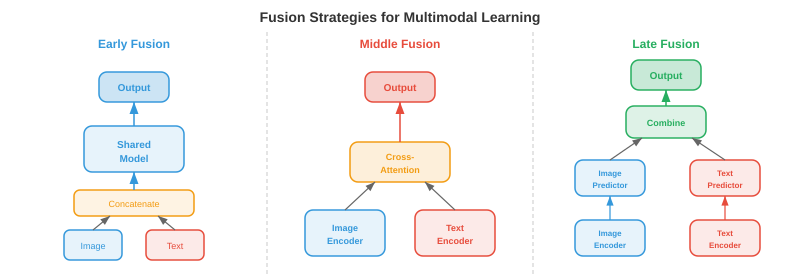
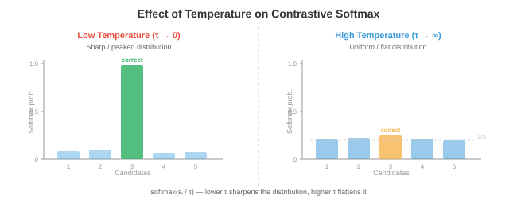
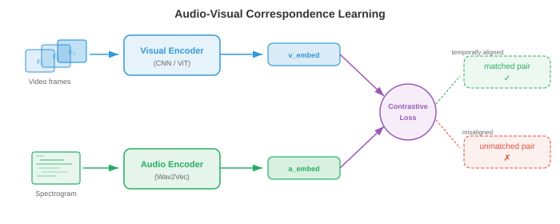

# 多模态表征

*多模态表征将视觉、语言和音频桥接到共享嵌入空间中。本文件涵盖融合策略、CLIP、ALIGN、SigLIP、对比损失函数（InfoNCE、NT-Xent）、零样本分类和检索评估。*

- 想象你坐在一家咖啡馆里。你看到桌上冒热气的水杯，听到陶瓷的叮当声，闻到烘焙咖啡豆的香气，感受到从马克杯传来的暖意。没有哪一种感官能告诉你一切：你的大脑将这些信号融合成一个统一的感知——"热咖啡"。**多模态学习** 对机器做了同样的事：它结合来自多种模态（视觉、语言、音频等）的信息，构建出比任何单一模态单独提供的表征更丰富、更鲁棒的表征。

- **模态（modality）** 是一种独特的信息通道。在机器学习中，最常见的模态包括图像（像素网格）、文本（词元序列）、音频（波形或语谱图，如第9章所述）、视频（帧序列）和结构化数据（表格、图）。每种模态都有其自身的统计结构：图像具有空间连贯性，文本是序列化和离散的，音频是时间性的和连续的。多模态学习的挑战在于桥接这些根本不同的数据类型。

- 为什么要费心结合多种模态？因为它们提供互补的信息。一张狗的照片告诉你它的品种和颜色，但不会告诉你名字。像"我的金毛犬 Max"这样的描述告诉你名字和品种，但不会告诉你确切姿态。图像和文本结合起来，比任何单独一个给出的画面都更完整。这种互补性是其核心动机：多模态模型可以回答那些单模态模型无法回答的问题、生成内容并做出决策。


## 融合策略

- 想象一个小组项目。你有两种组合想法的方式：每个人从一开始就在同一个房间里一起工作（共享原始笔记和草稿），或者每个人独立撰写自己的部分，最后合并最终文档。这分别对应于多模态学习中的**早期融合（early fusion）** 和**晚期融合（late fusion）**。

- **早期融合**（也称为特征级融合）在任何高级处理之前，对来自不同模态的原始或低级特征进行拼接或混合。例如，你可以将图像的像素特征与文本的词元嵌入拼接起来，将组合后的序列输入到一个单一的 Transformer 中。模型可以从一开始就学习细粒度的跨模态交互，但输入空间很大，且模型必须学会同时处理截然不同的数据类型。

- 形式化地，给定来自两种模态的特征向量 $x_{\\text{img}} \\in \\mathbb{R}^{d_1}$ 和 $x_{\\text{txt}} \\in \\mathbb{R}^{d_2}$，早期融合简单地拼接它们：

$$x_{\\text{fused}} = [x_{\\text{img}}; x_{\\text{txt}}] \\in \\mathbb{R}^{d_1 + d_2}$$

- 这个拼接后的向量由共享网络处理。其优势在于模型可以在每一层发现跨模态相关性。缺点是计算成本高，且难以对齐非常不同的特征类型（密集的像素值与稀疏的词元索引）。

- **晚期融合**（也称为决策级融合）通过各自的编码器独立处理每种模态，为每种模态生成一个高层表征甚至最终的预测结果。这些输出随后被组合，通常通过平均分数、投票或一个可学习的组合层。晚期融合更简单，且允许你直接复用预训练的单模态模型，但它无法捕捉低层的跨模态交互，因为各模态从未"看到"彼此的原始特征。

- 给定模态特定的预测值 $\hat{y}_1$ 和 $\hat{y}_2$，一个简单的晚期融合规则是：

$$\hat{y} = \\alpha \\hat{y}_1 + (1 - \\alpha) \\hat{y}_2$$

- 其中 $\\alpha \\in [0, 1]$ 是一个可学习或手动调节的混合权重。

- **中间融合（middle fusion）**（也称为中间融合 intermediate fusion）是大多数现代系统使用的实用折中方案。每种模态先由其自身的编码器处理（提取模态特定的特征），然后在网络中间部分通过跨注意力层等方式组合编码后的表征。这使得每个编码器可以专注于自身的模态，同时仍能实现丰富的跨模态交互。Flamingo、LLaVA 和大多数视觉-语言模型（文件 02）都使用中间融合。



- 融合策略的选择取决于数据可用性、计算预算和任务。早期融合功能强大但数据需求高。晚期融合廉价但受限。带有跨注意力的中间融合已成为大规模多模态模型的主流做法，因为它在表达能力与模块化之间取得了平衡。

## 联合嵌入空间

- 想象一个通用翻译器，它可以将任何语言的任何句子映射到同一个共享"意义空间"中的同一点。用英语、法语或日语说的"a dog on a beach"都会落在同一个坐标上。**联合嵌入空间** 跨模态做了完全相同的事：一张沙滩上的狗的图像和文本"a dog on a beach"应该映射到同一向量空间中的邻近点。

- 形式化地，我们学习两个编码器函数：模态 1（如图像）的 $f_\\theta : \\mathcal{X}_1 \\to \\mathbb{R}^d$ 和模态 2（如文本）的 $g_\\phi : \\mathcal{X}_2 \\to \\mathbb{R}^d$。两者都将输入映射到相同的 $d$ 维空间。训练目标确保语义匹配的对 $(x_1, x_2)$ 的嵌入 $f_\\theta(x_1)$ 和 $g_\\phi(x_2)$ 彼此接近（高余弦相似度），而不匹配的对则相距很远。

- 这是第 7 章中词嵌入空间的直接推广。回忆一下，Word2Vec 和 GloVe 将语义相似的词放置在向量空间中彼此靠近。联合嵌入空间将这一思想扩展到跨模态：不是衡量词与词的相似性，而是衡量图像到文本的相似性、音频到文本的相似性，甚至图像到音频的相似性。

- 相似度度量几乎总是**余弦相似度**（第 1 章）：

$$\\text{sim}(u, v) = \\frac{u \\cdot v}{\\|u\\| \\|v\\|}$$

- 通过将所有嵌入 $L_2$ 归一化到单位超球面上，余弦相似度简化为简单的点积 $u \\cdot v$，计算效率极高，并且可以使用近似最近邻库进行加速。


- 联合嵌入空间的强大之处在于它实现了**零样本迁移**。一旦你对齐了图像和文本嵌入，你就可以将从未训练过的类别图像分类：只需将类别名称作为文本嵌入，然后找出与图像嵌入最接近的文本嵌入即可。无需特定任务的微调。这是 CLIP 及其后继模型背后的关键洞察。

## 用于多模态对齐的对比学习

- 想象一个课堂练习：学生们拿到打乱的照片和描述对，需要将每张照片与其正确的描述配对。要出色地完成这项任务，你需要同时理解视觉内容与语言，并知道它们如何关联。**对比学习** 正是以这种方式训练模型：给定一批 (图像, 文本) 对，模型必须找出哪张图像对应哪段文本。

- 正如我们在第 8 章（文件 04）中看到的，单模态环境下的对比学习（SimCLR、MoCo）将同一图像的不同增广视图拉近，将不同图像的视图推远。多模态对比学习将"增广视图"替换为"匹配的模态"：图像及其描述构成正样本对；该图像与批次中任何其他描述的配对构成负样本对。

### CLIP

- **CLIP**（Contrastive Language-Image Pre-training，对比语言-图像预训练，Radford 等，2021）是多模态对比学习的基础模型。它在从互联网上抓取的 4 亿个 (图像, 文本) 对上联合训练一个图像编码器（ViT 或 ResNet，第 8 章）和一个文本编码器（Transformer，第 7 章）。

- 给定一批 $N$ 个图像-文本对，CLIP 计算所有图像嵌入与所有文本嵌入之间的 $N \\times N$ 余弦相似度矩阵。对角线上的条目是匹配的对（正样本）；所有非对角线条目是不匹配的（负样本）。训练损失促使对角线条目升高，非对角线条目降低。

- 该损失是对称交叉熵。对于图像 $i$ 与文本 $j = i$ 的配对，图像到文本的损失为：

$$\\mathcal{L}_{i \\to t} = -\\frac{1}{N} \\sum_{i=1}^{N} \\log \\frac{\\exp(\\text{sim}(z_i^{\\text{img}}, z_i^{\\text{txt}}) / \\tau)}{\\sum_{k=1}^{N} \\exp(\\text{sim}(z_i^{\\text{img}}, z_k^{\\text{txt}}) / \\tau)}$$

- 文本到图像的损失与之相同，只是交换了角色：

$$\\mathcal{L}_{t \\to i} = -\\frac{1}{N} \\sum_{i=1}^{N} \\log \\frac{\\exp(\\text{sim}(z_i^{\\text{txt}}, z_i^{\\text{img}}) / \\tau)}{\\sum_{k=1}^{N} \\exp(\\text{sim}(z_i^{\\text{txt}}, z_k^{\\text{img}}) / \\tau)}$$

- 总的 CLIP 损失是平均值：

$$\\mathcal{L}_{\\text{CLIP}} = \\frac{1}{2}(\\mathcal{L}_{i \\to t} + \\mathcal{L}_{t \\to i})$$

- 这里 $\\tau$ 是一个可学习的**温度**参数（初始化为 $\\tau = 0.07$）。温度控制 softmax 分布的尖锐程度：较低的 $\\tau$ 使模型更专注于最接近的匹配，较高的 $\\tau$ 则更均匀地分布概率。CLIP 将 $\\tau$ 与模型权重一起联合学习，而不是将其视为固定的超参数。


- CLIP 的图像编码器通常是 ViT-L/14（大型 Vision Transformer，14x14 块，第 8 章文件 04）。文本编码器是一个 12 层带有因果掩码的 Transformer（类似 GPT，第 7 章文件 04）。两个编码器都通过一个可学习的线性投影将其输出映射到共享的 512 或 768 维空间，随后进行 $L_2$ 归一化。

- CLIP 最引人注目的特性是**零样本图像分类**。要将图像分类到 $K$ 个类别之一，你创建 $K$ 个文本提示，如"a photo of a {class name}"，用文本编码器嵌入每个提示，用图像编码器嵌入图像，然后选择文本嵌入与图像嵌入余弦相似度最高的类别。在 ImageNet 上，CLIP 在从未见过任何 ImageNet 训练样本的情况下取得了具有竞争力的准确率。

### ALIGN

- **ALIGN**（Jia 等，2021）将 CLIP 的方法扩展到更大、更嘈杂的数据集：18 亿个图像-文本对，仅极少量过滤。CLIP 精心筛选其数据，而 ALIGN 表明规模可以弥补噪声。ALIGN 使用 EfficientNet 图像编码器和 BERT 文本编码器，并使用相同的对比损失进行训练。关键发现是，只要有足够的数据，就不需要昂贵的数据清洗：对比目标会自然地降低噪声对的权重，因为它们产生不一致的梯度。

### SigLIP

- **SigLIP**（Sigmoid Loss for Language-Image Pre-training，Sigmoid 损失语言-图像预训练，Zhai 等，2023）用更简单的 sigmoid 损失取代了 CLIP 基于 softmax 的对比损失。SigLIP 不将 $N \\times N$ 相似度矩阵视为分类问题（每行是一个列上的 softmax），而是将每个条目独立视为二分类问题：这个 (图像, 文本) 对是否匹配？

- 单个对 $(i, j)$ 的 SigLIP 损失是：

$$\\mathcal{L}_{ij} = -y_{ij} \\log \\sigma(z_i^{\\text{img}} \\cdot z_j^{\\text{txt}} / \\tau) - (1 - y_{ij}) \\log(1 - \\sigma(z_i^{\\text{img}} \\cdot z_j^{\\text{txt}} / \\tau))$$

- 其中 $y_{ij} = 1$ 如果 $i = j$（匹配），否则 $y_{ij} = 0$，$\\sigma$ 是 sigmoid 函数。

- SigLIP 的关键优势在于它消除了跨整个批次进行全局 softmax 归一化的需要。在 CLIP 中，softmax 分母需要收集所有设备上的所有嵌入，这在分布式训练中是一个通信瓶颈。SigLIP 的逐对 sigmoid 损失可以在本地计算，从而能够更高效地扩展到非常大的批次。SigLIP 以更低的训练成本达到了与 CLIP 相当的质量。

## 对比损失函数详解

- 对比学习中使用的损失函数共享一个共同的结构：它们都试图使正样本对的相似度得分高于负样本对的相似度得分，同时通过某种"间隔"或"温度"控制模型施加的力度。让我们形式化关键变体。

### InfoNCE

- **InfoNCE**（噪声对比估计，van den Oord 等，2018）是 CLIP 损失背后的理论基础。给定一个查询 $q$、一个正样本键 $k^+$ 和 $K$ 个负样本键 $\\{k_1^-, \\ldots, k_K^-\\}$，损失为：

$$\\mathcal{L}_{\\text{InfoNCE}} = -\\log \\frac{\\exp(q \\cdot k^+ / \\tau)}{\\exp(q \\cdot k^+ / \\tau) + \\sum_{j=1}^{K} \\exp(q \\cdot k_j^- / \\tau)}$$

- 这是一个 $(K+1)$ 类分类问题：从 $K+1$ 个候选中识别出正样本。InfoNCE 是查询与正样本键之间互信息的下界，这就是为什么最大化它能够对齐语义匹配输入的表征。随着负样本数量 $K$ 的增加，下界更加紧致，这解释了为什么对比方法受益于大批量大小。

### NT-Xent

- **NT-Xent**（归一化温度标度交叉熵，Chen 等，2020）是 SimCLR（第 8 章文件 04）中使用的损失，本质上是在批次内对称应用的 InfoNCE。对于一批 $N$ 个对，$2N$ 个增广视图为每个锚点产生 $2N - 2$ 个负样本（除自身及其正样本外的所有视图）。正样本对 $(i, j)$ 的损失为：

$$\\ell_{i,j} = -\\log \\frac{\\exp(\\text{sim}(z_i, z_j) / \\tau)}{\\sum_{k=1}^{2N} \\mathbf{1}_{[k \\neq i]} \\exp(\\text{sim}(z_i, z_k) / \\tau)}$$

- NT-Xent 和 InfoNCE 是相同的数学公式；名称不同只是因为它们是在不同的上下文（自监督视觉 vs. 表征学习理论）中引入的。

### 温度的作用

- **温度** $\\tau$ 是对比学习中最重要的超参数之一。为了建立直觉，可以从物理意义上考虑温度：在高温下，分子随机运动（softmax 是平坦的，所有负样本看起来一样差）；在低温下，分子沉降为刚性结构（softmax 是尖锐的，只有最难的负样本才重要）。

- 形式化地，当 $\\tau \\to 0$ 时，softmax 趋近于硬 argmax，只选择最单一的困难负样本。当 $\\tau \\to \\infty$ 时，所有负样本的贡献相等。在实践中，$\\tau \\in [0.01, 0.1]$ 对归一化嵌入效果良好。温度过低会导致训练不稳定（困难负样本的梯度变得非常大）；温度过高会使损失对违反情况不敏感。

- CLIP 初始化 $\\tau = 0.07$ 并将其作为对数参数化的标量 $\\tau = \\exp(t)$ 学习，其中 $t$ 与模型权重一起通过梯度下降更新。这使得模型能够在训练过程中自动调整对比任务的难度。



### 三元组损失和基于间隔的替代方案

- 在 InfoNCE 主导之前，**三元组损失（triplet loss）** 是度量学习的标准。给定一个锚点 $a$、一个正样本 $p$ 和一个负样本 $n$：

$$\\mathcal{L}_{\\text{triplet}} = \\max(0, \\|a - p\\|^2 - \\|a - n\\|^2 + m)$$

- 其中 $m$ 是一个间隔，确保正样本至少比负样本近 $m$。三元组损失操作在单个三元组上而非批次上，因此样本效率低于 InfoNCE。它还对挖掘策略敏感：随机负样本通常过于简单（损失为零），因此**困难负样本挖掘**（hard negative mining，选择最接近的不正确匹配）或**半困难挖掘**（semi-hard mining，选择间隔内的负样本）至关重要。

- InfoNCE 在整个批次中隐式地执行困难负样本挖掘，这是它在规模上优于三元组损失的原因之一。InfoNCE 中的 softmax 归一化自动提高困难负样本（与锚点相似度高的负样本）的权重，在无需显式挖掘的情况下提供了自然的课程学习。

## 图像-文本检索与零样本分类

- 一旦你有了训练好的联合嵌入空间，就可以执行**图像-文本检索**：给定一个图像查询，从数据库中找出最相关的文本（图像到文本检索），或者给定一个文本查询，找出最相关的图像（文本到图像检索）。这仅仅是共享嵌入空间中的最近邻搜索。

- 想象一个图书管理员，可以即时比较一百万条目录中的任何照片与任何描述。他们不需要事先理解每一个可能的类别；只需测量每张照片与每条描述有多"接近"。这就是 CLIP 风格的模型执行检索和零样本分类的方式。

- **零样本分类**是文本到图像检索的一个特例。给定 $K$ 个类别名称，你构建文本提示 $\\{t_1, \\ldots, t_K\\}$（例如，"a photo of a cat"、"a photo of a dog"）并对其进行嵌入。对于一张新图像 $x$，预测的类别为：

$$\\hat{y} = \\arg\\max_{k} \\; \\text{sim}(f_\\theta(x), g_\\phi(t_k))$$

- 关键洞察在于，文本编码器充当了一个灵活的分类器头。你不需要为每个下游任务训练新的线性层，只需用自然语言描述任务。这就是 CLIP 泛化能力如此之强的原因：文本编码器在预训练期间见过数百万种不同的描述。

- **提示工程（prompt engineering）** 很重要。CLIP 在 ImageNet 上的零样本准确率从 63.2% 提升到 68.4%，仅仅是将提示模板从 "{class name}" 改为 "a photo of a {class name}." 更好的是，**提示集成（prompt ensembling）** 通过平均多个模板的文本嵌入（例如，"a photo of a {class name}"、"a good photo of a {class name}"、"a drawing of a {class name}"）来产生更鲁棒的文本表征。


## 音视频对应

- 闭上眼睛，听某人拍篮球。你能从节奏性的砰砰声中判断球何时落地。现在睁开眼睛：视觉上的弹跳与每次砰声完美对齐。这种音频与视觉事件之间的紧密对应关系是一种机器可以学习的免费监督信号。**音视频对应学习（audio-visual correspondence learning）** 训练模型将声音与其视觉来源关联起来，无需任何人工标注。

- 这个想法与 CLIP 惊人地相似，只是将文本替换为音频。给定配对的视频帧和音频片段，模型学习一个嵌入空间，其中时间上对齐的音视频对彼此接近，而错位的对则相距很远。

- **音视频嵌入（Audio-Visual Embedding, AVE）** 方法（Arandjelovic 和 Zisserman，2017）使用对比损失在视频数据上训练一个视觉编码器 $f$ 和一个音频编码器 $g$。正样本对是（视频帧，来自同一时刻的音频片段），负样本是来自不同视频或不同时刻的音频片段。模型学会狗叫声对应狗的图像，吉他声对应吉他的图像，所有这些都不需要标签。

- 音频编码器通常使用 CNN 或音频 Transformer 处理**对数梅尔语谱图（log-mel spectrograms）**（第 9 章文件 01），生成固定大小的嵌入。视觉编码器使用标准图像骨干网络（ResNet、ViT）处理视频帧。两者都投影到共享的 $d$ 维空间，训练使用与 CLIP 相同的 InfoNCE 损失：

$$\\mathcal{L}_{\\text{AV}} = -\\log \\frac{\\exp(\\text{sim}(z^{\\text{vis}}, z^{\\text{aud}}) / \\tau)}{\\sum_{k=1}^{N} \\exp(\\text{sim}(z^{\\text{vis}}, z_k^{\\text{aud}}) / \\tau)}$$



- 音视频学习的**应用**包括：声源定位（图像中声音来自何处？）、音视频语音识别（结合嘴唇运动和音频，如第 9 章文件 02）、音视频源分离（通过看着对方的脸来隔离一个人的声音——第 9 章文件 05 中的"鸡尾酒会"问题），以及基于音频的视频生成。

- **ImageBind**（Girdhar 等，2023）将其扩展到六种模态：图像、文本、音频、深度、热成像和 IMU 数据。关键洞察在于，你不需要每个组合都有配对数据。通过将每种模态与图像对齐（文本通过图像-文本对，音频通过图像-音频对等），所有模态通过共享的图像嵌入空间隐式对齐。这种通过公共锚点模态的"绑定"产生了涌现式对齐：音频和文本变得相似，即使它们从未被直接一起训练过。

## 评估

- 评估多模态模型需要能够捕捉跨模态理解的度量指标。两种主流的评估范式是**零样本基准测试**和**检索度量**。

### 零样本基准测试

- 零样本评估衡量模型是否能够执行从未被明确训练过的任务。最常用的基准是**ImageNet 零样本准确率**：将所有 1,000 个 ImageNet 类别名称作为文本嵌入，嵌入每个测试图像，根据余弦相似度测量 top-1 和 top-5 分类准确率。CLIP ViT-L/14 在零样本下达到 75.5% 的 top-1 准确率，与在 ImageNet 上训练的监督式 ResNet-50 相当。

- 其他零样本基准包括：CIFAR-10/100、STL-10、Food-101、Oxford Pets 和 Flowers-102。在多个数据集上评估可以测试模型是否真正具有通用的视觉理解能力，还是仅仅是记住了预训练数据中的模式。

- **线性探测（linear probe）** 评估是一种互补的测试。你冻结预训练的图像编码器，为标注数据集提取特征，然后在其上训练一个简单的线性分类器。这独立于零样本检索机制来度量学习到的表征的质量。CLIP 的特征是极好的线性探测特征，通常达到或超过监督预训练。

### 检索度量

- 对于检索任务（图像到文本和文本到图像），标准度量是 **Recall@K**（R@K）：正确匹配出现在前 $K$ 个检索结果中的查询比例。常用的取值为 R@1、R@5 和 R@10。

- 形式化地，对于一组 $Q$ 个查询：

$$\\text{R@}K = \\frac{1}{Q} \\sum_{q=1}^{Q} \\mathbf{1}[\\text{rank}(q) \\leq K]$$

- 其中 $\\text{rank}(q)$ 是查询 $q$ 的排序检索列表中正确匹配的位置。

- 标准的检索基准包括 **Flickr30K**（31,000 张图像，每张 5 条描述）和 **MS-COCO**（123,000 张图像，每张 5 条描述）。在测试集上评估：给定一张图像，从全部测试集中检索正确的描述，反之亦然。

- **中位数排名（Median Rank, MedR）** 是一种补充度量：所有查询中正确匹配的中位数位置。完美模型的 MedR = 1。数值越小越好。

- 除了检索，多模态模型还在组合理解基准上进行评估，如 **Winoground**（测试模型能否区分"a mug in a dog"和"a dog in a mug"）和 **ARO**（属性、关系、顺序），这些基准测试模型是否真正理解语言的结构，而不仅仅是匹配词袋。CLIP 风格的模型通常在这些任务上表现不佳，这揭示了一个基本的局限：对比预训练对齐了全局语义，但可能无法捕捉细粒度的组合结构。


## 总结

- 本文件涵盖的多模态表征构成了本章后续所有内容的基础。CLIP 及其后继模型训练的联合嵌入空间是连接视觉和语言的"胶水"。文件 02 在此基础之上，构建了超越检索、能够生成关于图像文本的视觉-语言模型。文件 03 探讨了如何在序列模型中对图像和视频进行分词。文件 04 涵盖跨模态生成（文本到图像、文本到视频）。文件 05 研究了在单一模型中处理多种模态的统一架构。

- 核心要点：在配对数据上进行对比学习产生了嵌入空间，使得不同模态之间可以互换。图像嵌入和文本嵌入变成了"同一种东西"，从而实现零样本分类、检索以及无缝集成到更大的系统中。这个想法——将匹配的对拉近、不匹配的对推远——的简单性掩盖了其非凡的有效性。

## 编程任务（使用 CoLab 或 notebook）

1. 从头实现 CLIP 对比损失。创建随机图像和文本嵌入，计算相似度矩阵，并计算对称交叉熵损失。
```python
import jax
import jax.numpy as jnp
import matplotlib.pyplot as plt

def clip_loss(image_embeds, text_embeds, temperature=0.07):
    """计算对称 CLIP 对比损失。"""
    # L2 归一化嵌入
    image_embeds = image_embeds / jnp.linalg.norm(image_embeds, axis=1, keepdims=True)
    text_embeds = text_embeds / jnp.linalg.norm(text_embeds, axis=1, keepdims=True)

    # 计算余弦相似度矩阵 (N x N)
    logits = image_embeds @ text_embeds.T / temperature  # (N, N)

    # 标签：对角线（第 i 张图像匹配第 i 段文本）
    N = logits.shape[0]
    labels = jnp.arange(N)

    # 对称交叉熵：图像到文本 + 文本到图像
    loss_i2t = -jnp.mean(jax.nn.log_softmax(logits, axis=1)[jnp.arange(N), labels])
    loss_t2i = -jnp.mean(jax.nn.log_softmax(logits, axis=0)[labels, jnp.arange(N)])
    return (loss_i2t + loss_t2i) / 2, logits * temperature

# 模拟一批 8 个图像-文本对，64 维空间
key = jax.random.PRNGKey(42)
k1, k2 = jax.random.split(key)
N, D = 8, 64
image_embeds = jax.random.normal(k1, (N, D))
text_embeds = jax.random.normal(k2, (N, D))

loss, sim_matrix = clip_loss(image_embeds, text_embeds)
print(f"CLIP loss (random embeddings): {loss:.4f}")

# 可视化相似度矩阵
fig, ax = plt.subplots(figsize=(6, 5))
im = ax.imshow(sim_matrix, cmap='coolwarm', vmin=-1, vmax=1)
ax.set_xlabel("Text index"); ax.set_ylabel("Image index")
ax.set_title(f"Cosine Similarity Matrix (loss={loss:.3f})")
plt.colorbar(im); plt.tight_layout(); plt.show()
# 尝试改变温度 (0.01, 0.1, 1.0) 并观察损失如何变化
# 尝试使匹配对相似：将 text_embeds 设置为 image_embeds + 小噪声
```

2. 构建一个玩具联合嵌入模型，学习使用 InfoNCE 损失和梯度下降来对齐 2D"图像"（随机向量）与"描述"（不同的随机向量）。
```python
import jax
import jax.numpy as jnp
import matplotlib.pyplot as plt

def info_nce_loss(img_enc, txt_enc, img_data, txt_data, tau=0.1):
    """在一批配对的 (图像, 文本) 数据上计算 InfoNCE。"""
    z_img = img_data @ img_enc  # (N, D)
    z_txt = txt_data @ txt_enc  # (N, D)
    # L2 归一化
    z_img = z_img / jnp.linalg.norm(z_img, axis=1, keepdims=True)
    z_txt = z_txt / jnp.linalg.norm(z_txt, axis=1, keepdims=True)
    logits = z_img @ z_txt.T / tau
    labels = jnp.arange(logits.shape[0])
    return -jnp.mean(jax.nn.log_softmax(logits, axis=1)[jnp.arange(len(labels)), labels])

# 创建 32 个配对样本：图像在 R^8 中，文本在 R^6 中，嵌入到 R^4
key = jax.random.PRNGKey(0)
k1, k2, k3, k4 = jax.random.split(key, 4)
N, d_img, d_txt, d_embed = 32, 8, 6, 4

img_data = jax.random.normal(k1, (N, d_img))
txt_data = jax.random.normal(k2, (N, d_txt))

# 可学习的投影矩阵
img_enc = jax.random.normal(k3, (d_img, d_embed)) * 0.1
txt_enc = jax.random.normal(k4, (d_txt, d_embed)) * 0.1

grad_fn = jax.jit(jax.grad(info_nce_loss, argnums=(0, 1)))
lr = 0.05
losses = []

for step in range(300):
    loss = info_nce_loss(img_enc, txt_enc, img_data, txt_data)
    losses.append(float(loss))
    g_img, g_txt = grad_fn(img_enc, txt_enc, img_data, txt_data)
    img_enc = img_enc - lr * g_img
    txt_enc = txt_enc - lr * g_txt

print(f"Initial loss: {losses[0]:.3f}, Final loss: {losses[-1]:.3f}")
print(f"Random baseline (log N): {jnp.log(N):.3f}")

plt.figure(figsize=(8, 4))
plt.plot(losses, color='#2c3e50')
plt.axhline(y=0, color='green', linestyle='--', alpha=0.5, label='Perfect alignment')
plt.axhline(y=float(jnp.log(N)), color='red', linestyle='--', alpha=0.5, label='Random (log N)')
plt.xlabel("Step"); plt.ylabel("InfoNCE Loss")
plt.title("Learning a Joint Embedding Space")
plt.legend(); plt.grid(alpha=0.3); plt.tight_layout(); plt.show()
# 修改 d_embed（尝试 2, 4, 16）观察嵌入维度如何影响对齐
```

3. 使用预计算的嵌入实现零样本分类。模拟类"原型"作为文本嵌入，通过最近邻查找对新图像进行分类。
```python
import jax
import jax.numpy as jnp
import matplotlib.pyplot as plt

# 模拟 5 个类，每个类有一个原型文本嵌入在 R^32 中
key = jax.random.PRNGKey(42)
n_classes, d = 5, 32
class_names = ["cat", "dog", "car", "plane", "ship"]

# 类原型（想象这些来自文本编码器）
k1, k2 = jax.random.split(key)
class_prototypes = jax.random.normal(k1, (n_classes, d))
class_prototypes = class_prototypes / jnp.linalg.norm(class_prototypes, axis=1, keepdims=True)

# 生成 200 个测试"图像"（在其类原型附近加上噪声的嵌入）
n_per_class = 40
true_labels = jnp.repeat(jnp.arange(n_classes), n_per_class)
keys = jax.random.split(k2, n_classes * n_per_class)

image_embeds = []
for i in range(n_classes):
    noise = jax.random.normal(keys[i], (n_per_class, d)) * 0.5
    cluster = class_prototypes[i] + noise
    image_embeds.append(cluster)
image_embeds = jnp.concatenate(image_embeds, axis=0)
image_embeds = image_embeds / jnp.linalg.norm(image_embeds, axis=1, keepdims=True)

# 零样本分类：与每个原型的余弦相似度
similarities = image_embeds @ class_prototypes.T  # (200, 5)
predicted_labels = jnp.argmax(similarities, axis=1)
accuracy = jnp.mean(predicted_labels == true_labels)
print(f"Zero-shot accuracy: {accuracy:.1%}")

# 混淆矩阵
conf = jnp.zeros((n_classes, n_classes), dtype=jnp.int32)
for true, pred in zip(true_labels, predicted_labels):
    conf = conf.at[true, pred].add(1)

fig, ax = plt.subplots(figsize=(6, 5))
im = ax.imshow(conf, cmap='Blues')
ax.set_xticks(range(n_classes)); ax.set_xticklabels(class_names, rotation=45)
ax.set_yticks(range(n_classes)); ax.set_yticklabels(class_names)
ax.set_xlabel("Predicted"); ax.set_ylabel("True")
for i in range(n_classes):
    for j in range(n_classes):
        ax.text(j, i, int(conf[i, j]), ha='center', va='center', fontsize=11)
ax.set_title(f"Zero-Shot Confusion Matrix (acc={accuracy:.1%})")
plt.colorbar(im); plt.tight_layout(); plt.show()
# 尝试增加噪声（0.5 -> 1.0 -> 2.0）观察准确率下降
# 尝试提示集成：平均每个原型的 3 个噪声副本
```
