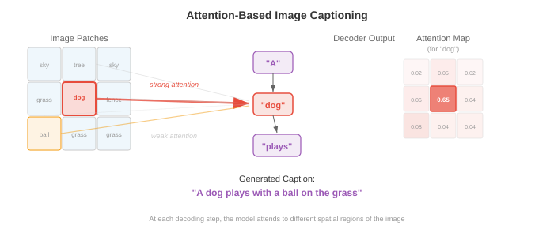
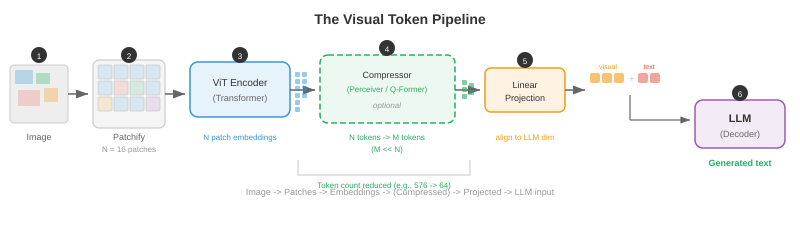

# 视觉语言模型

*视觉语言模型共同理解图像和文本，实现视觉问答、图像描述和视觉推理。本文件涵盖 VQA、图像描述、视觉定位，以及 VisualBERT、BLIP、LLaVA、Flamingo、PaLI 和 Qwen-VL 等将视觉编码器与大型语言模型融合的架构。*

- 想象一位博物馆导览员，他能看着一幅画并清晰描述画中的一切：有哪些物体、讲述了什么故事、传达了怎样的情感，还能回答参观者的任何问题。**视觉语言模型（VLM）** 就是计算领域的等价物——一个能同时理解图像和文本的系统，能够描述视觉场景、回答相关问题、执行视觉指令，甚至根据自然语言查询在图像中定位特定物体。

- VLM 位于你在第 8 章学到的视觉编码器和第 7 章的语言模型的交汇点。核心工程挑战在于桥接两个截然不同的表征世界：视觉骨干网络产生的空间化、连续的 feature map，与语言模型产生的序列化、离散的 token 嵌入。本文件中的每一种架构，本质上都是对同一个问题的不同回答：如何融合视觉和语言？


## 视觉问答

- 想象有人向你展示一张照片并问："公园里有几只狗？"你毫不费力地解析图像、定位狗、数出数量并给出答案。**视觉问答（VQA）** 将这一过程形式化：给定一张图像 $I$ 和一个自然语言问题 $q$，预测答案 $a$。

- 该任务可以有多种定义方式。最常见的方式将 VQA 视为**开放式分类**：模型从最常见的答案构成的固定词汇表中选择（例如 VQA v2 中排名前 3,129 的答案）。另一种方式是**生成式回答**，模型生成自由形式的文本字符串——这是现代 VLM 采用的方法。

- 形式上，你需要学习一个最大化正确答案似然的函数 $f(I, q) \to a$。在分类设置中，这变为：

$$p(a \mid I, q) = \text{softmax}(W \cdot g(v, h))$$

- 其中 $v$ 是视觉特征向量（来自 CNN 或 ViT），$h$ 是问题编码（来自 LSTM 或 Transformer），$g$ 是融合函数。$g$ 的设计正是真正的架构创造力所在。

- **VQA v1**（Antol 等人，2015）引入了该基准，包含来自 MS COCO 的 204,000 张图像上的 614,000 个问题。研究人员很快发现，模型可以通过利用**语言先验**达到惊人高的准确率——对"多少个"问题回答"2"，对"有没有"问题回答"是"，甚至不需要看图像。

- **VQA v2**（Goyal 等人，2017）通过为每个问题配对不同答案的两张相似图像来解决这个问题。这迫使模型真正将其推理建立在视觉内容之上。平衡配对设置使数据集规模大约翻倍，并使纯语言捷径的效果大打折扣。

- 其他重要的 VQA 数据集包括 **GQA**（Hudson & Manning，2019），包含需要多步推理的组合性问题；**OK-VQA**（Marino 等人，2019），需要超出图像范围的外部知识；以及 **TextVQA**（Singh 等人，2019），答案依赖于读取图像中的文字。


- 早期的 VQA 模型使用简单策略：从预训练 CNN 中提取图像特征（通常是第 8 章中 ResNet 或 VGGNet 的倒数第二层），用 LSTM（第 6 章）对问题进行编码，然后将它们组合。组合函数 $g$ 演变迅速：从简单的逐元素乘法，到双线性池化，再到多模态 Tucker 分解。**双线性注意力**计算 $v^T W h$，其中 $W$ 是可学习的交互矩阵，但完整的双线性形式有 $O(d_v \times d_h)$ 个参数，规模过大。**MLB**（多模态低秩双线性池化）将其分解为两个低秩投影，使其变得可行。

- VQA 的突破是注意力机制。**堆叠注意力网络**（Yang 等人，2016）使用问题编码在空间图像区域上施加注意力，迭代式地精炼需要关注的图像部分。这个思想——让问题"关注"相关图像区域——成为了标准做法。

## 图像描述

- 想象一位朋友看着你的度假照片并叙述他们所看到的："一只金毛猎犬在阳光明媚的沙滩上接飞盘。"**图像描述**是生成图像的自然语言描述的任务。与 VQA 不同，这里没有提问——模型必须自行决定哪些内容值得描述。

- **Show and Tell**（Vinyals 等人，2015）建立了描述任务的标准编码器-解码器架构。CNN 编码器（如 Inception 或 ResNet）生成一个单一图像特征向量 $v$。该向量被用作 LSTM 解码器的初始隐藏状态，然后逐词自回归地生成描述：

$$p(w_t \mid w_{1:t-1}, I) = \text{LSTM}(w_{t-1}, h_{t-1})$$

- 整个模型通过最大化真实描述的对数似然进行端到端训练。推理时使用束搜索（第 7 章）来找到高概率的描述。

- Show and Tell 的问题在于整张图像被压缩成一个单一向量。对于复杂场景，单一向量无法捕捉所有相关细节。你会丢失空间信息——模型在生成不同词语时无法"回看"图像的特定区域。

- **Show, Attend and Tell**（Xu 等人，2015）通过引入**图像区域上的注意力**解决了这个问题。模型不是将图像编码为一个向量，而是由 CNN 产生一个空间特征网格（例如来自 VGGNet 最后一个卷积层的 $14 \times 14 \times 512$）。在每个解码步骤，模型计算这些空间位置上的注意力权重，生成一个突出当前词语最相关区域的上下文向量。

- 回顾第 6 章的注意力机制：解码器隐藏状态充当查询，空间特征充当键和值，注意力权重告诉模型应该看哪里。作者提出了两种变体：**软注意力**（可微分，所有区域的加权平均）和**硬注意力**（对单个区域进行随机采样，使用 REINFORCE 训练）。



- 这些模型产生的注意力图具有显著的可解释性：生成"狗"时，注意力集中在狗的区域；生成"海滩"时，注意力转移到沙子和水面。这是注意力机制提供内置可解释性的最早令人信服的演示之一。

- **CIDEr**（Vedantam 等人，2015）、**METEOR**、**BLEU** 和 **SPICE** 是标准描述评估指标。CIDEr 计算生成描述与参考描述之间的 TF-IDF 加权 n-gram 相似度，专门为描述评估设计。现代 VLM 通常在 MS COCO Captions 和 NoCaps 等描述基准上用 CIDEr 进行评估。

- 后来的描述模型引入了**自底向上注意力**（Anderson 等人，2018），其中目标检测器（Faster R-CNN，第 8 章）首先提出显著的图像区域，然后描述模型在这些区域特征而非均匀网格上施加注意力。在基于 ViT 的编码器接管之前，这是主导方法。

## 架构模式

- 每个 VLM 都必须回答一个基本设计问题：视觉和语言在哪个节点交互？答案决定了模型的架构家族。有三种主要模式，各自具有不同的权衡。

### 双编码器

- 想象两位独立工作的译者——一位读法语文件，另一位读英语文件——他们各自用一种共享的"通用语言"生成摘要。他们在翻译过程中从不交流，但他们的摘要可以直接比较。这就是**双编码器**模式。

- 视觉编码器 $f_v$ 和文本编码器 $f_t$ 独立地将各自的输入映射到一个维度为 $d$ 的共享嵌入空间。图像嵌入为 $v = f_v(I) \in \mathbb{R}^d$，文本嵌入为 $t = f_t(q) \in \mathbb{R}^d$。相似度通过点积或余弦相似度计算：$\text{sim}(I, q) = v^T t / (\|v\| \|t\|)$。

- **CLIP**（Radford 等人，2021），在前一篇关于多模态表示的文件中已介绍，是典型的双编码器。它在从互联网抓取的 4 亿图像-文本对上使用对比目标函数（InfoNCE）进行训练。由于编码器相互独立，你可以预计算并缓存所有图像嵌入，使检索极其高效——搜索时只需对查询文本进行编码。

- 双编码器的缺点在于视觉和语言从未在特征层面进行交互。模型无法进行细粒度的跨模态推理：例如，它无法确定描述中的特定词是否对应图像中的特定区域。这限制了它在 VQA 或 grounded 描述等任务中的实用性。

### 融合编码器

- 现在想象两位译者共处一室，积极讨论两篇文件。他们可以指向特定段落、互相提问，并建立共同的理解。这就是**融合编码器**模式。

- 两种模态都被编码，然后通过**交叉注意力层**进行融合，其中一种模态的 token 关注另一种模态的 token。图像首先由视觉编码器处理为一系列 patch 或区域 token $V = [v_1, \ldots, v_N]$。文本被分词化为 $T = [t_1, \ldots, t_M]$。在融合层中，文本 token 通过交叉注意力关注图像 token：

$$\text{CrossAttn}(T, V) = \text{softmax}\!\left(\frac{(TW_Q)(VW_K)^T}{\sqrt{d_k}}\right)(VW_V)$$

- 这实现了细粒度的交互：每个文本 token 都可以关注其所需的特定图像区域。**VisualBERT**、**VilBERT** 和 **UNITER** 等模型使用这种模式。代价是你无法为检索预计算独立的嵌入——每个图像-文本对都需要通过融合层进行完整的前向传播。


### 编码器-解码器

- **编码器-解码器**模式将视觉编码器与自回归生成输出 token 的文本解码器相结合，类似于第 7 章中的 seq2seq 模型。视觉编码器产生上下文图像表征，文本解码器在生成输出文本时对其执行交叉注意力。

- 这种模式天然支持生成式任务：图像描述、自由形式答案的 VQA 以及视觉对话。**GIT**（Generative Image-to-text Transformer，Wang 等人，2022）、**CoCa**（Contrastive Captioner，Yu 等人，2022）和 **PaLI** 使用这种架构。CoCa 巧妙地将双编码器和编码器-解码器模式结合起来：文本解码器的前半部分作为单模态文本编码器（用于对比学习），而后半部分对图像特征执行交叉注意力（用于生成式描述），兼得两者之优势。

- 这三种模式的选择取决于目标任务。双编码器最适合大规模检索。融合编码器最适合细粒度理解任务。编码器-解码器对于生成任务最为通用。现代最先进的 VLM 越来越多地采用编码器-解码器或仅解码器范式，将每项视觉语言任务都视为文本生成。

## Flamingo：少样本多模态学习

- 想象一位经验丰富的专家，经过多年对艺术和文学的研究，只需要看一两个例子就能优雅地描述一种全新的绘画风格。**Flamingo**（Alonso 等人，2022，DeepMind）基于相同原理构建：它利用强大的预训练语言模型和预训练视觉编码器，通过轻量级架构组件将其连接，实现多模态任务上的少样本学习。

- Flamingo 的设计理念保守而有效：保持预训练的视觉编码器（NFNet）和语言模型（Chinchilla）冻结，仅学习连接它们的"胶水"。这种胶水由两个组件组成：**Perceiver 重采样器**和**门控交叉注意力层**。

- **Perceiver 重采样器**将视觉编码器的变长输出（取决于图像分辨率）压缩为一组固定数量的 $N$ 个视觉 token（通常 $N = 64$）。它的工作原理是初始化一组 $N$ 个可学习的查询向量，并使用交叉注意力让这些查询关注完整的视觉编码器输出。这本质上是 Perceiver 架构（Jaegle 等人，2021）作为瓶颈的应用——无论输入图像大小如何，它都能生成紧凑的、固定大小的视觉表示。

$$z = \text{CrossAttn}(Q_{\text{learned}}, V_{\text{image}}) \in \mathbb{R}^{N \times d}$$

- **门控交叉注意力层**交错插入在冻结的语言模型层之间。在每个这样的层中，语言模型的文本 token 对 Perceiver 重采样器产生的视觉 token 执行交叉注意力。关键之处在于，每个门控交叉注意力层包含一个可学习的标量门控 $\alpha$，初始化为零，将交叉注意力输出乘以 $\alpha$ 后再加到残差流中：

$$\hat{x} = x + \alpha \cdot \text{CrossAttn}(x, z)$$

- 初始化 $\alpha = 0$ 意味着训练开始时交叉注意力不贡献任何信息，模型行为与原始的冻结语言模型完全相同。门控在训练过程中逐渐打开，平滑地整合视觉信息，同时不破坏语言模型的预训练表示。


- Flamingo 原生支持**交错图像-文本序列**。你可以向它输入包含多张图像穿插文本的提示，例如："[图像 1] 这是一只猫。[图像 2] 这是一只狗。[图像 3] 这是一个 ___。"模型将每张图像通过视觉编码器和 Perceiver 重采样器处理，得到的视觉 token 插入到文本序列中的对应位置。语言模型的因果注意力掩码确保每个文本 token 只能关注当前及之前图像的视觉 token。

- 这种交错机制实现了强大的**少样本多模态学习**。通过在上下文中提供少量图像-文本示例，Flamingo 可以在没有任何梯度更新的情况下执行新任务。在 VQAv2、OK-VQA 和描述等基准上，具有 800 亿参数的 Flamingo 实现了最先进的少样本性能，仅需 4 到 32 个示例即可匹配甚至超越经过微调的专家模型。

## LLaVA 与视觉指令微调

- 想象你有一位出色的语言专家（一个 LLM）和一位出色的艺术评论家（一个视觉编码器）。如果你能教会艺术评论家"说语言专家的语言"，他们就可以无缝协作。**LLaVA**（Large Language and Vision Assistant，Liu 等人，2023）正是这样做的：它使用一个简单的线性层将视觉特征投影到 LLM 的 token 嵌入空间，然后在指令遵循数据上微调整个系统。

- LLaVA 的架构出奇地简单。图像由一个预训练的 CLIP ViT-L/14 视觉编码器编码为一个 patch 特征网格 $V \in \mathbb{R}^{N \times d_v}$，其中 $N = 256$ 个 patch（对于 336px 图像和 14px patch）。一个**投影层** $W$ 将这些视觉特征映射到 LLM 的嵌入维度：

$$H_v = VW, \quad W \in \mathbb{R}^{d_v \times d_{\text{LLM}}}$$

- 投影后的视觉 token $H_v$ 直接与文本 token 嵌入拼接，作为一个单一序列输入到 LLM（Vicuna，一个微调后的 LLaMA）。LLM 使用其标准因果自注意力处理它们——没有特殊的交叉注意力层，没有 perceiver，只有拼接。视觉 token 被当作恰好编码了视觉信息的文本 token 来处理。


- **视觉指令微调**是 LLaVA 的关键训练创新。作者使用 GPT-4 从 COCO 图像生成了 158,000 个多模态指令遵循示例。每个示例包含一张图像和一个对话式指令（例如"详细描述这张图像"、"这张图像有什么不寻常之处？"、"如果我是一名游客参观这个地方，我应该知道什么？"）。模型接受训练，根据图像和指令生成 GPT-4 撰写的回答。

- 训练分为两个阶段。**阶段 1（预训练）**：仅训练投影层 $W$，使用图像-描述对（来自 CC3M 的 595K 数据），视觉编码器和 LLM 都保持冻结。这教会 $W$ 将视觉特征与 LLM 的嵌入空间对齐。**阶段 2（微调）**：投影层和 LLM 在指令遵循数据上联合微调，视觉编码器保持冻结。这教会模型遵循复杂的视觉指令。

- **LLaVA-1.5** 通过三项关键更改改进了原始版本：将单层线性投影替换为两层 MLP（更具表现力的映射），使用更高分辨率的图像（336px 而非 224px，产生更多 patch token），以及在训练混合数据中加入学术 VQA 数据集。这些看似细微的修改带来了基准性能的大幅提升。

- LLaVA 的方法证明，你不需要像 Flamingo 的 Perceiver 重采样器或门控交叉注意力那样复杂的架构创新。一个简单的线性投影，结合高质量的指令微调数据，就足以有效地将视觉编码器连接到 LLM。这种简洁性使得 LLaVA 极具影响力——后续大多数开源 VLM 都遵循类似的方案。

## 扩展视觉语言模型

- 该领域从概念验证型 VLM 迅速发展为在数十亿图像-文本对上训练的工业级系统。三个模型家族展示了不同的扩展方法。

### PaLI

- **PaLI**（Pathways Language and Image model，Chen 等人，2022，Google）同时扩展视觉编码器和语言模型。PaLI 使用 ViT-e（40 亿参数）作为视觉编码器，mT5（130 亿参数）作为语言模型，总计 170 亿参数。图像被编码为一系列 patch token，拼接在文本 token 之前，输入到编码器-解码器架构的 mT5。

- PaLI 的关键洞见是**扩展视觉编码器与扩展语言模型同样重要**。先前的工作通常使用固定的、中等规模的视觉骨干网络（如 ViT-B 或 ViT-L），将参数预算全部投入 LLM。PaLI 表明，一个 40 亿参数的 ViT-e，在 JFT-4B（40 亿张标注图像）上预训练后，能够显著提升 OCR 和空间推理等细粒度视觉任务的性能。

- PaLI 在 WebLI（一个包含 109 种语言、100 亿图像-文本对的数据集）上训练，因此天然具备多语言能力。模型通过混合任务进行预训练：图像描述、VQA 和图像-文本匹配，全部作为文本到文本生成任务（遵循第 7 章的 T5 范式）。**PaLI-X**（550 亿参数）和 **PaLI-3**（50 亿，使用 SigLIP 作为视觉编码器）是后续迭代版本。

### Qwen-VL

- **Qwen-VL**（Bai 等人，2023，阿里巴巴）在 Qwen LLM 基础上增加了一个 ViT 视觉编码器和一个单层交叉注意力模块（类似于 Flamingo 的 Perceiver 重采样器），将视觉编码器的输出压缩为一组固定的 256 个视觉 token。视觉 token 与文本 token 拼接后由 Qwen LLM 处理。

- Qwen-VL 的训练采用三阶段方案。阶段 1：在 14 亿个弱监督图像-文本对上预训练，仅解冻视觉编码器。阶段 2：在更高质量的数据上进行多任务预训练，包括 VQA、描述、定位和 OCR 数据集，整个模型解冻。阶段 3：在指令遵循和对话数据上进行监督微调。这种从噪声网络数据到精选指令数据的渐进式精炼，是大多数现代 VLM 共享的模式。

- **Qwen2-VL**（2024）引入了**动态分辨率**支持：模型不是将所有图像缩放到固定大小，而是通过动态调整视觉 token 数量以原始分辨率处理图像。更高分辨率的图像产生更多 token，更低分辨率的图像产生更少 token。这在不浪费低分辨率输入计算量的前提下，提升了文档理解和细粒度识别等对细节敏感的任务的性能。

### InternVL

- **InternVL**（Chen 等人，2024，上海人工智能实验室）激进地扩展了视觉编码器，使用 InternViT-6B——一个 60 亿参数的视觉 Transformer——与语言模型配对。关键的架构贡献是**动态高分辨率处理**：图像被分割为 448x448 像素的图块，每个图块由视觉编码器独立处理，得到的图块特征与完整图像的缩略图特征拼接。这使得模型能够处理任意宽高比和分辨率的图像。

- InternVL-2 进一步引入了**渐进对齐训练**：首先用对比目标（如 CLIP）对齐视觉编码器，然后通过轻量级 MLP 连接器将其连接到 LLM，最后在指令数据上进行端到端微调。这种渐进策略防止了视觉编码器预训练表示的灾难性遗忘。


- 所有三个模型家族的一个共同主题是**训练数据精选**的重要性。从网络抓取的原始图像-文本对是噪声大且常常不对齐的。后续的训练阶段逐步过滤和精炼数据，从数十亿噪声对过渡到数百万高质量指令示例。最终微调数据的质量往往比模型的原始参数数量更为重要。

## 定位与指代

- 想象你在人群中指着一个人说"戴红帽子的女士"。你在用语言指代一个特定的空间区域。**视觉定位**是相反的过程：给定一张图像和一个自然语言表述，模型必须识别（定位）所指的对象。**指代表达理解**产生边界框；**指代表达分割**产生像素掩码。

- 形式上，给定一张图像 $I$ 和一个指代表达 $r$（例如"左边那只大型棕色狗"），模型预测一个边界框 $b = (x, y, w, h)$ 或一组定位所引用对象的坐标。数据集包括 **RefCOCO**、**RefCOCO+** 和 **RefCOCOg**，每个数据集包含具有多个对象的图像以及每个对象的明确指代表达。

- 早期的定位模型使用两阶段方法：首先生成区域提议（使用 Faster R-CNN 或类似方法），然后使用融合模型对每个提议与语言查询进行评分。评分最高的区域即为预测结果。这种方法计算代价高昂，且受限于提议的质量。

- 现代 VLM 将定位直接整合到生成式框架中。关键思想是将边界框坐标表示为**文本 token**。你将连续的坐标空间离散化为槽位（例如 $x, y, w, h$ 各 1000 个槽位），并向词汇表中添加特殊的位置 token，如 `<loc_342>`。然后模型通过输出一系列位置 token 来生成边界框：

$$\text{输出: } \texttt{<loc\_102><loc\_215><loc\_487><loc\_398>}$$

- 这种 token 化技巧使得任何自回归语言模型无需架构更改即可执行定位——它只需学会"说坐标"。**Pix2Seq**（Chen 等人，2022）率先将这种方法用于目标检测，而 Qwen-VL、Ferret 和 Kosmos-2 等模型将其扩展到指代表达理解和短语定位。

- **Kosmos-2**（Peng 等人，2023，Microsoft）通过将空间位置表示为嵌入在生成文本中的特殊 token，为多模态 LLM 增加了定位能力。例如，它可以生成："一只 `<phrase>` 金毛猎犬 `</phrase>` `<box>` `<loc_102>` `<loc_215>` `<loc_487>` `<loc_398>` `</box>` 正在接飞盘。"这种文本和空间 token 的交错融合实现了同步描述和定位。


- **定点指向**将定位更进一步：模型不再输出边界框，而是预测一个单一的点（通常是指代物体的中心）。这对于交互式应用非常有用，例如用户问"最近的出口在哪里？"，模型返回一个叠加在图像上的坐标。**Shikra** 和 **Ferret** 等模型支持基于点的指代以及基于框的定位。

## 免 OCR 文档理解

- 传统的文档理解流水线很复杂：首先运行 OCR 引擎提取文本和布局，然后将提取的文本输入语言模型。这种多阶段方法很脆弱——OCR 错误向下游传播，空间布局信息常常丢失或表征不良。如果模型能像人类一样直接从像素中读取信息呢？

- **Donut**（Document Understanding Transformer，Kim 等人，2022）完全消除了 OCR。它使用 Swin Transformer（第 8 章）作为视觉编码器处理文档图像，并使用 BART 风格的 Transformer 解码器直接从视觉特征生成结构化文本输出。解码器可以根据任务生成 JSON、键值对或纯文本。

- Donut 的训练分为两个阶段。**预训练**：模型通过执行合成 OCR 来学习阅读——给定一张文档图像，生成完整的文本内容。这在从文本语料库渲染的数百万张合成文档图像上进行训练，教会视觉编码器识别字符、字体和布局。**微调**：模型通过训练生成特定于任务的结构化输出，适应特定的下游任务，如收据解析、表格理解或文档分类。

- Donut 解码器使用特殊的提示方案：任务由提示 token 指定（例如分类用 `<doc_class>`，收据解析用 `<parse_receipt>`），模型根据此提示生成输出。这种统一接口使得单个模型可以处理多种文档理解任务。

- **Pix2Struct**（Lee 等人，2023，Google）将免 OCR 思想应用于网页理解和图表/图形理解。关键的预训练目标是**截图解析**：给定一个网页的带掩码截图，模型生成产生可见区域的底层 HTML。这教会模型理解视觉呈现与结构化标记之间的关系。

- Pix2Struct 引入了**可变分辨率输入处理**：它并不是将所有图像缩放到固定大小（这会扭曲宽高比并破坏精细文字），而是在保持原始宽高比的同时将图像打包为固定数量的 patch。一个高而窄的文档产生一个高而窄的 patch 网格。这对于文档理解至关重要，因为宽高比携带着语义信息（收据窄而高；表格宽而短）。


- **Nougat**（Blecher 等人，2023，Meta）将 Donut 架构专门应用于学术论文，直接从 PDF 页面图像生成完整的 LaTeX 标记。它可以处理复杂的数学方程、表格和图形——这些任务正是传统 OCR 流水线难以应付的。该模型在 PDF 页面图像及其对应的 LaTeX 源代码对上进行训练。

- 免 OCR 模型的成功展示了深度学习中的一个更广泛原则：直接从原始输入（像素）学习的端到端模型通常优于复杂的多阶段流水线，因为它们可以联合优化所有组件，并学习专门针对最终任务定制的表示。中间的 OCR 步骤是一个瓶颈，限制了模型能够学习的内容。

## 视觉 Token 流水线

- 无论架构家族如何，每个 VLM 都必须将图像转换为语言模型可以处理的一系列 token。理解这一流水线至关重要。不同模型的处理过程有所差异，但总体流程如下：

- **第 1 步：Patch 提取。** 图像（高度 $H$，宽度 $W$）被划分为不重叠的、大小为 $P \times P$ 的 patch，产生 $N = HW / P^2$ 个 patch。对于 336x336 图像和 14x14 patch，$N = 576$。

- **第 2 步：视觉编码。** 每个 patch 经过线性投影并通过视觉编码器（通常是 ViT）。输出是一系列上下文 patch 嵌入 $V = [v_1, \ldots, v_N] \in \mathbb{R}^{N \times d_v}$。这些嵌入既携带局部外观信息，也携带全局上下文（来自自注意力）。

- **第 3 步：Token 压缩（可选）。** 一些模型将 $N$ 个视觉 token 压缩为更少的 $M \ll N$ 个 token，以减少语言模型的计算负担。Flamingo 使用 Perceiver 重采样器（$M = 64$）；Qwen-VL 使用交叉注意力（$M = 256$）；**Q-Former**（在 BLIP-2 中使用，Li 等人，2023）使用一组 $M = 32$ 个可学习查询 token，对视觉编码器的输出执行交叉注意力。

- **第 4 步：投影。** 视觉 token（全部或压缩后的集合）通过线性层或 MLP 投影到语言模型的嵌入空间。投影后，视觉 token 与文本 token 嵌入具有相同维度，可以与它们拼接。

- **第 5 步：注入 LLM。** 投影后的视觉 token 在特殊 `<image>` 占位符 token 的位置插入到 token 序列中，组合后的序列由语言模型处理。LLM 的自注意力使文本 token 能够关注视觉 token，反之亦然。



- 视觉 token 的数量直接影响计算成本。每个视觉 token 参与 LLM 的自注意力，其复杂度与序列长度的平方成正比。具有多个 patch 的高分辨率图像可能产生数百或数千个视觉 token，占据 LLM 上下文窗口的主导地位。这就是 token 压缩的重要性所在：将 576 个视觉 token 减少到 64 个，可将视觉部分在注意力中的贡献减少约 9 倍。

- **BLIP-2**（Li 等人，2023）以其高效的桥接策略而闻名。它引入了一个轻量级的 **Q-Former**（一个带有可学习查询的小型 Transformer），位于冻结的视觉编码器和冻结的 LLM 之间。Q-Former 是唯一可训练的组件——视觉编码器和 LLM 都保持冻结。它的预训练分为两个阶段：首先是图像-文本对比学习、匹配和描述目标（连接视觉编码器），然后是语言生成目标（连接 LLM）。这种模块化设计使得 BLIP-2 可以将任何视觉编码器插入到任何 LLM 中。

## 训练目标

- VLM 使用多种目标的组合进行训练，具体取决于架构模式：

- **图像-文本对比损失（ITC）：** 在共享嵌入空间中对齐图像和文本表示，如 CLIP 中所示。这是双编码器的主要目标，也常被用作融合模型的预训练目标。该损失就是上一篇文件中的 InfoNCE 损失。

- **图像-文本匹配（ITM）：** 一个二分类目标——给定图像和文本，预测它们是否匹配。困难负样本（与不同图像配对的相似文本）使这项任务具有挑战性，迫使模型学习细粒度的对齐。

- **语言建模（LM）：** 标准的自回归语言建模目标——给定之前的所有 token 预测下一个 token。对于 VLM，"之前的 token" 包括视觉 token，因此模型学习在视觉输入条件下生成文本。这是编码器-解码器和仅解码器 VLM 的主要目标。

$$\mathcal{L}_{\text{LM}} = -\sum_{t=1}^{T} \log p(w_t \mid w_{<t}, V)$$

- **前缀语言建模：** 一种变体，其中图像和文本前缀作为上下文提供（不进行训练），模型仅训练生成后续部分。这用于 PaLI 和 SimVLM 等模型。

- 大多数现代 VLM 在预训练期间结合多个目标（例如 BLIP 中的 ITC + ITM + LM，CoCa 中的 ITC + LM），然后在指令数据上使用纯 LM 目标进行微调。

## 编程练习（使用 CoLab 或 notebook）

1. 实现一个简单的基于注意力的图像描述解码器。使用随机的"图像特征"作为编码器输出，训练解码器生成固定的描述，观察注意力权重在每个解码步骤如何跨空间位置移动。
```python
import jax
import jax.numpy as jnp
import matplotlib.pyplot as plt

# 模拟 4x4 空间网格的图像特征（16 个区域，dim=32）
key = jax.random.PRNGKey(42)
k1, k2, k3 = jax.random.split(key, 3)
img_features = jax.random.normal(k1, (16, 32))  # 16 个空间区域，32 维

# 词汇表：0=<start>, 1="a", 2="red", 3="car", 4=<end>
vocab_size, embed_dim, hidden_dim = 5, 16, 32
W_embed = jax.random.normal(k2, (vocab_size, embed_dim)) * 0.1
W_attn_q = jax.random.normal(k3, (hidden_dim, 32)) * 0.1  # 查询投影

def attend(h, img_feats, W_q):
    """在给定解码器状态 h 的情况下计算图像特征上的软注意力。"""
    query = h @ W_q  # (32,)
    scores = img_feats @ query  # (16,)
    weights = jax.nn.softmax(scores)  # (16,)
    context = weights @ img_feats  # (32,)
    return context, weights

# 简单的 GRU 风格步骤（为说明目的，仅用线性 + tanh）
W_h = jax.random.normal(jax.random.PRNGKey(0), (embed_dim + 32, hidden_dim)) * 0.1

def decode_step(h, word_idx, img_feats):
    context, attn_weights = attend(h, img_feats, W_attn_q)
    word_emb = W_embed[word_idx]  # (16,)
    inp = jnp.concatenate([word_emb, context])  # (48,)
    h_new = jnp.tanh(inp @ W_h)  # (32,)
    return h_new, attn_weights

# 运行解码序列：<start> -> "a" -> "red" -> "car" -> <end>
target_seq = [0, 1, 2, 3, 4]
h = jnp.zeros(hidden_dim)
all_attn = []
for word_idx in target_seq[:-1]:
    h, attn_w = decode_step(h, word_idx, img_features)
    all_attn.append(attn_w)

# 可视化每一步的注意力图（重塑为 4x4 网格）
words = ["<start>", "a", "red", "car"]
fig, axes = plt.subplots(1, 4, figsize=(14, 3))
for i, (ax, w) in enumerate(zip(axes, words)):
    ax.imshow(all_attn[i].reshape(4, 4), cmap='viridis')
    ax.set_title(f'生成"{w}"后\n关注的区域')
    ax.axis('off')
plt.suptitle('每个解码步骤的图像区域注意力')
plt.tight_layout(); plt.show()
# 尝试修改 img_features，观察注意力模式如何变化！
```

2. 模拟视觉 token 流水线：将图像划分为 patch，将 patch 投影到嵌入空间，与文本 token 嵌入拼接，并在组合序列上运行单层自注意力。
```python
import jax
import jax.numpy as jnp
import matplotlib.pyplot as plt

key = jax.random.PRNGKey(7)

# 创建一个合成的 8x8 "图像"，3 个通道
k1, k2, k3, k4 = jax.random.split(key, 4)
image = jax.random.uniform(k1, (8, 8, 3))

# 第 1 步：划分为 4x4 patch -> 4 个 patch
patch_size = 4
patches = image.reshape(2, patch_size, 2, patch_size, 3)
patches = patches.transpose(0, 2, 1, 3, 4).reshape(4, patch_size * patch_size * 3)  # (4, 48)
print(f"Patch 数量: {patches.shape[0]}, Patch 维度: {patches.shape[1]}")

# 第 2 步：将 patch 投影到嵌入维度 (d=16)
d_model = 16
W_patch = jax.random.normal(k2, (patches.shape[1], d_model)) * 0.1
visual_tokens = patches @ W_patch  # (4, 16)

# 第 3 步：创建文本 token 嵌入（模拟 3 个文本 token）
text_tokens = jax.random.normal(k3, (3, d_model)) * 0.1

# 第 4 步：拼接视觉 + 文本 token
combined = jnp.concatenate([visual_tokens, text_tokens], axis=0)  # (7, 16)
print(f"组合序列长度: {combined.shape[0]} (4 个视觉 + 3 个文本)")

# 第 5 步：在组合序列上运行单头自注意力
W_Q = jax.random.normal(k4, (d_model, d_model)) * 0.1
k5, k6 = jax.random.split(k4)
W_K = jax.random.normal(k5, (d_model, d_model)) * 0.1
W_V = jax.random.normal(k6, (d_model, d_model)) * 0.1

Q = combined @ W_Q
K = combined @ W_K
V = combined @ W_V
attn_scores = (Q @ K.T) / jnp.sqrt(d_model)
attn_weights = jax.nn.softmax(attn_scores, axis=-1)  # (7, 7)

output = attn_weights @ V  # (7, 16)

# 可视化跨模态注意力模式
labels = ['V1', 'V2', 'V3', 'V4', 'T1', 'T2', 'T3']
fig, ax = plt.subplots(figsize=(6, 5))
im = ax.imshow(attn_weights, cmap='Blues')
ax.set_xticks(range(7)); ax.set_xticklabels(labels)
ax.set_yticks(range(7)); ax.set_yticklabels(labels)
ax.set_xlabel('键'); ax.set_ylabel('查询')
ax.set_title('自注意力：视觉（V）和文本（T）Token')
plt.colorbar(im, ax=ax); plt.tight_layout(); plt.show()
# 观察：文本 token 关注视觉 token（跨模态注意力）！
```

3. 实现用于视觉定位的坐标 token 化。给定一个边界框，将其转换为离散 token；给定离散 token，重构边界框。在不同槽位分辨率下可视化量化误差。
```python
import jax.numpy as jnp
import matplotlib.pyplot as plt

def encode_bbox(bbox, num_bins=1000):
    """将连续的边界框 (x, y, w, h)（在 [0,1] 范围内）转换为离散 token。"""
    tokens = jnp.round(jnp.array(bbox) * (num_bins - 1)).astype(jnp.int32)
    return tokens

def decode_bbox(tokens, num_bins=1000):
    """将离散 token 转换回连续的边界框。"""
    return tokens.astype(jnp.float32) / (num_bins - 1)

# 真实边界框（归一化到 [0, 1]）
gt_bbox = jnp.array([0.123, 0.456, 0.333, 0.222])

# 测试不同槽位分辨率下的量化
bin_sizes = [10, 50, 100, 500, 1000]
errors = []
for n_bins in bin_sizes:
    tokens = encode_bbox(gt_bbox, n_bins)
    reconstructed = decode_bbox(tokens, n_bins)
    error = jnp.max(jnp.abs(gt_bbox - reconstructed))
    errors.append(float(error))
    print(f"槽位数={n_bins:>5d} | Token={tokens} | "
          f"重构={reconstructed} | 最大误差={error:.6f}")

fig, ax = plt.subplots(figsize=(8, 4))
ax.plot(bin_sizes, errors, 'o-', color='#e74c3c', linewidth=2, markersize=8)
ax.set_xlabel('槽位数'); ax.set_ylabel('最大量化误差')
ax.set_title('边界框量化误差 vs 槽位分辨率')
ax.set_xscale('log'); ax.set_yscale('log')
ax.grid(True, alpha=0.3); plt.tight_layout(); plt.show()
# 尝试：槽位非常少时（如 5）会发生什么？误差在何时是可接受的？
```
