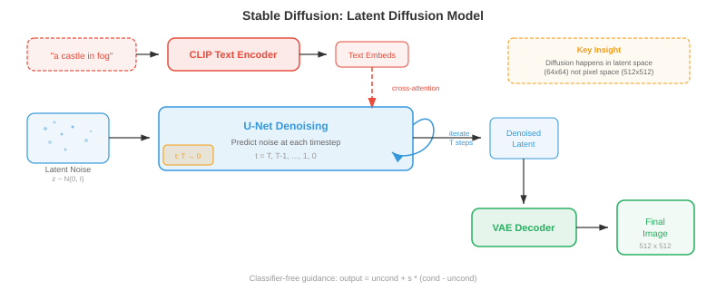
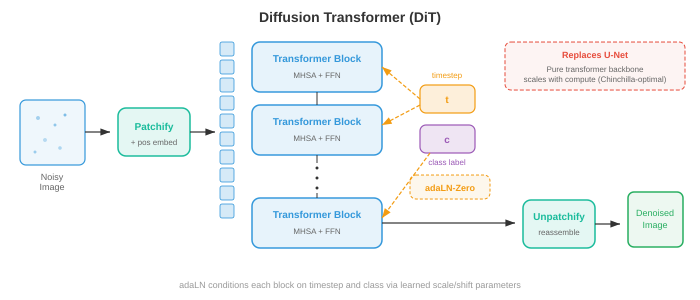

# 跨模态生成 (Cross-Modal Generation)

*跨模态生成（cross-modal generation）是指以某一模态的输入为条件，生成另一模态的输出——从文生图、图生文、文生音频，乃至更多。本章涵盖 DALL·E、Stable Diffusion、无分类器引导、ControlNet、图像描述、文生视频（Sora）以及文生音频生成。*

- 在本章的文件 01-03 中，你已经学习了如何表示、对齐和分词不同模态。现在轮到创造性的环节了：从一个模态生成另一个模态。跨模态生成是文生图工具、视频合成系统、音乐创作模型和图像描述背后的引擎。可以将其理解为教会机器成为多媒体艺术家——你用文字描述你想要的内容，机器则负责绘画、动画或作曲。

- 核心思想是**条件生成（conditional generation）**：给定来自模态 $A$（例如文本）的输入，生成模态 $B$（例如图像）的输出。形式上，我们学习模型 $p_\theta(y \mid x)$，其中 $x$ 是条件信号，$y$ 是生成的输出。挑战在于这个条件分布极其复杂且维度极高——一张 512x512 的图像存在于 $\mathbb{R}^{786432}$ 中，而对于同一个文本提示，可能有无数张合理的图像。


## 文生图生成 (Text-to-Image Generation)

- 想象你向法庭素描师描述一个场景。素描师必须理解你的话，回忆物体长什么样，在空间上排布它们，最后画出最终的图画。文生图模型正是做这件事，但它们必须从数据中学习所有这些技能，而不是经过多年的艺术院校训练。

### DALL·E：自回归图像生成

- **DALL·E**（Ramesh 等人，2021）将图像生成视为一个序列预测问题——这正是语言模型所采用的范式（见第 07 章）。其关键洞察是：如果你能将图像表示为离散 token（回顾文件 03 中的 VQ-VAE），那么生成图像就只是逐个生成 token 序列的过程。

- 其流程分为两个阶段。首先，一个**离散 VAE（dVAE）**将 256x256 的图像压缩成 32x32 的离散 token 网格，码本大小为 8192，将图像简化为 1024 个 token 的序列。其次，一个**Transformer 解码器**被训练来建模 256 个文本 token（BPE 编码）与 1024 个图像 token 拼接后的联合分布，总计 1280 个 token：

$$p(x_{\text{text}}, x_{\text{img}}) = \prod_{i=1}^{1280} p(x_i \mid x_1, \ldots, x_{i-1})$$

- 在生成时，输入文本 token，模型自回归地逐个采样图像 token。这种方法优雅之处在于它复用了语言建模的完整机制——注意力、因果掩码、top-k 采样——来完成图像合成。

- 缺点是自回归生成本质上是串行的：逐个生成 1024 个 token 速度很慢，而且序列早期的任何错误都会被放大。DALL·E 通过生成大量候选图像并用 CLIP（来自文件 01）进行重排序来缓解这一问题，以找到与文本提示最匹配的结果。


### Stable Diffusion：带文本条件的隐空间扩散

- **Stable Diffusion**（Rombach 等人，2022）采用了一种根本不同的方法。它不是逐个预测 token，而是从纯噪声开始，在文本提示的引导下逐步将噪声去噪成图像。回顾第 8 章中的扩散模型——Stable Diffusion 在压缩后的隐空间（latent space）而非像素空间中运行，因此效率大幅提升。

- 其架构由三个组件协同工作。**VAE 编码器**将图像从像素空间（$512 \times 512 \times 3$）压缩为隐空间表示（$64 \times 64 \times 4$），将维度降低了 48 倍。**文本编码器**（通常为 CLIP 或 OpenCLIP）将文本提示转换为嵌入向量序列。**U-Net 去噪器**接收含噪隐变量、时间步和文本嵌入，并预测每一步需要减去的噪声。文本条件通过**交叉注意力（cross-attention）**层进入 U-Net：

$$\text{Attention}(Q, K, V) = \text{softmax}\left(\frac{QK^T}{\sqrt{d}}\right)V$$

- 其中 $Q$ 来自含噪图像特征，$K$ 和 $V$ 来自文本嵌入。这使得模型能够在每个空间位置上关注相关的词语——当去噪"红球"应该出现的区域时，模型会关注"红"和"球"这两个 token。

- 在推理时，你在隐空间中采样 $z_T \sim \mathcal{N}(0, I)$，利用 U-Net 迭代去噪 $T$ 步（通常使用 DDIM 调度为 20-50 步），然后用 VAE 解码器将干净的隐变量 $z_0$ 解码回像素空间。整个前向过程在消费级 GPU 上仅需数秒即可生成一张 512x512 的图像。



### 无分类器引导的实践应用

- **无分类器引导（Classifier-Free Guidance，CFG）**是让文生图模型能够生成与提示真正匹配的图像的关键要素。回顾第 8 章，CFG 同时训练条件模型和无条件模型，然后在采样时放大条件信号：

$$\hat{\epsilon} = \epsilon_\theta(x_t, \varnothing) + s \cdot (\epsilon_\theta(x_t, c) - \epsilon_\theta(x_t, \varnothing))$$

- 其中 $s$ 是引导尺度。可以将 $(\epsilon_\theta(x_t, c) - \epsilon_\theta(x_t, \varnothing))$ 理解为"朝向提示的方向"——它捕捉了有条件预测与无条件预测之间的差异。乘以 $s > 1$ 会放大这个方向，将图像推近文本描述，但代价是多样性降低。

- 在实践中，Stable Diffusion 的常用默认值为 $s = 7.5$。当 $s = 1.0$ 时得到模型的原始输出（多样但仅松散匹配提示）。当 $s \geq 20$ 时图像变得过饱和且重复，但与文本高度一致。最优 $s$ 值取决于应用场景：创意探索倾向于较低的引导值，而精确遵循提示则需要更高的引导值。

### Imagen：基于语言理解的级联扩散

- **Imagen**（Saharia 等人，2022）证明了强大的文本编码器比更大的图像模型更重要。Imagen 没有使用 CLIP，而是采用一个冻结的 **T5-XXL** 语言模型（来自第 07 章）作为文本编码器，该模型对语言语义、组合性和空间关系（如"红色球体上的蓝色方块"）有着更丰富的理解。

- Imagen 使用了**级联扩散（cascaded diffusion）**方法：基础扩散模型生成 64x64 的图像，第一个超分辨率模型放大到 256x256，第二个超分辨率模型达到 1024x1024。每个阶段都是独立的扩散模型，以文本和（对于上采样器）低分辨率图像为条件。这种级联方式避免了在基础分辨率上建模精细细节，使基础模型能够专注于构图和语义，而上采样器则负责处理纹理和清晰度。

- Imagen 还引入了**动态阈值（dynamic thresholding）**：在每个去噪步骤中，预测的像素值被裁剪到基于百分位数的范围，而不是固定的 $[-1, 1]$ 范围。这可以防止在高引导尺度下出现饱和伪影，这是扩散模型中的常见问题。

### Parti：大规模自回归

- **Parti**（Pathways Autoregressive Text-to-Image，Yu 等人，2022）以超大尺度复兴了自回归方法。与 DALL·E 类似，它将图像转换为离散 token（使用 ViT-VQGAN），并用 Transformer 顺序生成。但 Parti 使用了 200 亿参数的编码器-解码器 Transformer（基于 Pathways 架构），并证明了自回归模型在充分扩展后可以达到扩散模型的质量。

- Parti 的编码器-解码器架构是与 DALL·E 纯解码器设计的关键区别。文本通过编码器处理；解码器在生成图像 token 时，通过交叉注意力关注编码后的文本。这类似于机器翻译（第 07 章）——你从"文本语言"翻译到"图像语言"。

### DiT 与基于流匹配的生成

- **扩散 Transformer（DiT）**（Peebles 和 Xie，2023）用纯 Transformer 替换了扩散模型中的 U-Net 主干网络。每个含噪隐空间块被当作一个 token（类似于第 8 章中的 ViT），Transformer 通过自注意力和对文本条件的交叉注意力来处理这些 token。DiT 表明，在扩散任务中，Transformer 的可扩展性比 U-Net 更具可预测性——计算量每翻一倍，FID 分数就会可靠地减半。

- **流匹配（flow matching）**（回顾第 8 章）已成为扩散噪声预测范式之外的一种替代方案。模型不再预测需要减去的噪声 $\epsilon$，而是预测一个速度场 $v_\theta(x_t, t)$，该速度场沿直线路径将样本从噪声传输到数据。**Stable Diffusion 3** 和 **Flux** 采用流匹配和**多模态 DiT（MM-DiT）**架构，其中文本和图像 token 由 Transformer 块通过双向注意力联合处理——两种模态互相关注，而不是文本仅通过交叉注意力作为图像特征的条件。



## 文生视频生成 (Text-to-Video Generation)

- 文生视频相当于文生图再加上一个严苛的额外约束：**时间连贯性（temporal coherence）**。每一帧必须在内部保持一致（是一张合理的图像），但连续帧之间也必须平滑连接——物体应该自然运动，光照应连续变化，"镜头"应遵循物理上合理的轨迹。可以想象一下绘制一幅风景画和导演一部电影之间的区别。

### 时间维度的挑战

- 视频引入了图像生成之外的三个挑战。**时间一致性（temporal consistency）**要求物体在各帧之间保持身份不变——第 1 帧中的狗在第 100 帧中应该还是同一条狗。**运动建模（motion modeling）**需要学习物理动态：物体如何运动、重力如何作用、流体如何流动。**计算成本**非常高昂：一段 24 fps、512x512 分辨率的 10 秒视频包含 $10 \times 24 \times 512 \times 512 \times 3 \approx 1.88$ 亿个值，大约是单张图像数据量的 240 倍。

### Make-A-Video 与延展至视频方法

- **Make-A-Video**（Singer 等人，2022）采用了一种务实的方法：从预训练的文生图模型开始，添加时间层。关键洞察是，你已经拥有了基于数十亿图文对训练的强大文生图模型，你只需要从（未标注的）视频数据中学习运动。

- Make-A-Video 在预训练的空间 U-Net 中插入了**时间注意力（temporal attention）**和**时间卷积（temporal convolution）**层。空间层（在图像上预训练）负责外观，而新的时间层（在视频上训练）负责运动。空间自注意力在每帧内部操作；时间注意力在每个空间位置上跨帧操作。这种分解是高效的，因为时间和空间模式在很大程度上是可分离的。

- 生成流程与 Imagen 的级联方式类似：基础模型生成 64x64 的 16 帧，然后空间和时间超分辨率模型将分辨率升级到最终大小和帧率。帧插值网络用于提高时间平滑性。

### VideoPoet 与基于 Token 的视频模型

- **VideoPoet**（Kondratyuk 等人，2024）将视频生成统一到语言建模范式之下。所有模态——文本、图像、视频、音频——都被 token 化为离散序列，一个单一的大语言模型（LLM）被训练来跨所有模态自回归地预测 token。这使得零样本能力成为可能：文生视频、图生视频、视频生音频、视频编辑和视频修补都可以从同一个模型中涌现。

- VideoPoet 使用 MAGVIT-v2 编码器（一个来自文件 03 的 3D VQ-VAE）对视频进行 token 化，该编码器联合压缩空间和时间维度。音频使用 SoundStream 进行 token 化。LLM 主干在文本上预训练，然后在多模态 token 序列上微调，学习跨模态的联合分布。

### Sora 风格的时间扩散

- **Sora**（OpenAI，2024）凭借其生成长时间、连贯、物理合理的视频的能力，将时间扩散带入了主流视野。虽然完整的架构细节尚未公开，但其关键思想是将 DiT 扩展到时空领域：视频帧被分解为**时空块（spacetime patches）**（跨越高度、宽度和时间的三维块），这些块被当作大型 Transformer 的 token 来处理。

- 时空块方法意味着模型将视频作为原生的 3D 信号来处理，而不是一系列 2D 帧。这使得模型能够捕获长程的时间依赖关系——模型可以"提前规划"整个视频时长，而不是逐帧生成。

- Sora 可以通过调整时空块的数量来处理可变的时长、分辨率和宽高比。以数据原生分辨率进行训练（而不是将所有图像裁剪为正方形）可以提高构图和取景质量。

### Wan：开源视频生成

- **Wan**（Wan 等人，2025）是一个开源视频生成模型系列（1.3B 和 14B 参数），基于 DiT 主干和 3D VAE 时间压缩。Wan 采用**流匹配**而不是传统的 DDPM 风格扩散，学习从噪声到视频隐空间的直线传输路径。3D VAE 在空间和时间上压缩视频（4 倍时间压缩），DiT 以全 3D 注意力处理生成的时空隐空间 token。

- Wan 支持文生视频、图生视频（将静态图像动画化）和视频编辑。14B 模型可以生成长达 5 秒、720p 分辨率的连贯视频，表明当架构和训练方案选择恰当时，开源模型可以接近专有系统的质量。


## 文生音频生成 (Text-to-Audio Generation)

- 想象一位电影配乐师阅读剧本并为电影配乐。文生音频模型做着类似的事情：给定一段文本描述（"伴有大雨和远处雷声的雷暴"），它们生成相应的音频波形。挑战在于弥合文本的离散、符号化本质与声音的连续、时间性本质之间的差距。

### AudioLM：音频的语言建模

- **AudioLM**（Borsos 等人，2023）通过自回归预测离散音频 token 来生成音频，采用了与 DALL·E 为图像所用的相同语言建模范式。它使用分层 token 结构：**语义 token**（来自自监督模型如 w2v-BERT，回顾第 9 章）捕获高层次内容（说了什么或演奏了什么），而**声学 token**（来自 SoundStream，一种神经音频编解码器）捕获细粒度的声学细节（听起来如何——音色、录音质量）。

- 生成分两个阶段进行。首先，一个 Transformer 在给定可选音频提示的情况下预测语义 token，建立高层次的"内容规划"。其次，另一个 Transformer 以语义 token 为条件预测声学 token，填充声学细节。这种层次结构类似于文生语音流程（第 9 章）——语义 token 扮演音素的角色，声学 token 扮演梅尔频谱图帧的角色。

- AudioLM 可以生成语音接续（给定 3 秒语音，生成接下来的 10 秒）、音乐接续和音效，所有这些都来自一个仅在音频数据上训练的模型（预训练不需要文本标签）。

### MusicLM：文本条件音乐生成

- **MusicLM**（Agostinelli 等人，2023）将 AudioLM 扩展到文本条件下的音乐生成。它添加了一个文本-音频联合嵌入（来自 **MuLan**，一个在音乐-文本对上训练的类 CLIP 模型）来条件化生成。MuLan 嵌入捕获文本描述的语义含义（"带有萨克斯独奏的欢快爵士乐"）并指导分层 token 生成。

- MusicLM 以 24 kHz 的频率生成任意时长的音乐，在数分钟长的作品中保持旋律和节奏的连贯性。它还可以用哼唱的旋律（由音高追踪器提取的旋律 token）加上文本描述作为条件，生成完整的编曲，既遵循哼唱的曲调，又符合文本描述的风格。

### MusicGen：高效单阶段生成

- **MusicGen**（Copet 等人，2023）简化了多阶段方法。MusicGen 不使用独立的语义和声学模型，而是使用一个单一的自回归 Transformer，直接生成来自音频编解码器的多个码本层级。关键创新是**交织码本模式（interleaved codebook pattern）**：MusicGen 并非在进入下一个时间步之前生成该时间步的所有码本层级，而是以某种模式跨码本和时间步交织 token，从而允许对某些码本层级进行并行解码。

- 条件化直接明了：文本由 T5 编码器编码，文本嵌入被前置到音频 token 序列之前（像语言模型中的前缀提示）或通过交叉注意力注入。MusicGen 还支持旋律条件化：参考旋律的色谱图（chromagram，来自第 9 章中讨论的频谱图特征）被编码后与文本条件一起使用。

$$p(a_1, \ldots, a_T) = \prod_{t=1}^{T} \prod_{k=1}^{K} p(a_{t,k} \mid a_{<t}, c_{\text{text}})$$

- 其中 $a_{t,k}$ 是时间步 $t$、码本层级 $k$ 处的音频 token，$c_{\text{text}}$ 是文本条件。对 $k$ 的求积根据码本模式进行因式分解——某些层级是并行预测的。


## 图生文生成 (Image-to-Text Generation)

- 现在翻转方向：给定一张图像，生成自然语言描述。这就是**图像描述（image captioning）**，这是一种以图像为条件的条件文本生成形式。可以想象一位博物馆导览员描述一幅画作——他们必须感知视觉内容，理解物体之间的关系，并用流畅的语言表达观察结果。

### 作为条件生成的图像描述

- 经典方法使用**编码器-解码器**架构（第 07 章）。预训练的 CNN 或 ViT（第 8 章）将图像编码为一组特征向量。语言模型解码器逐词生成描述，每一步都关注图像特征：

$$p(w_1, \ldots, w_L \mid I) = \prod_{l=1}^{L} p(w_l \mid w_1, \ldots, w_{l-1}, I)$$

- 其中 $w_l$ 是描述中的词语，$I$ 是图像表示。交叉注意力将文本解码器与图像特征连接起来，使模型在生成不同词语时能够"查看"图像的不同区域——生成"狗"时关注狗的区域，生成"公园"时关注公园的区域。

- **CoCa**（Contrastive Captioners，Yu 等人，2022）在一个单一模型中统一了对比学习（文件 01 中的 CLIP 风格目标）和图像描述。图像编码器生成的特征既用于与文本进行对比对齐，也用于描述解码器中的交叉注意力。这种多任务训练使 CoCa 同时具有强大的零样本识别能力（来自对比学习）和强大的生成能力（来自图像描述）。

### 现代视觉语言描述

- 现代方法通常使用**大型多模态模型**（文件 02）来进行图像描述。LLaVA、Qwen-VL 和 GPT-4V 等模型将图像描述视为视觉问答的一种特殊情况——"问题"隐式地就是"描述这张图像"。视觉编码器（CLIP ViT 或 SigLIP）生成块 token，这些 token 被投影到 LLM 的嵌入空间中，然后 LLM 生成自由形式的描述。

- 基于 LLM 的描述相较于专用编码器-解码器模型的优势在于**指令遵循（instruction following）**：你可以要求不同详细程度（"用一句话描述"对比"提供详细段落"），关注特定方面（"描述颜色"），或生成结构化输出（"列出所有物体及其位置"）。这种灵活性来源于 LLM 的指令微调（第 07 章）。

## 视频-音频联合生成 (Video-Audio Co-Generation)

- 想象一下关掉声音看电影——体验是空洞的。视觉内容和音频是深度耦合的：弹跳的球有节奏的撞击声，雨水发出啪嗒声，人群爆发出欢呼声。**视频-音频联合生成（video-audio co-generation）**旨在同时生成两种模态，保持所看与所听之间的时间对齐。

### 联合时间建模

- 核心挑战是**时间同步（temporal synchronisation）**：击鼓的音频必须与鼓槌击鼓的视觉帧精确重合。这需要一个两种模态都能引用的共享时间表示。

- 一种方法是从共享的潜在时间线生成视频和音频。像 **CoDi**（Composable Diffusion，Tang 等人，2023）这样的模型对每种模态使用独立的扩散模型，但通过共享的隐空间进行对齐。在训练过程中，跨模态注意力层学习在每个时间步同步视觉和音频特征。在生成过程中，两种扩散过程同时运行，通过共享对齐相互条件化。

- 前面讨论的 VideoPoet 采用了一种更统一的方法：由于所有模态都被 token 化为单一序列，LLM 自然地学习了视频 token 和音频 token 之间的时间对应关系。一段狗叫的视频片段后面跟随着相应的音频 token，教会模型将视觉上的狗叫动作与狗叫声关联起来。

- **时间对齐损失（temporal alignment loss）**函数显式地强制同步。一种形式是在帧级别使用对比学习：时间 $t$ 的音频段应该与时间 $t$ 的视频帧比其他时刻的帧更相似：

$$\mathcal{L}_{\text{sync}} = -\mathbb{E}_t \left[\log \frac{\exp(\text{sim}(v_t, a_t) / \tau)}{\sum_{t'} \exp(\text{sim}(v_t, a_{t'}) / \tau)}\right]$$

- 其中 $v_t$ 和 $a_t$ 是时间 $t$ 的视频和音频表示，$\tau$ 是温度参数。这与文件 01 中的 InfoNCE 损失在结构上相同，但应用于时间帧级别而非片段级别。

## 指令遵循式生成 (Instruction-Following Generation)

- 想象你告诉一位艺术家"让天空更有戏剧性"或"把帽子换成王冠"。**指令遵循式生成（instruction-following generation）**允许你使用自然语言命令编辑图像，而不需要精确的空间遮罩或笔触。

### InstructPix2Pix：通过描述进行编辑

- **InstructPix2Pix**（Brooks 等人，2023）训练了一个条件扩散模型，该模型接收输入图像和文本指令，然后生成编辑后的图像。巧妙之处在于训练数据的创建方式：GPT-3 生成编辑指令（"变成冬天"、"把猫变成狗"）以及输入-输出文本描述对，然后文生图模型（Stable Diffusion）生成相应的图像对。

- 模型是一个修改后的 Stable Diffusion U-Net，同时接收文本指令（通过交叉注意力）和输入图像的隐表示（与含噪隐变量按通道拼接）。它使用**双无分类器引导（dual classifier-free guidance）**，包含两个引导尺度——一个用于文本指令（$s_T$），一个用于输入图像（$s_I$）：

$$\hat{\epsilon} = \epsilon_\theta(x_t, \varnothing, \varnothing) + s_I \cdot (\epsilon_\theta(x_t, c_I, \varnothing) - \epsilon_\theta(x_t, \varnothing, \varnothing)) + s_T \cdot (\epsilon_\theta(x_t, c_I, c_T) - \epsilon_\theta(x_t, c_I, \varnothing))$$

- 其中 $c_I$ 是输入图像条件，$c_T$ 是文本指令。第一个引导项控制保留输入图像的程度；第二个控制遵循指令的强度。这为用户提供了一个二维旋钮：高 $s_I$ 更紧密地保留原图，而高 $s_T$ 则进行更大幅度的编辑。


### SDEdit 与基于噪声的编辑

- **SDEdit**（Meng 等人，2022）提供了一种更简单的编辑方法，不需要特殊训练。你对输入图像添加噪声（运行前向扩散过程到中间时间步 $t_0$），然后用描述所需输出的文本提示进行去噪。噪声量控制编辑强度：低噪声保留结构（颜色变化、风格迁移），而高噪声允许大幅重构（物体替换、布局改变）。

- 这是一个精确的权衡：在时间步 $t_0$，含噪图像保留了原始信号的 $\bar{\alpha}_{t_0}$ 比例。去噪过程根据新的文本提示填充被破坏的细节。这在数学上是严谨的：扩散模型从后验分布 $p(x_0 \mid x_{t_0}, c)$ 中采样，其中 $x_{t_0}$ 将生成结果约束为"接近"原始图像。

### ControlNet：空间条件控制

- **ControlNet**（Zhang 等人，2023）为文生图扩散增加了细粒度的空间控制。预训练 U-Net 编码器的副本被训练来接受额外的输入条件——边缘图（Canny 边缘）、深度图、姿态骨架、分割图——而原始 U-Net 权重被冻结。ControlNet 编码器的输出通过**零卷积（zero convolutions）**（初始化为零的 1x1 卷积）添加到冻结的 U-Net 的跳跃连接中，确保训练从预训练模型的行为开始，逐步学习新的条件。

- 这种架构让你可以提供草图、深度图或人体姿态作为结构指导，文本提示则负责填充外观。预训练权重处理逼真度和文本理解；ControlNet 层处理对条件空间保真度的保持。

## 一致性与对齐指标 (Consistency and Alignment Metrics)

- 如何衡量生成的图像是否良好？"良好"至少有两个维度：**质量（quality）**（看起来像真实图像吗？）和**对齐度（alignment）**（与文本提示匹配吗？）。若干指标已被开发出来量化这些方面。

### Frechet Inception Distance (FID)

- **Frechet Inception Distance（FID）**（Heusel 等人，2017）衡量生成图像分布与真实图像分布之间在预训练 Inception 网络特征空间中的距离。可以将其理解为比较两个图像集合的"指纹"，而不是比较单个图像。

- 真实图像集和生成图像集都通过 Inception-v3 处理，收集倒数第二层的激活值。这些激活值被建模为多元高斯分布 $\mathcal{N}(\mu_r, \Sigma_r)$ 和 $\mathcal{N}(\mu_g, \Sigma_g)$。FID 就是这些高斯分布之间的 Frechet 距离（Wasserstein-2 距离）：

$$\text{FID} = \|\mu_r - \mu_g\|^2 + \text{Tr}\left(\Sigma_r + \Sigma_g - 2(\Sigma_r \Sigma_g)^{1/2}\right)$$

- FID 越低越好。FID = 0 意味着分布完全相同。FID 同时捕捉质量（如果生成的图像模糊，其特征将与真实图像不同）和多样性（如果模型遭受模式坍塌，$\Sigma_g$ 将小于 $\Sigma_r$）。在 ImageNet 256x256 上，当前的先进水平为 FID < 2.0。

- FID 存在已知局限性：它假设特征分布是高斯分布（这只是一个近似），需要数千个样本才能获得稳定估计，并且使用 Inception 特征（可能无法捕捉所有感知上相关的差异）。

### Inception Score (IS)

- **Inception Score（IS）**（Salimans 等人，2016）衡量两个特性：每张生成的图像应该能被自信地分类（条件类别分布 $p(y \mid x)$ 应该是尖峰状的），并且生成的图像集合应该覆盖多个类别（边缘分布 $p(y) = \mathbb{E}_x[p(y \mid x)]$ 应该是均匀的）。IS 通过 KL 散度将两者结合起来：

$$\text{IS} = \exp\left(\mathbb{E}_x \left[D_{\text{KL}}(p(y \mid x) \| p(y))\right]\right)$$

- IS 越高越好。最大 IS 等于类别数（对于 ImageNet 为 1000）。IS 奖励质量（清晰、可识别的图像）和多样性（类别覆盖），但它有显著的局限性：它完全忽略真实数据分布，无法检测类别内的模式遗漏，并且由于使用 Inception 的类别预测，它偏向于类似 ImageNet 的图像。

### CLIPScore：衡量文本-图像对齐度

- **CLIPScore**（Hessel 等人，2021）使用预训练的 CLIP 模型（文件 01）直接衡量生成的图像与其文本提示的匹配程度。这个分数就是 CLIP 图像嵌入与 CLIP 文本嵌入之间的余弦相似度：

$$\text{CLIPScore}(I, T) = \max(0, \cos(E_I(I), E_T(T)))$$

- 其中 $E_I$ 和 $E_T$ 是 CLIP 的图像和文本编码器。CLIPScore 无需参考——它不需要真实图像，只需要文本提示。它与人类对文本-图像对齐的判断高度相关，已成为评估文生图模型提示保真度的标准指标。

- 如果需要与参考描述进行比较，**RefCLIPScore** 会纳入参考图像：

$$\text{RefCLIPScore} = \text{HarmonicMean}(\text{CLIPScore}(I, T), \max(0, \cos(E_I(I), E_I(I_{\text{ref}}))))$$

- 这平衡了文本对齐度与参考图像的视觉相似性。


### 人工评估

- 自动化指标只是代理指标；人工判断仍然是黄金标准。常见方案包括**成对比较（pairwise comparisons）**（两张图像中哪张更匹配提示？）、**Likert 量表（Likert scales）**（从 1-5 分评价质量和对齐度）以及 **Elo 评分（Elo ratings）**（跨模型的锦标赛式排名）。DrawBench 和 PartiPrompts 基准测试提供了用于系统化人工评估的标准化提示集。

## 伦理考量 (Ethical Considerations)

- 跨模态生成是人工智能领域伦理后果最严重的领域之一。能够根据文本描述创建逼真的图像、视频和音频，这引发了从业者必须严肃对待的深刻担忧。

### 深度伪造与虚假信息

- **深度伪造（Deepfakes）**是指旨在描绘从未发生事件的生成或操纵媒体。文生图和文生视频模型可以创建令人信服的公众人物假照片、捏造的证据和误导性的新闻图像。危险不仅在于伪造的存在，还在于它们的存在削弱了对所有媒体的信任——如果任何图像都可能是假的，那么就没有图像是值得完全信任的。

- 检测方法包括训练分类器区分真实和生成的图像、分析统计伪影（GAN 生成的图像具有微妙的频谱特征）以及嵌入不可见水印（Stable Diffusion 的不可见水印、Google 的 SynthID）。然而，检测是一场军备竞赛：随着生成器的改进，检测器必须不断更新。

### 生成中的偏差

- 在互联网规模数据上训练的模型会继承并放大社会偏见。文生图模型会不成比例地生成肤色较浅的面孔，将某些职业与特定性别关联起来，并在提示不够明确时默认采用西方文化规范。这些偏见根植于训练数据分布以及 CLIP/T5 文本编码器中，后者从其自身的训练语料库中编码了偏见。

- 缓解策略包括：策划更具代表性的训练数据、对文本编码器应用去偏技术、使用安全分类器过滤有问题的输出，以及让用户能够控制人口统计属性。这些都不是完整的解决方案，持续的审核至关重要。

### 内容过滤与安全性

- 负责任的部署需要多层保护。**输入过滤**在生成之前阻止有害提示。**输出过滤**对生成内容进行分类并拒绝有害材料。**NSFW 分类器**检测露骨色情、暴力或其他有害内容。例如，Stable Diffusion 的安全检查器计算生成图像的 CLIP 嵌入与一组预定义的有害概念嵌入之间的余弦相似度，标记超过阈值的图像。

- 许多生成模型（Stable Diffusion、Wan）的开源性质在普及访问和防止滥用之间形成了张力。一旦模型权重发布，内容过滤就可以被绕过。这引发了关于适当的开放程度以及模型开发者责任的讨论。

### 知识产权与知情同意

- 在互联网数据上训练的生成模型可能会在未经同意的情况下复制受版权保护的风格、商标或真实人物的肖像。法律和伦理框架仍在演变中，但负责任的实践包括尊重选择退出机制、承认训练数据中蕴含的创造性贡献，以及开发防止记忆和复述训练例子的技术保障措施。

## 编程练习（使用 CoLab 或 notebook）

1. 为一个玩具 2D 扩散模型实现无分类器引导。在 2D 数据集（例如标注的聚类）上训练一个条件扩散模型，然后使用不同的引导尺度进行采样，观察质量与多样性的权衡。
```python
import jax
import jax.numpy as jnp
import matplotlib.pyplot as plt

# Toy 2D conditional diffusion with classifier-free guidance
def noise_schedule(T):
    betas = jnp.linspace(1e-4, 0.02, T)
    alphas = 1.0 - betas
    return jnp.cumprod(alphas)

def forward_diffuse(x0, t, alpha_bars, key):
    noise = jax.random.normal(key, x0.shape)
    return jnp.sqrt(alpha_bars[t]) * x0 + jnp.sqrt(1 - alpha_bars[t]) * noise, noise

# Generate labelled 2D data: class 0 = ring, class 1 = cluster
key = jax.random.PRNGKey(42)
k1, k2, k3 = jax.random.split(key, 3)
theta = jax.random.uniform(k1, (200,)) * 2 * jnp.pi
ring = jnp.stack([jnp.cos(theta), jnp.sin(theta)], axis=1) * 2
ring += jax.random.normal(k2, ring.shape) * 0.1
cluster = jax.random.normal(k3, (200, 2)) * 0.3

data = jnp.concatenate([ring, cluster])
labels = jnp.concatenate([jnp.zeros(200), jnp.ones(200)])

# Simulate CFG: show how guidance pushes samples toward class-conditional modes
# Try varying guidance_scale from 0.0 to 5.0 and observe results
guidance_scales = [0.0, 1.0, 3.0, 7.0]
fig, axes = plt.subplots(1, 4, figsize=(16, 4))
for ax, s in zip(axes, guidance_scales):
    ax.scatter(ring[:, 0], ring[:, 1], s=8, alpha=0.4, label='Ring (c=0)')
    ax.scatter(cluster[:, 0], cluster[:, 1], s=8, alpha=0.4, label='Cluster (c=1)')
    ax.set_title(f'Guidance scale s={s}')
    ax.set_xlim(-4, 4); ax.set_ylim(-4, 4)
    ax.set_aspect('equal'); ax.legend(fontsize=7)
plt.suptitle('Experiment: vary guidance scale and observe quality vs diversity')
plt.tight_layout(); plt.show()
# Exercise: train a small MLP denoiser with class conditioning,
# then implement the CFG formula to sample with different s values.
```

2. 使用完整的 Frechet 距离公式计算两组 2D 样本之间的 FID。改变生成分布，观察 FID 如何变化。
```python
import jax
import jax.numpy as jnp
import matplotlib.pyplot as plt

def compute_fid(real, generated):
    """Compute Frechet distance between two 2D sample sets."""
    mu_r, mu_g = jnp.mean(real, axis=0), jnp.mean(generated, axis=0)
    sigma_r = jnp.cov(real.T)
    sigma_g = jnp.cov(generated.T)
    diff = mu_r - mu_g
    # Matrix square root via eigendecomposition
    product = sigma_r @ sigma_g
    eigvals, eigvecs = jnp.linalg.eigh(product)
    sqrt_product = eigvecs @ jnp.diag(jnp.sqrt(jnp.maximum(eigvals, 0))) @ eigvecs.T
    fid = jnp.sum(diff ** 2) + jnp.trace(sigma_r + sigma_g - 2 * sqrt_product)
    return fid

key = jax.random.PRNGKey(0)
k1, k2, k3, k4 = jax.random.split(key, 4)

# Real distribution: standard 2D Gaussian
real = jax.random.normal(k1, (1000, 2))

# Generated distributions with increasing divergence
shifts = [0.0, 0.5, 1.0, 2.0, 4.0]
fig, axes = plt.subplots(1, len(shifts), figsize=(18, 3.5))
for ax, shift in zip(axes, shifts):
    gen = jax.random.normal(k2, (1000, 2)) * (1 + shift * 0.2) + shift
    fid = compute_fid(real, gen)
    ax.scatter(real[:, 0], real[:, 1], s=3, alpha=0.3, label='Real')
    ax.scatter(gen[:, 0], gen[:, 1], s=3, alpha=0.3, label='Generated')
    ax.set_title(f'Shift={shift}\nFID={fid:.2f}')
    ax.set_xlim(-5, 8); ax.set_ylim(-5, 8)
    ax.set_aspect('equal'); ax.legend(fontsize=7)
plt.suptitle('FID increases as generated distribution diverges from real')
plt.tight_layout(); plt.show()
# Try: change the variance of generated samples without shifting the mean.
# How does FID respond to a diversity mismatch vs a location mismatch?
```

3. 使用随机投影作为 CLIP 的替代，实现文本和图像嵌入之间的 CLIPScore 计算。观察当你改变模态之间的"对齐度"时，余弦相似度如何变化。
```python
import jax
import jax.numpy as jnp
import matplotlib.pyplot as plt

def cosine_similarity(a, b):
    return jnp.dot(a, b) / (jnp.linalg.norm(a) * jnp.linalg.norm(b))

def clip_score(img_emb, txt_emb):
    """CLIPScore: clamped cosine similarity."""
    return jnp.maximum(0.0, cosine_similarity(img_emb, txt_emb))

key = jax.random.PRNGKey(42)
dim = 512  # CLIP embedding dimension

# Simulate aligned and misaligned pairs
# Aligned: image and text embeddings share a component
k1, k2, k3 = jax.random.split(key, 3)
shared = jax.random.normal(k1, (dim,))
shared = shared / jnp.linalg.norm(shared)

noise_levels = jnp.linspace(0, 5, 20)
scores = []
for noise in noise_levels:
    noise_vec = jax.random.normal(k2, (dim,)) * noise
    img_emb = shared + noise_vec * 0.3
    txt_emb = shared + jax.random.normal(k3, (dim,)) * noise * 0.3
    scores.append(float(clip_score(img_emb, txt_emb)))

plt.figure(figsize=(8, 4))
plt.plot(noise_levels, scores, 'o-', color='#2c3e50')
plt.xlabel('Noise level (misalignment)')
plt.ylabel('CLIPScore')
plt.title('CLIPScore decreases as text-image alignment degrades')
plt.grid(True, alpha=0.3)
plt.tight_layout(); plt.show()
# Experiment: what happens if you normalise embeddings before adding noise?
# How does dimensionality affect the score distribution?
```
