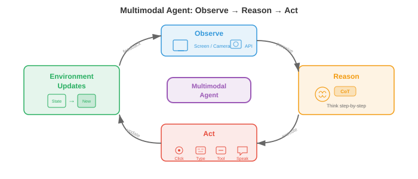

# 统一多模态架构

*统一多模态架构用单一系统取代了各自为政的专家模型，这个系统能够跨越文本、图像、音频和视频进行读取、推理和生成。本文涵盖了任意到任意模型（CoDi、NExT-GPT）、原生多模态大语言模型（Gemini、GPT-4o）、多模态分词策略，以及统一化所带来的架构权衡。*

## 统一化的理由

- 想象一位会说五种语言、能在句子中间无停顿地切换语种的翻译。早期的多模态系统更像是五个坐在不同房间的翻译，每人处理一种语言，通过墙上的小缝隙传递纸条。而**统一多模态架构**就是那一位多语言者：一个共享权重的模型，在单次前向传播中即可跨文本、图像、音频、视频甚至动作进行读取、书写和推理。

- 其动机既有实用层面的也有理论层面的。在实用层面，维护每对模态的专用专家模型（文本到图像、图像到文本、音频到文本等）会导致组合爆炸：$k$ 种模态需要最多 $k(k-1)$ 个有向流水线。一个统一模型将所有这类流水线坍缩为单一系统。在理论层面，人类认知并非在隔离的模块中处理视觉和语言；跨模态绑定发生得早且深，统一化尝试模仿这一点。

- 共享权重鼓励**跨模态迁移**。一个已在文本中学到时间模式（主语在动词前、原因在结果前）的 Transformer，可以将同样的注意力电路重新用于视频中的时间模式（对象出现在移动之前）或音频中的时间模式（起音在持续之前）。这是迁移学习的多模态类比——你曾在第 7 章的语言模型微调中和第 8 章的 ImageNet 预训练中见到过。

- 形式上，令 $\mathcal{M} = \{m_1, m_2, \ldots, m_k\}$ 为一组模态。统一模型定义了一个单一参数化函数 $f_\theta$，它将任意输入模态子集映射到任意输出模态子集：

$$f_\theta : \mathcal{P}(\mathcal{M}) \rightarrow \mathcal{P}(\mathcal{M})$$

- 其中 $\mathcal{P}(\mathcal{M})$ 是模态的幂集（所有子集）。关键约束是 $\theta$ 大部分是共享的；只有薄薄的模态特定适配器层有所不同。


- 统一化的前景伴随着一个基本张力：模态在结构上是不同的。文本是离散 token 的一维序列。图像是连续像素值的二维网格。音频是一维连续波形，时间尺度与文本截然不同。视频为图像添加了时间轴。将这些迥异的结构调和成单一的、Transformer 能够消化的序列，是该领域核心的工程挑战。

## 任意到任意模型

- 想象一个通用遥控器，可以通过同一个界面操作你的电视、空调和音响系统。**任意到任意模型**就是 AI 中的等价物：它们接收任意模态组合作为输入，并产生任意组合作为输出。

- **CoDi**（Composable Diffusion，可组合扩散）通过训练模态特定的扩散模型，然后通过共享条件机制对齐它们的潜在空间来实现任意到任意生成。每种模态都有其自身的扩散过程（回顾本章文件 04 中的扩散模型），但噪声预测网络被条件化在一个联合交叉注意力层上，该层同时看到所有输入模态的嵌入。这让 CoDi 能够在单次前向传播中，例如从一个文本提示生成图像和匹配的音频。

- **NExT-GPT** 采用了不同的架构方法。它将 LLM 主干（"大脑"）通过轻量级的**投影层**连接到输入侧的模态特定编码器和输出侧的模态特定解码器。输入编码器（例如来自 CLIP 的图像编码器、来自 CLAP 的音频编码器）将每种模态翻译成 LLM 的嵌入空间。LLM 对组合后的 token 序列进行推理，并发出特殊的"模态信号 token"来将信息路由到适当的解码器（例如用于图像的 Stable Diffusion、用于音频的 AudioLDM）。只有投影层被训练；LLM 和专家编解码器保持冻结。

- **Gemini**（Google DeepMind）从预训练阶段起就是原生多模态的。与 NExT-GPT 的即插即用方法不同，Gemini 的 Transformer 从头开始就在文本、图像、音频和视频 token 的交错序列上进行训练。这意味着跨模态注意力模式在预训练期间有机地发展，而不是事后才拼接上去。该模型对文本使用 SentencePiece tokenizer，并学习了一种类似于本章文件 03 中讨论的 VQ 方法的视觉 tokenizer。

- **GPT-4o**（"o"代表"omni"，全模态）代表了另一种模式：一个端到端模型，其中所有模态共享同一个 Transformer 和同一个下一 token 预测目标。音频输入作为频谱 token 处理，图像作为块 token，文本作为子词 token，全部送入单一序列。模型生成的输出 token 由模态特定的头部解码。关键创新在于低延迟——通过消除早期系统（如 GPT-4V）所依赖的独立 ASR、LLM 和 TTS 级联而实现。


- 这些模型处于集成深度谱系的不同位置：

    - **浅层集成**（NExT-GPT）：冻结专家，通过训练适配器连接。构建快速，跨模态推理能力有限。
    - **中层集成**（CoDi）：跨模态特定生成器的共享条件化。对齐更好，仍然模块化。
    - **深层集成**（Gemini、GPT-4o）：在所有模态上端到端训练的单一模型。跨模态推理最丰富，训练成本最高。

## 共享主干上的模态特定编码器和解码器

- 想象一家工厂有一条总装线（共享主干），但有不同的原料装卸码头（编码器）和不同的成品发运部门（解码器）。每个码头专精于其货物，但一旦进入工厂内部，所有东西都在同一条传送带上移动。

- 统一模型的主导架构模式采用这种三部分结构：

    - **模态编码器** $E_m$：将来自模态 $m$ 的原始输入转换为嵌入向量序列 $\mathbf{h}_1^m, \mathbf{h}_2^m, \ldots, \mathbf{h}_{n_m}^m$，每个向量的维度为 $d$。
    - **共享 Transformer 主干** $T_\theta$：使用自注意力处理来自所有输入模态的拼接或交错嵌入。
    - **模态解码器** $D_m$：将主干的输出嵌入转换回模态 $m$ 的原生格式（文本 token、图像像素、音频波形）。

- 对于文本，编码器通常是一个嵌入查找表 $E_\text{text}(w) = \mathbf{W}_e[w]$，其中 $w$ 是 token 索引，与你在第 7 章 Transformer 中看到的相同。对于图像，编码器通常是**视觉 Transformer**（ViT），它将图像分割成块并将每个块线性投影，如第 8 章所述。对于音频，编码器计算梅尔频谱图，然后用卷积前端或音频频谱图 Transformer（AST）处理，如第 9 章所述。

- 共享主干是一个标准 Transformer，对所有模态 token 进行自注意力。给定一个拼接输入序列 $\mathbf{H} = [\mathbf{h}_1^{m_1}, \ldots, \mathbf{h}_{n_1}^{m_1}, \mathbf{h}_1^{m_2}, \ldots, \mathbf{h}_{n_2}^{m_2}]$，自注意力允许每个 token 关注所有其他 token，无论其模态如何：

$$\text{Attention}(\mathbf{Q}, \mathbf{K}, \mathbf{V}) = \text{softmax}\left(\frac{\mathbf{Q}\mathbf{K}^\top}{\sqrt{d_k}}\right)\mathbf{V}$$

- 这与第 7 章中的注意力公式相同，但现在 $\mathbf{Q}$、$\mathbf{K}$ 和 $\mathbf{V}$ 包含来自多种模态的 token。图像块 token 可以关注文本 token，从而无需单独的交叉注意力模块即可实现跨模态推理。

- **模态嵌入**被添加到每个 token 上，以便主干知道 token 来自哪种模态。这类似于位置嵌入，但编码的是模态身份而非序列位置。一个可学习的向量 $\mathbf{e}_m \in \mathbb{R}^d$ 被添加到每个来自模态 $m$ 的 token 上：

$$\tilde{\mathbf{h}}_i^m = \mathbf{h}_i^m + \mathbf{e}_m + \mathbf{p}_i$$

- 其中 $\mathbf{p}_i$ 是位置 $i$ 的位置嵌入。


## 多模态分词

- 想象你在写一封信，信中既有英文文本又有手绘草图。你可能写一个句子，画一个图表，再写一个引用该图表的句子，然后贴上一段乐谱。这封信就是一个线性流，交错着不同的"模态"。多模态分词做的正是这件事：它将文本、图像、音频和视频转换成单一的扁平 token 序列，由 Transformer 从左到右处理。

- 对于文本，分词技术已经很成熟：**字节对编码**（BPE）或 SentencePiece 产生子词 token 的词汇表，如第 7 章所述。挑战在于将这一思想扩展到连续模态。

- 对于图像，有两种主要方法。**离散**方法使用 VQ-VAE 或 VQ-GAN（详见本章文件 03）将每幅图像映射为码本索引序列。如果码本有 $|\mathcal{C}|$ 个条目且一幅图像编码为 $n$ 个码字，则该图像变为 $n$ 个离散 token，取自大小为 $|\mathcal{C}|$ 的词汇表，直接与文本词汇表兼容。**连续**方法使用 ViT 或 CNN 编码器产生 $n$ 个连续嵌入向量，然后线性投影到 Transformer 的嵌入维度中。Gemini 和 GPT-4o 使用连续方法的变体；自回归图像生成器如 Parti 和 LlamaGen 则偏好离散路线。

- 对于音频，信号通常被转换为梅尔频谱图，然后要么通过神经音频编解码器（例如 EnCodec、SoundStream，它们产生层次化的离散 token）进行离散化，要么通过学习的编码器进行连续投影。例如，AudioLM 将音频表示为来自多个码本层次的离散 token 序列，然后以自回归方式对其进行建模。

- 对于视频，分词建立在图像分词的基础上，但还必须压缩时间维度。一种常见策略使用**3D VQ-VAE**（如文件 03 中的 VideoGPT 或 Cosmos Tokenizer）将时空块量化为离散 token。时间压缩因子至关重要：未经激进的时间下采样，24 fps 的原始视频每秒产生的 token 数量太多。

- 一旦所有模态都被分词化，它们就被**交错**成单一序列，并带有标记模态边界的特殊分隔 token。一个典型格式如下：

```
[TEXT] 猫坐在垫子上 [/TEXT] [IMAGE] <img_tok_1> <img_tok_2> ... <img_tok_n> [/IMAGE] [AUDIO] <aud_tok_1> ... <aud_tok_m> [/AUDIO]
```

- Transformer 然后使用其标准因果（或双向）注意力机制处理整个混合序列。模态分隔 token 起到双重作用：它们向模型告知模态边界，并充当"汇聚点"，其表示概括了每个模态段。


- 一个关键的设计选择是**token 预算**。一张被分词为 256 个 token 的图像加上 50 个 token 的文本描述，意味着图像消耗的上下文窗口是文本的 5 倍。模型必须在分辨率（更多 token = 更多细节）和上下文长度（更多 token = 更高的内存和计算成本）之间取得平衡。**token 合并**（逐渐合并相似 token）和**自适应分词**（对简单区域使用较少的 token，对复杂区域使用更多 token）等技术有助于管理这种权衡。

## 训练配方：分阶段预训练与联合微调

- 你不会在教孩子算术之前就教他微积分。同样，你不能从随机初始化开始，在所有模态上同时训练一个统一多模态模型，并期望它能很好地收敛。主导方法是**分阶段训练**，其中模型在精心排序的阶段中逐步学习越来越复杂的跨模态能力。

- **阶段 1：单模态预训练。** 每个模态编码器在大型单模态数据集上独立训练。文本主干使用标准语言建模目标（下一 token 预测）在数万亿文本 token 上进行预训练，正如第 7 章一样。视觉编码器在图像分类或自监督目标（MAE、DINO）上预训练，如第 8 章所述。音频编码器在语音识别或音频分类数据上预训练，如第 9 章所述。这一阶段产生了强大的单模态特征提取器。

- **阶段 2：跨模态对齐。** 预训练的编码器连接到共享主干，模型在成对的多模态数据（图像-描述对、音频-文本对）上使用对比或生成目标进行训练。在此阶段，编码器权重可能被冻结（以保留单模态知识），仅更新投影层和主干。这是来自本章文件 01 的 CLIP 风格对齐被纳入统一模型的阶段。

- **阶段 3：联合多模态预训练。** 所有参数（或大部分）被解冻，模型在单模态和多模态数据的混合上训练，使用对所有模态 token 的单一下一 token 预测目标。损失函数为：

$$\mathcal{L} = -\sum_{t=1}^{T} \log p_\theta(x_t \mid x_{<t})$$

- 其中 $x_t$ 可以是文本 token、图像 token 或音频 token。模型必须学会预测下一个 token，无论其模态如何，这迫使它发展真正的跨模态理解。

- **阶段 4：指令微调与对齐。** 预训练模型在精心策划的指令遵循数据集上进行微调，这些数据集包括多模态指令（例如，"详细描述这幅图像"、"这段视频发出什么声音？"、"生成一张 X 的图像"）。这一阶段通常使用**基于人类反馈的强化学习**（RLHF）或直接偏好优化（DPO）来使模型的输出与人类偏好对齐。

- **模态特定热身**是一种在阶段内部使用的技术，用于防止模态坍缩。如果一种模态（通常是文本，因为它拥有最多的训练数据）主导了梯度信号，模型可能会"遗忘"较弱的模态。热身策略包括：

    - **梯度平衡**：缩放来自每种模态的梯度，使其对参数更新有均等贡献。
    - **数据比例调度**：逐步增加多模态数据相对于单模态数据的比例。
    - **损失加权**：分配模态特定的权重 $\lambda_m$，使总损失为 $\mathcal{L} = \sum_m \lambda_m \mathcal{L}_m$，其中 $\lambda_m$ 经过调整以平衡各模态的学习率。


- **为什么不跳过阶段？** 从头开始联合训练所有内容很诱人，但在实践中由于几个原因而失败。首先，模型必须同时学习低级特征（边缘检测、音素识别）和高级跨模态推理，两者具有非常不同的学习动态。其次，跨模态的数据分布极不平衡（数万亿文本 token 对比数十亿图像 token 对比数亿音频片段）。第三，优化景观高度非凸，分阶段训练提供了一个课程表，引导模型走向更好的盆地，类似于第 6 章讨论的课程学习理念。

## 多模态思维链推理

- 当你解决一个几何问题时，你可能会画一个示意图，标注角度，写出方程，然后逐步求解。你不会直接从问题陈述跳到答案。**多模态思维链**（CoT）推理使模型能够做同样的事情：在得出最终答案之前生成可能涉及文本、视觉注释甚至生成图表的中间推理步骤。

- 在纯文本 CoT 中（如第 7 章提示策略的讨论中所探讨的），模型以自然语言生成推理步骤序列。多模态 CoT 扩展了这一能力，允许中间步骤引用或生成视觉内容。例如，给定一张图表图像和问题"哪一年销售额最高？"，多模态 CoT 模型可能首先描述图表（"该图表显示 2018 年至 2023 年的销售额……"），然后识别相关的视觉特征（"最高的条形出现在 2021 年……"），最后输出答案（"2021 年"）。

- 形式上，令 $\mathbf{x}$ 为多模态输入，$y$ 为目标答案。标准预测模型直接建模 $p(y \mid \mathbf{x})$。思维链引入了中间推理 $\mathbf{r} = (r_1, r_2, \ldots, r_L)$ 并将预测分解为：

$$p(y \mid \mathbf{x}) = \sum_{\mathbf{r}} p(y \mid \mathbf{r}, \mathbf{x}) \cdot p(\mathbf{r} \mid \mathbf{x})$$

- 在实践中，求和通过贪心或束搜索解码在推理链上近似。推理步骤 $r_i$ 可以是文本 token、对图像区域的引用，甚至是生成的视觉 token（例如，叠加在输入图像上的边界框注释）。

- **训练多模态 CoT** 通常涉及策划数据集，其中人类标注者提供逐步的多模态推理轨迹，然后在此类轨迹上微调模型。一些方法从更大的教师模型中蒸馏 CoT 能力：教师为大型数据集生成推理轨迹，较小的学生模型则在输入和教师的轨迹上进行训练。

- 多模态 CoT 对于需要**空间推理**（例如，"红色球在蓝色立方体的左边吗？"）、**对图表的数学推理**（例如，几何问题）和**多步视觉问答**（答案依赖于组合图像多个区域的信息）的任务尤其强大。

## 多模态智能体

- 想象厨房里的一个机器人厨师。它查看台面上的食材（视觉），阅读平板上的食谱（文本），听计时器的哔哔声（音频），然后物理上拿起刀并切洋葱（动作）。**多模态智能体**就是数字版：一个通过多种模态感知世界、推理该做什么、并执行基于其感知的动作的模型。

- 智能体循环遵循经典的**观察-推理-行动**周期：

    1. **观察**：智能体从其环境接收多模态输入（截图、用户的口头指令、视频流）。
    2. **推理**：统一模型处理多模态输入，可能使用思维链来规划步骤序列。
    3. **行动**：模型输出一个动作（文本回复、工具调用、坐标为 $(x, y)$ 的鼠标点击、机器人电机指令）。

- **工具使用**是多模态智能体的一个关键能力。模型被训练识别何时无法直接回答问题，而必须调用外部工具：计算器、代码解释器、网页浏览器或搜索引擎。模型在其输出 token 序列中生成结构化的工具调用（例如，`search("伦敦当前天气")`），系统执行调用，并将结果作为额外的输入 token 反馈给模型处理。

- **视觉接地**将语言连接到图像或视频中的特定区域。当智能体说"点击右上角的蓝色按钮"时，它必须将短语"右上角的蓝色按钮"接地到像素坐标。在架构上，这是通过训练模型将边界框坐标作为特殊 token 输出，或让模型在图像上生成指示所指区域的热图来实现的。这将本章文件 02（视觉语言模型）中讨论的接地和指代工作扩展到了动作领域。

- **Web 智能体**如 WebVoyager 和 SeeAct 展示了多模态智能体在网站上导航。智能体接收网页截图，识别交互元素（按钮、文本字段、链接），并输出动作（点击、打字、滚动）以完成用户指定的目标。关键挑战在于巨大的动作空间：一个典型网页可能有数百个可点击目标。



- **具身智能体**将其扩展到物理环境。带有摄像头和麦克风的机器人接收视觉和音频输入，通过统一模型处理，并输出电机指令。像 PaLM-E（Google）这样的项目将机器人传感器数据直接嵌入语言模型的 token 序列中，使机器人能够通过将指令接地到其视觉观察中并生成一系列电机动作，来遵循诸如"拿起碗附近的绿色方块"之类的指令。

- 智能体的训练配方在标准分阶段预训练之上添加了一个**强化学习**（RL）阶段。智能体与环境（模拟桌面、网页浏览器、机器人模拟器）交互，因完成任务而获得奖励，并使用 PPO 或 REINFORCE 等算法更新其策略。奖励信号通常是稀疏的（任务成功为 1，否则为 0），使得这一优化具有挑战性，并且高度依赖于多模态预训练的强先验。

## 基准测试与评估

- 评估一个能看见、听见、阅读和行动的模型需要一套多样化的基准测试。没有单一指标能够捕捉多模态能力，因此该领域依赖于一组专门评估的集合。

- **MMLU**（大规模多任务语言理解）测试 57 个学术科目的知识。虽然最初是纯文本的，但它作为基线：一个统一多模态模型在获得视觉能力时不应丢失纯文本性能。多模态训练后 MMLU 的下降标志着灾难性遗忘。

- **MMBench** 评估跨 20 个细粒度能力维度的视觉语言理解，包括属性识别、空间关系理解和 OCR。每个问题呈现一幅图像和一个多项选择题。该基准系统地测试模型是否真正理解图像，还是依赖于纯文本的捷径。

- **SEED-Bench** 提供 19,000 个多项选择题，跨越图像和视频理解的 12 个评估维度。它特别测试时间理解（给定帧之前/之后发生了什么）和组合推理（组合多个视觉属性）。

- **MM-Vet** 通过要求模型同时使用多种技能来评估集成的多模态能力：识别、OCR、空间意识、语言生成和知识检索，全部在单一问题中。

- **MathVista** 测试对视觉输入的数学推理：几何图、统计图表、函数图和科学图形。该基准专门针对多模态思维链能力。

- **音视频基准**如 AVQA（音视频问答）测试模型是否能推理它们所看到和所听到之间的关系。例如："说话的人是左边的还是右边的？"

- **智能体基准**如 WebArena、OSWorld 和 SWE-bench 评估在交互式环境中的任务完成情况。指标通常是成功率：智能体正确完成任务的占比是多少？这些基准特别具有挑战性，因为它们需要长视野规划和错误恢复。

- **全面评估**框架如 LMSYS Chatbot Arena 使用人在头对头格式中的偏好判断。两个模型被展示相同的多模态输入，人类评委选择哪个响应更好。Elo 评分从数千次这样的比较中计算得出，提供了一个与整体模型质量高度相关的单一标量。

- 多模态评估中的一个持续挑战是**数据污染**：因为这些模型是在互联网规模的数据上训练的，基准图像和问题可能出现在训练集中。仔细的去重和创建保留测试集是必要但不完美的保障措施。

## 世界模型

- 想象闭上眼睛，想象如果你把一个玻璃杯推下桌子边缘会发生什么。你"看到"它落下，"听到"破碎声，并"感觉"到那将是个坏主意。你的大脑正在运行一个**世界模型**：对环境的物理和因果结构的内部模拟，能够跨多种模态预测未来状态。

- 在 AI 语境中，世界模型是一个学习到的函数，根据当前状态和动作预测世界的下一个状态：

$$\hat{s}_{t+1} = g_\phi(s_t, a_t)$$

- 其中 $s_t$ 是当前状态表示（可能包含视觉、听觉和本体感觉信息），$a_t$ 是一个动作，$\hat{s}_{t+1}$ 是预测的下一个状态。状态 $s_t$ 存在于学习到的潜在空间中，而非原始像素空间，使得预测问题可解。

- **视频预测模型**如 Sora（OpenAI）和 Genie（Google DeepMind）代表了迈向世界模型的重要一步。它们学习生成以文本提示和/或动作序列为条件的、时间上连贯的视频帧。虽然它们通常被作为视频生成器讨论，但底层的技术能力更接近于世界模拟：模型已经内化了足够的物理知识（重力、碰撞、遮挡、流体动力学）来渲染合理的未来场景。

- 与多模态架构的联系很深。一个只预测像素的世界模型是有限的；一个真正有用的世界模型应该跨模态预测。如果你推玻璃杯，世界模型应该预测视觉轨迹（玻璃杯落下）、听觉事件（玻璃杯破碎）和语义后果（现在地板上有碎玻璃）。统一多模态架构是世界模型的天然后选者，因为它们已经在共享空间中表示所有模态。

- 形式上，多模态世界模型优化：

$$\mathcal{L}_\text{world} = \mathbb{E}\left[\sum_{m \in \mathcal{M}} \lambda_m \| s_{t+1}^m - g_\phi^m(s_t, a_t) \|^2 \right]$$

- 其中 $s_{t+1}^m$ 是模态 $m$ 中的真实下一状态表示，$g_\phi^m$ 是世界模型的模态特定预测头。共享的潜在动态 $g_\phi$ 在联合多模态空间中运行，而模态特定的头则将预测解码为每种模态的原生格式。


- **JEPA**（联合嵌入预测架构），由 Yann LeCun 提出，提供了一个避免像素级预测陷阱的世界模型框架。JEPA 不是在原始像素层面预测（这会将容量浪费在无关细节如精确纹理上），而是在嵌入空间中进行预测。模型学习一个将观测映射到嵌入的编码器，以及一个预测未来嵌入的预测器：

$$\hat{\mathbf{z}}_{t+1} = h_\psi(\mathbf{z}_t, a_t), \quad \mathbf{z}_t = \text{Enc}(s_t)$$

- 损失函数比较的是嵌入而非原始观测，这对感知混叠（许多不同的像素配置可能代表相同的语义状态）更加鲁棒。这种方法对多模态世界模型尤其有前景，因为它自然地运行在统一架构已经提供的共享嵌入空间中。

- 世界模型有超越学术兴趣的实际应用。在**基于模型的强化学习**中，智能体在采取行动之前使用其世界模型来"想象"行动的后果，大大减少了所需的真实世界交互次数（回顾第 11 章对基于模型 RL 的讨论）。在**自动驾驶**中，世界模型预测在给定不同转向决策后场景在未来几秒内将如何演变。在**机器人学**中，世界模型允许机器人在执行操作序列之前在头脑中进行排练。

- 世界模型研究的前沿正朝着**交互式世界模型**发展，这些模型实时运行，响应任意用户动作，本质上成为完全从数据中学习得到的通用模拟器。Genie 2（Google DeepMind）为 3D 环境演示了这一点：给定一张图像，它生成一个交互式的、可控的 3D 世界，用户可以探索。世界模型与统一多模态架构的融合表明，未来一个单一模型能够跨所有模态进行感知、预测、模拟和行动。

## 编程任务（使用 CoLab 或 notebook）

**任务 1：构建一个最小化的多模态 token 交错器**

- 编写一个函数，接收一个文本字符串和一个虚拟的"图像"（一个小型 2D 数组），并将它们的 token 化表示交错成一个带有模态嵌入的单一扁平序列。

```python
import jax
import jax.numpy as jnp

# 模拟多模态分词：文本 token + "图像块" token
def interleave_modalities(text_tokens, image_patches, embed_dim=32, key=jax.random.PRNGKey(0)):
    """将文本和图像 token 与学习到的模态嵌入交错。"""
    k1, k2, k3 = jax.random.split(key, 3)
    n_text = text_tokens.shape[0]
    n_img = image_patches.shape[0]
    # 随机投影矩阵（替代真实编码器）
    W_text = jax.random.normal(k1, (text_tokens.shape[-1], embed_dim)) * 0.02
    W_img = jax.random.normal(k2, (image_patches.shape[-1], embed_dim)) * 0.02
    # 模态嵌入：一个用于文本，一个用于图像
    mod_emb = jax.random.normal(k3, (2, embed_dim)) * 0.02
    text_embs = text_tokens @ W_text + mod_emb[0]  # (n_text, embed_dim)
    img_embs = image_patches @ W_img + mod_emb[1]   # (n_img, embed_dim)
    # 交错：[IMG] token 在前，然后是 [TEXT] token（像 LLaVA）
    combined = jnp.concatenate([img_embs, text_embs], axis=0)
    print(f"组合序列: {n_img} 图像 + {n_text} 文本 = {combined.shape[0]} tokens")
    return combined

# 尝试：5 个文本 token（dim 16）和 4 个图像块（dim 64）
text = jax.random.normal(jax.random.PRNGKey(1), (5, 16))
image = jax.random.normal(jax.random.PRNGKey(2), (4, 64))
seq = interleave_modalities(text, image)
# 实验：改变 embed_dim，交换交错顺序，添加第三个模态
```

**任务 2：可视化跨模态注意力模式**

- 创建一个合成的多模态序列，计算自注意力分数，观察图像 token 如何关注文本 token，反之亦然。

```python
import jax
import jax.numpy as jnp
import matplotlib.pyplot as plt

def cross_modal_attention(n_text=6, n_img=4, d=32, key=jax.random.PRNGKey(42)):
    """计算并可视化文本和图像 token 之间的注意力。"""
    k1, k2, k3 = jax.random.split(key, 3)
    # 模拟两种模态的 token 嵌入
    text_embs = jax.random.normal(k1, (n_text, d))
    img_embs = jax.random.normal(k2, (n_img, d))
    seq = jnp.concatenate([img_embs, text_embs], axis=0)  # (n_img+n_text, d)
    # 学习到的 Q, K 投影
    Wq = jax.random.normal(k3, (d, d)) * 0.1
    Wk = jax.random.normal(jax.random.PRNGKey(99), (d, d)) * 0.1
    Q, K = seq @ Wq, seq @ Wk
    scores = Q @ K.T / jnp.sqrt(d)
    attn = jax.nn.softmax(scores, axis=-1)
    # 绘图
    labels = [f"img_{i}" for i in range(n_img)] + [f"txt_{i}" for i in range(n_text)]
    fig, ax = plt.subplots(figsize=(7, 6))
    ax.imshow(attn, cmap="viridis")
    ax.set_xticks(range(len(labels))); ax.set_xticklabels(labels, rotation=45, fontsize=8)
    ax.set_yticks(range(len(labels))); ax.set_yticklabels(labels, fontsize=8)
    ax.set_xlabel("Key（被关注的）"); ax.set_ylabel("Query（发起的）")
    ax.set_title("跨模态自注意力图")
    plt.colorbar(ax.images[0], ax=ax, shrink=0.8)
    plt.tight_layout(); plt.show()

cross_modal_attention()
# 实验：增大 d，添加因果掩码，观察注意力模式如何变化
```

**任务 3：模拟带有模态特定损失权重的分阶段训练**

- 演示模态特定的损失权重如何影响玩具多模态训练循环。观察平衡损失如何防止一种模态主导训练。

```python
import jax
import jax.numpy as jnp
import matplotlib.pyplot as plt

def staged_training_sim(steps=200, key=jax.random.PRNGKey(7)):
    """模拟具有可调节模态损失权重的多模态训练。"""
    # 两种"模态"，损失尺度不同（文本损失比图像损失大约 10 倍）
    losses_text, losses_img = [], []
    param = jnp.array([0.0, 0.0])  # 两种模态损失共同更新的共享参数
    lr = 0.05
    # 尝试更改这些权重以观察对收敛平衡的影响
    lambda_text, lambda_img = 1.0, 5.0  # 对较弱模态加大权重

    for step in range(steps):
        k1, k2, key = jax.random.split(key, 3)
        noise_t = jax.random.normal(k1, ()) * 0.3
        noise_i = jax.random.normal(k2, ()) * 0.1
        loss_t = (param[0] - 3.0) ** 2 + noise_t  # 文本目标 = 3.0
        loss_i = 0.1 * (param[1] - 1.0) ** 2 + noise_i  # 图像目标 = 1.0（尺度更小）
        # 加权组合梯度
        grad_t = lambda_text * 2 * (param[0] - 3.0)
        grad_i = lambda_img * 0.2 * (param[1] - 1.0)
        param = param - lr * jnp.array([grad_t, grad_i])
        losses_text.append(float(loss_t)); losses_img.append(float(loss_i))

    fig, ax = plt.subplots(figsize=(8, 4))
    ax.plot(losses_text, label=f"文本损失 (权重={lambda_text})", alpha=0.7)
    ax.plot(losses_img, label=f"图像损失 (权重={lambda_img})", alpha=0.7)
    ax.set_xlabel("训练步数"); ax.set_ylabel("损失"); ax.legend()
    ax.set_title("分阶段训练中的模态损失平衡")
    plt.tight_layout(); plt.show()

staged_training_sim()
# 实验：设置 lambda_img=1.0，观察图像损失收敛慢得多
```
