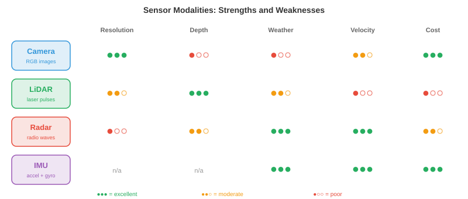

# 感知

*感知是自主系统感知和解释物理世界的方式。本章涵盖传感器模态、标定、传感器融合、3D目标检测、深度估计、占据网络、车道检测和语义建图——这是每个机器人、无人机和自动驾驶汽车赖以构建的感知基础。*

- 对人类而言，感知世界毫不费力：你看到一辆车驶近，听到引擎声，感受到脚下的地面，瞬间在脑海中构建出周围环境的心智模型。自主系统也必须做到同样的事，但它使用的是电子传感器和算法，而非眼睛和耳朵。

- 根本性挑战在于：传感器提供的是原始数字（像素强度、点云、信号反射），系统必须将这些数字转化为结构化的理解："前方12米处有一个行人，以1.5米/秒的速度向左移动。"这就是感知问题。

- 下游的所有任务（预测、规划、控制）都依赖于感知。一个拥有完美规划器但感知能力差的自动驾驶汽车仍然会撞车。感知是瓶颈。

## 传感器模态

- 自主系统使用多种传感器类型，各有其优势与失效模式。没有哪种传感器能单独胜任。



- **相机**以高分辨率捕获密集的颜色信息。单张图像包含数百万像素，每个像素记录RGB值（如我们在第8章所见）。相机价格低廉、重量轻，提供丰富的纹理和颜色信息，这对识别标牌、检测交通信号灯和识别物体至关重要。

- 相机类型包括**单目**（单个镜头，无原生深度）、**立体**（两个镜头相隔一个基线，通过视差计算深度，详见第8章）和**鱼眼**（超宽视场角，180°以上，具有严重径向畸变，用于环绕视图泊车系统）。

- 相机的主要弱点是投影过程中丢失深度信息。3D场景通过针孔相机模型映射到2D图像平面（回顾第8章的内参矩阵$K$）：

$$\\begin{bmatrix} u \\\\ v \\\\ 1 \\end{bmatrix} = \\frac{1}{Z} K \\begin{bmatrix} X \\\\ Y \\\\ Z \\end{bmatrix}$$

- 除以$Z$的过程丢弃了绝对深度。两个不同大小、不同距离的物体可能产生完全相同的投影。从单张图像恢复深度是病态问题，这就是为什么需要立体相机或学习型单目深度模型。

- 相机在恶劣条件下也会受到影响：直射阳光产生眩光，黑暗降低信号，雨雾散射光线。

- **LiDAR**（光探测与测距）发射激光脉冲并测量每个脉冲返回的时间。由于光速已知（$c \\approx 3 \\times 10^8$ m/s），每个反射点的距离为：

$$d = \\frac{c \\cdot \\Delta t}{2}$$


- 因子2考虑了往返行程（去程和回程）。通过将激光扫过场景，LiDAR构建了一个**点云**：一组3D坐标$(x, y, z)$，通常带有强度（反射率）值。

- **旋转式LiDAR**（如Velodyne）旋转激光阵列360°以提供完整的环视视图。典型设备每秒生成超过30万个点，覆盖64-128个垂直通道。结果是场景的稀疏但几何精度高的3D表示。

- **固态LiDAR**没有运动部件，使用光学相控阵或MEMS镜面。这使得它们更便宜、更紧凑、更可靠，但通常视场角较窄（120° vs 360°）。

- LiDAR提供精确的深度，但生成的是稀疏数据（"像素"数量远少于相机），没有颜色信息，且价格昂贵。在大雨、雪或灰尘中，粒子会散射激光脉冲，其性能也会下降。

- **雷达**（无线电探测与测距）基于与LiDAR相同的飞行时间原理，但使用无线电波（毫米波，汽车领域通常为77 GHz）。无线电波穿透雨、雾、尘和雪的能力远优于光，使雷达成为最耐天气的传感器。

- 雷达还能通过**多普勒效应**直接测量**速度**。当物体向传感器移动时，反射波被压缩（频率升高）；当远离时，反射波被拉伸（频率降低）。速度公式为：

$$v = \\frac{\\Delta f \\cdot c}{2 f_0}$$

- 其中$\\Delta f$是频移，$f_0$是发射频率。这提供了瞬时径向速度，无需任何跟踪或帧间计算。

- 折中是分辨率：雷达的角分辨率远低于相机或LiDAR，难以区分邻近物体或检测精细细节。但它在任何天气条件下都能出色地探测远距离（200米以上）的车辆。

- **超声波传感器**发射高频声脉冲（40-70 kHz）并测量回波返回时间。它们工作在极短距离（0.2-5米），主要用于泊车辅助。其物理原理与LiDAR相同，只是用声音代替光，因此$d = \\frac{v_{\\text{声}} \\cdot \\Delta t}{2}$，其中$v_{\\text{声}} \\approx 343$ m/s。

- **IMU**（惯性测量单元）包含加速度计和陀螺仪，分别测量线加速度和角速度。IMU提供高频运动数据（通常200-1000 Hz），填补了较慢传感器更新之间的空白。它们不直接感知环境，而是跟踪机器人自身的运动，因此对航位推算和状态估计至关重要。

- IMU存在**漂移**问题：小的测量误差随时间累积，导致估计位置偏离真实位置。这就是为什么IMU几乎总是与其他传感器（相机、GPS、LiDAR）融合使用，而非单独使用。

- **GNSS**（全球导航卫星系统，包括GPS）通过三角测量来自多颗卫星的信号，提供地球表面的绝对位置。标准GPS精度为2-5米，不足以进行车道级驾驶。**RTK-GPS**（实时动态差分GPS）使用固定基站校正误差，达到厘米级精度，但需要清晰的天空视野和基站基础设施。

## 传感器标定

- 在传感器协同工作之前，必须进行**标定**：将每个传感器的测量值与共同坐标系关联起来。

- **内参标定**确定传感器的内部参数。对于相机，这意味着焦距、主点和畸变系数（如第8章所述）。对于LiDAR，这意味着激光束之间的精确角度偏移。常用的方法是张氏棋盘格标定法，即从多个角度观察已知平面图案，求解内参矩阵。

- **外参标定**确定两个传感器之间的刚体变换（旋转$R$和平移$\\mathbf{t}$）。如果相机和LiDAR安装在同一辆车上，外参标定会找到一个$4 \\times 4$变换矩阵，将LiDAR坐标中的点映射到相机坐标：

$$\\mathbf{p}_{\\text{相}} = \\begin{bmatrix} R & \\mathbf{t} \\\\ \\mathbf{0}^T & 1 \\end{bmatrix} \\mathbf{p}_{\\text{激}}$$

- 这是齐次坐标中的仿射变换，正是我们在第2章（线性变换）中研究过的那种。如果这个矩阵出错，LiDAR点将投影到错误的像素上，整个融合流程就会崩溃。

- **时间标定**同步传感器时钟。以30 Hz工作的相机和以10 Hz工作的LiDAR在不同时间戳产生数据。如果汽车以30 m/s（高速公路速度）行驶，10毫秒的时间误差对应30厘米的空间误差。硬件触发（共享时钟脉冲）或软件同步（时间戳之间的插值）至关重要。

## 传感器融合

- 没有哪种传感器能覆盖所有条件。相机看得到颜色和纹理但丢失深度。LiDAR精确测量深度但稀疏且色盲。雷达在任何天气下都能工作但分辨率低。**传感器融合**结合各自的优势，弥补各自的弱点。

- **早期融合**（数据级融合）在进行任何处理之前合并原始传感器数据。例如，将LiDAR点投影到相机图像上，创建RGBD表示（每像素的颜色+深度），或者为每个LiDAR点赋予其投影到的相机像素的颜色。这种方式保留了最多的信息，但需要精确的标定，且对未对准非常敏感。

- **后期融合**（决策级融合）每个传感器独立运行各自的检测流程，然后合并最终输出（边界框、类别标签、置信度分数）。每个传感器投票，融合模块协调分歧。这种方式更简单、更模块化，但每个流程无法从其他传感器的原始数据中获益。

- **中级融合**在中间特征表示层面进行操作。每个传感器的原始数据被编码到学习到的特征空间（使用CNN或transformer），然后特征被合并。这是现代系统的主流方法，因为它让网络学习从每种模态中提取什么。


- **BEVFusion**是一种代表性的中级融合架构。它将相机特征和LiDAR特征投影到一个共同的**鸟瞰图（BEV）**表示中，即场景的俯视网格。相机特征通过预测的深度分布被"提升"到3D，然后散布到BEV网格上。LiDAR特征已经是3D的，直接被体素化到同一个网格上。融合后的BEV特征随后由检测头处理。

- BEV表示之所以强大，是因为它提供了一个统一的、度量尺度的坐标框架，空间推理（距离、尺寸、重叠）在其中变得直观。在相机图像中，一辆近处的自行车和一辆远处的卡车可能占据相同数量的像素。而在BEV中，它们的真实大小和位置一目了然。

## 3D目标检测

- 感知的核心任务是在3D空间中检测物体：它们在哪里，有多大，是什么，朝向何方？每次检测得到一个**3D边界框**，包括位置$(x, y, z)$、尺寸$(l, w, h)$、航向角$\\theta$、类别标签和置信度分数。

- **基于LiDAR的检测**直接在点云上操作。挑战在于点云是无序的、不规则的，且密度变化大（近处物体有数千个点，远处物体只有几个）。回顾第8章，PointNet通过共享MLP和置换不变的聚合（最大池化）来处理这一问题。

- **PointPillars**通过将地面平面离散化为垂直柱（"pillars"）的网格，将点云转化为结构化表示。每个pillar内的所有点由一个小型PointNet编码为固定大小的特征向量。结果是一个2D伪图像，可以由标准的2D CNN主干网络处理，然后是检测头（如第8章中的SSD架构）。这种方法快速且有效。

- **CenterPoint**将物体检测为点而非边界框。它在BEV中预测物体中心的热图，然后在每个峰值处回归边界框属性（尺寸、高度、航向、速度）。这是CenterNet（第8章）的3D类比：无锚点，训练时无需NMS，并通过跨帧关联中心点自然扩展到跟踪。

- **纯相机3D检测**必须从2D图像推断深度，这从根本上更难。现代方法如**BEVDet**和**BEVFormer**使用transformer架构将2D图像特征"提升"到3D。BEVFormer使用空间交叉注意力：BEV查询关注投影到每个相机图像上的特定3D参考点，从相关位置提取特征。

- 基于LiDAR和基于相机的3D检测之间的精度差距正在迅速缩小，这得益于更好的深度估计、更大的模型和时间融合（利用多帧累积深度线索，类似立体匹配但跨时间进行）。

## 深度估计

- 深度估计是为每个像素或点分配距离值的问题。

- **立体匹配**使用两个相隔已知基线$b$的相机。同一个3D点在两幅图像中的水平位置略有不同，形成**视差**$d$。深度计算公式为（来自第8章）：

$$Z = \\frac{f \\cdot b}{d}$$

- 其中$f$是焦距。挑战在于找到两幅图像之间的正确对应关系，特别是在无纹理区域、遮挡区域和重复图案中。现代立体网络（如RAFT-Stereo）使用带有相关体积的迭代精化方法。

- **单目深度估计**从单张图像预测深度。由于这是病态问题（无限多个3D场景可以产生相同的图像），网络必须学习统计先验："地面是平的"、"物体随距离增大而变小"、"纹理梯度表明表面在后退"。

- **Depth Anything**（第8章中介绍过）通过在大规模无标注数据集上进行自监督训练，然后在标注数据上进行微调，实现了强大的单目深度估计。关键洞察在于尺度不变损失处理了固有不明确性：模型预测的是相对深度（排序）而非绝对米数。

- **LiDAR-相机深度融合**将稀疏的LiDAR深度测量值投影到相机图像上作为监督信号。网络学习"填充"稀疏点之间的空白，生成结合LiDAR精度和相机分辨率的密集深度图。

## 占据网络

- 传统感知输出一个边界框列表，每个检测到的物体一个框。但现实世界中许多事物并不适合用框来整齐地表示：形状不规则的碎片、施工围挡、悬垂的树枝、部分坍塌的墙壁。


- **占据网络**将场景表示为密集的3D体素网格。每个体素（一个小立方体空间，例如0.2m × 0.2m × 0.2m）被分类为空闲、占据或未知，并可选择赋予语义标签（道路、人行道、车辆、植被等）。

- 这意味着从以物体为中心的感知（"检测汽车"）转向以场景为中心的感知（"3D空间的哪些部分被占据？"）。优势在于通用性：系统不需要预定义对象类别列表来避免与任意障碍物碰撞。

- 从架构上看，占据网络接收传感器输入（相机、LiDAR或两者），将其编码为3D特征体积，并预测每个体素的标签。3D特征体积通常通过将2D特征提升到3D（类似于BEV构建但扩展到垂直方向）来构建，然后使用3D卷积或稀疏卷积进行处理。

- **TPVFormer**（三视角）通过将3D体积分解为三个正交平面（俯视图、前视图、侧视图）来避免完整3D注意力的立方级计算成本。每个平面使用2D注意力，其特征在每个体素处组合。这让人想起SVD如何将矩阵分解为更简单的因子（第2章）：将一个困难的3D问题分解为可管理的2D部分。

- 输出的体素网格直接告诉规划器哪些空间区域是安全的、哪些不是，使其成为感知和规划之间的自然接口。

## 车道检测与道路拓扑

- 对于在结构化道路上行驶的车辆，理解**车道几何**至关重要。系统必须知道车道在哪里、如何弯曲、在哪里合并和分叉，以及车辆处于哪条车道。

- 经典方法将参数曲线拟合到检测到的车道标线上。常用的模型是三次多项式：

$$x(y) = a_0 + a_1 y + a_2 y^2 + a_3 y^3$$

- 其中$y$是前方纵向距离，$x$是横向偏移。这是多项式近似（回顾第3章的泰勒级数），选择它是因为道路是平滑曲线，很好地由低次多项式描述。系数通过检测到的车道点上的最小二乘回归估计得出。

- 现代方法使用神经网络直接检测车道。**LaneNet**将每条车道视为一个实例，使用嵌入分支对属于同一条车道的像素进行分组，然后进行曲线拟合。**GANet**使用基于图的方法，将车道拓扑表示为有向图，其中节点是车道点，边编码连接关系（哪些车道在交叉口合并、分叉或连接）。

- **道路拓扑**超越了单个车道曲线，捕获完整结构：车道之间如何连接，哪些车道允许左转，高速公路入口匝道在哪里汇入。这被建模为有向图，交叉口是节点，车道段是带有属性（限速、车道类型、转弯限制）的边。

- 图结构对路线规划至关重要：规划器需要知道的不仅是"车道在哪里"，还有"哪条车道序列能到达目的地"。

## 语义建图

- 感知并不止于检测单帧中的物体。随着时间的推移，自主系统构建一个**语义地图**：对其环境的持久化、结构化表示，积累来自多次观测的信息。

- 最简单的情况下，语义地图是一个2D网格（**占据网格**），每个单元存储被占据的概率。随着机器人移动并通过传感器扫描，它使用贝叶斯更新来更新这些概率：

$$P(\\text{占据} \\mid z_{1:t}) = \\frac{P(z_t \\mid \\text{占据}) \\cdot P(\\text{占据} \\mid z_{1:t-1})}{P(z_t)}$$

- 这就是贝叶斯定理的实际应用（来自第5章）：每次新的测量$z_t$更新对每个单元的先验信念。通常使用**对数几率**表示来避免乘以许多小概率带来的数值问题：

$$l_t = l_{t-1} + \\log \\frac{P(z_t \\mid \\text{占据})}{P(z_t \\mid \\text{空闲})}$$

- 对数几率相加等价于概率相乘（回顾$\\log(ab) = \\log a + \\log b$），累加和自然地随时间积累证据。

- 更丰富的地图为每个单元分配语义标签（道路、人行道、建筑、植被），并可扩展到3D。这与占据网络密切相关，但强调持久性和时间聚合而非单帧预测。

- **SLAM**（同时定位与建图），在第8章中介绍过，是在构建地图的同时跟踪机器人在地图中的位置的算法。视觉-惯性SLAM融合相机和IMU数据；LiDAR SLAM使用点云配准。感知流程将检测结果和深度估计输入SLAM系统，由后者维护全局地图。

- 现代方法越来越多地使用神经隐式表示（如第8章中的NeRF）来构建可在任何3D点查询的密集、逼真地图。这些神经地图将整个场景的压缩表示存储在网络权重中，支持新视角合成和详细空间查询等任务。

## 编程任务（使用CoLab或notebook）

1. 使用投影矩阵将3D LiDAR点投影到2D相机图像上。可视化哪些点落在图像边界内。
```python
import jax.numpy as jnp
import matplotlib.pyplot as plt

# 模拟3D LiDAR点（x=向前，y=向左，z=向上）
rng = jax.random.PRNGKey(0)
points_3d = jax.random.uniform(rng, (200, 3), minval=jnp.array([5, -10, -2]),
                                maxval=jnp.array([50, 10, 3]))

# 相机内参矩阵（焦距500，图像中心320x240）
K = jnp.array([[500, 0, 320],
               [0, 500, 240],
               [0,   0,   1.0]])

# 外参：LiDAR到相机（单位旋转，小平移）
R = jnp.eye(3)
t = jnp.array([0.0, 0.0, -0.5])

# 投影：p_cam = K @ (R @ p_lidar + t)
p_cam = (R @ points_3d.T).T + t
p_img = (K @ p_cam.T).T
p_img = p_img[:, :2] / p_img[:, 2:3]  # 除以Z

# 过滤相机前方且在图像内的点
mask = (p_cam[:, 2] > 0) & (p_img[:, 0] > 0) & (p_img[:, 0] < 640) & \
       (p_img[:, 1] > 0) & (p_img[:, 1] < 480)
depth = p_cam[mask, 2]

plt.figure(figsize=(8, 5))
plt.scatter(p_img[mask, 0], p_img[mask, 1], c=depth, cmap="viridis", s=5)
plt.colorbar(label="深度 (米)")
plt.xlim(0, 640); plt.ylim(480, 0)
plt.title("投影到相机图像上的LiDAR点")
plt.xlabel("u (像素)"); plt.ylabel("v (像素)")
plt.show()
```

2. 使用贝叶斯对数几率更新构建一个简单的2D占据网格。模拟一个距离传感器扫描环境，观察地图的生成过程。
```python
import jax
import jax.numpy as jnp
import matplotlib.pyplot as plt

# 网格设置：50x50个单元，每个0.2米
grid_size = 50
log_odds = jnp.zeros((grid_size, grid_size))

# 传感器模型：对数几率更新值
l_occ = 0.85   # 命中意味着占据的置信度
l_free = -0.4  # 穿过意味着空闲的置信度

# 模拟障碍物：从(5,20)到(5,30)的墙（网格坐标）
wall_y = jnp.arange(20, 30)

# 机器人在(25, 25)，向外扫描
robot = jnp.array([25, 25])

for angle_deg in range(0, 360, 5):
    angle = jnp.radians(angle_deg)
    direction = jnp.array([jnp.cos(angle), jnp.sin(angle)])

    for step in range(1, 25):
        cell = (robot + direction * step).astype(int)
        r, c = int(cell[0]), int(cell[1])
        if r < 0 or r >= grid_size or c < 0 or c >= grid_size:
            break

        # 检查此单元是否为墙
        is_wall = (r == 5) and (c >= 20) and (c < 30)
        if is_wall:
            log_odds = log_odds.at[r, c].add(l_occ)
            break
        else:
            log_odds = log_odds.at[r, c].add(l_free)

# 将对数几率转换为概率
prob = 1.0 / (1.0 + jnp.exp(-log_odds))

plt.figure(figsize=(6, 6))
plt.imshow(prob.T, origin="lower", cmap="RdYlGn_r", vmin=0, vmax=1)
plt.colorbar(label="P(被占据)")
plt.plot(25, 25, "b*", markersize=10, label="机器人")
plt.legend()
plt.title("贝叶斯更新生成的2D占据网格")
plt.show()
```

3. 使用视差从立体图像对计算深度。模拟两个相机视角下的3D点，计算视差并恢复深度。
```python
import jax
import jax.numpy as jnp

# 相机参数
f = 500.0     # 焦距（像素）
b = 0.12      # 基线（米，12厘米）

# 已知深度的3D点
depths_true = jnp.array([5.0, 10.0, 20.0, 50.0, 100.0])

# 视差 = f * b / Z
disparities = f * b / depths_true

# 从视差恢复深度
depths_recovered = f * b / disparities

for z, d, z_r in zip(depths_true, disparities, depths_recovered):
    print(f"真实深度: {z:6.1f}米  视差: {d:6.2f}像素  恢复值: {z_r:6.1f}米")

# 注意：视差与深度成反比
# 近处物体视差大，远处物体视差小
# 这就是为什么立体视觉在近距离最准确
```
