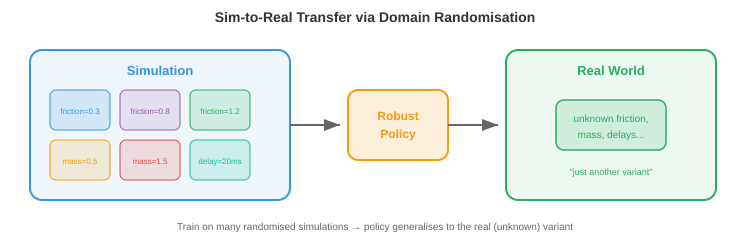

# 机器人学习

*机器人学习弥合了算法与物理行动之间的鸿沟。本章涵盖运动学、动力学、经典控制、模仿学习、仿真到现实迁移、操作、移动和安全——这些技术赋予机器人在现实世界中移动、抓取、行走和交互的能力。*

- 在前面的章节中，我们研究了如何感知世界（第8章，第11章文件1）以及如何从数据中学习（第6章）。但感知和学习还不够。机器人必须**行动**：移动手臂抓取杯子、在不平坦的地形上行走、或在仓库中导航。这就是机器人学习的用武之地。

- 核心挑战在于物理世界是连续的、高维的、接触丰富的且不宽容的。图像识别中的分类错误只是标签错误，而机器人学中的控制错误则意味着机器人损坏或物体掉落。两者的代价截然不同。

## 机器人运动学

- **运动学**描述运动的几何关系，不考虑力。机器人手臂是由关节连接的刚性连杆组成的链条。每个关节有一个自由度（DoF）：要么旋转（旋转关节），要么滑动（棱柱关节）。

- 机器人的**构型**是所有关节角度（或位移）的集合 $\\mathbf{q} = [q_1, q_2, \\ldots, q_n]^T$。这个向量位于**关节空间**（或构型空间）中，这是一个$n$维空间，每个轴对应一个关节。一个6自由度机器人手臂有一个6维构型空间。


- **正向运动学（FK）**根据给定的关节角度计算末端执行器（"手"）的位置和姿态。这是一个从关节空间映射到**任务空间**（末端执行器的3D位置和姿态，也称为笛卡尔空间）的函数 $\\mathbf{x} = f(\\mathbf{q})$。

- 每个关节由一个$4 \\times 4$齐次变换矩阵描述（回顾第2章的仿射变换）。**Denavit-Hartenberg（DH）约定**用四个参数参数化每个关节：连杆长度$a$、连杆扭转角$\\alpha$、连杆偏移$d$和关节角度$\\theta$。关节$i$的变换为：

$$T_i = \\begin{bmatrix} \\cos\\theta_i & -\\sin\\theta_i \\cos\\alpha_i & \\sin\\theta_i \\sin\\alpha_i & a_i \\cos\\theta_i \\\\ \\sin\\theta_i & \\cos\\theta_i \\cos\\alpha_i & -\\cos\\theta_i \\sin\\alpha_i & a_i \\sin\\theta_i \\\\ 0 & \\sin\\alpha_i & \\cos\\alpha_i & d_i \\\\ 0 & 0 & 0 & 1 \\end{bmatrix}$$

- 完整的正向运动学是所有关节变换的乘积：$T_{0 \\to n} = T_1 T_2 \\cdots T_n$。这是矩阵乘法链式变换（第2章）：每个关节的变换依次应用，将坐标系从基座旋转和平移到末端执行器。

- **逆向运动学（IK）**是反向问题：给定期望的末端执行器姿态$\\mathbf{x}^*$，求关节角度$\\mathbf{q}$使得$f(\\mathbf{q}) = \\mathbf{x}^*$。这要难得多，因为：

    - 映射是非线性的（涉及正弦和余弦）。
    - 可能有多个解（不同的手臂构型可以到达同一点）。
    - 可能没有解（目标超出可达范围）。

- 解析解只存在于特定的机器人几何构型中。对于通用机器人，IK使用**雅可比矩阵**迭代求解。雅可比矩阵$J(\\mathbf{q})$将关节角度的微小变化与末端执行器位置的微小变化联系起来（回顾第3章的雅可比矩阵）：

$$\\dot{\\mathbf{x}} = J(\\mathbf{q}) \\dot{\\mathbf{q}}$$

- 要将末端执行器移动一个小的量$\\Delta \\mathbf{x}$，我们需要$\\Delta \\mathbf{q} = J^{-1} \\Delta \\mathbf{x}$（当$J$不是方阵时使用伪逆$J^+ \\Delta \\mathbf{x}$）。这个过程迭代进行，直到末端执行器到达目标，本质上就是将牛顿法（第3章）应用于运动学方程。

- 在**奇异点**附近，雅可比矩阵的秩下降（某些列变得线性相关，如我们在第2章中研究的）。物理上这意味着机器人失去一个自由度：无论关节移动多快，末端执行器都无法在某些方向上移动。伪逆在奇异点附近会爆炸，因此使用阻尼最小二乘法（加入正则化项$\\lambda^2 I$）：

$$\\Delta \\mathbf{q} = J^T(JJ^T + \\lambda^2 I)^{-1} \\Delta \\mathbf{x}$$

## 动力学与控制

- **动力学**将力引入画面。机器人手臂的运动方程遵循**操作臂方程**：

$$M(\\mathbf{q})\\ddot{\\mathbf{q}} + C(\\mathbf{q}, \\dot{\\mathbf{q}})\\dot{\\mathbf{q}} + \\mathbf{g}(\\mathbf{q}) = \\boldsymbol{\\tau}$$

- 其中$M(\\mathbf{q})$是质量（惯性）矩阵，$C(\\mathbf{q}, \\dot{\\mathbf{q}})$捕获科里奥利力和离心力效应，$\\mathbf{g}(\\mathbf{q})$是重力向量，$\\boldsymbol{\\tau}$是关节力矩向量（控制输入）。这是一个二阶微分方程组，每个关节一个方程。

- 质量矩阵$M$总是对称正定的（回顾第2章，正定矩阵保证唯一最小值，在这里它确保系统对施加的力矩有可预测的响应）。

- **PID控制**是机器人学中使用最广泛的控制器。对于每个关节，它根据误差$e(t) = q_{\\text{期望}}(t) - q_{\\text{实际}}(t)$计算力矩：

$$\\tau(t) = K_p e(t) + K_i \\int_0^t e(s) \\, ds + K_d \\dot{e}(t)$$

- 三个项有直观的作用：
    - **比例项**（$K_p$）：与当前误差成比例地校正。误差越大 → 校正越大。就像弹簧将关节拉向目标。
    - **积分项**（$K_i$）：累积过去的误差以消除稳态偏差。如果关节持续欠调，积分项会积累并提供额外的推力。
    - **微分项**（$K_d$）：对误差变化率作出反应，提供阻尼。它随着误差减小而减缓响应，防止过冲和震荡。


- 调整$K_p, K_i, K_d$是一种平衡：$K_p$太大会引起震荡，$K_d$太大会使系统反应迟钝，$K_i$太大会导致积分饱和（在持续误差期间积分无限增长）。

- **模型预测控制（MPC）**具有前瞻性。在每个时间步，它求解一个优化问题：找到未来控制序列，在有限时域内最小化代价函数（例如，跟踪误差+控制能量），并满足动力学模型和约束条件。只应用第一个控制量，然后在下一个时间步重复该过程。

$$\\min_{\\mathbf{u}_{0:T}} \\sum_{t=0}^{T} \\left[ \\|\\mathbf{x}_t - \\mathbf{x}_t^*\\|_Q^2 + \\|\\mathbf{u}_t\\|_R^2 \\right] \\quad \\text{subject to} \\quad \\mathbf{x}_{t+1} = f(\\mathbf{x}_t, \\mathbf{u}_t)$$

- 这里$\\|\\mathbf{x}\\|_Q^2 = \\mathbf{x}^T Q \\mathbf{x}$是使用正定矩阵$Q$（第2章）的加权范数，允许对不同状态误差进行不同惩罚。MPC自然地处理约束（关节限位、力矩限位、避障），因为它们被显式地包含在优化中。

- **阻抗控制**调节力与运动之间的关系，而不是跟踪刚性轨迹。它不命令"到达位置$x$"，而是命令"表现得像一个以$x$为中心的弹簧-阻尼系统"：

$$F = K_s(\\mathbf{x}^* - \\mathbf{x}) + D(\\dot{\\mathbf{x}}^* - \\dot{\\mathbf{x}})$$

- 其中$K_s$是刚度矩阵，$D$是阻尼矩阵。这使得机器人具有柔顺性：如果它接触到障碍物，它会退让而不是强行通过。阻抗控制对于接触密集型任务（如将销钉插入孔中或将物体递给人类）至关重要。

## 模仿学习

- 我们可以从示范中学习控制策略，而不是手工设计控制器。人类执行任务，机器人观察，学习算法提取策略。这就是**模仿学习**（或从示范中学习）。

- **行为克隆（BC）**是最简单的方法：将示范视为监督学习数据集。给定来自专家的观测-动作对$\\{(\\mathbf{o}_t, \\mathbf{a}_t)\\}$，训练策略$\\pi_\\theta(\\mathbf{a} \\mid \\mathbf{o})$从观测中预测专家的动作。这是标准的监督学习（第6章）：最小化损失：

$$\\mathcal{L}(\\theta) = \\mathbb{E}_{(\\mathbf{o}, \\mathbf{a}) \\sim \\mathcal{D}} \\left[ \\| \\pi_\\theta(\\mathbf{o}) - \\mathbf{a} \\|^2 \\right]$$


- 问题是**分布偏移**（也称为**复合误差问题**）。在训练期间，策略看到的是专家的状态。在部署期间，策略自身的小误差将其推入专家从未访问过的状态。这些不熟悉的状态导致更差的动作，进而导致更不熟悉的状态，误差迅速累积放大。

- 想象一下通过观看完美驾驶员来学习开车。你从未见过小幅偏移后会发生什么，因为专家从未偏移过。第一次你稍为偏离时，你完全不知道如何恢复。

- **DAgger**（数据集聚合）通过迭代解决这个问题：
    1. 在当前数据上训练策略。
    2. 在环境中运行策略，收集新状态。
    3. 请专家用正确的动作标注这些新状态。
    4. 将新数据添加到数据集并重新训练。

- 经过多次迭代，数据集覆盖了学习策略实际访问的状态，而不仅仅是专家的轨迹。策略得到了改善，因为它已经看到并学会了从自己的错误中恢复。

- **使用Transformer的动作分块（ACT）**是一种现代方法，策略预测一系列未来动作（一个"块"），而不是一次预测一个动作。它使用带有transformer主干的 conditional VAE 实现。预测动作块更鲁棒，因为它捕获了时间相关性：伸手动作的平滑性编码在块中，而不是依赖于可能漂移的自回归单步预测。

- **扩散策略**将扩散模型（第8章）应用于动作生成。它不预测单个动作，而是建模以观测为条件的完整动作分布。从噪声开始，它迭代地去噪以生成动作序列。这自然地处理了**多模态性**：当有多个有效方式完成任务时（从左边或右边伸手），扩散模型可以表示两种模式，而回归策略会平均它们（到达中间某处，可能两种都无效）。

## 仿真到现实迁移

- 在现实世界中训练机器人是昂贵、缓慢且危险的。一个通过试错学习抓取的机器人可能需要数千次尝试，在这个过程中损坏物体和自身。**仿真**提供了无限、安全、快速的体验。但仿真器并非完美：物理近似、视觉合成、接触简化。

- **仿真到现实差距**是仿真性能与真实性能之间的差异。在仿真中完美运行的策略可能在真实机器人上完全失败，因为它过度拟合了仿真器的特定细节。



- **域随机化**通过在广泛的仿真器设置上进行训练来应对这一问题。不是使用一种仿真，而是使用数千种具有随机化参数的仿真：
    - 物理：摩擦系数、质量、阻尼
    - 视觉：光照、纹理、颜色、相机位置
    - 动力学：电机延迟、噪声水平

- 其思想是，如果策略在所有这些变化下都能工作，那么现实世界只是分布中的"另一种变化"。策略学习对随机化属性不变的特征，这些不变特征能够迁移。

- **系统辨识**采取相反的方法：不是随机化所有内容，而是仔细测量真实系统的物理参数并将仿真器调谐到匹配。这提供了更精确的仿真，但也更脆弱（任何未建模的效应都会导致差距）。

- 在实践中，最好的结果是将两者结合：使用系统辨识使仿真器合理接近，然后使用域随机化覆盖剩余的不确定性。

- **通过微调的仿真到现实迁移**主要在仿真中训练，然后进行少量的真实世界微调。仿真提供了良好的初始化，真实世界数据纠正了仿真器特定的偏差。这需要的真实世界数据远少于从头训练。

## 机器人世界模型

- 上述所有强化学习和模仿学习方法都是**无模型**的：策略通过直接交互（或示范）学习行动，而不显式建模世界如何运作。另一种是**基于模型**的学习：首先学习环境动力学模型，然后使用该模型进行规划或生成合成经验。

- **世界模型**学习转移函数$p(s_{t+1} \\mid s_t, a_t)$：给定当前状态和动作，预测下一状态（如第10章所述）。在机器人学中，这意味着预测如果机器人采取特定动作会发生什么："如果我向左推这个方块，它会滑动3厘米，它后面的杯子会倒下。"

- 其吸引力在于**样本效率**。现实世界的机器人交互成本高昂。如果机器人能从适量的真实数据中学习一个世界模型，它就可以通过在大脑中滚动模型来"想象"数千条轨迹，在不动用物理世界的情况下规划和完善策略。这类似于棋手通过在脑海中模拟走棋来思考。

- **DreamerV3**是一个通用的基于模型的强化学习智能体。它联合学习三个组件：
    - **表示模型**：将观测编码为紧凑的潜在状态。
    - **转移模型**（世界模型）：根据当前状态和动作预测下一潜在状态。
    - **奖励模型**：从潜在状态预测奖励。

- 然后智能体通过在潜在空间中展开转移模型多步来进行"做梦"，在这些想象的轨迹上训练策略，并将策略转移到真实环境。关键创新在于所有想象都在潜在空间（紧凑的学习表示）中进行，而不是在像素空间中，使其计算可行。

$$\\hat{s}_{t+1} = f_\\theta(s_t, a_t), \\quad \\hat{r}_t = g_\\theta(s_t)$$

- 转移模型$f_\\theta$和奖励模型$g_\\theta$在真实经验上训练，策略在想象的展开上训练。这将数据收集与策略优化解耦。

- 对于机器人操作，世界模型实现了**心理排练**。在尝试抓取之前，机器人可以在其学习模型上模拟多种方法，并选择最可能成功的一种。这对于接触密集型任务尤其有价值，因为在这些任务中现实世界的试错既慢又危险。

- 世界模型也自然地与**仿真到现实迁移**相关联：在真实数据上训练的世界模型实际上是一个自动捕获真实世界物理的学习型仿真器，完全绕过了仿真到现实差距。对于理解良好的场景，它可能不如手工构建的仿真器精确，但它捕获了手工仿真器常常出错的效果（摩擦、形变、接触动力学）。

- **JEPA**（联合嵌入预测架构，在第10章中介绍）提供了像素级预测的替代方案。JEPA不在像素空间预测精确的未来观测，而是在嵌入空间中预测："下一状态的潜在表示将接近该向量。"这避免了预测像素级完美未来的困难（既无必要又计算浪费），并专注于预测对决策重要的未来方面。

- 世界模型的局限性在于**复合预测误差**。转移模型中的微小不准确性在长程展开中积累，导致想象的轨迹偏离现实。缓解措施包括：短想象时域、集成模型（使用不确定性检测预测何时变得不可靠）、以及定期用新的真实世界数据校准模型。

## 操作

- **操作**是使用机器人末端执行器与物体交互的艺术：抓取、放置、推、插入、组装。

- **抓取**是基础的操作技能。目标是找到一个稳定的抓取姿态：夹爪的位置和方向，能够牢固地抓住物体。

- **解析抓取规划**使用物理学。如果接触力能够抵抗外部扳手（力和力矩），则抓取是稳定的。对于平行夹爪，最简单的标准是**力闭合**条件：接触法线必须跨越所有力的方向，使抓取能够抵抗任何扰动。这涉及检查抓取扳手矩阵的秩，是第2章秩概念的直接应用。

- **数据驱动的抓取**学习从感官输入预测抓取成功。给定桌子上物体的深度图像，网络预测每个候选夹爪姿态的抓取质量分数。**GraspNet**和类似架构使用点云编码器（PointNet风格，第8章）来预测带有置信度分数的6自由度抓取姿态（位置+方向）。

- **灵巧操作**超越了简单的抓取和放置。多指手具有20+自由度，可以执行手中旋转（在手指间旋转笔）、工具使用和精细组装等任务。状态空间巨大且接触复杂，使其成为机器人学中最困难的问题之一。

- 学习灵巧操作通常使用带有大量域随机化的仿真中的强化学习（第6章）。OpenAI用Shadow手解决魔方的工作就是在仿真中使用随机化物理训练PPO策略，最终实现了向真实机器人手的迁移。

- **接触密集型任务**如销钉入孔或擦拭表面，要求机器人与环境保持受控接触。这些任务需要力传感和柔顺控制（阻抗控制），并且难以准确仿真，因为接触物理众所周知地难以建模。

## 移动

- 移动是让机器人的身体在世界中移动：行走、奔跑、攀爬、游泳。与操作的关键区别在于机器人必须在移动时保持平衡，并且与地面的接触点随时间变化。

- **腿式移动**具有挑战性，因为它本质上是不稳定的。单步站立的双足机器人（类人机器人）就像一个倒立摆。质心必须保持在支撑多边形（与地面接触的脚的凸包）上方，否则机器人会摔倒。

- **零力矩点（ZMP）**是地面上重力和惯性力产生的净力矩为零的点。如果ZMP保持在支撑多边形内，机器人就不会翻倒。传统的人形机器人控制器（如本田ASIMO）规划使ZMP保持在边界内的轨迹。

- **中央模式发生器（CPG）**是受生物学启发的基于振荡器的控制器。动物使用脊髓中的神经回路产生有节奏的移动模式（行走、小跑、奔跑），无需大脑持续参与。CPG模型使用耦合微分方程：

$$\\dot{\\phi}_i = \\omega_i + \\sum_j w_{ij} \\sin(\\phi_j - \\phi_i - \\psi_{ij})$$

- 其中$\\phi_i$是振荡器$i$的相位，$\\omega_i$是自然频率，$w_{ij}$是耦合强度，$\\psi_{ij}$是期望的相位偏移。不同的相位关系产生不同的步态：所有腿同步（跳跃）、交替配对（小跑）、顺序（行走）。正弦耦合自然地同步振荡器，类似于傅里叶级数（第3章）如何将运动分解为频率分量。

- **用于移动的强化学习**已成为敏捷四足和类人机器人的主要方法。机器人在仿真中通过试错学习策略$\\pi(\\mathbf{a} \\mid \\mathbf{o})$（第6章），奖励包括前进速度、稳定性和能效，惩罚包括摔倒、关节限位违规和抖动运动。

- 近期工作（如Agility Robotics、Boston Dynamics和学术实验室）的关键洞见是，RL训练的移动策略远优于手工设计的控制器。它们自然学会从推动中恢复、适应地形变化，并处理没有工程师能预料到的情况。训练通常使用PPO（第6章）结合域随机化。

- **四足机器人**（如Boston Dynamics Spot或Unitree Go2）已成为腿式机器人的主力。四条腿提供固有稳定性（三条腿的三角支撑总能在一条腿移动时支撑身体）。四足机器人的RL策略实现了令人印象深刻的结果：以3+米/秒奔跑、爬楼梯、在岩石地形上导航以及从踢击中恢复。

- **类人机器人移动**更难，因为双足机器人有更小的支撑多边形和更高的质心。最近的进展（Tesla Optimus、Figure、Unitree H1）使用在仿真中训练的RL，配以精心的奖励塑造。类人机器人必须学会的不仅仅是行走，还要协调手臂摆动以保持平衡、在不平坦表面上导航以及从扰动中恢复。

## 机器人学习中的安全性

- 一个为了学习而随机探索的机器人（如在RL中）可能会损坏自身、环境或附近的人类。**安全的机器人学习**约束探索以避免灾难性后果。

- **约束RL**向MDP（第6章）添加安全约束。目标变为：在满足$J_c(\\pi) \\leq d$的条件下最大化奖励，其中$J_c$是期望的累积代价（如碰撞事件），$d$是最大允许代价。像约束策略优化（CPO）这样的算法扩展了PPO以处理这些约束。

- **安全包络**定义了机器人绝不能越过的硬边界，无论学习策略如何输出。一个安全控制器监控机器人状态，并在即将违反约束时覆盖学习策略（例如，接近关节限位、在人类附近移动过快、或超过力阈值）。这是一种分层架构：学习算法处理性能，安全层处理约束。

- **风险感知规划**显式地建模环境和机器人自身状态估计中的不确定性。它不是为最可能的结果进行规划，而是在置信区间内为最坏情况进行规划。这与条件数概念（第2章）相关：良态系统对扰动具有鲁棒性，风险感知规划寻求在扰动下仍保持安全的控制策略。

## 编程任务（使用CoLab或notebook）

1. 实现一个简单2连杆平面机器人手臂的正向运动学。计算并可视化不同关节角度下的末端执行器位置。
```python
import jax.numpy as jnp
import matplotlib.pyplot as plt

def forward_kinematics(q1, q2, l1=1.0, l2=0.8):
    """计算2连杆手臂的关节和末端执行器位置。"""
    x1 = l1 * jnp.cos(q1)
    y1 = l1 * jnp.sin(q1)
    x2 = x1 + l2 * jnp.cos(q1 + q2)
    y2 = y1 + l2 * jnp.sin(q1 + q2)
    return jnp.array([0, x1, x2]), jnp.array([0, y1, y2])

fig, ax = plt.subplots(figsize=(6, 6))
configs = [(0.5, 0.3), (1.0, -0.5), (1.5, 1.0), (2.0, -1.5)]
colors = ["#e74c3c", "#3498db", "#27ae60", "#9b59b6"]

for (q1, q2), c in zip(configs, colors):
    xs, ys = forward_kinematics(q1, q2)
    ax.plot(xs, ys, "o-", color=c, linewidth=2, markersize=6,
            label=f"q=({q1:.1f}, {q2:.1f})")

ax.set_xlim(-2, 2); ax.set_ylim(-2, 2)
ax.set_aspect("equal"); ax.grid(True); ax.legend()
ax.set_title("2连杆机器人手臂：正向运动学")
plt.show()
```

2. 使用雅可比伪逆实现逆向运动学。从随机构型开始，迭代地将末端执行器移动到目标。
```python
import jax
import jax.numpy as jnp
import matplotlib.pyplot as plt

l1, l2 = 1.0, 0.8

def end_effector(q):
    x = l1 * jnp.cos(q[0]) + l2 * jnp.cos(q[0] + q[1])
    y = l1 * jnp.sin(q[0]) + l2 * jnp.sin(q[0] + q[1])
    return jnp.array([x, y])

jacobian_fn = jax.jacobian(end_effector)

target = jnp.array([0.5, 1.2])
q = jnp.array([0.1, 0.1])
trajectory = [end_effector(q)]

for _ in range(50):
    pos = end_effector(q)
    error = target - pos
    if jnp.linalg.norm(error) < 1e-4:
        break
    J = jacobian_fn(q)
    # 阻尼伪逆处理接近奇异点的情况
    dq = J.T @ jnp.linalg.solve(J @ J.T + 0.01 * jnp.eye(2), error)
    q = q + dq
    trajectory.append(end_effector(q))

traj = jnp.stack(trajectory)
plt.plot(traj[:, 0], traj[:, 1], "b.-", label="末端执行器路径")
plt.plot(*target, "r*", markersize=15, label="目标点")
plt.gca().set_aspect("equal"); plt.grid(True); plt.legend()
plt.title(f"IK在{len(trajectory)-1}步内收敛")
plt.show()
```

3. 模拟一个简单的PID控制器跟踪期望的关节轨迹。观察调参对增益的影响。
```python
import jax.numpy as jnp
import matplotlib.pyplot as plt

# 期望轨迹：平滑正弦运动
dt = 0.01
t = jnp.arange(0, 5, dt)
q_desired = jnp.sin(2 * t)

# 模拟二阶动力学：m * q_ddot + b * q_dot = tau
m, b_damp = 1.0, 0.5

for Kp, Kd, Ki, label in [(10, 5, 0, "仅PD"), (10, 5, 2, "PID"), (50, 10, 2, "激进PID")]:
    q, q_dot, integral = 0.0, 0.0, 0.0
    qs = []
    for i in range(len(t)):
        error = q_desired[i] - q
        integral += error * dt
        d_error = -q_dot  # 误差导数（此处简化，已知期望速度）
        tau = Kp * error + Kd * d_error + Ki * integral
        q_ddot = (tau - b_damp * q_dot) / m
        q_dot += q_ddot * dt
        q += q_dot * dt
        qs.append(float(q))

    plt.plot(t, qs, label=label)

plt.plot(t, q_desired, "k--", label="期望值", linewidth=2)
plt.xlabel("时间 (秒)"); plt.ylabel("关节角度")
plt.legend(); plt.title("PID控制器跟踪")
plt.show()
```
