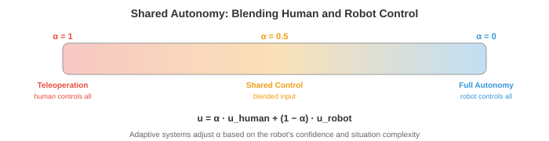

# 太空与极端环境机器人

*太空和极端环境机器人将自主性推向极限——通信延迟、辐射和非结构化地形要求机器人自己思考。本章涵盖行星漫游车、在轨服务、通信受限自主性、抗辐射计算、水下机器人、搜索救援、群体机器人和人机交互。*

- 在本章中，我们研究了在相对温和环境中运行的自主系统：有车道标线的道路、有平坦地板的地板、有已知物体类别的厨房。但机器人技术的一些最具影响力的应用是在人类无法到达的环境，或者人类存在的成本极高的环境：火星表面、深海海底、核灾难现场和燃烧的建筑。

- 这些**极端环境**面临着共同的挑战：通信受限或有延迟、地形非结构化且不可预测、硬件必须在恶劣条件下生存、而且附近没有人能在出现问题时修理。机器人必须真正自主，而不仅仅是"有人在屏幕前监控的自主"。

## 太空机器人

- 太空是终极的极端环境。没有空气，温度在-170°C到+120°C之间摆动，辐射轰击电子设备，而援助在数百万公里之外。太空机器人必须异常可靠、节能且自主。

- **行星漫游车**是在其他世界表面探索的移动机器人。NASA的火星漫游车（勇气号、机遇号、好奇号、毅力号）是最著名的例子。每一代都比上一代更加自主。


- 根本限制是**通信延迟**。火星距地球4-24分钟的无线电距离（取决于轨道位置），因此往返通信需要8-48分钟。漫游车不能实时操控。如果遇到岩石，它不能向地球求助并等待回应。它必须自己决定。

- 早期的漫游车（勇气号、机遇号）严重依赖地面参与的规划：人类研究图像、规划路径、上传命令，漫游车执行命令。一个驾驶周期需要一个完整的火星日。漫游车每天大约能行进50-100米。

- 好奇号和毅力号上的**AutoNav**（自主导航）极大地提高了自主性。漫游车使用立体相机构建局部3D地图（回顾第8章的立体深度），评估地形可通过性（坡度、粗糙度、岩石大小），并使用基于网格的规划器和可通过性代价图规划安全路径。漫游车在人类团队睡眠时自主行驶，将每日行进距离提高到100米以上。

- 火星漫游车上的感知流程受到抗辐射处理器的限制，这些处理器比消费级硬件慢几个数量级（下文讨论）。算法必须计算节俭：经典的立体匹配而非深度神经网络，简单的代价图规划器而非学习型策略。

- **在轨服务**涉及在轨道上检查、修理、加油或使卫星脱离轨道的机器人。随着太空变得更加拥挤，这是一个不断增长的领域。**OSAM-1**（NASA）和商业企业（Astroscale、Northrop Grumman MEV）等任务使用机械臂和对接机构来服务卫星。

- 挑战在于**近距离操作**：服务航天器必须接近目标卫星（可能正在翻滚、不合作且缺乏对接接口），并在微重力下执行精确操作。基于视觉的位姿估计（从相机图像确定目标的3D位置和方向）至关重要。这使用了第8章的技术：特征检测、PnP（透视n点）求解，以及最近基于深度学习的位姿估计器。

- **卫星检查**使用小型航天器目视检查其他卫星是否有损坏或异常。检查者必须自主绕目标导航、避免碰撞并从最佳视角捕获高分辨率图像。这是一个规划问题：找到覆盖所有检查点且满足燃料约束、光照条件和避碰要求的轨迹。

## 通信约束

- 在太空中，通信受到光速、可用带宽和轨道几何的限制（火星背面的漫游车在没有中继卫星的情况下根本无法与地球通信）。

- 这些限制从根本上改变了自主性架构。在地球上，机器人可以将高清视频流传输到云服务器，在GPU集群上运行推理，并在毫秒内接收指令。在太空中，机器人必须在飞行器上完成所有工作。

- **高延迟**意味着机器人必须在没有实时人类指导的情况下规划和行动。自主软件必须处理常规操作、检测异常并响应危险，而无需等待人类输入。这需要鲁棒的板载状态估计、故障检测和应急规划。

- **有限带宽**意味着机器人无法传输原始传感器数据。一张高分辨率图像可能有几兆字节，但火星到地球的数据速率通过直接对地链路只有每秒几千比特（通过轨道中继更高，但仍然有限）。机器人必须积极压缩数据、优先决定发送哪些数据，并在本地做出大部分决策。

- **通信窗口**是间歇性的。火星漫游车只能在特定轨道几何形状期间与地球通信，通常每个火星日通过中继卫星只有几小时。在这些窗口之外，漫游车完全靠自己。

- 对AI的影响是**板载自主性**必须非常可靠。系统需要检测是否出了问题（轮子卡住了、传感器故障了、前方地形无法通行），决定安全响应，并继续运行直到下一个通信窗口，届时它可以报告并接收更新指令。

## 抗辐射计算

- 太空中充满了电离辐射：宇宙射线、太阳粒子事件以及行星磁场中的捕获辐射。高能粒子可以翻转存储器中的比特（**单粒子翻转，SEU**），永久损坏晶体管（**总电离剂量，TID**），或在电路中引起破坏性闩锁。

- **抗辐射处理器**被设计为承受这种环境。它们使用更大的晶体管几何尺寸、冗余逻辑（三模冗余：每个电路有三个副本对输出进行投票）和专门的制造工艺。代价是性能：最先进的抗辐射处理器可能提供200 MIPS，而消费级GPU每秒可执行数十亿次操作。

- **RAD750**（BAE Systems）为好奇号和许多其他航天器提供动力。它以200 MHz运行，约400 MIPS的处理能力，相当于1990年代中期的台式电脑。毅力号使用类似等级的处理器。在现代神经网络上运行（数百万参数、数十亿次乘加运算）在这样的硬件上是不可行的。

- **模型压缩**变得至关重要。第6章的技术（量化、剪枝、知识蒸馏）用于缩小神经网络以适应极端的计算预算。在笔记本电脑GPU上毫秒级运行的模型可能在抗辐射处理器上需要数分钟，或者根本无法装入内存。

- 另一种方法使用**商用现货**处理器，配合软件中的辐射缓解措施：纠错码、看门狗定时器、定期内存清理和优雅降级策略。一些现代任务使用这种方法以获得更强大的计算能力，代价是增加了软件复杂性和风险。

- 未来的行星任务正在探索**FPGA**和专门的AI加速器，它们可以具有耐辐射性，同时提供比传统抗辐射CPU多得多的计算能力，可能首次实现板载深度学习。

## 非结构化地形中的自主导航

- 在地球上，道路平坦、标记清晰且有地图。在火星、月球或灾难现场，没有道路。地形是非结构化的：岩石、斜坡、沙地、裂缝和可能无法支撑机器人重量的表面。

- **地形分类**评估每块地面是否安全通行。特征包括坡度（来自3D重建）、粗糙度（表面法线的方差）、岩石密度和土壤类型。经典方法从立体深度图计算这些特征；现代方法在视觉和几何特征上使用学习型分类器。

- **视觉-惯性里程计（VIO）**通过跟踪跨相机帧的视觉特征并与IMU测量融合来估计机器人的运动。这是SLAM的核心组件（第8章），针对极端条件进行了调整。在火星上，VIO必须处理：无特征的沙地地形（几乎没有可跟踪的视觉特征）、强烈的光照（极端阴影）和有限的计算能力。

- 估计过程使用**扩展卡尔曼滤波（EKF）**或因子图优化融合视觉和惯性数据。状态向量包括位置、速度、方向和IMU偏差。预测步骤使用IMU积分：

$$\\mathbf{x}_{t+1} = f(\\mathbf{x}_t, \\mathbf{u}_t)$$

- 其中$\\mathbf{u}_t$是IMU测量值（加速度和角速度）。更新步骤使用视觉特征观测来校正预测。这是贝叶斯估计（第5章）：IMU提供先验，视觉观测更新信念。

- **危险规避**在行星着陆过程中至关重要。当航天器下降向表面时，它必须使用板载相机或LiDAR实时识别安全的着陆区。NASA毅力号上的**地形相对导航（TRN）**系统将板载相机图像与预加载的轨道地图进行比较，以确定下降过程中的位置，然后避开危险地形。这使得在Jezero陨石坑着陆成为可能——一个科学丰富但地形危险的站点，对于以前的 missions 来说风险太大。

## 水下机器人

- 深海与太空一样陌生：压碎性压力（全海深1000+个大气压）、接近零能见度、无GPS和有限的通信。水下机器人对海洋科学、近海基础设施检查、深海采矿和搜索操作至关重要。

- **AUV**（自主水下航行器）无缆运行，携带自己的电力和计算资源。它们遵循预设的测量模式或使用板载智能来适应发现。AUV用于海底测绘、管道检查和环境监测。

- **ROV**（遥控水下航行器）通过电缆连接到水面船只，提供电力和通信。它们用于需要实时人类控制的任务：深海操作、建造和修理。缆线消除了通信限制，但限制了范围并增加了操作复杂性。

- **声学通信**是主要的水下通信方法（无线电波在水中迅速衰减）。声学调制解调器在几公里范围内达到1-10 kbps的数据速率，而陆地上无线电可达吉比特每秒。这甚至比火星通信更加受限，迫使AUV高度自主。

- **水下SLAM**尤其具有挑战性。声纳提供距离测量，但角分辨率差且噪声大（来自海底和水面的多径反射）。相机只能在非常短的距离内工作（清澈水中几米，浑浊条件下更短）。基于特征的可视SLAM（第8章）必须针对水下场景的独特视觉特征进行调整：颜色衰减（红光首先被吸收）、反向散射以及产生亮斑和深影的人工照明。

- 无GPS导航使用**航位推算**（积分来自多普勒测速仪DVL的速度，该仪器利用声学多普勒频移测量相对于海底的速度），辅以偶尔浮出水面获取GPS定位或来自水面应答器的声学定位。这与仅IMU导航相同的漂移问题：小的速度误差在长任务中累积。

## 搜索救援机器人

- 在地震、建筑物倒塌或工业事故后，机器人可以进入对人类救援人员太危险的区域：结构不稳定的建筑物、有毒环境、火场或密闭空间。

- 需求是：快速部署（几分钟而非几小时）、在GPS受限环境中运行（建筑物内部、地下）、通过墙壁和瓦砾的鲁棒通信，以及导航高度杂乱、部分坍塌空间的能力，这些空间充满碎片、灰尘和不良照明。

- **多机器人协调**在搜索救援中很有价值，因为一支机器人团队可以比单个机器人更快地覆盖大面积。挑战在于协调：机器人必须划分搜索区域、避免重复工作并共享发现。

- **前沿探索**将机器人分配到已探索和未探索空间之间的边界（"前沿"）。每个机器人导航到最近的未探索前沿、绘制地图并继续前进。中央或分布式规划器将前沿分配给机器人以最小化总探索时间。这是一个覆盖优化问题。

- 通过瓦砾的通信不可靠。机器人可能失去与控制台和彼此的联系。系统必须对间歇通信具有鲁棒性：每个机器人应能独立运行，构建自己的局部地图并做出自己的决策，然后在通信恢复时合并信息。

## 群体机器人

- **群体机器人**使用大量简单、低成本的机器人，通过局部交互实现复杂的集体行为。没有单个机器人单独具备能力，但整个群体可以执行单个机器人无法完成的任务。

- 灵感来自生物群体：蚂蚁用身体搭桥、蜜蜂集体决定巢穴位置、鱼群通过协调运动躲避捕食者。在每种情况下，简单的局部规则（跟随邻居、避免碰撞、向食物移动）产生复杂的全局行为。

- **去中心化控制**意味着没有中央指挥官。每个机器人遵循相同的局部规则，仅对其邻居和即时环境作出反应。全局行为从这些局部交互中**涌现**。这使得群体具有固有的鲁棒性：如果一个机器人失效，群体继续运行。没有单点故障。

- **共识算法**使群体能够仅通过局部通信就集体决策达成一致（例如，向哪个方向移动、优先处理哪个任务）。一个简单的共识协议让每个机器人与其邻居平均其值：

$$x_i(t+1) = \\frac{1}{|N_i| + 1} \\left( x_i(t) + \\sum_{j \\in N_i} x_j(t) \\right)$$


- 其中$N_i$是机器人$i$的邻居集合。这一过程迭代直到所有机器人收敛到相同的值（全局平均值）。收敛速度取决于通信图的拓扑结构，特别是其代数连通性（图拉普拉斯矩阵的第二小特征值，与第2章的特征值相关）。


- **群集算法**（Reynolds规则）通过每个机器人的三个简单规则产生协调的群体运动：
    - **分离**：远离太近的邻居（避免碰撞）。
    - **对齐**：朝向邻居的平均航向（朝相同方向移动）。
    - **内聚**：朝向邻居的平均位置（与群体在一起）。

- 每个规则是机器人速度的一个向量贡献。这些向量的加权和产生自然主义的群集行为。这是一个向量的线性组合（第1章），其中权重控制每个行为的相对重要性。

- 群体机器人的应用包括环境监测（在大范围内分布传感器）、精准农业（协调无人机进行作物喷洒）、建造（机器人集体组装结构）和搜索操作（高效覆盖大面积）。

## 人机交互

- 大多数真实的自主系统是与人类并肩运行，而非孤立运行。人与机器人之间的交互——他们如何沟通、共享控制和建立信任——与机器人的技术能力同样重要。



- **共享自主**混合了人和机器人的控制。不是完全遥控操作（人类控制一切）或完全自主（机器人控制一切），而是共享自主让人类提供高层意图，同时机器人处理底层执行。例如，人类可能指向一个物体说"捡起来"，然后机器人自主规划抓取和手臂运动。

- 数学上，共享自主可以建模为人类输入$\\mathbf{u}_h$和机器人自主动作$\\mathbf{u}_r$的混合：

$$\\mathbf{u} = \\alpha \\mathbf{u}_h + (1 - \\alpha) \\mathbf{u}_r$$

- 其中$\\alpha \\in [0, 1]$是混合参数。当$\\alpha = 1$时，人类完全控制（遥控操作）。当$\\alpha = 0$时，机器人完全自主。自适应共享自主根据情况调整$\\alpha$：机器人在自信时接管更多控制，在不确定或情况新颖时让出控制。

- **遥控操作**对于超出当前自主能力的任务仍然很重要。人类操作员通过机器人的相机远程查看场景并控制机器人。挑战是**延迟**：即使100毫秒的延迟也会使遥控操作变得困难，而太空中的多秒延迟使其对精细操作几乎不可能。预测显示（显示机器人预测的未来状态）和虚拟夹具（防止操作员命令危险运动的软件引导）有助于弥补。

- **信任校准**是确保人类对机器人有适当信任的问题：不要太多（过度信任导致自满，在需要时未能干预），也不要太少（信任不足导致不必要干预和利用不足）。信任应该校准到机器人的实际能力：在它处理得好的情况下信任它，在接近其能力边缘的情况下保持怀疑。

- 研究表明，信任受以下因素的影响：机器人的透明度（它是否解释其决策？）、可靠性（它是可预测地失败还是随机地失败？）以及沟通（它是否表达不确定性？）。一个说"我对此路径只有40%的置信度，是否继续？"的机器人比一个默默向前驾驶的机器人能做出更好的人类决策。

- 机器人运动中的**可读性**意味着机器人以传达其意图的方式运动给附近的人类。如果机器人伸手去拿一个物体，它的路径应该使其目标对象显而易见，即使它还未到达。这涉及规划最大化观察者早期推断目标的轨迹，可以形式化为给定观察到的部分轨迹时真实目标的后验概率最大化：

$$\\pi^* = \\arg\\max_\\pi P(G \\mid \\xi_{0:t})$$

- 其中$G$是目标，$\\xi_{0:t}$是到目前为止观察到的轨迹。这使用了贝叶斯推理（第5章）：观察者对可能的目标有先验，机器人的轨迹提供了更新此信念的证据。

## 编程任务（使用CoLab或notebook）

1. 模拟机器人群体就目标位置达成一致的共识算法。从随机初始位置开始，观察收敛过程。
```python
import jax
import jax.numpy as jnp
import matplotlib.pyplot as plt

n_robots = 10
rng = jax.random.PRNGKey(0)
positions = jax.random.uniform(rng, (n_robots, 2), minval=-5, maxval=5)

# 通信图：每个机器人与最近的3个邻居通信
def get_neighbours(positions, k=3):
    dists = jnp.linalg.norm(positions[:, None] - positions[None, :], axis=-1)
    # 对每个机器人，找最近的k个（排除自身）
    neighbours = jnp.argsort(dists, axis=1)[:, 1:k+1]
    return neighbours

history = [positions.copy()]

for step in range(30):
    neighbours = get_neighbours(positions)
    new_positions = jnp.zeros_like(positions)
    for i in range(n_robots):
        nbr_pos = positions[neighbours[i]]
        new_positions = new_positions.at[i].set(
            (positions[i] + nbr_pos.sum(axis=0)) / (len(neighbours[i]) + 1)
        )
    positions = new_positions
    history.append(positions.copy())

# 绘制收敛过程
fig, axes = plt.subplots(1, 3, figsize=(15, 4))
for ax, step_idx, title in zip(axes, [0, 10, 29], ["初始", "第10步", "最终"]):
    h = history[step_idx]
    ax.scatter(h[:, 0], h[:, 1], s=50)
    ax.set_xlim(-6, 6); ax.set_ylim(-6, 6)
    ax.set_aspect("equal"); ax.grid(True); ax.set_title(title)
plt.suptitle("群体共识：机器人收敛到一致性")
plt.tight_layout()
plt.show()
```

2. 实现Reynolds群集规则（分离、对齐、内聚）并模拟一个群体一起移动。
```python
import jax
import jax.numpy as jnp
import matplotlib.pyplot as plt

n = 30
rng = jax.random.PRNGKey(1)
k1, k2 = jax.random.split(rng)
pos = jax.random.uniform(k1, (n, 2), minval=-5, maxval=5)
vel = jax.random.uniform(k2, (n, 2), minval=-0.5, maxval=0.5)

dt = 0.1
separation_radius = 1.0
neighbour_radius = 3.0

trajectories = [pos.copy()]

for _ in range(200):
    new_vel = jnp.zeros_like(vel)
    for i in range(n):
        diffs = pos - pos[i]
        dists = jnp.linalg.norm(diffs, axis=1)

        # 半径内的邻居（排除自身）
        nbr_mask = (dists < neighbour_radius) & (dists > 0)
        sep_mask = (dists < separation_radius) & (dists > 0)

        # 分离：远离非常近的邻居
        if sep_mask.any():
            sep = -diffs[sep_mask].sum(axis=0)
        else:
            sep = jnp.zeros(2)

        # 对齐：匹配邻居的平均速度
        if nbr_mask.any():
            align = vel[nbr_mask].mean(axis=0) - vel[i]
        else:
            align = jnp.zeros(2)

        # 内聚：朝向邻居的平均位置
        if nbr_mask.any():
            cohesion = pos[nbr_mask].mean(axis=0) - pos[i]
        else:
            cohesion = jnp.zeros(2)

        new_vel = new_vel.at[i].set(vel[i] + 1.5 * sep + 0.5 * align + 0.3 * cohesion)

    # 限制速度
    speeds = jnp.linalg.norm(new_vel, axis=1, keepdims=True)
    vel = jnp.where(speeds > 2.0, new_vel / speeds * 2.0, new_vel)
    pos = pos + vel * dt
    trajectories.append(pos.copy())

# 绘制快照
fig, axes = plt.subplots(1, 3, figsize=(15, 4))
for ax, idx, title in zip(axes, [0, 50, 199], ["开始", "第50步", "第200步"]):
    p = trajectories[idx]
    v = vel if idx == 199 else jnp.zeros_like(vel)
    ax.scatter(p[:, 0], p[:, 1], s=20, c="blue")
    ax.set_aspect("equal"); ax.grid(True); ax.set_title(title)
    lim = max(abs(p).max() + 1, 6)
    ax.set_xlim(-lim, lim); ax.set_ylim(-lim, lim)
plt.suptitle("Reynolds群集：分离+对齐+内聚")
plt.tight_layout()
plt.show()
```

3. 模拟共享自主混合：人类提供带噪声的方向输入，机器人的自主系统提供到目标的平滑路径。用不同的alpha值进行混合。
```python
import jax
import jax.numpy as jnp
import matplotlib.pyplot as plt

goal = jnp.array([10.0, 5.0])
pos = jnp.array([0.0, 0.0])
dt = 0.1

rng = jax.random.PRNGKey(3)

fig, axes = plt.subplots(1, 3, figsize=(15, 4))
for ax, alpha in zip(axes, [1.0, 0.5, 0.0]):
    pos = jnp.array([0.0, 0.0])
    path = [pos.copy()]

    for step in range(150):
        # 机器人自主：到目标的平滑路径
        direction = goal - pos
        u_robot = direction / (jnp.linalg.norm(direction) + 1e-6) * 1.0

        # 人类输入：大致正确的方向但有噪声
        noise = jax.random.normal(jax.random.fold_in(rng, step), (2,)) * 0.5
        u_human = u_robot + noise

        # 混合
        u = alpha * u_human + (1 - alpha) * u_robot
        pos = pos + u * dt
        path.append(pos.copy())

        if jnp.linalg.norm(pos - goal) < 0.3:
            break

    path = jnp.stack(path)
    ax.plot(path[:, 0], path[:, 1], "b-", alpha=0.7)
    ax.plot(*goal, "r*", markersize=15)
    ax.plot(0, 0, "go", markersize=10)
    ax.set_title(f"α={alpha:.1f} ({'人类' if alpha==1 else '机器人' if alpha==0 else '共享'})")
    ax.set_xlim(-1, 12); ax.set_ylim(-3, 8)
    ax.set_aspect("equal"); ax.grid(True)

plt.suptitle("共享自主：混合人类与机器人控制")
plt.tight_layout()
plt.show()
```
