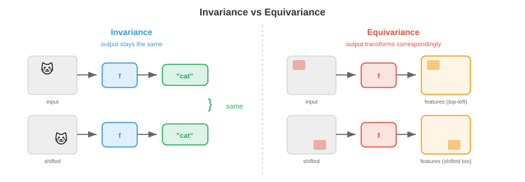

# 几何深度学习

*几何深度学习是揭示CNN、Transformer和GNN皆遵循同一原理——利用对称性——的统一框架。本章涵盖对称群、群作用、不变性、等变性、五个几何域以及尺度分离*

- 在本书中，我们已经学习了多种架构：图像的CNN（第8章）、语言的Transformer（第7章）以及序列决策的RL策略（第6章）。它们看上去像是为完全不同的问题设计的完全不同的模型。但背后存在一个更深层的模式。

- **几何深度学习**揭示出所有这些架构都是同一个思想的实例：构建尊重数据**对称性**的网络。CNN利用图像中的平移对称性。Transformer利用序列中的置换对称性（注意力不依赖于绝对位置）。GNN利用图中的置换对称性。一旦看清这一点，众多架构就变成了一个统一的连贯框架。

## 对称性与群

- 一个对象的**对称性**是使其保持不变的变换。正方形有8种对称性：4种旋转（0°、90°、180°、270°）和4种反射。圆有无限多种：任何绕其中心的旋转。关键洞察在于，对称性告诉你什么是不重要的，而知道什么不重要的对于学习来说极为强大。

- 用机器学习的术语来说：如果一个任务具有对称性，那么无论看到输入的哪种"版本"，模型都应给出相同的答案。猫检测器无论猫在图像的左上角还是右下角都应能工作。这就是平移对称性。

- 对称性通过**群**来形式化。一个群 $G$ 是一个具有四个性质的变换集合：

    - **封闭性**：两个变换的组合产生集合中的另一个变换。先旋转90°再旋转90°得到180°，也属于该集合。
    - **结合律**：$(g_1 \circ g_2) \circ g_3 = g_1 \circ (g_2 \circ g_3)$。分组的顺序无关紧要（回顾第2章中矩阵乘法的结合律）。
    - **单位元**：存在一个"什么也不做"的变换 $e$，使得 $e \circ g = g \circ e = g$。
    - **逆元**：每个变换都有撤销操作：$g \circ g^{-1} = e$。

- 这些公理与向量空间（第1章）的公理相同，但应用于变换而非向量。其联系十分深刻：群作用于向量空间，而神经网络必须尊重这种作用。

- 深度学习中出现的关键群：

    - **平移群** $(\mathbb{R}^n, +)$：平移图像或信号。这是CNN利用的对称性。
    - **对称群** $S_n$：$n$ 个元素的所有置换。这是GNN和Transformer利用的对称性（重新排序节点或标记不应改变结果）。
    - **旋转群** $SO(n)$：$n$ 维空间中的所有旋转。$SO(2)$ 是平面旋转，$SO(3)$ 是三维旋转（对分子和3D视觉任务至关重要）。
    - **欧几里得群** $E(n)$：所有旋转、反射和平移。物理空间的对称性。
    - **特殊欧几里得群** $SE(n)$：旋转和平移（不含反射）。刚体运动的对称性。

- **群作用**描述了群如何变换数据。如果 $G$ 是一个群，$X$ 是数据空间，则作用 $\rho: G \times X \to X$ 将每个群元素 $g$ 和数据点 $x$ 映射到一个变换后的点 $\rho(g, x)$。对于图像，平移群通过平移像素坐标来作用。对于图，对称群通过重新标记节点来作用。

## 不变性与等变性

- 给定一个对称群，函数可以通过两种重要方式与之关联：

- 函数 $f$ 对群 $G$ 是**不变**的，如果输入变换后输出不变：

$$f(\rho(g, x)) = f(x) \quad \text{对于所有 } g \in G$$

- 示例：图像的总体亮度不因平移而改变。图像分类应是平移不变的："猫"的类别无论猫在何处都是一样的。

- 函数 $f$ 对群 $G$ 是**等变**的，如果变换输入会对等地变换输出：

$$f(\rho_{\text{in}}(g, x)) = \rho_{\text{out}}(g, f(x)) \quad \text{对于所有 } g \in G$$

- 示例：如果将图像向右平移5个像素，CNN中的特征图也会向右平移5个像素。卷积操作是平移等变的：它保留了空间关系。目标检测应该是等变的：如果猫移动了，边界框也应随之移动。



- 区分两者的重要性在于：**中间层**通常应是等变的（为下游层保留结构），而**最终输出**应是不变的（答案不应依赖于变换）。CNN通过堆叠等变卷积层，然后在末尾应用全局池化（它是不变的）来实现这一点。

- 将等变性构建到架构中比从数据中学习它要高效得多。一个具有权重共享的平移等变CNN所需的参数远少于一个必须独立学习"位置(10,10)处的猫"和"位置(200,150)处的猫"的全连接网络。对称性约束指数级地缩小了假设空间。

## 五个几何域

- 几何深度学习识别出数据的**五个基本域**，每个域都有其自己的对称群。每一个神经网络架构都可以被理解为利用其中某个域的对称性。


- **1. 网格（欧几里得数据）**：图像、音频频谱图、体数据。底层结构是具有平移对称性的规则网格。群是平移群（可能再加上旋转和反射）。利用这种对称性的架构是**CNN**：卷积正是平移等变的操作。空间位置上的权重共享就是平移等变性的具体实现。

- **2. 集合（无序集合）**：点云、粒子系统。对称性是置换不变性：元素的顺序无关紧要。架构是**DeepSets**（以及第8章的PointNet）：对每个元素应用共享函数，然后用置换不变操作（求和、均值或取最大值）进行聚合。形式上，$f(\{x_1, \ldots, x_n\}) = \phi\left(\sum_i \psi(x_i)\right)$。

- **3. 序列（有序数据）**：文本、时间序列。序列是一维网格，但有一个微妙之处：对称性更加细致。绝对位置可能重要也可能不重要。RNN以自回归方式处理序列。带位置编码的Transformer可以关注任何位置，其自注意力在加入位置编码之前是置换等变的。这就是Transformer泛化能力如此之强的原因：它们从置换等变开始，然后仅添加必要的位置结构。

- **4. 图（关系数据）**：社交网络、分子、知识图谱。对称性是节点的置换：重新标记节点不应改变图的性质。架构是**GNN**：连接节点之间传递消息，使用不依赖于节点顺序的共享函数。这是本章剩余部分的重点。

- **5. 流形和网格**：曲面、3D形状。对称性包括微分同胚（光滑变形）。架构使用内在算子（例如拉普拉斯-贝尔特拉米算子），这些算子由曲面几何本身定义，与曲面在空间中的嵌入方式无关。这联系到微分几何，并适用于形状分析、球面上的气候建模和蛋白质表面分析。

- 这个框架的强大之处在于其统一性。CNN是网格图上的GNN。Transformer是完全连接图上的GNN。DeepSets是没有边的GNN。将这些视为同一原理的实例，指导着新架构的设计：识别数据的对称性，然后构建一个尊重它的网络。

## 尺度分离与粗化

- 真实世界的数据具有多尺度结构。一幅图像有细粒度纹理（像素级）、局部模式（边缘、角点）、物体部件（车轮、窗户）和全局结构（整个场景）。一个分子有原子级特征、官能团和整体分子形状。

- **尺度分离**是这样一个原理：这些细节层次可以分层处理——先捕获局部结构，然后逐步聚合成更粗粒度的表示。这就是**粗化**或**池化**。

- 在CNN中，池化层（最大池化、平均池化）对空间分辨率进行下采样，迫使高层捕获更大尺度的模式。在感受野视角（第8章）中，更深层能"看到"更多的图像。这就是尺度分离的实际应用。

- 在图（graph）中，粗化意味着将节点群聚为"超节点"，生成一个保留基本结构的更小图。这就是图池化，我们将在文件3中详细讨论。它与图像池化直接类似：降低分辨率的同时保留重要特征。

- 在序列中，分层处理（例如句子→段落→文档）在不同时间或语义尺度捕获结构。Swin Transformer（第8章）通过其移位窗口层次结构将这一思想应用于图像。

- 数学上，粗化定义了一个**逐渐抽象的表示层次**：

$$x \xrightarrow{\text{局部特征}} h^{(1)} \xrightarrow{\text{粗化}} h^{(2)} \xrightarrow{\text{粗化}} \cdots \xrightarrow{\text{全局}} y$$

- 在每个层次，表示相对于该层次的对称群是等变的。最后的全局表示是不变的，捕获了输入的本质而不受无关变换的影响。

- 这就是为什么对于结构化数据，深层网络比浅层网络效果更好：每一层增加一个抽象层次，多个等变层的组合从简单的局部特征构建出复杂的不变特征。

## 编程任务（使用CoLab或notebook）

1. 验证卷积的平移等变性。对图像应用卷积，然后平移图像再次卷积。检查输出是否互为平移版本。
```python
import jax
import jax.numpy as jnp

# 一维信号和一个简单滤波器
signal = jnp.array([0, 0, 0, 1, 2, 3, 2, 1, 0, 0, 0], dtype=float)
kernel = jnp.array([1, 0, -1], dtype=float)

# 先卷积再平移
conv_result = jnp.convolve(signal, kernel, mode="same")
shifted_signal = jnp.roll(signal, 3)
conv_shifted = jnp.convolve(shifted_signal, kernel, mode="same")
shifted_conv = jnp.roll(conv_result, 3)

print(f"先卷积再平移:  {shifted_conv}")
print(f"先平移再卷积:  {conv_shifted}")
print(f"等变性: {jnp.allclose(shifted_conv, conv_shifted, atol=1e-5)}")
```

2. 验证DeepSets风格聚合的置换不变性。对集合中的每个元素应用共享函数，求和结果，并检查输出是否不依赖于元素顺序。
```python
import jax
import jax.numpy as jnp

# 4个向量的"集合"（顺序应无关紧要）
x = jnp.array([[1.0, 2.0], [3.0, 4.0], [5.0, 6.0], [7.0, 8.0]])

# 简单的共享函数：逐元素平方
psi = lambda v: v ** 2

# 通过求和聚合
def deepsets(points):
    return jnp.sum(jax.vmap(psi)(points), axis=0)

# 原始顺序
result1 = deepsets(x)

# 置换后的顺序
perm = jnp.array([2, 0, 3, 1])
result2 = deepsets(x[perm])

print(f"原始顺序:  {result1}")
print(f"置换顺序:  {result2}")
print(f"不变性: {jnp.allclose(result1, result2)}")
```

3. 探索群结构。通过检查封闭性、结合律、单位元和逆元，验证二维旋转矩阵构成群。
```python
import jax.numpy as jnp

def rot2d(theta):
    return jnp.array([[jnp.cos(theta), -jnp.sin(theta)],
                       [jnp.sin(theta),  jnp.cos(theta)]])

R1 = rot2d(jnp.pi / 6)
R2 = rot2d(jnp.pi / 4)
R3 = rot2d(jnp.pi / 3)

# 封闭性：两个旋转的乘积还是一个旋转
R12 = R1 @ R2
print(f"封闭性 (行列式=1, 正交): det={jnp.linalg.det(R12):.4f}, "
      f"R^T R = I: {jnp.allclose(R12.T @ R12, jnp.eye(2), atol=1e-5)}")

# 结合律
print(f"结合律: {jnp.allclose((R1 @ R2) @ R3, R1 @ (R2 @ R3), atol=1e-5)}")

# 单位元
I = rot2d(0.0)
print(f"单位元: {jnp.allclose(R1 @ I, R1, atol=1e-5)}")

# 逆元
R1_inv = rot2d(-jnp.pi / 6)
print(f"逆元: {jnp.allclose(R1 @ R1_inv, jnp.eye(2), atol=1e-5)}")
```
