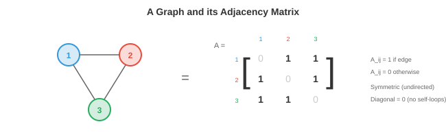

# 图论

*图论为描述实体间关系提供了数学语言。本章涵盖节点、边、邻接矩阵、图类型、度和连通性、图拉普拉斯算子、谱图理论以及现实世界的图应用。我们将在纯计算机科学章节中更深入地讨论图*

- 到目前为止，本书中的数据都存在于规则结构上：$\mathbb{R}^n$ 中的向量（第1章）、数字网格形式的矩阵（第2章）、像素网格形式的图像（第8章）、有序列表形式的序列（第7章）。但许多现实世界的系统是**不规则**的：社交网络没有网格结构，分子没有从左到右的顺序，道路网络也不能整齐地平铺成行和列。

- **图（Graph）** 是表示这些不规则关系结构的数学工具。图捕获了**实体**（节点）及它们之间的**关系**（边）。一旦数据被表示为图，我们就可以应用文件1中的几何深度学习原理来从中学习。

## 节点、边和邻接

- 一个**图** $G = (V, E)$ 由一组**节点**（或顶点）$V = \{v_1, v_2, \ldots, v_n\}$ 和一组连接节点对的**边** $E \subseteq V \times V$ 组成。

- 节点代表实体：人、原子、城市、网页、神经元。边代表关系：友谊、化学键、道路、超链接、突触。

- **邻接矩阵** $A$ 是图的矩阵表示。对于一个有 $n$ 个节点的图，$A$ 是一个 $n \times n$ 矩阵，其中如果存在从节点 $i$ 到节点 $j$ 的边，则 $A_{ij} = 1$，否则 $A_{ij} = 0$。

- 例如，一个三角形图（3个节点，全部相连）：

```math
A = \begin{bmatrix} 0 & 1 & 1 \\ 1 & 0 & 1 \\ 1 & 1 & 0 \end{bmatrix}
```



- 对角线为零，因为节点默认不与自身相连（无自环）。邻接矩阵是我们在第2章中研究的布尔矩阵的直接应用：每个条目都是一个二元关系。

- 邻接矩阵完整地编码了图的结构。对 $A$ 的矩阵运算揭示了图的性质：$A^2_{ij}$ 计算节点 $i$ 和 $j$ 之间长度为2的路径数量（回顾第2章中的矩阵乘法：每个条目是经过中间节点的乘积之和）。更一般地，$A^k_{ij}$ 计算长度为 $k$ 的路径数量。

- 每个节点可以携带一个**特征向量** $\mathbf{x}_i \in \mathbb{R}^d$。对于社交网络，这可能是用户的个人信息。对于分子，它编码原子类型、电荷和其他属性。全部节点特征的集合是一个矩阵 $X \in \mathbb{R}^{n \times d}$，其中每一行是一个节点的特征。

- 边也可以携带特征：分子中的键类型、空间图中的距离、知识图谱中的关系类型。边 $(i, j)$ 的**边特征**是一个向量 $\mathbf{e}_{ij} \in \mathbb{R}^{d_e}$。

## 图类型

- **无向图**具有对称的边：如果 $i$ 连接到 $j$，则 $j$ 也连接到 $i$。邻接矩阵是对称的：$A = A^T$（一个对称矩阵，见第2章）。友谊和化学键是无向的。

- **有向图**（digraph）具有带方向的边：从 $i$ 到 $j$ 的边不意味着从 $j$ 到 $i$ 的边。邻接矩阵是非对称的。Twitter关注、网页超链接和引文网络是有向的。

- **加权图**为每条边分配一个数值权重。邻接矩阵具有实数值而非二进制值：$A_{ij} = w_{ij}$。道路网络中的距离、大脑连通性中的相关强度以及社交网络中的交互频率是加权的。

- **二分图**具有两个不相交的节点集合，边只存在于集合之间（集合内部没有边）。用户和产品构成一个二分图：用户评价产品，但用户之间不相互评价。二分图的邻接矩阵具有块结构：

```math
A = \begin{bmatrix} 0 & B \\ B^T & 0 \end{bmatrix}
```

- 其中 $B$ 是两个节点集之间的二分邻接矩阵。

- **多重图**允许同一对节点之间存在多条边和/或自环。知识图谱通常是多重图：两个实体之间可以有多种关系（例如"出生于"、"居住于"、"工作于"）。

- **超图**将边推广为一次连接两个以上节点。一条**超边**连接一组节点，表示高阶关系。一篇由五人合著的研究论文是一条连接五个作者节点的超边。

- **完全图** $K_n$ 在每一对节点之间都有边。这是全连接层的图类比，也是Transformer操作的结构（每个标记关注每个其他标记）。

## 度、路径和连通性

- 一个**节点**的**度**是与它相连的边的数量。在无向图中，节点 $i$ 的度为 $d_i = \sum_j A_{ij}$。高度节点是拥有大量连接的"枢纽"。

- **度矩阵** $D$ 是一个对角线元素为度的对角矩阵：$D_{ii} = d_i$。这个矩阵出现在整个图论和GNN公式中。

- 两个节点之间的**路径**是连接它们的边序列。$i$ 和 $j$ 之间的**最短路径**（或测地线）是边数最少（或在加权图中总权重最小）的路径。**迪杰斯特拉算法**（Dijkstra's algorithm）在 $O((|V| + |E|) \log |V|)$ 时间内找到最短路径。

- 如果每对节点之间都存在路径，则图是**连通的**。否则，图有多个**连通分量**：相互之间没有边的孤立子图。

- 图的**直径**是任意一对节点之间最长最短路径的长度。它衡量图"分散"的程度。社交网络以直径小而闻名（"六度分隔"）。

- **环**是起点和终点在同一节点的路径。没有环的图是**树**。树是最简单的连通图：$n$ 个节点和恰好 $n-1$ 条边。

- **中心性**衡量节点的重要性。**度中心性**就是度数。**介数中心性**计算通过一个节点的最短路径数量。**特征向量中心性**根据节点邻居的重要性分配重要性，得到特征向量方程 $A\mathbf{x} = \lambda \mathbf{x}$（第2章）。谷歌的PageRank是特征向量中心性在有向图上的变体。

## 图拉普拉斯算子

- **图拉普拉斯算子**也许是图论中最重要的矩阵。定义如下：

$$L = D - A$$

- 其中 $D$ 是度矩阵，$A$ 是邻接矩阵。对于我们的三角形示例：

```math
L = \begin{bmatrix} 2 & 0 & 0 \\ 0 & 2 & 0 \\ 0 & 0 & 2 \end{bmatrix} - \begin{bmatrix} 0 & 1 & 1 \\ 1 & 0 & 1 \\ 1 & 1 & 0 \end{bmatrix} = \begin{bmatrix} 2 & -1 & -1 \\ -1 & 2 & -1 \\ -1 & -1 & 2 \end{bmatrix}
```

- 拉普拉斯算子具有显著的性质：

    - 它始终是**对称的**且**半正定的**（回顾第2章：所有特征值 $\geq 0$）。对于任意向量 $\mathbf{x}$：

$$\mathbf{x}^T L \mathbf{x} = \sum_{(i,j) \in E} (x_i - x_j)^2$$


    - 这个二次形式度量图上的信号 $\mathbf{x}$ 在边上的变化程度。如果相邻节点值相近，则 $\mathbf{x}^T L \mathbf{x}$ 较小。如果它们差异很大，则较大。拉普拉斯算子度量图上信号的**平滑度**。

    - 最小特征值始终为0，特征向量为 $\mathbf{1} = [1, 1, \ldots, 1]^T$（常数信号没有变化）。零特征值的数量等于连通分量的数量。

    - 第二小特征值 $\lambda_2$ 是**代数连通度**（Fiedler值）。它衡量图的连通程度：$\lambda_2 = 0$ 表示图不连通，大的 $\lambda_2$ 表示图紧密连通。

- **归一化拉普拉斯算子**通过度进行缩放：

$$\hat{L} = D^{-1/2} L D^{-1/2} = I - D^{-1/2} A D^{-1/2}$$

- 这种归一化确保拉普拉斯算子的性质不依赖于节点度的绝对尺度。项 $D^{-1/2} A D^{-1/2}$ 是**对称归一化邻接矩阵**，它直接出现在GCN公式中（文件3）。

## 谱图理论

- 图拉普拉斯算子的特征值和特征向量定义了图的**谱**，它们充当图上的傅里叶变换的类似物。

- 在经典信号处理中，傅里叶变换将信号分解为频率分量（正弦和余弦）。在图上，拉普拉斯算子的特征向量扮演这些频率基的角色。小特征值的特征向量在图上变化缓慢（低频、平滑），而大特征值的特征向量变化迅速（高频、振荡）。

- 信号 $\mathbf{x}$ 在图上的**图傅里叶变换（GFT）** 为：

$$\hat{\mathbf{x}} = U^T \mathbf{x}$$

- 其中 $U$ 是拉普拉斯算子特征向量的矩阵（回顾第2章中的特征分解：$L = U \Lambda U^T$）。逆变换为 $\mathbf{x} = U \hat{\mathbf{x}}$。

- 谱域中的**图卷积**是频域中的逐点乘法，正如空间域中的卷积对应于傅里叶域中的乘法（卷积定理，见第8章）：

$$g_\theta \star \mathbf{x} = U \left( (U^T g_\theta) \odot (U^T \mathbf{x}) \right) = U \, \text{diag}(\hat{g}_\theta) \, U^T \mathbf{x}$$

- 滤波器 $\hat{g}_\theta$ 是特征值的可学习函数。这是谱域GNN的基础，我们将在文件3中将其简化为实用的GCN。

- 计算瓶颈是对 $L$ 进行特征分解，对于有 $n$ 个节点的图需要 $O(n^3)$ 时间。这对于大型图（数百万节点）是不可行的。多项式近似（切比雪夫多项式）完全避免了特征分解，而这种近似直接导致了GCN。

## 社区检测

- 许多现实世界的图具有**社区结构**：紧密连接的节点簇，簇之间连接稀疏。社交网络有好友群组，生物网络有功能模块，引文网络有研究领域。

- **谱聚类**使用拉普拉斯算子特征向量来寻找社区。思路：使用 $L$ 的 $k$ 个最小的非平凡特征向量对每个节点进行嵌入，然后在这个嵌入空间中应用k-means（第6章）。同一社区中的节点在谱嵌入中最终彼此靠近。

- 这是可行的，因为Fiedler向量（$\lambda_2$ 的特征向量）自然地将图分成两组：正值的节点和负值的节点，沿着最稀疏的连接切开。更高的特征向量进一步细分为更多组。

- **模块度** $Q$ 衡量社区划分的质量。它将社区内边的数量与随机图中的期望数量进行比较：

$$Q = \frac{1}{2|E|} \sum_{ij} \left( A_{ij} - \frac{d_i d_j}{2|E|} \right) \delta(c_i, c_j)$$

- 其中 $c_i$ 是节点 $i$ 的社区分配，如果节点在同一个社区则 $\delta$ 为1。$Q$ 的范围从 $-0.5$ 到 $1$，值越高表示社区结构越强。

## 现实世界中的图

- **社交网络**：节点是人，边是友谊或互动。Facebook有数十亿节点和数千亿条边。这些图通常是稀疏的（每个人有几百个朋友，而不是几十亿），具有小世界性质（短的平均路径长度），以及重尾度分布（少数拥有数百万连接的枢纽节点）。

- **分子图**：节点是原子，边是化学键。每个原子有特征（元素类型、电荷、杂化方式），每条键有特征（单键、双键、三键、芳香键）。分子图很小（数十到数百个节点）但高度结构化。从图结构预测分子性质是GNN的一个重要应用。

- **知识图谱**：节点是实体（人、地点、概念），边是类型化的关系（"出生于"、"首都是"、"是……的实例"）。知识图谱为搜索引擎、推荐系统和问答系统提供支持。它们通常是具有数百万实体和数十亿关系的有多重图。

- **引文网络**：节点是论文，边是引用（有向的）。聚类揭示研究社区。节点特征包括标题、摘要和出版年份。

- **蛋白质相互作用网络**：节点是蛋白质，边表示物理相互作用或功能关联。理解这些图有助于识别药物靶点和疾病机制。

- **道路网络与交通**：节点是交叉路口，边是具有距离/时间权重的道路段。这些图上的最短路径算法为导航系统提供动力。自动驾驶运动预测（第11章）将智能体交互表示为图。

## 编程任务（使用CoLab或notebook）

1. 构建一个小型图的邻接矩阵，计算基本性质：每个节点的度、长度为2的路径数量以及图是否连通。
```python
import jax.numpy as jnp

# 一个简单图：5个节点
# 0-1, 0-2, 1-2, 2-3, 3-4
A = jnp.array([[0, 1, 1, 0, 0],
               [1, 0, 1, 0, 0],
               [1, 1, 0, 1, 0],
               [0, 0, 1, 0, 1],
               [0, 0, 0, 1, 0]], dtype=float)

# 度
degrees = A.sum(axis=1)
print(f"度数: {degrees}")

# 长度为2的路径
A2 = A @ A
print(f"长度为2的路径（节点0到3）: {int(A2[0, 3])}")

# 是否连通？检查 A^(n-1) 是否所有条目非零
An = jnp.linalg.matrix_power(A + jnp.eye(5), 4)  # (A+I)^4 用于可达性
connected = jnp.all(An > 0)
print(f"连通: {connected}")
```

2. 计算图拉普拉斯算子及其特征值。验证最小特征值为0且对应的特征向量为常数。
```python
import jax.numpy as jnp

A = jnp.array([[0, 1, 1, 0, 0],
               [1, 0, 1, 0, 0],
               [1, 1, 0, 1, 0],
               [0, 0, 1, 0, 1],
               [0, 0, 0, 1, 0]], dtype=float)

D = jnp.diag(A.sum(axis=1))
L = D - A

eigenvalues, eigenvectors = jnp.linalg.eigh(L)
print(f"特征值: {eigenvalues}")
print(f"最小特征向量: {eigenvectors[:, 0]}")
print(f"Fiedler值（代数连通度）: {eigenvalues[1]:.4f}")

# 验证: x^T L x 度量平滑度
x = jnp.array([1.0, 1.0, 1.0, -1.0, -1.0])  # 两个组
smoothness = x @ L @ x
print(f"两组信号的平滑度: {smoothness:.2f}")
```

3. 对具有两个社区的图执行谱聚类。使用Fiedler向量嵌入节点，并按符号分离。
```python
import jax.numpy as jnp
import matplotlib.pyplot as plt

# 两个社区，各5个节点，弱连接
A = jnp.zeros((10, 10))
# 社区1：节点0-4（密集）
for i in range(5):
    for j in range(i+1, 5):
        A = A.at[i, j].set(1).at[j, i].set(1)
# 社区2：节点5-9（密集）
for i in range(5, 10):
    for j in range(i+1, 10):
        A = A.at[i, j].set(1).at[j, i].set(1)
# 一条桥接边
A = A.at[2, 7].set(1).at[7, 2].set(1)

D = jnp.diag(A.sum(axis=1))
L = D - A
eigenvalues, eigenvectors = jnp.linalg.eigh(L)

# Fiedler向量（第二小特征值）
fiedler = eigenvectors[:, 1]
communities = (fiedler > 0).astype(int)

print(f"Fiedler向量: {fiedler}")
print(f"聚类: {communities}")

plt.bar(range(10), fiedler, color=["#3498db" if c == 0 else "#e74c3c" for c in communities])
plt.xlabel("节点"); plt.ylabel("Fiedler向量值")
plt.title("通过Fiedler向量进行谱聚类")
plt.show()
```
