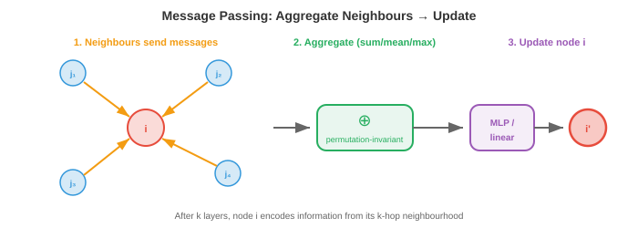

# 图神经网络

*图神经网络通过在连接节点之间传递消息来学习图结构数据。本章涵盖消息传递框架、GCN、GraphSAGE、GIN、过平滑、图池化以及节点/边/图级别的任务；支撑分子性质预测、社交网络分析和推荐系统的核心架构。*

- 在前面的文件中，我们建立了数学基础：几何深度学习（文件1）告诉我们利用对称性，图论（文件2）提供了节点、边和邻接的语言。现在我们构建直接在图（graph）上操作的神经网络。

- 核心挑战：图数据是**不规则**的。与图像（固定网格）或序列（固定顺序）不同，图具有可变数量的节点、可变的连通性，并且没有规范的节点顺序。用于图的神经网络必须处理所有这些情况，同时保持置换等变性（重新标记节点不应改变输出）。

## 消息传递框架

- 几乎所有的GNN都遵循同样的模式，称为**消息传递**（也称为邻域聚合）。这个想法简单而优雅：每个节点通过从邻居收集信息来更新其表示。

- 在每个层 $l$，每个节点 $i$ 做三件事：

    1. **消息**：节点 $i$ 的每个邻居 $j$ 基于其当前特征计算一条消息 $\mathbf{m}_{j \to i}$。
    2. **聚合**：节点 $i$ 收集所有传入消息，并使用置换不变函数（求和、均值或取最大值）将它们组合。
    3. **更新**：节点 $i$ 将聚合的消息与其自身特征结合，产生一个新的表示。

- 形式上：

$$\mathbf{m}_i^{(l)} = \bigoplus_{j \in \mathcal{N}(i)} \phi^{(l)}\left(\mathbf{h}_i^{(l)}, \mathbf{h}_j^{(l)}, \mathbf{e}_{ij}\right)$$

$$\mathbf{h}_i^{(l+1)} = \psi^{(l)}\left(\mathbf{h}_i^{(l)}, \mathbf{m}_i^{(l)}\right)$$

- 其中 $\mathcal{N}(i)$ 是节点 $i$ 的邻居集合，$\bigoplus$ 是一个置换不变的聚合操作（求和、均值、取最大值），$\phi$ 是消息函数，$\psi$ 是更新函数，$\mathbf{e}_{ij}$ 是可选的边特征。



- 聚合操作 $\bigoplus$ 必须是置换不变的（邻居处理的顺序无关紧要），以确保整个函数是置换等变的。这直接实现了文件1中的对称性原理。

- 经过 $k$ 层消息传递后，每个节点的表示编码了其 **$k$ 跳邻域**的信息：所有在 $k$ 条边内可达的节点。第1层看到直接邻居，第2层看到邻居的邻居，依此类推。这就是局部信息传播以建立全局理解的方式。

- GNN的感受野随深度增长，就像CNN的感受野随层数增长一样（第8章）。但与规则网格上的CNN不同，感受野的形状根据图拓扑结构在每个节点上有所不同。

## 图卷积网络（GCN）

- **GCN**（Kipf & Welling，2017）是基础性的GNN架构。它将谱域图卷积（来自文件2）简化为一个优雅、高效的公式。

- 从谱域卷积 $g_\theta \star \mathbf{x} = U \, \text{diag}(\hat{g}_\theta) \, U^T \mathbf{x}$ 出发，Kipf和Welling用一阶切比雪夫多项式近似谱域滤波器，这完全避免了计算特征分解。简化后，逐层更新变为：

$$H^{(l+1)} = \sigma\left(\hat{A} H^{(l)} W^{(l)}\right)$$

- 其中：
    - $H^{(l)} \in \mathbb{R}^{n \times d}$ 是第 $l$ 层的节点特征矩阵
    - $W^{(l)} \in \mathbb{R}^{d \times d'}$ 是可学习的权重矩阵
    - $\hat{A} = \tilde{D}^{-1/2} \tilde{A} \tilde{D}^{-1/2}$ 是带自环的对称归一化邻接矩阵
    - $\tilde{A} = A + I$ 添加了自环（因此每个节点也接收自己的消息）
    - $\tilde{D}$ 是 $\tilde{A}$ 的度矩阵
    - $\sigma$ 是一个非线性激活函数（ReLU，如第6章所述）

- 矩阵乘法 $\hat{A} H^{(l)}$ 是聚合步骤：对于每个节点，它计算其邻居特征（加上自身特征，通过自环）的加权平均。权重矩阵 $W^{(l)}$ 是可学习的变换，在所有节点间共享。激活函数增加了非线性。

- 这非常简单：它只是矩阵乘法后接一个学习到的线性映射和激活函数。整个GCN层可以用一行代码实现。通过 $\tilde{D}^{-1/2}$ 的归一化防止具有许多邻居的节点占主导地位：高度节点的消息被按比例缩小。

- 在消息传递框架中，GCN使用：
    - 消息：$\phi(\mathbf{h}_j) = \mathbf{h}_j$（只发送你的特征）
    - 聚合：归一化和（按度加权）
    - 更新：线性变换 + 激活函数

## GraphSAGE

- GCN是**直推式**的：它在训练时需要完整的图，无法处理新出现的未知节点。如果新用户加入社交网络，GCN必须对整个图重新训练。**GraphSAGE**（Hamilton等，2017）通过**归纳式**方法解决了这个问题。

- 关键思想是**邻域采样**：不是使用所有邻居，而是采样一个固定大小的子集。这使得计算独立于完整的图结构，并允许推广到未见过的节点和图。

- 节点 $i$ 的GraphSAGE更新：

$$\mathbf{h}_i^{(l+1)} = \sigma\left(W^{(l)} \cdot \text{CONCAT}\left(\mathbf{h}_i^{(l)}, \text{AGG}\left(\{\mathbf{h}_j^{(l)} : j \in \mathcal{S}(i)\}\right)\right)\right)$$

- 其中 $\mathcal{S}(i)$ 是一个**采样**的邻居子集（例如，从500个邻居中随机采样10个）。CONCAT操作显式地将节点自身的特征与聚合后的邻居特征分开，让网络学习"自身"和"邻域"的不同变换。

- GraphSAGE支持多种聚合函数：
    - **均值（Mean）**：$\text{AGG} = \frac{1}{|\mathcal{S}|} \sum_{j \in \mathcal{S}} \mathbf{h}_j$（简单，有效）
    - **LSTM**：将采样的邻居通过LSTM（但这引入了顺序依赖，一定程度上违反了置换不变性）
    - **池化（Pool）**：$\text{AGG} = \max(\{\sigma(W_{\text{pool}} \mathbf{h}_j + \mathbf{b})\})$（非线性变换后取最大值）

- 采样策略使GraphSAGE可扩展到非常大的图。训练使用节点的小批量：对于每个目标节点，在第1层采样 $k_1$ 个邻居，然后对于其中每个邻居在第2层采样 $k_2$ 个邻居。使用 $k_1 = k_2 = 10$ 和2层，每个节点的计算树最多有 $10 \times 10 = 100$ 个节点，与图的大小无关。

## 图同构网络（GIN）

- 不同的GNN架构具有不同的**表达能力**：它们区分结构不同之图的能力。GCN和GraphSAGE虽然在实践中有效，但理论上在能区分哪些图结构方面是受限的。

- 衡量GNN表达能力的理论工具是**Weisfeiler-Lehman（WL）测试**，这是一个用于测试图同构（两个图是否结构相同）的经典算法。WL测试通过将每个节点的标签与其邻居标签的多重集一起哈希，迭代地精炼节点标签。

- **GIN**（Xu等，2019）被设计为具有与WL测试同等的表达能力，使其成为最强大的消息传递GNN（在消息传递的理论限制内）。关键洞察：聚合函数必须在多重集上是**单射**的（不同的邻居特征多重集必须产生不同的聚合值）。

- 求和聚合在多重集上是单射的（求和 $\{1, 1, 2\}$ 得到4，而 $\{1, 3\}$ 也得到4，但在具有足够维度的特征向量上，不同多重集的和一般而言是不同的）。均值和取最大值不是单射的：均值无法区分 $\{1, 1\}$ 和 $\{2, 2\}$，取最大值无法区分 $\{1, 2, 3\}$ 和 $\{1, 1, 3\}$。

- GIN更新：

$$\mathbf{h}_i^{(l+1)} = \text{MLP}^{(l)}\left((1 + \epsilon^{(l)}) \cdot \mathbf{h}_i^{(l)} + \sum_{j \in \mathcal{N}(i)} \mathbf{h}_j^{(l)}\right)$$

- 其中 $\epsilon$ 是一个可学习的标量（或固定为0），MLP提供非线性、单射的映射。求和聚合保留了多重集结构，MLP可以学会区分任意两个不同的聚合值。

## 过平滑

- GNN的一个主要挑战是**过平滑**：随着层数增加，所有节点表示收敛到相同的值，失去区分不同节点的能力。


- 其机制是直观的。每个消息传递层将节点的特征与其邻居的特征进行平均。经过多轮平均后，每个节点已经"看到"（并混合了）其连通分量中的每个其他节点。这些特征变成了统一的平均值，相当于将图像模糊太多次直到变成纯色的图类比。

- 形式上，重复应用归一化邻接矩阵 $\hat{A}$ 收敛到一个秩为1的矩阵（每一行都变得与图上随机游走的平稳分布成正比）。这与幂迭代收敛到主特征向量的过程相同（第2章）。

- 过平滑将GNN限制在很浅的深度（通常2-4层），而CNN和Transformer可以从几十或数百层中受益。这意味着每个节点只能看到有限的邻域，这对于需要长距离信息的任务来说是有问题的。

- 缓解方法包括：
    - **残差连接**（来自ResNet，第8章）：$\mathbf{h}_i^{(l+1)} = \mathbf{h}_i^{(l+1)} + \mathbf{h}_i^{(l)}$，保留来自较早层的信息。
    - **跳跃知识（Jumping Knowledge）**：拼接或注意力池化来自所有层的表示，而不仅仅是最后一层。
    - **DropEdge**：训练期间随机移除边，减缓信息传播。
    - **图Transformer（Graph Transformer）**（文件4）：用全局注意力绕过局部消息传递的瓶颈。

## 图池化

- 对于**图级别任务**（预测整个图的属性，如分子的毒性），我们需要将所有节点表示折叠成一个单一的图级别向量。这就是**图池化**，是CNN中全局平均池化的图类比（第8章）。

- 最简单的方法是**读出（readout）**：对所有节点特征应用一个置换不变函数：

$$\mathbf{h}_G = \text{READOUT}(\{\mathbf{h}_i^{(L)} : i \in V\}) = \sum_i \mathbf{h}_i^{(L)} \quad \text{或} \quad \frac{1}{|V|} \sum_i \mathbf{h}_i^{(L)} \quad \text{或} \quad \max_i \mathbf{h}_i^{(L)}$$

- 这就是文件1中的DeepSets聚合，应用于最终的GNN层之后。求和保留了大小信息（一个有100个节点的图会比只有10个节点的图具有更大的和），而均值对大小进行了归一化。

- **分层池化**逐步粗化图，模仿CNN逐步下采样图像的方式。在每个层级，节点组被合并为"超节点"：

- **DiffPool**（可微分池化）学习一个软分配矩阵 $S^{(l)} \in \mathbb{R}^{n_l \times n_{l+1}}$，将每个节点分配到一个簇：

$$X^{(l+1)} = S^{(l)T} H^{(l)}, \quad A^{(l+1)} = S^{(l)T} A^{(l)} S^{(l)}$$

- 分配矩阵由一个单独的GNN预测，使聚类变得端到端可微分。这创建了一个层次结构：原始图 → 具有较少节点的粗化图 → 更粗的图 → 单个节点（图表示）。

- **TopKPool**采用更简单的方法：为每个节点学习一个标量分数，保留得分最高的 top-$k$ 个节点，丢弃其余节点。这是一种硬选择（而非软分配），计算上比DiffPool更廉价。

## 异构图

- 截至目前的所有GNN都假设一个**同构图**：一种节点类型，一种边类型。但大多数现实世界的图是**异构**的：多种节点类型和多种边类型。知识图谱有人物节点、组织节点和位置节点，由"工作于"、"出生于"和"位于"边连接。推荐系统有用户节点和物品节点，由"已购买"、"已浏览"和"已评价"边连接。

- 异构图有一个**模式**（也称为元图），定义了允许的节点类型和边类型。每个边类型连接特定的源类型到特定的目标类型。例如，"工作于"连接 Person → Organisation。

- **关系GCN（R-GCN）**（Schlichtkrull等，2018）通过为每种边类型使用单独的权重矩阵来处理异构边：

$$\mathbf{h}_i^{(l+1)} = \sigma\left(\sum_{r \in \mathcal{R}} \sum_{j \in \mathcal{N}_r(i)} \frac{1}{|\mathcal{N}_r(i)|} W_r^{(l)} \mathbf{h}_j^{(l)} + W_0^{(l)} \mathbf{h}_i^{(l)}\right)$$

- 其中 $\mathcal{R}$ 是边类型的集合，$\mathcal{N}_r(i)$ 是通过关系 $r$ 连接到节点 $i$ 的邻居集合，$W_r$ 是关系 $r$ 特有的权重矩阵。自连接 $W_0$ 单独处理节点自身的特征。

- 问题：当关系类型很多时，参数数量爆炸（每种关系一个 $d \times d$ 矩阵）。R-GCN通过**基分解**缓解这一问题：$W_r = \sum_{b=1}^{B} a_{rb} V_b$，其中 $V_b$ 是共享的基矩阵，$a_{rb}$ 是每个关系的标量系数。这类似于低秩分解（第2章）：关系特定的矩阵生活在一个低维子空间中。

- **异构图表Transformer（HGT）**（Hu等，2020）将注意力机制应用于异构图。关键洞察：注意力应同时依赖于节点类型和连接它们的边类型。HGT为查询、键和值使用类型特定的投影矩阵：

$$\text{Attention}(i, j) = \left(W_{\tau(i)}^Q \mathbf{h}_i\right)^T \cdot \frac{W_{\phi(i,j)}^{\text{ATT}}}{\sqrt{d}} \cdot \left(W_{\tau(j)}^K \mathbf{h}_j\right)$$

- 其中 $\tau(i)$ 是节点 $i$ 的类型，$\phi(i,j)$ 是它们之间的边类型。这确保了模型对不同的关系类型使用不同的注意力权重：一篇论文关注其作者时，应使用与关注其参考文献时不同的注意力权重。

- **基于元路径的方法**定义通过模式的含义路径（例如，作者 → 论文 → 作者表示合著关系），并沿着这些路径聚合信息。**HAN**（异构图注意力网络）在两个层次应用注意力：在每个元路径内（沿此路径哪些邻居重要？）和跨元路径（哪些关系模式重要？）。

## 链接预测与知识图谱补全

- **链接预测**提出的问题是：给定现有边，哪些缺失的边可能存在？这是知识图谱补全（预测缺失的事实）、推荐（预测用户会喜欢哪些物品）和社交网络分析（预测未来的友谊）的核心任务。

- **基于嵌入的方法**为每个实体学习一个向量，为每个关系学习一个变换，然后通过实体和关系的匹配程度对潜在边进行评分：

- **TransE**将关系建模为嵌入空间中的平移：如果 $(h, r, t)$ 是一个有效的三元组（头实体，关系，尾实体），那么 $\mathbf{h} + \mathbf{r} \approx \mathbf{t}$。评分函数为 $f(h, r, t) = -\|\mathbf{h} + \mathbf{r} - \mathbf{t}\|$。直观地说，关系向量在嵌入空间中将头实体"移动"到尾实体。

- **RotatE**将关系建模为复空间中的旋转：$\mathbf{t} = \mathbf{h} \circ \mathbf{r}$，其中 $\circ$ 是逐元素复数乘法，$|\mathbf{r}_i| = 1$（单位复数就是旋转）。这可以建模TransE无法处理的对称性、反对称性、反转和复合模式。

- **ComplEx**使用复数值嵌入和埃尔米特点积，使其能够建模非对称关系（如果A是B的老板，B不是A的老板）。

- 基于GNN的链接预测通过消息传递计算节点嵌入，然后使用端点嵌入对边进行评分。这结合了GNN的结构推理能力和嵌入方法的关系建模能力。GNN编码器捕获了单嵌入方法所遗漏的多跳邻域结构。

## 任务类型

- GNN解决三类任务：

- **节点级别任务**：为每个节点预测一个属性。示例：对社交网络中的用户进行分类（机器人还是人类），预测相互作用网络中每个蛋白质的功能，半监督节点分类（标记少数节点，预测其余节点）。输出是节点嵌入 $\mathbf{h}_i^{(L)}$ 经过一个分类器。

- **边级别任务**：为每条边预测一个属性或预测边是否存在。示例：链接预测（这两个用户会成为朋友吗？），知识图谱补全（这个关系在这些实体间成立吗？），药物-药物相互作用预测。输出通常使用两个端点节点的嵌入：$\hat{y}_{ij} = f(\mathbf{h}_i, \mathbf{h}_j)$，其中 $f$ 是点积、拼接+MLP或其他组合。

- **图级别任务**：为整个图预测一个属性。示例：分子性质预测（这个分子有毒吗？），图分类（这个社交网络是机器人网络吗？），图生成（设计一个具有期望性质的分子）。输出使用图池化产生 $\mathbf{h}_G$，然后进行分类或回归。

## 编程任务（使用CoLab或notebook）

1. 使用归一化邻接矩阵从头实现一个单层GCN。应用于一个小型图，观察节点特征如何被平滑。
```python
import jax
import jax.numpy as jnp

# 图：5个节点，简单链带分支
A = jnp.array([[0, 1, 0, 0, 0],
               [1, 0, 1, 0, 0],
               [0, 1, 0, 1, 1],
               [0, 0, 1, 0, 0],
               [0, 0, 1, 0, 0]], dtype=float)

# 添加自环
A_hat = A + jnp.eye(5)
D_hat = jnp.diag(A_hat.sum(axis=1))
D_inv_sqrt = jnp.diag(1.0 / jnp.sqrt(A_hat.sum(axis=1)))
A_norm = D_inv_sqrt @ A_hat @ D_inv_sqrt

# 节点特征：one-hot 单位阵
H = jnp.eye(5)

# 权重矩阵（随机初始化）
rng = jax.random.PRNGKey(0)
W = jax.random.normal(rng, (5, 3)) * 0.5

# GCN层：H' = ReLU(A_norm @ H @ W)
H_new = jax.nn.relu(A_norm @ H @ W)

print("原始特征（one-hot）:")
print(H)
print("\n经过GCN层后:")
print(jnp.round(H_new, 3))
print("\n注意：连接的节点现在具有相似的表示")
```

2. 实现具有求和聚合（GIN风格）和均值聚合（GCN风格）的消息传递。展示求和能区分均值无法区分的多重集。
```python
import jax.numpy as jnp

# 两个具有相同均值的不同邻居多重集
# 节点A：邻居特征为 [1, 1, 1, 1]  （四个邻居，都是1）
# 节点B：邻居特征为 [2, 2]          （两个邻居，都是2）

neighbours_A = jnp.array([[1.0], [1.0], [1.0], [1.0]])
neighbours_B = jnp.array([[2.0], [2.0]])

# 均值聚合
mean_A = neighbours_A.mean(axis=0)
mean_B = neighbours_B.mean(axis=0)
print(f"均值 A: {mean_A}, 均值 B: {mean_B}, 相同: {jnp.allclose(mean_A, mean_B)}")

# 求和聚合
sum_A = neighbours_A.sum(axis=0)
sum_B = neighbours_B.sum(axis=0)
print(f"求和 A:  {sum_A},  求和 B:  {sum_B},  相同: {jnp.allclose(sum_A, sum_B)}")
print("\n求和能区分这些多重集；均值不能！")
```

3. 演示过平滑。重复应用归一化邻接矩阵，观察节点特征收敛。
```python
import jax.numpy as jnp
import matplotlib.pyplot as plt

# 随机图
A = jnp.array([[0,1,1,0,0,0],
               [1,0,1,0,0,0],
               [1,1,0,1,0,0],
               [0,0,1,0,1,1],
               [0,0,0,1,0,1],
               [0,0,0,1,1,0]], dtype=float)

A_hat = A + jnp.eye(6)
D_inv_sqrt = jnp.diag(1.0 / jnp.sqrt(A_hat.sum(axis=1)))
A_norm = D_inv_sqrt @ A_hat @ D_inv_sqrt

# 初始特征：每个节点各不相同
H = jnp.array([[1,0], [0,1], [1,1], [-1,0], [0,-1], [-1,-1]], dtype=float)

distances = []
for k in range(20):
    H = A_norm @ H
    # 衡量特征的区别程度（节点间的标准差）
    spread = jnp.std(H, axis=0).mean()
    distances.append(float(spread))

plt.plot(distances, "o-")
plt.xlabel("消息传递轮数")
plt.ylabel("特征分散度（节点间标准差）")
plt.title("过平滑：特征随深度增加而收敛")
plt.show()
```
