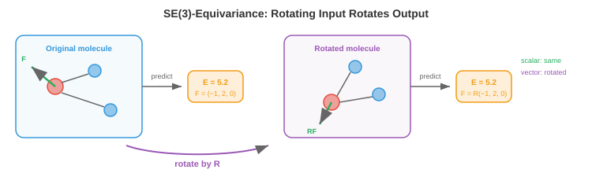

# 3D图网络

*3D图网络将GNN扩展到具有空间几何的数据，其中必须正确处理旋转和平移。本章涵盖几何图、SE(3)/E(n)等变性、SchNet、DimeNet、EGNN、张量场网络以及分子性质预测、蛋白质结构、材料科学和药物发现中的应用——从3D物理世界中学习的架构。*

- 文件3和4中的GNN操作于抽象图：节点有特征，边编码连接性，但没有3D空间的概念。社交网络图没有几何结构。但许多最具影响力的GNN应用涉及存在于**物理3D空间**中的数据：分子、蛋白质、晶体、点云。对于这些数据，节点的空间位置携带了抽象GNN所忽略的关键信息。

- 挑战在于3D数据具有**几何对称性**（文件1）：旋转分子不会改变其性质，平移也是如此。3D GNN必须尊重这些对称性。一个会在旋转分子时改变的能量预测在物理上是错误的。

## 几何图

- **几何图**是嵌入在3D空间中的图。每个节点 $i$ 除了其特征向量 $\mathbf{h}_i$ 之外，还有一个位置 $\mathbf{r}_i \in \mathbb{R}^3$。边可以基于空间邻近性（连接距离在 $r_{\text{cut}}$ 内的节点）而不是基于显式的化学键来定义。

- 对于分子，几何图以原子为节点（特征包括：元素类型、电荷等），化学键为边。3D位置 $\mathbf{r}_i$ 是原子坐标，由量子力学或实验测量（X射线晶体学、冷冻电镜）确定。

- 对于点云（来自LiDAR或3D扫描仪，第8章和第11章），每个点是一个节点，具有位置和可选特征（颜色、强度）。边连接附近的点，形成**k最近邻（kNN）图**或半径图。

- 用于消息传递的关键几何量：

    - **原子间距离**：$d_{ij} = \|\mathbf{r}_i - \mathbf{r}_j\|$。距离对旋转和平移保持不变。具有相同原子间距离的两个分子具有相同的形状，无论朝向如何。

    - **键角**：节点 $i$ 处向量 $\mathbf{r}_j - \mathbf{r}_i$ 和 $\mathbf{r}_k - \mathbf{r}_i$ 之间的角度 $\theta_{ijk}$。角度捕获了超越成对距离的局部几何结构。

    - **二面角（扭转角）**：由 $(i, j, k)$ 和 $(j, k, l)$ 定义的平面之间的角度 $\phi_{ijkl}$。二面角捕获结构在3D中的扭转方式，对蛋白质主链几何结构至关重要。

    - **相对位置向量**：$\mathbf{r}_{ij} = \mathbf{r}_j - \mathbf{r}_i$。这些是平移不变的，但不是旋转不变的。使用它们需要等变（而不仅仅是不变）的架构。

## SE(3) 和 E(n) 等变性

- 3D物理数据的对称群是**欧几里得群** $E(3)$，由所有旋转、反射和平移组成。子群 **$SE(3)$**（特殊欧几里得群）包括旋转和平移，但不包括反射。

- 3D GNN应该是：
    - 对标量输出（能量、结合亲和力）**平移不变**：将所有原子平移相同向量不应改变预测。
    - 对标量输出**旋转不变**：旋转分子不应改变其能量。
    - 对向量/张量输出（力、偶极矩）**旋转等变**：旋转分子应使预测的力向量按相同旋转旋转。



- 形式上，对标量预测 $f$ 和旋转 $R \in SO(3)$：

$$f(R\mathbf{r}_1, R\mathbf{r}_2, \ldots) = f(\mathbf{r}_1, \mathbf{r}_2, \ldots) \quad \text{（不变性）}$$

- 对向量预测 $\mathbf{F}$：

$$\mathbf{F}(R\mathbf{r}_1, R\mathbf{r}_2, \ldots) = R \cdot \mathbf{F}(\mathbf{r}_1, \mathbf{r}_2, \ldots) \quad \text{（等变性）}$$

- 这些约束直接反映了文件1中的不变性/等变性框架，现在专门应用于3D旋转和平移群。

- 存在两种设计方法：
    1. **不变架构**：只使用不变几何特征（距离、角度）作为消息传递的输入。内部表示是标量（不变的）。简单高效，但不能在不破坏对称性的情况下产生向量输出。
    2. **等变架构**：在整个网络中维护向量（以及更高阶张量）表示，确保每一层是等变的。表达能力更强，可以自然地预测向量和张量，但更加复杂。

## SchNet：基于距离的消息传递

- **SchNet**（Schütt等，2017）是基础性的不变3D GNN。其关键创新是**连续滤波器卷积**：不是使用固定的边类型集合（如分子GNN中的键类型），SchNet直接从原子间距离生成消息滤波器。

- 距离 $d_{ij}$ 首先使用**径向基函数（RBF）**扩展为特征向量：

$$\text{RBF}(d_{ij}) = \left[\exp\left(-\gamma_1 (d_{ij} - \mu_1)^2\right), \ldots, \exp\left(-\gamma_K (d_{ij} - \mu_K)^2\right)\right]$$

- 每个基函数是一个以 $\mu_k$ 为中心、宽度为 $\gamma_k$ 的高斯函数。这类似于距离的可学习位置编码：连续距离被映射到一个高维特征空间，网络可以在其中学习距离相关的交互。中心 $\mu_k$ 通常从0到截止半径均匀分布。

- SchNet从节点 $j$ 到节点 $i$ 的消息为：

$$\mathbf{m}_{j \to i} = \mathbf{h}_j \odot W_{\text{filter}}(\text{RBF}(d_{ij}))$$

- 其中 $W_{\text{filter}}$ 是一个将RBF扩展映射到滤波器向量的MLP，$\odot$ 是逐元素乘法（Hadamard乘积，第2章）。滤波器依赖于距离，因此附近的原子与远处的原子产生不同的交互。逐元素乘法类似于门控机制（第6章）：依赖于距离的滤波器控制每个特征维度有多少通过。

- 由于SchNet只使用距离（不变的），整个模型自动对旋转和平移保持不变。除了这个设计选择之外，不需要对对称性进行特殊处理。

## DimeNet和SphereNet：角度和二面角

- 仅凭距离不能完全确定3D结构。两个不同的分子构象可以具有相同的成对距离但不同的键角（这就是"距离几何歧义"问题）。**DimeNet**（Gasteiger等，2020）将**键角**纳入消息传递。

- DimeNet使用**定向消息传递**：消息沿有向边流动，边 $(j \to i)$ 上的消息受边 $(k \to j)$ 和 $(j \to i)$ 之间的角度影响：

$$\mathbf{m}_{kj \to ji} = f\left(\mathbf{m}_{kj}, d_{ji}, \theta_{kji}\right)$$

- 角度 $\theta_{kji}$ 使用球贝塞尔函数和球谐函数（球面上角度信息的自然基，类似于距离的RBF）进行扩展。这使模型在保持不变性的同时能够访问方向信息。

- **SphereNet**（Liu等，2022）更进一步，包含**二面角** $\phi_{lkji}$，捕获完整的3D扭转结构。层次结构为：
    - 距离 → 捕获成对邻近性
    - 角度 → 捕获局部几何结构（弯曲 vs. 线性）
    - 二面角 → 捕获3D扭转（对蛋白质主链、药物结合至关重要）

- 每个层次增加了几何分辨率，但计算复杂度也随之增加（距离为 $O(|E|)$，角度为 $O(|E| \cdot k)$，二面角为 $O(|E| \cdot k^2)$，其中 $k$ 是平均度数）。

## E(n)等变GNN（EGNN）

- **EGNN**（Satorras等，2021）采用等变方法：它不只使用不变特征，而是在每一层同时更新节点特征**和**节点位置，在整个过程中保持等变性。

- 节点 $i$ 的EGNN更新：

$$\mathbf{m}_{ij} = \phi_e\left(\mathbf{h}_i, \mathbf{h}_j, d_{ij}^2, a_{ij}\right)$$

$$\mathbf{r}_i' = \mathbf{r}_i + C \sum_{j \neq i} (\mathbf{r}_i - \mathbf{r}_j) \cdot \phi_r(\mathbf{m}_{ij})$$

$$\mathbf{h}_i' = \phi_h\left(\mathbf{h}_i, \sum_j \mathbf{m}_{ij}\right)$$

- 关键在于位置更新：节点位置通过相对位置向量 $(\mathbf{r}_i - \mathbf{r}_j)$ 的加权和进行调整。权重来自消息函数 $\phi_r$，该函数仅依赖于不变的量（特征和距离）。这种构造是**可证明等变的**：如果所有输入位置被旋转 $R$，则所有输出位置被相同的 $R$ 旋转。

- EGNN的优雅之处在于它不显式使用球谐函数或不可约表示就实现了等变性。相对位置向量携带方向信息，不变的消息函数控制如何使用该方向信息。

- 这种简洁性是有代价的：EGNN只使用向量表示（1阶）。它无法在未经扩展的情况下表示更高阶的张量，如四极矩或应力张量。

## 张量场网络与高阶表示

- **张量场网络**（Thomas等，2018）及其后继者（**SE(3)-Transformers**、**MACE**、**Equiformer**）使用旋转群的**不可约表示**的完整机制来构建等变层。

- 在表示论中（联系到第2章的线性代数），3D中的旋转可以分解为以整数阶 $\ell$ 为特征的不可约分量：
    - $\ell = 0$：标量（1个分量，不变）。能量、电荷。
    - $\ell = 1$：向量（3个分量，像位置向量一样旋转）。力、偶极矩。
    - $\ell = 2$：秩2对称无迹张量（5个分量）。四极矩、应力张量。
    - 更高的 $\ell$：捕获越来越复杂的角结构。

- 这些被称为**球面张量**，它们通过**Wigner-D矩阵** $D^\ell(R)$ 在旋转 $R$ 下变换：标量不变，向量由 $R$ 旋转，秩2张量由更复杂的矩阵旋转。

- 使用球面张量的**等变消息传递**使用**Clebsch-Gordan张量积**来组合不同阶的特征：

$$(\mathbf{f}^{\ell_1} \otimes \mathbf{f}^{\ell_2})^{\ell_{\text{out}}} = \sum_{m_1, m_2} C^{\ell_{\text{out}}, m_{\text{out}}}_{\ell_1, m_1, \ell_2, m_2} \cdot f^{\ell_1}_{m_1} \cdot f^{\ell_2}_{m_2}$$

- Clebsch-Gordan系数 $C$ 是固定的数学常数，确保张量积是等变的。这是SO(3)等变版本的矩阵乘法。

- **MACE**（Batatia等，2022）使用高阶消息（多个邻居特征的乘积）以更少的消息传递层达到高精度。通过构建体序相互作用（距离的2体、角度的3体、张量积的多体），MACE高效地捕获了复杂的原子间相互作用。

- **Equiformer**（Liao & Smidt，2023）将等变球面张量特征与Transformer注意力机制（文件4）相结合，创建了SE(3)等变的图Transformer。注意力分数从不变量特征计算，而值聚合在等变张量特征上进行。

## 应用

- **分子性质预测**：给定分子的3D结构，预测性质如能量、力、偶极矩、HOMO-LUMO能隙、毒性、溶解度。这是3D GNN最成熟的应用。在量子化学数据集（QM9、OC20）上训练的模型在许多性质上达到了化学精度，实现了对数百万候选分子的虚拟筛选。

- **分子动力学加速**：使用量子力学（密度泛函理论，DFT）计算原子间的力极其昂贵（对 $n$ 个电子为 $O(n^3)$）。训练用于预测力的3D GNN可以在分子动力学模拟期间替代DFT，实现 $10^3$–$10^6$ 的加速，同时保持接近DFT的精度。这使得能够模拟更大的系统和更长的时间尺度，揭示传统方法无法观测的现象。

- **蛋白质结构**：蛋白质是折叠成复杂3D结构的氨基酸链。蛋白质主链是一个几何图，其中节点是残基，边连接空间上邻近的残基。3D GNN用于蛋白质功能预测、结合位点识别和蛋白质设计（逆折叠：给定期望结构，预测氨基酸序列）。**AlphaFold**使用几何和基于图的推理从序列预测蛋白质结构。

- **材料科学与催化**：晶体材料具有周期性的3D结构。GNN对重复晶胞进行建模并预测材料性质：带隙、形成能、机械强度。开放催化剂项目（OC20/OC22）对GNN进行基准测试，预测催化表面上的吸附能，加速寻找用于可再生能源的新型催化剂。

- **药物发现**：3D GNN预测药物分子如何与靶蛋白结合。结合亲和力取决于药物与蛋白质结合口袋之间的3D形状互补性和化学相互作用。**DiffDock**等模型使用等变GNN与扩散模型（第8章）来预测结合姿态（药物在蛋白质口袋中的3D朝向）。

## 图生成

- 上述所有架构**分析**现有图。**图生成**创建新的图：设计具有期望性质的分子、生成用于测试的合成社交网络或提出新的蛋白质结构。这是图级别预测的生成对应任务。

- 挑战在于图是离散的、大小可变且组合的。生成图意味着决定要创建多少个节点、它们具有什么特征以及哪些对要连接。可能的图空间随节点数量超指数增长。

- **自回归生成**一次构建一个节点（或一条边）。**GraphRNN**（You等，2018）顺序地生成图：RNN维护一个状态，每一步生成一个新节点，并决定将其连接到哪些现有节点。生成顺序为本来无序的图施加了人工序列，但BFS排序通过保持最近生成的节点相关性来帮助解决问题。

- **基于VAE的生成**将图编码到连续潜在空间（使用GNN编码器），然后从采样的潜在向量解码新图。**GraphVAE**一次性生成一个概率邻接矩阵 $\hat{A} \in [0, 1]^{n \times n}$，但这需要 $O(n^2)$ 规模并产生需要阈值化的密集输出。潜在空间允许平滑插值：在两个分子嵌入之间移动会产生化学上有效的中间结构。

- **基于扩散的生成**将扩散框架（第8章）应用于图。前向过程逐渐向节点特征和边结构添加噪声。反向过程学习去噪，从噪声中生成有效的图。**DiGress**（Vignac等，2023）对节点类型和边类型应用离散扩散，自然地处理图数据的分类性质。

- 对于**分子生成**，关键约束是**化学有效性**：生成的分子必须遵守化合价规则（碳形成4个键，氧形成2个，等等）。**Junction Tree VAE（JT-VAE）**等方将分子分解为有效子结构（环、链、官能团），并通过组装这些构建块来生成，通过构造保证有效性。

- **目标导向生成**优化特定性质：生成对靶蛋白具有高结合亲和力、低毒性和良好溶解度的分子。这在一个循环中结合了图生成与性质预测（使用3D GNN作为性质评估器）：生成 → 评估 → 精炼。强化学习（第6章）或贝叶斯优化指导着化学空间的搜索。

- **DiffDock**（Corso等，2023）使用SE(3)等变扩散来预测药物分子如何对接入蛋白质结合口袋。该模型通过从随机位置去噪来生成3D结合姿态（药物相对于蛋白质的位置和朝向），将本文件中的3D等变网络与第8章的扩散框架相结合。

## 编程任务（使用CoLab或notebook）

1. 构建一个使用原子间距离的简单不变3D消息传递层。将其应用于一个小分子（水：H-O-H），并验证输出对旋转是不变的。
```python
import jax
import jax.numpy as jnp

# 水分子：O在原点，两个H原子
positions = jnp.array([[0.0, 0.0, 0.0],     # O
                        [0.96, 0.0, 0.0],    # H1
                        [-0.24, 0.93, 0.0]])  # H2

# 节点特征：[原子序数]
features = jnp.array([[8.0], [1.0], [1.0]])

# 计算成对距离（不变的）
def pairwise_distances(pos):
    diff = pos[:, None, :] - pos[None, :, :]
    return jnp.sqrt(jnp.sum(diff**2, axis=-1) + 1e-8)

# 简单的基于距离的消息传递
def invariant_message_pass(features, positions):
    dists = pairwise_distances(positions)
    # 具有4个中心的RBF扩展
    centres = jnp.array([0.5, 1.0, 1.5, 2.0])
    rbf = jnp.exp(-5.0 * (dists[:, :, None] - centres[None, None, :]) ** 2)

    # 消息：由距离相关滤波器加权的特征
    messages = jnp.einsum("ij,jd->id", rbf.sum(axis=-1), features)
    return messages

output1 = invariant_message_pass(features, positions)

# 将分子绕z轴旋转90度
R = jnp.array([[0, -1, 0], [1, 0, 0], [0, 0, 1]], dtype=float)
rotated_positions = (R @ positions.T).T

output2 = invariant_message_pass(features, rotated_positions)

print(f"原始输出:\n{output1}")
print(f"\n旋转后输出:\n{output2}")
print(f"\n不变性: {jnp.allclose(output1, output2, atol=1e-5)}")
```

2. 计算三个原子之间的键角，并验证其对旋转不变。
```python
import jax.numpy as jnp

def bond_angle(r_i, r_j, r_k):
    """节点j处边j->i和j->k之间的角度。"""
    v1 = r_i - r_j
    v2 = r_k - r_j
    cos_angle = jnp.dot(v1, v2) / (jnp.linalg.norm(v1) * jnp.linalg.norm(v2))
    return jnp.arccos(jnp.clip(cos_angle, -1, 1))

# 三个原子
r1 = jnp.array([1.0, 0.0, 0.0])
r2 = jnp.array([0.0, 0.0, 0.0])
r3 = jnp.array([0.0, 1.0, 0.0])

angle_original = bond_angle(r1, r2, r3)
print(f"原始角度: {jnp.degrees(angle_original):.1f}°")

# 应用随机旋转
R = jnp.array([[0.36, 0.48, -0.80],
               [-0.80, 0.60, 0.00],
               [0.48, 0.64, 0.60]])
r1_rot, r2_rot, r3_rot = R @ r1, R @ r2, R @ r3

angle_rotated = bond_angle(r1_rot, r2_rot, r3_rot)
print(f"旋转后角度:  {jnp.degrees(angle_rotated):.1f}°")
print(f"不变性: {jnp.allclose(angle_original, angle_rotated, atol=1e-4)}")
```

3. 演示等变位置更新（EGNN风格）。使用距离加权的相对向量更新节点位置，并验证等变性。
```python
import jax
import jax.numpy as jnp

def egnn_position_update(positions, features):
    """简单的EGNN风格等变位置更新。"""
    n = positions.shape[0]
    new_positions = jnp.zeros_like(positions)

    for i in range(n):
        shift = jnp.zeros(3)
        for j in range(n):
            if i != j:
                r_ij = positions[i] - positions[j]
                d_ij = jnp.linalg.norm(r_ij)
                # 基于距离的权重（简单：反比距离）
                weight = 1.0 / (d_ij + 1.0)
                # 按特征相似度缩放
                feat_sim = jnp.dot(features[i], features[j])
                shift = shift + weight * feat_sim * r_ij
        new_positions = new_positions.at[i].set(positions[i] + 0.1 * shift)

    return new_positions

# 3个原子
pos = jnp.array([[0.0, 0.0, 0.0], [1.0, 0.0, 0.0], [0.0, 1.0, 0.0]])
feat = jnp.array([[1.0, 0.5], [0.5, 1.0], [0.8, 0.3]])

# 更新位置
pos_new = egnn_position_update(pos, feat)

# 现在旋转输入、更新，并检查输出是否一致地旋转
R = jnp.array([[0.0, -1.0, 0.0], [1.0, 0.0, 0.0], [0.0, 0.0, 1.0]])
pos_rot = (R @ pos.T).T
pos_new_from_rot = egnn_position_update(pos_rot, feat)

# 应与旋转原始输出相同
pos_new_then_rot = (R @ pos_new.T).T

print(f"先更新再旋转:\n{jnp.round(pos_new_then_rot, 4)}")
print(f"\n先旋转再更新:\n{jnp.round(pos_new_from_rot, 4)}")
print(f"\n等变性: {jnp.allclose(pos_new_then_rot, pos_new_from_rot, atol=1e-4)}")
```
