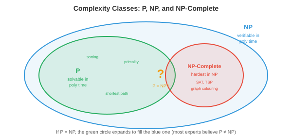

# 离散数学

*离散数学是关于可数、分离结构的数学，是计算构建的基础。本文涵盖命题逻辑与谓词逻辑、证明技巧、集合、关系、函数、图论基础以及递推关系。*

- 在前面的章节中，我们研究了连续数学：微积分（第3章）、概率分布（第5章）以及实值参数的优化（第6章）。但计算机本质上是**离散**机器。它们存储比特（0或1），处理整数，遵循分支逻辑，并操作有限数据结构。**离散数学**提供了推理这些结构的形式化语言。

- 本章所有内容都建立在离散数学之上：处理器逻辑门是布尔代数，调度算法需要正确性证明，内存管理使用集合运算，算法分析需要递推关系。

## 命题逻辑

- **命题逻辑**是真假语句的代数。一个**命题**是一个要么为真（T）要么为假（F）的陈述，绝不会两者兼有。"天在下雨"是一个命题。"现在几点了？"则不是（它是一个问句，不是具有真值的陈述）。

- 命题可以通过**逻辑连接词**进行组合：

    - **与**（合取，$p \wedge q$）：仅当$p$和$q$都为真时为真。
    - **或**（析取，$p \vee q$）：当$p$或$q$至少一个为真时为真。
    - **非**（否定，$\neg p$）：翻转真值。
    - **蕴含**（蕴涵，$p \to q$）：仅当$p$为真且$q$为假时为假。"如果下雨，地就是湿的"只有在下了雨而地却是干的时候才被违反。
    - **当且仅当**（双条件，$p \leftrightarrow q$）：当两者真值相同时为真。

- **真值表**穷举列出所有可能的输入组合及相应的输出。对于$n$个命题，该表有$2^n$行。这就是我们验证逻辑等价性的方式：

| $p$ | $q$ | $p \wedge q$ | $p \vee q$ | $p \to q$ |
|-----|-----|--------------|------------|-----------|
| T | T | T | T | T |
| T | F | F | T | F |
| F | T | F | T | T |
| F | F | F | F | T |

- 蕴含行中$p$为假的情况值得关注：$F \to q$无论$q$为何值都为真。这就是**空真**。"如果猪会飞，那我就是英国国王"在逻辑上为真，因为前提为假。这看起来违反直觉，但对数学推理至关重要。

- **逻辑等价式**是对所有真值都成立的恒等式：

    - **德摩根定律**：$\neg(p \wedge q) \equiv \neg p \vee \neg q$ 和 $\neg(p \vee q) \equiv \neg p \wedge \neg q$。要否定一个AND，分别否定每个部分并切换为OR（反之亦然）。这些直接出现在编程中：`!(a && b)` 等价于 `(!a || !b)`。

    - **逆否命题**：$p \to q \equiv \neg q \to \neg p$。"如果下雨，地就是湿的"等价于"如果地不是湿的，那么就没下雨。"这是一个强大的证明技巧。

    - **双重否定**：$\neg(\neg p) \equiv p$。

    - **分配律**：$p \wedge (q \vee r) \equiv (p \wedge q) \vee (p \wedge r)$。

- 一个总是为真（对所有真值指派）的公式是**重言式**。总是为假的公式是**矛盾式**。有时真有时假的公式是**偶然式**。例如，$p \vee \neg p$是重言式，$p \wedge \neg p$是矛盾式。

## 谓词逻辑与量词

- 命题逻辑无法表达关于集合中*所有*或*某些*元素的陈述。"每个大于2的素数都是奇数"需要**谓词逻辑**，它用变量、谓词和量词扩展了命题逻辑。

- **谓词**是依赖于变量的陈述：$P(x)$ = "$x$是偶数。"当给定$x$一个具体值时，它成为一个命题：$P(4)$为真，$P(7)$为假。

- **量词**表达范围：

    - **全称量词**（$\forall$）："对于所有。" $\forall x \, P(x)$ 表示"$P(x)$对论域中的每一个$x$成立。"
    - **存在量词**（$\exists$）："存在。" $\exists x \, P(x)$ 表示"至少存在一个$x$使得$P(x)$为真。"

- 否定量词会翻转它们：$\neg(\forall x \, P(x)) \equiv \exists x \, \neg P(x)$。"不是所有人都通过了"意味着"有人没通过。"而 $\neg(\exists x \, P(x)) \equiv \forall x \, \neg P(x)$。"没有完美的算法"意味着"每个算法都有缺陷。"

- 嵌套量词表达复杂关系。$\forall x \, \exists y \, (y > x)$ 表示"对于每个数，都有一个更大的数"（对整数成立）。顺序很重要：$\exists y \, \forall x \, (y > x)$ 表示"存在一个比所有其他数都大的数"（对整数不成立）。

- 谓词逻辑是形式化规约的语言。当我们说一个算法是"正确"的，意味着 $\forall \text{输入} \, x, \, \text{输出}(x) = \text{期望输出}(x)$。当我们说它"终止"，意味着 $\forall x \, \exists t \, \text{终止}(x, t)$。

## 证明技巧

- **证明**是确立一个陈述真理性、毫无疑义的逻辑论证。与经验证据（仅展示在某些测试案例下有效）不同，证明保证在所有情况下成立。这是计算机科学中正确性的标准。

- **直接证明**：假设前提，通过逻辑步骤推导出结论。要证明"如果$n$是偶数，那么$n^2$是偶数"：假设$n = 2k$对于某个整数$k$，则$n^2 = 4k^2 = 2(2k^2)$，这是偶数。

- **反证法**：假设该陈述为假，推导出矛盾。要证明$\sqrt{2}$是无理数：假设$\sqrt{2} = a/b$（已约简）。那么$2 = a^2/b^2$，所以$a^2 = 2b^2$，意味着$a^2$是偶数，所以$a$是偶数，设$a = 2c$。那么$4c^2 = 2b^2$，所以$b^2 = 2c^2$，意味着$b$也是偶数。但我们已经假设$a/b$是约简形式——矛盾。

- **归纳证明**：通过证明以下两点来证明一个陈述对所有自然数成立：（1）**基础情形**成立（通常$n = 0$或$n = 1$），和（2）**归纳步骤**：如果陈述对$n = k$成立（归纳假设），那么它对$n = k + 1$也成立。

- 例如，证明 $\sum_{i=1}^{n} i = \frac{n(n+1)}{2}$：
    - 基础情形：$n = 1$：$1 = \frac{1 \cdot 2}{2} = 1$。成立。
    - 归纳步骤：假设 $\sum_{i=1}^{k} i = \frac{k(k+1)}{2}$。那么 $\sum_{i=1}^{k+1} i = \frac{k(k+1)}{2} + (k+1) = \frac{k(k+1) + 2(k+1)}{2} = \frac{(k+1)(k+2)}{2}$。这正是$n = k+1$时的公式。证明完成。

- 归纳法是证明递归算法和数据结构性质的主力工具。每个递归算法都暗含一个归纳正确性证明：基础情形是终止条件，归纳步骤是递归调用。

- **强归纳法**假设该陈述对所有不大于$k$的值都成立（不仅仅是$k$），然后证明它对$k + 1$成立。当递归依赖于多个之前的值时，这很有用。

- **鸽巢原理**：如果把$n+1$个物体放入$n$个盒子中，至少有一个盒子包含两个物体。简单但出奇地强大。它证明了在任何13个人中，至少有两个人出生月份相同。在网络中，它证明了当项目数超过桶数时，哈希冲突是不可避免的。

## 集合

- **集合**是不同元素的无序收集。集合是数学中最原始的数据结构，支撑着从类型系统到数据库查询的一切。

- **集合运算**（联系第5章，我们在那里用这些进行概率计算）：

    - **并集** $A \cup B$：在$A$或$B$或两者中的元素。
    - **交集** $A \cap B$：同时在$A$和$B$中的元素。
    - **补集** $\bar{A}$：不在$A$中的元素（相对于一个全集）。
    - **差集** $A \setminus B$：在$A$中但不在$B$中的元素。
    - **笛卡尔积** $A \times B$：所有有序对$(a, b)$，其中$a \in A, b \in B$。

- **幂集** $\mathcal{P}(A)$ 是$A$的所有子集构成的集合。如果 $|A| = n$，那么 $|\mathcal{P}(A)| = 2^n$。对于 $A = \{1, 2\}$：$\mathcal{P}(A) = \{\emptyset, \{1\}, \{2\}, \{1, 2\}\}$。

- **基数**衡量集合大小。有限集具有整数基数。无限集有不同的大小：自然数$\mathbb{N}$和有理数$\mathbb{Q}$是**可数无穷**（可以列举），而实数$\mathbb{R}$是**不可数无穷**（无法列举，由康托尔的对角线论证证明）。这种区别在可计算性理论中很重要：存在不可数多个函数，但只有可数多个程序，因此大多数函数是不可计算的。

## 关系

- 集合$A$上的**关系**$R$是$A \times A$的一个子集：指定哪些元素相关联的有序对集合。例如，整数上的$\leq$是集合 $\{(a, b) : a \leq b\}$。

- 关系的重要性质：

    - **自反性**：每个元素与自身相关。对所有$a$有$a R a$。例：$\leq$（每个数$\leq$自身）。
    - **对称性**：如果$a R b$则$b R a$。例："是……的兄弟姐妹。"
    - **反对称性**：如果$a R b$且$b R a$则$a = b$。例：$\leq$。
    - **传递性**：如果$a R b$且$b R c$则$a R c$。例：$<$、$\leq$、"是……的祖先。"

- **等价关系**是自反、对称且传递的。它将集合划分为**等价类**，其中同一类中的所有元素彼此相关，但与不同类中的元素无关。模运算是一个等价关系：$a \equiv b \pmod{n}$ 将整数划分为$n$个类。编程语言中的类型等价是一个等价关系。

- **偏序**是自反、反对称且传递的。它定义了一个"小于等于"结构，可能会使某些元素不可比较。文件系统目录构成一个偏序（父-子），但同级目录是不可比较的。**全序**是每一对元素都可比较的偏序（如整数上的$\leq$）。

- 偏序在并发中至关重要：事件上的"先于发生"关系是一个偏序。不由先于发生关系排序的事件是并发的，可能以任意相对顺序执行。

## 函数

- **函数** $f: A \to B$ 将$A$（定义域）中的每个元素映射到$B$（陪域）中的恰好一个元素。函数是确定性计算的数学模型：给定一个输入，恰好有一个输出。

- **单射**（一对一）：不同的输入总是产生不同的输出。$f(a) = f(b) \implies a = b$。无损压缩是单射的：不同的输入必须压缩成不同的输出（否则无法唯一解压）。

- **满射**（到上）：$B$中的每个元素都被$A$中的某个元素命中。值域等于陪域。将字符串映射到256位哈希的哈希函数，如果字符串数少于可能的哈希数，则不是满射。

- **双射**：既是单射又是满射。$A$和$B$之间的一一对应。双射具有逆函数。加密必须是双射的：每个明文映射到唯一的密文，而解密函数就是逆函数。

- **复合** $(g \circ f)(x) = g(f(x))$：先应用$f$，再应用$g$。函数复合是可结合的（第2章：就像矩阵乘法是可结合的一样）。软件中的管道就是函数复合：数据流经一系列变换。

## 图论基础

- 我们在第12章（图神经网络）中广泛介绍了图，包括邻接矩阵、图类型、拉普拉斯矩阵和谱理论。这里我们专注于与CS相关的**算法**和**结构**性质。

- **树**是没有环的连通图。等价地，它有$n$个节点和$n-1$条边。树是文件系统、XML/HTML文档、决策过程和递归分解的结构。**有根树**有一个指定的根节点；每个其他节点恰好有一个父节点。

- 图$G$的**生成树**是包含$G$所有节点并使用其边子集的一棵树。**最小生成树（MST）**最小化总边权。Kruskal算法（对边排序，贪心地添加不形成环的最轻边）和Prim算法（从起始节点开始扩展树，总是添加连接到新节点的最轻边）都能在$O(|E| \log |V|)$内找到MST。

- **平面性**：如果一个图可以画在平面上而边不相交，则是平面图。根据**欧拉公式**，对于连通平面图：$|V| - |E| + |F| = 2$，其中$|F|$是面的数量（区域，包括外部面）。这意味着平面图的$|E| \leq 3|V| - 6$，因此平面图是稀疏的。电路板布线和地图着色利用了平面性。

- **图着色**为节点分配颜色，使得没有两个相邻节点共享相同的颜色。所需的最小颜色数是**色数** $\chi(G)$。**四色定理**指出任何平面图的 $\chi(G) \leq 4$。在CS中，图着色模拟寄存器分配（将变量分配到CPU寄存器，使得同时活跃的变量获得不同的寄存器）和调度（将任务分配到时间槽，使得冲突的任务不重叠）。

- **欧拉路径**恰好访问每条边一次。当且仅当图中恰好有0个或2个奇数度节点时，欧拉路径存在。**哈密顿路径**恰好访问每个节点一次。确定哈密顿路径是否存在是NP完全的——这是CS中的经典难题之一。这种对比（欧拉：多项式，哈密顿：NP完全）说明了听起来相似的问题可能具有截然不同的计算复杂度。

## 递推关系

- **递推关系**定义一个序列，其中每一项依赖于前面的项。它们自然地从递归算法中产生。

- 最简单的例子：$T(n) = T(n-1) + 1$，其中 $T(0) = 0$。展开：$T(n) = T(n-1) + 1 = T(n-2) + 2 = \cdots = n$。这是$O(n)$，即简单循环的时间复杂度。

- **归并排序**给出 $T(n) = 2T(n/2) + O(n)$：将数组分成两半（两个大小为$n/2$的子问题），递归排序每一半，然后合并（$O(n)$工作）。解为 $T(n) = O(n \log n)$。

- **主定理**求解形式为 $T(n) = aT(n/b) + O(n^d)$ 的递推式：

    - 如果 $d > \log_b a$：$T(n) = O(n^d)$（每层的工作占主导）
    - 如果 $d = \log_b a$：$T(n) = O(n^d \log n)$（工作在各层间平衡）
    - 如果 $d < \log_b a$：$T(n) = O(n^{\log_b a})$（子问题的数量占主导）

- 对于归并排序：$a = 2, b = 2, d = 1$。由于 $d = \log_2 2 = 1$，我们处于平衡情况：$T(n) = O(n \log n)$。

- **斐波那契递推** $F(n) = F(n-1) + F(n-2)$，其中 $F(0) = 0, F(1) = 1$，封闭形式解为 $F(n) = \frac{\phi^n - \psi^n}{\sqrt{5}}$，其中 $\phi = \frac{1+\sqrt{5}}{2}$（黄金比例）且 $\psi = \frac{1-\sqrt{5}}{2}$。这表明斐波那契数列以 $O(\phi^n)$ 指数增长，这就是为什么朴素递归斐波那契指数级慢。

- **组合数学**（排列、组合、二项式定理和容斥原理）在第5章（概率）中介绍。这些计数技术对算法分析至关重要（有多少种可能的输入？需要多少次比较？），但我们在此不再重复。

## 可计算性

- 并非所有事情都能被计算。这是整个数学中最深刻的结论之一，它设定了计算机能力的基本极限。

- **图灵机**是计算的抽象模型：一条无限长的单元格磁带（每个单元格包含一个符号），一个读写头，以及一组带转移规则的有限状态。尽管简单，图灵机可以计算任何实际计算机能计算的任何东西。这就是**邱奇-图灵论题**：任何有效可计算的函数都可以由图灵机计算。

- 每种编程语言（Python、C、Haskell）都是**图灵完备**的：它可以模拟图灵机，从而计算任何可计算的东西。语言之间的区别在于便利性、速度和安全性，而不在于它们根本上能计算什么。

- **停机问题**询问：给定一个程序和一个输入，该程序最终会停止，还是永远运行？图灵（1936）证明不存在能普遍解决这个问题的算法。证明采用反证法：假设存在一个停机检测器 $H(P, x)$。构造一个程序 $D$，它运行 $H(D, D)$ 并做与 $H$ 所说的相反的事。如果 $H$ 说 $D$ 停机，$D$ 就永远循环。如果 $H$ 说 $D$ 循环，$D$ 就停机。矛盾。

- 这不是当前技术的局限；这是一个数学上的不可能性。无论多少计算、多少聪明才智、或多少人工智能，都无法普遍解决停机问题。它是哥德尔不完备定理在计算机科学中的类比。

- 实际后果：你无法编写一个完美的死锁检测器、一个完美的病毒扫描器或一个完美的优化编译器。每一个都需要通用地解决停机问题（或一个等价的不判定问题）。实际工具使用启发式方法和近似方法，在常见情况下有效，但不能保证对所有输入都正确。

- 如果一个问题存在一个总是能给出正确是/否答案并终止的算法，则它是**可判定的**。如果不存在这样的算法，则是**不可判定的**。停机问题是不可判定的。素数测试是可判定的。大多数编程语言中的类型检查是可判定的（通过设计）。

## 复杂度理论

- 即使在可计算的问题中，有些也远比其他的难。**复杂度理论**根据解决问题所需的资源（时间、空间）随输入增长而分类问题。



- **P**（多项式时间）：能在 $O(n^k)$ 时间内解决的问题，$k$为某个常数。排序（$O(n \log n)$）、最短路径（$O(|V|^2)$）、矩阵乘法（$O(n^3)$）。这些被认为是"高效"或"可处理的。"

- **NP**（非确定性多项式时间）：一个拟议的解答能在多项式时间内**验证**的问题，即使**找到**解答可能需要指数时间。例如，给定一个声称的哈密顿路径，你可以通过检查每条边在 $O(n)$ 时间内验证它。但找到一条可能需尝试指数多个可能性。

- P中的每个问题也在NP中（如果你能快速解决它，你当然能快速验证一个解答）。核心问题是 $P = NP$ 是否成立：每个能快速验证解答的问题是否也能快速求解？这是计算机科学中最重要的开放问题，获得克莱数学研究所100万美元的千禧年大奖。

- 大多数专家相信 $P \neq NP$，意味着有些问题本质上比验证更难解决。如果 $P = NP$，密码学将崩溃（破解加密属于NP），而优化、调度和药物设计将变得异常简单。

- **NP完全**问题是NP中最难的问题。一个问题如果是NP完全的，则：（1）它在NP中，且（2）所有其他NP问题可以在多项式时间内**归约**到它。如果你能高效解决任何一个NP完全问题，你就能解决所有NP完全问题（从而 $P = NP$）。

- **归约**将一个问题转换为另一个问题。如果问题A归约到问题B，那么B至少和A一样难。Cook（1971）证明了**SAT**（布尔可满足性：给定一个逻辑公式，是否存在使公式为真的变量赋值？）是NP完全的。Karp（1972）通过将SAT归约到每个问题，证明了其他21个经典问题是NP完全的。

- 著名的NP完全问题：
    - **旅行商问题（TSP）**：找到访问所有城市恰好一次的最短路线。
    - **图着色**：用$k$种颜色为节点着色，使得没有相邻节点共享同一颜色（$k \geq 3$）。
    - **子集和问题**：给定一组整数，是否存在一个子集其和等于目标值？
    - **布尔可满足性（SAT）**：是否存在使逻辑公式为真的真值赋值？
    - **哈密顿路径**（上文图论中提到的）。

- 当你在实践中遇到NP完全问题时，你不会对大规模输入精确求解。相反，你使用：**近似算法**（找到保证在最优解一定倍数范围内的解）、**启发式方法**（贪心、局部搜索、模拟退火）或**特例求解器**（许多NP完全问题对受限输入很容易）。例如，现代SAT求解器尽管在最坏情况下是指数复杂度，但通过利用实际实例中的结构，通常能解决拥有数百万变量的实例。

- **NP困难**问题至少和NP完全问题一样难，但可能不在NP中（它们的解甚至可能不能在多项式时间内验证）。NP完全问题的优化版本通常是NP困难的："找到最短TSP路线"是NP困难的，而"是否存在一条长度小于$k$的TSP路线？"是NP完全的。

## 编程任务（使用CoLab或笔记本）

1. 构建一个真值表生成器。给定一个逻辑表达式，枚举所有输入组合并计算结果。
```python
import itertools

def truth_table(n_vars, expr_fn):
    """为一个n_vars个变量的布尔函数生成真值表。"""
    headers = [f"p{i}" for i in range(n_vars)]
    print(" | ".join(headers + ["result"]))
    print("-" * (len(headers) * 4 + 10))
    for vals in itertools.product([False, True], repeat=n_vars):
        result = expr_fn(*vals)
        row = [str(v)[0] for v in vals] + [str(result)[0]]
        print(" | ".join(f"{r:>2}" for r in row))

# 德摩根定律：NOT(p AND q) == (NOT p) OR (NOT q)
print("德摩根定律验证：")
truth_table(2, lambda p, q: (not (p and q)) == ((not p) or (not q)))
```

2. 通过归纳法证明求和公式——对多个值进行数值验证，然后实现封闭形式解。
```python
import jax.numpy as jnp

# 验证求和公式：sum(1..n) = n(n+1)/2
for n in [1, 5, 10, 100, 1000, 10000]:
    brute = sum(range(1, n + 1))
    formula = n * (n + 1) // 2
    print(f"n={n:5d}  sum={brute:>10d}  formula={formula:>10d}  match={brute == formula}")
```

3. 使用主定理求解归并排序递推关系，并通过计数操作进行经验验证。
```python
import jax.numpy as jnp

def merge_sort_ops(n):
    """统计归并排序中的比较次数（递推：T(n) = 2T(n/2) + n）。"""
    if n <= 1:
        return 0
    half = n // 2
    return merge_sort_ops(half) + merge_sort_ops(n - half) + n

for n in [8, 64, 512, 4096, 32768]:
    ops = merge_sort_ops(n)
    predicted = n * jnp.log2(n)
    ratio = ops / predicted
    print(f"n={n:5d}  ops={ops:>10d}  n log n={int(predicted):>10d}  ratio={ratio:.3f}")
```
