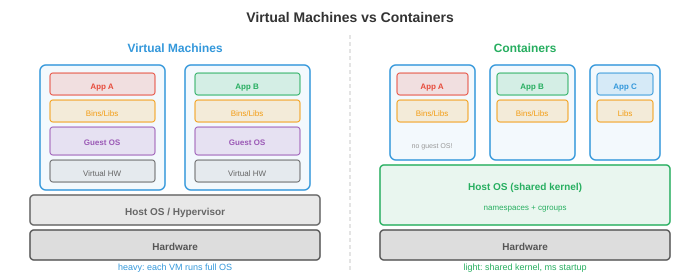

# 操作系统

*操作系统是硬件与应用程序之间的软件层，负责管理资源、提供抽象并实施隔离。本文涵盖操作系统的功能、进程、线程、CPU调度、内存管理、文件系统和系统调用。*

- 没有操作系统的计算机就像一个没有厨师的厨房：食材（硬件）都在那里，但没有人协调谁使用炉灶、餐具放在哪里、或者如何防止两个人同时抓同一把刀。**OS**就是那个协调者。

- 对于ML从业者，操作系统的概念解释了：为什么 `nvidia-smi` 显示每个进程的GPU内存使用量、为什么训练因"内存不足"而崩溃、为什么 `fork()` 会复制你的Python进程、以及为什么Docker容器提供隔离环境。

## 操作系统做什么

- OS有三个核心职责：

    - **抽象**：将硬件复杂性隐藏在简洁的接口之后。程序读写"文件"而无需知道底层存储是SSD、HDD还是网络驱动器。它们分配"内存"而无需管理物理RAM芯片。它们在"CPU"上运行而无需担心中断和缓存一致性。

    - **资源管理**：多个程序共享CPU、内存、磁盘和网络。OS决定谁获得什么资源、何时获得、获得多久。公平高效的分配策略保持系统的响应性。

    - **隔离与保护**：程序之间不得相互干扰。浏览器中的Bug不应导致内核崩溃。恶意程序不应读取另一个程序的密码。OS利用硬件支持（特权级、虚拟内存）强制实施边界。

## 进程

- **进程**是正在运行的程序。它是OS的基本工作单元。每个进程都有：

    - **代码**（程序指令，只读）。
    - **数据**（全局变量，堆分配）。
    - **堆栈**（函数调用帧，局部变量）。
    - **状态**（寄存器值、程序计数器、打开的文件等）。

- **进程控制块（PCB）**是OS用于跟踪进程的数据结构。它存储进程ID（PID）、状态、程序计数器、寄存器内容、内存映射、打开的文件描述符和调度优先级。当OS从一个进程切换到另一个进程时，它将当前进程的状态保存到其PCB中，并加载下一个进程的状态。这就是**上下文切换**。

- 上下文切换代价高昂：保存和恢复寄存器、刷新缓存、使TLB项失效需要微秒级时间。在一个运行数千个进程的系统中，开销可能很大。这就是为什么每进程每请求的服务器架构（如老式Apache）被基于线程或事件驱动的架构取代。

- Unix中的**进程创建**使用 `fork()` 和 `exec()`：

    - `fork()` 创建当前进程的一个**副本**。子进程获得父进程内存、文件描述符和状态的一份副本。两个进程从同一点继续执行，但 `fork()` 在子进程中返回0，在父进程中返回子进程的PID。

    - `exec()` 用新程序替换当前进程的代码。在 `fork()` 之后，子进程通常调用 `exec()` 来运行一个不同的程序。

    - 这种先fork后exec的模型很优雅：创建新进程（fork）和加载新程序（exec）是独立的操作，可以各自定制。在fork和exec之间，子进程可以重定向I/O、更改环境变量或降低权限。


- **进程状态**：一个进程处于以下几种状态之一：
    - **运行**：当前在CPU核心上执行。
    - **就绪**：等待CPU核心（可运行但尚未被调度）。
    - **阻塞**（等待）：无法继续，直到某个事件发生（I/O完成、锁获取、定时器到期）。
    - **终止**：执行完毕，等待父进程收集其退出状态。

## 线程

- **线程**是进程内的轻量级执行单元。进程内的所有线程共享相同的代码、数据和堆，但每个线程有自己的堆栈和寄存器状态。

- 与多个进程相比的优势：线程共享内存，因此它们之间的通信很快（只需读写共享变量）。进程需要进程间通信（管道、套接字、共享内存映射），这更慢且更复杂。

- 劣势：共享内存是危险的。两个线程同时写入同一变量会导致**竞态条件**（结果取决于哪个线程先运行）。这引导我们进入同步问题，在文件4中介绍。

- **内核线程**由OS调度器管理。每个线程独立地被调度到CPU核心上。创建和切换内核线程涉及系统调用，开销与进程上下文切换类似（但更小）。

- **用户线程**（绿色线程）由用户空间的运行时库管理，对OS不可见。创建和切换它们的成本更低（无需系统调用），但一个用户线程的阻塞操作会阻塞进程中的所有线程（因为OS只看到一个内核线程）。

- 现代系统使用**混合模型**：许多用户线程映射到较少数量的内核线程上（M:N线程）。Go的goroutine和Erlang的进程是由语言运行时调度到OS线程上的用户级线程。

- **线程池**预先创建固定数量的线程，等待任务。当任务到达时，分配给一个空闲线程。这避免了为每个任务创建和销毁线程的开销。Web服务器、数据库引擎和ML推理服务器都使用线程池。

## CPU调度

- **调度器**决定每个时刻哪个进程/线程在哪个CPU核心上运行。目标是：最大化CPU利用率、最小化响应时间（对交互式任务）、最大化吞吐量（对批处理任务）、并确保公平性。

- **先来先服务（FCFS）**：进程按到达顺序运行。简单但存在**护航效应**：一个长时间运行的进程阻塞了后面所有较短的进程。

- **最短作业优先（SJF）**：运行最短的进程优先。可证明最小化平均等待时间，但需要预先知道作业长度（通常不可能）。其抢占式版本**最短剩余时间优先（SRTF）**，如果出现更短的作业则中断正在运行的作业。

- **轮转（RR）**：每个进程获得一个固定的**时间片**（如10 ms），然后被抢占并移到队列末尾。公平且响应性好，但时间片大小很重要：太小会导致过多上下文切换，太大则会退化为FCFS。

- **优先级调度**：每个进程有一个优先级。高优先级进程先运行。危险是**饥饿**：如果高优先级进程源源不断到来，低优先级进程可能永远无法运行。**老化**解决这个问题：进程等待时间越长，其优先级就越高。

- **多级反馈队列（MLFQ）**：具有不同优先级和时间片的多个队列。新进程从最高优先级队列（短时间片）开始。如果一个进程用完其时间片（CPU密集型），它被降到较低优先级队列（较长时间片）。交互式进程自然停留在高优先级队列中（它们在使用完时间片之前就因I/O阻塞了）。这可以适应工作负载，而无需预先了解作业类型。

- **完全公平调度器（CFS）**：Linux调度器。它维护一棵红黑树（平衡二叉搜索树），进程按"虚拟运行时间"（它们已经消耗的CPU时间）排序。具有最小虚拟运行时间的进程接下来运行。这确保了随着时间的推移，每个进程获得其公平份额。CFS每次调度决策运行时间为 $O(\log n)$。

## 内存管理

- OS管理物理RAM，将其分配给进程并在不再需要时回收。

- **分页**（来自文件2）将虚拟内存划分为固定大小的页，物理内存划分为帧。页表将页映射到帧。分页消除了外部碎片（分配之间的浪费空间），因为所有页面大小相同。

- **请求分页**仅在首次访问时将页加载到RAM中（而不是在进程启动时）。这节省了内存：一个拥有1 GB代码的程序在典型运行中可能只使用50 MB。其余部分从未被加载。

- 当RAM满且需要新页时，OS必须**换出**一个现有页面。**页面置换**算法（LRU、FIFO、时钟，来自文件2）决定换出哪个页面。好的置换最小化缺页次数；坏的置换导致系统颠簸。

- **分段**将内存划分为可变大小的段（代码、数据、栈、堆），每个段有自己的基地址和长度。分段提供逻辑组织，而分页提供物理管理。现代系统最小限度地使用分段（主要用于保护），并依赖分页进行内存管理。

- **堆**是动态分配内存所在的地方（C中的`malloc`/`free`，Java中的`new`，Python中隐式管理）。OS向进程提供大块内存，**内存分配器**（如 `glibc malloc`、`jemalloc`、`tcmalloc`）将这些大块细分为更小的分配。分配器设计影响性能：碎片浪费空间，线程间的争用浪费时间。

## 文件系统

- **文件系统**将持久存储（SSD、HDD）上的数据组织为命名的文件和目录层次结构。

- **inode**（索引节点）存储文件的元数据：大小、所有权、权限、时间戳以及指向磁盘上数据块的指针。文件名存储在目录中，目录将名称映射到inode编号。这种分离意味着一个文件可以有多个名称（**硬链接**）指向同一个inode。

- **FAT**（文件分配表）：一种简单的文件系统，用于USB驱动器和SD卡。一个表将每个簇（块）映射到文件中的下一个簇，形成一个链表。简单但不好支持权限、日志记录或大文件。

- **ext4**：默认的Linux文件系统。使用带有直接、间接、二级间接和三级间接块指针的inode来处理任何大小的文件。支持**区段**（块的连续范围）以高效处理大文件。最大文件大小：16 TB，最大分区：1 EB。

- **日志记录**防止因崩溃而损坏。在修改文件系统结构之前，更改被写入**日志**（journal）。如果系统在操作中间崩溃，重启时会重放日志以完成或撤销该操作。没有日志记录，写入期间的崩溃可能使文件系统处于不一致状态（文件的数据块已更新但其inode未更新，反之亦然）。

- **基于B树的文件系统**（Btrfs、ZFS）使用B树（平衡搜索树）来组织数据和元数据，实现高效搜索、写时复制快照以及用于数据完整性的内置校验和。这些与数据库索引中使用的B树相同。

## 系统调用与内核模式

- **系统调用**是用户程序和OS内核之间的接口。当程序需要做一些特权操作（读取文件、分配内存、创建进程、发送网络数据包）时，它会进行系统调用。

- CPU在两种模式下运行：
    - **用户模式**：受限制。程序可以执行自己的代码并访问自己的内存，但不能直接访问硬件、其他进程的内存或OS数据结构。
    - **内核模式**：不受限制。OS内核可以访问所有硬件和内存。系统调用是从用户模式到内核模式的受控通道。

- 当程序调用 `read()` 时，发生以下过程：
    1. 程序将参数放入寄存器并触发**陷阱**（一种软件中断）。
    2. CPU切换到内核模式并跳转到系统调用处理程序。
    3. 内核验证参数，执行I/O操作，将数据复制到用户的缓冲区。
    4. 内核切换回用户模式并返回结果。

- 常见系统调用：`open`、`read`、`write`、`close`（文件），`fork`、`exec`、`wait`、`exit`（进程），`mmap`、`brk`（内存），`socket`、`bind`、`listen`、`accept`（网络）。

- **中断**是迫使CPU暂时停止当前操作并运行中断处理程序（在内核中）的硬件信号。一次键盘按键、一个网络数据包到达或一个定时器滴答都会产生中断。定时器中断特别重要：它使OS能够抢占正在运行的进程并切换到另一个（抢占式多任务）。

## 网络基础

- 网络栈是OS的一个子系统，实现机器之间的通信。理解它解释了分布式训练如何同步梯度、模型服务如何处理请求以及为什么延迟很重要。


- **TCP/IP模型**将网络组织为分层结构，每层为上层提供抽象：

    - **链路层**：处理单个物理链路上的通信（以太网、Wi-Fi）。处理MAC地址和帧。
    - **网络层（IP）**：将数据包跨多个网络从源路由到目标。每台机器有一个**IP地址**（例如 IPv4 的 192.168.1.1 或 128位的IPv6地址）。路由器基于目标IP逐跳转发数据包。
    - **传输层（TCP/UDP）**：提供应用程序之间的端到端通信。
    - **应用层**：HTTP、DNS、gRPC等协议，应用程序直接使用。

- **TCP**（传输控制协议）提供可靠、有序的交付。它建立一个连接（三次握手：SYN、SYN-ACK、ACK），保证所有数据按序到达（使用序列号和确认），重传丢失的数据包，并控制发送速率以避免网络过载（**拥塞控制**）。代价是延迟：握手增加了一个往返时间，重传增加了延迟。

- **UDP**（用户数据报协议）提供不可靠、无序的交付。无需握手、无需重传、无顺序保证。延迟远低于TCP。用于速度比可靠性更重要的场景：视频流、在线游戏、DNS查询。在ML中，一些梯度同步协议使用基于UDP的RDMA以获得更低延迟。

- **套接字**是用于网络通信的OS API。一个**套接字**是由（IP地址，端口号）标识的端点。服务器创建一个套接字，将其绑定到一个端口（例如HTTP的80），监听连接，并接受它们。客户端创建一个套接字并连接到服务器的地址:端口。然后通过套接字像文件一样读写数据。

- **DNS**（域名系统）将人类可读的名称（google.com）翻译为IP地址（142.250.80.46）。它是一个分布式的、层次化的数据库：你的机器询问本地解析器，后者询问根服务器，根服务器委托给每个域的权威服务器。

- **HTTP**（超文本传输协议）是Web的请求-响应协议。客户端发送一个请求（方法 + URL + 头部 + 可选体），服务器发送一个响应（状态码 + 头部 + 体）。ML模型服务（如TensorFlow Serving、Triton）将模型暴露为HTTP或gRPC端点。

- **延迟 vs 带宽**：延迟是一个数据包从源到目标所需的时间（由物理距离和网络跳数决定）。带宽是数据传输速率（每秒字节数）。高带宽、高延迟的连接（卫星互联网）可以传输大量数据，但每个字节需要很长时间才能到达。对于分布式训练，**延迟**对同步屏障（所有GPU必须等待最慢的那个）很重要，而**带宽**对传输大的梯度张量很重要（第6章）。

## 虚拟化与容器

- **虚拟化**在单个物理机上运行多个操作系统。**虚拟机监视器**（VMware、KVM、Xen）创建**虚拟机（VM）**，每个虚拟机有自己的虚拟CPU、内存、磁盘和网络接口。每个虚拟机运行一个完整的操作系统（来宾OS），它认为自己拥有专用硬件。

- VM提供强隔离（一个VM崩溃不影响其他VM）和灵活性（在同一台机器上运行Linux和Windows，在物理主机之间迁移VM）。代价是开销：每个VM运行一个完整的OS内核，消耗内存和CPU来执行与宿主机OS冗余的OS操作。



- **容器**（Docker、Podman）提供了一种更轻量的替代方案。容器不是虚拟化整个硬件，而是共享宿主机OS内核，并使用内核特性来隔离进程：

    - **命名空间**隔离进程可以看到的内容：每个容器拥有自己的进程树视图（PID命名空间）、网络接口（网络命名空间）、文件系统挂载点（挂载命名空间）和主机名（UTS命名空间）。容器内的进程不能看到其他容器中的进程。

    - **Cgroups**（控制组）限制进程可以使用的内容：CPU时间、内存、磁盘I/O、网络带宽。容器不能消耗超过其cgroup允许的资源，防止一个容器饿死其他容器。

- 容器在毫秒内启动（无需OS启动），使用最小开销（共享内核），并通过**Dockerfile**定义，该文件指定基础镜像、依赖项和命令。这使得它们可复现：`docker build` 在任何地方产生相同的环境。

- 对于ML，容器解决了"在我机器上能运行"的问题。具有特定版本CUDA、cuDNN、PyTorch和Python的训练环境被打包为容器镜像。任何人都可以在任何机器上复现确切的环境。云训练平台（AWS SageMaker、GCP Vertex AI）在容器中运行训练任务。

- **Kubernetes**（K8s）大规模编排容器：它将容器调度到集群中的多台机器上，重启失败的容器，根据负载进行扩缩容，并管理容器之间的网络。大规模ML服务（数千个模型副本处理数百万请求）在Kubernetes上运行。

## 安全基础

- OS通过多种机制实施安全：

- **权限**：每个文件有一个所有者、一个组和权限位（拥有者、组和其他人的读/写/执行）。进程以启动它的用户的身份（UID）运行，只能访问权限位允许的文件。**root**用户（UID 0）绕过所有权限检查，这就是为什么以root身份运行是危险的。

- **权限分离**：进程以所需的最小权限运行。Web服务器不需要root访问权限；它应该以一个受限用户身份运行，该用户只能读取Web文件并绑定到端口80。如果服务器被攻破，攻击者的访问限制在该受限用户能做的范围内。

- **沙箱化**：限制进程在文件权限之外能做的事情。**seccomp**（Linux）限制进程可以进行的系统调用。**AppArmor**和**SELinux**定义强制访问控制策略。容器结合了命名空间、cgroups和seccomp进行多层隔离。

- **地址空间布局随机化（ASLR）**：每次程序运行时，随机化堆栈、堆和库的内存位置。这使得攻击者更难利用内存损坏漏洞（缓冲区溢出），因为他们无法预测代码或数据在内存中的位置。

- 安全是一个全系统层面的关注：链条的强度取决于最弱的一环。模型服务系统需要安全的网络通信（TLS/HTTPS）、经过身份验证的API访问（API密钥、OAuth）、输入验证（防止对抗性输入）和隔离执行（具有最小权限的容器）。

## 编程任务（使用CoLab或笔记本）

1. 探索进程创建。使用Python的 `os.fork()`（仅Unix）创建一个子进程，并观察父进程和子进程如何从同一点继续执行。
```python
import os

pid = os.fork()

if pid == 0:
    # 子进程
    print(f"Child: my PID is {os.getpid()}, parent PID is {os.getppid()}")
else:
    # 父进程
    print(f"Parent: my PID is {os.getpid()}, child PID is {pid}")
    os.wait()  # 等待子进程结束
```

2. 模拟轮转调度。给定一个带有执行时间的进程列表，模拟调度并计算平均等待时间。
```python
def round_robin(processes, quantum=3):
    """模拟轮转调度。
    processes: (name, burst_time) 元组列表。
    """
    queue = [(name, burst, 0) for name, burst in processes]  # (name, remaining, wait)
    time = 0
    log = []

    while queue:
        name, remaining, waited = queue.pop(0)
        waited += (time - waited - (processes[[p[0] for p in processes].index(name)][1] - remaining))
        run_time = min(quantum, remaining)
        log.append(f"  t={time:3d}: {name} runs for {run_time} (remaining: {remaining - run_time})")
        time += run_time
        remaining -= run_time

        if remaining > 0:
            queue.append((name, remaining, time))
        else:
            log.append(f"  t={time:3d}: {name} DONE (turnaround: {time})")

    for line in log:
        print(line)

print("轮转调度 (quantum=3)：")
round_robin([("P1", 10), ("P2", 4), ("P3", 6)], quantum=3)
```

3. 模拟LRU页面置换。给定一个页面访问序列和固定数量的帧，统计缺页次数。
```python
def lru_page_replacement(pages, n_frames):
    """模拟LRU页面置换。"""
    frames = []
    faults = 0

    for page in pages:
        if page in frames:
            frames.remove(page)
            frames.append(page)  # 移动到最近使用
            status = "HIT "
        else:
            faults += 1
            if len(frames) >= n_frames:
                evicted = frames.pop(0)  # 移除最近最少使用
                status = f"MISS (evict {evicted})"
            else:
                status = "MISS (cold)"
            frames.append(page)
        print(f"  Page {page}: {status}  frames={frames}")

    print(f"\nTotal faults: {faults}/{len(pages)} ({faults/len(pages):.0%})")

print("LRU with 3 frames:")
lru_page_replacement([1, 2, 3, 4, 1, 2, 5, 1, 2, 3, 4, 5], n_frames=3)
```
