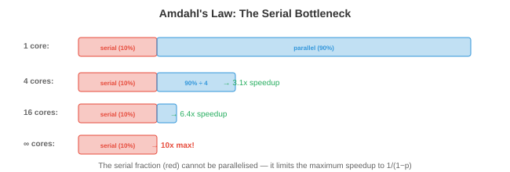

# 并发与并行

*并发与并行是程序同时处理多件事情的方式。本文涵盖并发与并行的区别、同步原语、经典并发问题、死锁、无锁数据结构、并行编程模型、异步编程和扩展定律——这些概念支撑着多线程服务器、分布式训练和每一个现代应用程序。*

- 单个CPU核心一次执行一条指令。但现代系统有8个、64个甚至数千个核心（GPU）。即使在单核上，我们也希望处理多个任务：一边下载文件一边渲染界面一边处理用户输入。**并发**和**并行**是管理多个活动的两种策略。

## 并发 vs 并行


- **并发**是关于*管理*多个任务。任务通过交错进行：任务A运行一会儿，然后任务B，然后回到A。在单核上，并发创造了同时执行的假象。这些任务并非真正同时执行；它们轮流进行。

- **并行**是关于*执行*多个任务同时进行。有$n$个核心，$n$个任务可以真正同时运行。并行需要多个硬件执行单元。

- 类比：并发是一个厨师交替切菜和搅拌锅。并行是两个厨师各自同时做一个任务。一个系统可以是并发但不并行的（单核，任务交错），并行但不并发的（多核运行独立程序，没有交互），或者两者兼有（多核运行互相交错交互的任务）。

- 在ML中，并发出现在数据加载中（数据预处理与GPU计算重叠），而并行出现在分布式训练中（多个GPU同时计算梯度，第6章）。

## 同步原语

- 当多个线程共享数据时，**同步**防止竞态条件。竞态条件发生在结果依赖于线程执行的不可预测顺序时。

- 考虑两个线程同时增加一个共享计数器：`counter += 1`。这实际上是三个操作：（1）读取计数器，（2）加1，（3）写入计数器。如果两个线程读取相同的值（比如5），都加1，都写入6，计数器最终为6而不是正确的7。一次增加丢失了。

- **互斥锁**（互斥排斥锁）确保一次只有一个线程访问临界区。一个线程在进入临界区前**获取**锁，之后**释放**锁。任何其他试图获取已被持有锁的线程将阻塞直到锁被释放。

```
lock.acquire()
counter += 1      # 一次只有一个线程在此
lock.release()
```

- 互斥锁是正确的，但会引入**争用**：如果许多线程竞争同一个锁，它们花费时间等待而不是计算。这限制了可扩展性。极端情况下，所有线程都想要同一个锁，会使整个程序串行化。

- **信号量**泛化了互斥锁。计数信号量维护一个计数器：`wait()` 递减计数器（如果会变负则阻塞），`signal()` 递增计数器。初始化为1的信号量行为类似互斥锁。初始化为$n$的信号量允许最多$n$个线程同时进入临界区（适用于资源池如数据库连接）。

- **条件变量**让一个线程等待直到某个特定条件满足。该线程释放一个锁，在条件变量上等待，当另一个线程发出该条件的信号时被唤醒。这避免了忙等待（在一个循环中反复检查条件，浪费CPU）。

- **监视器**将互斥锁与条件变量和共享数据捆绑为一个单一抽象。Java的 `synchronized` 关键字和Python的 `threading.Condition` 实现了类似监视器的语义。

- **读写锁**区分读线程（可以共享访问，因为读取不会修改数据）和写线程（需要独占访问）。多个读线程可以同时持有锁，但一个写线程会阻塞所有读线程和其他写线程。当读操作远多于写操作时（例如，提供预测的缓存模型），这是最优的。

## 经典并发问题

- **生产者-消费者**（有界缓冲区）：生产者生成项目并将其放入固定大小的缓冲区；消费者移除项目。挑战：缓冲区满时生产者必须等待，缓冲区空时消费者必须等待，且两者必须防止损坏缓冲区。

- 解决方案使用两个信号量（一个计数空位，一个计数满位）加上一个用于缓冲区本身的互斥锁。这是大多数消息队列、日志系统和数据管道背后的模式。

- **读者-写者**：多个读者可以同时读取，但写者需要独占访问。挑战是公平性：如果读者源源不断地到来，写者可能饥饿（永远得不到访问）。解决方案要么优先考虑读者，要么优先考虑写者，要么公平地交替。

- **哲学家就餐问题**：五位哲学家围坐在一张有五个叉子的桌子旁。每人需要两把叉子才能吃饭。如果所有五位同时拿起左边的叉子，没人能拿起右边的叉子，所有人都饿死（死锁）。解决方案包括：同时拿起两把叉子（原子操作），引入不对称性（一位哲学家先拿右边的叉子），或者使用服务员（限制用餐人数为4的信号量）。

## 死锁

- **死锁**发生在一组线程各自等待集合中另一个线程持有的资源，形成一个依赖循环。没有人能继续。


- 死锁的四个**必要条件**（必须同时满足）：

    1. **互斥**：资源一次只能被一个线程持有。
    2. **持有并等待**：一个线程持有一个资源的同时等待另一个资源。
    3. **不可剥夺**：资源不能被强制从线程中拿走。
    4. **循环等待**：等待图中存在一个循环。

- **死锁预防**打破四个条件之一：
    - 消除循环等待：对资源施加全序。所有线程以相同的顺序获取资源。如果每个线程总是在获取锁A之后才获取锁B，则不可能有循环。
    - 消除持有并等待：要求线程一次性（原子地）请求所有资源。

- **死锁避免**动态决定是否批准一个资源请求可能导致死锁。**银行家算法**维护每个线程的最大可能需求，仅批准使系统保持"安全状态"（所有线程最终都能完成的状态）的请求。该算法每个请求 $O(n^2 m)$（$n$个线程，$m$种资源类型），对大多数实际系统来说过于昂贵。

- **死锁检测**让死锁发生，然后检测它们（通过在等待图中找到循环）并恢复（通过杀死一个线程或回滚一个事务）。

- 在实践中，大多数系统对常见情况使用预防（资源排序），对罕见情况使用检测。数据库系统是经典例子：它们检测事务之间的死锁并中止一个来打破循环。

## 无锁和免等待数据结构

- 锁引入了争用、优先级反转和死锁风险。**无锁**数据结构完全避免使用锁，使用硬件提供的**原子操作**。

- 关键的原子操作是**比较并交换（CAS）**：原子地检查一个内存位置是否具有期望的值，如果是，则将其替换为新值。伪代码：

```
CAS(address, expected, new_value):
    if *address == expected:
        *address = new_value
        return true
    else:
        return false
```

- CAS实现为单个硬件指令，因此即使没有锁也是原子的。无锁算法使用重试循环中的CAS：读取当前值，计算新值，尝试CAS。如果另一个线程在此期间修改了该值，CAS失败，线程重试。

- **无锁**：至少一个线程在有限步骤内取得进展（不可能死锁，但个别线程在争用下可能无限重试）。

- **免等待**：每个线程在有限步骤内取得进展（最强保证，但最难实现）。

- 无锁的堆栈、队列和哈希映射广泛用于高性能系统。Java的 `ConcurrentHashMap` 和Go的原子操作都建立在CAS之上。

## 并行编程模型

- **共享内存**并行：所有线程访问同一内存空间。同步是程序员的责任。**OpenMP**提供编译器指令来并行化循环：

```c
#pragma omp parallel for
for (int i = 0; i < n; i++) {
    result[i] = compute(data[i]);
}
```

- 编译器将循环迭代拆分到可用的核心上。OpenMP对数据并行工作负载（对许多数据点执行相同操作）很有效，广泛用于科学计算。

- **消息传递**并行：每个进程有自己的内存。通信通过发送和接收消息实现。**MPI**（消息传递接口）是跨节点分布式计算的标准：

```c
MPI_Send(data, count, MPI_FLOAT, dest, tag, MPI_COMM_WORLD);
MPI_Recv(data, count, MPI_FLOAT, src, tag, MPI_COMM_WORLD, &status);
```

- MPI可扩展到数千个节点，因为没有需要同步的共享状态。分布式深度学习（第6章）使用集合操作如 `MPI_AllReduce`（环状 all-reduce）来跨GPU同步梯度。

- **GPU并行**遵循**SIMT**（单指令多线程）模型：数千个线程在不同数据上执行相同的指令。这非常适合矩阵运算（第2章），其中相同的乘加操作应用于每个元素。我们将在后续章节中详细介绍GPU编程。

## 异步与事件驱动编程

- 并非所有并发都需要线程。**异步**编程使用**事件循环**在单个线程中处理许多I/O密集型任务。

- 事件循环维护一个任务队列。当一个任务需要等待I/O（网络响应、文件读取）时，它注册一个回调并交出控制权。事件循环选取下一个就绪的任务。当I/O完成时，回调被排队并最终执行。等待期间没有线程被阻塞。

- **协程**是可以暂停和恢复的函数。`async/await` 语法（Python、JavaScript、Rust）使协程看起来像常规的顺序代码：

```python
async def fetch_data(url):
    response = await http_get(url)  # 在此暂停，事件循环运行其他任务
    return process(response)         # 响应到达时恢复
```

- `await` 关键字暂停协程并将控制权返回给事件循环。当等待的操作完成时，协程从中断处恢复。这是协作式多任务：协程自愿放弃控制，不同于抢占式多任务中OS强制切换线程。

- 异步适用于具有许多并发连接的**I/O密集型**工作负载（处理数千个客户的Web服务器）。它不适用于**CPU密集型**工作（单线程事件循环无法利用多核）。对于CPU密集型工作，请使用线程或进程。

- Python的**全局解释器锁（GIL）**阻止线程真正的并行：一次只有一个线程可以执行Python字节码。这就是为什么Python对CPU并行使用多处理（独立的进程，每个有自己的解释器），对I/O并发使用异步。GIL正在Python 3.13+中被移除（自由线程Python），这将启用真正的多线程并行。

## 扩展定律

- **阿姆达尔定律**描述了并行化程序的理论加速。如果程序的$p$部分是可并行的，其余 $1-p$ 部分是串行的：

$$\text{加速比}(n) = \frac{1}{(1-p) + \frac{p}{n}}$$



- 其中$n$是处理器数量。当 $n \to \infty$ 时，最大加速比趋近于 $\frac{1}{1-p}$。如果95%的程序是并行的，最大加速比为 $\frac{1}{0.05} = 20\times$，无论你添加多少核心。串行部分就是瓶颈。

- 这对ML有深远影响：如果数据加载花费训练时间的10%并且是串行的，增加更多GPU最多只能将训练加速10倍。10%的串行瓶颈限制了所有东西（这就是为什么高效的数据管道和I/O与计算重叠很重要，第6章）。

- **古斯塔夫森定律**提供了更乐观的视角。它不是在固定问题规模并添加处理器，而是固定总时间并问可以做多少额外工作。如果并行部分随问题规模扩展：

$$\text{加速比}(n) = 1 - p + p \cdot n$$

- 这是关于$n$线性的。论证是：用更多处理器，我们解决更大的问题，而不是更快地解决同一问题。在ML中，这对应于用更多GPU增加批量大小（弱扩展），而不是保持批量大小固定（强扩展）。

## 编程任务（使用CoLab或笔记本）

1. 演示竞态条件。两个线程在没有同步的情况下增加一个共享计数器，观察丢失的更新。
```python
import threading

counter = 0

def increment(n):
    global counter
    for _ in range(n):
        counter += 1  # 不是原子的：读、加、写

threads = [threading.Thread(target=increment, args=(100000,)) for _ in range(4)]
for t in threads: t.start()
for t in threads: t.join()

print(f"Expected: {4 * 100000}")
print(f"Actual:   {counter}")
print(f"Lost updates: {4 * 100000 - counter}")
```

2. 用锁修复竞态条件并测量开销。
```python
import threading
import time

lock = threading.Lock()
counter = 0

def increment_locked(n):
    global counter
    for _ in range(n):
        with lock:
            counter += 1

start = time.time()
threads = [threading.Thread(target=increment_locked, args=(100000,)) for _ in range(4)]
for t in threads: t.start()
for t in threads: t.join()
elapsed = time.time() - start

print(f"Counter: {counter} (correct: {4 * 100000})")
print(f"Time with lock: {elapsed:.3f}s")
```

3. 可视化阿姆达尔定律。绘制不同并行比例下加速比与处理器数量的关系图。
```python
import jax.numpy as jnp
import matplotlib.pyplot as plt

n_procs = jnp.arange(1, 65)

for p, color in [(0.5, "#e74c3c"), (0.9, "#f39c12"), (0.95, "#27ae60"), (0.99, "#3498db")]:
    speedup = 1 / ((1 - p) + p / n_procs)
    plt.plot(n_procs, speedup, color=color, linewidth=2, label=f"p={p}")
    # 最大加速比线
    plt.axhline(1 / (1 - p), color=color, linestyle="--", alpha=0.3)

plt.xlabel("处理器数量")
plt.ylabel("加速比")
plt.title("阿姆达尔定律：串行比例限制加速比")
plt.legend()
plt.grid(True)
plt.show()
```
