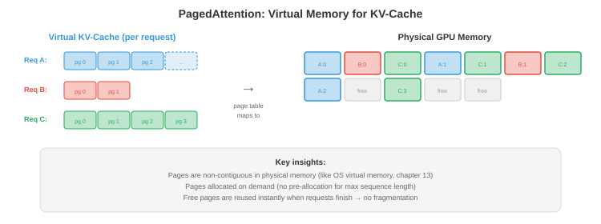

# 服务与批处理

*向数千并发用户提供LLM服务需要的不只是加载模型和运行推理。本文涵盖预填充-解码分离、连续批处理、PagedAttention和vLLM、调度策略、分离式服务、多模型和LoRA服务，以及关键指标*

- 单个LLM推理请求很简单：输入token，生成输出token。但要向10,000个并发用户提供低延迟、高吞吐量的LLM服务，这是一个系统工程问题。朴素方法（一次处理一个请求）浪费了90%以上的GPU容量。智能批处理和调度可以在不增加硬件的情况下将吞吐量提高10-50倍。

## 预填充 vs 解码：两个截然不同的阶段

- LLM推理有两个不同的阶段，具有根本不同的计算特征：

- **预填充**（提示处理）：同时处理所有输入token。这是一个单次大规模矩阵乘法：$O(\text{prompt\_length} \times d_{\text{model}}^2)$。提示可以并行处理（所有token都已知）。预填充是**计算受限**的：GPU的ALU是瓶颈。

- **解码**（token生成）：自回归地一次生成一个token。每个新token需要通过KV缓存关注所有先前的token。解码是**内存带宽受限**的：GPU大部分时间花在从内存加载模型权重和KV缓存上，而不是计算。每个解码步骤只产生一个token，但必须加载整个模型（70B FP16模型约140 GB）。

- 含义：

| | 预填充 | 解码 |
|--|---------|--------|
| 处理的token | 一次性全部（并行） | 一次一个（顺序） |
| 瓶颈 | 计算（FLOPS） | 内存带宽 |
| 算术强度 | 高 | 非常低 |
| GPU利用率 | 高（50-80%） | 低（1-10%），无批处理时 |
| 延迟指标 | **首token时间（TTFT）** | **每输出token时间（TPOT）** |

- TTFT影响用户体验（多久直到响应开始流式传输）。TPOT决定感知的生成速度。用户可以容忍较高的TTFT（1-5秒），但期望快速的TPOT（对话应用每token 30-100毫秒）。

## 静态批处理（朴素方法）

- 最简单的批处理：收集$B$个请求，填充到相同长度，作为单个批次处理。

- **问题1**：请求有不同的提示长度，并生成不同数量的输出token。短请求提前完成，但必须等待批次中最长的请求完成后才能开始下一个批次。GPU在为剩余的一个长请求生成token时处于空闲状态。

- **问题2**：填充浪费计算。如果最长提示是2000个token，最短是50个，批次被填充到2000。GPU为短请求处理了1950个填充token——纯属浪费。


## 连续批处理

- **连续批处理**（也称为迭代级批处理）通过在单个解码步骤的粒度上操作来解决这两个问题，而不是整个请求。

- 在每个解码步骤：
    1. 所有进行中的请求并行生成一个token（作为一个批次）。
    2. 完成的请求（生成EOS token）立即从批次中**移除**。
    3. 队列中的新请求立即**插入**到释放的槽位中。

- 批次大小每步动态变化。GPU从不等候落后者，也没有浪费的填充（每个请求只使用它需要的槽位）。

- **影响**：连续批处理通常比静态批处理提高吞吐量2-10倍，模型质量不变且延迟无明显增加。

## PagedAttention和vLLM

- KV缓存造成了一个内存管理噩梦。每个请求都有一个随着每个生成的token而增长的KV缓存。不同请求处于不同阶段（不同缓存大小）。为每个请求分配连续内存浪费空间（必须为最大可能长度分配，即使请求只生成几个token）。



- **PagedAttention**（Kwon等人，2023）将操作系统虚拟内存的概念（第13章）应用于KV缓存。缓存被划分为固定大小的**页**（token位置的块）。页按需分配，在物理GPU内存中可以是非连续的。

- 优势：
    - **无碎片**：页大小统一，因此请求之间没有浪费内存的"空洞"。
    - **惰性分配**：仅在token实际生成时分配内存，而不是预分配最大长度。
    - **写时复制**：共享共同前缀（例如系统提示）的请求共享相同的KV缓存页。仅当请求分叉时才复制页。

- **vLLM**是基于PagedAttention构建的推理引擎。通过几乎消除KV缓存内存浪费，它实现了比静态分配服务（如没有分页注意力的HuggingFace text-generation-inference）高2-4倍的吞吐量。

## 调度策略

- 当多个请求在等待且GPU只能处理有限批次时，**调度**决定服务哪些请求：

- **先来先服务（FCFS）**：按到达顺序处理请求。简单但不公平：一个提交10K-token生成的用户会阻塞所有后面的用户。

- **最短作业优先（SJF）**：处理最先完成的请求。最小化平均延迟，但惩罚长时间运行的请求（它们可能被饿死）。在实践中，估计输出长度未知，因此SJF使用启发式方法（提示长度、用户历史）。

- **抢占**：如果高优先级请求到达，暂停低优先级的进行中请求（将其KV缓存交换到CPU内存或SSD），服务高优先级请求，然后恢复暂停的请求。vLLM支持此功能。

- **基于优先级**：为用户或请求类型分配优先级。实时交互查询比批处理作业获得更高优先级。结合抢占，这确保高优先级流量的延迟SLO。

- **Token预算**：限制活跃批次中的总token数。这防止少量长请求独占GPU内存并饿死新请求。

## 分离式服务

- 预填充和解码具有相反的计算特征。在同一GPU上运行两者意味着GPU在计算受限（预填充）和内存带宽受限（解码）之间交替，从未充分利用任一资源。

- **分离式服务**将它们分开：
    - **预填充节点**：为计算优化的GPU（高FLOPS，可能内存较少）。处理所有传入提示。
    - **解码节点**：为内存带宽优化的GPU（大KV缓存容量，高内存带宽）。处理所有token生成。

- 预填充节点计算初始KV缓存并通过NVLink或网络将其发送到解码节点。解码节点使用接收到的缓存生成token。

- 这是**Mooncake**（月之暗面）的架构，并正在被多个LLM服务团队探索。好处：每个GPU类型与其工作负载特征匹配，提高整体利用率。

## 多模型和LoRA服务

- 在生产中，你通常服务多个模型（不同层级的模型大小不同，不同任务的微调变体不同）。

- **模型复用**：在同一GPU上加载多个模型，将请求路由到相应模型。GPU内存共享：一个40 GB GPU可能同时持有一个13B模型（26 GB）和一个7B模型（14 GB）。

- **LoRA服务**：不是部署单独的微调模型，而是部署一个基础模型并带有多个**LoRA适配器**（第6章）。每个适配器增加<1%的参数。请求在推理时路由到相应的适配器。

- **S-LoRA**（Sheng等人，2023）：从一个基础模型服务数千个LoRA适配器。适配器存储在CPU上，按需分页到GPU内存。基础模型的KV缓存和权重被共享；只有小的LoRA矩阵因请求而异。

- **Punica**（Chen等人，2023）：通过使用自定义CUDA内核在同一批次中为不同请求应用不同的LoRA矩阵，跨不同LoRA适配器对请求进行批处理。这避免了每个请求切换适配器的开销。

## 受限和引导生成

- 许多应用需要LLM以特定格式产生输出：有效的JSON、SQL查询、特定语言的代码或遵循模式的响应。**受限生成**保证输出符合语法或模式。

- **语法受限解码**：在每个解码步骤，屏蔽会违反语法的token。如果到目前为止的输出是`{"name": "Alice", "age":`且语法要求接下来是整数，则屏蔽除数字外的所有token。LLM的概率分布在有效token上重新归一化。

- **Outlines**（Willard & Louf，2023）：将JSON模式或正则表达式编译成有限状态机（FSM）。在每个解码步骤，FSM确定哪些token是有效的后续。无效token获得概率0。这保证了100%的模式合规，零重试。

- **SGLang**原生集成受限生成：你用Python指定输出结构，引擎高效处理token掩码和缓存。这与RadixAttention（前缀缓存）结合，使得结构化输出重用缓存的公共前缀。

- **为什么重要**：没有受限生成，你自由生成然后解析输出，失败时重试。对于复杂JSON模式，重试率通常为10-30%，浪费计算。受限生成完全消除了重试。

## 请求路由

- 并非每个查询都需要最大的模型。**请求路由**根据估计的难度将查询定向到不同的模型：

- **级联**：先尝试小模型。如果小模型的置信度低于阈值（例如，top token的softmax概率<0.8），则升级到更大的模型。简单查询（80%+的流量）由小模型廉价服务；只有困难查询使用昂贵模型。

- **学习型路由**：训练一个轻量级分类器（或使用小模型的困惑度）来预测查询需要哪个模型层级。将"2+2等于多少？"路由到3B模型，将"解释量子纠缠的数学基础"路由到70B模型。

- **影响**：如果80%的查询可以由成本低10倍的模型处理，平均每查询成本下降约70%。这是多模型部署中影响最大的成本优化之一。

- **设备端+云混合路由**：**Cactus**（[github.com/cactus-compute/cactus](https://github.com/cactus-compute/cactus)）在设备级别实现请求路由。它通过自定义ARM SIMD内核在设备端（手机、笔记本电脑、可穿戴设备）运行小模型，并在本地模型置信度低或查询超出设备能力时自动路由到云端模型。应用为两条路径使用OpenAI兼容API——路由是透明的。这是在基础设施级别的级联：第一层是免费的（设备端），第二层花钱（云API）。对于大多数查询简单的应用（助手问答、自动补全、转录），设备端处理覆盖70-90%的流量，边际成本为零。

## 推理指标

- 正确的指标取决于用例：

| 指标 | 测量内容 | 目标（对话式） | 目标（批处理） |
|--------|-----------------|------------------------|-----------------|
| **TTFT** | 首token时间 | <1 s | 不太重要 |
| **TPOT** | 每输出token时间 | <100 ms | 不太重要 |
| **吞吐量** | token/秒（总计） | 不太重要 | 最大化 |
| **p99延迟** | 最差的1%请求 | <5 s | <30 s |
| **每token成本** | $/100万token | 最小化 | 最小化 |
| **SLO合规率** | 满足延迟目标的请求百分比 | >99% | >95% |

- **TTFT vs TPOT权衡**：激进的批处理增加吞吐量（总token数/秒更多），但增加TPOT（每个token耗时更长，因为GPU处理更多请求）。调度策略必须平衡吞吐量（收入）与延迟（用户体验）。

- **每token成本**是生产的最终指标。它结合了硬件成本（GPU租金）、吞吐量（token/秒）和利用率。运行在50% GPU利用率的系统比100%利用率的系统每token成本高2倍。这就是批处理、调度和PagedAttention如此重要的原因——它们提高了利用率。

## 编程任务（使用CoLab或notebook）

1. 模拟连续vs静态批处理并测量吞吐量差异。
```python
import random
import time

def simulate_static_batching(requests, batch_size=8):
    """在固定批次中处理请求。等待所有完成。"""
    total_tokens = 0
    total_time = 0

    for i in range(0, len(requests), batch_size):
        batch = requests[i:i + batch_size]
        max_len = max(r['output_len'] for r in batch)
        # 批次中所有请求耗时等于最长请求
        batch_time = max_len * 0.01  # 每token 10ms
        total_time += batch_time
        total_tokens += sum(r['output_len'] for r in batch)

    return total_tokens / total_time  # token/秒

def simulate_continuous_batching(requests, max_batch=8):
    """使用连续批处理处理。移除完成请求，添加新请求。"""
    total_tokens = 0
    total_time = 0
    active = []
    queue = list(requests)

    while active or queue:
        # 填充批次
        while len(active) < max_batch and queue:
            active.append({'remaining': queue.pop(0)['output_len']})

        if not active:
            break

        # 一个解码步骤：所有活跃请求生成1个token
        for req in active:
            req['remaining'] -= 1
        total_tokens += len(active)
        total_time += 0.01  # 每步10ms

        # 移除完成的请求
        active = [r for r in active if r['remaining'] > 0]

    return total_tokens / total_time

# 生成具有不同输出长度的请求
random.seed(42)
requests = [{'output_len': random.randint(10, 500)} for _ in range(100)]

static_tps = simulate_static_batching(requests)
continuous_tps = simulate_continuous_batching(requests)

print(f"静态批处理:     {static_tps:.0f} tokens/s")
print(f"连续批处理: {continuous_tps:.0f} tokens/s")
print(f"加速比: {continuous_tps / static_tps:.1f}x")
```

2. 计算PagedAttention的KV缓存内存节省。比较预分配（最坏情况）vs分页（实际使用）。
```python
def paged_vs_preallocated(n_requests, max_seq_len, avg_seq_len, page_size, kv_per_token_bytes):
    """比较内存使用：预分配vs分页KV缓存。"""
    # 预分配：每个请求获得max_seq_len个槽位
    preallocated_gb = n_requests * max_seq_len * kv_per_token_bytes / 1e9

    # 分页：只分配使用的部分（按页粒度）
    import math
    avg_pages = math.ceil(avg_seq_len / page_size)
    paged_gb = n_requests * avg_pages * page_size * kv_per_token_bytes / 1e9

    waste_preallocated = (max_seq_len - avg_seq_len) / max_seq_len
    waste_paged = (avg_pages * page_size - avg_seq_len) / (avg_pages * page_size)

    print(f"请求数: {n_requests}, 最大序列: {max_seq_len}, 平均序列: {avg_seq_len}")
    print(f"  预分配: {preallocated_gb:.1f} GB (浪费: {waste_preallocated:.0%})")
    print(f"  分页:        {paged_gb:.1f} GB (浪费: {waste_paged:.0%})")
    print(f"  节省:      {preallocated_gb - paged_gb:.1f} GB ({preallocated_gb/paged_gb:.1f}x)")
    print()

# Llama-70B：每层每token约1.3 KB，80层 = 每token约100 KB总计
kv_bytes = 100_000

# 场景1：短请求，大最大值
paged_vs_preallocated(256, max_seq_len=4096, avg_seq_len=256, page_size=16, kv_per_token_bytes=kv_bytes)

# 场景2：不同长度
paged_vs_preallocated(256, max_seq_len=8192, avg_seq_len=1024, page_size=16, kv_per_token_bytes=kv_bytes)

# 场景3：长上下文
paged_vs_preallocated(64, max_seq_len=131072, avg_seq_len=16000, page_size=16, kv_per_token_bytes=kv_bytes)
```
