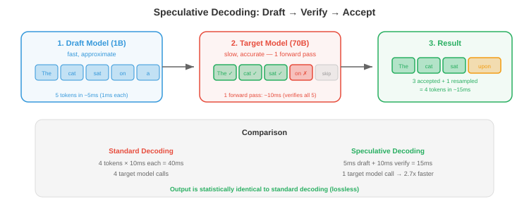

# 扩缩与部署

*向数百万用户提供大模型服务需要跨多个GPU分布推理、在需要之前预测token、缓存共享上下文以及选择合适的框架。本文涵盖推理时的并行性、推测性解码、前缀缓存、推理框架、成本优化和监控*

- 单个H100 GPU服务一个70B模型可以处理约100个并发用户，交互延迟可接受。服务1000万用户需要100,000个GPU——云计算每年花费约30亿美元。每一个百分点的效率提升就能节省数千万美元。这就是推理优化不是学术问题的原因：它直接决定AI产品的经济性。

## 推理时的模型并行

- 当模型太大无法装入单张GPU时，必须跨多个GPU拆分。训练时的并行策略（第6章）在推理时适用，但权衡不同。

### 张量并行

- **张量并行**（Megatron风格，第6章）跨GPU拆分单个权重矩阵。对于线性层$Y = XW$，权重矩阵$W$跨$N$个GPU按列拆分。每个GPU计算部分结果，然后all-reduce聚合：

$$W = [W_1 | W_2 | \cdots | W_N], \quad Y_i = X W_i, \quad Y = \text{concat}(Y_1, \ldots, Y_N)$$

- 在推理时，张量并行是模型无法装入单张GPU时的默认选择。FP16的70B模型需要140 GB——跨2张80 GB GPU使用张量并行拆分。

- **延迟影响**：张量并行每层增加一个all-reduce通信步骤。在NVLink（900 GB/s）上，每层增加约0.1 ms。在PCIe（32 GB/s）上，每层增加约3 ms。对于80层的70B模型在2张GPU上：NVLink总增加约8 ms，PCIe总增加约240 ms。这就是NVLink对多GPU推理至关重要的原因。

### 流水线并行

- **流水线并行**将不同的层分配给不同的GPU。GPU 1处理第0-39层，GPU 2处理第40-79层。token顺序流过流水线。

- 在推理时，流水线并行的延迟高于张量并行（每个token必须遍历整个流水线），但通信开销更低（只有激活值在GPU之间传递，无需all-reduce）。当GPU通过慢速互连（不同节点，无NVLink）连接时，更倾向于使用流水线并行。

### 序列并行

- 对于非常长的序列，即使模型本身适合，KV缓存本身可能无法装入单张GPU。**序列并行**将KV缓存分片到多个GPU上：每个GPU存储序列缓存键和值的一部分。

- 在注意力期间，每个GPU在其缓存的段上计算部分注意力分数，然后通过规约合并结果。这用于长上下文推理（128K+ token），其中KV缓存超过单GPU内存。

## 推测性解码

- **推测性解码**是影响最大的LLM推理优化之一。其洞察：解码速度慢是因为一次只生成一个token，每个token需要大模型的完整前向传播。但小模型可以更快地生成候选token，而大模型可以**验证**多个候选token。



- **算法**：
    1. **草稿模型**（小型、快速——例如1B参数）自回归生成$k$个候选token。
    2. **目标模型**（大型、准确——例如70B）对整个草稿序列运行一次前向传播，计算每个候选token的概率。
    3. 如果目标模型同意（该token的概率足够高），每个候选被**接受**。被拒绝的候选从目标模型的分布中重新采样。
    4. 平均每个验证步骤接受多个token，加速比与接受率成正比。

$$\text{加速比} \approx \frac{k \times \text{acceptance\_rate}}{\text{cost\_ratio}} \approx 2\text{-}3\times$$

- **为什么无质量损失**：拒绝采样方案保证输出分布与目标模型完全匹配。推测性解码是无损的——输出在统计上与单独运行目标模型相同，只是更快。

- **变体**：
    - **Medusa**（Cai等人，2024）：不是独立的草稿模型，而是向目标模型添加多个轻量级"头"，同时预测多个未来token。无需独立模型。
    - **EAGLE**（Li等人，2024）：训练一个使用目标模型隐藏状态预测未来token的轻量级草稿头。接受率高于独立的草稿模型。
    - **自推测性解码**：目标模型本身使用提前退出生成草稿（仅运行前几层作为草稿，然后用完整模型验证）。
    - **并行解码**：并行生成多个延续（候选树）并一次性验证整棵树。吞吐量更高，但分支KV缓存使用更多内存。

## 前缀缓存

- 许多请求共享共同的前缀：系统提示、few-shot示例或常见查询模式。**前缀缓存**存储这些前缀的KV缓存并在请求之间重用。

- **系统提示缓存**：如果每个请求都以相同的2000-token系统提示开始，这2000个token的KV缓存被计算一次，并在所有请求之间共享。对于80层的70B模型，每次请求节省约200 MB。

- **基数树缓存**（SGLang）：将缓存的前缀组织在基数树（trie）中。当新请求到达时，找到最长的缓存前缀匹配，并从那里开始生成，跳过匹配前缀的计算。

- **影响**：对于具有长共享前缀的应用（带系统提示的聊天机器人、具有常见检索段落的RAG），前缀缓存将TTFT降低50-90%，并节省相应的GPU计算。

## KV缓存驱逐

- 除了量化KV缓存（文件01）和使用GQA/MLA减小其大小（文件02）之外，**KV缓存驱逐**策略选择性地移除不太可能在未来被关注的缓存token。

- **H2O**（重要token识别器，Zhang等人，2023）观察到注意力分数遵循幂律：一小部分token（"重要token"）获得大部分注意力，而大多数token获得的注意力可以忽略不计。H2O保留：

    1. **最近token**（最后$w$个token的滑动窗口，类似StreamingLLM）。
    2. **重要token**（在所有过去解码步骤中累积注意力分数最高的前$k$个token）。

- 既不是最近也不是重要token的token被驱逐。这保持固定大小的KV缓存，同时保留实际影响生成的token。H2O仅使用20%的内存就实现了接近完整KV缓存的质量。

- **Scissorhands**（Liu等人，2023）采用类似方法，但使用更复杂的度量：在当前**步骤**中获得高注意力的token被保留，而已经$T$步没有被关注的token被驱逐。这适应了生成过程中注意力模式的变化。

- **动态驱逐+StreamingLLM**：结合注意力汇聚点（永久保留前几个token）和动态驱逐（保留最近+重要token）。这是最内存高效的方法，适用于非常长的生成，实现了无限长度生成，质量下降有限。

- 所有驱逐方法的核心洞察：LLM注意力在实践中是**稀疏的**——尽管架构会对所有缓存的token计算注意力，但实际注意力权重集中在小子集上。驱逐其余部分对输出质量影响极小。

## 推理框架

- LLM服务生态已收敛到几个主要框架：

| 框架 | 优势 | 最适合 |
|-----------|-----------|----------|
| **vLLM** | PagedAttention、连续批处理、高吞吐量 | 通用LLM服务，最高吞吐量 |
| **TensorRT-LLM** | NVIDIA优化内核、FP8、飞行中批处理 | NVIDIA GPU上的最大性能 |
| **SGLang** | 前缀缓存（RadixAttention）、快速结构化生成 | 具有共享前缀的应用，受限输出 |
| **llama.cpp** | CPU/Metal/CUDA/Vulkan、GGUF量化、可移植 | 消费级硬件，设备端推理 |
| **TGI**（HuggingFace） | 简单API，易于部署，模型中心集成 | 快速部署，HuggingFace生态 |
| **Ollama** | 一键下载和提供服务 | 个人使用，本地开发 |
| **ExLlamaV2** | 极致量化优化（EXL2格式） | 内存受限的GPU推理 |

- **vLLM**是生产级LLM服务的默认选择。它支持连续批处理、PagedAttention、张量并行、推测性解码、LoRA服务和大多数开源模型。

- **TensorRT-LLM**在NVIDIA硬件上实现最高的原始性能（在相同GPU上比vLLM快10-30%），但灵活性较低且更难以定制。

- **SGLang**在应用具有结构化输出（JSON、特定格式的代码）或共享前缀时表现出色，这得益于其基数注意力缓存和受限解码引擎。

## 成本优化

- 在规模上，推理成本主导ML预算。降低成本的策略：

- **合理选择GPU**：并非每个模型都需要H100。量化的7B模型在A10G（约$1/小时）上运行良好，而不是H100（约$8/小时）。匹配GPU到工作负载。

- **竞价实例**：云提供商提供未使用的GPU容量，折扣60-90%（AWS Spot、GCP Preemptible）。竞价实例可能被中断，因此适用于批处理推理而不是延迟关键型服务。结合抢占处理（保存状态，在新实例上恢复），竞价实例也可以服务交互式流量。

- **自动扩缩**：根据流量扩展GPU数量。高峰期扩展，夜间缩减。Kubernetes HPA（水平Pod自动扩缩器）或云原生自动扩缩（AWS SageMaker、GCP Vertex AI）处理此功能。

- **批处理+利用率**：30%和90% GPU利用率之间的差异是每token成本3倍。连续批处理、智能调度和PagedAttention都提高了利用率。

- **量化**：INT4 vs FP16是4倍更少内存 → 适合更小的GPU → 成本降低2-4倍。此外，更多请求适合同一批次 → 更高吞吐量 → 更低每token成本。

- **每token成本基准**（近似值，2026年）：

| 配置 | 每100万token成本 |
|-------|-------------------|
| GPT-4o API | $2.50 |
| Claude 3.5 Sonnet API | $3.00 |
| Llama-70B on H100（vLLM，FP16） | $0.50 |
| Llama-70B on H100（TRT-LLM，INT8） | $0.25 |
| Llama-8B on A10G（vLLM，INT4） | $0.05 |
| Llama-3B 设备端（llama.cpp） | $0（硬件成本摊销） |

## 监控

- 生产推理需要持续监控，以便在用户受到影响之前发现降级：

- **延迟监控**：跟踪TTFT和TPOT的p50、p95和p99。设置告警，当p99超过SLO时触发。p99的尖峰通常指示：KV缓存内存压力（抖动）、长时间运行的请求垄断批次、或GPU热节流。

- **吞吐量监控**：跟踪每GPU每秒token数。下降指示：批次效率降低（许多短请求→批次利用率低）、序列长度增加（每个请求更多KV缓存内存）、或硬件问题（GPU处于ECC纠错模式，运行更慢）。

- **GPU利用率**：跟踪SM占用率、内存利用率和内存带宽。低SM占用率+高内存利用率=内存受限（需要更多带宽或量化）。高SM占用率+低内存利用率=计算受限（需要更多FLOPS或更小模型）。

- **模型质量监控**：跟踪每请求指标（响应长度、保留集上的困惑度、用户反馈信号）。模型质量可能因以下原因降级：数据漂移（传入请求的分布变化）、KV缓存量化误差在长对话中累积、或服务流水线中的错误。

- **成本监控**：跟踪每模型每GPU类型每token成本。如果成本增加而吞吐量没有增加，调查效率回归（新模型版本内存使用更高、批次配置次优、或GPU利用不足）。

- **工具**：Prometheus + Grafana（第15章）用于基础设施指标，vLLM/TRT-LLM的内置指标端点，以及用于模型级指标的自定义日志记录。

## 编程任务（使用CoLab或notebook）

1. 模拟推测性解码。使用快速的"草稿"函数和慢速的"目标"函数，测量一次生成和验证多个token的加速比。
```python
import random
import time

def target_model(tokens):
    """慢但准确的模型。返回每个候选token的概率。"""
    time.sleep(0.01)  # 模拟每次前向传播10ms
    # 用于模拟：接受偶数token
    return [0.9 if t % 2 == 0 else 0.1 for t in tokens]

def draft_model():
    """快但近似的模型。生成一个候选token。"""
    time.sleep(0.001)  # 模拟每token 1ms
    return random.randint(0, 9)

def standard_decoding(n_tokens):
    """一次生成一个token，使用目标模型。"""
    tokens = []
    for _ in range(n_tokens):
        time.sleep(0.01)  # 目标模型生成1个token
        tokens.append(random.randint(0, 9))
    return tokens

def speculative_decoding(n_tokens, k=4):
    """生成k个草稿token，用目标模型验证，接受/拒绝。"""
    tokens = []
    total_target_calls = 0

    while len(tokens) < n_tokens:
        # 草稿：快速生成k个候选
        candidates = [draft_model() for _ in range(k)]

        # 验证：一次目标模型调用验证所有k个候选
        probs = target_model(candidates)
        total_target_calls += 1

        # 接受token，直到一个被拒绝
        for i, (tok, prob) in enumerate(zip(candidates, probs)):
            if random.random() < prob:
                tokens.append(tok)
                if len(tokens) >= n_tokens:
                    break
            else:
                # 从目标分布重新采样
                tokens.append(tok + 1)  # 简化重新采样
                break

    return tokens, total_target_calls

n = 50

start = time.time()
_ = standard_decoding(n)
standard_time = time.time() - start

start = time.time()
_, target_calls = speculative_decoding(n, k=5)
spec_time = time.time() - start

print(f"标准:    {standard_time:.2f}s ({n} 次目标调用)")
print(f"推测性: {spec_time:.2f}s ({target_calls} 次目标调用)")
print(f"加速比:     {standard_time / spec_time:.1f}x")
```

2. 估计应用于LLM服务部署的不同优化策略的成本节省。
```python
def serving_cost_analysis(
    model_name, params_B, precision_bits,
    gpu_name, gpu_mem_gb, gpu_cost_per_hr,
    target_throughput_tps,
):
    """估计LLM部署的服务成本。"""
    model_size_gb = params_B * 1e9 * precision_bits / 8 / 1e9
    gpus_for_model = max(1, int((model_size_gb * 1.2) / gpu_mem_gb + 0.99))  # 1.2x用于KV缓存

    # 粗略吞吐量估计（内存带宽受限）
    tokens_per_gpu = 500 / (params_B * precision_bits / 16)  # 归一化到7B FP16的500 tok/s
    total_throughput = tokens_per_gpu * gpus_for_model

    replicas = max(1, int(target_throughput_tps / total_throughput + 0.99))
    total_gpus = gpus_for_model * replicas
    cost_per_hr = total_gpus * gpu_cost_per_hr
    cost_per_1M_tokens = cost_per_hr / (total_throughput * replicas * 3600 / 1e6)

    print(f"{model_name} @ {precision_bits}-位 在 {gpu_name} 上:")
    print(f"  模型大小: {model_size_gb:.0f} GB → {gpus_for_model} GPU(s)/副本")
    print(f"  吞吐量: {total_throughput:.0f} tok/s/副本")
    print(f"  需达到{target_throughput_tps} tok/s的副本数: {replicas}")
    print(f"  总GPU数: {total_gpus}")
    print(f"  成本: ${cost_per_hr:.0f}/小时, ${cost_per_1M_tokens:.2f}/100万token")
    print()

print("=== 成本比较 ===\n")

# 基线：H100上的FP16
serving_cost_analysis("Llama-70B", 70, 16, "H100", 80, 8.0, 1000)

# 量化后：H100上的INT8
serving_cost_analysis("Llama-70B", 70, 8, "H100", 80, 8.0, 1000)

# 量化后：A100上的INT4
serving_cost_analysis("Llama-70B", 70, 4, "A100", 80, 4.0, 1000)

# 小模型：A10G上的8B
serving_cost_analysis("Llama-8B", 8, 4, "A10G", 24, 1.0, 1000)
```
