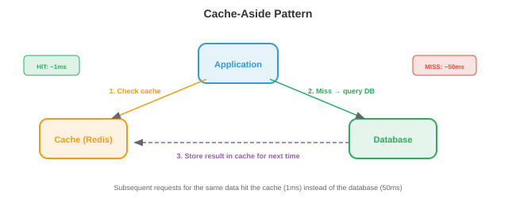
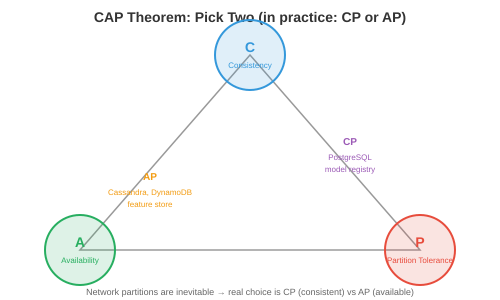

# 系统设计基础

*系统设计是构建可在大规模下可靠运行的软件的方法。本文件涵盖客户端-服务器架构、网络协议、DNS、代理、负载均衡、缓存、数据库、消息队列、一致性模型和弹性模式*

- 生产环境中的每一个ML系统都是一个分布式系统。推荐引擎不仅仅是模型——它是一个API服务器、一个特征存储、一个模型注册表、一个缓存层、一个消息队列和一个监控栈，所有这些通过网络进行通信。理解系统设计是区分"我训练了一个模型"和"我构建了一个产品"的关键。
- 顶级科技公司（Google、Meta、Amazon、OpenAI）的系统设计面试会测试你是否能设计这些系统。本章为你提供基础构建模块（本文件）、云基础设施（文件02）、扩展模式（文件03）、ML特定设计（文件04）和实操示例（文件05）。

## 客户端-服务器架构

- 基本模式：**客户端**发送请求，**服务器**处理请求并返回响应。你的浏览器（客户端）向google.com（服务器）发送HTTP请求，服务器返回HTML。
- **请求-响应模式**：同步。客户端等待响应。简单但会产生瓶颈：客户端在等待时空闲，服务器必须在处理完当前请求后才能继续。
- **无状态服务器**：服务器不记住先前的请求。每个请求包含处理它所需的所有信息。这使得扩展变得容易：任何服务器都可以处理任何请求，因此你可以在负载均衡器后面添加更多服务器。
- **有状态服务器**：服务器在请求之间维护状态（例如，用户会话）。扩展更困难，因为来自同一用户的请求必须发送到同一台服务器（会话亲和性）。现代系统通过将状态存储在数据库或缓存（Redis）中来避免服务器端状态。

## 网络协议

- 我们在第13章（TCP/IP层、套接字）中介绍了网络知识。这里我们关注系统设计中使用的应用层协议：
- **HTTP/HTTPS**：Web和大多数API的协议。请求方法：GET（读取）、POST（创建/预测）、PUT（更新）、DELETE（删除）。HTTPS增加了TLS加密（第13章安全部分）。REST API（第15章文件03）基于HTTP构建。
- **WebSocket**：客户端和服务器之间的持久双向连接。与HTTP（请求→响应→连接关闭）不同，WebSocket保持连接打开，用于实时流式传输。用于：LLM令牌流式传输（生成时发送令牌）、实时仪表盘、聊天应用。
- **gRPC**：Google的RPC框架。使用Protocol Buffers（二进制序列化，比JSON小约10倍且更快），基于HTTP/2。支持流式传输（服务端、客户端、双向）。用于注重性能的内部服务间通信。Triton推理服务器（第15章）和TensorFlow Serving使用gRPC。
- **Protocol Buffers**：在`.proto`文件中定义消息模式：

```protobuf
message PredictRequest {
    repeated float features = 1;
    string model_version = 2;
}

message PredictResponse {
    float prediction = 1;
    float confidence = 2;
}

service ModelService {
    rpc Predict(PredictRequest) returns (PredictResponse);
}
```

- 该模式被编译成任何语言（Python、C++、Go、Java）的客户端和服务端代码。类型安全、向后兼容性和高性能都自然具备。

## DNS

- **DNS**（域名系统）将人类可读的名称转换为IP地址（第13章）。对于系统设计，DNS还提供：
- **通过DNS的负载均衡**：为同一域名返回不同的IP地址，将流量分布到多个服务器。简单但粒度较粗（DNS结果会被缓存数分钟到数小时，因此流量不会快速重新平衡）。
- **地理路由**：根据客户端位置返回最近数据中心的IP。东京的用户获得日本数据中心；伦敦的用户获得欧洲数据中心。
- **故障转移**：如果服务器宕机，DNS停止返回其IP。新客户端连接到健康的服务器。但缓存的DNS条目意味着某些客户端会继续访问已宕机的服务器持续数分钟（TTL问题）。

## 代理

- **代理**是客户端和服务器之间的中介：
- **反向代理**（在服务器前面）：客户端连接到代理，代理将请求转发给后端服务器。客户端不知道哪个服务器处理了请求。**Nginx**和**HAProxy**是标准的反向代理。它们提供：负载均衡（分发请求）、SSL终止（在代理处解密HTTPS，向后端发送明文HTTP）、缓存、速率限制和压缩。
- **API网关**：一种专门用于API的反向代理。处理身份验证、速率限制、请求路由（不同路径→不同服务）和API版本管理。**Kong**、**AWS API Gateway**和**Envoy**是常见选择。
- 对于ML服务：API网关位于模型服务器前面。它验证API密钥、对免费用户进行速率限制、将`/v1/predict`路由到模型服务器A、将`/v2/predict`路由到模型服务器B，并收集使用指标。

## 负载均衡

- 当你拥有多台服务器时，**负载均衡器**将传入请求分布到它们之间。


- **算法**：
    - **轮询**：按顺序发送请求到服务器（1, 2, 3, 1, 2, 3...）。简单、公平，但不考虑服务器负载。
    - **最少连接**：发送到活动连接最少的服务器。适用于处理时间可变的请求（有些LLM请求生成10个令牌，有些生成1000个）。
    - **加权轮询**：容量更大的服务器获得更多请求。拥有80 GB GPU内存的服务器处理的请求量是40 GB的两倍。
    - **一致性哈希**：对请求键进行哈希运算，映射到特定服务器。相同的键始终发送到相同的服务器。适用于：缓存（同一用户的请求命中同一缓存）、会话亲和性和前缀缓存（第17章：具有相同系统提示词的请求发送到具有该提示词KV缓存的服务器）。
- **L4 vs L7负载均衡**：
    - **L4**（传输层）：基于IP和端口路由。快速但无法检查请求内容。
    - **L7**（应用层）：基于HTTP路径、标头或正文内容路由。可以将`/api/chat`路由到聊天服务器，将`/api/embed`路由到嵌入服务器。较慢但更灵活。

## 缓存

- **缓存**将频繁访问的数据存储在快速存储层（内存）中，以避免重新计算或重新获取。



- **缓存模式**：
    - **缓存旁路**（惰性加载）：应用程序先检查缓存。未命中时，从数据库获取、存储到缓存并返回。最常见的模式。
    - **直写**：每次写入同时写入缓存和数据库。确保缓存始终是最新的，但会减慢写入速度。
    - **回写**：写入只进入缓存；缓存异步刷新到数据库。写入最快，但若缓存刷新前崩溃则有数据丢失风险。
- **驱逐策略**（当缓存满时）：
    - **LRU**（最近最少使用）：驱逐最长时间未被访问的条目。最常见的策略。
    - **LFU**（最不频繁使用）：驱逐访问次数最少的条目。当某些条目持续受欢迎时效果更好。
    - **TTL**（生存时间）：条目在固定时长后过期。用于会过时的数据（模型预测缓存5分钟，特征值缓存1小时）。
- **CDN**（内容分发网络）：用于静态内容（图片、JavaScript、CSS）的全球分布式缓存。遍布100多个地点的服务器从离用户最近的位置提供缓存内容。对于ML：模型权重可以缓存在CDN上以实现快速下载。
- **Redis**：标准的键值内存缓存/数据库。支持字符串、列表、集合、有序集合、哈希和流。亚毫秒级延迟。用于：缓存模型预测、存储会话数据、速率限制（统计每个用户每分钟的请求数）和实时特征服务。
- 对于ML服务：缓存重复输入的预测结果。如果很多用户问"法国的首都是什么？"，计算一次答案然后提供缓存结果。对于聊天机器人工作负载，缓存命中率通常为20-40%，按比例降低GPU成本。

## 数据库

### SQL（关系型）

- **SQL数据库**（PostgreSQL、MySQL）以包含行和列的形式存储数据。表之间的关系通过外键表示。查询使用SQL。**ACID**保证：
    - **原子性**：事务要么完全完成，要么完全回滚。没有部分更新。
    - **一致性**：数据库从一个有效状态转换到另一个有效状态。约束条件（唯一键、外键）始终得到满足。
    - **隔离性**：并发事务不互相干扰。
    - **持久性**：已提交的数据在崩溃后仍然存在（在确认前写入磁盘）。
- SQL数据库擅长：具有关系的有结构数据、复杂查询（联接、聚合）、严格的一致性要求和数据完整性。

### NoSQL

- **NoSQL数据库**为了可扩展性和灵活性而牺牲了一些ACID保证：
    - **键值存储**（Redis、DynamoDB）：最简单的模型。按键快速查找。用于缓存、会话存储和特征存储。
    - **文档存储**（MongoDB、Firestore）：存储类似JSON的文档。灵活的模式（每个文档可以有不同字段）。用于用户资料、产品目录和配置。
    - **列族存储**（Cassandra、HBase）：针对写入密集型工作负载和时间序列数据进行了优化。用于事件日志、指标和分析。
    - **图数据库**（Neo4j）：存储节点和边。针对遍历查询进行了优化。用于社交网络、知识图谱和推荐系统。
    - **向量数据库**（Pinecone、Milvus、Weaviate、FAISS）：存储高维嵌入并支持近似最近邻（ANN）搜索。对于语义搜索、RAG（检索增强生成）和推荐系统至关重要。

### CAP定理

- 在分布式数据库中，最多只能满足三个属性中的两个：
    - **一致性**：每次读取都返回最新的写入。
    - **可用性**：每个请求都会收到响应（即使某些节点宕机）。
    - **分区容忍性**：系统在网络分区（节点无法通信）时仍能继续运行。



- 由于分布式系统中网络分区不可避免，真正的选择是**CP**（一致但在分区期间可能不可用——如PostgreSQL） vs **AP**（可用但在分区期间可能返回过期数据——如Cassandra、DynamoDB）。
- 对于ML：特征存储通常选择AP（稍微过期的特征值也比无法预测要好）。模型注册表选择CP（提供错误的模型版本是灾难性的）。

### 分片

- **分片**将数据库拆分到多台机器上。每个分片持有数据的一个子集。
- **哈希分片**：对键进行哈希运算以确定分片。`shard = hash(user_id) % num_shards`。分布均匀但不支持范围查询。
- **范围分片**：每个分片持有一个键范围（用户A-G在分片1，H-N在分片2）。支持范围查询但可能产生热点（如果很多用户名字以"S"开头）。
- **重新分片问题**：添加分片会使哈希映射失效。**一致性哈希**最小化数据移动：添加第n个分片时，只有约1/n的键需要移动。

### 数据库索引

- **索引**是一种加速查询的数据结构，代价是额外的存储空间和较慢的写入速度。没有索引时，查询会扫描每一行（$O(n)$）。有索引时，可以在$O(\log n)$时间内找到目标。
- **B树索引**（默认）：一种平衡树（第13章、第14章），其中每个节点包含多个键和指针。B树对缓存友好（宽节点适合缓存行）并支持范围查询（`WHERE age BETWEEN 20 AND 30`）。大多数SQL数据库使用B树。
- **哈希索引**：使用哈希函数将键映射到行位置。$O(1)$查找但不支持范围查询。用于精确匹配查找（`WHERE id = 12345`）。
- **复合索引**：对多个列的索引。`CREATE INDEX ON users(country, city)` 加速按国家或按国家+城市筛选的查询，但不能加速仅按城市的查询（最左边的列必须在查询中）。
- **权衡**：每个索引都会加速读取但减慢写入（每次插入/更新/删除都必须更新索引）并占用存储空间（每个索引约占表大小的10-30%）。不要索引所有内容——只索引你经常查询的列。
- **对于ML系统**：特征存储的在线数据库需要在实体键（user_id、item_id）上建立索引以实现快速特征查找。实验跟踪数据库需要在（experiment_id、metric_name）上建立索引以实现仪表盘查询。

### API设计

- 系统通过API进行通信。良好的API设计使系统可用、可进化和可调试：
- **REST约定**：使用名词表示资源（`/users`、`/models`），HTTP方法表示操作（GET=读取、POST=创建、PUT=更新、DELETE=删除），状态码表示结果（200=OK、201=已创建、400=错误请求、404=未找到、429=被限流、500=服务器错误）。
- **分页**：对于返回列表的端点，永远不要一次返回所有结果。使用基于游标的分页（`GET /items?cursor=abc&limit=50`）或基于偏移量的分页（`GET /items?offset=100&limit=50`）。对于大数据集，基于游标的分页更高效（基于偏移量的分页需要跳过行）。
- **版本管理**：在API路径前加上版本前缀（`/v1/predict`、`/v2/predict`）。这样可以在不破坏现有客户端的情况下演进API。客户端按照自己的节奏迁移到v2；v1被弃用但在流量下降之前不会删除。
- **错误响应**：返回结构化的错误信息：

```json
{
    "error": {
        "code": "INVALID_INPUT",
        "message": "特征'user_age'必须为正整数",
        "details": {"field": "user_age", "value": -5}
    }
}
```

## 消息队列

- **消息队列**将生产者（生成工作的服务）与消费者（处理工作的服务）解耦。生产者将消息发送到队列；消费者在就绪时拉取消息。
- **队列为什么重要**：没有队列时，如果消费者慢或宕机，生产者会被阻塞。有了队列，生产者发送后就无需等待；队列缓冲消息，直到消费者准备好。
- **Apache Kafka**：一个分布式、持久化、高吞吐量的消息队列。消息存储在**主题**中，每个主题跨多个代理分区。消费者从分区读取，跟踪其位置（**偏移量**）。Kafka保证分区内的顺序，并可重播消息（日志是持久化的）。
- **发布/订阅**：发布者将消息发送到主题；该主题的所有订阅者都会收到一份副本。用于事件驱动架构："新模型已部署"触发监控服务、A/B测试服务和日志服务同时响应。
- 对于ML：预测请求通过HTTP到达，放入Kafka队列，由GPU工作线程处理，结果通过回调或WebSocket返回。队列缓冲突发的流量，并确保即使GPU工作线程崩溃也不会丢失请求。

## 一致性模型

- 在分布式系统中，不同节点可能对数据有不同的视图。**一致性模型**定义了系统提供的保证：
- **强一致性**：写操作之后，所有后续读取（从任何节点）都能看到新值。易于推理但速度慢（需要在节点之间协调）。
- **最终一致性**：写操作之后，读取可能在某段时间内看到过期数据，但最终会看到新值。速度快（无需协调）但需要应用程序处理过期读取。
- **因果一致性**：如果操作A因果上先于B（例如，"写入X然后读取X"），系统保证B能看到A的结果。但不相关的操作可能以任何顺序被看到。
- **读写一致性**：用户始终能立即看到自己的写入，即使其他用户看到的是过期数据。大多数应用程序所需的最小一致性。

## 弹性模式

- **速率限制**：限制每个用户在时间窗口内的请求数。防止滥用并确保公平访问。使用Redis中的令牌桶或滑动窗口计数器实现。
- **断路器**：如果下游服务开始失败（错误率超过阈值），断路器"断开"并停止向其发送请求（立即返回回退响应）。超时后，"半开"并发送测试请求。如果测试成功，则"闭合"（恢复正常操作）。这防止了级联故障：如果特征存储宕机，模型服务器返回无特征的预测，而不是每次请求都超时。
- **背压**：当系统过载时，它向上游发出信号要求减速。与其接受请求然后失败，不如尽早拒绝多余的请求（返回429或503状态码）。客户端以指数退避重试。
- **指数退避重试**：如果请求失败，等待1秒后重试。如果再次失败，等待2秒。然后是4秒、8秒，依此类推。加入随机抖动以防止所有客户端同时重试（惊群问题）。
- **幂等性**：如果执行两次的效果与执行一次相同，则该操作是幂等的。`PUT /user/123 {"name": "Alice"}`是幂等的（将名称设置为"Alice"两次没问题）。`POST /payments`不是（支付两次很糟糕）。使操作幂等可确保重试是安全的。
