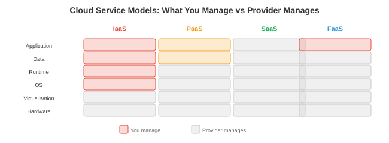

# 云计算

*云计算为ML工作负载提供按需基础设施，无需拥有硬件。本文件涵盖服务模型、主要云服务商、容器和Kubernetes、存储、云网络、无服务器计算、成本管理和基础设施即代码*

- 训练前沿模型需要数千个GPU持续数月。没有初创公司拥有这样的硬件。云计算让你按小时租赁，训练时扩展，推理时缩减，只为使用量付费。理解云基础设施对于任何在笔记本电脑之外构建ML系统的人来说都是必不可少的。

## 云服务模型



- 云服务按提供商管理程度的层叠划分：

| 模型 | 你管理 | 提供商管理 | 示例 |
|-------|-----------|-----------------|---------|
| **IaaS**（基础设施） | 操作系统、运行时、应用 | 硬件、虚拟化、网络 | AWS EC2、GCP Compute Engine |
| **PaaS**（平台） | 应用、数据 | 操作系统、运行时、扩展、修补 | AWS SageMaker、GCP Vertex AI |
| **SaaS**（软件） | 什么都不用管（只管用） | 一切 | OpenAI API、Weights & Biases |
| **FaaS**（函数） | 单个函数 | 其他所有 | AWS Lambda、GCP Cloud Functions |

- **对于ML**：大多数团队混合使用。IaaS用于自定义训练（完全控制GPU实例），PaaS用于托管训练和服务（SageMaker、Vertex AI处理编排），SaaS用于工具（W&B用于实验跟踪，OpenAI API用于基线比较）。

## 主要云服务商

### AWS（亚马逊云服务）

- 最大的云服务商（约32%市场份额）。关键ML服务：
    - **EC2**：虚拟机。GPU实例：p4d（A100）、p5（H100）、g5（A10G用于推理）。
    - **S3**：对象存储。存储数据集和模型权重的标准。几乎无限的容量，约$0.023/GB/月。
    - **SageMaker**：托管ML平台。处理训练、超参数调优、部署和监控。
    - **EKS**：托管Kubernetes。
    - **Lambda**：无服务器函数。不适合GPU工作负载，但适用于预处理和编排。

### GCP（谷歌云平台）

- 谷歌的云（约11%市场份额）。关键ML服务：
    - **Compute Engine**：虚拟机。GPU实例提供A100、H100。**TPU VM**用于TPU访问。
    - **GCS**：对象存储（类似S3）。
    - **Vertex AI**：托管ML平台。原生支持JAX/TPU。
    - **GKE**：托管Kubernetes（最成熟的K8s产品，因为谷歌创建了Kubernetes）。
    - **Cloud TPU**：GCP独有。v5e和v5p用于大规模训练。

### Azure（微软）

- 微软的云（约23%市场份额）。关键ML服务：
    - **Azure VM**：GPU实例提供A100、H100。
    - **Azure Blob存储**：对象存储。
    - **Azure ML**：托管ML平台。
    - **AKS**：托管Kubernetes。
    - **OpenAI服务**：通过Azure API独家访问OpenAI模型。

## 容器和Kubernetes

- 我们在第13章（操作系统）中概念性地介绍了容器（Docker）和Kubernetes，并在第15章（部署）中进行了实践。这里我们关注**云特定的**模式：

### Kubernetes用于ML

- **Kubernetes（K8s）**大规模编排容器。关键概念：
    - **Pod**：最小的可部署单元。包含一个或多个共享网络和存储的容器。一个模型服务Pod可能包含：模型服务器容器 + 用于指标收集的边车容器。
    - **Deployment**：管理一组相同的Pod。指定所需的副本数。如果Pod崩溃，K8s会自动创建替代Pod。
    - **Service**：一组Pod的稳定网络端点。客户端连接到Service；K8s路由到健康的Pod。类型：ClusterIP（内部）、NodePort（通过节点端口对外暴露）、LoadBalancer（通过云负载均衡器对外暴露）。
    - **StatefulSet**：类似Deployment但用于有状态工作负载。每个Pod获得持久的身份和稳定的存储。用于数据库和分布式训练（每个工作者需要稳定的身份以便通信）。
    - **DaemonSet**：在每个节点上运行一个Pod。用于：监控代理（Prometheus节点导出器）、日志收集器（Fluentd）、GPU设备插件（NVIDIA设备插件）。
- **K8s中的GPU调度**：NVIDIA设备插件将GPU暴露为K8s资源。Pod请求GPU：

```yaml
resources:
  limits:
    nvidia.com/gpu: 2  # 此Pod需要2个GPU
```

- K8s将Pod调度到具有2个可用GPU的节点上。这就是云ML平台为训练和推理分配GPU的方式。

### 自动缩放

- **水平Pod自动缩放器（HPA）**：基于指标（CPU使用率、请求率、自定义指标如GPU利用率或队列深度）缩放Pod数量。
- **集群自动缩放器**：缩放节点数量。如果由于没有足够节点而无法调度Pod，集群自动缩放器会从云服务商处配置新的VM。当节点利用不足时，它会排空并终止它们。
- **KEDA**（Kubernetes事件驱动自动缩放）：基于外部事件源（Kafka队列深度、HTTP请求率）进行缩放。非常适合推理：当请求队列增长时扩展模型服务器，当队列为空时缩减。

## 存储

| 类型 | 特性 | 用途 | 示例 |
|------|----------------|----------|---------|
| **块存储** | 低延迟，附加到单台VM | 操作系统磁盘、数据库 | AWS EBS、GCP Persistent Disk |
| **对象存储** | 无限容量，HTTP访问 | 数据集、模型权重、日志 | AWS S3、GCS、Azure Blob |
| **文件存储** | 跨VM共享，POSIX | 共享训练数据 | AWS EFS、GCP Filestore、NFS |
| **数据湖** | 读取时定义模式，原始数据 | 分析、特征工程 | Delta Lake、Iceberg、Hudi |

- **对于ML训练**：数据集存储在对象存储（S3/GCS）中。训练脚本从对象存储读取数据到内存。对于快速随机访问（随机数据加载），要么：（1）在训练前将数据集下载到本地SSD，（2）使用高吞吐量文件系统（Lustre、FSx），或（3）使用能高效流式和缓存的数据库加载库（WebDataset、FFCV）。
- **模型权重**：存储在带版本管理的对象存储中。70B模型在FP16下约140 GB。以1 GB/s的速度从S3加载约需2.5分钟。在本地SSD上缓存可减少推理的冷启动时间。

## 云网络

- **VPC**（虚拟私有云）：云中的隔离网络。你的VM、数据库和服务在VPC内部通信。外部流量通过负载均衡器或网关进入。
- **子网**：将VPC划分为多个段。公有子网可访问互联网（用于API服务器）。私有子网不可访问（用于数据库、GPU工作线程）。这是最小权限安全原则在网络上的等价物。
- **安全组**（AWS）/ **防火墙规则**（GCP）：控制允许哪些流量。"允许来自任何地方的入站HTTP端口80。仅允许来自我的IP的入站SSH端口22。阻止其他所有流量。"安全组配置错误是云安全事件的首要原因。
- **服务网格**（Istio、Envoy）：管理K8s内部的服务间通信。提供：mTLS加密（每次服务间调用都加密）、流量路由（A/B测试：将10%流量路由到新模型）、重试、超时、断路和可观测性（哪个服务调用了哪个，花了多长时间）。

## 无服务器计算

- **无服务器**（AWS Lambda、GCP Cloud Functions）：你上传一个函数，云服务商在触发时运行它。无需管理服务器，无需配置缩放。按调用次数付费（通常每100万次调用$0.20 + 计算时间）。
- **冷启动**：一段时间不活动后的第一次调用需要更长时间（服务商必须分配容器并加载你的代码）。冷启动为0.5-5秒，使得无服务器不适合对延迟敏感的ML推理。
- **对于ML**：无服务器适用于：预处理（发送到模型前调整图像大小）、后处理（格式化模型输出，发送通知）、编排（新数据到达时触发训练流水线）和轻量级推理（能容忍冷启动的小模型）。
- 无服务器**不**适用于：GPU推理（大多数无服务器平台不支持GPU）、长时间运行的训练作业（Lambda的15分钟超时）或有状态服务（调用之间没有持久状态）。

## 成本管理

- 云成本是ML团队的首要运营问题。单个H100实例约$8/小时。64-GPU训练运行约$500/小时。一个月的训练运行约$360,000。成本优化是工程问题，不是会计问题。
- **竞价/抢占式实例**：未使用的云容量以60-90%的折扣出售。服务商可在30秒到2分钟通知后回收。用于：容错训练（经常检查点，在新实例上恢复）、批量推理、数据预处理。不用于：对延迟敏感的服务（中断=停机）。
- **预留实例**：承诺使用1-3年，享受30-60%折扣。用于：你知道基线负载的稳态推理服务。
- **自动缩放**：高峰时段扩展，夜间/周末缩减。峰时需要10个GPU、夜间需要2个的模型服务器，通过自动缩放相比24/7运行10个GPU可节省约60%成本。
- **合理选型**：不要在7B模型上使用H100，如果它在A10G上运行良好。将GPU匹配到工作负载。使用性能分析（第16章）确定最合适的GPU。
- **存储成本**：对象存储便宜（S3标准约$0.023/GB/月），但会累积。一个团队如果保存每个训练检查点（每个10 GB，每个实验100个，50个实验），累积50 TB = $1,150/月。设置生命周期策略自动删除旧检查点。

## 多区域部署

- 对于全球ML系统（服务全球用户），在单个区域部署意味着远程用户的高延迟（东京的用户访问美国服务器会增加约150ms的网络往返）和单点故障（如果该区域宕机，整个服务离线）。
- **多区域模式**：
    - **主备模式**：一个主区域处理所有流量。辅助区域有热备（复制数据，准备接收流量）。主区域故障时，DNS切换到辅助区域。故障转移期间的停机时间：30秒到几分钟。
    - **双活模式**：两个区域同时处理流量。用户被路由到最近的区域。两个区域都有最新数据（异步或同步复制）。单区域故障时无停机——流量自动重新路由。
- **数据复制**：困难的部分。模型权重可以轻松复制（复制到每个区域的S3）。特征存储数据必须以可接受的陈旧度复制。用户数据可能有**数据驻留要求**（GDPR：欧洲用户数据必须留在欧洲）。
- **GPU云价格比较**（2026年近似值）：

| GPU | AWS | GCP | Azure | 典型用途 |
|-----|-----|-----|-------|-------------|
| A10G（24 GB） | $1.00/小时（g5） | $0.90/小时 | $0.90/小时 | 小模型推理 |
| A100（80 GB） | $4.10/小时（p4d） | $3.70/小时 | $3.40/小时 | 训练、大型推理 |
| H100（80 GB） | $8.00/小时（p5） | $7.50/小时 | $7.00/小时 | 前沿训练 |
| TPU v5e | 无 | $1.20/小时 | 无 | JAX大规模训练 |

- 竞价/抢占式定价通常比这些价格低60-70%。价格因区域和可用性而异。

## 基础设施即代码

- **IaC**在版本控制的配置文件中定义基础设施（VM、网络、数据库、K8s集群）。不是在AWS控制台中点击按钮，而是编写代码描述你想要的内容，然后工具创建它。
- **Terraform**（HashiCorp）：标准的IaC工具。适用于所有主要云服务商。声明式：你描述期望状态，Terraform计算需要创建/修改/删除什么以达到该状态。

```hcl
# main.tf — 创建用于推理的GPU VM
resource "aws_instance" "model_server" {
  ami           = "ami-0abcdef1234567890"  # 深度学习AMI
  instance_type = "g5.xlarge"               # A10G GPU

  tags = {
    Name = "model-server-prod"
  }
}

resource "aws_s3_bucket" "model_weights" {
  bucket = "my-model-weights-prod"

  versioning {
    enabled = true
  }
}
```

```bash
terraform init      # 下载提供商插件
terraform plan      # 显示将要更改的内容
terraform apply     # 创建基础设施
terraform destroy   # 全部拆除
```

- **IaC为何重要**：可重现性（从代码重建整个基础设施）、审计（git历史显示谁更改了什么）、灾难恢复（从同一配置在不同区域重建）和环境一致性（开发、预发布和生产使用相同模板，仅参数不同）。
- **Pulumi**：类似Terraform，但使用真正的编程语言（Python、TypeScript、Go）而不是HCL。当基础设施逻辑复杂时（条件、循环、动态配置）很有用。
