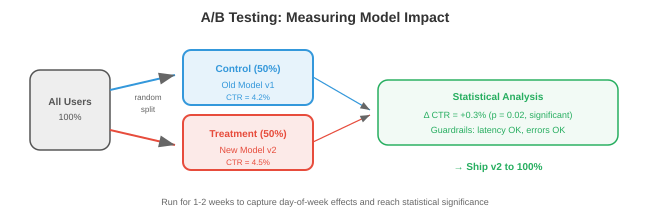

# ML系统设计

*ML系统设计将文件01-03中的基础设施模式应用于机器学习的特定挑战。本文件涵盖ML生命周期、数据管理、训练基础设施、模型评估、服务策略、特征工程、ML流水线和监控*

- 像"为YouTube设计一个推荐系统"这样的系统设计面试问题并不是要求你描述推荐算法。它要求你设计**整个系统**：数据流水线、特征工程、模型训练、评估、服务、监控和迭代。本文件提供了框架。

## ML系统生命周期


- 每个ML系统都遵循相同的生命周期，无论是垃圾邮件分类器还是基础模型：

```
问题定义 → 数据 → 特征 → 训练 → 评估 → 部署 → 监控 → 迭代
       ↑                                                        │
       └────────────────────────────────────────────────────────┘
```

### 问题定义

- 在接触数据或模型之前，先定义：
    - **预测什么？**（点击概率、下一个令牌、目标边界框）
    - **用户是谁？**（最终用户、内部分析师、其他ML模型）
    - **约束是什么？**（延迟<100ms、离线批量操作可以、必须在设备上运行）
    - **业务指标是什么？**（收入、参与度、准确率）以及ML指标如何与之关联？
    - **基线是什么？**（启发式方法、基于规则的系统、现有模型）——你必须击败它才能证明ML系统的价值。
- **常见错误**：在理解问题之前直接跳到模型架构。"我们应该使用Transformer"不是系统设计的答案。"我们需要在200ms内预测1000万个候选的点击概率，因此我们需要一个两阶段系统：快速检索然后一个小型排序模型"才是。

## 数据管理

### 数据收集和标注

- **显式标签**：人类标注数据（点击/不点击、目标边界框、对话质量评分）。昂贵（取决于复杂度，每个标签约$0.02-$10）、缓慢且主观。
- **隐式标签**：从用户行为中推导标签。点击、停留时间、购买、跳过。廉价且丰富，但有噪声（点击不意味着满意；跳过不意味着不喜欢）。
- **程序化标注**（Snorkel）：编写标注函数（启发式方法、正则表达式、现有模型），对每个样本进行投票。统计汇总投票以产生概率标签。可扩展到数百万样本，具有中等准确度。
- **主动学习**：模型识别最不确定的样本，并请求人工标注这些样本。这最大限度地提高了标注效率：1000个主动选择的标签可以匹配10000个随机标签的质量。

### 数据质量

- **数据验证**：检查每批传入数据的模式违反（字段缺失、类型错误）、分布偏移（平均值显著变化）和数量异常（预期100万行，收到50万行）。
- **Great Expectations**和**TFX Data Validation**是定义数据期望并在违反时发出告警的工具。
- **数据版本管理**：每次训练运行应该是可重现的。**DVC**（第15章）将数据文件与代码一起追踪。每个数据集版本获得一个哈希值；训练配置引用该哈希值。

### 特征存储


- **特征存储**（第15章）为训练和服务提供一致的特征。关键概念：
    - **离线特征**：从批处理流水线（Spark）计算，存储在数据仓库中。在训练和批量推理期间使用。示例：用户过去30天的平均会话时长、商品的总购买次数。
    - **在线特征**：实时计算或预先计算并从低延迟存储（Redis、DynamoDB）提供服务。在实时推理期间使用。示例：用户最近的5个操作、当前购物车内容。
    - **训练-服务偏差**：如果特征计算在训练和服务之间不同，模型在推理时看到的特征值与训练时不同。特征存储通过对两者使用相同的计算来消除此问题。

## 训练基础设施

- 对于本书的读者，分布式训练在第6章（数据并行、模型并行、混合精度、缩放定律）中已有深入介绍。这里我们关注**系统**方面：
- **实验跟踪**（W&B、MLflow——第15章）：每次训练运行记录超参数、指标、git提交、数据版本和硬件。这是模型版本控制的ML等价物。
- **超参数调优**：自动化搜索超参数。方法：网格搜索（穷尽，昂贵）、随机搜索（出奇地有效）、贝叶斯优化（对目标建模，在改进可能性高的地方采样）和**ASHA**（异步连续减半：启动许多试验，早期淘汰表现不佳的）。
- **训练流水线编排**（Airflow、Kubeflow——第15章）：自动化数据准备→训练→评估→注册的序列。安排每日重新训练。在失败时发出告警。

## 模型评估

### 离线评估

- **保留测试集**：在模型训练时从未见过的数据上评估。标准做法，但如果测试集不代表生产数据，可能会产生误导。
- **基于分片的评估**：在子组上评估（按用户人口统计、内容类型、语言、时间段）。一个总体准确率95%的模型可能在特定少数群体上的准确率只有70%——不可接受。
- **回测**：对于时间序列或顺序预测，按时间顺序在历史数据上进行评估。使用截至时间$t$的数据训练，在$t$到$t + \Delta t$的数据上评估。避免使用未来数据进行训练导致的数据泄露。

### 在线评估



- **A/B测试**：将实时流量随机分为对照组（旧模型）和实验组（新模型）。以统计显著性比较业务指标（收入、参与度、留存率）。评估ML变更的黄金标准。
    - **样本量**：你需要足够的数据来检测预期的效应量。点击率0.1%的改进需要数百万次展示才能以显著性检测到。
    - **时长**：运行至少一个完整周期（大多数产品1-2周）以捕获日-周效应。
    - **护栏指标**：监控不应变化的指标（页面加载时间、错误率、崩溃率）以及目标指标。一个增加收入但同时增加崩溃率的模型是净负面的。
- **影子部署**：在生产中与新模型并行运行旧模型。两者接收相同的请求，但只有旧模型的预测会提供给用户。比较输出。这能在不影响用户的情况下捕获bug和质量问题。
- **交错实验**：对于排序问题，将旧模型和新模型的结果交错在一个列表中。用户与交错列表交互，你测量哪个模型的结果获得更多参与。相比A/B测试需要更少的用户即可达到显著性。

## 模型服务

### 批量vs实时

- **批量推理**：预先计算所有可能输入的预测结果。存储在数据库/缓存中。从缓存提供服务。适用于：输入空间有限（每晚为所有用户推荐）、新鲜度不重要（每日预测即可）、延迟容忍度高。
- **实时推理**：按需为每个请求计算预测结果。适用于：输入空间无限（任何用户查询）、新鲜度重要（立即为此特定查询进行预测）、延迟必须低。
- 许多系统**两者都用**：批量预计算一组候选结果（便宜，覆盖80%的流量），实时处理其余部分（昂贵，覆盖尾部查询和新用户）。

### 模型版本管理和注册表

- **模型注册表**（MLflow、W&B、SageMaker）存储训练好的模型及其元数据：
    - 版本号和训练日期。
    - 训练配置和数据版本。
    - 评估指标（准确率、延迟、内存使用）。
    - 阶段：开发→预发布→生产→归档。
- **回滚**：如果新模型在生产中导致指标下降，立即恢复到前一个版本。注册表使这成为一键操作。

## 特征工程

- **特征工程**将原始数据转换为模型所需的输入。它通常是ML中杠杆率最高的活动：更好的特征能改进每个模型，而更好的模型受限于它们收到的特征。

### 在线vs离线特征

- **离线特征**是预先计算的，变化缓慢（用户人口统计、30天聚合）。由批处理流水线（Spark）计算，存储在特征存储中。
- **在线特征**反映当前状态，变化迅速（购物车中的商品、最近操作、当前位置）。从事件流实时计算或从快速存储中查找。
- **特征新鲜度**：某些特征需要秒级新鲜度（欺诈检测：此交易相对于最近5笔交易是否异常？）。其他的可以容忍小时级陈旧度（推荐：根据用户历史，该用户偏好什么类型？）。更新鲜的特征计算和服务更昂贵。

### 常见特征模式

- **计数特征**：时间窗口内的事件计数（过去7天的购买次数、过去24小时的登录次数）。
- **嵌入特征**：分类变量的学习嵌入（用户嵌入、商品嵌入、查询嵌入）。这些是双塔模型和类似架构的输入。
- **交叉特征**：两个或多个特征的组合（user_age × item_category）。捕获单个特征无法捕获的交互。
- **时间特征**：自上次操作以来的时间、星期几、一天中的小时。捕获时间模式。
- **聚合特征**：数值特征在某个组上的均值、中位数、最小值、最大值、标准差（此卖家的商品平均评分）。

## ML流水线

- ML流水线编排从数据到部署模型的整个工作流程：

```
数据摄入 → 验证 → 特征工程 → 训练 → 评估 → 注册 → 部署 → 监控
```

- 每个步骤是编排器（Airflow、Kubeflow、Metaflow——第15章）中的一个任务。流水线：
    - 按计划运行（每日重新训练）或触发运行（新数据可用）。
    - 是幂等的（重新运行产生相同结果）。
    - 有重试逻辑（如果特征计算失败，使用退避重试3次）。
    - 产生制品（训练好的模型、评估报告、特征统计），这些制品被版本化管理并存储。
- **Metaflow**（Netflix/Outerbounds）特别适合ML：它对代码、数据和模型一起进行版本管理，支持相同代码的本地开发和云执行，并与K8s和AWS集成。

## 监控

- 我们在第15章（Prometheus、Grafana、告警）中介绍了监控基础。这里我们关注**ML特定的监控**：

### 数据漂移

- **数据漂移**发生在传入数据的分布相对于训练数据发生变化时。在夏季数据上训练的模型可能在冬季数据上表现不佳（不同的用户行为、不同的产品可用性）。
- **检测**：使用统计测试比较传入特征分布与训练分布：
    - **KS检验**（Kolmogorov-Smirnov）：比较两个经验分布。检验它们是否来自相同的底层分布。
    - **PSI**（总体稳定性指数）：衡量分布偏移了多少。PSI < 0.1为稳定，0.1-0.25为中度偏移，> 0.25为显著偏移。
    - **嵌入漂移**：使用质心距离或MMD（最大均值差异）比较传入查询的嵌入分布与训练集。

### 概念漂移

- **概念漂移**发生在输入和输出之间的关系发生变化时。特征看起来相同，但正确的预测不同。示例：用户偏好在一场文化活动、流行病或产品变更后发生转变。
- 概念漂移比数据漂移更难检测，因为它需要带标签的数据。监控代理指标：点击率、转化率、用户满意度评分。持续下降可能表明概念漂移。

### 模型退化

- 模型会因多种原因随时间退化：数据漂移、概念漂移、特征流水线错误（特征开始返回空值）以及上游数据变化（第三方API更改其响应格式）。
- **响应**：检测到退化时，行动取决于严重程度：
    - 轻度：在最近数据上重新训练（定时重新训练可处理此情况）。
    - 中度：调查根本原因（哪个特征发生了变化？哪个用户群体受到影响？）。
    - 严重：立即回滚到以前的模型版本，然后调查。

### 反馈循环

- ML系统创建**反馈循环**：模型的预测影响用户行为，后者成为下一个模型版本的训练数据。这些循环可能是良性的，也可能是恶性的。
- **正反馈循环**（危险的）：推荐模型主要展示热门商品→用户点击热门商品（因为他们只看到这些）→模型了解到热门商品更受欢迎→多样性崩溃。模型创造了确认其偏见的数据。
- **负反馈循环**（也危险的）：欺诈检测模型捕获了所有A类欺诈→没有A类欺诈进入训练数据→下一个模型未学会检测A类→A类欺诈重新出现。
- **缓解措施**：
    - **探索**：展示一些模型不确定的商品（epsilon-greedy、Thompson采样）。这生成了多样化的训练数据。
    - **反事实日志记录**：记录模型*本会*预测的结果，而不仅仅是用户看到的结果。在反事实数据上训练以消除偏差。
    - **保留集**：随机将一部分流量用于无模型过滤的服务。未经过滤的数据为评估模型质量提供了真实依据。
    - **延迟标签**：在使用数据训练之前等待真实结果。今天点击的推荐可能明天就后悔。欺诈预测必须等待退款窗口（30-90天）。

### 嵌入表管理

- 大规模ML系统通常有包含1亿+条目的嵌入表（每个用户、商品、广告或实体一个嵌入）。大规模管理这些是系统挑战：
- **存储**：1亿实体×256维×float16 = 50 GB。不适合GPU内存。解决方案：存储在CPU内存中并配合GPU端缓存，跨多台机器分片，或使用**哈希嵌入**（将实体哈希到固定大小的表，接受冲突）。
- **更新**：嵌入随模型重新训练而变化。向服务部署新的嵌入表需要：在不中断实时流量时加载50 GB到内存，验证正确性，以及在指标下降时回滚。对嵌入表使用蓝绿部署。
- **陈旧度**：新创建的用户没有嵌入（冷启动问题）。解决方案：使用默认嵌入，通过特征到嵌入模型从用户特征派生嵌入，或回退到非个性化模型。

### 公平性和偏见

- ML系统可能会系统性地对待不同群体不同，通常反映了训练数据中的偏见。**公平性监控**是一种责任，不是可选功能。
- **监控指标**：
    - **人口统计均等**：不同群体（性别、种族、年龄）的正预测率是否不同？
    - **均等机会**：不同群体的真阳性率是否不同？（招聘模型应该同样擅长识别所有群体的合格候选人。）
    - **校准**：如果模型说P(合格) = 0.7对于群体A，那么群体A中实际上有70%是合格的吗？对于群体B也是同样？
- **实际步骤**：
    - 在分片（子组）上评估模型性能，而不仅仅是总体指标。
    - 在模型评估流水线中纳入公平性指标（一个提高总体准确率但降低特定群体性能的模型未经审查不应部署）。
    - 记录已知的限制和失败模式。
    - 为在敏感领域（招聘、贷款、刑事司法、医疗）部署的模型建立审查流程。
