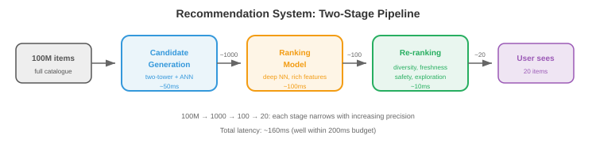

# ML设计示例

*学习ML系统设计的最佳方式是通过实操示例。本文件详细介绍了七个完整的设计：推荐系统、搜索排序、广告点击预测、欺诈检测、内容审核、对话式AI和大规模图像搜索*

- 每个示例遵循一致的框架：
    1. **问题定义**：我们在构建什么，用户是谁，约束是什么？
    2. **数据**：我们有什么数据，如何收集，如何标注？
    3. **特征**：模型需要什么特征？
    4. **模型**：什么架构和训练方法？
    5. **服务**：模型如何部署和提供服务？
    6. **评估**：我们如何衡量成功？
    7. **迭代**：随着时间的推移，我们会做哪些改进？

---

## 1. 推荐系统（例如YouTube、Netflix、Spotify）

### 问题定义

- **目标**：向用户展示他们会喜欢的内容，最大化参与度（观看时间、收听次数、点击量）。
- **规模**：10亿+用户，1亿+项目，每秒10K+推荐。
- **延迟**：完整推荐流水线<200ms。
- **关键挑战**：候选空间巨大（1亿个项目）。无法为所有用户实时评分所有项目。

### 架构：两阶段流水线



```
1亿个项目 → 候选生成（快速、粗略）→ 1000个候选
          → 排序（缓慢、精确）→ 100个排序项目
          → 重新排序（业务规则）→ 展示给用户的20个
```

### 候选生成

- **目标**：将1亿个项目减少到约1000个候选。必须快速（<50ms）。
- **双塔模型**：将用户和项目编码到相同的嵌入空间。用户嵌入捕获偏好；项目嵌入捕获内容特征。得分 = 用户嵌入和项目嵌入的点积。
- **训练**：在（用户、正样本、负样本）三元组上进行对比学习。正样本=用户参与过的项目。负样本=随机项目+难负样本（用户未参与过的热门项目）。
- **服务**：预先计算所有项目嵌入。在请求时：计算用户嵌入，ANN搜索（向量数据库中的HNSW）以找到最近的1000个项目嵌入。

### 排序

- **目标**：精确评分1000个候选。可以花费约100ms。
- **模型**：一个深度神经网络（MLP或Transformer），使用丰富特征：用户特征（人口统计、历史、上下文）、项目特征（内容、流行度、新鲜度）和交叉特征（用户-项目交互历史、上下文相关性）。
- **输出**：预测的参与概率（点击、观看50%+、点赞、分享）。多个目标可以组合：$\text{score} = w_1 \cdot P(\text{点击}) + w_2 \cdot P(\text{观看}) + w_3 \cdot P(\text{点赞})$。

### 重新排序

- 应用业务规则：多样性（不展示来自同一创作者的5个视频）、新鲜度（提升新内容）、安全（过滤被标记的内容）和个性化探索（展示一些用户可能发现的低排名项目）。

### 粗略估算数字

- **项目嵌入索引**：1亿个项目×256维×float16 = 50 GB。HNSW索引增加约2倍开销→约100 GB。适合具有128 GB内存的单台机器，或分片到4×32 GB机器。
- **用户嵌入计算**：每个用户约5ms（小型MLP处理用户特征）。在10K QPS下，需要约50个模型副本处理负载。
- **ANN搜索**：使用HNSW从1亿个向量中搜索前1000个约需2ms。在10K QPS下，每个索引副本处理约500 QPS→需要20个副本。
- **排序模型**：1000个候选×每个候选约0.1ms = 每次请求100ms。在10K QPS下，需要每秒1000 GPU秒→仅排序就需要约10个A10G GPU。
- **总基础设施**：约20个嵌入索引副本+约50个用户嵌入服务器+约10个排序GPU+缓存+负载均衡器。成本：云价格下每月约$5万-$10万。

### 冷启动

- **新用户**（无历史记录）：使用人口统计特征、设备/位置上下文和基于流行度的推荐。经过5-10次交互后，切换到个性化模型。
- **新项目**（无参与数据）：使用基于内容的特征（标题、描述、缩略图嵌入）。分配探索预算：向一部分用户展示新项目以快速收集参与数据。在经过提升期后仍无参与的项目被降级。
- **冷启动是系统问题**：特征存储必须优雅地处理缺失特征（返回默认值，而不是错误）。模型必须使用缺失特征进行训练（训练期间对用户历史特征进行dropout可以模拟新用户）。

### 评估

- **离线**：NDCG（归一化折损累计增益）、Recall@K、Precision@K。
- **在线**：测量观看时间、DAU、留存的A/B测试。长期A/B测试（数周）以捕获短期测试无法观察到的用户留存效应。

---

## 2. 搜索排序（例如Google、Bing）

### 问题定义

- **目标**：给定用户查询，从数十亿文档的语料库中返回最相关的结果。
- **延迟**：总计<500ms（检索100ms + 排序200ms + 渲染100ms + 开销）。

### 架构：查询理解→检索→排序

### 查询理解

- 在检索之前，处理原始查询以改进结果：
- **拼写纠正**："reccomendation systm"→"recommendation system"。使用编辑距离模型或序列到序列模型，在（拼写错误，纠正）对上训练，数据来自搜索日志。
- **查询扩展**：添加相关术语以提高召回率。"Python ML"→"Python machine learning scikit-learn pytorch。"使用同义词词典、词嵌入或LLM生成扩展。
- **意图分类**：确定用户想要什么。"buy Nike shoes"是**交易型**（展示产品页面）。"How does backpropagation work"是**信息型**（展示文章）。"facebook.com"是**导航型**（直接转到网站）。不同意图应触发不同的检索策略和结果布局。
- **实体识别**：从查询中提取实体。"best restaurants near Times Square"→位置："Times Square"，实体类型："restaurants。"路由到位置感知搜索流水线。

### 检索

- **BM25**（传统）：使用倒排索引进行词匹配检索。快速，对关键词查询有效。没有语义理解（"dog food"不匹配"canine nutrition"）。
- **稠密检索**：将查询和文档编码为嵌入（使用如DPR或ColBERT的双编码器）。通过ANN搜索检索。捕获语义相似性（"dog food"匹配"canine nutrition"）。比BM25慢，但对于自然语言查询更好。
- **混合检索**：结合BM25和稠密检索。BM25找到精确关键词匹配；稠密检索找到语义匹配。合并并去重。两全其美。

### 排序

- **学习排序**：一个模型对每个（查询，文档）对评分。三种方法：
    - **点式**：独立预测每个文档的相关性分数。简单但忽略相对顺序。
    - **成对式**：预测两个文档中哪个更相关。LambdaMART（梯度提升树）是经典方法。
    - **列表式**：直接针对列表级指标（NDCG）优化整个排序列表。更复杂但结果最好。
- **交叉编码器**：一个以`[查询，文档]`为输入并输出相关性分数的Transformer。比双编码器更准确（后者独立编码查询和文档），因为它捕获了细粒度的交互。但对于完整语料库来说太慢——仅用于对检索前100-1000个候选进行重新排序。

### 特征

- **查询特征**：查询长度、语言、意图分类（导航型、信息型、交易型）。
- **文档特征**：PageRank、新鲜度、内容质量分数、域名权威性。
- **查询-文档特征**：BM25分数、嵌入相似度、精确匹配数、历史日志中此（查询，文档）对的点击率。

---

## 3. 广告点击预测

### 问题定义

- **目标**：预测用户点击广告的概率。这决定在实时拍卖中出价多少。
- **规模**：每秒100K+次拍卖，每次预测需在10ms内完成。
- **收入影响**：点击预测准确率提高0.1%就相当于数百万的额外收入。

### 架构

- **特征工程**是广告系统的核心。特征包括：
    - **用户特征**：人口统计、浏览历史、购买历史、设备、位置、一天中的时间。
    - **广告特征**：创意（图片/文字）、广告主、类别、历史CTR、出价金额。
    - **上下文特征**：页面内容、广告位置、设备类型、连接速度。
    - **交叉特征**：user_category×ad_category交互，user_region×ad_campaign交互。
- **模型**：历史上用逻辑回归（简单、快速、可解释）。现代系统使用深度学习：**DLRM**（深度学习推荐模型），对分类特征使用嵌入表，对稠密特征使用MLP。
- **校准**：预测概率必须准确（如果模型说P(点击)=0.05，那么实际上应该有5%的展示被点击）。校准至关重要，因为预测概率直接决定出价金额。
- **探索-利用**：总是展示预测的最佳广告在长期来看是次优的（你永远无法发现新广告可能更好）。Thompson采样或$\epsilon$-greedy探索确保有一部分展示分配给不确定性较高的广告以收集数据。

### 实时竞价

- 当用户加载页面时，广告拍卖在<100ms内进行：
    1. 发布者向多个广告交易平台发送竞价请求（用户信息、页面上下文）。
    2. 每个广告主的竞价服务器预测其广告的CTR。
    3. 出价 = CTR × 每次点击的价值。出价高的赢得拍卖。
    4. 获胜的广告被展示；如果被点击，广告主付费。

---

## 4. 欺诈检测

### 问题定义

- **目标**：实时检测欺诈性交易（信用卡欺诈、账户盗用、虚假评论）。
- **延迟**：<100ms（交易必须在支付处理前被批准或标记）。
- **关键挑战**：极端类别不平衡（欺诈率0.1%）。误报会阻止合法用户；漏报会造成金钱损失。

### 架构


### 特征

- **交易特征**：金额、货币、商户类别、一天中的时间、是否跨国。
- **用户特征**：账户年龄、平均交易金额、近期交易次数、设备指纹。
- **速度特征**（实时，来自流处理流水线）：过去5分钟内的交易次数、过去1小时内的不同商户数、与上次交易的地理距离。
- **图特征**：此商户是否与已知欺诈团伙有关联？此设备是否与被标记账户共享？

### 模型

- **梯度提升树**（XGBoost、LightGBM）是表格数据欺诈检测的标准。它们处理混合特征类型、可解释（特征重要性）且训练快速。
- **处理不平衡**：对多数类进行欠采样、对少数类进行过采样（SMOTE），或在损失函数中使用类别权重。Focal loss（第8章）降低简单负样本的权重。
- **成本矩阵**：误报（阻止合法交易）有成本（用户挫败感、销售损失）。漏报（遗漏欺诈）有不同的成本（财务损失）。决策阈值应最小化总预期成本，而非最大化准确率。

### 人在回路中

- 不确定的预测（模型置信度在0.3和0.7之间）发送给人工审核员。审核员的决策成为重新训练的标签。这创建了一个反馈循环：随着模型看到更多标记的欺诈案例，它随着时间的推移而改进。

---

## 5. 内容审核

### 问题定义

- **目标**：自动检测并移除有害内容（仇恨言论、暴力、虚假信息、CSAM）从一个平台。
- **规模**：每天数十亿条帖子（文本、图片、视频）。
- **挑战**：上下文依赖（讽刺、戏仿、文化细微差别）。必须在言论自由和安全之间取得平衡。

### 架构

- **多模态分类**：文本、图片和视频分别使用单独的模型，加上融合层组合它们的信号。
- **文本审核**：微调的语言模型将文本分类为类别（骚扰、仇恨言论、虚假信息、垃圾信息）。多语言模型处理100+种语言。
- **图片审核**：视觉模型检测：露骨内容（裸体、暴力）、图片中的文字（OCR+文本分类器）和已知有害内容（哈希匹配与已知CSAM数据库进行比对）。
- **视频审核**：按固定间隔采样帧，对每帧运行图像分类器，结合音频转录（ASR→文本分类器）。
- **策略即代码**：审核策略以结构化规则定义，将模型输出映射到操作：

```python
if text_model.hate_speech_score > 0.9:
    action = "remove"
elif text_model.hate_speech_score > 0.7:
    action = "human_review"
else:
    action = "allow"
```

- 策略频繁更改（新法规、不断发展的规范）。将策略与模型分离确保可以在不重新训练的情况下部署更改。

### 主动vs被动审核

- **主动审核**（发布前）：在内容上线前运行分类器。高置信度违规自动阻止。这防止了有害内容被看到，但会增加发布延迟并存在误报风险（阻止合法内容）。
- **被动审核**（发布后）：内容立即上线。用户可以举报违规。举报触发分类器+人工审核。发布者延迟低，但有害内容在检测到之前是可见的。
- **大多数平台两者都用**：对高严重性类别（CSAM：零容忍，发布前阻止）使用主动审核，对细微类别（虚假信息：需要人工判断，收到举报后审核）使用被动审核。

### 哈希匹配

- 对于已知有害内容（CSAM、恐怖主义宣传），使用**感知哈希**：计算对微小修改（裁剪、调整大小、压缩）鲁棒的图像/视频哈希值。与已知有害内容数据库（NCMEC的哈希数据库、GIFCT共享哈希数据库）进行比较。匹配→立即移除，无需分类器。
- **PhotoDNA**（微软）是CSAM检测的标准感知哈希。在许多司法管辖区这不仅是技术选择，更是法律义务。

### 粗略估算数字

- **规模**：每天10亿条帖子=约12K帖子/秒。每个帖子需要：文本分类（约5ms）、图片分类（约20ms）、哈希匹配（约1ms）。在12K QPS下：需要约60个文本分类器、约240个图片分类器和约12个哈希匹配器（加上冗余）。
- **人工审核**：如果2%的帖子被标记审核=每天2000万条。以每人每天100条审核计，需要20万审核员（这就是自动化准确率至关重要的原因：误报每降低0.1%就能每天节省100万条审核）。
- **延迟预算**：主动审核必须在发布流水线内完成（约500ms）。文本（5ms）+ 图片（20ms）+ 哈希（1ms）+ 开销=远在预算之内。视频是例外：即使从10分钟视频中每秒采样1帧，也需要600次分类器调用→异步处理。

### 升级工作流

- 自动移除→人工审核上诉→专家审核（法律、文化专家）→政策团队处理模糊案例。每个级别处理的案例更少但更细致。
- **反馈给模型**：人工审核决策是重新训练的最高质量标签。模型和审核员之间的分歧被优先用于主动学习——它们代表了模型处理最差的案例。

---

## 6. 对话式AI（基于RAG的聊天机器人）

### 问题定义

- **目标**：一个能回答关于公司产品问题的聊天机器人，使用其文档。
- **要求**：准确（不产生幻觉）、引用来源、处理后续问题、保持在产品领域内。


### 架构：检索增强生成（RAG）

```
用户查询 → 查询嵌入 → 向量搜索（文档）→ Top-K块
                                                      ↓
用户查询 + 检索到的块 → LLM → 响应（含引用）
```

### 组件

- **文档摄入**：将文档分块并嵌入。**分块策略**非常重要：
    - **固定大小分块**：每N个令牌（如500）分割，M个令牌（如50）重叠。简单，块大小可预测，但可能在句子中间或段落中间分割，丢失上下文。
    - **语义分块**：在段落或章节边界分割。每个块是一个连贯的信息单元。大小可变（有些块100个令牌，其他800个），需要检索系统处理可变长度。
    - **递归分块**：尝试在段落边界分割。如果段落太长，在句子边界分割。如果句子太长，在固定大小分割。连贯性和大小一致性的最佳平衡。
    - **嵌入**：用文本编码器（如E5、BGE、Cohere embed）嵌入每个块。存储在向量数据库中。
- **检索**：嵌入用户查询，搜索向量数据库中最相似的$k$个块（通常$k = 5$-$10$）。可选地使用交叉编码器重新排序以提高精度。
- **生成**：构建包含检索块作为上下文的提示：

```
系统：你是一个有用的助手。仅基于提供的上下文回答。
如果答案不在上下文中，请说"我不知道。"

上下文：
[块 1]
[块 2]
...

用户：{问题}
```

- **护栏**：防止LLM回答产品领域外的问题、生成有害内容或与检索到的上下文相矛盾。实现为：输入过滤（拒绝离题查询）、输出过滤（检查响应是否与检索到的上下文一致）和宪法提示（指示模型拒绝某些请求）。
- **对话记忆**：维护最近$n$轮对话。将其包含在提示中，使模型能理解后续问题（"定价如何？"→需要关于哪个产品的先前上下文）。

### 查询重写

- 用户经常问模糊的后续问题："定价如何？"（什么产品的定价？）。**查询重写**使用对话历史生成独立查询：
    - 输入：对话历史 + "定价如何？"
    - 重写后："产品X的企业版定价是多少？"
- 这个重写后的查询才是被嵌入并在向量数据库中搜索的。如果没有重写，检索会搜索"定价"而没有上下文，返回不相关的块。
- 查询重写可以用小型LLM调用（约50ms）或微调的序列到序列模型（约5ms）完成。

### 粗略估算数字

- **文档语料库**：10K页，每页平均2000个令牌=2000万令牌。以每块500个令牌、50个重叠计=约44K个块。
- **嵌入索引**：44K块×768维×float16=约65 MB。轻松适合内存。即使1000万个块也仅约15 GB。
- **延迟分解**：查询嵌入（5ms）+ 向量搜索（2ms）+ 交叉编码器重新排序（前50个20ms）+ LLM生成（500-2000ms）= 总计约600-2100ms。LLM占主导地位。使用流式传输减少感知延迟。
- **成本**：以$3/100万令牌（Claude/GPT-4 API）计，每天1000次查询、每次约2000个令牌=约$6/天。大规模（每天100万次查询）下，在2个A10G GPU上自托管7B模型（约$50/天）可实现100倍成本降低。

### 评估

- **检索质量**：Recall@K（前K个块是否包含答案？）、MRR（平均倒数排名）。
- **生成质量**：事实准确性（响应是否匹配检索到的上下文？）、有依据性（响应是否引用了正确块？）、答案相关性。
- **端到端**：用户满意度（赞/踩）、转接给人工客服的比率。

---

## 7. 大规模图像搜索

### 问题定义

- **目标**：给定一张图像，从10亿+图像的语料库中找到视觉上相似的图像。
- **应用**：反向图像搜索、产品搜索（照片→匹配的产品）、重复检测。
- **延迟**：<500ms（包括网络往返时间）。

### 架构

```
查询图像 → 嵌入模型（ViT/CLIP）→ 512维向量 → ANN搜索 → Top-K结果
```

### 嵌入提取

- **模型**：预训练的视觉编码器（ViT、CLIP的图像编码器、DINOv2）。如果需要，在特定领域（时尚、电商、医学影像）上进行微调。
- **训练**：对比学习（第10章）。正样本对=同一图像的不同视角（或图像+匹配的文本）。负样本对=随机图像。模型学习为相似图像生成相似嵌入，为不同图像生成不同嵌入。

### 索引

- **离线**：嵌入所有10亿张图像并构建ANN索引。对于HNSW（文件03），构建索引需要数小时，索引存储在内存中（10亿×512维×float16 + 图开销约128 GB）。
- **分片**：将索引拆分成跨多台机器。每台机器持有一个分片。查询时，并行搜索所有分片并合并前K个结果。
- **增量更新**：新图像（上传、新产品）必须添加到索引中。HNSW支持增量插入而无需重建。向量数据库（Milvus、Pinecone）原生处理此需求。

### 服务

- **嵌入服务**：运行ViT模型的GPU服务器。延迟：每张图像约20ms。批量处理多个查询以提高吞吐量。
- **搜索服务**：ANN索引服务器。延迟：对于10亿向量中搜索前100个（使用HNSW）约10ms。
- **缓存**：缓存热门查询的结果。对于重复检测，缓存最近上传的图像的嵌入，在搜索完整索引之前将新上传与缓存进行比较。

### 评估

- **Precision@K**：前K个结果是否实际相似？
- **Recall@K**：在语料库中所有真正相似的图像中，有多少在前K个中？
- **平均精度均值（mAP）**：精确率-召回率曲线下的面积。
- **人工评估**：对于主观相似性，人工评分员判断检索到的图像是否相关。

---

## 面试框架

- 当你遇到系统设计问题时，遵循此框架：
1. **澄清需求**（2-3分钟）：询问规模、延迟、一致性要求和边缘情况。"多少用户？可接受的延迟是多少？故障时会发生什么？"
2. **高层设计**（5-7分钟）：画出主要组件及其交互。从正常路径开始。使用文件01-03中的模式。
3. **深入探讨**（15-20分钟）：选择最有趣/最具挑战性的组件并详细设计。这是你展示深度的地方。对于ML系统，深入探讨通常涉及：模型架构、特征流水线或服务架构。
4. **评估和监控**（3-5分钟）：你如何衡量成功？可能出什么问题？你如何检测和响应问题？
5. **迭代**（2-3分钟）：如果有更多时间/资源，你会改进什么？这表明你理解权衡并能设定优先级。

- **面试官看中的**：结构化思维（不是直接跳到解决方案）、权衡意识（每个选择都有代价）、实践知识（你确实构建过系统）和沟通能力（你能清晰解释你的设计吗？）。
